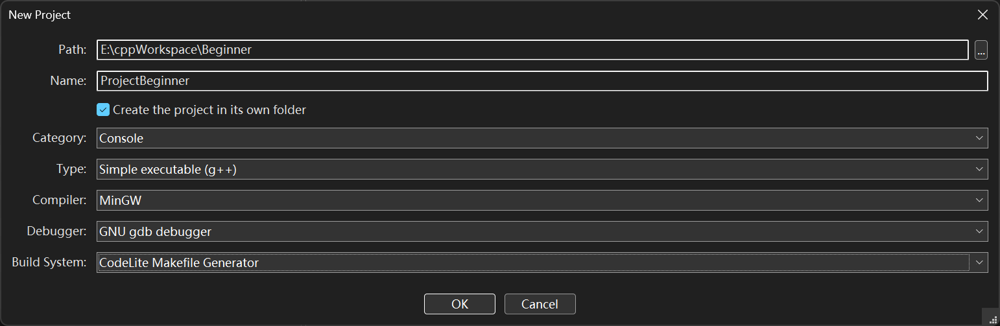
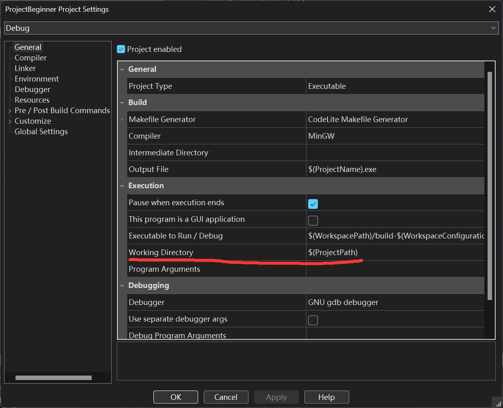
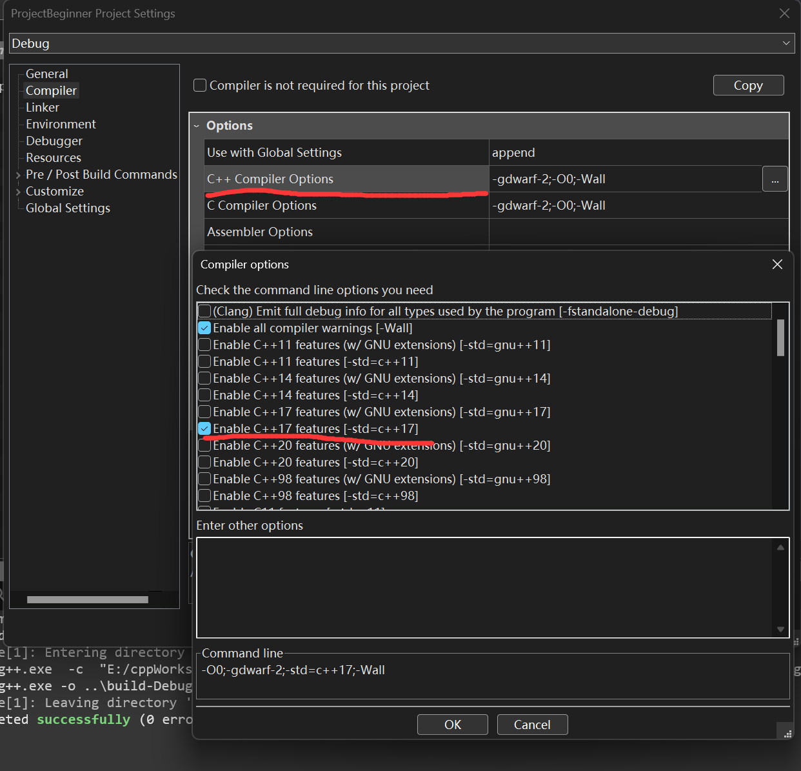
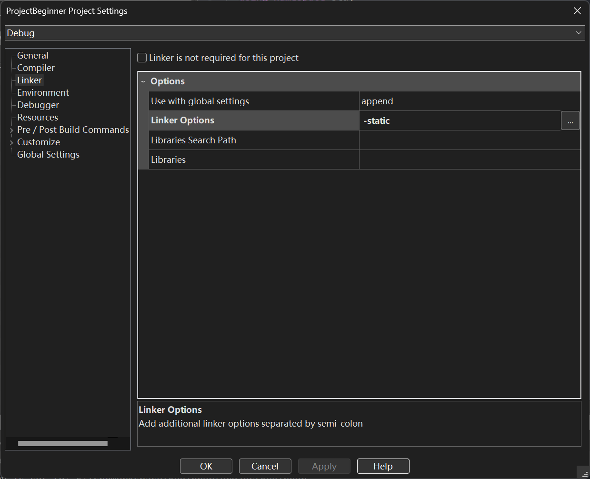
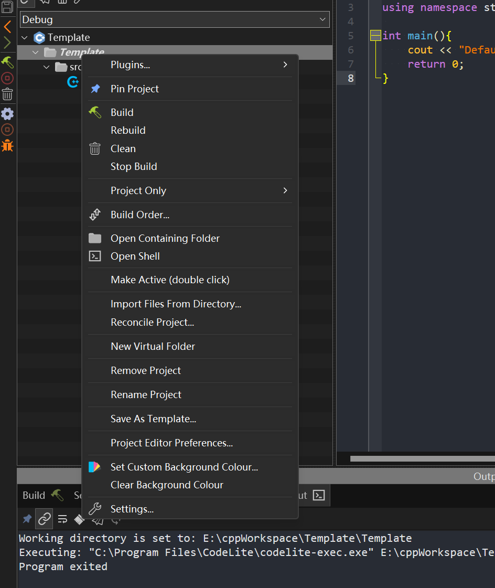
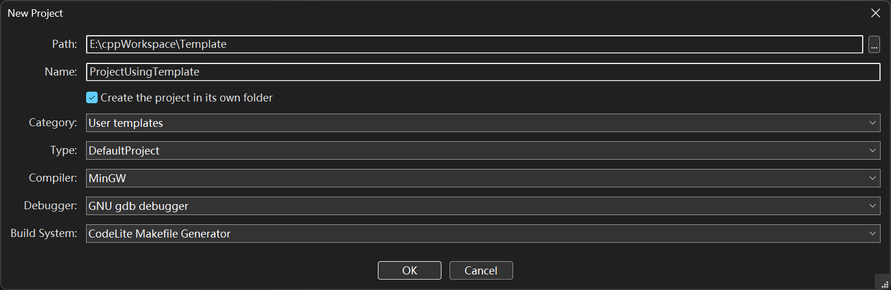
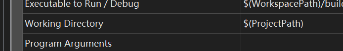

# 1. MinGW

www.winlibs.com/#download-release

* 解压
* ./mingw64/bin 添加环境变量

## Test

Command Prompt

> g++ --version


# 2. Codelite

## download

codelite.org

## setting

* setting
* build\ setting
* Add an existing compiler

## Workspace

> 注意，想要创建新的workspace就应该先在上面一排中workspace按钮->close workspace

一般的项目分层为workspace-project-file

在创建Project时会要求选择Category，目前我们是在命令行运行，因此是Console



对Project右键setting，更改dic



添加c++17标准支持



避免查找DLL和窗口方面的问题



## 设置Project模板



选择save as template



==现在有一个bug，其Working Directory仍然需要自行设置==



# 3.使用txt编程

* 使用txt编程
* 保存为cpp
* 命令行编译生成一个可执行文件main.exe:

```c++
g++ -Wall -std=c++14 main.cpp -o main.exe
```

* 直接命令行输入main即可执行main.exe
