# 20. STL

## 20.1 Overview

* **What is STL**
* **Generic programming(泛型编程)/Meta programming**
  * **preprocessor macros**
  * **Function templates**
  * **Class templates**
* **STL Containers**
* **STL Iterators**
* **STL Algorithms**
* **Array**
* **Vector**
* **Deque**
* **List and Forward List**
* **Set and Multi Set**
* **Map and Multi Map**
* **Stack and Queue**
* **Priority Queue**
* **Algorithms**


## 20.2 What is STL

### 20.2.1 STL的三个主要组件

* **Container**
  * Collections of **objects or primitive types**(原始类型和自建对象的集合)
  * Collections of **objects or primitive types** - 存储对象或原始类型的集合。容器是用来管理一组对象的数据结构。C++ STL提供了多种容器，如vector、list、deque、set、map等，每种容器都有其特定的用途和性能特点。
* **Algorithms**
  * Functions for processing sequences of **elements from containers**
  * 用于处理容器中元素序列的函数。算法是一组模板函数，用于执行诸如搜索、排序、计数、遍历和转换等操作。
* **Iterators**
  * Generate sequences of element from containers
  * 从容器生成元素序列的对象。迭代器是一种使得算法能够独立于它们所操作的容器的机制。迭代器提供了访问容器中元素的方法，并能够在容器的元素之间进行遍历。


### 20.2.2 STL的次要组件

* **实用工具（Utilities）**

  - STL提供了一系列模板类和函数，如`std::pair`和`std::tuple`，**它们允许将多个值组合成单一对象**。

    - `std::pair`可以存储一对值。 
    - `std::tuple`可以存储多个值。

  - ```c++
    std::pair<int, std::string> result(100, "Alpha");
    std::cout << result.first << ", " << result.second << std::endl; // 
    ```

* **绑定器（Binders）**

  * 绑定器是特殊类型的函数对象，用于将函数操作与其参数绑定。

    *  `std::bind`函数可以将一个二元函数转换为一元函数，通过绑定某个参数到一个特定的值。

  * ```c++
    auto is_positive = std::bind(std::greater<int>(), std::placeholders::_1, 0);
    std::cout << std::boolalpha << is_positive(-5) << std::endl; // 输出: false
    ```

*  **函数对象（Function Objects/Functors）**

  * 函数对象，也称为仿函数，是重载了函数调用操作符`operator()`的类的实例。它们可以像函数一样被调用，并且可以保持状态。

  * ```c++
    struct Increment {
      int operator()(int n) { return ++n; }
    };
    Increment inc;
    std::cout << inc(5); // 输出: 6
    ```

* **分配器(Allocators)**

  * 分配器是用于定义容器如何分配和释放内存的对象。

    * `std::allocator`是最常用的分配器。

  * ```c++
    std::allocator<int> a;
    int* ints = a.allocate(10); // 分配10个整数的空间
    a.deallocate(ints, 10); // 释放空间
    ```

* **内存函数(Memory Functions)**

  * STL提供了一组内存操作函数，如`uninitialized_copy`和`uninitialized_fill`，它们用于在未初始化内存上构造对象。

    * 这些函数通常用于性能敏感的代码，需要直接在原始内存上操作。

  * ```c++
    std::vector<int> v(5);
    std::uninitialized_fill(v.begin(), v.end(), 10);
    // v 现在是 {10, 10, 10, 10, 10}
    ```

* **适配器(Adaptors)**

  * 适配器是一种设计模式，用于将一个类的接口转换成客户端期望的另一个接口。STL中的适配器可以修改容器或函数对象的行为。

  * 适配器用于改变容器或函数对象的接口，使其适应不同的情况。 

    - 容器适配器如`std::stack`，`std::queue`和`std::priority_queue`改变基础容器的行为。
    - 函数适配器如`std::bind`和`std::not1`可以改变函数对象的调用方式。

  * ```c++
    std::stack<int> s(std::deque<int>{1, 2, 3});
    std::cout << s.top(); // 输出: 3
    ```


### 20.2.2 Containers

分为三类

* **Sequence containers**(序列容器)：维护插入元素顺序的容器
  * array,vector,list, forward_list, deque
* **Associative containers**（关联容器）：按预定义的顺序插入元素，或者不按顺序插入元素
  * set, multi set, map, multimap
* **Container adapters**（容器适配器）是容器的变种，
  * 这个类别不支持迭代器，这意味着它本来不能使用stl算法，但是因为过于常用，stl在之后对他们提供了支持
  * stack, queue, priority queue


### 20.2.3 Iterators

迭代器是一种类似于指针的对象，用于访问容器中的元素。在C++标准模板库（STL）中，迭代器分为几种类型，每种类型都支持不同的操作集。

#### 输入迭代器（Input Iterators）

- **介绍**：输入迭代器支持对数据的单向访问，只能进行读取操作。它们通常用于从数据流中读取数据。

- ```c++
  std::vector<int> vec{1, 2, 3};
  std::istream_iterator<int> in(std::cin), eof;
  std::copy(in, eof, std::back_inserter(vec));
  ```

#### 输出迭代器（Output Iterators）

- **介绍**：输出迭代器支持对数据的单向访问，只能进行写入操作。它们通常用于向数据流中写入数据。

- ```c++
  std::vector<int> vec{1, 2, 3};
  std::ostream_iterator<int> out(std::cout, " ");
  std::copy(vec.begin(), vec.end(), out);
  ```

#### 前向迭代器（Forward Iterators）

- **介绍**：前向迭代器支持读写操作，并且可以多次遍历容器。它们至少可以进行单向移动。

- ```c++
  std::forward_list<int> flist{1, 2, 3};
  for(auto it = flist.begin(); it != flist.end(); ++it) {
    std::cout << *it << " ";
  }
  ```

#### 双向迭代器（Bidirectional Iterators）

- **介绍**：双向迭代器支持在两个方向上移动，即可以向前也可以向后。适用于如双向链表这样的数据结构。

- ```c++
  std::list<int> lst{1, 2, 3};
  for(auto it = lst.rbegin(); it != lst.rend(); ++it) {
    std::cout << *it << " ";
  }
  ```

#### 随机访问迭代器（Random Access Iterators）

- **介绍**：随机访问迭代器提供了最丰富的功能，支持读写、多次遍历、双向移动，并且可以进行跳跃式访问，类似于数组的下标操作。

- ```c++
  std::vector<int> vec{1, 2, 3};
  auto it = vec.begin();
  it += 2; // 跳到第三个元素
  std::cout << *it; // 输出: 3
  ```

每种迭代器类型都是对前一种迭代器功能的扩展。例如，前向迭代器是输入迭代器的超集，双向迭代器是前向迭代器的超集，随机访问迭代器是双向迭代器的超集。这种层次结构允许算法根据所需的迭代器类型来操作不同的容器。


### 20.2.4 Algorithms

一共有60+个算法

算法分为两大类，Modifying和Non-Modifying，根据算法是否修改了序列而分类


### 20.2.5 泛型编程(Generic Programming)

==首先需要明确，当你需要若干类型使用同一个实现时，你使用泛型编程==

==当你需要对若干类型都要有其独立实现时，你使用重载==


我们使用Macros（宏），Function Template和Class Template都可以实现泛型编程。

#### 20.2.5.1 Macros（宏）

==Macros通常在C中使用，在C++中我们有更好的选择。==


宏是预处理器指令，它们在编译之前就被处理。宏可以用来定义常量、条件编译以及简单的代码片段。

**作用**:

- **代码重用**：通过宏定义，可以在多个地方重用相同的代码片段。
- **条件编译**：可以根据不同的编译环境来包含或排除代码部分。
- **简化代码**：可以用宏来简化复杂的表达式或代码结构。

**局限性**:

- **类型不安全**：宏不进行类型检查，可能会导致类型错误。
- **调试困难**：宏展开后的代码可能很难调试。
- **作用域问题**：宏没有作用域的概念，容易造成命名冲突。

##### ==1. 使用宏完成泛型编程==

* 宏定义并不知道类型，只是简单的将所有宏替换

```c++
#define MAX_SIZE 100
#define PI 3.14159
```

* 预处理器首先从代码中删除#定义的语句
* 遍历程序，用我们定义的值替换使用的名称
* 对于上面的使用，我们更倾向于constant，因为常量是类型化的，编译器知道他们。

**因为宏定义中的数值都是没有类型的**，因此我们可以使用于泛型编程

```c++
#define MAX(a,b) ((a>b)?a:b)
```

* 在使用中，MAX(a,b)会被替换成定义好的表达式或是block


宏定义并没有那么好用，因为它封装了一段处理，但是没有封装完全。

```c++
#define SQUARE(a) a*a

result = SQUARE(5); //result = 25

result = 100/SQUARE(5); //期望是4，结果给出100/5*5=100

//应该写成
#define SQUARE(a) ((a)*(a))
```

虽然我们可以人为避免，但是这使得过程更加难用，这相当于我们在干应该是编译器干的事情（语法），这是不值得的

**为此我们最好使用template**


#### 20.2.5.2 Function Templates（函数模板）

函数模板允许编写与类型无关的函数代码。

**作用**:

- **类型安全**：模板在实例化时会进行类型检查，提高代码安全性。
- **自动类型推导**：C++11及以后的版本支持自动类型推导，简化了模板的使用。
- **代码复用**：一个函数模板可以用于多种数据类型，减少了代码重复。

**局限性**:

- **编译时间增加**：模板的实例化会增加编译时间。
- **代码膨胀**：每个实例化的模板都会生成一份代码，可能会导致编译后的程序体积增大。
- 编译器提供的错误会十分难理解

##### ==1. 使用函数模板完成泛型编程==

使用模板的想法是，我们用占位符类型定义一个模板，然后在需要时插入我们所需要的类型，**然后编译器生成我们需要的特定函数或者类**。因此函数模板是一个蓝图。


值得注意的是，这个过程**发生在compile time而非run time**，这意味着实际上并不是dynamic的，是更高级的宏。不是dynamic的有很多好处，例如编译器可以在程序执行之前为我们执行类型检查。


**所谓“泛型”，意思就是我们提供了类和函数的泛型表示，然后编译器为我们编写实际的函数或类。**


```c++
template <typename T> // 告诉编译器下面什么是用户定义的
T max(T a, T b){
    return (a>b)?a:b;
}
```

以上部分不会产生任何代码，它只是一个模板。在用户使用模板的专用版本之前，编译器不会生成代码。

```c++
int a{10},b{1};

std::cout << max<int>(a,b);
```

通常编译器能够推导出实际的类型，因此我们甚至可以不提供类型，但是不推荐这样做，这样使得代码可读性变差

```c++
std::cout << max(a,b);
```


当然，这个指定参数的个数并没有限制

```c++
template <typename T1, typename T2>
void func(T1 a, T2 b){
    std::cout << a << " " << b;
}

func<int, double> (10,20.2);
func('A',20.2);//编译器推理其类型
```


Template并不是万能的，例如如果我们重载流

```c++
std::ostream &operator<<(std::ostream &os, const Person &p){
    os << p.name;
    return os;
}
```

这个是不能用template写的，因为每个类的功能不一样，我们需要实现独有的类。


#### 20.2.5.3 Class Templates（类模板）：==.h only==

类模板允许创建可以处理任何类型的类。

==类模板必须将所有东西都包含在类的头文件内！考虑到我们是在创建一个模板，这是十分正常的。如果我们将函数实现放在.cpp中，我们就会遇到各种各样的问题。==

**作用**:

- **强类型**：类模板实例化时会进行类型检查，确保类型安全。
- **灵活性**：可以为特定类型提供模板特化，优化性能或行为。
- **代码复用**：可以用同一个类模板定义处理不同数据类型的类，提高代码复用性。

**局限性**:

- **复杂性**：类模板可能会变得相当复杂，特别是当涉及到模板参数的默认值、模板特化和模板元编程时。
- **难以理解**：对于初学者来说，类模板的语法和概念可能比较难以掌握。

在泛型编程中，宏通常用于简单的代码替换和条件编译，而函数模板和类模板则是实现类型安全、可重用和灵活的代码设计的主要手段。随着C++语言的发展，模板的使用越来越受到推崇，而宏的使用则越来越受到限制，因为它们缺乏类型安全性和作用域控制。

##### 1. 使用类模板完成泛型编程

类模板意味着泛型属性，泛型构造函数，泛型析构函数，泛型method

类模板可以十分复杂！想想看带有继承，多态的类模板

考虑如下类

```c++
class item{
private:
    std::string name;
    int value;
    
public:
    Item(std::string name, int value)
    	:name{name}, value{value}
    {
        
    }
    
    std::string get_name() const {return name;}
    int get_value() const {return value;}
}
```

如果我们期待我们的Item类能hold any type of data in addition to the string

* 当然，首先我们不可能重载类名
* 其次我们不希望使用dynamic polymorphism

首先是一个最简单的改动 ，我们把所有value相关的操作都设置为template

```c++
template<typename T>
class item{
private:
    std::string name;
    T value;
    
public:
    Item(std::string name, T value)
    	:name{name}, value{value}
    {
        
    }
    
    std::string get_name() const {return name;}
    T get_value() const {return value;}
}
```


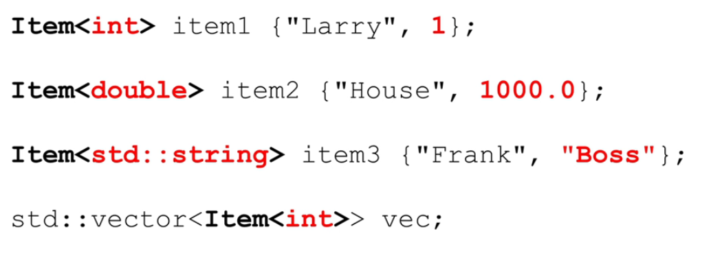


**最常见的一个实现就是pair**

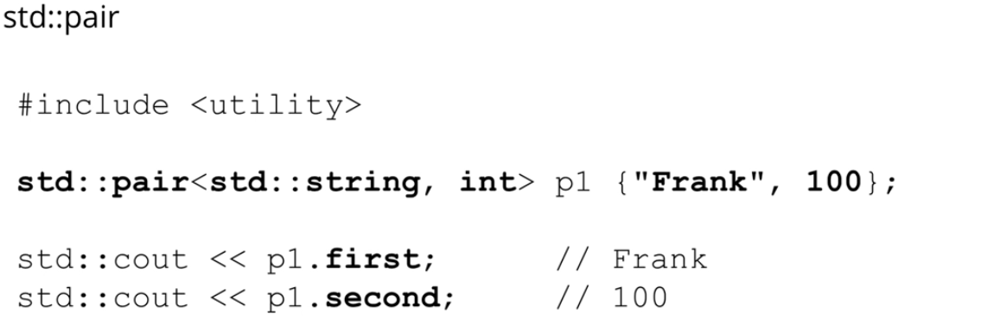


***

##### 2.为什么类模板不能将实现放在.cpp中

在C++中，类模板的定义通常包含在头文件中，而不是在.cpp文件中实现，这是由于C++模板的编译模型所决定的。以下是主要原因：

**模板的编译模型**

1. 在C++中，模板的实例化是一个将模板代码转换为具体代码的过程，这个过程发生在编译时。让我们通过几个步骤来理解这个过程：

   1. **模板定义**

   首先，你会定义一个模板，比如一个函数模板或类模板。这个定义告诉编译器如何为特定的类型生成代码。模板本身并不是完整的代码，它更像是一个生成代码的蓝图。

   ```c++
   template <typename T>
   T add(T a, T b) {
       return a + b;
   }
   ```

   2. **模板实例化**

   当你在代码中使用模板，并为其提供具体的类型时，这个过程称为模板实例化。编译器会根据提供的类型，按照模板的蓝图生成实际的代码。

   ```c++
   int main() {
       int result = add<int>(5, 10); // 实例化为 add<int>(int, int)
       return 0;
   }
   ```

   在这个例子中，当编译器遇到`add<int>(5, 10)`时，它会生成一个新的函数，就像你手动写了一个`int add(int a, int b)`函数一样。

   3. **编译过程**

   在编译过程中，每个.cpp文件（也称为编译单元）是独立编译的。==编译器处理.cpp文件时，它需要看到模板的定义，以便在需要时生成模板的实例==。如果模板定义在另一个.cpp文件中，编译器在处理当前文件时看不到它，因此无法生成所需的实例。

   ​	**如果实现在.cpp文件中，那么只有包含了这个.cpp文件的编译单元才能看到实现，并且只有在这个编译单元中使用模板时才会生成实例。**

   ​	当其他.cpp文件尝试使用这个模板时，**它们只能看到模板的声明（在头文件中），而看不到实现**，**因此编译器无法为这些其他.cpp文件生成模板实例**。这会导致链接错误，因为这些其他编译单元期望链接器能找到模板实例，但实际上这些实例并不存在。

   4. **链接过程**

   编译过程完成后，链接器将所有编译单元合并成一个可执行文件。如果模板定义在一个.cpp文件中，而其他.cpp文件试图使用这个模板，链接器会找不到相应的模板实例，因为它们在其他编译单元中没有被生成。

   **结论**

   为了确保模板可以在任何需要它们的地方被实例化，模板定义通常放在头文件中。这样，任何包含了这个头文件的.cpp文件都能看到模板定义，并且编译器可以为任何需要的类型生成模板的实例。这就是为什么模板通常放在头文件中的原因。

**解决方案**

为了解决这个问题，C++的常见做法是将模板定义（包括类模板和函数模板）放在头文件中。这样，当模板被包含到一个.cpp文件中时，编译器可以看到模板定义，并且能够为所需的具体类型生成模板实例。

**可能的替代方案**

尽管通常不推荐，但有一些方法可以在.cpp文件中实现模板：

1. **显式实例化**：
   - 你可以在.cpp文件中实现模板，然后显式地实例化所有需要的类型。这样，编译器会为这些特定的类型生成代码。
   - 但这种方法的缺点是，它限制了模板的灵活性，因为你必须预先知道所有将要使用的类型。
2. **模板的分离式编译**（C++20之后）：
   - C++20引入了模块的概念，这可能会改变模板的编译方式，允许模板的定义和实现分离。但这需要编译器的支持，并且目前还不是广泛支持的特性。

 **结论**

因此，为了保持模板的灵活性和可重用性，以及避免链接问题，类模板的定义应该放在头文件中，这样它们就可以在多个.cpp文件中被包含和实例化。这是C++模板编程的一种最佳实践。


#### 20.2.5.4 例子：创建一个数组类

创建一个数组类，我们希望它是任何大小和类型的

```c++
template<typename T, int N>
class Array{
    int size{N}; 		//fixed size N array
    T values[N];		// the N needs to be known at compile time
    					// 这是在stack上创建的一个临时指定大小的fixed数组
    friend std::ostream &operator<<(std:ostream &os, const Array<T,N> &arr){
        os << "[";
        for(const auto &val:arr.values)
            os << val << " ";
        os << "]" << std::endl;
        return os;
    }
    
    
public:
    Array() = default; 	//相当于声明int values[];
    Array(T init_val){
        for(auto &item:values)
            item = init_val;
    }
    
    void fill(T val){
        for(auto &item:values)
            item = val;
    }
    
    void get_size() const{
        return size;
    }
    
    T &operator[](int index)
        return values[index];
    
};
```


### 20.2.6 STL container

* STL容器可以存储几乎任何类型的数据结构(Template based classed)

* 他们被实现为**基于模板的类**

* 每个容器需要其相连的头文件`#include<container_type>`


#### 每个container都有的部分

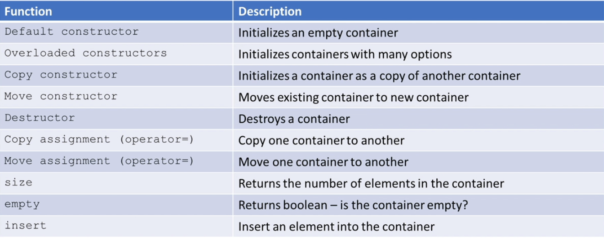

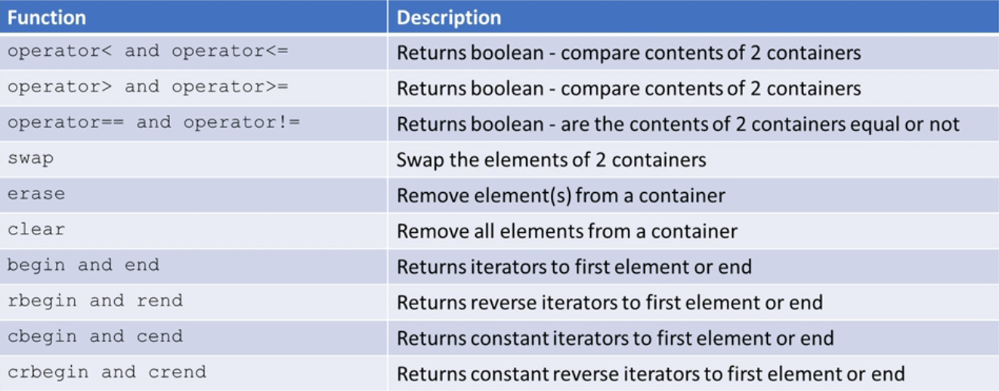

==注意==：

* container适合各种类型，但是当我们传入自己的class时，因为传入的是副本，因此我们的class必须

  * **copyable and assignable**：copy constructor/copy assignment
  * 最好moveable: move Constructor/move Assignment
  * 当然，如果不含raw pointer，这些是默认存在的

* 使用有序关联容器必须重载比较运算符

  * <
  * ==
  * .etc

  


### 20.2.7 STL iterator

* Iterator允许我们把容器看作是一个元素序列，并且不关心容器本身(无论是vector,set还是map)

* Iterator是作为模板类实现的

* 我们创建**Iterator object**，并使用它们来迭代我们的容器

* 操作类似指针

  * dereference operator:`*`
  * ++
  * --
  * .etc.

* Iterator声明的时候需要知道目标container，因此

  * ```c++
    container_type::iterator_type iterator_name;
    ```

  * ```c++
    std::vector<int>::iterator it1;
    std::list<std::string>::iterator it2;
    std::map<std::string, std::string>::iterator it3;
    std::set<char>::iterator it4;
    ```

* Initialize iterators

  * ```c++
    std::vector<int> vec {1,2,3};
    std::vector<int>::iterator it = vec.begin();
    //or
    auto it = vec.begin();
    ```


#### 20.2.7.1 Commonly used iterator operator

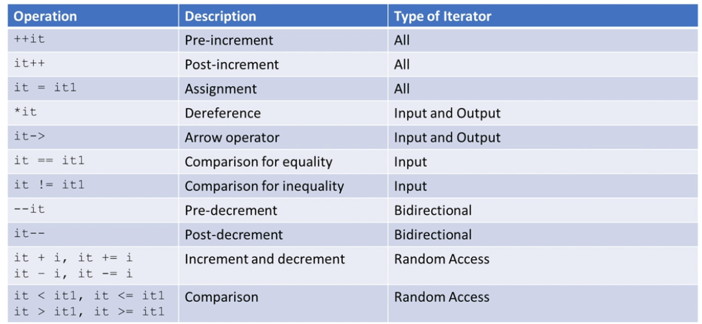


#### 20.2.7.2 for loop其实背后逻辑也是iterator

##### while写法

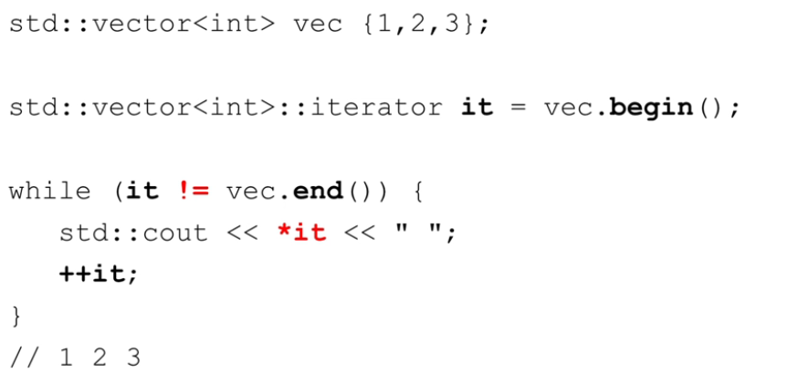

##### Range_based forloop写法

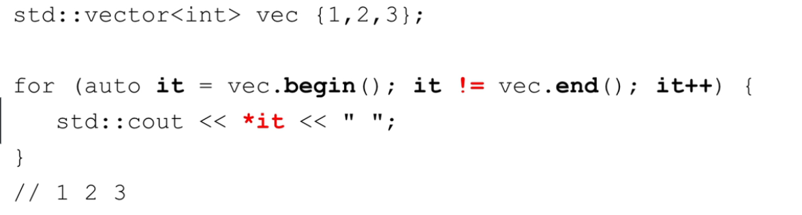


#### 20.2.7.3 容器是怎么存储的

在C++中，容器是用来存储和管理对象的类模板。每种容器都有自己的存储逻辑，这取决于它的设计目的和使用场景。以下是一些常见容器的存储逻辑和特点：

**`std::vector`**

- **存储逻辑**：连续内存存储，类似于动态数组。
- **迭代器访问**：支持随机访问迭代器，可以快速访问任何位置的元素。
- **`begin`和`end`**：`begin()`返回指向第一个元素的迭代器，`end()`返回指向最后一个元素之后位置的迭代器。

 **`std::list`**

- **存储逻辑**：双向链表，每个元素都包含指向前一个和后一个元素的指针。
- **迭代器访问**：支持双向迭代器，可以向前或向后遍历，但不支持随机访问。
- **`begin`和`end`**：`begin()`返回指向第一个元素的迭代器，`end()`返回一个“尾后”迭代器，表示链表的结束。

**`std::map`**

- **存储逻辑**：通常实现为平衡二叉树，如红黑树，用于存储键值对。
- **迭代器访问**：支持双向迭代器，可以按顺序访问元素，但不支持随机访问。
- **`begin`和`end`**：`begin()`返回指向最小键的元素的迭代器，`end()`返回尾后迭代器。


容器的存储逻辑决定了迭代器的类型和功能。例如，`std::vector`使用连续内存，所以它的迭代器可以像指针一样进行加减操作来快速移动。而`std::list`使用链表，所以它的迭代器需要跟随链表的链接来移动。


#### 20.2.7.4无序容器与iterator

无序容器（如 `std::unordered_map` 和 `std::unordered_set`）在内部使用哈希表来存储元素。尽管它们不保证元素的顺序，但仍然提供了迭代器来遍历容器中的所有元素。这些迭代器按照某种内部顺序（通常是哈希桶的顺序）访问元素，而不是元素被插入的顺序。

迭代器是一种抽象，它允许我们以统一的方式遍历不同类型的容器，无论它们的内部实现如何。对于无序容器，迭代器遍历的顺序是不确定的，但你可以确信它们会访问容器中的每个元素一次，而不会遗漏或重复。

使用迭代器和范围基 `for` 循环遍历无序容器的例子：

```c++
#include <iostream>
#include <unordered_set>

int main() {
    std::unordered_set<int> uset = {4, 1, 2, 8, 5, 3};

    // 使用迭代器遍历无序集合
    for (auto it = uset.begin(); it != uset.end(); ++it) {
        std::cout << *it << " ";
    }
    std::cout << std::endl;

    // 使用范围基for循环遍历无序集合
    for (const auto& elem : uset) {
        std::cout << elem << " ";
    }
    std::cout << std::endl;

    return 0;
}
```

在这个例子中，`uset` 是一个无序集合，我们使用两种不同的方法遍历它：一种是使用迭代器，另一种是使用范围基 `for` 循环。输出的顺序可能与元素插入的顺序不同，因为无序容器不保证元素的顺序。但是，每个元素都会被访问一次。


####  20.2.7.5`begin`和`end`

`begin`和`end`成员函数提供了一种标准的方式来获取容器的起始和结束位置的迭代器。这是迭代器设计模式的一部分，它允许算法不必关心容器的具体类型就能遍历容器。


- `begin()`: 返回一个迭代器，它指向 `vector` 的第一个元素。如果 `vector` 为空，`begin()` 返回的迭代器等同于 `end()`。
- `end()`: 返回一个迭代器，==**它指向 容器最后一个有效位置之后的位置**==，这是一个“尾后”迭代器，用于表示范围的结束。这意味着你不能对 `end()` 返回的迭代器进行解引用操作。
  - 如果你的 `vector` 存储了6个元素，无论其内部分配了多少内存，`end()` 迭代器都会指向第6个元素之后的位置。如果 `vector` 的容量（内部分配的内存大小）大于其大小（实际存储的元素数量），那些额外的内存位置不会被 `end()` 迭代器覆盖。


#### 为什么使用`::`访问迭代器

迭代器通常是**容器类的嵌套类型**。例如，`std::vector<int>::iterator`是一个类型，它是`std::vector`模板的一部分。使用`::`是因为迭代器是与容器紧密相关的类型，而且它通常需要访问容器的私有成员。


#### 20.2.7.6 为什么迭代器是一个类

迭代器是以类的形式实现的，因为它需要封装状态（如指向容器中某个元素的指针）和行为（如递增、递减、解引用等操作）。通过使用类，迭代器可以提供一致的接口，同时隐藏其复杂的实现细节，使得它们可以在不同类型的容器上工作，而不需要改变使用它们的代码。


#### 20.2.7.7 特殊的iterator

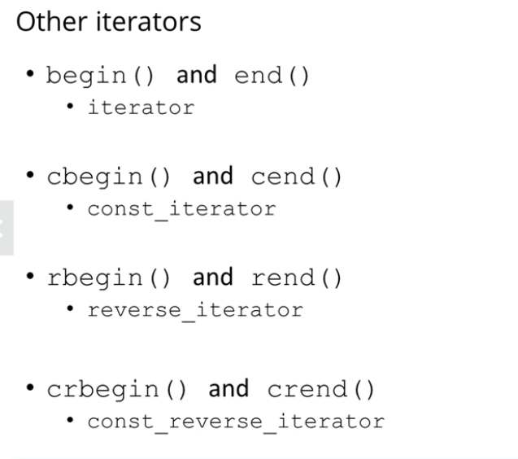

* const_iterator不能改变所指向的对象


#### 20.2.7.8 Iterator demo

**common**

```c++
std::vector<int> nums1{1,2,3,4,5};

//std::vector<int>::iterator it;
auto it = num1.end()-1;//*it = 5;;
```

**const_iterator**

```c++
std::vector<int>::const_iterator it1 = nums1.begin();
//or
auto it1 = nums1.cbegin();
```

**reverse_iterator**

```c++
auto it2 = num1.rbegin();//排列为 5 4 3 2 1 end
*it2 = 
```

**list and const-reverse iterator**

```c++
std::list<std::string> name{"Larry", "Moe", "Curly"};
auto it2 = name.crbegin();// Curly
cout << it2++ << endl;// Moe
```

**map**

```c++
std::map<std::string, std::string> favorites{
    {"Frank", "C++"},
    {"Bill", "Java"},
    {"James", "Haskell"}};

auto it3 = favorites.begin(); // iterator over map of string,string pairs

cout << it3->first << it3->second << endl;//这里就不知道是什么顺序了，反正是存入的第一个，不一定是Frank
```


#### Bonus:迭代器与类

迭代器确实是类的实例，==但它们是特殊设计的类，其目的是提供一种方法来顺序访问容器中的元素，而不需要暴露容器的内部表示==。迭代器模拟了指针的行为，这是通过重载指针相关的操作符（如 `*` 和 `->`）来实现的。

当你声明一个迭代器时，**你实际上创建了一个能够遍历容器的对象。**这个迭代器对象知道如何访问容器中的元素，并提供了一种方式来逐个元素地进行操作。

为什么使用 `->` 而不是 `.` 来访问元素的成员：

1. **操作符重载**：==迭代器重载了 `->` 操作符，使得当你使用 `it->member` 时，它实际上调用了 `(*it).member`。这是为了模拟指针的行为，因为迭代器通常被用来代替指==针。

2. **统一的接口**：使用 `->` 允许你以相同的方式访问指向对象的指针和迭代器。这意味着你可以编写通用代码，不必担心是在使用指针还是迭代器。

3. **封装**：迭代器封装了容器的内部结构。你不需要知道容器是如何存储元素的，你只需要知道如何使用迭代器来遍历它们。这种封装使得你可以更改容器的内部实现，而不需要修改使用容器的代码。

4. **点操作符（`.`）的用途**：点操作符用于访问对象的成员函数和属性。因为迭代器是一个对象，你使用点操作符来调用它的成员函数，如 `it.begin()` 或 `it.end()`。但是，当你想要访问迭代器所指向的容器元素的成员时，你需要使用 `->`。

   * ==在C++中，`.begin()` 和 `.end()` 是容器类的成员函数，它们返回指向容器中元素的迭代器。这些函数是容器的一部分，因此你需要使用点操作符（`.`）来调用这些成员函数。==

     **当你调用 `someContainer.begin()`，你实际上是在请求容器 `someContainer` 提供一个迭代器，该迭代器指向容器中的第一个元素。同样地，`someContainer.end()` 返回一个迭代器，它指向容器中最后一个元素之后的位置。**

     ==这里的关键是 `.begin()` 和 `.end()` 是容器对象的成员函数，而不是迭代器的成员函数。==一旦你获得了迭代器，你就可以使用 `++` 来移动迭代器，或者使用 `*` 来解引用迭代器指向的元素，或者使用 `->` 来访问元素的成员（如果元素是对象）。

这是一个简单的例子来说明这一点：

```c++
std::vector<std::pair<int, std::string>> vec = {{1, "one"}, {2, "two"}};
auto it = vec.begin(); // it 是一个迭代器

// 使用迭代器的->操作符来访问pair中的第二个元素（string）
std::cout << it->second; // 输出 "one"

// 如果你尝试使用点操作符，你会得到一个编译错误，因为it是一个迭代器对象，不是pair
// std::cout << it.second; // 错误！
```

在这个例子中，`it` 是一个迭代器，它指向 `vec` 的第一个元素。我们使用 `it->second` 来访问 `pair` 中的 `string`，因为 `it` 表现得像一个指向 `pair` 的指针。


### 20.2.8 Iterator invalidation（迭代器失效）

**迭代器失效（Iterator Invalidation）** 是指当容器发生某些操作后，**其迭代器不再指向原先的元素，或者不再有效，从而不能再被使用**。这通常发生在容器结构发生变化时，如元素的添加、删除或容器的重新分配内存等情况。

#### 迭代器失效的原因

1. **插入操作**：在容器中插入新元素可能会导致迭代器失效。对于 `std::vector` 和 `std::string`，**如果插入导致内存重新分配**，所有指向容器元素的迭代器都会失效。

   * ```c++
     std::vector<int> v = {1, 2, 3, 4};
     auto it = v.begin(); // 迭代器指向第一个元素
     
     v.push_back(5); // 如果导致重新分配，it 现在失效了
     
     // 使用失效的迭代器会导致未定义行为
     std::cout << *it; // 未定义行为
     ```

   * 对于 `std::deque`，插入到**首尾之外的位置**会导致所有迭代器失效。

     ```c++
     std::deque<int> d = {1, 2, 3};
     auto it = d.begin(); // 迭代器指向第一个元素
     
     d.insert(d.begin() + 1, 4); // 在第一个元素后插入，所有迭代器失效
     
     // 使用失效的迭代器会导致未定义行为
     std::cout << *it; // 未定义行为
     ```

     

2. **删除操作**：删除元素会导致指向被删除元素（以及之后元素）的迭代器失效。

   * 对于 `std::vector` 和 `std::string`，删除元素会使指向被删除元素及其后面元素的迭代器失效。

     ```c++
     std::vector<int> v = {1, 2, 3, 4, 5};
     auto it = std::find(v.begin(), v.end(), 3); // it 指向元素 3
     
     v.erase(it); // 删除元素 3，it 现在失效了
     
     // 继续使用 it 会导致未定义行为
     ++it; // 未定义行为
     ```

   * 对于 `std::list` 和 `std::forward_list`，删除操作不会影响其他元素的迭代器。

     ```c++
     std::list<int> l = {1, 2, 3, 4, 5};
     auto it = std::find(l.begin(), l.end(), 3); // it 指向元素 3
     
     l.erase(it); // 删除元素 3，it 现在失效了，但其他迭代器仍然有效
     
     // 不能再使用 it，但可以使用其他迭代器
     auto it2 = l.begin(); // 安全
     ```

   * ```c++
     std::set<int> s = {1, 2, 3, 4, 5};
     auto it = s.find(3); // it 指向元素 3
     
     s.erase(it); // 删除元素 3，it 现在失效了
     
     // 继续使用 it 会导致未定义行为
     ++it; // 未定义行为
     ```

   * **使用迭代器循环删除元素**

     * **错误的删除方式**

       ```c++
       std::vector<int> v = {1, 2, 3, 4, 5};
       for (auto it = v.begin(); it != v.end(); ++it) {
           if (*it == 3) {
               v.erase(it); // it 失效，循环继续使用 it 会导致未定义行为
           }
       }
       ```

     * **正确的删除方式**

       ```c++
       std::vector<int> v = {1, 2, 3, 4, 5};
       for (auto it = v.begin(); it != v.end(); /* no increment here */) {
           if (*it == 3) {
               it = v.erase(it); // erase 返回下一个有效迭代器
           } else {
               ++it;
           }
       }
       ```

3. **容器操作**：某些容器操作可能会导致迭代器失效，如 `clear()`, `resize()`, `swap()` 等。

#### 迭代器失效的后果

使用失效的迭代器可能会导致未定义行为，包括程序崩溃、数据损坏或不可预测的结果。

#### 如何处理迭代器失效

1. **更新迭代器**：==在进行插入或删除操作后，更新迭代器。例如，`insert()` 和 `erase()` 函数通常返回一个新的有效迭代器。==
2. **避免使用失效的迭代器**：在修改容器后，不要使用之前保存的迭代器。在每次修改后，重新获取迭代器。
3. **使用不容易失效的容器**：如果你的应用需要频繁的插入和删除，考虑使用 `std::list` 或 `std::forward_list`，因为它们的迭代器在元素插入或删除时不容易失效。

#### 举例说明

```c++
std::vector<int> vec = {1, 2, 3, 4, 5};
auto it = vec.begin(); // it 指向第一个元素

vec.push_back(6); // 可能会导致内存重新分配，使得 it 失效

// 如果内存被重新分配，下面的操作将导致未定义行为
std::cout << *it; // 危险！it 可能已经失效

// 正确的做法是在插入后重新获取迭代器
it = vec.begin();
std::cout << *it; // 安全
```

在上面的例子中，如果 `vec.push_back(6)` 导致内存重新分配，`it` 将不再有效。在使用 `it` 之前，我们应该重新获取它。

#### 总结

迭代器失效是容器操作中必须注意的问题。编写容器操作代码时，必须考虑到迭代器可能失效的情况，并采取适当的措施来确保代码的安全性和正确性。


### 20.2.8 STL Algorithm

* STL算法作用于使用STL迭代器从STL容器中获得的元素序列。
* 具体在http://en.cppreference.com/w/cpp/algorithm
* Algorithm需要额外的信息做他们的工作
  * Functors(function objects)
  * Function pointers
  * Lambda expressions(在C++11之后都应该使用这个)

``` c++
#include <algorithm>
```


#### `find` algorithm

find **first** occurrence of an element in a container

```c++
std::vector<int> vec {1,2,3};

auto loc = std::find(vec.begin(), vec.end(), 3);

if(loc != vec.end())
    std::cout << *loc << std::endl;
```

* `find`需要能够比较的对象
* 若要被`find`使用，`==`必须在类中被重载
* 具体实现是直接将容器中的每个对象与提供的对象比较，当然基元类型C++自带比较。
* 依次类推，我们可以使用find寻找一些自定义的东西，例如找到一个种族。
* 若是没有找到，返回`end`


#### `for_each`

`for_each`算法提供了一个方法让每个迭代器中的元素都执行同一个函数。


##### Functor method

```c++
struct Square_Functor{
    void operator()(int x){//overload () operator
        std::cout << x * x << " ";
    }
};


Square_Functor square;	// Function object

std::vector<int> vec{1,2,3,4};

std::for_each(vec.begin(),vec.end(),square);
```

* 在上面的例子中，被重载的是**function call operator**(函数调用运算符 ),`Square_Functor` 是一个结构体，它重载了 `()` 操作符。这意味着 `Square_Functor` 的实例可以像函数一样被调用。
* `operator()` 是一个成员函数，它接受一个整数 `x` 并打印出 `x` 的平方。
* `square` 是传递给 `std::for_each` 的函数对象。对于 `vec` 中的每个元素，`std::for_each` 都会调用 `square` 函数对象。


##### Function pointer

```c++
void square(int x){
    std::cout << x * x << " ";
}

std::vector<int> vec{1,2,3,4};

std::for_each(vec.begin(), vec.end(), square);
```


##### lambda expression

```c++
std::vector<int> vec{1,2,3,4};

std::for_each(vec.begin(), vec.end(),[](int x){std::cout << x * x << " ";})
```


#### copy & back_inserter

在 C++ 中，`std::copy` 是一个算法，用于将一个元素范围从一个容器复制到另一个容器。`std::back_inserter` 是一个插入迭代器适配器，它将赋值操作转换为对容器的 `push_back` 调用，从而在容器的末尾插入新元素。

这里是 `std::copy` 和 `std::back_inserter` 的组合使用示例：

```c++
std::vector<int> vec1 = {1, 2, 3, 4, 5};
std::vector<int> vec2;

std::copy(vec1.begin(), vec1.end(), std::back_inserter(vec2));
```

解释如下：

- `vec1.begin(), vec1.end()`: 这是源容器 `vec1` 的迭代器范围，指定了要复制的元素序列的开始和结束。
- `std::back_inserter(vec2)`: 这是一个插入迭代器，它创建了一个迭代器，该迭代器使用 `vec2` 的 `push_back` 方法来插入元素。每次通过 `std::copy` 算法赋值时，`back_inserter` 都会调用 `vec2.push_back(value)`，其中 `value` 是从 `vec1` 中复制的当前元素。

在这个例子中，`std::copy` 会遍历 `vec1` 中的每个元素，并使用 `back_inserter` 逐个将它们插入到 `vec2` 的末尾。结果是，`vec2` 将包含 `vec1` 中所有元素的副本。

这种方法的优点是，你不需要预先调整 `vec2` 的大小。`back_inserter` 会自动处理容器的扩容，确保每个新元素都有足够的空间被插入。


#### transform & back_inserter

在 C++ 中，`std::transform` 是一个算法，用于将一种范围的元素转换为另一种形式，并将结果存储在另一个范围中。这个算法有几个重载版本，其中一些版本允许你将两个范围的元素结合起来，通过给定的二元操作生成新的元素。

在 `std::transform` 函数中，如果你使用的是二元操作（即使用两个输入范围），你需要提供第一个范围的开始和结束迭代器，但对于第二个范围，你只需要提供一个开始迭代器。

这是因为 `std::transform` 会从两个范围的开始迭代器开始，对每一对元素应用给定的操作，直到达到第一个范围的结束迭代器。它假设第二个范围至少与第一个范围一样长，因此它不需要第二个范围的结束迭代器。如果第二个范围短于第一个范围，这会导致未定义行为，因为 `std::transform` 会尝试访问第二个范围中不存在的元素。

这里是一个简化的视觉表示：

```makefile
codevec1: 1 2  3  4  5
          | |  |  |  |
vec2:    10 20 30 40 50 60
```

下面是一个正确的 `std::transform` 使用例子，它将两个向量的元素相乘，并将结果存储在第三个向量中：

```c++
std::vector<int> vec1 = {1, 2, 3, 4, 5};
std::vector<int> vec2 = {10, 20, 30, 40, 50};
std::vector<int> vec3;

std::transform(vec1.begin(), vec1.end(), vec2.begin(), std::back_inserter(vec3),
               [](int x, int y) { return x * y; });
```

解释如下：

- `vec1.begin(), vec1.end()`: 这是第一个源容器 `vec1` 的迭代器范围，指定了要进行转换的元素序列的开始和结束。
- `vec2.begin()`: 这是第二个源容器 `vec2` 的起始迭代器，它应该与 `vec1` 有相同数量的元素，因为 `std::transform` 会对两个范围的元素进行配对。
- `std::back_inserter(vec3)`: 这是一个插入迭代器，它创建了一个迭代器，该迭代器使用 `vec3` 的 `push_back` 方法来插入元素。
- `[](int x, int y) { return x * y; }`: 这是一个 lambda 表达式，它定义了一个匿名函数，该函数接受两个整数参数 `x` 和 `y`，并返回它们的乘积。

**在这个例子中，`std::transform` 会遍历 `vec1` 和 `vec2` 中的每对元素，将它们相乘，并使用 `back_inserter` 将乘积插入到 `vec3` 的末尾。结果是，`vec3` 将包含 `vec1` 和 `vec2` 中对应元素乘积的序列。**

这种方法的优点是，你不需要预先调整 `vec3` 的大小。`back_inserter` 会自动处理容器的扩容，确保每个新元素都有足够的空间被插入。


#### copy & front_inserter

```c++
std::vector<int> vec {1,2,3,4,5,6,7,8,9,10};
std::deque<int> d;

std::copy(vec.begin(),vec.end(),std::front_inserter(d));
```

insert to the front of ==deque==


#### 其余

* `std::count(begin,end,target)`,return int

* `std::count_if(begin,end, lambda)`

  * ```c++
    //寻找所有偶数
    int num = std::count_if(vec.begin(),vec.end(),[](int x){return x%2 == 0;})
    ```

* `std::replace(begin, end, target, replace element)`

* `std::all_of(begin, end, lambda条件)`，返回boolean，代表是否都部分

  * ```c++
    std::all_of(vec.begin(),vec.end(),[](int x){return x > 10;})//是否所有元素都大于10?
    ```

* `std::transform(begin,end,storage_begin, lambda_function)`

  * ```c++
    std::string str1{"This is a test"};
    
    std::transform(str1.begin(),str1.end(),str1.begin(),::toupper);//此处的::toupper代表global scope中的toupper
    ```


### 20.2.9 一些具体的container

==在我们自己的数据类型中，永远需要重载`<`与`==`==

#### Array container

```c++
#include<array>
```

* 固定大小，大小必须在compile time可知
* Array container是一个object，它不会在作为参数传参时decay to一个指向数组第一个位置的指针
* 能够直接访问元素（即为O(1)访问时间)
* 在幕后实现为一个raw array，我们可以访问这个raw array

* ==`std::array` is all iterators available and do not invalidate==

```c++
std::array<int, 5> arr1 {{1,2,3,4,5}};

std::array<std::string, 3> stooges{
    std::string("Larry"),"Moe", std::string("Curly")}
};//cstyle string 自动转化

arr1 = {2,4,6,8,10};// = operator 重载
```

* 如果初始化的element数量超过指定数量，就会报错
* 如果初始化的element数量不足，内置数字类型一般会置0，string类型会为空，自创类型看构造函数


##### Commonly used method

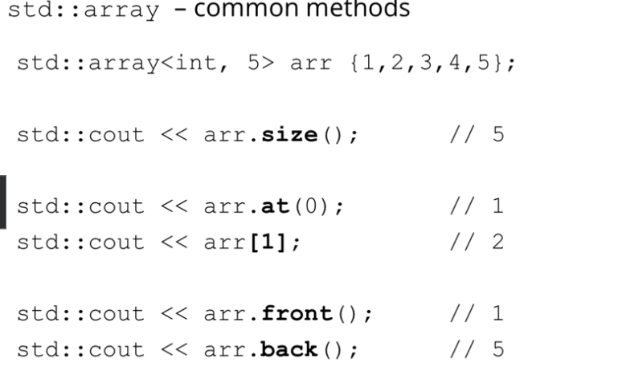

* `size()`所有container都有
* `at` do bounds checking
* `[]`不做bounds checking

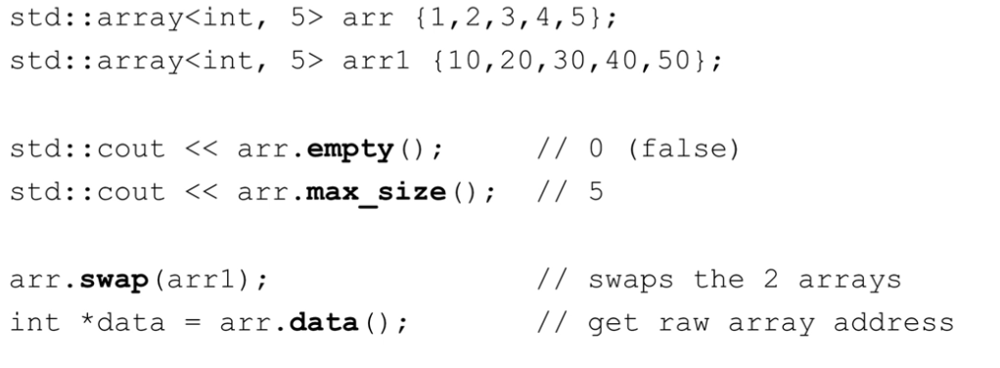


#### vector

##### 特点

- **动态数组**：`std::vector` 是一个动态数组，可以在运行时动态地增加和减少其大小。
- **连续存储**：它在内存中连续存储元素，这意味着可以通过指针算术直接访问元素。
- **随机访问**：提供对任何元素的随机访问，时间复杂度为 O(1)。
- **自动管理内存**：自动管理其存储空间的分配和释放。
- **尾部操作优化**：在尾部添加或移除元素非常高效，时间复杂度为 O(1)。但是在中间操作会是线性时间复杂度，复杂度取决于插入位置之后的序列。
- **空间重新分配**：当当前分配的空间不足以容纳更多元素时，会自动重新分配更大的空间。

##### 运行原理

- **空间分配**：当向 `vector` 添加元素，且当前空间不足时，`vector` 通常会分配一个更大的内存块，并将所有现有元素复制到新的内存位置。
- **增长因子**：新分配的空间通常比所需的最小空间大，以减少总体上的重新分配次数。增长因子通常是当前大小的1.5到2倍，这取决于实现。
- **迭代器失效**：重新分配后，所有指向 `vector` 的迭代器、指针和引用都可能失效。

##### 常用方法

- **构造函数**：创建 `vector`，可以指定大小和初始值。

  - ```c++
    vector<int> temp(4,100);/{100,100,100,100}
    ```

- **`push_back`**：在 `vector` 的尾部添加一个元素。

- **`pop_back`**：移除 `vector` 尾部的元素。

- **`size`**：返回 `vector` 中元素的数量。

- **`capacity`**：返回 `vector` 可以容纳的元素数量。

- `shrink_to_fit`：将capacity缩小到和size一样的大小

- `reserve` 与`resize`:

  - **`resize`**：改变 `vector` 的大小，如果需要，添加新元素。
  - **`reserve`**：增加 `vector` 的容量，但不改变其大小。
  - 相同点：
    - **它们都可能会导致内存分配**（尽管 `reserve` 只在需要时才会这么做）。
  - 不同点:
    - `reserve` 只改变容量，不改变大小；`resize` 改变大小，如果需要，也可能改变容量。
    - `resize` 可能会构造或销毁元素；`reserve` 不会。
    - `reserve` 用于性能优化，以减少内存重新分配的次数；`resize` 用于实际改变容器中元素的数量。

- **`operator[]`**：访问指定位置的元素。

- **`at`**：访问指定位置的元素，如果索引超出范围，抛出异常。

- **`front`** 和 **`back`**：访问第一个和最后一个元素。

- **`begin`** 和 **`end`**：返回指向第一个元素和尾后元素的迭代器。

- **`clear`**：移除所有元素，但不改变容量。

- **`erase`**：移除指定位置或范围的元素。

- **`insert`**：在指定位置插入元素或元素范围。

  - 一个例子，将vec1的2和3之间插入10

  - 将vec1的3和4之间插入vec2（也就是在4之前插入vec2）

    ```c++
    std::vector<int> vec1 {1,2,3,4,5};
    std::vector<int> vec2 {10,20,30,40,50};
    
    auto it = std::find(vec1,begin(),vec1.end, 3);
    vec1.insert(it,10); // 1,2,10,3,4,5
    
    it = std::find(vec1.begin(),vec1.end(),4);
    vec1.insert(it, vec2.begin, vec2.end());
    
    ```

    

- **`emplace`** 和 **`emplace_back`**：在指定位置构造元素，而不是复制或移动。

  - ```c++
    Person p1 {"Larry",18};
    std::vector<Person> vec;
    
    vec.push_back(p1);					//copy
    vec.push_back(Person{"Larry", 18});	//move
    vec.emplace_back("Larry", 18);		//emplace
    ```

  

> 关于reserve
>
> 在 `std::vector` 中，`reserve` 方法用于请求改变容器的容量（即可以存储的元素数量），但它并不改变容器当前持有的元素数量，也就是说，它不会改变 `vector` 的 `size`。
>
> 这里的“大小”（size）指的是 `vector` 中实际存储的元素数量，而“容量”（capacity）指的是在不进行重新分配的情况下 `vector` 可以存储的元素总数。`reserve` 方法只是确保 `vector` 有足够的预分配空间来存储指定数量的元素，以避免在后续的 `push_back` 或 `insert` 操作中频繁重新分配内存。
>
> 例如：
>
> ```c++
> std::vector<int> vec;
> vec.reserve(100); // 请求容量为100的存储空间
> 
> std::cout << "Size: " << vec.size() << std::endl; // 输出将是 0
> std::cout << "Capacity: " << vec.capacity() << std::endl; // 输出将是 100 或更大
> ```
>
> 在上面的代码中，即使我们调用了 `reserve(100)`，`vector` 的 `size` 仍然是 0，因为我们没有添加任何元素。但是，它的 `capacity` 至少是 100，这意味着我们可以在不需要重新分配内存的情况下添加多达 100 个元素。
>
> 
>
> 如果 `std::vector` 的 `reserve` 方法无法分配请求的容量大小，它将抛出一个 `std::bad_alloc` 异常。这个异常是由底层的内存分配函数（如 `new` 或 `malloc`）在无法满足内存请求时抛出的。
>
> 在实际应用中，如果你尝试 `reserve` 一个非常大的容量，超出了系统能够提供的内存或者超过了 `vector` 最大容量限制（通常是 `std::vector::max_size()`），就会发生这种情况。
>
> 这里是一个处理这种情况的例子：
>
> ```c++
> std::vector<int> vec;
> try {
>     vec.reserve(std::numeric_limits<std::size_t>::max()); // 尝试分配极大的容量
> } catch (const std::bad_alloc& e) {
>     std::cerr << "Cannot allocate that much memory: " << e.what() << std::endl;
> }
> ```
>
> 在上面的代码中，如果 `reserve` 调用失败，程序将捕获异常并输出错误消息，而不是导致程序崩溃。这是处理潜在内存分配问题的一种安全方式。


#### deque

`deque`（双端队列，全称为 "double-ended queue"）是 C++ 标准模板库（STL）中的一种容器，它提供了类似于 `vector` 的功能，但是在两端插入和删除元素时更加高效。以下是 `deque` 的一些主要用途和特点：

##### 用途

1. **快速前后插入/删除**：当你需要频繁在序列的前端或后端插入或删除元素时，`deque` 是一个很好的选择。例如，在实现数据结构如队列和双端队列时，`deque` 是一个理想的底层容器。
2. **随机访问**：`deque` 支持随机访问，这意味着你可以通过索引直接访问任何元素，就像在数组或 `vector` 中一样。
3. **动态大小**：与数组不同，`deque` 可以动态地增长和缩小，无需手动管理内存。
4. **内存效率**：相比 `vector`，`deque` 在进行前端插入和删除操作时不需要移动所有的元素，这使得它在某些情况下更加内存效率。

##### 特点

- **非连续存储**：`deque` 内部通常是由一系列固定大小的数组组成，这些数组在内存中可能不是连续的。这允许 `deque` 在两端动态地添加或删除元素，而不需要像 `vector` 那样重新分配整个内存块。
- **迭代器失效**：由于 `deque` 的这种内部结构，插入或删除元素可能会导致除了被操作位置的迭代器之外的所有迭代器失效。这与 `vector` 不同，后者在重新分配内存时会使所有迭代器失效。
- **性能权衡**：虽然 `deque` 在两端操作上比 `vector` 快，但在中间插入或删除元素时可能会更慢，因为它需要移动多个内部数组中的元素。
- **内存开销**：`deque` 的内存开销可能比 `vector` 高，因为它需要维护额外的数据结构来跟踪和管理内部数组。

总的来说，`deque` 是一个灵活的容器，适用于需要双端操作且不要求内存连续性的场景。在选择 `deque` 还是其他容器时，应该考虑你的具体需求，以及不同容器的性能特点。

##### 总结与应用

* 动态大小，但是元素并非存在连续空间
* `#include<deque>`
* 能够直接访问
* 允许在front和back 都有efficient **insertion, deletion** (vector只能back)
* 当deque change size时，iterator可能失效

```c++
std::deque<int> d{1,2,3,4,5};
std::deque<int> d1(10,100);//十个100

std::deque<std::string> stooges{
    std::string("Larry"),
    "Moe",
    std::string{"Curly"}
};

d = {2,4,6,8,10};
```

deque常常存储为不连续的块。块里面是连续的。当我们添加新的元素时，在已有块插入，如果空间不够，就开辟新的不连续块。因此deque支持push_front

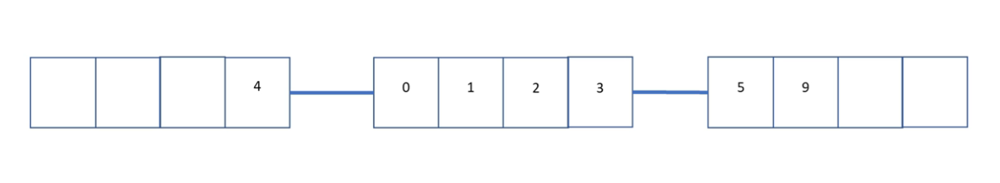

##### 常用method

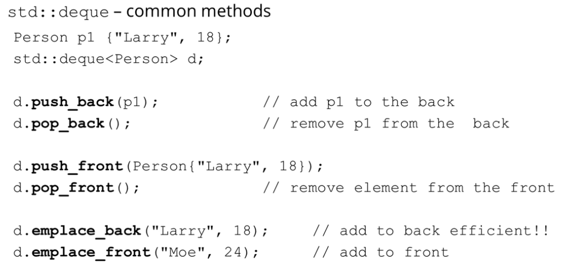

