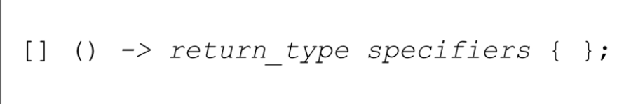
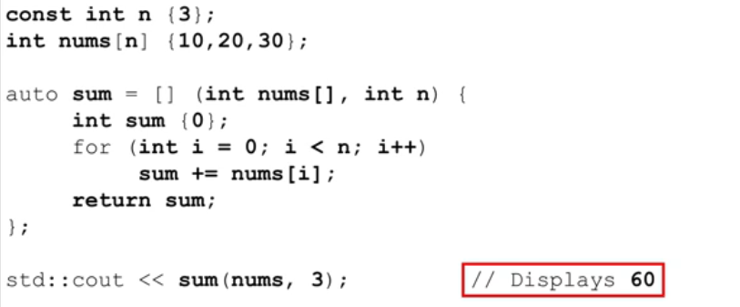
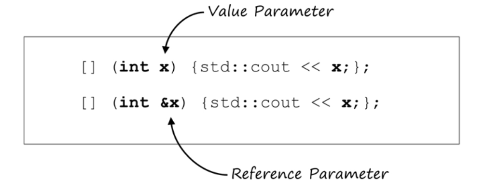
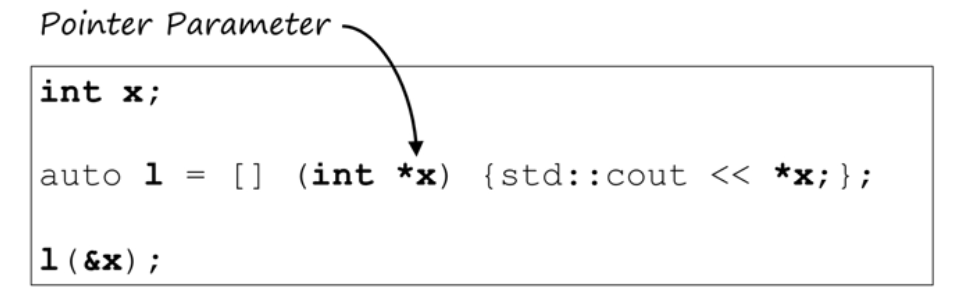
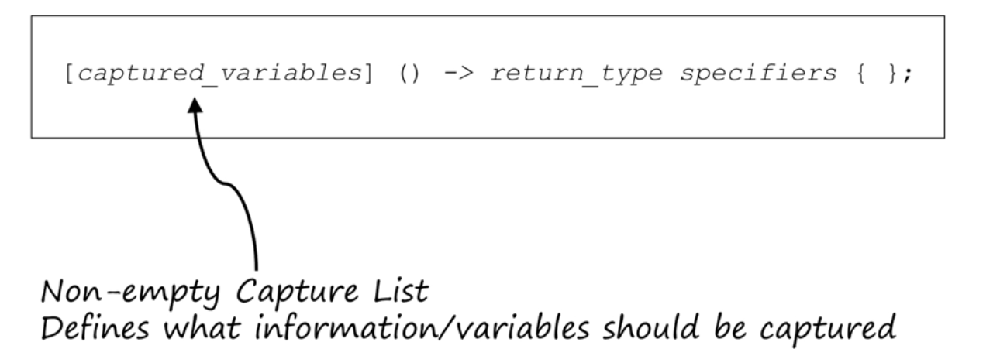
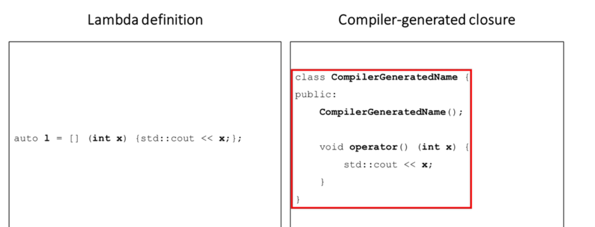
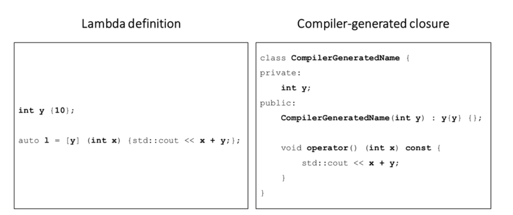
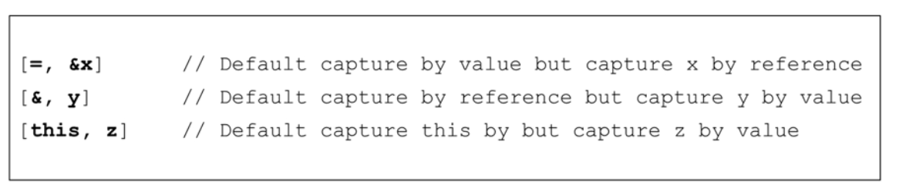

# 21. Lambda expression

## 21. 1 Overview

* 什么是Lambda expression
  * Motivation
  * Review of function objects(Functors)
  * Relation between lambdas and function objects
* Structure of a lambda expression
* Types of lambda expression
  * Stateless lambda expression
  * Stateful lambda expression(capturing context)
* Lambdas and the STL


### 21.1.1 Motivation-取代function object

* 在C++11之前，当我们需要使用STL和我们自己的代码定制行为时，主要使用函数对象和函数指针。函数对象主要用于STL，而函数指针更常用作回调。

* 一个小问题就是我们常常需要写很多控制算法的短函数，在STL的例子中，这些小函数被封装在小类中以产生函数对象。但是很多时候，类和函数的定义距离很远，这会导致修改，维护和测试代码出现问题。

* 此外，函数没有被定义内联时，编译器不太擅长优化函数。

  ```c++
  class MUltiplier{
  private:
      int num{};
  public:
      Multiplier(int n) : num{n} const{
          
      }
      
      int  operator()(int n) const{
          return num * n;
      }
  }
  
  std::vector<int> vec{1,2,3,4};
  Multiplier mult{10};
  std::tranform(vec.begin(),vec.end(),vec.begin(),mult);
  
  //vec now contains {10,20,30,40};
  
  //以下写法也一样
  std::transform(vec.begin(),vec.end(),vec.begin(),Multiplier(10));
  ```

* 例如如上例子，我们用一个初始化乘数对象，并将其存储在num属性中。然后当我们用一个乘数对象调用重载函数运算符时，我们将过去的乘数n乘以num。==这种将object当成function使用的方法，也被称为function objects==

* ```c++
  //例子2：一个template类
  template<typename T>
  struct Displayer{
      void operator() (const T &data){
          std::cout << data << " ";
      }
  }
  
  //用法
  Displayer<int> d1;
  Displayer<std::string> d2;
  
  d1(100);//等同于d.operator()(100)，输出100
  
  d2("Frank");//等同于d.operator()("Frank")，输出Frank
  
  
  // 更多用法
  std::vector<int> vec1 {1,2,3,4,5};
  std::vector<std::string> vec2{"Larry", "Moe", "Curly"};
  
  std::for_each(vec1.begin(),vec1.end(),Displayer<int>());
  
  std::for_each(vec1.begin(),vec1.end(),d1);
  
  std::for_each(vec2.begin(),vec2.end(),d2);
  ```

* 以上就是老方法，例如函数对象

* 以下是lambda方法

  ```c++
  std::vector<int> vec1 {1,2,3,4,5};
  std::vector<std::string> vec2{"Larry", "Moe", "Curly"};
  
  std::for_each(vec1.begin(),vec1.end(),[](int x){std::cout << x << " ";});
  
  ```

* 这不代表我们永远不需要函数对象方法了，==使用lambda表达式的最佳时间是在代码量是一个语句或几个语句时使用它。==

* lambda表达式的另一个好处是编译器根据 lambda 表达式的定义生成一个函数对象，==这个对象包含了函数代码和捕获的变量，这个对象也被称为闭包对象==。因为闭包对象包含了捕获的变量，所以即使在 lambda 表达式定义的作用域外部，这些变量仍然可以通过闭包对象访问。闭包是 lambda 表达式的具体实现，允许 lambda 表达式像一个常规函数那样被调用，同时保持对其捕获的变量的访问。


### 21.1.2 Structure of a Lambda Expression



* `[]`:Capture List

  * 决定了Lambda expression的开始
  * allow us to capture the context or the closure(闭包) the lambda expression execute in

  * 在stateful lambda中，我们可以定义我们想capture哪些值，以及by value还是by reference

* `()`：Parameter list

* `return type`:如果lambda非常简单，编译器通常可以推导出lambda的返回类型，因此可以省略

* `specifiers`:有两个选择，mutable 与 constexpr，当然也可以不写

* `{}`:写代码执行的地方


最简单的lambda expression

```c++
[](){std::cout << "hi";}
```

这个lambda expression可以使用以下方式调用，它使用了一个重载的call function来实例化这个function，当然我们一般不这么做

```c++
[](){std::cout << "hi";}();
```


### 21.1.3 Assign a lambda expression to a variable

```c++
auto l = [](){std::cout << "hi";};
l();// display "hi"

auto l = [](int x){std::cout << x;};
l(10);

auto l = [](int x, int y) ->int {return x+y};
//因为编译器会自己分析，所以实际上不需要->int
l(2,3);
```

* auto代表的type其实是一个std function with template argument


## 21.2 Stateless lambda expression

### 21.2.1 基础知识

接下来介绍空捕获列表的lambda表达式

空的捕获列表`[]`意味着表达式不从其环境中捕获任何信息，而只知道通过函数参数列表传递给它的信息。这就是stateless lambda expression




在上面的例子中，因为我们没有捕获n和nums，因此我们必须传参

进一步的，我们也可以引用传参



与指针传参




### 21.2.2 实现通用输入

```c++
int num1{10};
float num2{20.5};

auto l = [](auto x){std::cout << x;}
l(num1);
l(num2);
```

这里要做个小区分，auto是已知value的时候都可以用的

在template那一部分中，我们不能直接声明为auto

```c++
class Temp{
    auto num1;
}
```

但是我们可以将template与auto结合

```c++
template <typename T>
class Temp{
    T num1;
    Temp(T num1):num1{num1}{}
};

Temp<auto>(num1);
```

这也就是为什么我们还需要template，因为我们并没有值来让它auto


### 21.2.3 将lambda expression作为函数参数

#### 21.2.3.1 基础语法

以下至少需要C++14

```c++
#include<functional>
auto l = [](auto x){std::cout << x;}
//C++14
void foo(std::function<void(int)> l){
    //void代表return type
    // int代表Parameter type
    l(10);
}
//以function pointer传参,C++14
void foo(void(*l)(int)){
    //void代表return type
    // int代表Parameter type
    l(10);
}

//C++20
void foo(auto l){
    l(10);
}


//调用
foo([](int x){std::cout << x;});
//or 需要多次传时
auto l = [](int x){std::cout << x;};
foo(l);
```


#### 21.2.3.2 何时使用lambda传参-predicate lambda

我们以一个predicate lambda为例

* 下面的例子中predicate是一个C++参数，它接受int，并返回bool
* 所谓的predicate lambda就是lambda的一个典型用法
* **以下例子中将lambda当作参数，你可以使用21.2.3.1中的三种方法传递，这都称为predicate lambda**
* 在这种情况下，predicate lambda用于确定在主函数print中显示整数向量的哪些元素

```c++
void print_if(std::vector<int>nums, std::function<bool(int)> predicate){
    for(int i:nums){
        if(predicate(i))
            std::cout << i;
    }
}

int main(){
    std::vector<int> nums {1,2,3};
    
    print_if(nums, [](auto x){return x % 2 == 0;});
    print_if(nums, [](auto x){return x % 2 != 0;});
    
}
```

* 这样，我们不仅能抽象类型，我们现在有能力通过predicate lambda抽象函数的能力
* predicate lambda在sort或是for_each中常常用到


### 21.2.4 将lambda expression作为返回

```c++
#include<functional>

std::function<void(int)> foo(){
    return [](int x){std::cout << x;};
}
//old style c sytax,忽略就好
void (*foo())(int){
    return [](int x){std::cout << x;};
}

//最常用
auto foo(){
    return [] (int x){std::cout << x;};
}

//call
auto l = foo();
l(10);
```


### 21.2.5 例子

```c++
int main()
{
    //lambda表达式直接实例化，一般没人这么用
    test1();
    //// Using values and references as lambda parameters 
    test2();
    // Using value and reference "objects" as lambda parameters
    test3();
    // lambda作为参数传入
    test4();
    // return a lambda
    test5();
    // using auto in lambda parameter list
    test6();
    // 在sort和for_each中使用lambda
	test7();
    
    std::cout << std::endl;
	return 0;
}
```


```c++
// Section 21
// Stateless lambda expressions
// [] - empty capture lists
#include <iostream>
#include <string>
#include <vector>
#include <functional>   // for std::function
#include <algorithm>

class Person {
    friend std::ostream &operator<<(std::ostream &os, const Person &rhs);
private:
    std::string name;
    int age;
public:
    Person(std::string name, int age) : name{name}, age{age} {};
    Person(const Person &p): name{p.name}, age{p.age} { }
    ~Person() = default;
    std::string get_name() const { return name; }
    void set_name(std::string name) {this->name = name; };
    int get_age() const {return age; }
    void set_age(int age) {this->age = age; }
};

std::ostream &operator<<(std::ostream &os, const Person &rhs) {
    os << "[Person: " <<rhs.name << " : " <<rhs.age << "]";
    return os;
}

void test1() {
    std::cout << "\n---Test1 --------------------------" << std::endl;

    [] () {std::cout << "Hi" << std::endl; }();
    
    [] (int x) { std::cout << x << std::endl;}(100);
    
    [](int x, int y) { std::cout << x+y << std::endl; }(100,200);
}

// Using values and references as lambda parameters 
void test2() {
    std::cout << "\n---Test2 --------------------------" << std::endl;
    
    auto l1 =   [] () {std::cout << "Hi" << std::endl;};
    l1();
    
    int num1 {100};
    int num2 {100};

    auto l2 = [](int x, int y) { std::cout << x+y << std::endl; };
    l2(10,20);
    l2(num1, num2);
    
    auto l3 = [](int &x, int y) {
        std::cout << "x: " << x << " y: " << y << std::endl;
        x = 1000;
        y = 2000;
    };
    
    l3(num1, num2);
    std::cout << "num1: " << num1 << " num2: " << num2 << std::endl;
}

// Using value and reference objects as lambda parameters
void test3() {
    std::cout << "\n---Test3 --------------------------" << std::endl;
    Person stooge {"Larry", 18};
    std::cout << stooge << std::endl;
    
    auto l4 = [] (Person p) {
        std::cout << p << std::endl; 
    };
    l4(stooge);
    
    auto l5 = [] (const Person &p) {
        std::cout << p << std::endl; 
    };
    l5(stooge);
    
    auto l6 = [] (Person &p) {
        p.set_name("Frank");
        p.set_age(25);
        std::cout << p << std::endl; 
    };
    l6(stooge);
    
    std::cout << stooge << std::endl;
    
}

// used for test4
// using std::function as a parameter in C++14 and greater
// or 
// auto as parameter type in C++20
void filter_vector(const std::vector<int> &vec, std::function<bool(int)> func)   {
//void filter_vector (const std::vector<int>  &vec, auto func) {
    std::cout <<"[ ";
    for (int i: vec) {
        if (func(i)) 
            std::cout << i  << " ";
    }
    std::cout << "]" << std::endl;
}

// passing a lambda to a function
void test4() {
    std::cout << "\n---Test4 --------------------------" << std::endl;
    std::vector<int> nums {10,20,30,40,50,60,70,80,90,100};
    
    filter_vector(nums, [](int x) {return x>50;});
    
    filter_vector(nums, [](int x) {return x<=30;});
    
    filter_vector(nums, [](int x) {return x>= 30 && x <=60;});
}

// used for test5
auto make_lambda() {
	return [] () {std::cout << "This lambda was made using the make_lambda function!" << std::endl;};
}

// returning a lambda from a function
void test5() {
	std::cout << "\n---Test5 --------------------------" << std::endl;
	
	auto l5 = make_lambda();
	
	l5();
}

// using auto in the lambda parameter list
void test6() {
    std::cout << "\n---Test6 --------------------------" << std::endl;
    auto l6 = [](auto x, auto y) {
        std::cout << "x: " << x << " y: " << y << std::endl;
    };
    
    l6(10,20);
    l6(100.3, 200);
    l6(12.5, 15.54);
    
    l6 (Person("Larry", 18), Person("Curly", 22));
}

// Simple lambda examples with std::sort and std::for_each
void test7() {
      std::cout << "\n---Test7 --------------------------" << std::endl;

    std::vector<Person> stooges {
        {"Larry", 18},
        {"Moe", 30},
        {"Curly", 25}
    };
    std::sort(begin(stooges), end(stooges), [](const Person &p1, const Person &p2) {
        return p1.get_name() < p2.get_name();
    });
    
    std::for_each(begin(stooges), end(stooges), [](const Person &p) {
        std::cout << p << std::endl;
    });
    
    std::cout << std::endl;
    
     std::sort(begin(stooges), end(stooges), [](const Person &p1, const Person &p2) {
        return p1.get_age()< p2.get_age();
    });
    
    std::for_each(begin(stooges), end(stooges), [](const Person &p) {
        std::cout << p << std::endl;
    });
}


```


## 21.3 Stateful Lambda expression

### 21.3.1 基础知识



首先我们了解lambda被调用时，到底发生了什么



* 编译器生成了一个闭包，包含了一个no args 构造函数以及一个function call重载
* 注意，这个是在编译时产生的。考虑到我们构建lambda时，类型还没有生成，这个类型是在编译时生成，因此当然只能由编译器在编译时赋值。这就是我们使用auto的原因。

**当定义有状态的lambda捕获列表时，这就是等同于确定了构造函数以及成员变量**




### 21.3.2 C++提供的capture方法

* **Capture by value**
  * lambda的capture by value实际上是capture by const value，==这意味着所捕获的值在闭包中是不可修改的==

```c++
int x{100};
[x](){std::cout << x;}();
```

* **Capture by value with mutable**
  * 在这种情况下，我们通过mutable来告诉编译器将lambda运算符函数生成为非常数成员函数。这么做，我们可以按值捕获变量，并在lambda中修改它们。

```c++
int x{100};
[x]() mutable{
    x+=100;
    std::cout << x;//displays 200
}();

std::cout << x; //displays 100
```

* **Capture by reference**

  * 略

* **Default Capture**

  * 在需要传入的变量过多，我们不想一个一个手写的时候，我们可以使用Default Capture。==Default capture能够允许lambda捕获其主体内引用的所有变量。==

  * 包含如下几个

    * `[=]`：Default capture **by value**

    * `[&]`: Default Capture **by reference**

    * `[this]`:在捕获列表中，`this`是一个特殊的捕获项，它表示当前对象的指针。通过在lambda表达式中使用`[this]`，可以捕获当前对象的成员变量和成员函数，使得它们可以在lambda表达式中使用。

      下面是一个使用`[this]`捕获当前对象成员的示例：

      ```c++
      class MyClass {  
      public:  
          int value;  
          void func() {  
              // 创建一个lambda表达式，捕获当前对象的成员变量和成员函数  
              auto lambda = [this](int x) {  
                  value = x; // 在lambda表达式中访问并修改当前对象的成员变量  
                  func(); // 调用当前对象的成员函数  
              };  
                
              // 使用lambda表达式  
              lambda(10);  
          }  
      };
      ```

      在上面的示例中，`[this]`捕获了当前对象（即`MyClass`的一个实例）的成员变量`value`和成员函数`func()`。在lambda表达式中，可以通过`this->value`来访问和修改当前对象的成员变量，并且可以直接调用成员函数`func()`。这样，lambda表达式就可以在`func()`内部使用当前对象的成员变量和成员函数。

    * 我们可以混合使用

      * 


### 21.3.2 例子

* 我们唯一能够捕获的时间是在执行构造函数时(test2)

* test8中，三种捕获方式都是一样的效果（reference)，推荐使用this使得代码更可读

  * 在`change_person2`中，虽然lambda表达式没有显式地捕获任何外部变量，但它仍然可以访问和修改`name`和`age`。==这是因为C++规定，如果lambda表达式所在的函数是一个成员函数，那么它隐式地捕获了`this`指针，即当前对象。==

    在`Person`类的成员函数中，`this`指针指向当前对象，通过它可以直接访问和修改该对象的成员变量。因此，即使`change_person2`的lambda表达式没有显式捕获任何外部变量，它仍然可以通过隐式捕获的`this`指针来访问和修改`name`和`age`。

    这也解释了为什么`change_person3`的lambda表达式没有捕获任何外部变量，但仍然可以访问和修改`name`和`age`。因为`change_person3`的lambda表达式也隐式捕获了`this`指针。

    总之，在C++中，如果lambda表达式所在的函数是一个成员函数，那么它隐式地捕获了`this`指针，这使得它可以访问和修改当前对象的成员变量。

```c++
int main()
{
    //普通的按值捕获，直接使用全局变量
    test1();
    //mutable 按值捕获
    //在这个例子中，第一次捕获我们已经将x捕获为了成员变量，我们后两次调用并不会捕获，而是直接使用已有的成员变量。（这也就是他们数值叠加的原因）
	test2();
    // capture by reference
	test3();
    // default capture by value for all: [=]
    //compiler只会capture需要的
	test4();
    // default capture by reference:[&]
	test5();
    //default capture by value, capture y by reference
	test6();
    // default capture by reference , capture x,z by value(mutable)
	test7();
    //in class, capture by this, value, reference ,使用类造lambda返回，然后通过这个类的实例产生lambda表达式
	test8();
    //自己写一个闭包说明lambda和闭包的一致性
	test9();
    //展示了this捕获的优势，例子中我们期望筛选出所有>maxage的人，但是我们不知道具体人数，lambda表达式允许我们直接使用类的元素
    test10();
	
	std::cout << "\n";
	return 0;
}
```


```c++
#include <iostream>
#include <vector>
#include <algorithm>

int global_x {1000};

// Capture by value
// The global variable global_x cannot be captured because it is not 
// within the reaching scope of the lambda. It can however still be accessed 
// from within the lambda using normal name lookup rules.
void test1()
{
	std::cout << "\n---Test1 --------------------------" << std::endl;
	
	int local_x {100};
	
	auto l = [local_x] () {
		std::cout << local_x << std::endl;
		std::cout << global_x << std::endl;
	};
	l();
}

// Capture by value - mutable
// The captured variable x can only be modified within the lambda by
// using the mutable keyword. Note that this modifiability only pertains to 
// the captured variable within the lambda body and not the actual variable.
void test2()
{
	std::cout << "\n---Test2 --------------------------" << std::endl;
	
	int x {100};
	
    //创建object l
	auto l = [x] () mutable {//constructor of closure called
		x += 100;
		std::cout << x << std::endl;
	};
    
	l();//operator () called
	std::cout << x << std::endl;
    
    l();//operator () called
    std::cout << x << std::endl;
}

// Capture by reference
// Any changes made to the captured reference variable within the lambda body
// will change the actual variable.
void test3()
{
	std::cout << "\n---Test3 --------------------------" << std::endl;
	
	int x {100};
	
	auto l = [&x] () mutable {
		x += 100;
		std::cout << x << std::endl;
	};
    
	l();
	std::cout << x << std::endl;
}

// Default capture by value - mutable
// Only variables used within the lambda body are captured by value.
// The variable z is not captured by the lambda.
void test4()
{
	std::cout << "\n---Test4 --------------------------" << std::endl;
	
	int x {100};
	int y {200};
	int z {300};  // Note that z is not captured in the lambda since it is not used.
                      // This should produce an 'unused variable' warning when compiling.
	
	auto l = [=] () mutable {
		x += 100;
		y += 100;
		std::cout << x << std::endl;
		std::cout << y << std::endl;
	};
	l();
	
	std::cout << "\n";
	std::cout << x << std::endl;
	std::cout << y << std::endl;
}

// Default capture by reference
// This time because all three variables - x,y,z are used within
// the lambda body, all three of them will be captured by reference.
void test5()
{
	std::cout << "\n---Test5 --------------------------" << std::endl;
	
	int x {100};
	int y {200};
	int z {300};
	
	auto l = [&] () {
		x += 100;
		y += 100;
		z += 100;
		std::cout << x << std::endl;
		std::cout << y << std::endl;
		std::cout << z << std::endl;
	};
	l();
	
	std::cout << "\n";
	std::cout << x << std::endl;
	std::cout << y << std::endl;
	std::cout << z << std::endl;
}

// Default capture by value, capture y by reference
void test6()
{
	std::cout << "\n---Test6 --------------------------" << std::endl;
	
	int x {100};
	int y {200};
	int z {300};
	
	auto l = [=, &y] () mutable {
		x += 100;
		y += 100;
		z += 100;
		std::cout << x << std::endl;
		std::cout << y << std::endl;
		std::cout << z << std::endl;
	};
	l();
	
	std::cout << "\n";
	std::cout << x << std::endl;
	std::cout << y << std::endl;
	std::cout << z << std::endl;
}

// Default capture by reference, capture x and z by value
// Equivalent to test6
void test7()
{
	std::cout << "\n---Test7 --------------------------" << std::endl;
	
	int x {100};
	int y {200};
	int z {300};
	
	auto l = [&, x, z] () mutable {
		x += 100;
		y += 100;
		z += 100;
		std::cout << x << std::endl;
		std::cout << y << std::endl;
		std::cout << z << std::endl;
	};
	l();
	
	std::cout << "\n";
	std::cout << x << std::endl;
	std::cout << y << std::endl;
	std::cout << z << std::endl;
}

// Used for test8
class Person {
	friend std::ostream &operator<<(std::ostream &os, const Person &rhs);
private:
    std::string name;
    int age;
public:
    Person() = default;
    Person(std::string name, int age) : name{name}, age{age} {}
    Person(const Person &p) = default;
    ~Person() = default;
     std::string get_name() const { return name; }
    void set_name(std::string name) {this->name = name; };
    int get_age() const {return age; }
    void set_age(int age) {this->age = age; }
	
	auto change_person1() {return [this] (std::string new_name, int new_age) {name = new_name; age = new_age;};}
	auto change_person2() {return [=] (std::string new_name, int new_age) {name = new_name; age = new_age;};}
	auto change_person3() {return [&] (std::string new_name, int new_age) {name = new_name; age = new_age;};}
    /*
    change_person1函数返回的lambda捕获了this指针，也就是当前Person对象。这意味着在lambda函数内部，可以通过this指针访问和修改当前对象的成员变量。
    
change_person2函数返回的lambda捕获了所有外部变量（按值捕获）。这意味着在lambda函数内部，可以访问但不可以修改外部变量。由于这里没有捕获任何外部变量，所以这个lambda实际上和change_person1是一样的。

change_person3函数返回的lambda捕获了所有外部变量（按引用捕获）。这意味着在lambda函数内部，可以访问并修改外部变量。由于这里没有捕获任何外部变量，所以这个lambda实际上和change_person1是一样的。
*/
};

std::ostream &operator<<(std::ostream &os, const Person &rhs) {
    os << "[Person: " <<rhs.name << " : " <<rhs.age << "]";
    return os;
}

// Default capture by reference of the current object using [this]
// [=], [&], and [this] are equivalent when capturing an object's member variables - all are captured by reference
// Notre that capturing this with [=] has been deprecated in C++20
// Also, C++20 allows [*this], which captures by value!
void test8()
{
	std::cout << "\n---Test8 --------------------------" << std::endl;

	Person person("Larry", 18);
	std::cout << person << std::endl;
	
	// Default capture [this]
    // This is the preferred way
	auto change_person1 = person.change_person1();
	change_person1("Moe", 30);
	std::cout << person << std::endl;
	
	// Default capture [=] 
    // This has been deprecated in C++20
	auto change_person2 = person.change_person2();
	change_person2("Curly", 25);
	std::cout << person << std::endl;
	
	// Default capture [&]
	auto change_person3 = person.change_person3();
	change_person3("Frank", 34);
	std::cout << person << std::endl;
}

// Used for test9
class Lambda {
private:
	int y;
public:
	Lambda(int y) : y{y} {};
	
	void operator() (int x) const {
		std::cout << x + y << std::endl;
	};
};

// Lambda class equivalence example
void test9()
{
	std::cout << "\n---Test9 --------------------------" << std::endl;
	
	int y {100};
	
	Lambda lambda1(y);
	auto lambda2 = [y] (int x) {std::cout << x + y << std::endl;};
	
	lambda1(200);
	lambda2(200);
}

// Class used in the test10() example
class People {
    std::vector<Person> people;
    int max_people;
public:
    People(int max=10) : max_people(max) { }
    People(const People &p) = default;
    void add(std::string name, int age) {
        people.emplace_back(name, age);
    }
    void set_max_people(int max) {
        max_people = max;
    }
    int get_max_people() const {
        return max_people;
    }
    
    // This method returns a vector of Person objects in
    // people whose age > max_age AND it limits the number of 
    // persons returned to be <= the member variable max_people.
    // Note that the lambda in this example captures this, by reference, and by value
    std::vector<Person> get_people(int max_age) {
        std::vector<Person> result;
        int count{0};
        std::copy_if(people.begin(), 
                           people.end(), 
                           std::back_inserter(result),
                            [this, &count, max_age](const Person &p){ return p.get_age() > max_age &&  ++count<=max_people;});
        return result;
    }
};


void test10() {
   	std::cout << "\n---Test10 --------------------------" << std::endl;

    People friends;
    friends.add("Larry", 18);
    friends.add("Curly", 25);
    friends.add("Moe", 35);
    friends.add("Frank", 28);
    friends.add("James", 65);
    
    auto result = friends.get_people(17);
    
    std::cout << std::endl;
    for (const auto &p: result)
        std::cout << p << std::endl;
        
    friends.set_max_people(3);
    
    result = friends.get_people(17);
    
    std::cout << std::endl;
    for (const auto &p: result)
        std::cout << p << std::endl;
        
    result = friends.get_people(50);
    
    std::cout << std::endl;
    for (const auto &p: result)
        std::cout << p << std::endl;
}


```


## 21.4 lambda与STL

通常，lambda作为一个predicate使用（多输入参数，返回bool值）

* `is_permutation`:

  当我们需要判断两个序列是否为同一元素集的不同排列时，使用`std::is_permutation`会更加合适。

  `std::is_permutation`函数会检查两个序列是否包含相同的元素，并且元素的顺序是否不同。它通过比较两个序列的长度、容量和元素值来判断它们是否是同一元素集的不同排列。

  相比之下，`std::for_each`只对容器中的每个元素执行操作，而不会检查元素顺序或比较两个序列是否为同一元素集的不同排列。因此，当我们需要执行这种特定的比较操作时，使用`std::is_permutation`会更符合需求。

  总之，`std::is_permutation`是专门用于判断两个序列是否为同一元素集的不同排列的函数，而`std::for_each`则用于对容器中的每个元素执行操作。

```c++
int main()
{
    //for_each
	test1();
    //is_permutation:判断两个容器所含元素是否相同
	test2();
    //transform
	test3();
    //remove_if与erase配合
	test4();
    //sort
	test5();
    //all_of,iota,实现了一个判断目标集合是否在某个区间的in_between函数
	test6();
    //all_of，在类内使用lambda，作用是判断一个集合是否有违禁词
    test7();
	
	std::cout << "\n";
	return 0;
}

```


```c++
#include <iostream>
#include <vector>
#include <algorithm>
#include <numeric>  // for std::iota

// See cppreference.com for documentation
// for the STL algorithms

// for_each - Non-modifying sequence operation
// Displays each element of nums.
void test1()
{
	std::cout << "\n---Test1 --------------------------" << std::endl;
	
	std::vector<int> nums {10,20,30,40,50};
	
	std::for_each(nums.begin(), nums.end(), [] (int num) {
        std::cout << num << " ";
    });
}

// is_permutation - Non-modifying sequence operation
// Tests whether two triangles are equivalent.
// Triangles are defined by a vector of three points in any order.
// Regardless of the order of points, if two triangles contain the 
// same three points then they are equivalent.
// This is determined by testing whether one sequence of points is a 
// permutation of another using a predicate lambda to compare points.
void test2()
{
	std::cout << "\n\n---Test2 --------------------------" << std::endl;
	
	struct Point
	{
		int x;
		int y;
	};
	
	Point pt1{1,2};
	Point pt2{4,3};
	Point pt3{3,5};
	Point pt4{3,1};
	
	std::vector<Point> triangle1 {pt1,pt2,pt3};
	std::vector<Point> triangle2 {pt2,pt3,pt1};
	std::vector<Point> triangle3 {pt1,pt2,pt4};
	
	// Test whether triangle1 and triangle2 are equivalent
	if (std::is_permutation(triangle1.begin(), triangle1.end(), triangle2.begin(), [] (Point lhs, Point rhs) {
        return lhs.x == rhs.x && lhs.y == rhs.y;
        })
    )
		std::cout << "Triangle1 and Triangle2 are equivalent!" << std::endl;
	else
		std::cout << "Triangle1 and Triangle2 are not equivalent!" << std::endl;
		
	// Test whether triangle1 and triangle3 are equivalent
	if (std::is_permutation(triangle1.begin(), triangle1.end(), triangle3.begin(), [] (Point lhs, Point rhs) {
        return lhs.x == rhs.x && lhs.y == rhs.y;
        })
    )
		std::cout << "Triangle1 and Triangle3 are equivalent!" << std::endl;
	else
		std::cout << "Triangle1 and Triangle3 are not equivalent!" << std::endl;
}

// transform - Modifying sequence operation
// Similar to the lambda "bonus" we defined earlier which awarded 
// bonus points to test scores, the transform function applies whatever 
// operation is defined within the passed lambda to each element of the sequence.
// In this case, each test score is increased by 5 points.
void test3()
{
	std::cout << "\n---Test3 --------------------------" << std::endl;
	
	std::vector<int> test_scores {93,88,75,68,65};
	int bonus_points {5};
	
	std::transform(test_scores.begin(), test_scores.end(), test_scores.begin(), [bonus_points] (int score) {
        return score += bonus_points;
    });
	
	// Display updated test_scores
	for (int score : test_scores)
		std::cout << score << " ";
}

// remove_if - Modifying sequence operation
// This example is what's known as an erase-remove idiom and is one of 
// the most common uses of lambdas with the standard template library.
// The remove_if function removes all elements for which the predicate 
// lambda returns true. The way in which it does this is by replacing 
// each element for which the predicate returns true with the next element 
// for which the predicate returns false. The function then returns an 
// iterator to the new end of the sequence.
// The size of the sequence is not altered, only the position of its 
// elements and its end iterator.
// Used in conjunction with the vector member function "erase", the
// removed elements can be erased from the vector so that it only contains
// the elements for which the predicate returned false.
// In this case, the erase-remove idiom is used to remove all even numbers from nums.
void test4()
{
	std::cout << "\n\n---Test4 --------------------------" << std::endl;
	
	std::vector<int> nums {1,2,3,4,5};
	
	nums.erase(std::remove_if(nums.begin(), nums.end(), [] (int num) {
            return num % 2 == 0;
        }), 
        nums.end());
	
	// Displays updated nums
	for (int num : nums)
		std::cout << num << " ";
}

// Used for test5
class Person {
	friend std::ostream &operator<<(std::ostream &os, const Person &rhs);
private:
    std::string name;
    int age;
public:
    Person(std::string name, int age) : name{name}, age{age} {};
    Person(const Person &p): name{p.name}, age{p.age} { }
    ~Person() = default;
     std::string get_name() const { return name; }
    void set_name(std::string name) {this->name = name; };
    int get_age() const {return age; }
    void set_age(int age) {this->age = age; }
};

std::ostream &operator<<(std::ostream &os, const Person &rhs) {
    os << "[Person: " <<rhs.name << " : " <<rhs.age << "]";
    return os;
}

// sort - Sorting
// Sorts elements in the sequence according to the predicate lambda.
// In this example, a vector of people is first sorted by name in ascending order
// and then by age in descending order.
void test5()
{
	std::cout << "\n\n---Test5 --------------------------" << std::endl;
	
	Person person1("Larry", 18);
	Person person2("Moe", 30);
	Person person3("Curly", 25);
	
	std::vector<Person> people {person1,person2,person3};
	
	// Sort people by name in ascending order
	std::sort(people.begin(), people.end(), [] (Person lhs, Person rhs) {
        return lhs.get_name() < rhs.get_name();
    });
	
	// Displays people sorted by name in ascending order
	for (Person person : people)
		std::cout << person << std::endl;
		
	std::cout << "\n";
		
	// Sort people by age in descending order
	std::sort(people.begin(), people.end(), [] (Person lhs, Person rhs) {
        return lhs.get_age() > rhs.get_age();
    });
	
	// Displays people sorted by age in descending order
	for (Person person : people)
		std::cout << person << std::endl;
}

// in_between is used for test6
// all_of - Non-modifying sequence operation
// Tests whether all elements contained within the sequence satisfy the
// condition defined by the passed predicate lambda.
bool in_between(const std::vector<int> &nums, int start_value, int end_value) {
    bool result {false};
    result = std::all_of(nums.begin(), nums.end(), [start_value, end_value](int value) {
        return value >= start_value && value <= end_value;
    });
    return result;
}

void test6() {
    	std::cout << "\n---Test6 --------------------------" << std::endl;
        std::cout << std::boolalpha;

        std::vector<int> nums(10);
        std::iota(nums.begin(), nums.end(), 1);  
        
        for (int num : nums)
            std::cout << num << " ";
            
        std::cout << std::endl;
        
        std::cout << in_between(nums, 50, 60) << std::endl;
        std::cout << in_between(nums, 1, 10) << std::endl;
        std::cout << in_between(nums, 5, 7) << std::endl;
}

// The following classes are used for test7
class Password_Validator1 {
private:
	char restricted_symbol {'$'};
public:
	bool is_valid(std::string password) {
		return std::all_of(password.begin(), password.end(), [this] (char character) {
            return character != restricted_symbol;
        });
	}
};

class Password_Validator2 {
private:
	std::vector<char> restricted_symbols {'!','$','+'};
public:
	bool is_valid(std::string password) {
		return std::all_of(password.begin(), password.end(), [this] (char character) {
			return std::none_of(restricted_symbols.begin(), restricted_symbols.end(), [character] (char symbol) {
				return character == symbol;});});
	}
};


// all_of - Non-modifying sequence operation
// Tests whether all elements contained within the sequence satisfy the
// condition defined by the passed predicate lambda.
// In this case, the all_of function is contained within the class
// Password_Validator which determines whether a password contains
// a restricted symbol and thus is valid or not.
// The same can be accomplished by using the stl function "none_of" and
// changing the conditional contained within the passed lambda.
void test7()
{
	std::cout << "\n---Test7 --------------------------" << std::endl;
	
	// Password_Validator1 --------------------------------------------------
	std::string password {"holywood1$"};
	Password_Validator1 pv1;
	
	// Test whether password is valid
	if (pv1.is_valid(password))
		std::cout << "The password " << password << " is valid!" << std::endl;
	else
		std::cout << "The password " << password << " is not valid!" << std::endl;
		
	// Test whether new password is valid
	password = "hollywood1";
	if (pv1.is_valid(password))
		std::cout << "The password " << password << " is valid!" << std::endl;
	else
		std::cout << "The password " << password << " is not valid!" << std::endl;
        
	std::cout << "\n";

	// Password_Validator2 --------------------------------------------------
	password = "C++Rocks!";
	Password_Validator2 pv2;
	
	// Test whether password is valid
	if (pv2.is_valid(password))
		std::cout << "The password " << password << " is valid!" << std::endl;
	else
		std::cout << "The password " << password << " is not valid!" << std::endl;
		
	// Test whether new password is valid
	password = "CPlusPlusRocks!";
	if (pv2.is_valid(password))
		std::cout << "The password " << password << " is valid!" << std::endl;
	else
		std::cout << "The password " << password << " is not valid!" << std::endl;
		
	// Test whether new password is valid
	password = "CPlusPlusRocks";
	if (pv2.is_valid(password))
		std::cout << "The password " << password << " is valid!" << std::endl;
	else
		std::cout << "The password " << password << " is not valid!" << std::endl;
}


```

