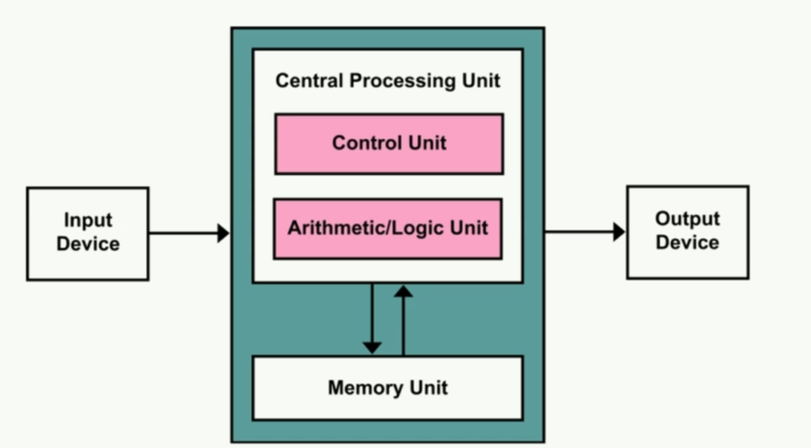
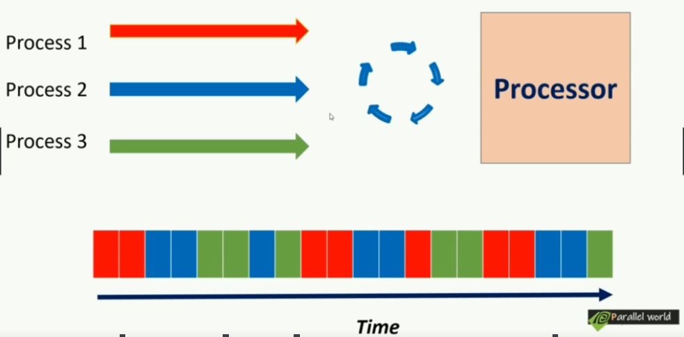
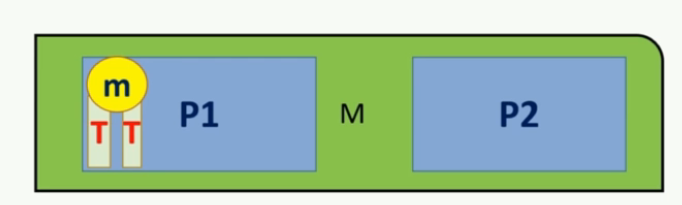
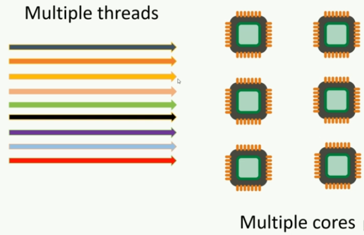

Keep in touch with standard committee members 

* Herb Shudder
* Anthony Williams
* Goran Nikonov
* Scott Mairs
* etc

# 22.Modern C++:Concurrency in Depth

## 22.1 并行计算简介

这是冯诺伊曼架构，现今所有的架构都能删减成这个架构。

- 在计算机中，程序指令存储在持久内存或硬盘上作为可执行文件。
- 当运行程序时，程序的指令被加载到中央处理单元（CPU）。
- 基础数据被加载到随机访问存储器（RAM）中。
- 计算机的处理单元（CPU）开始执行指令，同时根据运行时输入进行处理，并产生相应的输出。
- 尽管基础模型是逐条处理指令，但在现代计算机中，我们可以同时运行多个应用程序，实现多任务处理。

### 22.1.1 多任务的处理方法

#### 22.1.1.1 Process first

实现方法：Process First

- ==Process(进程)==是一个计算机应用程序的实例。

  当我们运行一个应用程序，该应用程序的**指令**会被fetch到处理器。同时，**内存**会在Ram中分配以保存运行时资源

  **这一个正在运行的实例就被称为进程**。

#### 22.1.1.2 Context & Round robin fashion execution

**循环式执行命令(round robin fashion execution of instructions)**

- ==Context(上下文)==指的是有关进程的数据集合(collection of data about process)。

  这些数据允许处理器挂起或保留特定进程，稍后继续执行。

  常见的context包括**内存地址(Memory address)与程序计数器状态(program counter states)**等。

- 如图所示，如果我们只有一个单核处理器，该处理器将执行这些进程指令。具体来说，处理器将基于特定进程的**准备情况**，**内存**以及优先级为每个进程**分配时隙（time slot)**。

  图中展示了一种可能的单核处理调度结果。

- 支持这种时隙分配的基本盘来自于==Context switching==，通过上下文切换，处理器可以**加载某个进程的上下文，并从他停止的状态开始执行它**。

#### 22.1.1.3 Thread

另一个与进程非常相似的重要概念是**线程**。

线程(thread)/一个线程的执行(thread of execution) 是一个可以独立管理的**小指令序列**。

Thread是进程的一个组件，每个进程至少有一个称为**主线程(main thread)**的线程，它是该程序的入口点。

举一个例子，在一个船上，船长相当于main thread，其他水手，厨师等类似其他thread

* main thread分配其他thread的任务，并接收反馈
* 其他thread有自己的独有任务，这些任务组成了这个process

#### 22.1.1.4 线程与进程的区别

* 线程在shared memory中运行，进程在separate memory中运行

  * **进程（Process）**：

    - 每个进程拥有自己的独立内存空间，这就是所谓的"separate memory"。
    - 这个内存空间包括代码、数据段以及其他的进程相关信息。
    - **进程间的内存是隔离的**，一个进程无法直接访问另一个进程的内存。
    - 操作系统通过内存管理单元（MMU）来保护每个进程的内存空间，确保进程间的隔离。

  * **线程（Thread）**：

    - 线程是进程内的一个执行单元，一个进程可以拥有一个或多个线程。
    - 线程在所属的进程的内存空间内运行，它们共享这一进程的内存，这就是所说的"shared memory"。
    - **线程之间可以直接访问同一进程的内存空间**，例如全局变量或堆内存。
    - 由于线程共享内存，它们之间的通信和数据交换比进程间更为高效，但也需要适当的同步机制来避免竞态条件和数据不一致。

    例如，如图

    P1和P2是两个Process，他们的内存是隔离的。在P1中，有两个thread共享一个shared memory `m`。

#### 22.1.1.5 线程，进程与核心

==核心代表计算资源，线程进程代表内存资源。多个核心可以访问同一个进程。==

1. **核心（Core）代表计算资源**：每个核心都是处理器的一个独立计算单元，能够独立执行指令和处理数据。多核处理器意味着有多个这样的计算单元。
2. **线程和进程代表内存资源的组织**：
   - **进程**是操作系统分配资源的基本单位，它拥有独立的内存空间（进程间内存是隔离的）。一个进程中可以包含多个线程。
   - **线程**是操作系统调度执行的基本单位。一个线程在某一时刻运行在一个核心上。它们共享所属进程的内存和资源。
3. **多核处理器和上下文切换**：
   - 在单核处理器中，如果有多个线程或进程需要执行，操作系统需要频繁进行上下文切换，以便让每个线程或进程在单个核心上轮流执行。
   - 在多核处理器中，多个线程可以同时在不同的核心上运行，减少了需要进行上下文切换的情况。当然，如果线程数量超过核心数量，仍然会发生上下文切换。
4. **上下文切换的原因**：
   - 上下文切换通常发生在==单个核心需要在多个任务（线程或进程）间切换时==。
   - 在多核处理器中，如果每个核心都有足够的任务来执行，就可以减少单个核心上的上下文切换。但整体上看，仍然可能会有上下文切换，尤其是在多线程的程序中。

#### 22.1.1.6 并行计算

现代CPU有多个内核可用，这意味着可以执行**多个线程或多个进程**，**同时上下文切换的需求会大大减少。**

> 1. **多核并行处理能力**：
>    * 在单核处理器中，CPU必须在不同的线程或进程间进行切换，以便它们都能获得处理时间。这种切换就是上下文切换。
>    * 但在多核处理器中，由于有多个核心，每个核心可以同时运行不同的线程或进程。因此，如果有足够的核心可用，一些线程或进程可以持续运行而无需切换到其他线程或进程。
> 2. **减少上下文切换次数**：由于能够同时处理更多的任务，多核处理器在处理多任务环境时可以减少上下文切换的次数。在单核处理器中，频繁的上下文切换可能导致较高的系统开销，而多核处理器可以更高效地分配任务。
> 3. **改善性能**：多核处理器可以更有效地利用资源来执行多个任务，从而提高了整体系统性能。这意味着相对于单核处理器，多核处理器可以在给定的时间内完成更多的工作，减少了因等待CPU资源而发生的上下文切换。
>
> 然而，需要注意的是，**即使在多核处理器系统中，如果运行的线程或进程数量超过核心数量，或者由于资源竞争（例如对于内存或I/O的竞争），系统仍然可能需要进行上下文切换。**此外，操作系统的任务调度策略也会影响上下文切换的频率和必要性。

这种类型的多线程同时处理就称为==并行处理==。

#### 22.1.1.7 并行的类型

**Task Level parallelism**(任务级并行) & **Data level parallelism**(数据级并行)

**任务级并行（Task Level Parallelism）**

任务级并行是指在并行环境中同时执行多个相互独立的任务。这种并行通常用于分布式系统或多处理器环境。

**数据级并行（Data Level Parallelism）**

数据级并行涉及将数据分成块，并在多个处理单元上并行处理这些数据块。这通常用于需要大量数据处理的任务，如数值计算和图像处理。

#### 22.1.1.8 Parallelism vs Concurrency:并行与并发

并行更关注如何通过同时执行来提高效率，而并发则关注如何有效管理多个同时存在的任务。

对于单核，多个任务处理就是并发，单核永远不能并行。

对于多核，同样多个任务处理就是并发，但是多核处理同一个任务就被看做并行。

在现实中，纯粹的并行是很难见到的

* 任务（线程）的数量会超过处理器核心的数量。在这种情况下，操作系统必须在核心间进行任务调度，这样就成了并发执行，此时许多任务在等待空闲的核心。
* 在特定场景中，任务的数量可能会少于处理器核心数量，在这种情况下可以实现真正的并行性，因为每个核心可以独立且同时处理一个单独的任务，没有任务之间的切换。