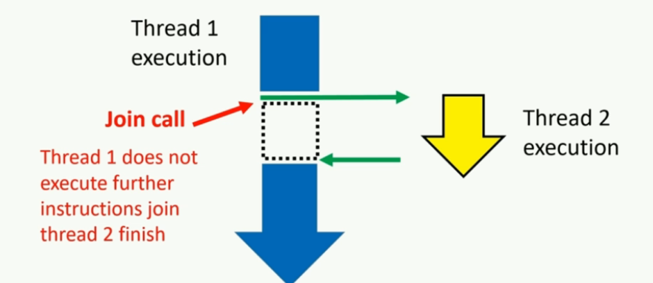
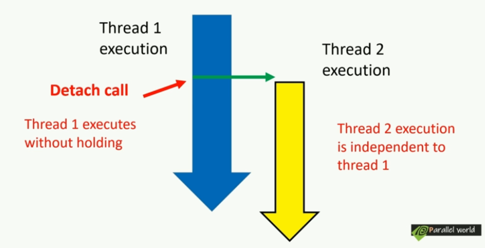
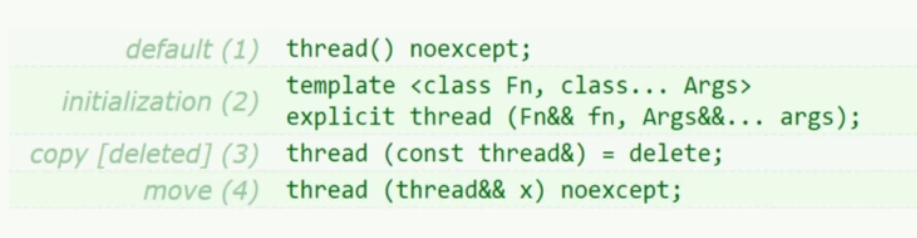
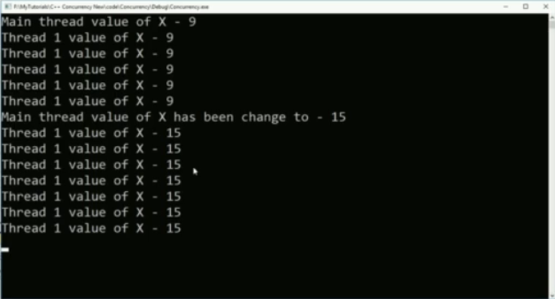
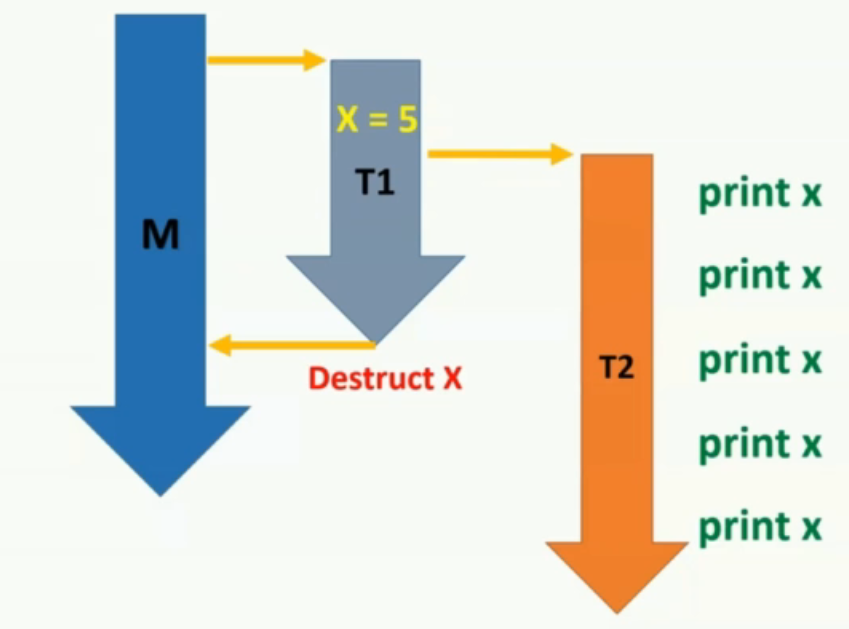
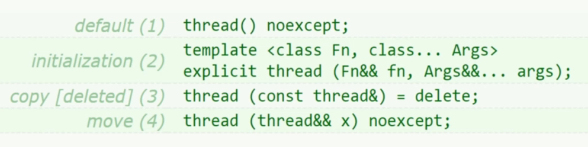

Keep in touch with standard committee members 

* Herb Shudder
* Anthony Williams
* Goran Nikonov
* Scott Mairs
* etc


# 22.Modern C++:Concurrency in Depth

## 22.1 并行计算简介


这是冯诺伊曼架构，现今所有的架构都能删减成这个架构。

- 在计算机中，程序指令存储在持久内存或硬盘上作为可执行文件。
- 当运行程序时，程序的指令被加载到中央处理单元（CPU）。
- 基础数据被加载到随机访问存储器（RAM）中。
- 计算机的处理单元（CPU）开始执行指令，同时根据运行时输入进行处理，并产生相应的输出。
- 尽管基础模型是逐条处理指令，但在现代计算机中，我们可以同时运行多个应用程序，实现多任务处理。


### 22.1.1 多任务的处理方法

#### 22.1.1.1 Process first

实现方法：Process First

- ==Process(进程)==是一个计算机应用程序的实例。

  当我们运行一个应用程序，该应用程序的**指令**会被fetch到处理器。同时，**内存**会在Ram中分配以保存运行时资源

  **这一个正在运行的实例就被称为进程**。

#### 22.1.1.2 Context & Round robin fashion execution

**循环式执行命令(round robin fashion execution of instructions)**


- ==Context(上下文)==指的是有关进程的数据集合(collection of data about process)。

  这些数据允许处理器挂起或保留特定进程，稍后继续执行。

  常见的context包括**内存地址(Memory address)与程序计数器状态(program counter states)**等。

- 如图所示，如果我们只有一个单核处理器，该处理器将执行这些进程指令。具体来说，处理器将基于特定进程的**准备情况**，**内存**以及优先级为每个进程**分配时隙（time slot)**。

  图中展示了一种可能的单核处理调度结果。

- 支持这种时隙分配的基本盘来自于==Context switching==，通过上下文切换，处理器可以**加载某个进程的上下文，并从他停止的状态开始执行它**。


#### 22.1.1.3 Thread

另一个与进程非常相似的重要概念是**线程**。

线程(thread)/一个线程的执行(thread of execution) 是一个可以独立管理的**小指令序列**。

Thread是进程的一个组件，每个进程至少有一个称为**主线程(main thread)**的线程，它是该程序的入口点。


举一个例子，在一个船上，船长相当于main thread，其他水手，厨师等类似其他thread

* main thread分配其他thread的任务，并接收反馈
* 其他thread有自己的独有任务，这些任务组成了这个process


#### 22.1.1.4 线程与进程的区别

* 线程在shared memory中运行，进程在separate memory中运行

  * **进程（Process）**：

    - 每个进程拥有自己的独立内存空间，这就是所谓的"separate memory"。
    - 这个内存空间包括代码、数据段以及其他的进程相关信息。
    - **进程间的内存是隔离的**，一个进程无法直接访问另一个进程的内存。
    - 操作系统通过内存管理单元（MMU）来保护每个进程的内存空间，确保进程间的隔离。

  * **线程（Thread）**：

    - 线程是进程内的一个执行单元，一个进程可以拥有一个或多个线程。
    - 线程在所属的进程的内存空间内运行，它们共享这一进程的内存，这就是所说的"shared memory"。
    - **线程之间可以直接访问同一进程的内存空间**，例如全局变量或堆内存。
    - 由于线程共享内存，它们之间的通信和数据交换比进程间更为高效，但也需要适当的同步机制来避免竞态条件和数据不一致。

    例如，如图

    P1和P2是两个Process，他们的内存是隔离的。在P1中，有两个thread共享一个shared memory `m`。


#### 22.1.1.5 线程，进程与核心

==核心代表计算资源，线程进程代表内存资源。多个核心可以访问同一个进程。==

1. **核心（Core）代表计算资源**：每个核心都是处理器的一个独立计算单元，能够独立执行指令和处理数据。多核处理器意味着有多个这样的计算单元。
2. **线程和进程代表内存资源的组织**：
   - **进程**是操作系统分配资源的基本单位，它拥有独立的内存空间（进程间内存是隔离的）。一个进程中可以包含多个线程。
   - **线程**是操作系统调度执行的基本单位。一个线程在某一时刻运行在一个核心上。它们共享所属进程的内存和资源。
3. **多核处理器和上下文切换**：
   - 在单核处理器中，如果有多个线程或进程需要执行，操作系统需要频繁进行上下文切换，以便让每个线程或进程在单个核心上轮流执行。
   - 在多核处理器中，多个线程可以同时在不同的核心上运行，减少了需要进行上下文切换的情况。当然，如果线程数量超过核心数量，仍然会发生上下文切换。
4. **上下文切换的原因**：
   - 上下文切换通常发生在==单个核心需要在多个任务（线程或进程）间切换时==。
   - 在多核处理器中，如果每个核心都有足够的任务来执行，就可以减少单个核心上的上下文切换。但整体上看，仍然可能会有上下文切换，尤其是在多线程的程序中。


#### 22.1.1.6 并行计算

现代CPU有多个内核可用，这意味着可以执行**多个线程或多个进程**，**同时上下文切换的需求会大大减少。**

> 1. **多核并行处理能力**：
>    * 在单核处理器中，CPU必须在不同的线程或进程间进行切换，以便它们都能获得处理时间。这种切换就是上下文切换。
>    * 但在多核处理器中，由于有多个核心，每个核心可以同时运行不同的线程或进程。因此，如果有足够的核心可用，一些线程或进程可以持续运行而无需切换到其他线程或进程。
> 2. **减少上下文切换次数**：由于能够同时处理更多的任务，多核处理器在处理多任务环境时可以减少上下文切换的次数。在单核处理器中，频繁的上下文切换可能导致较高的系统开销，而多核处理器可以更高效地分配任务。
> 3. **改善性能**：多核处理器可以更有效地利用资源来执行多个任务，从而提高了整体系统性能。这意味着相对于单核处理器，多核处理器可以在给定的时间内完成更多的工作，减少了因等待CPU资源而发生的上下文切换。
>
> 然而，需要注意的是，**即使在多核处理器系统中，如果运行的线程或进程数量超过核心数量，或者由于资源竞争（例如对于内存或I/O的竞争），系统仍然可能需要进行上下文切换。**此外，操作系统的任务调度策略也会影响上下文切换的频率和必要性。


这种类型的多线程同时处理就称为==并行处理==。


#### 22.1.1.7 并行的类型

**Task Level parallelism**(任务级并行) & **Data level parallelism**(数据级并行)

**任务级并行（Task Level Parallelism）**

任务级并行是指在并行环境中同时执行多个相互独立的任务。这种并行通常用于分布式系统或多处理器环境。

**数据级并行（Data Level Parallelism）**

数据级并行涉及将数据分成块，并在多个处理单元上并行处理这些数据块。这通常用于需要大量数据处理的任务，如数值计算和图像处理。


#### 22.1.1.8 Parallelism vs Concurrency:并行与并发

并行更关注如何通过同时执行来提高效率，而并发则关注如何有效管理多个同时存在的任务。

对于单核，多个任务处理就是并发，单核永远不能并行。

对于多核，同样多个任务处理就是并发，但是多核处理同一个任务就被看做并行。


在现实中，纯粹的并行是很难见到的

* 任务（线程）的数量会超过处理器核心的数量。在这种情况下，操作系统必须在核心间进行任务调度，这样就成了并发执行，此时许多任务在等待空闲的核心。
* 在特定场景中，任务的数量可能会少于处理器核心数量，在这种情况下可以实现真正的并行性，因为每个核心可以独立且同时处理一个单独的任务，没有任务之间的切换。


## 22.2 几个问题

1. **为什么学习并发编程或并行编程很重要？**
   - 随着计算需求的增长，现代计算机系统的架构越来越依赖多核和多处理器技术。并发和并行编程允许我们充分利用这些多核系统的性能，通过同时执行多个任务或操作来提高效率和处理速度。特别是在数据密集型和计算密集型应用中，如大数据分析、机器学习、科学计算和实时处理，这些技能是至关重要的。
2. **哪些范式广泛使用并行处理？**
   - **大数据处理**：需要并行处理海量数据。
   - **机器学习和人工智能**：并行算法可以加速训练和推理过程。
   - **科学计算和模拟**：并行处理可用于复杂的物理模拟和数值分析。
   - **实时系统**：比如游戏和交互式应用，需要快速响应用户输入。
3. **为什么这些领域需要并行处理的方法？**
   - 这些领域通常涉及处理大量数据或执行复杂的计算任务。并行处理使得这些任务可以在更短的时间内完成，因为它们可以被分割成多个部分，同时在多个处理器或核心上执行。这不仅提高了效率和性能，还可以解决单线程处理无法在合理时间内解决的问题。
4. **什么是异构计算？你能举出一些这样的系统的例子吗？**
   - 异构计算是指使用不同类型的处理器或计算资源共同工作以提高计算效率的方法。这些不同类型的处理器可能包括传统的CPU、图形处理器（GPU）、数字信号处理器（DSP）和专用集成电路（ASIC）。
   - 例子包括：
     - 使用CPU和GPU的个人电脑或游戏机。
     - 集成CPU和FPGA（现场可编程门阵列）的嵌入式系统。
     - 数据中心使用CPU、GPU和TPU（张量处理单元）进行高效的机器学习计算。
5. **GPU代表什么？它与传统并行编程有何不同？**
   - GPU代表图形处理单元，它是一种专为快速图像处理和计算密集型任务而设计的处理器。与传统CPU相比，GPU具有更多的核心，但每个核心的时钟速度较慢，适合执行大量的并行操作。
   - 与传统并行编程（通常指在多核CPU上执行的并行处理）相比，GPU编程更加专注于数据并行性和吞吐量。GPU非常适合执行可以分解为许多小而类似的操作的任务，例如图像和视频处理、机器学习中的大规模矩阵运算等。


## 22.3 Thread

### 22.3.0 一个thread的消耗

即使线程被分配了一个简单的任务（比如打印一条消息），线程的完成时间也不一定能预测。这是因为线程的执行受到多种因素的影响，包括：

1. **调度和处理器时间分配：** 操作系统根据可用的处理器资源和其他正在运行的线程或进程来调度线程。如果系统忙于处理其他任务，即使是简单的线程也可能需要等待一段时间才能得到执行。
2. **上下文切换：** 如果系统中有许多并发运行的线程或进程，操作系统需要在它们之间进行上下文切换，这可能导致每个线程实际运行时间的延迟。
3. **线程启动时间：** 创建线程和启动它的执行可能需要一些时间，特别是在资源受限的系统中。
4. **I/O 延迟：** 如果线程涉及到输入/输出操作（比如打印到控制台），这些操作可能不是立即完成的，因为它们可能依赖于系统资源和其他外部因素。

由于这些原因，在主线程中调用 `join()` 时，即使是简单的线程也可能尚未完成其执行。这就是为什么在实际应用程序中，通常要小心处理线程同步和协调问题。


### 22.3.1 启动一个Thread

```c++
//launch_a_thread.h

#include<iostream>
#include<thread> // basic header file
void func1(){
    std::cout << "Hello fron function1 - thread" << std::this_thread::get_id() << endl;
}

class my_class{
public:
    void operator()(){
        std::cout << "Hello from the class with overload call operator in thread " << std::this_thread::get_id() << endl;
    }
};


void run(){
    std::thread thread1(func1);
	my_class mc;
    std::thread thread2(mc);
    std::thread thread3([]{
        std::cout << "Hello from the lambda" << endl;
    });
    
    thread1.join();
    thread2.join();
    thread3.join();
}
```

* 在这个例子里，run函数作为main thread，而func1，my_class, lambda是作为其他thread
* 我们通过`std::thread`类创建了三个thread实例，**创建即开始执行**（an active thread of execution)，并使用join阻塞程序，**如果对应的thread没有完成，那么在run中，就不会执行其对应join之后的代码。**

我们上面的代码会出现如下输出

```bash
Hello from the lambda, in thread  Hello fron function1 - thread  Hello from the class with overload call operator in thread 752
20468
27912
```

当然，每次输出的可能不一样，但是一样的是他们都是混乱的。


这三个线程几乎同时启动，并行运行。因此，它们的输出顺序是不确定的，完全取决于操作系统调度线程的方式。在多线程环境中，没有哪个线程会保证首先完成或按特定顺序执行。**这种输出结果反映了多线程编程的本质特点：并发性和不可预测性。**

这里的输出混乱问题通常是由于多个线程同时尝试写入共享资源（在这种情况下是标准输出 `std::cout`）而导致的。**这是因为 `std::cout` 并不是线程安全的**，当多个线程同时尝试向其写入数据时，输出可能会交错或重叠。

换句话说，我们可以使用如下代码来保证线程安全，当然代价是完全牺牲并行性。

```c++
void run(){
    std::thread thread1(func1);
    thread1.join();
    
    
	my_class mc;
    std::thread thread2(mc);
    thread2.join();
    
    
    std::thread thread3([]{
        std::cout << "Hello from the lambda" << endl;
    });
    thread3.join();
}
```


### 22.3.2 线程的可连接性(Joinability of thread)

==线程启动后没有join会使得程序不安全，因此throw an exception==

`join()` 函数和 `joinable()` 函数在多线程编程中扮演了关键角色，它们的名称与它们的功能密切相关：

1. **为什么叫 `join()`：** 在多线程编程中，`join()` 函数的主要作用是“加入”或者说“等待”。当你创建一个新的线程时，它会与创建它的线程（通常是主线程）分离开来并独立执行。当调用 `join()` 时，你实际上是在告诉创建线程（如主线程）暂停执行，直到被 `join()` 的线程完成其任务。**一旦那个线程完成了，它就会“加入”回创建它的线程**，这时两个线程会同步。因此，“join”这个词很形象地描述了这一过程。
2. **`joinable()` 函数的目的：** `joinable()` 函数用于检查一个线程是否处于可加入（joinable）状态。一个线程是可加入的，意味着它已经被启动并且尚未加入（join）。**一旦线程已经加入或者从未被启动，它就不再是可加入的。**这个函数主要用于在调用 `join()` 之前检查线程的状态，以确保程序不会试图加入一个不可加入的线程，这可能会导致运行时错误。

```c++
#pragma once
#include<iostream>
#include<thread>
namespace join_joinable_detach {
	void test() {
		std::cout << "Call from test, thread ID " << std::this_thread::get_id() << std::endl;
	}

	void run()
	{
		std::thread thread1(test);

		if (thread1.joinable()) {
			std::cout << "Thread 1 is joinable before join \n";
		}
		else {
			printf("Thread 1 is not joinable before join \n");
		}
		thread1.join();

		if (thread1.joinable()) {
			std::cout << "Thread 1 is joinable after join \n";
		}
		else {
			printf("Thread 1 is not joinable after join \n");
		}

	}
}
```

```bash
Thread 1 is joinable before join
Call from test, thread ID 27892
Thread 1 is not joinable after join
```

注意，==正确的构造线程是可连接的(properly consrtucted thread is joinable)==，为了正确构造线程，我们必须将**可调用的对象(callable ojbect)**作为参数传给线程类构造函数。如果该callable object需要传参，还要保证传参正确。

不正确的构造意味着线程启动失败，因此它本身就是unjoinable的。


关于线程是否完成后还是 `joinable` 的问题，答案是不是。一旦线程完成执行，它就不再是 `joinable` 的了。在C++中，`std::thread` 对象有一个 `joinable()` 成员函数，用于检查线程对象是否代表一个活跃的执行线程。**如果线程已经完成执行或者从未开始执行（例如，是一个默认构造的 `std::thread` 对象），`joinable()` 将返回 `false`。**

这就是为什么在调用 `join()` 或 `detach()` 之前检查 `joinable()` 是一个好习惯，特别是在处理可能已经完成或在其他地方已经被操作过的线程时。例如：

```c++
if (myThread.joinable()) {
    myThread.join();  // 或 myThread.detach();
}
```

这样做可以确保您不会试图加入或分离一个已经不是 `joinable` 的线程，这在C++中会导致运行时错误。


### 22.3.3 加入与分离函数(Join and Detach functions)

* `Join` introduce a **synchronize point** between launched thread and thread that it launched from, It **blocks the execution of the thread that calls join function**, until the launched thread's execution finished.

  

* `Detach`函数调用会将启动的线程与调用线程(calling thread)分开，允许调用线程独立继续执行。一旦线程完成执行，分离线程内的任何已分配资源都将会被释放。

  


```c++
	void foo() {
		std::this_thread::sleep_for(std::chrono::milliseconds(5000));
		std::cout << "Hello from foo\n";
	}

	void bar() {
		std::this_thread::sleep_for(std::chrono::milliseconds(5000));
		std::cout << "Hello from bar\n";
	}
	void run_join_detach() {
		std::thread foo_thread(foo);
		std::thread bar_thread(bar);

		bar_thread.detach();
		std::cout << "this is after bar thread detach\n";

		foo_thread.join();
		std::cout << " This is after foo thread join\n";
	}
```

```bash
this is after bar thread detach
//注释：中间停了很久
Hello from bar
Hello from foo
 This is after foo thread join
```

* **线程 `bar_thread` 被分离（detach）：** 使用 `detach()` 方法将 `bar_thread` 从主线程分离。这意味着 `bar_thread` 将独立于主线程运行，并且在 `bar_thread` 完成执行后会自动清理资源。分离线程后，主线程不会等待它完成，而是继续执行下面的代码。
* **线程 `foo_thread` 被加入（join）：** 使用 `join()` 方法将 `foo_thread` 加入回主线程。这意味着主线程会在这一点停止执行，直到 `foo_thread` 完成其执行。`foo()` 函数中的 `sleep_for()` 使 `foo_thread` 暂停5秒，因此主线程也会因调用 `join()` 而暂停同样的时间。
* 我们可以发现，bar的"this is after bar thread detach"是在"Hello from bar"之前，说明detach实际上不会阻塞main thread。


### 22.3.4 How to handle join

#### 22.3.4.1 异常抛出的情景

```c++
void foo(){
    std::cout << "This is from foo\n";
}

void other_operations(){
    std::cout << "this is other operation\n";
    throw std::runtime_error("This is a runtime error");
}

void run(){
    std::thread foo_thread(foo);
    other_operations();
    foo_thread.join();
}
```

* 通常来说，join发生在我们需要用到所处理的数据之前，而不会立刻在声明了实例之后join。
* 此时，若是中间发生了如例子中一样的异常抛出，程序会直接终止，**此时这个独立的thread并没有join**，会导致不安全的程序。

==解决方法1==

```c++
void run(){
    std::thread foo_thread(foo);
    try{
        other_operations();
        foo_thread.join();
    }
    //如果抛出错误，try block仍然不会继续执行join，因此在try block和catch block都需要join
    catch(...){
        foo_thread.join();
    }
}
```

但是如果代码包含数千行时，使用try-catch block来保证join会导致繁琐和低效的程序。


==A better way of having guaranteed join function calls even in an exception scenario==

使用**RAII(Resource acquisition is initialization)**

与构造函数析构函数类似，

* 当一个对象被创建或它的构造函数调用时，所有资源都将为该对象分配。
* 当它被破坏或该对象的析构函数被调用时，则相关资源会被释放

使用**Class call thread guard**:这个类将在以后常常用到，因此推荐封装到一个单独的头文件中


```c++
//call_thread_guard
#pragma once

#include<vector>
#include<thread>

class thread_guard{
    std::thread &t;
public:
    explicit thread_guard(std::thread & _t):t(_t){
        
    }
    
    ~thread_guard(){
        if(t.joinable()){
            t.join();
        }
    }
    
    thread_guard(thread_guard & const) = delete;
    thread_guard &operator= (thread_guard &const) = delete;
}

```

* `explicit thread_guard(std::thread & _t):t(_t)`:
  * `explicit` 关键字在防止隐式类型转换时非常有用，这在设计API和类时可以避免一些意外和潜在的错误。
    * 例如，若存在`void NewFunction(thread_guard &input)`，
      * 那么在没有使用explicit关键字之前，`NewFunction(thread1)`是可接受的，这个thread实例会被隐式转换为`NewFuncton(thread_guard(thread1)`。其中有`std::thread thread1(A)`;==注意，这里的构造函数是引用传递，因此类似`thread_guard(std::thread(A))`是无效的。引用传递保证了thread_guard接收到一个有效的，持久的std::thread对象引用，它可以在thread_guard的生命周期内安全的管理==
      * 在使用了explicit关键字之后，只能传入`NewFuncton(thread_guard(thread1)`
      * 通过将构造函数标记为 `explicit`，你强制编程者在使用 `thread_guard` 类时必须明确其意图，从而减少错误和混淆。
* `thread_guard(thread_guard & const) = delete;`&`thread_guard &operator= (thread_guard &const) = delete;`
  * 这两个函数被删除（用 `= delete` 表示），这意味着 `thread_guard` 对象不能被拷贝或赋值。这是必要的，**因为拷贝或赋值线程管理器可能导致多次尝试加入同一个线程**，这是不安全的。

```c++
#pragma once

# include<iostream>
# include<vector>
# include<thread>
# include "call_thread_guard.h"

namespace exception_scenario {
	void foo(){
		std::cout << "This is from foo" << std::endl;
	}

	void other_operations() {
		std::cout << "An error will be thrown\n";
		throw std::runtime_error("This is a runtime error");
	}

	void run() {
		std::thread foo_thread(foo);
		thread_guard tg(foo_thread);
		try {
			other_operations();
		}
		catch (...) {

		}
	}

}
```


### 22.3.5 小测

```c++
#pragma once
# include<iostream>
# include<thread>
# include<vector>
# include<chrono>
# include "call_thread_guard.h"


namespace ship_example {
	/*
	考虑三个参与者，Captain船长，EngineCrew机组以及Cleaners清洁工
	
	船长由主线程表示

	船长可以发出三个命令：
	命令清洁人员清洁，但是船长不必等这个命令完成
	接下来的两个命令是全速前进和停止发动机命令，船长必须等到机组完成这些命令才能继续执行下一个命令

	Input是一个整数代表上述命令：
	1代表cleanning
	2代表全速前进
	3代表停止发动机
	100是退出程序
	其他编号是无效订单，需要在控制台打印

	使用sleep和cout来模拟这个过程
	*/
	auto program_start = std::chrono::high_resolution_clock::now();
	void show_time() {
		auto now = std::chrono::high_resolution_clock::now();
		std::chrono::duration<double> elapsed = now - program_start;
		std::cout << "Current timestamp: " << elapsed.count() << " seconds since program start." << std::endl;
	}

	void cleaner() {
		std::cout << "Cleaning the board\n";
		std::this_thread::sleep_for(std::chrono::milliseconds(5000));
		std::cout << "Cleaning complete\n";

	}

	void EngineCrew_fullspeedahead() {
		std::cout << "Full speed ahead\n";
		std::this_thread::sleep_for(std::chrono::milliseconds(5000));
		std::cout << "Slow down\n";

	}

	void EngineCrew_StopEngine() {
		std::cout << "StopEngine\n";

	}

	void captain(std::vector<int> Execution_code_list) {
		std::vector<std::thread> join_list;
		std::vector<std::thread> detach_list;
		for (auto code : Execution_code_list) {
			if (code == 100) break;

			switch (code) {
			case 1:
				detach_list.push_back(std::thread(cleaner));
				break;
			case 2:
				join_list.push_back(std::thread(EngineCrew_fullspeedahead));
				break;
			case 3:
				join_list.push_back(std::thread(EngineCrew_fullspeedahead));
				break;
			default:
				std::cout << "Invalid command.\n";
			}
		}
		for (auto &threadd : detach_list) {
			threadd.detach();
		}
		for (auto& threadadd : join_list) {
			threadadd.join();
			//show_time();
		}
	}
}

```

```bash
Invalid command.
Full speed ahead
Cleaning the board
Full speed ahead
Cleaning the board
Cleaning the board
Full speed ahead
Full speed ahead
//中间很长一段等待
Slow down
Cleaning complete
Slow down
Cleaning complete
Slow down
Cleaning complete
Slow down
```

这段代码有几个点：

* show time表现不佳，因为不是线程安全
* 在遍历vector时需要引用，**因为thread实例不能复制**
* push_back一个右值或者emplace_back参数（例如`join_list.emplace_back(EngineCrew_fullspeedahead)`)效果差不多，因为vector会自动对push_back调用move，因此性能也差不多
* Invalid command会第一个输出，因为其他线程都没有运行完


### 22.3.6 向thread传参(Pass parameters to a thread)

针对的情况是：我们需要在单独的线程中运行的函数具有参数列表

在这种情况下，我们可以在启动线程时传递参数。


#### 22.3.6.1 了解thread class constructors

首先，我们来了解以下thread类的构造函数



* 当我们使用默认构造函数构造线程时，它不表示任何active thread of execution
* 线程类的**copy constructor**被删除，但是有**move constructor**与**initialization constructor**
* 我们可以将函数名称后面的参数传递给这个**Initialization constructor**

```c++
#pragma once
/*这一个部分主要展示线程参数传递*/
#include<iostream>
#include<thread>

namespace pass_parameters {
    void func1(int p, int q) {
        printf("X + Y = %d\n", p + q);
    }

    void func_2(int& x) {
        while (true) {
            printf("THread1 value of X -%d \n", x);
            std::this_thread::sleep_for(std::chrono::milliseconds(1000));
        }
    }
    void run_1() {
        int p = 9;
        int q = 9;
        std::thread thread_1(func1, p, q);

        thread_1.join();
    }

    void run_2() {
        int x = 9;
        printf("Main thread value of X - %d\n", x);
        std::thread thread_2(func_2, std::ref(x));
        std::this_thread::sleep_for(std::chrono::milliseconds(5000));
        x = 15;
        printf("Main thread value of X has been change to - %d \n", x);
        thread_2.join();
    }
}
```



结果如上，这是一个很有意思的，不用thread不会出现的情况。这能明显看出有两个线程在工作。

##### Pass by reference

在 C++ 标准库中，当创建一个新线程并传递参数给它时，==**默认情况下，这些参数是通过值传递的。**==这意味着无论原始参数的类型如何，都会创建参数的副本，并将副本传递给线程函数。因此，**即使 `func_2` 的参数是一个引用类型（例如 `int&`），在创建线程时传递的参数仍然会被复制。**

==为了确保原始变量（而不是其副本）被传递给线程函数，您需要使用 `std::ref`。`std::ref` 生成一个对原始变量的引用的封装器，从而使得线程能够接收一个引用而不是副本。==

简单传入 `x` 不会达到预期的效果，因为即使 `func_2` 接收一个引用（`int &x`），创建线程时传递的 `x` 仍会被复制。这个复制的值将被包装成一个临时对象，并作为引用传递给 `func_2`。这可能导致 `func_2` 操作的不是您期望的原始 `x` 变量。

使用 `std::ref(x)`，您确保 `x` 的原始实例（而非其副本）被传递给线程函数，允许线程直接修改 `x`。


#### 22.3.6.2 Detach在嵌套时的一个问题

```c++
void func_2(int &x){
    while(true){
        try{
            std::cout << x << sstd::endl;
            std::this_thread::sleep_for(std::chrono::milliseconds(1000));
        }
        catch(...){
            throw std::runtime_error("this is a runtime error");
        }
    }
}

void func_1(){
    int x=5;
    std::thread thread_2(func_2, std::ref(x));
    thread_2.detach();
    std::this_thread::sleep_for(std::chrono::milliseconds(5000));
    std::cout << "thread_1 finished execution \n";
}

void run(){
    std::thread thread_1(func_1);
    thread_1.join();
}
```

具体会发生什么？

* 在前5秒，正常输出5，5，5，5，5
* 然后出现`thread_1 finished execution `
* 此时就会出现错误，当然在代码中进入了catch，throw了一个exception
* 这是因为==**在线程1完成执行后，它将逆序破坏函数1中的对象**==，考虑到这个代码中我们已经将thread2 detach了，也就是与thread1无关了，因此当thread1结束时，thread_2并不会被破坏或是join。
* 因此，==**即使thread1回收了变量x在线程中的内存之后，thread2仍然会尝试通过引用访问内存位置。**==，此时一个Access Violation exception就被thrown了。
* 这是独属于detach的问题，因为join会阻塞线程。当然，如果是值传递，也不会有任何问题。
* Be careful when you are detaching threads after you pass reference to a variable to that thread as **detached thread can outlive the lifetime** of the objects in the thread that it detached from.




### 22.3.7 转移thread的所有权(Transferring ownership of a thread)

简单来说就是使用thread类的Move constructor转移所有权



```c++
#pragma once
#include <chrono>
#include <iostream>
#include <thread>

namespace transfer_ownership {
	void foo() {
		//std::cout << "Thread ID " << std::this_thread::get_id() << " from foo\n";
		printf("Thread ID %d from foo\n", std::this_thread::get_id());
	}

	void bar() {
		//std::cout << "Thread ID " << std::this_thread::get_id() << " from bar\n";
		printf("Thread ID %d from bar\n", std::this_thread::get_id());
	}

	void run() {
		std::thread thread_1(foo);

		std::thread thread_2 = std::move(thread_1);

		thread_1 = std::thread(bar);
		//在这里，发生了隐式的移动调用（因为右边是右值）而非赋值，所以没问题

		/*
		std::thread_3(foo);
		thread_1 = std::move(thread_3);//这一个操作会throw 一个exception，因为thread1有管理的线程，这里的操作实际上是在覆盖所有权而非转移
		*/
		thread_1.join();
		thread_2.join();
	}
}
```

* 线程对象的变量所有者负责管理线程对象的生命周期(Owner of the thread object is responsible for managing the thread object's lifecycle)
* 在例子中，转移了所有权之后，thread_1不再拥有任何线程对象
* 在转移线程所有权时，**有可能在转移之前，线程已经完成了它的任务**。这种情况下，==转移的线程对象将会处于一个有效但没有关联执行线程的状态。这意味着该线程对象仍然可以进行操作（例如被分配一个新的线程），**但它不再代表任何正在运行的线程**。==