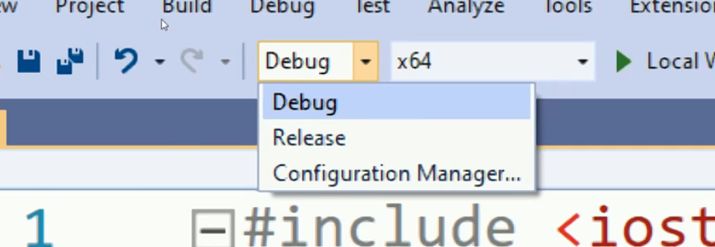
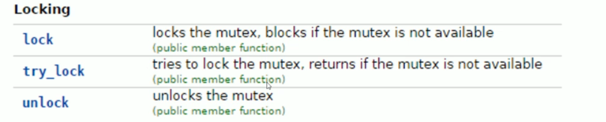

Keep in touch with standard committee members 

* Herb Shudder
* Anthony Williams
* Goran Nikonov
* Scott Mairs
* etc


# 22.Modern C++:Concurrency in Depth

## 22.1 并行计算简介


这是冯诺伊曼架构，现今所有的架构都能删减成这个架构。

- 在计算机中，程序指令存储在持久内存或硬盘上作为可执行文件。
- 当运行程序时，程序的指令被加载到中央处理单元（CPU）。
- 基础数据被加载到随机访问存储器（RAM）中。
- 计算机的处理单元（CPU）开始执行指令，同时根据运行时输入进行处理，并产生相应的输出。
- 尽管基础模型是逐条处理指令，但在现代计算机中，我们可以同时运行多个应用程序，实现多任务处理。


### 22.1.1 多任务的处理方法

#### 22.1.1.1 Process first

实现方法：Process First

- ==Process(进程)==是一个计算机应用程序的实例。

  当我们运行一个应用程序，该应用程序的**指令**会被fetch到处理器。同时，**内存**会在Ram中分配以保存运行时资源

  **这一个正在运行的实例就被称为进程**。

#### 22.1.1.2 Context & Round robin fashion execution

**循环式执行命令(round robin fashion execution of instructions)**


- ==Context(上下文)==指的是有关进程的数据集合(collection of data about process)。

  这些数据允许处理器挂起或保留特定进程，稍后继续执行。

  常见的context包括**内存地址(Memory address)与程序计数器状态(program counter states)**等。

- 如图所示，如果我们只有一个单核处理器，该处理器将执行这些进程指令。具体来说，处理器将基于特定进程的**准备情况**，**内存**以及优先级为每个进程**分配时隙（time slot)**。

  图中展示了一种可能的单核处理调度结果。

- 支持这种时隙分配的基本盘来自于==Context switching==，通过上下文切换，处理器可以**加载某个进程的上下文，并从他停止的状态开始执行它**。


#### 22.1.1.3 Thread

另一个与进程非常相似的重要概念是**线程**。

线程(thread)/一个线程的执行(thread of execution) 是一个可以独立管理的**小指令序列**。

Thread是进程的一个组件，每个进程至少有一个称为**主线程(main thread)**的线程，它是该程序的入口点。


举一个例子，在一个船上，船长相当于main thread，其他水手，厨师等类似其他thread

* main thread分配其他thread的任务，并接收反馈
* 其他thread有自己的独有任务，这些任务组成了这个process


#### 22.1.1.4 线程与进程的区别

* 线程在shared memory中运行，进程在separate memory中运行

  * **进程（Process）**：

    - 每个进程拥有自己的独立内存空间，这就是所谓的"separate memory"。
    - 这个内存空间包括代码、数据段以及其他的进程相关信息。
    - **进程间的内存是隔离的**，一个进程无法直接访问另一个进程的内存。
    - 操作系统通过内存管理单元（MMU）来保护每个进程的内存空间，确保进程间的隔离。

  * **线程（Thread）**：

    - 线程是进程内的一个执行单元，一个进程可以拥有一个或多个线程。
    - 线程在所属的进程的内存空间内运行，它们共享这一进程的内存，这就是所说的"shared memory"。
    - **线程之间可以直接访问同一进程的内存空间**，例如全局变量或堆内存。
    - 由于线程共享内存，它们之间的通信和数据交换比进程间更为高效，但也需要适当的同步机制来避免竞态条件和数据不一致。

    例如，如图

    P1和P2是两个Process，他们的内存是隔离的。在P1中，有两个thread共享一个shared memory `m`。


#### 22.1.1.5 线程，进程与核心

==核心代表计算资源，线程进程代表内存资源。多个核心可以访问同一个进程。==

1. **核心（Core）代表计算资源**：每个核心都是处理器的一个独立计算单元，能够独立执行指令和处理数据。多核处理器意味着有多个这样的计算单元。
2. **线程和进程代表内存资源的组织**：
   - **进程**是操作系统分配资源的基本单位，它拥有独立的内存空间（进程间内存是隔离的）。一个进程中可以包含多个线程。
   - **线程**是操作系统调度执行的基本单位。一个线程在某一时刻运行在一个核心上。它们共享所属进程的内存和资源。
3. **多核处理器和上下文切换**：
   - 在单核处理器中，如果有多个线程或进程需要执行，操作系统需要频繁进行上下文切换，以便让每个线程或进程在单个核心上轮流执行。
   - 在多核处理器中，多个线程可以同时在不同的核心上运行，减少了需要进行上下文切换的情况。当然，如果线程数量超过核心数量，仍然会发生上下文切换。
4. **上下文切换的原因**：
   - 上下文切换通常发生在==单个核心需要在多个任务（线程或进程）间切换时==。
   - 在多核处理器中，如果每个核心都有足够的任务来执行，就可以减少单个核心上的上下文切换。但整体上看，仍然可能会有上下文切换，尤其是在多线程的程序中。


#### 22.1.1.6 并行计算

现代CPU有多个内核可用，这意味着可以执行**多个线程或多个进程**，**同时上下文切换的需求会大大减少。**

> 1. **多核并行处理能力**：
>    * 在单核处理器中，CPU必须在不同的线程或进程间进行切换，以便它们都能获得处理时间。这种切换就是上下文切换。
>    * 但在多核处理器中，由于有多个核心，每个核心可以同时运行不同的线程或进程。因此，如果有足够的核心可用，一些线程或进程可以持续运行而无需切换到其他线程或进程。
> 2. **减少上下文切换次数**：由于能够同时处理更多的任务，多核处理器在处理多任务环境时可以减少上下文切换的次数。在单核处理器中，频繁的上下文切换可能导致较高的系统开销，而多核处理器可以更高效地分配任务。
> 3. **改善性能**：多核处理器可以更有效地利用资源来执行多个任务，从而提高了整体系统性能。这意味着相对于单核处理器，多核处理器可以在给定的时间内完成更多的工作，减少了因等待CPU资源而发生的上下文切换。
>
> 然而，需要注意的是，**即使在多核处理器系统中，如果运行的线程或进程数量超过核心数量，或者由于资源竞争（例如对于内存或I/O的竞争），系统仍然可能需要进行上下文切换。**此外，操作系统的任务调度策略也会影响上下文切换的频率和必要性。


这种类型的多线程同时处理就称为==并行处理==。


#### 22.1.1.7 并行的类型

**Task Level parallelism**(任务级并行) & **Data level parallelism**(数据级并行)

**任务级并行（Task Level Parallelism）**

任务级并行是指在并行环境中同时执行多个相互独立的任务。这种并行通常用于分布式系统或多处理器环境。

**数据级并行（Data Level Parallelism）**

数据级并行涉及将数据分成块，并在多个处理单元上并行处理这些数据块。这通常用于需要大量数据处理的任务，如数值计算和图像处理。


#### 22.1.1.8 Parallelism vs Concurrency:并行与并发

并行更关注如何通过同时执行来提高效率，而并发则关注如何有效管理多个同时存在的任务。

对于单核，多个任务处理就是并发，单核永远不能并行。

对于多核，同样多个任务处理就是并发，但是多核处理同一个任务就被看做并行。


在现实中，纯粹的并行是很难见到的

* 任务（线程）的数量会超过处理器核心的数量。在这种情况下，操作系统必须在核心间进行任务调度，这样就成了并发执行，此时许多任务在等待空闲的核心。
* 在特定场景中，任务的数量可能会少于处理器核心数量，在这种情况下可以实现真正的并行性，因为每个核心可以独立且同时处理一个单独的任务，没有任务之间的切换。


## 22.2 几个问题

1. **为什么学习并发编程或并行编程很重要？**
   - 随着计算需求的增长，现代计算机系统的架构越来越依赖多核和多处理器技术。并发和并行编程允许我们充分利用这些多核系统的性能，通过同时执行多个任务或操作来提高效率和处理速度。特别是在数据密集型和计算密集型应用中，如大数据分析、机器学习、科学计算和实时处理，这些技能是至关重要的。
2. **哪些范式广泛使用并行处理？**
   - **大数据处理**：需要并行处理海量数据。
   - **机器学习和人工智能**：并行算法可以加速训练和推理过程。
   - **科学计算和模拟**：并行处理可用于复杂的物理模拟和数值分析。
   - **实时系统**：比如游戏和交互式应用，需要快速响应用户输入。
3. **为什么这些领域需要并行处理的方法？**
   - 这些领域通常涉及处理大量数据或执行复杂的计算任务。并行处理使得这些任务可以在更短的时间内完成，因为它们可以被分割成多个部分，同时在多个处理器或核心上执行。这不仅提高了效率和性能，还可以解决单线程处理无法在合理时间内解决的问题。
4. **什么是异构计算？你能举出一些这样的系统的例子吗？**
   - 异构计算是指使用不同类型的处理器或计算资源共同工作以提高计算效率的方法。这些不同类型的处理器可能包括传统的CPU、图形处理器（GPU）、数字信号处理器（DSP）和专用集成电路（ASIC）。
   - 例子包括：
     - 使用CPU和GPU的个人电脑或游戏机。
     - 集成CPU和FPGA（现场可编程门阵列）的嵌入式系统。
     - 数据中心使用CPU、GPU和TPU（张量处理单元）进行高效的机器学习计算。
5. **GPU代表什么？它与传统并行编程有何不同？**
   - GPU代表图形处理单元，它是一种专为快速图像处理和计算密集型任务而设计的处理器。与传统CPU相比，GPU具有更多的核心，但每个核心的时钟速度较慢，适合执行大量的并行操作。
   - 与传统并行编程（通常指在多核CPU上执行的并行处理）相比，GPU编程更加专注于数据并行性和吞吐量。GPU非常适合执行可以分解为许多小而类似的操作的任务，例如图像和视频处理、机器学习中的大规模矩阵运算等。


## 22.3 Thread

### 22.3.0 一个thread的消耗

即使线程被分配了一个简单的任务（比如打印一条消息），线程的完成时间也不一定能预测。这是因为线程的执行受到多种因素的影响，包括：

1. **调度和处理器时间分配：** 操作系统根据可用的处理器资源和其他正在运行的线程或进程来调度线程。如果系统忙于处理其他任务，即使是简单的线程也可能需要等待一段时间才能得到执行。
2. **上下文切换：** 如果系统中有许多并发运行的线程或进程，操作系统需要在它们之间进行上下文切换，这可能导致每个线程实际运行时间的延迟。
3. **线程启动时间：** 创建线程和启动它的执行可能需要一些时间，特别是在资源受限的系统中。
4. **I/O 延迟：** 如果线程涉及到输入/输出操作（比如打印到控制台），这些操作可能不是立即完成的，因为它们可能依赖于系统资源和其他外部因素。

由于这些原因，在主线程中调用 `join()` 时，即使是简单的线程也可能尚未完成其执行。这就是为什么在实际应用程序中，通常要小心处理线程同步和协调问题。


### 22.3.1 启动一个Thread

```c++
//launch_a_thread.h

#include<iostream>
#include<thread> // basic header file
void func1(){
    std::cout << "Hello fron function1 - thread" << std::this_thread::get_id() << endl;
}

class my_class{
public:
    void operator()(){
        std::cout << "Hello from the class with overload call operator in thread " << std::this_thread::get_id() << endl;
    }
};


void run(){
    std::thread thread1(func1);
	my_class mc;
    std::thread thread2(mc);
    std::thread thread3([]{
        std::cout << "Hello from the lambda" << endl;
    });
    
    thread1.join();
    thread2.join();
    thread3.join();
}
```

* 在这个例子里，run函数作为main thread，而func1，my_class, lambda是作为其他thread
* 我们通过`std::thread`类创建了三个thread实例，**创建即开始执行**（an active thread of execution)，并使用join阻塞程序，**如果对应的thread没有完成，那么在run中，就不会执行其对应join之后的代码。**

我们上面的代码会出现如下输出

```bash
Hello from the lambda, in thread  Hello fron function1 - thread  Hello from the class with overload call operator in thread 752
20468
27912
```

当然，每次输出的可能不一样，但是一样的是他们都是混乱的。


这三个线程几乎同时启动，并行运行。因此，它们的输出顺序是不确定的，完全取决于操作系统调度线程的方式。在多线程环境中，没有哪个线程会保证首先完成或按特定顺序执行。**这种输出结果反映了多线程编程的本质特点：并发性和不可预测性。**

这里的输出混乱问题通常是由于多个线程同时尝试写入共享资源（在这种情况下是标准输出 `std::cout`）而导致的。**这是因为 `std::cout` 并不是线程安全的**，当多个线程同时尝试向其写入数据时，输出可能会交错或重叠。

换句话说，我们可以使用如下代码来保证线程安全，当然代价是完全牺牲并行性。

```c++
void run(){
    std::thread thread1(func1);
    thread1.join();
    
    
	my_class mc;
    std::thread thread2(mc);
    thread2.join();
    
    
    std::thread thread3([]{
        std::cout << "Hello from the lambda" << endl;
    });
    thread3.join();
}
```


### 22.3.2 线程的可连接性(Joinability of thread)

==线程启动后没有join会使得程序不安全，因此throw an exception==

`join()` 函数和 `joinable()` 函数在多线程编程中扮演了关键角色，它们的名称与它们的功能密切相关：

1. **为什么叫 `join()`：** 在多线程编程中，`join()` 函数的主要作用是“加入”或者说“等待”。当你创建一个新的线程时，它会与创建它的线程（通常是主线程）分离开来并独立执行。当调用 `join()` 时，你实际上是在告诉创建线程（如主线程）暂停执行，直到被 `join()` 的线程完成其任务。**一旦那个线程完成了，它就会“加入”回创建它的线程**，这时两个线程会同步。因此，“join”这个词很形象地描述了这一过程。
2. **`joinable()` 函数的目的：** `joinable()` 函数用于检查一个线程是否处于可加入（joinable）状态。一个线程是可加入的，意味着它已经被启动并且尚未加入（join）。**一旦线程已经加入或者从未被启动，它就不再是可加入的。**这个函数主要用于在调用 `join()` 之前检查线程的状态，以确保程序不会试图加入一个不可加入的线程，这可能会导致运行时错误。

```c++
#pragma once
#include<iostream>
#include<thread>
namespace join_joinable_detach {
	void test() {
		std::cout << "Call from test, thread ID " << std::this_thread::get_id() << std::endl;
	}

	void run()
	{
		std::thread thread1(test);

		if (thread1.joinable()) {
			std::cout << "Thread 1 is joinable before join \n";
		}
		else {
			printf("Thread 1 is not joinable before join \n");
		}
		thread1.join();

		if (thread1.joinable()) {
			std::cout << "Thread 1 is joinable after join \n";
		}
		else {
			printf("Thread 1 is not joinable after join \n");
		}

	}
}
```

```bash
Thread 1 is joinable before join
Call from test, thread ID 27892
Thread 1 is not joinable after join
```

注意，==正确的构造线程是可连接的(properly consrtucted thread is joinable)==，为了正确构造线程，我们必须将**可调用的对象(callable ojbect)**作为参数传给线程类构造函数。如果该callable object需要传参，还要保证传参正确。

不正确的构造意味着线程启动失败，因此它本身就是unjoinable的。


关于线程是否完成后还是 `joinable` 的问题，答案是不是。一旦线程完成执行，它就不再是 `joinable` 的了。在C++中，`std::thread` 对象有一个 `joinable()` 成员函数，用于检查线程对象是否代表一个活跃的执行线程。**如果线程已经完成执行或者从未开始执行（例如，是一个默认构造的 `std::thread` 对象），`joinable()` 将返回 `false`。**

这就是为什么在调用 `join()` 或 `detach()` 之前检查 `joinable()` 是一个好习惯，特别是在处理可能已经完成或在其他地方已经被操作过的线程时。例如：

```c++
if (myThread.joinable()) {
    myThread.join();  // 或 myThread.detach();
}
```

这样做可以确保您不会试图加入或分离一个已经不是 `joinable` 的线程，这在C++中会导致运行时错误。


### 22.3.3 加入与分离函数(Join and Detach functions)

* `Join` introduce a **synchronize point** between launched thread and thread that it launched from, It **blocks the execution of the thread that calls join function**, until the launched thread's execution finished.

  

* `Detach`函数调用会将启动的线程与调用线程(calling thread)分开，允许调用线程独立继续执行。一旦线程完成执行，分离线程内的任何已分配资源都将会被释放。

  


```c++
	void foo() {
		std::this_thread::sleep_for(std::chrono::milliseconds(5000));
		std::cout << "Hello from foo\n";
	}

	void bar() {
		std::this_thread::sleep_for(std::chrono::milliseconds(5000));
		std::cout << "Hello from bar\n";
	}
	void run_join_detach() {
		std::thread foo_thread(foo);
		std::thread bar_thread(bar);

		bar_thread.detach();
		std::cout << "this is after bar thread detach\n";

		foo_thread.join();
		std::cout << " This is after foo thread join\n";
	}
```

```bash
this is after bar thread detach
//注释：中间停了很久
Hello from bar
Hello from foo
 This is after foo thread join
```

* **线程 `bar_thread` 被分离（detach）：** 使用 `detach()` 方法将 `bar_thread` 从主线程分离。这意味着 `bar_thread` 将独立于主线程运行，并且在 `bar_thread` 完成执行后会自动清理资源。分离线程后，主线程不会等待它完成，而是继续执行下面的代码。
* **线程 `foo_thread` 被加入（join）：** 使用 `join()` 方法将 `foo_thread` 加入回主线程。这意味着主线程会在这一点停止执行，直到 `foo_thread` 完成其执行。`foo()` 函数中的 `sleep_for()` 使 `foo_thread` 暂停5秒，因此主线程也会因调用 `join()` 而暂停同样的时间。
* 我们可以发现，bar的"this is after bar thread detach"是在"Hello from bar"之前，说明detach实际上不会阻塞main thread。


### 22.3.4 How to handle join

#### 22.3.4.1 异常抛出的情景

```c++
void foo(){
    std::cout << "This is from foo\n";
}

void other_operations(){
    std::cout << "this is other operation\n";
    throw std::runtime_error("This is a runtime error");
}

void run(){
    std::thread foo_thread(foo);
    other_operations();
    foo_thread.join();
}
```

* 通常来说，join发生在我们需要用到所处理的数据之前，而不会立刻在声明了实例之后join。
* 此时，若是中间发生了如例子中一样的异常抛出，程序会直接终止，**此时这个独立的thread并没有join**，会导致不安全的程序。

==解决方法1==

```c++
void run(){
    std::thread foo_thread(foo);
    try{
        other_operations();
        foo_thread.join();
    }
    //如果抛出错误，try block仍然不会继续执行join，因此在try block和catch block都需要join
    catch(...){
        foo_thread.join();
    }
}
```

但是如果代码包含数千行时，使用try-catch block来保证join会导致繁琐和低效的程序。


==A better way of having guaranteed join function calls even in an exception scenario==

使用**RAII(Resource acquisition is initialization)**

与构造函数析构函数类似，

* 当一个对象被创建或它的构造函数调用时，所有资源都将为该对象分配。
* 当它被破坏或该对象的析构函数被调用时，则相关资源会被释放

使用**Class call thread guard**:这个类将在以后常常用到，因此推荐封装到一个单独的头文件中


```c++
//call_thread_guard
#pragma once

#include<vector>
#include<thread>

class thread_guard{
    std::thread &t;
public:
    explicit thread_guard(std::thread & _t):t(_t){
        
    }
    
    ~thread_guard(){
        if(t.joinable()){
            t.join();
        }
    }
    
    thread_guard(thread_guard & const) = delete;
    thread_guard &operator= (thread_guard &const) = delete;
}

```

* `explicit thread_guard(std::thread & _t):t(_t)`:
  * `explicit` 关键字在防止隐式类型转换时非常有用，这在设计API和类时可以避免一些意外和潜在的错误。
    * 例如，若存在`void NewFunction(thread_guard &input)`，
      * 那么在没有使用explicit关键字之前，`NewFunction(thread1)`是可接受的，这个thread实例会被隐式转换为`NewFuncton(thread_guard(thread1)`。其中有`std::thread thread1(A)`;==注意，这里的构造函数是引用传递，因此类似`thread_guard(std::thread(A))`是无效的。引用传递保证了thread_guard接收到一个有效的，持久的std::thread对象引用，它可以在thread_guard的生命周期内安全的管理==
      * 在使用了explicit关键字之后，只能传入`NewFuncton(thread_guard(thread1)`
      * 通过将构造函数标记为 `explicit`，你强制编程者在使用 `thread_guard` 类时必须明确其意图，从而减少错误和混淆。
* `thread_guard(thread_guard & const) = delete;`&`thread_guard &operator= (thread_guard &const) = delete;`
  * 这两个函数被删除（用 `= delete` 表示），这意味着 `thread_guard` 对象不能被拷贝或赋值。这是必要的，**因为拷贝或赋值线程管理器可能导致多次尝试加入同一个线程**，这是不安全的。

```c++
#pragma once

# include<iostream>
# include<vector>
# include<thread>
# include "call_thread_guard.h"

namespace exception_scenario {
	void foo(){
		std::cout << "This is from foo" << std::endl;
	}

	void other_operations() {
		std::cout << "An error will be thrown\n";
		throw std::runtime_error("This is a runtime error");
	}

	void run() {
		std::thread foo_thread(foo);
		thread_guard tg(foo_thread);
		try {
			other_operations();
		}
		catch (...) {

		}
	}

}
```


### 22.3.5 小测

```c++
#pragma once
# include<iostream>
# include<thread>
# include<vector>
# include<chrono>
# include "call_thread_guard.h"


namespace ship_example {
	/*
	考虑三个参与者，Captain船长，EngineCrew机组以及Cleaners清洁工
	
	船长由主线程表示

	船长可以发出三个命令：
	命令清洁人员清洁，但是船长不必等这个命令完成
	接下来的两个命令是全速前进和停止发动机命令，船长必须等到机组完成这些命令才能继续执行下一个命令

	Input是一个整数代表上述命令：
	1代表cleanning
	2代表全速前进
	3代表停止发动机
	100是退出程序
	其他编号是无效订单，需要在控制台打印

	使用sleep和cout来模拟这个过程
	*/
	auto program_start = std::chrono::high_resolution_clock::now();
	void show_time() {
		auto now = std::chrono::high_resolution_clock::now();
		std::chrono::duration<double> elapsed = now - program_start;
		std::cout << "Current timestamp: " << elapsed.count() << " seconds since program start." << std::endl;
	}

	void cleaner() {
		std::cout << "Cleaning the board\n";
		std::this_thread::sleep_for(std::chrono::milliseconds(5000));
		std::cout << "Cleaning complete\n";

	}

	void EngineCrew_fullspeedahead() {
		std::cout << "Full speed ahead\n";
		std::this_thread::sleep_for(std::chrono::milliseconds(5000));
		std::cout << "Slow down\n";

	}

	void EngineCrew_StopEngine() {
		std::cout << "StopEngine\n";

	}

	void captain(std::vector<int> Execution_code_list) {
		std::vector<std::thread> join_list;
		std::vector<std::thread> detach_list;
		for (auto code : Execution_code_list) {
			if (code == 100) break;

			switch (code) {
			case 1:
				detach_list.push_back(std::thread(cleaner));
				break;
			case 2:
				join_list.push_back(std::thread(EngineCrew_fullspeedahead));
				break;
			case 3:
				join_list.push_back(std::thread(EngineCrew_fullspeedahead));
				break;
			default:
				std::cout << "Invalid command.\n";
			}
		}
		for (auto &threadd : detach_list) {
			threadd.detach();
		}
		for (auto& threadadd : join_list) {
			threadadd.join();
			//show_time();
		}
	}
}

```

```bash
Invalid command.
Full speed ahead
Cleaning the board
Full speed ahead
Cleaning the board
Cleaning the board
Full speed ahead
Full speed ahead
//中间很长一段等待
Slow down
Cleaning complete
Slow down
Cleaning complete
Slow down
Cleaning complete
Slow down
```

这段代码有几个点：

* show time表现不佳，因为不是线程安全
* 在遍历vector时需要引用，**因为thread实例不能复制**
* push_back一个右值或者emplace_back参数（例如`join_list.emplace_back(EngineCrew_fullspeedahead)`)效果差不多，因为vector会自动对push_back调用move，因此性能也差不多
* Invalid command会第一个输出，因为其他线程都没有运行完


### 22.3.6 向thread传参(Pass parameters to a thread)

针对的情况是：我们需要在单独的线程中运行的函数具有参数列表

在这种情况下，我们可以在启动线程时传递参数。


#### 22.3.6.1 了解thread class constructors

首先，我们来了解以下thread类的构造函数


* 当我们使用默认构造函数构造线程时，它不表示任何active thread of execution
* 线程类的**copy constructor**被删除，但是有**move constructor**与**initialization constructor**
* 我们可以将函数名称后面的参数传递给这个**Initialization constructor**

```c++
#pragma once
/*这一个部分主要展示线程参数传递*/
#include<iostream>
#include<thread>

namespace pass_parameters {
    void func1(int p, int q) {
        printf("X + Y = %d\n", p + q);
    }

    void func_2(int& x) {
        while (true) {
            printf("THread1 value of X -%d \n", x);
            std::this_thread::sleep_for(std::chrono::milliseconds(1000));
        }
    }
    void run_1() {
        int p = 9;
        int q = 9;
        std::thread thread_1(func1, p, q);

        thread_1.join();
    }

    void run_2() {
        int x = 9;
        printf("Main thread value of X - %d\n", x);
        std::thread thread_2(func_2, std::ref(x));
        std::this_thread::sleep_for(std::chrono::milliseconds(5000));
        x = 15;
        printf("Main thread value of X has been change to - %d \n", x);
        thread_2.join();
    }
}
```


结果如上，这是一个很有意思的，不用thread不会出现的情况。这能明显看出有两个线程在工作。

##### Pass by reference

在 C++ 标准库中，当创建一个新线程并传递参数给它时，==**默认情况下，这些参数是通过值传递的。**==这意味着无论原始参数的类型如何，都会创建参数的副本，并将副本传递给线程函数。因此，**即使 `func_2` 的参数是一个引用类型（例如 `int&`），在创建线程时传递的参数仍然会被复制。**

==为了确保原始变量（而不是其副本）被传递给线程函数，您需要使用 `std::ref`。`std::ref` 生成一个对原始变量的引用的封装器，从而使得线程能够接收一个引用而不是副本。==

简单传入 `x` 不会达到预期的效果，因为即使 `func_2` 接收一个引用（`int &x`），创建线程时传递的 `x` 仍会被复制。这个复制的值将被包装成一个临时对象，并作为引用传递给 `func_2`。这可能导致 `func_2` 操作的不是您期望的原始 `x` 变量。

使用 `std::ref(x)`，您确保 `x` 的原始实例（而非其副本）被传递给线程函数，允许线程直接修改 `x`。


#### 22.3.6.2 Detach在嵌套时的一个问题

```c++
void func_2(int &x){
    while(true){
        try{
            std::cout << x << sstd::endl;
            std::this_thread::sleep_for(std::chrono::milliseconds(1000));
        }
        catch(...){
            throw std::runtime_error("this is a runtime error");
        }
    }
}

void func_1(){
    int x=5;
    std::thread thread_2(func_2, std::ref(x));
    thread_2.detach();
    std::this_thread::sleep_for(std::chrono::milliseconds(5000));
    std::cout << "thread_1 finished execution \n";
}

void run(){
    std::thread thread_1(func_1);
    thread_1.join();
}
```

具体会发生什么？

* 在前5秒，正常输出5，5，5，5，5
* 然后出现`thread_1 finished execution `
* 此时就会出现错误，当然在代码中进入了catch，throw了一个exception
* 这是因为==**在线程1完成执行后，它将逆序破坏函数1中的对象**==，考虑到这个代码中我们已经将thread2 detach了，也就是与thread1无关了，因此当thread1结束时，thread_2并不会被破坏或是join。
* 因此，==**即使thread1回收了变量x在线程中的内存之后，thread2仍然会尝试通过引用访问内存位置。**==，此时一个Access Violation exception就被thrown了。
* 这是独属于detach的问题，因为join会阻塞线程。当然，如果是值传递，也不会有任何问题。
* Be careful when you are detaching threads after you pass reference to a variable to that thread as **detached thread can outlive the lifetime** of the objects in the thread that it detached from.


### 22.3.7 转移thread的所有权(Transferring ownership of a thread)

简单来说就是使用thread类的Move constructor转移所有权


```c++
#pragma once
#include <chrono>
#include <iostream>
#include <thread>

namespace transfer_ownership {
	void foo() {
		//std::cout << "Thread ID " << std::this_thread::get_id() << " from foo\n";
		printf("Thread ID %d from foo\n", std::this_thread::get_id());
	}

	void bar() {
		//std::cout << "Thread ID " << std::this_thread::get_id() << " from bar\n";
		printf("Thread ID %d from bar\n", std::this_thread::get_id());
	}

	void run() {
		std::thread thread_1(foo);

		std::thread thread_2 = std::move(thread_1);

		thread_1 = std::thread(bar);
		//在这里，发生了隐式的移动调用（因为右边是右值）而非赋值，所以没问题

		/*
		std::thread_3(foo);
		thread_1 = std::move(thread_3);//这一个操作会throw 一个exception，因为thread1有管理的线程，这里的操作实际上是在覆盖所有权而非转移
		*/
		thread_1.join();
		thread_2.join();
	}
}
```

* 线程对象的变量所有者负责管理线程对象的生命周期(Owner of the thread object is responsible for managing the thread object's lifecycle)
* 在例子中，转移了所有权之后，thread_1不再拥有任何线程对象
* 在转移线程所有权时，**有可能在转移之前，线程已经完成了它的任务**。这种情况下，==转移的线程对象将会处于一个有效但没有关联执行线程的状态。这意味着该线程对象仍然可以进行操作（例如被分配一个新的线程），**但它不再代表任何正在运行的线程**。==


### 22.3.8 thread中有用的函数

#### 1. get_id()

在thread中

```c++
std::this_thread::get_id();
```

在thread外

```c++
std::thread thread_1(foo);

cout << thread_1.get_id();
```

**注意，对不合法的实例以及非活动的线程执行，将获得0.**

```c++
//默认构造
std::thread thread_2;

cout << thread_2.get_id();// 0

//非活动线程
std::thread thread_3(foo);
cout << thread_3.get_id();//normal
thread_3.join();
cout << thread_3.get_id();//0
```


#### 2.sleep_for

`std::this_thread::sleep_for` 是 C++ 标准库中的一个函数，用于使当前线程暂停执行一段指定的时间。这个函数是 C++11 引入的，属于 `<thread>` 头文件中的一部分。它通常用于模拟延时、控制执行速率或在等待资源时避免密集轮询。

##### 基本使用

`std::this_thread::sleep_for` 接受一个时间段（duration）作为参数，并阻塞调用线程直到该时间段过去。时间段通常通过 C++ 标准库中的持续时间（duration）表示，如 `std::chrono::seconds`、`std::chrono::milliseconds` 等。

- **阻塞当前线程：** `sleep_for` 会阻塞调用它的线程，该线程在指定的时间内不会执行任何操作。
- ==**不保证精确的唤醒时间：**== 当 `sleep_for` 返回时，可以保证至少指定的时间已经过去，但由于操作系统的调度策略和其他因素，实际唤醒时间可能稍后于预定时间。
- **不应用于精确计时：** 因为不能保证精确的睡眠时间，所以不应该使用 `sleep_for` 进行精确的时间控制。
- **线程安全性：** `std::this_thread::sleep_for` 是线程安全的，可以在多线程环境中安全使用。

##### 例子

```c++
#include <iostream>
#include <thread>
#include <chrono>

int main() {
    std::cout << "Sleep for 2 seconds..." << std::endl;

    // 暂停线程执行2秒
    std::this_thread::sleep_for(std::chrono::seconds(2));

    std::cout << "Woke up!" << std::endl;

    return 0;
}
```


#### 3. yield()

`std::this_thread::yield()` 是 C++ 标准库中的一个函数，用于指示当前执行的线程主动放弃其当前的时间片，并给予其他线程执行的机会。这个函数同样位于 `<thread>` 头文件中，是 C++11 标准的一部分。

##### 基本概念

在多线程编程中，操作系统的调度器负责决定哪个线程在何时执行。通常，每个线程被分配一定的“时间片”来执行其任务。当线程的时间片用尽时，**调度器会挂起该线程，将这个线程重新放入调度序列**，并将CPU的控制权交给另一个线程。

`std::this_thread::yield()` **函数允许一个线程告诉调度器：“我现在没有紧急的任务要执行，你可以把我的剩余时间片分配给其他线程”。**这样，其他线程（尤其是那些处于就绪状态的线程）可能会获得执行的机会。

##### 使用场景

1. **提高程序的响应性：** 当你知道当前线程无需紧急完成任务时，可以使用 `yield` 来允许其他线程执行，这可以使得整个程序或系统的响应性提高。
2. **公平的资源共享：** 在某些情况下，可能想要确保所有线程都有公平的执行机会，特别是在密集计算的场景下。
3. **避免忙等待：** 在轮询某个条件时，使用 `yield` 可以避免一个线程持续占用 CPU 资源，而允许其他线程有机会改变该条件。

##### 注意事项

- **无保证的调度行为：** **调用 `yield` 并不保证其他线程一定会立即获得执行。**调度行为依赖于操作系统和当前的线程状态。
- **可能的性能影响：** 频繁地调用 `yield` 可能会导致性能下降，因为它会引起上下文切换，而上下文切换是有成本的。
- **不是同步机制：** `yield` 不应被用作线程间的同步机制。它不保证任何关于哪个线程会接下来运行的具体行为。

##### 示例代码

```c++
#include <iostream>
#include <thread>

void threadFunction() {
    for (int i = 0; i < 10; ++i) {
        std::cout << "Thread " << std::this_thread::get_id() << " is yielding...\n";
        std::this_thread::yield(); // 提示调度器当前线程可以让出CPU
    }
}

int main() {
    std::thread t1(threadFunction);
    std::thread t2(threadFunction);

    t1.join();
    t2.join();

    return 0;
}
```

在这个示例中，两个线程会通过调用 `yield` 来提示操作系统它们可以暂时让出 CPU，使得其他线程（例如，主线程或另一个工作线程）有更多的机会执行。


#### 4. hard_ware_concurrency()

这个函数通常用于使用大量thread的情景，例如thread pool。

在计算机中，可用的内核数量有限，因此，**如果我们使用的线程数多于可用的核心数，内核必须执行任务切换(task switching)或循环式执行命令(round robin fashion execution)，这会占用一些开销。**甚至会在某一个时间点达到，这个开销完全抵销了并行执行节省的时间。==考虑到消费级电脑会有其他程序占用核心，因此我们应该确保thread less than or equal to 核心数==

`std::thread::hardware_concurrency` 是 C++ 标准库中的一个函数，用于查询计算机上可用的并发线程数量。这个函数提供了在特定系统上同时执行线程的理想数量，这通常等同于物理处理器核心的数量，但也可能包括超线程（如果处理器支持）。

##### 基本用法

```c++
#include <thread>
#include <iostream>

int main() {
    unsigned int n = std::thread::hardware_concurrency();
    std::cout << "Number of concurrent threads supported: " << n << std::endl;
    return 0;
}
```

在这个例子中，`hardware_concurrency` 返回了系统能够同时运行的线程数量。这个信息对于决定创建多少个线程以最大化资源利用非常有用，尤其是在进行大量并行计算的情况下。

##### 注意事项

- **非强制性信息：** `hardware_concurrency` 返回的是系统建议的并发线程数，但这并不是强制性的。你可以创建比这个数字更多的线程，但这通常会导致上下文切换增多，可能降低程序效率。
- **可能返回 0：** 在一些情况下，如果函数无法确定硬件并发性，它可能返回 0。因此，在使用该值作为线程数依据时，应该检查是否为 0 并提供一个合理的默认值。
- **物理核心 vs 逻辑核心：** 这个数字可能包含逻辑核心（比如，通过超线程技术实现的核心）。在一些计算密集型任务中，使用物理核心数量可能会更有效。
- **依赖于硬件和操作系统：** 这个函数提供的信息依赖于底层硬件和操作系统的实现。

##### 使用场景

`std::thread::hardware_concurrency` 非常适合用于确定并行算法的理想线程数。例如，在进行数据并行处理时，可以根据此函数返回的线程数来分割数据，以便在多个线程间高效处理。


#### 测试代码

```c++
#pragma once
# include<thread>
# include<iostream>
# include<chrono>
namespace useful_functions {
	void foo() {
		printf("This is thread %d from foo using std function\n",std::this_thread::get_id());
	}

	void get_id_example() {
		// get_id()
		std::cout << "\n\n\nThis is from get_id() function" << std::endl;
		std::thread thread_1(foo);

		printf("This is thread %d outside thread using class function\n", thread_1.get_id());
		if(thread_1.joinable())
			thread_1.join();
		printf("This is unactive thread code outside thread using class function: code %d\n", thread_1.get_id());

		std::thread thread_2;
		printf("This is a thread using default constructor, its code is %d\n\n\n\n", thread_2.get_id());
		printf("--------------------------------------");
	}

	void sleep_for_example() {
		std::cout << "\n\n\nThis is from sleep_for() function" << std::endl;
		std::cout << "Sleep for 2 seconds..." << std::endl;

		// 暂停线程执行2秒
		std::this_thread::sleep_for(std::chrono::seconds(2));

		std::cout << "Woke up!" << std::endl;
		printf("\n\n\n--------------------------------------");
	}
	void threadFunction() {
		for (int i = 0; i < 10; ++i) {
			std::cout << "Thread " << std::this_thread::get_id() << " is yielding...\n";
			std::this_thread::yield(); // 提示调度器当前线程可以让出CPU
		}
	}
	void yeild_example() {
		std::cout << "\n\n\nThis is from yeild function" << std::endl;
		std::thread t1(threadFunction);
		std::thread t2(threadFunction);

		t1.join();
		t2.join();
		printf("\n\n\n--------------------------------------");
	}

	void hardware_concurrency_example() {
		std::cout << "\n\n\nThis is from hardware_concurrency function" << std::endl;
		int allowed_threads = std::thread::hardware_concurrency();
		printf("Allowed thread count in my device : %d\n", allowed_threads);
		printf("\n\n\n--------------------------------------");
	}
	void run() {
		get_id_example();
		sleep_for_example();
		yeild_example();
		hardware_concurrency_example();

	}
}
```


### 22.3.9 小测2-活用reference传递，让线程一直工作

```c++
#pragma once
# include<thread>
# include<chrono>
# include<iostream>
# include<queue>

namespace ship_example_with_queue {
	/*
		任务描述
			命令: 在这个练习中，之前描述的命令仍然适用。
			工作队列: 您需要创建两个std::queue类型的变量，一个是engine_workqueue，另一个是clean_workqueue。
			线程表示: 发动机和清洁工作应该各自由一个线程表示，而不是像之前那样只用一个函数。
			循环执行: 这些线程应该持续运行，同时检查一个名为done_flag的标志。当从控制台接收到用户请求（输入100）时，应该设置这个标志以停止每个迭代。
			队列检查: 每个线程应检查相应的队列以查找工作。主线程可以将命令放入每个相应的队列中。
			命令执行: 如果运行中的线程在相应队列中找到任何命令，它应该执行该命令，并休眠一秒。
			无任务时休眠: 如果没有找到任务，线程应该休眠两秒。
			*/
	void cleaner() {
		std::cout << "-----------------------Cleaning the board\n";
		std::this_thread::sleep_for(std::chrono::milliseconds(1000));

	}

	void EngineCrew_fullspeedahead() {
		std::cout << "+++++++++++++++++++++++Full speed ahead\n";
		std::this_thread::sleep_for(std::chrono::milliseconds(1000));

	}

	void EngineCrew_StopEngine() {
		std::cout << "=============================StopEngine\n";

	}
	void engine_worker(std::queue<int> &engine_work) {
		while (true) {
			if (engine_work.empty()) {
				printf("Engine work list is empty\n");
				std::this_thread::sleep_for(std::chrono::seconds(2));
			}
			else {
				int temp = engine_work.front();
				engine_work.pop();
				if (temp == 2)
					EngineCrew_fullspeedahead();
				else if (temp == 3)
					EngineCrew_StopEngine();
				else
				{
					printf("Engine worker find stop code\n");
					break;
				}
			}
		}
	}

	void clean_worker(std::queue<int>& clean_work) {
		while (true) {
			if (clean_work.empty()) {
				printf("Clean work is not exist\n");
				std::this_thread::sleep_for(std::chrono::seconds(2));
			}
			else {
				int temp = clean_work.front();
				clean_work.pop();
				if (temp == 100) {
					printf("Clean work find stop code\n");
					break;
				}
				else {
					cleaner();

				}
			}
		}
	}

	void captain() {
		bool done_flag = true;
		std::queue<int> engine_work, clean_work;
		std::thread thread_engine(engine_worker, std::ref(engine_work));
		std::thread thread_clean(clean_worker, std::ref(clean_work));
		thread_clean.detach();

		while (done_flag) {
			int command;
			std::cout << "输入你的指令" << std::endl;
			std::cin >> command;
			if (command == 100) {
				done_flag = false;
				engine_work.push(command);
				clean_work.push(command);
			}
			else if(command == 3 || command == 2) {
				engine_work.push(command);
			}
			else if (command == 1) {
				clean_work.push(command);
			}
			
		}
		thread_engine.join();


	}
}
```


#### 22.3.10 并行加法(Parallel accumulation)

#### 22.3.10.1 std::accumulate如何工作

##### 简单版本

```c++
T accumulate(InputIt first, InputIt last, T init);
//or
T accumulate(InputIt first, InputIt last, T init, BinaryOperation op);
```

例子：

```c++
#pragma once
# include<iostream>
# include<vector>
# include<numeric>
# include<string>
namespace parallel_accumulation {
	void sequntial_accumulation_test() {
		//展示了使用std::accumulation算法与Iterator完成线性累加
		std::vector<int> v{1, 2, 3, 4, 5, 6, 7, 8, 9, 10};
		int sum = std::accumulate(v.begin(), v.end(), 0);

		std::cout << "Using default std::accumulate+ sum=" << sum << std::endl;

		int product = std::accumulate(v.begin(), v.end(), 1, std::multiplies<int>());

		std::cout << "Using self_define Binary operation* sum=" << product << std::endl;

		auto dash_fold = [](std::string a, int b) {
			return std::move(a) + "-" + std::to_string(b);
		};
		std::string s = std::accumulate(std::next(v.begin()), v.end(), std::to_string(v[0]), dash_fold);
		std::cout << "Using lambda_expression Binary operation to add - between number: " << s << std::endl;

	}
	void run() {
		sequntial_accumulation_test();
	}
}
```


##### 详细解释

`std::accumulate` 是 C++ 标准库中的一个函数，用于计算给定范围内元素的累加和，或者执行累加和类似的操作。除了简单的累加之外，`std::accumulate` 还可以接受一个二元操作（binary operation）作为参数，这使得它更加灵活。这个二元操作定义了如何结合两个元素。

默认情况下，`std::accumulate` 使用 `operator+` 来合并元素，但是你可以提供任何类型的函数、函数对象或 lambda 表达式，只要它接受两个参数并返回一个结果。下面是一些使用 `std::accumulate` 的例子，展示了不同的二元操作：

###### 1. 累加（默认行为）

```c++
#include <numeric>
#include <vector>

int main() {
    std::vector<int> numbers = {1, 2, 3, 4, 5};
    int sum = std::accumulate(numbers.begin(), numbers.end(), 0);
    // sum = 15
}
```

##### 2. 字符串连接

```c++
#include <numeric>
#include <string>
#include <vector>

int main() {
    std::vector<std::string> words = {"hello", " ", "world", "!"};
    std::string sentence = std::accumulate(words.begin(), words.end(), std::string(""));
    // sentence = "hello world!"
}
```

##### 3. 使用自定义函数

```c++
#include <numeric>
#include <vector>

int main() {
    std::vector<int> numbers = {1, 2, 3, 4, 5};
    int product = std::accumulate(numbers.begin(), numbers.end(), 1, [](int a, int b) { return a * b; });
    // product = 120 (因为 1*2*3*4*5 = 120)
}
```

##### 4. 最大值

```c++
#include <numeric>
#include <vector>
#include <algorithm> // for std::max

int main() {
    std::vector<int> numbers = {1, 2, 3, 4, 5};
    int max_value = std::accumulate(numbers.begin(), numbers.end(), numbers[0], [](int a, int b) { return std::max(a, b); });
    // max_value = 5
}
```

##### 5. 结构体累加

```c++
#include <numeric>
#include <vector>

struct Point {
    double x, y;
};

Point addPoints(Point a, Point b) {
    return {a.x + b.x, a.y + b.y};
}

int main() {
    std::vector<Point> points = {{1, 2}, {3, 4}, {5, 6}};
    Point total = std::accumulate(points.begin(), points.end(), Point{0, 0}, addPoints);
    // total = {9, 12}
}
```

在这些例子中，`std::accumulate` 不仅仅用于数值计算，还可以用于结构体操作、字符串处理等。通过传递自定义的二元操作，你可以将 `std::accumulate` 用于更加复杂和特定的场景。

##### 6. 标准库函数对象

1. **`std::plus<T>`** - 执行加法。

   ```c++
   std::accumulate(vec.begin(), vec.end(), 0, std::plus<int>());
   ```

2. **`std::minus<T>`** - 执行减法。

   ```c++
   std::accumulate(vec.begin(), vec.end(), 0, std::minus<int>());
   ```

3. **`std::multiplies<T>`** - 执行乘法。

   ```c++
   std::accumulate(vec.begin(), vec.end(), 1, std::multiplies<int>());
   ```

4. **`std::divides<T>`** - 执行除法。

   ```c++
   std::accumulate(vec.begin(), vec.end(), 1, std::divides<int>());
   ```

5. **`std::modulus<T>`** - 执行模运算。

   ```c++
   std::accumulate(vec.begin(), vec.end(), 1, std::modulus<int>());
   ```

6. **`std::logical_and<T>`** - 对布尔值执行逻辑与操作。

   ```c++
   std::accumulate(vec.begin(), vec.end(), true, std::logical_and<bool>());
   ```

7. **`std::logical_or<T>`** - 对布尔值执行逻辑或操作。

   ```c++
   std::accumulate(vec.begin(), vec.end(), false, std::logical_or<bool>());
   ```

8. **`std::bit_and<T>`** - 对整数执行位与操作。

   ```c++
   std::accumulate(vec.begin(), vec.end(), ~0, std::bit_and<int>());
   ```

9. **`std::bit_or<T>`** - 对整数执行位或操作。

   ```c++
   std::accumulate(vec.begin(), vec.end(), 0, std::bit_or<int>());
   ```

10. **`std::bit_xor<T>`** - 对整数执行位异或操作。

    ```c++
    std::accumulate(vec.begin(), vec.end(), 0, std::bit_xor<int>());
    ```


#### 22.3.10.2 实现并行版本的累加算法

==仅实现累加==，使用数据级别的并行(Data level parallism)而非任务级别的并行


方法很简单，如果数据集勾搭，我们将把数据集分为不同的数据块，这些数据块的大小被称为`block size`，我们将一个数据块分给一个线程，在每个线程accumulate，其结果将被集合在较小的数组中。然后我们在main thread中累积这些结果。

==我们必须注意输入数据集是否足够大，可以进行划分，否则，生成新线程的开销将延长执行时间而非减少执行时间==

**因此，我们一般设定一个固定的数据块大小，而非设定固定的thread数量。**

```c++
#pragma once
# include<iostream>
# include<vector>
# include<numeric>
# include<string>
# include<algorithm>
# define MIN_BLOCK_SIZE 1000
namespace parallel_accumulation {

	void sequntial_accumulation_test() 
	{
		//展示了使用std::accumulation算法与Iterator完成线性累加
		std::vector<int> v{1, 2, 3, 4, 5, 6, 7, 8, 9, 10};
		int sum = std::accumulate(v.begin(), v.end(), 0);

		std::cout << "Using default std::accumulate+ sum=" << sum << std::endl;

		int product = std::accumulate(v.begin(), v.end(), 1, std::multiplies<int>());

		std::cout << "Using self_define Binary operation* sum=" << product << std::endl;

		auto dash_fold = [](std::string a, int b) {
			return std::move(a) + "-" + std::to_string(b);
		};
		std::string s = std::accumulate(std::next(v.begin()), v.end(), std::to_string(v[0]), dash_fold);
		std::cout << "Using lambda_expression Binary operation to add - between number: " << s << std::endl;

	}


	template<typename iterator, typename T>
	void inthread_accumulate(iterator start, iterator end, T& ref) 
	{
		ref = std::accumulate(start, end, 0);
	}


	template<typename iterator, typename T>
	T parallel_accumulate(iterator start, iterator end, T &ref) 
	{
		int input_size = std::distance(start, end);//end-start:只有随机访问迭代器重载了-，类似双向迭代器，前向迭代器，都不支持直接的算术操作
		int allowed_threads_by_elements = (input_size) / MIN_BLOCK_SIZE;

		int allowed_threads_by_hardware = std::thread::hardware_concurrency();//需要考虑硬件水平

		int num_threads = std::min(allowed_threads_by_elements, allowed_threads_by_hardware);

		int block_size = (input_size+num_threads-1) / num_threads;


		std::vector<T> results(num_threads);
		std::vector<std::thread> threads(num_threads - 1);

		iterator last;

		for (int i = 0; i < num_threads - 1; i++) {
			last = start;
			std::advance(last, block_size);//相当于指针的ptr+blocksize，只不过迭代器需要advance
			threads[i] = std::thread(inthread_accumulate<iterator, T>, start, last, std::ref(results[i]));
			start = last;//accumulate，包含start不包含end，一般iterator.end()指向的是最后一个元素的后一位
		}

		results[num_threads - 1] = std::accumulate(start, end, 0);//计算剩余的数据

		std::for_each(threads.begin(), threads.end(), [](std::thread& t) {
			if (t.joinable()) {
				t.join();
			}
		});

		return std::accumulate(results.begin(), results.end(),ref);
	}

	void run_parallel_accumulate() {
		const int size = 7998;
		int* my_array = new int[size];
		int ref = 0;

		srand(0);

		for (size_t i = 0; i < size; i++) {
			my_array[i] = 1;
			//my_array[i] = rand() % 10;
		}

		int rer_val = parallel_accumulate<int*, int>(my_array, my_array + size, ref);
		printf("Accumulated value : %d \n", rer_val);
	}
	void run() {
		//sequntial_accumulation_test();

		run_parallel_accumulate();
		
	}
}
```

几个需要注意的点

* line 41：使用distance获得数据大小
* line 46: 需要同时考虑默认block_size与机器核心数，保证小于等于核心数以防止额外调度开销。
* line 48: ==`(input_size+num_threads-1) / num_threads`有助于不遗漏数据==
* line 52: `std::vector<std::thread> threads(num_threads - 1);`只申请了`num_threads-1`个，是因为末尾最后一个thread工作量我们使用main_thread来完成。这也能在line 63的直接accumulate看出来。
* line 59：thread的调用，包括自构造函数Template的调用以及ref传递
* line 60：accumulate不包括end，要记住
* line 65：==使用`for_each`处理向量化thread的join==


### 22.3.11 线程的本地存储(thread local storage)

* 当声明一个变量为`thread_local`时，每个thread都会有其自己的独特对象。存储的持续时间等于这个线程的整个执行时间，存储的对象的值会在线程启动时初始化。

* 使用原子标头变量：`std::atomic<int> i = 0`：如果一个线程向他写入一个值，那么在此上下文中，该值将对其他所有线程可见

* ==下面例子中，`1,1,1`永远不会出现==，因为`i` 被声明为 `std::atomic<int>` 类型，这是一个原子类型，用于保证多线程环境中对其操作的安全性。原子操作确保在任何给定时间内只有一个线程可以修改 `i` 的值，从而防止了多个线程同时对 `i` 进行修改的情况。最终会出现，虽然cout的顺序会不对，但是一定是$i,j,k$**的一个排列**，$i>=1,j>=2,k>=3$

  ```c++
  #pragma once
  
  # include <iostream>
  # include <thread>
  # include <atomic>
  
  namespace thread_local_storage {
  	std::atomic<int> i = 0;
  
  	void foo() {
  		++i;
  		std::cout << i;
  	}
  
  	void run() {
  		std::thread t1(foo);
  		std::thread t2(foo);
  		std::thread t3(foo);
  
  
  		t1.join();
  		t2.join();
  		t3.join();
  
  		std::cout << std::endl;
  	}
  }
  ```

* 当然，当我们使用thread_local关键字后，==这个i会成为每个thread自己独特的对象，其输出就一定是`1,1,1`==，注意一下下面`i,j`实际上是一个ojbect，因此输出的话需要调用显示函数，cout当然重载过，printf需要调用。==并且在thread完成后，执行的thread会自己清除自己独有的副本。下面例子中我们最后输出的j是main thread自己的副本，不会受到其他独立thread影响，可以发现它并没有变。==

  * **考虑一个情况，active了三个thread之后，我在main thread中对j进行修改，那么那三个独立thread中的j副本会不会被修改？**

    * 当您在主线程中修改 `j` 的值时，这个改变只会影响主线程中的 `j` 副本。其他线程中的 `j` 副本不会受到影响，因为每个线程都有自己独立的 `j` 实例。

      每个线程的 `j` 副本是在该线程第一次访问 `j` 时创建的。这意味着，**即使在线程创建后，但在它实际开始执行任何包含对 `j` 的访问之前，您在主线程中所做的对 `j` 的任何修改，都不会影响到新线程中的 `j` 副本。**

      简而言之，每个线程的 `thread_local` 变量在该线程第一次访问该变量时初始化，而不是在线程创建时。这也意味着，各个线程中的 `thread_local` 变量互不干扰，每个线程对其 `thread_local` 变量的更改都是独立的。

```c++
#pragma once

# include <iostream>
# include <thread>
# include <atomic>

namespace thread_local_storage {
	std::atomic<int> i = 0;
	thread_local std::atomic<int> j {1};
	void foo() {
		++i;
		++j;
		printf("normal atomic i = %d, thread_local atomic j= %d\n",i.load(),j.load());
	}

	void run() {
		std::thread t1(foo);
		std::thread t2(foo);
		std::thread t3(foo);


		t1.join();
		t2.join();
		t3.join();

		std::cout << "i=" << i << "  j=" << j << std::endl;
	}
}
```

```bash
normal atomic i = 1, thread_local atomic j= 2
normal atomic i = 2, thread_local atomic j= 2
normal atomic i = 3, thread_local atomic j= 2
i=3  j=1
```


### 22.3.12 在Visual studio中调试一个application

* 查看调试应用程序的一般指南
* 调试并行应用程序


* 调至debug模式



* 设定断点


* 查看特定value的值

* 快捷键

  * **开始/继续调试 (F5)**: 开始调试会话或如果调试已暂停，则继续执行。
  * **停止调试 (Shift + F5)**: 停止当前的调试会话。
  * **单步执行 (F11)**: 执行当前代码行，并在下一行代码处停止，**进入函数内部。**
  * **单步越过 (F10)**: 执行当前代码行，但不进入函数内部。
  * **单步跳出 (Shift + F11)**: 执行剩余的函数代码，并在返回函数的点停止。
  * **重新开始调试 (Ctrl + Shift + F5)**: 停止当前调试会话，并立即重新开始调试。
  * **设置/清除断点 (F9)**: 在当前行设置或清除断点。
  * **显示下一条指令 (Ctrl + .)**: 在源代码中突出显示下一条将被执行的指令。
  * **查看调用堆栈 (Ctrl + Alt + C)**: 显示当前调用堆栈的窗口。
  * **快速监视 (Shift + F9)**: 显示一个对话框，您可以在其中输入表达式以进行求值，仅在调试期间有效。
  * **查找所有引用 (Shift + F12)**: 查找当前选中的变量、方法或对象的所有引用。
  * **自动变量窗口 (Ctrl + D, A)**: 显示一个窗口，其中列出了当前在断点处可用的变量。
  * **局部变量窗口 (Ctrl + D, L)**: 显示一个窗口，其中列出了当前函数中的局部变量。
  * **监视窗口 (Ctrl + D, W)**: 打开监视窗口，您可以在其中添加表达式以监视其值的变化。

* 使用条件断点添加代码

  * 点击断点上的设置或右击

    

  * 选择conditions

    

  * ### Conditions（条件）

    条件断点允许您指定一个特定的条件，**这个条件必须满足才会触发断点**。这非常有用，特别是在你要处理大量数据或者在循环中查找特定的情况时。条件可以是一个表达式，当表达式为 true 时，断点就会被触发。

    - **条件表达式**: 您可以设置一个逻辑表达式，例如 `x == 5`。当该表达式的结果为 true 时，代码执行会在断点处暂停。
    - **命中计数**: 用于指定断点被触发的特定次数。例如，您可以设置断点在第 10 次命中时才停止，这在调试循环或重复调用的函数时非常有用。

    ### Actions（动作）

    当断点被触发时，可以指定一系列动作自动执行。这些动作可以帮助您在不中断程序执行的情况下收集调试信息。

    - **打印消息**: 当断点被触发时，您可以让调试器打印一个自定义的消息到输出窗口。这可以包括特定变量的值。例如，`"Variable x = ", x` 可以在每次断点触发时打印变量 x 的值。
    - **执行表达式**: 可以让调试器在断点处执行一个或多个特定的表达式，而不是只是停止执行。
    - **继续执行**: 通常，当断点被触发时，程序会暂停。但是，您可以设置断点在执行了指定的动作之后自动继续执行，而不是停在那里。这在您想自动记录信息而不中断程序流程时非常有用。

  * 这些调试结果会在`Debug->Windows`中，在那里有一堆窗口，其中你可以选择输出窗口

    

  * ==还有几个技巧==

    * Action&Condition断点通常不会被保留，如果你需要保留execution，我们需要放弃Actions保留Conditions，这样这个断点会一直在那

    * 调试时，如果我们对某一个变量的变化很敏感，我们需要`右键->Add watch`，将变量添加到监视中，可以在`Debug->windows->Watch1`找到

    * 右键：QuickWatch:

      在 Visual Studio 的 "Quick Watch" 窗口中，实际上可以通过在 "Expression" 字段中输入一个赋值表达式来修改变量的值，并点击 "Reevaluate" 来应用这个改变。这种方法允许在调试过程中动态地改变程序的状态，这可以是测试特定条件或代码路径的有用工具。

      例如，如果你有一个名为 `myVariable` 的变量，你可以在 "Expression" 字段中输入 `myVariable = 10`，然后点击 "Reevaluate"，这将会将 `myVariable` 的值设置为 10。

      然而，需要注意的是，这种修改是临时的，只存在于当前的调试会话中。当你重启调试或重新运行程序时，这些改变不会被保留。同时，改变变量的值可能会导致程序的行为变得不可预测，特别是如果这样的修改违反了程序的逻辑或假设。因此，在使用此功能时应当谨慎。

      

    * `Debug->Windows->Autos`：常常用来看多个函数的返回值

      * **自动显示变量：** 当你在调试时单步执行代码，Autos 窗口会自动更新，显示最近执行的语句中涉及的变量及其值。
      * **查看上下文相关信息：** Autos 窗口显示当前行及其前后几行中使用的变量，这有助于在调试过程中快速获得上下文信息。
      * **观察变量值的变化：** 当你逐步执行代码时，可以在 Autos 窗口中观察到变量值的变化，这有助于识别和理解变量是如何在特定的代码块中被修改的。
      * **交互性：** 与 "Watch" 窗口类似，你也可以在 Autos 窗口中修改变量的值，这可以帮助测试不同的条件和假设。

      **使用场景：**

      - **调试复杂函数：** 当你在调试一个有很多局部变量的复杂函数时，Autos 窗口可以帮助你快速查看这些变量的当前状态。
      - **跟踪变量的修改：** 如果你想要了解特定的代码段是如何影响某些变量的值的，Autos 窗口可以提供即时的反馈。

    * 当一句中有多个函数，我们只想进入某个函数时，`右键->Step into sepecific`

    * 如果不小心按快了，可以将代表当前句的箭头拖动回去

    * ==检查调用堆栈==

      * 在遇到throw exception时候，自动出现，展示出问题的调用堆栈

        

        


### 小结的几个问题

* “您必须在启动线程后调用 join 或 detach。否则编译器会给你一个错误信息。” 
  * 错误的，其实是run time error
  * 当程序超出范围时，会自动调用std::terminate
* `std::thread::hardware_concurrency()` 不一定总是等于物理处理核心数量
  * 返回的值取决于其具体实现，可能因操作系统、编译器和硬件的不同而有所不同。这个值可能反映了：
    * **逻辑处理器数量**：在多线程处理器（如使用超线程技术的 CPU）上，这个值可能表示逻辑处理器的数量，而不仅仅是物理核心的数量。
    * **可用核心数量**：在某些系统上，这个值可能是当前可用于应用程序的处理器核心数量，而不是系统的总核心数量。这可能受到操作系统调度、电源管理策略等因素的影响。
    * **实现定义的值**：在某些情况下，这个函数可能返回一个实现定义的值，例如，如果无法确定硬件并发级别，它可能默认返回 `0` 或 `1`。


## 22.4 线程安全(Thread safe access to shared data and locking machanisms)

### 22.4.1 数据竞争

假设有一个银行账户类，其中包含一个余额变量。同时存在两个线程，它们都试图更新同一个账户的余额。

```c++
class BankAccount {
public:
    int balance;

    BankAccount(int balance) : balance(balance) {}
    
    void deposit(int amount) {
        balance += amount;
    }
};
```

假设初始余额为100，两个线程分别尝试向账户存入50元。

1. **线程1 开始执行存款操作**:
   - 线程1 读取当前余额为100。
   - 它计算新余额为 150（100 + 50）。
   - 在它将新余额写回账户之前，线程1 被操作系统暂停，线程2 开始执行。
2. **线程2 同时执行存款操作**:
   - 线程2 读取当前余额（仍为100）。
   - 它也计算新余额为 150（100 + 50）。
   - 线程2 将新余额（150）写回账户，然后结束。
3. **线程1 继续执行**:
   - 线程1 现在将它之前计算的余额（也是150）写回账户。
   - 实际上，这覆盖了线程2 的更新。

### 结果分析

由于数据竞争，最终账户的余额是150，而不是正确的200（100 + 50 + 50）。两次存款中的一次被另一次覆盖了。

### 核心问题

这个例子展示了数据竞争的问题，即两个线程同时访问和修改同一个共享变量（在本例中为账户余额），而没有适当的同步机制来保证操作的原子性。

### 解决方案

为避免这种情况，需要使用互斥锁（mutex）或其他同步机制来确保一次只有一个线程可以修改余额。这样，第二个线程必须等待第一个线程完成操作后才能开始自己的操作，从而确保了余额更新的正确性和一致性。


### 22.4.2 数据结构的不变性（Invariants）

- **不变性**是指对于特定数据结构始终为真的陈述或条件。
- 它是数据结构的基本特性，确保数据结构的一致性和可靠性。

#### 在单线程中

1. **列表数据结构**:
   - 不变性：`size` 变量包含列表中的元素数量。
2. **双向链表数据结构**:
   - 不变性：如果从节点A通过`next`指针跟随到节点B，那么节点B的`previous`指针应指向节点A。

#### 多线程应用中的问题：破坏不变性

- 在多线程应用中，更新操作时经常出现的问题是破坏了这些不变性。
- 当多个线程尝试修改同一数据结构时，可能会导致数据结构的状态不一致。

#### 删除双向链表节点的操作示例

- 步骤：
  1. 假设有三个节点X、Y和Z。
  2. 要删除节点Y，需将节点X的`next`指针设置为Z，然后将节点Z的`previous`指针设置为X。
  3. 在这两个操作之后，可以认为节点Y已被成功删除。

#### 中断操作的问题

- 如果在完成上述两个步骤之间（比如仅执行了步骤B），另一个线程尝试以相反顺序读取链表，则可能观察到破坏的不变性。
- 此时，第二个线程可能会看到节点Y的`previous`指针指向X，但X的`next`指针已更新为指向Z。

#### 结果分析

- 在多线程环境中，==每个线程单独看可能操作正常，但整体上**不同的执行顺序**可能导致数据结构状态不一致。==


之前的例子，两个线程还是会正常工作，只会有访问结果不同的问题，如果考虑一个情况，两个线程尝试删除同一个节点，可能因为不变性的破坏而导致整个数据结构损坏。

### 22.4.3 争用条件(race condition)

#### 竞争条件定义

- **竞争条件**：当两个或多个线程执行操作的相对顺序影响最终结果时发生。
- 它发生在多线程环境中，其中线程间的操作顺序可能导致不同的执行结果。

#### 竞争条件的影响

- 大多数情况下，线程间操作的顺序可能并不重要。
- 但在某些情况下，这种顺序会影响程序的正确性或数据的一致性。

#### 示例分析

1. **读取和删除操作的例子**（双向链表）:
   - 即使第二个线程在删除操作进行中读取链表并看到破坏的不变性，两个线程可能仍然表现正常。
2. **两个线程尝试删除同一个节点**:
   - 这种情况下，由于破坏了不变性，可能导致整个数据结构损坏。
   - 这种情况下的竞争条件可能导致问题，需要特别关注和解决。

#### 问题性竞争条件

- 当竞争条件导致不变性破坏时，称之为**问题性竞争条件**。
- 这类竞争条件需要特别注意，因为它们可能导致程序错误或数据损坏。


### 22.4.4 互斥锁(Mutex)

#### 互斥锁（Mutex）简介

- **Mutex**：一种同步原语，用于保护多线程同时访问共享数据。
- 互斥锁提供了对共享数据的相互排他性访问。

#### 互斥锁的作用

- 防止多个线程同时访问相同的数据结构或资源。
- 保证数据结构在并发环境下的一致性和完整性。

#### 使用互斥锁保护链表

1. **问题场景**：
   - 多个线程同时尝试向非线程安全的链表结构中添加元素。
   - 添加元素涉及创建新节点，设置新节点的`next`指针，并更新头指针。
2. **问题分析**：
   - 如果两个线程同时添加元素，可能导致其中一个线程的修改丢失，从而破坏链表的完整性。
3. **互斥锁的应用**：
   - 在操作链表前使用`lock`函数获取锁。
   - 完成操作后使用`unlock`释放锁。
   - 这确保了在任何时刻只有一个线程可以修改链表。
4. **互斥锁的三个关键函数**：
   - `lock()`：获取锁，如果锁被其他线程占用，则等待。
   - `try_lock()`：尝试获取锁，如果锁被占用，立即返回，不会等待。
   - `unlock()`：释放锁，使其他线程可以获取锁进行操作。




#### 例子

```c++
#pragma once
# include <iostream>
# include <mutex>
# include <list>
# include <thread>

namespace using_mutex {
	std::list<int> my_list;
	std::mutex m;

	
	void add_to_list(int const& x) {
		m.lock();
		my_list.push_front(x);
		m.unlock();
	}

	void size() {
		m.lock();
		int size = my_list.size();
		m.unlock();
		std::cout << "size of the list is :" << size << std::endl;
	}

	void run() {
		std::thread thread_1(add_to_list, 4);
		std::thread thread_2(add_to_list, 11);

		thread_1.join();
		thread_2.join();
	}
}

```

当一个线程正在访问`add_to_list`函数时，由于该函数内部使用了互斥锁（`std::mutex m`），其他任何尝试访问`add_to_list`或`size`函数的线程都将无法执行，因为这两个函数都尝试获取相同的互斥锁。

简单来说，当一个线程执行`add_to_list`时，它首先通过调用`m.lock()`获得互斥锁。在这个锁被释放之前（即`m.unlock()`调用之前），任何其他尝试锁定同一个互斥锁`m`的线程（无论是通过`add_to_list`还是`size`函数）都会被阻塞，直到当前持锁线程释放该锁。

这种锁的行为确保了在任何时刻只有一个线程可以访问受保护的共享资源（在此例中是`my_list`），从而避免了数据竞争和潜在的不一致性。


### 22.4.5 lock_guard

```c++
#pragma once
# include <iostream>
# include <mutex>
# include <list>
# include <thread>

namespace using_mutex {
	std::list<int> my_list;
	std::mutex m;

	
	void add_to_list(int const& x) {
		//m.lock();
		std::lock_guard<std::mutex> lg(m);
        my_list.push_front(x);
		//m.unlock();
	}

	void size() {
		m.lock();
		int size = my_list.size();
		m.unlock();
		std::cout << "size of the list is :" << size << std::endl;
	}

	void run() {
		std::thread thread_1(add_to_list, 4);
		std::thread thread_2(add_to_list, 11);

		thread_1.join();
		thread_2.join();
	}
}

```


`std::lock_guard` 是 C++ 标准库中的一个实用工具，它提供了一种便捷的机制来管理锁（如互斥锁），确保在拥有锁的作用域内始终保持锁定，并在作用域结束时自动释放锁。这主要用于简化线程同步中的锁管理，以及防止忘记释放锁或异常导致的锁泄漏。

#### 基本概念

- **自动锁定和解锁**: `std::lock_guard` 在构造时自动获取锁，并在其析构时释放锁。这意味着锁的获取和释放是自动的，与对象的生命周期绑定。
- **异常安全**: 如果在持有锁的代码块中发生异常，`std::lock_guard` 的析构函数会确保锁被正确释放。这防止了死锁。
- **非拷贝性**: `std::lock_guard` 对象不能被复制或移动，确保了锁的唯一性管理。

#### 使用场景

- 当你想在当前作用域内安全地访问共享数据时。
- 当你想确保在函数中获取的锁在函数返回或抛出异常时被释放。


### 22.4.6 Mutex中的两个陷阱


#### 问题1：返回受保护数据的指针或引用

当函数返回对受互斥锁保护的数据的指针或引用时，可能会导致问题。调用者可能会在没有考虑线程安全的情况下，对返回的数据进行操作。

##### 示例

```c++
class list_wrapper {
    std::list<int> my_list;
    std::mutex m;

public:
    void add_to_list(int const& x) {
        std::lock_guard<std::mutex> lg(m);
        my_list.push_front(x);
    }

    void size() {
        std::lock_guard<std::mutex> lg(m);
        int size = my_list.size();
        std::cout << "size of the list is : " << size << std::endl;
    }

    std::list<int>* get_data() {
        return &my_list;
    }
};
```

在这个例子中，`get_data` 方法返回对受互斥锁保护的列表的指针。一旦调用者获得了这个指针，它可以在没有考虑线程安全的情况下对列表进行操作。

#### 问题2：将代码传递给受保护的数据结构

允许用户提供的函数操作受保护的数据可能会导致安全问题，尤其是当我们无法控制这些函数的行为时。

##### 示例

```c++
class data_object {
public:
    void some_operation() {
        std::cout << "this is some operation \n";
    }
};

class data_wrapper {
    data_object protected_data;
    std::mutex m;

public:
    template <typename function>
    void do_some_work(function f) {
        std::lock_guard<std::mutex> lg(m);
        f(protected_data);
    }
};

data_object* unprotected_data;

void malisious_function(data_object& data) {
    unprotected_data = &data;
}

void run_code() {
    data_wrapper wrapper;
    wrapper.do_some_work(malisious_function);
}
```

在这个例子中，`do_some_work` 方法允许传递一个函数来操作受保护的数据。这个函数可能会将受保护的数据的引用赋给全局变量，从而导致其他线程可以访问未受保护的数据，破坏线程安全。


### 22.4.7 使用互斥锁实现简单的线程安全栈(thread safe stack)

stack,后进先出，可以用链表模拟。==值得注意的是，大多数数据结构都不是线程安全的，都应该像thread_safe_stack这样人为设置锁==

#### 栈的基本操作

1. **Push（添加元素）**：创建一个新节点，将其`next`指针设置为当前头对象，然后更新头指针指向新节点。
2. **Pop（移除元素）**：将头指针更新为当前头节点的`next`节点，旧的头节点稍后会被回收。


#### 线程安全问题

当多个线程同时访问同一个栈时，可能会出现竞态条件（race conditions），因为`push`和`pop`操作并不是原子操作。这可能导致数据结构的不一致性和潜在的数据丢失。

#### 竞态条件示例

1. **Push和Pop之间的竞态条件**：当一个线程尝试`push`一个值，而另一个线程在此过程中尝试`pop`，可能会导致数据结构损坏，因为`pop`操作可能会删除一个节点，而`push`操作尚未更新头指针。
2. **两个Push调用之间的竞态条件**：当两个线程尝试同时`push`值时，它们都会尝试创建新节点并更新头指针。然而，只有一个操作会生效，其他的变动会被覆盖，从而可能导致数据丢失。


#### 解决方案

为了避免这些竞态条件，我们将使用互斥锁来提供线程安全访问。

#### 实现线程安全的栈

接下来，我们将展示如何使用互斥锁来实现一个简单的线程安全的栈数据结构。我们将使用以下关键步骤：

1. **互斥锁保护**：使用互斥锁来同步对栈的访问，确保每次只有一个线程可以对栈进行操作。
2. **Lock和Unlock操作**：在执行`push`和`pop`操作前后正确地锁定和解锁互斥锁。

通过这种方式，我们可以确保即使在多线程环境下，我们的栈数据结构也能保持一致性和安全性。


#### 具体实现

* empty：返回是否empty
* size：返回stack大小
* top：返回顶部元素
* push：添加元素
* pop：删除元素

```c++
#pragma once
# include <stack>
# include <iostream>
# include <thread>
# include <mutex>

namespace thread_safe_stack {
	template<typename T>
	class trivial_thread_safe_stack {
		std::stack<T> stk;
		std::mutex m;
	public:
		void push(T element) {
			std::lock_guard<std::mutex> lg(m);
			stk.push(element);
		}
		void pop(T element) {
			std::lock_guard<std::mutex> lg(m);
            stk.pop(element);
		}

		T &top() {
			std::lock_guard<std::mutex> lg(m);
			return stk.top();
		}

		bool empty() {
			std::lock_guard<std::mutex> lg(m);
			return stk.empty();
		}


	};
}
```

* 我们确实使用同步机制或互斥锁包装了stack的功能，我们实现了线程安全性，但是限制了对数据结构的真正的并行访问。

#### 接口继承的竞争条件(Race inherit from the interface)

* 这样仍然会出现竞用条件(race condition)

  * 考虑如下代码

    ```c++
    if(!stk.empty()){
        int value = stk.top();
        std::cout << "value --" << value << std::endl;
        stk.pop();
    }
    ```

  * ==race condition 1:==如果某一个线程执行上面的内容，另一个线程执行pop，那么，**在第一个线程完成了stk.empty()的锁之后，进入stk.top()之前**，第二个线程**有几率**执行pop，从而扰乱了这个数据结构，输出了不是预期的top，甚至是对一个空stack输出。

  * ==race condition 2==:考虑如下图所示，两个thread都使用这个方法。

    

    假设stack中只有一个元素

    * threadA先通过empty进入if，threadB后通过empty进入if
    * threadA先call pop，threadB后call pop
    * 这里就涉及两个问题，
      1. 就是两个值被pop了，尽管我们只有一个值
      2. 结果取决于执行顺序，在输出top时，完全看调度线程的顺序。这一个thread被分割的支离破碎

    

#### 解决接口继承竞争条件的方法

* 将功能组合在一起，即为在调用top或pop函数之前检查空量

在内部，可以写成

```c++
T combine_pop_top(){
	node *old_head = head;//store current head node in another temporarily pointer called old_head
    head = old_heak->next;//set head to head's next object
    T value = old_head->data;//Get the value of old_head
    delete old_head;//Delete old_head
    return value;//return the value
}
```

* 考虑到先delete后return可能会在一些内存拮据的电脑出现问题，我们可以采用RAII，使用`return shared_ptr<T> pop()`或传入一个reference来接受value(`void pop(T& value)`)

```c++
// 没有接口继承竞争条件的版本
	template<typename T>
	class trivial_thread_safe_stack {
		std::stack<std::shared_ptr<T>> stk;
		std::mutex m;
	public:
		void push(T element) {
			std::lock_guard<std::mutex> lg(m);
			stk.push(std::make_shared<T>(element));
		}
		std::shared_ptr<T> pop() {
			std::lock_guard<std::mutex> lg(m);
			if (stk.empty()) {
				throw std::runtime_error("stack is empty");
			}

			std::shared_ptr<T> res(stk.top()); // 共享使用权
			stk.pop();// stk.pop()的指针没了，usercount下降，但是res仍然在
			return res;
		}

		void pop(T& value) {
			std::lock_guard<std::mutex> lg(m);
			if (stk.empty()) throw std::runtime_error("stack is empty");
			value = *(stk.top().get());
			stk.pop();

		}


		bool empty() {
			std::lock_guard<std::mutex> lg(m);
			return stk.empty();
		}
		size_t size() {
			std::lock_guard<std::mutex> lg(m);
			return stk.size();
		}


	};
```


### 22.4.8 死锁(deadlocks)

