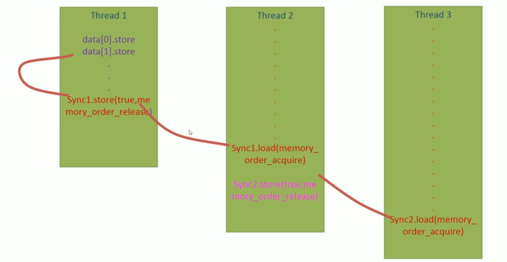

Keep in touch with standard committee members 

* Herb Shudder
* Anthony Williams
* Goran Nikonov
* Scott Mairs
* etc


# 22.Modern C++:Concurrency in Depth

## 22.1 并行计算简介


这是冯诺伊曼架构，现今所有的架构都能删减成这个架构。

- 在计算机中，程序指令存储在持久内存或硬盘上作为可执行文件。
- 当运行程序时，程序的指令被加载到中央处理单元（CPU）。
- 基础数据被加载到随机访问存储器（RAM）中。
- 计算机的处理单元（CPU）开始执行指令，同时根据运行时输入进行处理，并产生相应的输出。
- 尽管基础模型是逐条处理指令，但在现代计算机中，我们可以同时运行多个应用程序，实现多任务处理。


### 22.1.1 多任务的处理方法

#### 22.1.1.1 Process first

实现方法：Process First

- ==Process(进程)==是一个计算机应用程序的实例。

  当我们运行一个应用程序，该应用程序的**指令**会被fetch到处理器。同时，**内存**会在Ram中分配以保存运行时资源

  **这一个正在运行的实例就被称为进程**。

#### 22.1.1.2 Context & Round robin fashion execution

**循环式执行命令(round robin fashion execution of instructions)**


- ==Context(上下文)==指的是有关进程的数据集合(collection of data about process)。

  这些数据允许处理器挂起或保留特定进程，稍后继续执行。

  常见的context包括**内存地址(Memory address)与程序计数器状态(program counter states)**等。

- 如图所示，如果我们只有一个单核处理器，该处理器将执行这些进程指令。具体来说，处理器将基于特定进程的**准备情况**，**内存**以及优先级为每个进程**分配时隙（time slot)**。

  图中展示了一种可能的单核处理调度结果。

- 支持这种时隙分配的基本盘来自于==Context switching==，通过上下文切换，处理器可以**加载某个进程的上下文，并从他停止的状态开始执行它**。


#### 22.1.1.3 Thread

另一个与进程非常相似的重要概念是**线程**。

线程(thread)/一个线程的执行(thread of execution) 是一个可以独立管理的**小指令序列**。

Thread是进程的一个组件，每个进程至少有一个称为**主线程(main thread)**的线程，它是该程序的入口点。


举一个例子，在一个船上，船长相当于main thread，其他水手，厨师等类似其他thread

* main thread分配其他thread的任务，并接收反馈
* 其他thread有自己的独有任务，这些任务组成了这个process


#### 22.1.1.4 线程与进程的区别

* 线程在shared memory中运行，进程在separate memory中运行

  * **进程（Process）**：

    - 每个进程拥有自己的独立内存空间，这就是所谓的"separate memory"。
    - 这个内存空间包括代码、数据段以及其他的进程相关信息。
    - **进程间的内存是隔离的**，一个进程无法直接访问另一个进程的内存。
    - 操作系统通过内存管理单元（MMU）来保护每个进程的内存空间，确保进程间的隔离。

  * **线程（Thread）**：

    - 线程是进程内的一个执行单元，一个进程可以拥有一个或多个线程。
    - 线程在所属的进程的内存空间内运行，它们共享这一进程的内存，这就是所说的"shared memory"。
    - **线程之间可以直接访问同一进程的内存空间**，例如全局变量或堆内存。
    - 由于线程共享内存，它们之间的通信和数据交换比进程间更为高效，但也需要适当的同步机制来避免竞态条件和数据不一致。

    例如，如图

    P1和P2是两个Process，他们的内存是隔离的。在P1中，有两个thread共享一个shared memory `m`。


#### 22.1.1.5 线程，进程与核心

==核心代表计算资源，线程进程代表内存资源。多个核心可以访问同一个进程。==

1. **核心（Core）代表计算资源**：每个核心都是处理器的一个独立计算单元，能够独立执行指令和处理数据。多核处理器意味着有多个这样的计算单元。
2. **线程和进程代表内存资源的组织**：
   - **进程**是操作系统分配资源的基本单位，它拥有独立的内存空间（进程间内存是隔离的）。一个进程中可以包含多个线程。
   - **线程**是操作系统调度执行的基本单位。一个线程在某一时刻运行在一个核心上。它们共享所属进程的内存和资源。
3. **多核处理器和上下文切换**：
   - 在单核处理器中，如果有多个线程或进程需要执行，操作系统需要频繁进行上下文切换，以便让每个线程或进程在单个核心上轮流执行。
   - 在多核处理器中，多个线程可以同时在不同的核心上运行，减少了需要进行上下文切换的情况。当然，如果线程数量超过核心数量，仍然会发生上下文切换。
4. **上下文切换的原因**：
   - 上下文切换通常发生在==单个核心需要在多个任务（线程或进程）间切换时==。
   - 在多核处理器中，如果每个核心都有足够的任务来执行，就可以减少单个核心上的上下文切换。但整体上看，仍然可能会有上下文切换，尤其是在多线程的程序中。


#### 22.1.1.6 并行计算

现代CPU有多个内核可用，这意味着可以执行**多个线程或多个进程**，**同时上下文切换的需求会大大减少。**

> 1. **多核并行处理能力**：
>    * 在单核处理器中，CPU必须在不同的线程或进程间进行切换，以便它们都能获得处理时间。这种切换就是上下文切换。
>    * 但在多核处理器中，由于有多个核心，每个核心可以同时运行不同的线程或进程。因此，如果有足够的核心可用，一些线程或进程可以持续运行而无需切换到其他线程或进程。
> 2. **减少上下文切换次数**：由于能够同时处理更多的任务，多核处理器在处理多任务环境时可以减少上下文切换的次数。在单核处理器中，频繁的上下文切换可能导致较高的系统开销，而多核处理器可以更高效地分配任务。
> 3. **改善性能**：多核处理器可以更有效地利用资源来执行多个任务，从而提高了整体系统性能。这意味着相对于单核处理器，多核处理器可以在给定的时间内完成更多的工作，减少了因等待CPU资源而发生的上下文切换。
>
> 然而，需要注意的是，**即使在多核处理器系统中，如果运行的线程或进程数量超过核心数量，或者由于资源竞争（例如对于内存或I/O的竞争），系统仍然可能需要进行上下文切换。**此外，操作系统的任务调度策略也会影响上下文切换的频率和必要性。


这种类型的多线程同时处理就称为==并行处理==。


#### 22.1.1.7 并行的类型

**Task Level parallelism**(任务级并行) & **Data level parallelism**(数据级并行)

**任务级并行（Task Level Parallelism）**

任务级并行是指在并行环境中同时执行多个相互独立的任务。这种并行通常用于分布式系统或多处理器环境。

**数据级并行（Data Level Parallelism）**

数据级并行涉及将数据分成块，并在多个处理单元上并行处理这些数据块。这通常用于需要大量数据处理的任务，如数值计算和图像处理。


#### 22.1.1.8 Parallelism vs Concurrency:并行与并发

并行更关注如何通过同时执行来提高效率，而并发则关注如何有效管理多个同时存在的任务。

对于单核，多个任务处理就是并发，单核永远不能并行。

对于多核，同样多个任务处理就是并发，但是多核处理同一个任务就被看做并行。


在现实中，纯粹的并行是很难见到的

* 任务（线程）的数量会超过处理器核心的数量。在这种情况下，操作系统必须在核心间进行任务调度，这样就成了并发执行，此时许多任务在等待空闲的核心。
* 在特定场景中，任务的数量可能会少于处理器核心数量，在这种情况下可以实现真正的并行性，因为每个核心可以独立且同时处理一个单独的任务，没有任务之间的切换。


## 22.2 几个问题

1. **为什么学习并发编程或并行编程很重要？**
   - 随着计算需求的增长，现代计算机系统的架构越来越依赖多核和多处理器技术。并发和并行编程允许我们充分利用这些多核系统的性能，通过同时执行多个任务或操作来提高效率和处理速度。特别是在数据密集型和计算密集型应用中，如大数据分析、机器学习、科学计算和实时处理，这些技能是至关重要的。
2. **哪些范式广泛使用并行处理？**
   - **大数据处理**：需要并行处理海量数据。
   - **机器学习和人工智能**：并行算法可以加速训练和推理过程。
   - **科学计算和模拟**：并行处理可用于复杂的物理模拟和数值分析。
   - **实时系统**：比如游戏和交互式应用，需要快速响应用户输入。
3. **为什么这些领域需要并行处理的方法？**
   - 这些领域通常涉及处理大量数据或执行复杂的计算任务。并行处理使得这些任务可以在更短的时间内完成，因为它们可以被分割成多个部分，同时在多个处理器或核心上执行。这不仅提高了效率和性能，还可以解决单线程处理无法在合理时间内解决的问题。
4. **什么是异构计算？你能举出一些这样的系统的例子吗？**
   - 异构计算是指使用不同类型的处理器或计算资源共同工作以提高计算效率的方法。这些不同类型的处理器可能包括传统的CPU、图形处理器（GPU）、数字信号处理器（DSP）和专用集成电路（ASIC）。
   - 例子包括：
     - 使用CPU和GPU的个人电脑或游戏机。
     - 集成CPU和FPGA（现场可编程门阵列）的嵌入式系统。
     - 数据中心使用CPU、GPU和TPU（张量处理单元）进行高效的机器学习计算。
5. **GPU代表什么？它与传统并行编程有何不同？**
   - GPU代表图形处理单元，它是一种专为快速图像处理和计算密集型任务而设计的处理器。与传统CPU相比，GPU具有更多的核心，但每个核心的时钟速度较慢，适合执行大量的并行操作。
   - 与传统并行编程（通常指在多核CPU上执行的并行处理）相比，GPU编程更加专注于数据并行性和吞吐量。GPU非常适合执行可以分解为许多小而类似的操作的任务，例如图像和视频处理、机器学习中的大规模矩阵运算等。


## 22.3 Thread

### 22.3.0 一个thread的消耗

即使线程被分配了一个简单的任务（比如打印一条消息），线程的完成时间也不一定能预测。这是因为线程的执行受到多种因素的影响，包括：

1. **调度和处理器时间分配：** 操作系统根据可用的处理器资源和其他正在运行的线程或进程来调度线程。如果系统忙于处理其他任务，即使是简单的线程也可能需要等待一段时间才能得到执行。
2. **上下文切换：** 如果系统中有许多并发运行的线程或进程，操作系统需要在它们之间进行上下文切换，这可能导致每个线程实际运行时间的延迟。
3. **线程启动时间：** 创建线程和启动它的执行可能需要一些时间，特别是在资源受限的系统中。
4. **I/O 延迟：** 如果线程涉及到输入/输出操作（比如打印到控制台），这些操作可能不是立即完成的，因为它们可能依赖于系统资源和其他外部因素。

由于这些原因，在主线程中调用 `join()` 时，即使是简单的线程也可能尚未完成其执行。这就是为什么在实际应用程序中，通常要小心处理线程同步和协调问题。


### 22.3.1 启动一个Thread

```c++
//launch_a_thread.h

#include<iostream>
#include<thread> // basic header file
void func1(){
    std::cout << "Hello fron function1 - thread" << std::this_thread::get_id() << endl;
}

class my_class{
public:
    void operator()(){
        std::cout << "Hello from the class with overload call operator in thread " << std::this_thread::get_id() << endl;
    }
};


void run(){
    std::thread thread1(func1);
	my_class mc;
    std::thread thread2(mc);
    std::thread thread3([]{
        std::cout << "Hello from the lambda" << endl;
    });
    
    thread1.join();
    thread2.join();
    thread3.join();
}
```

* 在这个例子里，run函数作为main thread，而func1，my_class, lambda是作为其他thread
* 我们通过`std::thread`类创建了三个thread实例，**创建即开始执行**（an active thread of execution)，并使用join阻塞程序，**如果对应的thread没有完成，那么在run中，就不会执行其对应join之后的代码。**

我们上面的代码会出现如下输出

```bash
Hello from the lambda, in thread  Hello fron function1 - thread  Hello from the class with overload call operator in thread 752
20468
27912
```

当然，每次输出的可能不一样，但是一样的是他们都是混乱的。


这三个线程几乎同时启动，并行运行。因此，它们的输出顺序是不确定的，完全取决于操作系统调度线程的方式。在多线程环境中，没有哪个线程会保证首先完成或按特定顺序执行。**这种输出结果反映了多线程编程的本质特点：并发性和不可预测性。**

这里的输出混乱问题通常是由于多个线程同时尝试写入共享资源（在这种情况下是标准输出 `std::cout`）而导致的。**这是因为 `std::cout` 并不是线程安全的**，当多个线程同时尝试向其写入数据时，输出可能会交错或重叠。

换句话说，我们可以使用如下代码来保证线程安全，当然代价是完全牺牲并行性。

```c++
void run(){
    std::thread thread1(func1);
    thread1.join();
    
    
	my_class mc;
    std::thread thread2(mc);
    thread2.join();
    
    
    std::thread thread3([]{
        std::cout << "Hello from the lambda" << endl;
    });
    thread3.join();
}
```


### 22.3.2 线程的可连接性(Joinability of thread)

==线程启动后没有join会使得程序不安全，因此throw an exception==

`join()` 函数和 `joinable()` 函数在多线程编程中扮演了关键角色，它们的名称与它们的功能密切相关：

1. **为什么叫 `join()`：** 在多线程编程中，`join()` 函数的主要作用是“加入”或者说“等待”。当你创建一个新的线程时，它会与创建它的线程（通常是主线程）分离开来并独立执行。当调用 `join()` 时，你实际上是在告诉创建线程（如主线程）暂停执行，直到被 `join()` 的线程完成其任务。**一旦那个线程完成了，它就会“加入”回创建它的线程**，这时两个线程会同步。因此，“join”这个词很形象地描述了这一过程。
2. **`joinable()` 函数的目的：** `joinable()` 函数用于检查一个线程是否处于可加入（joinable）状态。一个线程是可加入的，意味着它已经被启动并且尚未加入（join）。**一旦线程已经加入或者从未被启动，它就不再是可加入的。**这个函数主要用于在调用 `join()` 之前检查线程的状态，以确保程序不会试图加入一个不可加入的线程，这可能会导致运行时错误。

```c++
#pragma once
#include<iostream>
#include<thread>
namespace join_joinable_detach {
	void test() {
		std::cout << "Call from test, thread ID " << std::this_thread::get_id() << std::endl;
	}

	void run()
	{
		std::thread thread1(test);

		if (thread1.joinable()) {
			std::cout << "Thread 1 is joinable before join \n";
		}
		else {
			printf("Thread 1 is not joinable before join \n");
		}
		thread1.join();

		if (thread1.joinable()) {
			std::cout << "Thread 1 is joinable after join \n";
		}
		else {
			printf("Thread 1 is not joinable after join \n");
		}

	}
}
```

```bash
Thread 1 is joinable before join
Call from test, thread ID 27892
Thread 1 is not joinable after join
```

注意，==正确的构造线程是可连接的(properly consrtucted thread is joinable)==，为了正确构造线程，我们必须将**可调用的对象(callable ojbect)**作为参数传给线程类构造函数。如果该callable object需要传参，还要保证传参正确。

不正确的构造意味着线程启动失败，因此它本身就是unjoinable的。


关于线程是否完成后还是 `joinable` 的问题，答案是不是。一旦线程完成执行，它就不再是 `joinable` 的了。在C++中，`std::thread` 对象有一个 `joinable()` 成员函数，用于检查线程对象是否代表一个活跃的执行线程。**如果线程已经完成执行或者从未开始执行（例如，是一个默认构造的 `std::thread` 对象），`joinable()` 将返回 `false`。**

这就是为什么在调用 `join()` 或 `detach()` 之前检查 `joinable()` 是一个好习惯，特别是在处理可能已经完成或在其他地方已经被操作过的线程时。例如：

```c++
if (myThread.joinable()) {
    myThread.join();  // 或 myThread.detach();
}
```

这样做可以确保您不会试图加入或分离一个已经不是 `joinable` 的线程，这在C++中会导致运行时错误。


### 22.3.3 加入与分离函数(Join and Detach functions)

* `Join` introduce a **synchronize point** between launched thread and thread that it launched from, It **blocks the execution of the thread that calls join function**, until the launched thread's execution finished.

  

* `Detach`函数调用会将启动的线程与调用线程(calling thread)分开，允许调用线程独立继续执行。一旦线程完成执行，分离线程内的任何已分配资源都将会被释放。

  


```c++
	void foo() {
		std::this_thread::sleep_for(std::chrono::milliseconds(5000));
		std::cout << "Hello from foo\n";
	}

	void bar() {
		std::this_thread::sleep_for(std::chrono::milliseconds(5000));
		std::cout << "Hello from bar\n";
	}
	void run_join_detach() {
		std::thread foo_thread(foo);
		std::thread bar_thread(bar);

		bar_thread.detach();
		std::cout << "this is after bar thread detach\n";

		foo_thread.join();
		std::cout << " This is after foo thread join\n";
	}
```

```bash
this is after bar thread detach
//注释：中间停了很久
Hello from bar
Hello from foo
 This is after foo thread join
```

* **线程 `bar_thread` 被分离（detach）：** 使用 `detach()` 方法将 `bar_thread` 从主线程分离。这意味着 `bar_thread` 将独立于主线程运行，并且在 `bar_thread` 完成执行后会自动清理资源。分离线程后，主线程不会等待它完成，而是继续执行下面的代码。
* **线程 `foo_thread` 被加入（join）：** 使用 `join()` 方法将 `foo_thread` 加入回主线程。这意味着主线程会在这一点停止执行，直到 `foo_thread` 完成其执行。`foo()` 函数中的 `sleep_for()` 使 `foo_thread` 暂停5秒，因此主线程也会因调用 `join()` 而暂停同样的时间。
* 我们可以发现，bar的"this is after bar thread detach"是在"Hello from bar"之前，说明detach实际上不会阻塞main thread。


### 22.3.4 How to handle join in exception scenario

#### 22.3.4.1 异常抛出的情景

```c++
void foo(){
    std::cout << "This is from foo\n";
}

void other_operations(){
    std::cout << "this is other operation\n";
    throw std::runtime_error("This is a runtime error");
}

void run(){
    std::thread foo_thread(foo);
    other_operations();
    foo_thread.join();
}
```

* 通常来说，join发生在我们需要用到所处理的数据之前，而不会立刻在声明了实例之后join。
* 此时，若是中间发生了如例子中一样的异常抛出，程序会直接终止，**此时这个独立的thread并没有join**，会导致不安全的程序。

==解决方法1==

```c++
void run(){
    std::thread foo_thread(foo);
    try{
        other_operations();
        foo_thread.join();
    }
    //如果抛出错误，try block仍然不会继续执行join，因此在try block和catch block都需要join
    catch(...){
        foo_thread.join();
    }
}
```

但是如果代码包含数千行时，使用try-catch block来保证join会导致繁琐和低效的程序。


==A better way of having guaranteed join function calls even in an exception scenario==

使用**RAII(Resource acquisition is initialization)**

与构造函数析构函数类似，

* 当一个对象被创建或它的构造函数调用时，所有资源都将为该对象分配。
* 当它被破坏或该对象的析构函数被调用时，则相关资源会被释放

使用**Class call thread guard**:这个类将在以后常常用到，因此推荐封装到一个单独的头文件中


```c++
//call_thread_guard
#pragma once

#include<vector>
#include<thread>

class thread_guard{
    std::thread &t;
public:
    explicit thread_guard(std::thread & _t):t(_t){
        
    }
    
    ~thread_guard(){
        if(t.joinable()){
            t.join();
        }
    }
    
    thread_guard(thread_guard & const) = delete;
    thread_guard &operator= (thread_guard &const) = delete;
}

```

* `explicit thread_guard(std::thread & _t):t(_t)`:
  * `explicit` 关键字在防止隐式类型转换时非常有用，这在设计API和类时可以避免一些意外和潜在的错误。
    * 例如，若存在`void NewFunction(thread_guard &input)`，
      * 那么在没有使用explicit关键字之前，`NewFunction(thread1)`是可接受的，这个thread实例会被隐式转换为`NewFuncton(thread_guard(thread1)`。其中有`std::thread thread1(A)`;==注意，这里的构造函数是引用传递，因此类似`thread_guard(std::thread(A))`是无效的。引用传递保证了thread_guard接收到一个有效的，持久的std::thread对象引用，它可以在thread_guard的生命周期内安全的管理==
      * 在使用了explicit关键字之后，只能传入`NewFuncton(thread_guard(thread1)`
      * 通过将构造函数标记为 `explicit`，你强制编程者在使用 `thread_guard` 类时必须明确其意图，从而减少错误和混淆。
* `thread_guard(thread_guard & const) = delete;`&`thread_guard &operator= (thread_guard &const) = delete;`
  * 这两个函数被删除（用 `= delete` 表示），这意味着 `thread_guard` 对象不能被拷贝或赋值。这是必要的，**因为拷贝或赋值线程管理器可能导致多次尝试加入同一个线程**，这是不安全的。

```c++
#pragma once

# include<iostream>
# include<vector>
# include<thread>
# include "call_thread_guard.h"

namespace exception_scenario {
	void foo(){
		std::cout << "This is from foo" << std::endl;
	}

	void other_operations() {
		std::cout << "An error will be thrown\n";
		throw std::runtime_error("This is a runtime error");
	}

	void run() {
		std::thread foo_thread(foo);
		thread_guard tg(foo_thread);
		try {
			other_operations();
		}
		catch (...) {

		}
	}

}
```


### 22.3.5 小测

```c++
#pragma once
# include<iostream>
# include<thread>
# include<vector>
# include<chrono>
# include "call_thread_guard.h"


namespace ship_example {
	/*
	考虑三个参与者，Captain船长，EngineCrew机组以及Cleaners清洁工
	
	船长由主线程表示

	船长可以发出三个命令：
	命令清洁人员清洁，但是船长不必等这个命令完成
	接下来的两个命令是全速前进和停止发动机命令，船长必须等到机组完成这些命令才能继续执行下一个命令

	Input是一个整数代表上述命令：
	1代表cleanning
	2代表全速前进
	3代表停止发动机
	100是退出程序
	其他编号是无效订单，需要在控制台打印

	使用sleep和cout来模拟这个过程
	*/
	auto program_start = std::chrono::high_resolution_clock::now();
	void show_time() {
		auto now = std::chrono::high_resolution_clock::now();
		std::chrono::duration<double> elapsed = now - program_start;
		std::cout << "Current timestamp: " << elapsed.count() << " seconds since program start." << std::endl;
	}

	void cleaner() {
		std::cout << "Cleaning the board\n";
		std::this_thread::sleep_for(std::chrono::milliseconds(5000));
		std::cout << "Cleaning complete\n";

	}

	void EngineCrew_fullspeedahead() {
		std::cout << "Full speed ahead\n";
		std::this_thread::sleep_for(std::chrono::milliseconds(5000));
		std::cout << "Slow down\n";

	}

	void EngineCrew_StopEngine() {
		std::cout << "StopEngine\n";

	}

	void captain(std::vector<int> Execution_code_list) {
		std::vector<std::thread> join_list;
		std::vector<std::thread> detach_list;
		for (auto code : Execution_code_list) {
			if (code == 100) break;

			switch (code) {
			case 1:
				detach_list.push_back(std::thread(cleaner));
				break;
			case 2:
				join_list.push_back(std::thread(EngineCrew_fullspeedahead));
				break;
			case 3:
				join_list.push_back(std::thread(EngineCrew_fullspeedahead));
				break;
			default:
				std::cout << "Invalid command.\n";
			}
		}
		for (auto &threadd : detach_list) {
			threadd.detach();
		}
		for (auto& threadadd : join_list) {
			threadadd.join();
			//show_time();
		}
	}
}

```

```bash
Invalid command.
Full speed ahead
Cleaning the board
Full speed ahead
Cleaning the board
Cleaning the board
Full speed ahead
Full speed ahead
//中间很长一段等待
Slow down
Cleaning complete
Slow down
Cleaning complete
Slow down
Cleaning complete
Slow down
```

这段代码有几个点：

* show time表现不佳，因为不是线程安全
* 在遍历vector时需要引用，**因为thread实例不能复制**
* push_back一个右值或者emplace_back参数（例如`join_list.emplace_back(EngineCrew_fullspeedahead)`)效果差不多，因为vector会自动对push_back调用move，因此性能也差不多
* Invalid command会第一个输出，因为其他线程都没有运行完


### 22.3.6 向thread传参(Pass parameters to a thread)

针对的情况是：我们需要在单独的线程中运行的函数具有参数列表

在这种情况下，我们可以在启动线程时传递参数。


#### 22.3.6.1 了解thread class constructors

首先，我们来了解以下thread类的构造函数


* 当我们使用默认构造函数构造线程时，它不表示任何active thread of execution
* 线程类的**copy constructor**被删除，但是有**move constructor**与**initialization constructor**
* 我们可以将函数名称后面的参数传递给这个**Initialization constructor**

```c++
#pragma once
/*这一个部分主要展示线程参数传递*/
#include<iostream>
#include<thread>

namespace pass_parameters {
    void func1(int p, int q) {
        printf("X + Y = %d\n", p + q);
    }

    void func_2(int& x) {
        while (true) {
            printf("THread1 value of X -%d \n", x);
            std::this_thread::sleep_for(std::chrono::milliseconds(1000));
        }
    }
    void run_1() {
        int p = 9;
        int q = 9;
        std::thread thread_1(func1, p, q);

        thread_1.join();
    }

    void run_2() {
        int x = 9;
        printf("Main thread value of X - %d\n", x);
        std::thread thread_2(func_2, std::ref(x));
        std::this_thread::sleep_for(std::chrono::milliseconds(5000));
        x = 15;
        printf("Main thread value of X has been change to - %d \n", x);
        thread_2.join();
    }
}
```


结果如上，这是一个很有意思的，不用thread不会出现的情况。这能明显看出有两个线程在工作。

##### Pass by reference

在 C++ 标准库中，当创建一个新线程并传递参数给它时，==**默认情况下，这些参数是通过值传递的。**==这意味着无论原始参数的类型如何，都会创建参数的副本，并将副本传递给线程函数。因此，**即使 `func_2` 的参数是一个引用类型（例如 `int&`），在创建线程时传递的参数仍然会被复制。**

==为了确保原始变量（而不是其副本）被传递给线程函数，您需要使用 `std::ref`。`std::ref` 生成一个对原始变量的引用的封装器，从而使得线程能够接收一个引用而不是副本。==

简单传入 `x` 不会达到预期的效果，因为即使 `func_2` 接收一个引用（`int &x`），创建线程时传递的 `x` 仍会被复制。这个复制的值将被包装成一个临时对象，并作为引用传递给 `func_2`。这可能导致 `func_2` 操作的不是您期望的原始 `x` 变量。

使用 `std::ref(x)`，您确保 `x` 的原始实例（而非其副本）被传递给线程函数，允许线程直接修改 `x`。


#### 22.3.6.2 Detach在嵌套时的一个问题

```c++
void func_2(int &x){
    while(true){
        try{
            std::cout << x << sstd::endl;
            std::this_thread::sleep_for(std::chrono::milliseconds(1000));
        }
        catch(...){
            throw std::runtime_error("this is a runtime error");
        }
    }
}

void func_1(){
    int x=5;
    std::thread thread_2(func_2, std::ref(x));
    thread_2.detach();
    std::this_thread::sleep_for(std::chrono::milliseconds(5000));
    std::cout << "thread_1 finished execution \n";
}

void run(){
    std::thread thread_1(func_1);
    thread_1.join();
}
```

具体会发生什么？

* 在前5秒，正常输出5，5，5，5，5
* 然后出现`thread_1 finished execution `
* 此时就会出现错误，当然在代码中进入了catch，throw了一个exception
* 这是因为==**在线程1完成执行后，它将逆序破坏函数1中的对象**==，考虑到这个代码中我们已经将thread2 detach了，也就是与thread1无关了，因此当thread1结束时，thread_2并不会被破坏或是join。
* 因此，==**即使thread1回收了变量x在线程中的内存之后，thread2仍然会尝试通过引用访问内存位置。**==，此时一个Access Violation exception就被thrown了。
* 这是独属于detach的问题，因为join会阻塞线程。当然，如果是值传递，也不会有任何问题。
* Be careful when you are detaching threads after you pass reference to a variable to that thread as **detached thread can outlive the lifetime** of the objects in the thread that it detached from.


### 22.3.7 转移thread的所有权(Transferring ownership of a thread)

简单来说就是使用thread类的Move constructor转移所有权


```c++
#pragma once
#include <chrono>
#include <iostream>
#include <thread>

namespace transfer_ownership {
	void foo() {
		//std::cout << "Thread ID " << std::this_thread::get_id() << " from foo\n";
		printf("Thread ID %d from foo\n", std::this_thread::get_id());
	}

	void bar() {
		//std::cout << "Thread ID " << std::this_thread::get_id() << " from bar\n";
		printf("Thread ID %d from bar\n", std::this_thread::get_id());
	}

	void run() {
		std::thread thread_1(foo);

		std::thread thread_2 = std::move(thread_1);

		thread_1 = std::thread(bar);
		//在这里，发生了隐式的移动调用（因为右边是右值）而非赋值，所以没问题

		/*
		std::thread_3(foo);
		thread_1 = std::move(thread_3);//这一个操作会throw 一个exception，因为thread1有管理的线程，这里的操作实际上是在覆盖所有权而非转移
		*/
		thread_1.join();
		thread_2.join();
	}
}
```

* 线程对象的变量所有者负责管理线程对象的生命周期(Owner of the thread object is responsible for managing the thread object's lifecycle)
* 在例子中，转移了所有权之后，thread_1不再拥有任何线程对象
* 在转移线程所有权时，**有可能在转移之前，线程已经完成了它的任务**。这种情况下，==转移的线程对象将会处于一个有效但没有关联执行线程的状态。这意味着该线程对象仍然可以进行操作（例如被分配一个新的线程），**但它不再代表任何正在运行的线程**。==


### 22.3.8 thread中有用的函数

#### 1. get_id()

在thread中

```c++
std::this_thread::get_id();
```

在thread外

```c++
std::thread thread_1(foo);

cout << thread_1.get_id();
```

**注意，对不合法的实例以及非活动的线程执行，将获得0.**

```c++
//默认构造
std::thread thread_2;

cout << thread_2.get_id();// 0

//非活动线程
std::thread thread_3(foo);
cout << thread_3.get_id();//normal
thread_3.join();
cout << thread_3.get_id();//0
```


#### 2.sleep_for

`std::this_thread::sleep_for` 是 C++ 标准库中的一个函数，用于使当前线程暂停执行一段指定的时间。这个函数是 C++11 引入的，属于 `<thread>` 头文件中的一部分。它通常用于模拟延时、控制执行速率或在等待资源时避免密集轮询。

##### 基本使用

`std::this_thread::sleep_for` 接受一个时间段（duration）作为参数，并阻塞调用线程直到该时间段过去。时间段通常通过 C++ 标准库中的持续时间（duration）表示，如 `std::chrono::seconds`、`std::chrono::milliseconds` 等。

- **阻塞当前线程：** `sleep_for` 会阻塞调用它的线程，该线程在指定的时间内不会执行任何操作。
- ==**不保证精确的唤醒时间：**== 当 `sleep_for` 返回时，可以保证至少指定的时间已经过去，但由于操作系统的调度策略和其他因素，实际唤醒时间可能稍后于预定时间。
- **不应用于精确计时：** 因为不能保证精确的睡眠时间，所以不应该使用 `sleep_for` 进行精确的时间控制。
- **线程安全性：** `std::this_thread::sleep_for` 是线程安全的，可以在多线程环境中安全使用。

##### 例子

```c++
#include <iostream>
#include <thread>
#include <chrono>

int main() {
    std::cout << "Sleep for 2 seconds..." << std::endl;

    // 暂停线程执行2秒
    std::this_thread::sleep_for(std::chrono::seconds(2));

    std::cout << "Woke up!" << std::endl;

    return 0;
}
```


#### 3. yield()

`std::this_thread::yield()` 是 C++ 标准库中的一个函数，用于指示当前执行的线程主动放弃其当前的时间片，并给予其他线程执行的机会。这个函数同样位于 `<thread>` 头文件中，是 C++11 标准的一部分。

##### 基本概念

在多线程编程中，操作系统的调度器负责决定哪个线程在何时执行。通常，每个线程被分配一定的“时间片”来执行其任务。当线程的时间片用尽时，**调度器会挂起该线程，将这个线程重新放入调度序列**，并将CPU的控制权交给另一个线程。

`std::this_thread::yield()` **函数允许一个线程告诉调度器：“我现在没有紧急的任务要执行，你可以把我的剩余时间片分配给其他线程”。**这样，其他线程（尤其是那些处于就绪状态的线程）可能会获得执行的机会。

##### 使用场景

1. **提高程序的响应性：** 当你知道当前线程无需紧急完成任务时，可以使用 `yield` 来允许其他线程执行，这可以使得整个程序或系统的响应性提高。
2. **公平的资源共享：** 在某些情况下，可能想要确保所有线程都有公平的执行机会，特别是在密集计算的场景下。
3. **避免忙等待：** 在轮询某个条件时，使用 `yield` 可以避免一个线程持续占用 CPU 资源，而允许其他线程有机会改变该条件。

##### 注意事项

- **无保证的调度行为：** **调用 `yield` 并不保证其他线程一定会立即获得执行。**调度行为依赖于操作系统和当前的线程状态。
- **可能的性能影响：** 频繁地调用 `yield` 可能会导致性能下降，因为它会引起上下文切换，而上下文切换是有成本的。
- **不是同步机制：** `yield` 不应被用作线程间的同步机制。它不保证任何关于哪个线程会接下来运行的具体行为。

##### 示例代码

```c++
#include <iostream>
#include <thread>

void threadFunction() {
    for (int i = 0; i < 10; ++i) {
        std::cout << "Thread " << std::this_thread::get_id() << " is yielding...\n";
        std::this_thread::yield(); // 提示调度器当前线程可以让出CPU
    }
}

int main() {
    std::thread t1(threadFunction);
    std::thread t2(threadFunction);

    t1.join();
    t2.join();

    return 0;
}
```

在这个示例中，两个线程会通过调用 `yield` 来提示操作系统它们可以暂时让出 CPU，使得其他线程（例如，主线程或另一个工作线程）有更多的机会执行。


#### 4. hard_ware_concurrency()

这个函数通常用于使用大量thread的情景，例如thread pool。

在计算机中，可用的内核数量有限，因此，**如果我们使用的线程数多于可用的核心数，内核必须执行任务切换(task switching)或循环式执行命令(round robin fashion execution)，这会占用一些开销。**甚至会在某一个时间点达到，这个开销完全抵销了并行执行节省的时间。==考虑到消费级电脑会有其他程序占用核心，因此我们应该确保thread less than or equal to 核心数==

`std::thread::hardware_concurrency` 是 C++ 标准库中的一个函数，用于查询计算机上可用的并发线程数量。这个函数提供了在特定系统上同时执行线程的理想数量，这通常等同于物理处理器核心的数量，但也可能包括超线程（如果处理器支持）。

##### 基本用法

```c++
#include <thread>
#include <iostream>

int main() {
    unsigned int n = std::thread::hardware_concurrency();
    std::cout << "Number of concurrent threads supported: " << n << std::endl;
    return 0;
}
```

在这个例子中，`hardware_concurrency` 返回了系统能够同时运行的线程数量。这个信息对于决定创建多少个线程以最大化资源利用非常有用，尤其是在进行大量并行计算的情况下。

##### 注意事项

- **非强制性信息：** `hardware_concurrency` 返回的是系统建议的并发线程数，但这并不是强制性的。你可以创建比这个数字更多的线程，但这通常会导致上下文切换增多，可能降低程序效率。
- **可能返回 0：** 在一些情况下，如果函数无法确定硬件并发性，它可能返回 0。因此，在使用该值作为线程数依据时，应该检查是否为 0 并提供一个合理的默认值。
- **物理核心 vs 逻辑核心：** 这个数字可能包含逻辑核心（比如，通过超线程技术实现的核心）。在一些计算密集型任务中，使用物理核心数量可能会更有效。
- **依赖于硬件和操作系统：** 这个函数提供的信息依赖于底层硬件和操作系统的实现。

##### 使用场景

`std::thread::hardware_concurrency` 非常适合用于确定并行算法的理想线程数。例如，在进行数据并行处理时，可以根据此函数返回的线程数来分割数据，以便在多个线程间高效处理。


#### 测试代码

```c++
#pragma once
# include<thread>
# include<iostream>
# include<chrono>
namespace useful_functions {
	void foo() {
		printf("This is thread %d from foo using std function\n",std::this_thread::get_id());
	}

	void get_id_example() {
		// get_id()
		std::cout << "\n\n\nThis is from get_id() function" << std::endl;
		std::thread thread_1(foo);

		printf("This is thread %d outside thread using class function\n", thread_1.get_id());
		if(thread_1.joinable())
			thread_1.join();
		printf("This is unactive thread code outside thread using class function: code %d\n", thread_1.get_id());

		std::thread thread_2;
		printf("This is a thread using default constructor, its code is %d\n\n\n\n", thread_2.get_id());
		printf("--------------------------------------");
	}

	void sleep_for_example() {
		std::cout << "\n\n\nThis is from sleep_for() function" << std::endl;
		std::cout << "Sleep for 2 seconds..." << std::endl;

		// 暂停线程执行2秒
		std::this_thread::sleep_for(std::chrono::seconds(2));

		std::cout << "Woke up!" << std::endl;
		printf("\n\n\n--------------------------------------");
	}
	void threadFunction() {
		for (int i = 0; i < 10; ++i) {
			std::cout << "Thread " << std::this_thread::get_id() << " is yielding...\n";
			std::this_thread::yield(); // 提示调度器当前线程可以让出CPU
		}
	}
	void yeild_example() {
		std::cout << "\n\n\nThis is from yeild function" << std::endl;
		std::thread t1(threadFunction);
		std::thread t2(threadFunction);

		t1.join();
		t2.join();
		printf("\n\n\n--------------------------------------");
	}

	void hardware_concurrency_example() {
		std::cout << "\n\n\nThis is from hardware_concurrency function" << std::endl;
		int allowed_threads = std::thread::hardware_concurrency();
		printf("Allowed thread count in my device : %d\n", allowed_threads);
		printf("\n\n\n--------------------------------------");
	}
	void run() {
		get_id_example();
		sleep_for_example();
		yeild_example();
		hardware_concurrency_example();

	}
}
```


### 22.3.9 小测2-活用reference传递，让线程一直工作

```c++
#pragma once
# include<thread>
# include<chrono>
# include<iostream>
# include<queue>

namespace ship_example_with_queue {
	/*
		任务描述
			命令: 在这个练习中，之前描述的命令仍然适用。
			工作队列: 您需要创建两个std::queue类型的变量，一个是engine_workqueue，另一个是clean_workqueue。
			线程表示: 发动机和清洁工作应该各自由一个线程表示，而不是像之前那样只用一个函数。
			循环执行: 这些线程应该持续运行，同时检查一个名为done_flag的标志。当从控制台接收到用户请求（输入100）时，应该设置这个标志以停止每个迭代。
			队列检查: 每个线程应检查相应的队列以查找工作。主线程可以将命令放入每个相应的队列中。
			命令执行: 如果运行中的线程在相应队列中找到任何命令，它应该执行该命令，并休眠一秒。
			无任务时休眠: 如果没有找到任务，线程应该休眠两秒。
			*/
	void cleaner() {
		std::cout << "-----------------------Cleaning the board\n";
		std::this_thread::sleep_for(std::chrono::milliseconds(1000));

	}

	void EngineCrew_fullspeedahead() {
		std::cout << "+++++++++++++++++++++++Full speed ahead\n";
		std::this_thread::sleep_for(std::chrono::milliseconds(1000));

	}

	void EngineCrew_StopEngine() {
		std::cout << "=============================StopEngine\n";

	}
	void engine_worker(std::queue<int> &engine_work) {
		while (true) {
			if (engine_work.empty()) {
				printf("Engine work list is empty\n");
				std::this_thread::sleep_for(std::chrono::seconds(2));
			}
			else {
				int temp = engine_work.front();
				engine_work.pop();
				if (temp == 2)
					EngineCrew_fullspeedahead();
				else if (temp == 3)
					EngineCrew_StopEngine();
				else
				{
					printf("Engine worker find stop code\n");
					break;
				}
			}
		}
	}

	void clean_worker(std::queue<int>& clean_work) {
		while (true) {
			if (clean_work.empty()) {
				printf("Clean work is not exist\n");
				std::this_thread::sleep_for(std::chrono::seconds(2));
			}
			else {
				int temp = clean_work.front();
				clean_work.pop();
				if (temp == 100) {
					printf("Clean work find stop code\n");
					break;
				}
				else {
					cleaner();

				}
			}
		}
	}

	void captain() {
		bool done_flag = true;
		std::queue<int> engine_work, clean_work;
		std::thread thread_engine(engine_worker, std::ref(engine_work));
		std::thread thread_clean(clean_worker, std::ref(clean_work));
		thread_clean.detach();

		while (done_flag) {
			int command;
			std::cout << "输入你的指令" << std::endl;
			std::cin >> command;
			if (command == 100) {
				done_flag = false;
				engine_work.push(command);
				clean_work.push(command);
			}
			else if(command == 3 || command == 2) {
				engine_work.push(command);
			}
			else if (command == 1) {
				clean_work.push(command);
			}
			
		}
		thread_engine.join();


	}
}
```


#### 22.3.10 并行加法(Parallel accumulation)

#### 22.3.10.1 std::accumulate如何工作

##### 简单版本

```c++
T accumulate(InputIt first, InputIt last, T init);
//or
T accumulate(InputIt first, InputIt last, T init, BinaryOperation op);
```

例子：

```c++
#pragma once
# include<iostream>
# include<vector>
# include<numeric>
# include<string>
namespace parallel_accumulation {
	void sequntial_accumulation_test() {
		//展示了使用std::accumulation算法与Iterator完成线性累加
		std::vector<int> v{1, 2, 3, 4, 5, 6, 7, 8, 9, 10};
		int sum = std::accumulate(v.begin(), v.end(), 0);

		std::cout << "Using default std::accumulate+ sum=" << sum << std::endl;

		int product = std::accumulate(v.begin(), v.end(), 1, std::multiplies<int>());

		std::cout << "Using self_define Binary operation* sum=" << product << std::endl;

		auto dash_fold = [](std::string a, int b) {
			return std::move(a) + "-" + std::to_string(b);
		};
		std::string s = std::accumulate(std::next(v.begin()), v.end(), std::to_string(v[0]), dash_fold);
		std::cout << "Using lambda_expression Binary operation to add - between number: " << s << std::endl;

	}
	void run() {
		sequntial_accumulation_test();
	}
}
```


##### 详细解释

`std::accumulate` 是 C++ 标准库中的一个函数，用于计算给定范围内元素的累加和，或者执行累加和类似的操作。除了简单的累加之外，`std::accumulate` 还可以接受一个二元操作（binary operation）作为参数，这使得它更加灵活。这个二元操作定义了如何结合两个元素。

默认情况下，`std::accumulate` 使用 `operator+` 来合并元素，但是你可以提供任何类型的函数、函数对象或 lambda 表达式，只要它接受两个参数并返回一个结果。下面是一些使用 `std::accumulate` 的例子，展示了不同的二元操作：

###### 1. 累加（默认行为）

```c++
#include <numeric>
#include <vector>

int main() {
    std::vector<int> numbers = {1, 2, 3, 4, 5};
    int sum = std::accumulate(numbers.begin(), numbers.end(), 0);
    // sum = 15
}
```

##### 2. 字符串连接

```c++
#include <numeric>
#include <string>
#include <vector>

int main() {
    std::vector<std::string> words = {"hello", " ", "world", "!"};
    std::string sentence = std::accumulate(words.begin(), words.end(), std::string(""));
    // sentence = "hello world!"
}
```

##### 3. 使用自定义函数

```c++
#include <numeric>
#include <vector>

int main() {
    std::vector<int> numbers = {1, 2, 3, 4, 5};
    int product = std::accumulate(numbers.begin(), numbers.end(), 1, [](int a, int b) { return a * b; });
    // product = 120 (因为 1*2*3*4*5 = 120)
}
```

##### 4. 最大值

```c++
#include <numeric>
#include <vector>
#include <algorithm> // for std::max

int main() {
    std::vector<int> numbers = {1, 2, 3, 4, 5};
    int max_value = std::accumulate(numbers.begin(), numbers.end(), numbers[0], [](int a, int b) { return std::max(a, b); });
    // max_value = 5
}
```

##### 5. 结构体累加

```c++
#include <numeric>
#include <vector>

struct Point {
    double x, y;
};

Point addPoints(Point a, Point b) {
    return {a.x + b.x, a.y + b.y};
}

int main() {
    std::vector<Point> points = {{1, 2}, {3, 4}, {5, 6}};
    Point total = std::accumulate(points.begin(), points.end(), Point{0, 0}, addPoints);
    // total = {9, 12}
}
```

在这些例子中，`std::accumulate` 不仅仅用于数值计算，还可以用于结构体操作、字符串处理等。通过传递自定义的二元操作，你可以将 `std::accumulate` 用于更加复杂和特定的场景。

##### 6. 标准库函数对象

1. **`std::plus<T>`** - 执行加法。

   ```c++
   std::accumulate(vec.begin(), vec.end(), 0, std::plus<int>());
   ```

2. **`std::minus<T>`** - 执行减法。

   ```c++
   std::accumulate(vec.begin(), vec.end(), 0, std::minus<int>());
   ```

3. **`std::multiplies<T>`** - 执行乘法。

   ```c++
   std::accumulate(vec.begin(), vec.end(), 1, std::multiplies<int>());
   ```

4. **`std::divides<T>`** - 执行除法。

   ```c++
   std::accumulate(vec.begin(), vec.end(), 1, std::divides<int>());
   ```

5. **`std::modulus<T>`** - 执行模运算。

   ```c++
   std::accumulate(vec.begin(), vec.end(), 1, std::modulus<int>());
   ```

6. **`std::logical_and<T>`** - 对布尔值执行逻辑与操作。

   ```c++
   std::accumulate(vec.begin(), vec.end(), true, std::logical_and<bool>());
   ```

7. **`std::logical_or<T>`** - 对布尔值执行逻辑或操作。

   ```c++
   std::accumulate(vec.begin(), vec.end(), false, std::logical_or<bool>());
   ```

8. **`std::bit_and<T>`** - 对整数执行位与操作。

   ```c++
   std::accumulate(vec.begin(), vec.end(), ~0, std::bit_and<int>());
   ```

9. **`std::bit_or<T>`** - 对整数执行位或操作。

   ```c++
   std::accumulate(vec.begin(), vec.end(), 0, std::bit_or<int>());
   ```

10. **`std::bit_xor<T>`** - 对整数执行位异或操作。

    ```c++
    std::accumulate(vec.begin(), vec.end(), 0, std::bit_xor<int>());
    ```


#### 22.3.10.2 实现并行版本的累加算法

==仅实现累加==，使用数据级别的并行(Data level parallism)而非任务级别的并行


方法很简单，如果数据集勾搭，我们将把数据集分为不同的数据块，这些数据块的大小被称为`block size`，我们将一个数据块分给一个线程，在每个线程accumulate，其结果将被集合在较小的数组中。然后我们在main thread中累积这些结果。

==我们必须注意输入数据集是否足够大，可以进行划分，否则，生成新线程的开销将延长执行时间而非减少执行时间==

**因此，我们一般设定一个固定的数据块大小，而非设定固定的thread数量。**

```c++
#pragma once
# include<iostream>
# include<vector>
# include<numeric>
# include<string>
# include<algorithm>
# define MIN_BLOCK_SIZE 1000
namespace parallel_accumulation {

	void sequntial_accumulation_test() 
	{
		//展示了使用std::accumulation算法与Iterator完成线性累加
		std::vector<int> v{1, 2, 3, 4, 5, 6, 7, 8, 9, 10};
		int sum = std::accumulate(v.begin(), v.end(), 0);

		std::cout << "Using default std::accumulate+ sum=" << sum << std::endl;

		int product = std::accumulate(v.begin(), v.end(), 1, std::multiplies<int>());

		std::cout << "Using self_define Binary operation* sum=" << product << std::endl;

		auto dash_fold = [](std::string a, int b) {
			return std::move(a) + "-" + std::to_string(b);
		};
		std::string s = std::accumulate(std::next(v.begin()), v.end(), std::to_string(v[0]), dash_fold);
		std::cout << "Using lambda_expression Binary operation to add - between number: " << s << std::endl;

	}


	template<typename iterator, typename T>
	void inthread_accumulate(iterator start, iterator end, T& ref) 
	{
		ref = std::accumulate(start, end, 0);
	}


	template<typename iterator, typename T>
	T parallel_accumulate(iterator start, iterator end, T &ref) 
	{
		int input_size = std::distance(start, end);//end-start:只有随机访问迭代器重载了-，类似双向迭代器，前向迭代器，都不支持直接的算术操作
		int allowed_threads_by_elements = (input_size) / MIN_BLOCK_SIZE;

		int allowed_threads_by_hardware = std::thread::hardware_concurrency();//需要考虑硬件水平

		int num_threads = std::min(allowed_threads_by_elements, allowed_threads_by_hardware);

		int block_size = (input_size+num_threads-1) / num_threads;


		std::vector<T> results(num_threads);
		std::vector<std::thread> threads(num_threads - 1);

		iterator last;

		for (int i = 0; i < num_threads - 1; i++) {
			last = start;
			std::advance(last, block_size);//相当于指针的ptr+blocksize，只不过迭代器需要advance
			threads[i] = std::thread(inthread_accumulate<iterator, T>, start, last, std::ref(results[i]));
			start = last;//accumulate，包含start不包含end，一般iterator.end()指向的是最后一个元素的后一位
		}

		results[num_threads - 1] = std::accumulate(start, end, 0);//计算剩余的数据

		std::for_each(threads.begin(), threads.end(), [](std::thread& t) {
			if (t.joinable()) {
				t.join();
			}
		});

		return std::accumulate(results.begin(), results.end(),ref);
	}

	void run_parallel_accumulate() {
		const int size = 7998;
		int* my_array = new int[size];
		int ref = 0;

		srand(0);

		for (size_t i = 0; i < size; i++) {
			my_array[i] = 1;
			//my_array[i] = rand() % 10;
		}

		int rer_val = parallel_accumulate<int*, int>(my_array, my_array + size, ref);
		printf("Accumulated value : %d \n", rer_val);
	}
	void run() {
		//sequntial_accumulation_test();

		run_parallel_accumulate();
		
	}
}
```

几个需要注意的点

* line 41：使用distance获得数据大小
* line 46: 需要同时考虑默认block_size与机器核心数，保证小于等于核心数以防止额外调度开销。
* line 48: ==`(input_size+num_threads-1) / num_threads`有助于不遗漏数据==
* line 52: `std::vector<std::thread> threads(num_threads - 1);`只申请了`num_threads-1`个，是因为末尾最后一个thread工作量我们使用main_thread来完成。这也能在line 63的直接accumulate看出来。
* line 59：thread的调用，包括自构造函数Template的调用以及ref传递
* line 60：accumulate不包括end，要记住
* line 65：==使用`for_each`处理向量化thread的join==


### 22.3.11 线程的本地存储(thread local storage)

* 当声明一个变量为`thread_local`时，每个thread都会有其自己的独特对象。存储的持续时间等于这个线程的整个执行时间，存储的对象的值会在线程启动时初始化。

* 使用原子标头变量：`std::atomic<int> i = 0`：如果一个线程向他写入一个值，那么在此上下文中，该值将对其他所有线程可见

* ==下面例子中，`1,1,1`永远不会出现==，因为`i` 被声明为 `std::atomic<int>` 类型，这是一个原子类型，用于保证多线程环境中对其操作的安全性。原子操作确保在任何给定时间内只有一个线程可以修改 `i` 的值，从而防止了多个线程同时对 `i` 进行修改的情况。最终会出现，虽然cout的顺序会不对，但是一定是$i,j,k$**的一个排列**，$i>=1,j>=2,k>=3$

  ```c++
  #pragma once
  
  # include <iostream>
  # include <thread>
  # include <atomic>
  
  namespace thread_local_storage {
  	std::atomic<int> i = 0;
  
  	void foo() {
  		++i;
  		std::cout << i;
  	}
  
  	void run() {
  		std::thread t1(foo);
  		std::thread t2(foo);
  		std::thread t3(foo);
  
  
  		t1.join();
  		t2.join();
  		t3.join();
  
  		std::cout << std::endl;
  	}
  }
  ```

* 当然，当我们使用thread_local关键字后，==这个i会成为每个thread自己独特的对象，其输出就一定是`1,1,1`==，注意一下下面`i,j`实际上是一个ojbect，因此输出的话需要调用显示函数，cout当然重载过，printf需要调用。==并且在thread完成后，执行的thread会自己清除自己独有的副本。下面例子中我们最后输出的j是main thread自己的副本，不会受到其他独立thread影响，可以发现它并没有变。==

  * **考虑一个情况，active了三个thread之后，我在main thread中对j进行修改，那么那三个独立thread中的j副本会不会被修改？**

    * 当您在主线程中修改 `j` 的值时，这个改变只会影响主线程中的 `j` 副本。其他线程中的 `j` 副本不会受到影响，因为每个线程都有自己独立的 `j` 实例。

      每个线程的 `j` 副本是在该线程第一次访问 `j` 时创建的。这意味着，**即使在线程创建后，但在它实际开始执行任何包含对 `j` 的访问之前，您在主线程中所做的对 `j` 的任何修改，都不会影响到新线程中的 `j` 副本。**

      简而言之，每个线程的 `thread_local` 变量在该线程第一次访问该变量时初始化，而不是在线程创建时。这也意味着，各个线程中的 `thread_local` 变量互不干扰，每个线程对其 `thread_local` 变量的更改都是独立的。

```c++
#pragma once

# include <iostream>
# include <thread>
# include <atomic>

namespace thread_local_storage {
	std::atomic<int> i = 0;
	thread_local std::atomic<int> j {1};
	void foo() {
		++i;
		++j;
		printf("normal atomic i = %d, thread_local atomic j= %d\n",i.load(),j.load());
	}

	void run() {
		std::thread t1(foo);
		std::thread t2(foo);
		std::thread t3(foo);


		t1.join();
		t2.join();
		t3.join();

		std::cout << "i=" << i << "  j=" << j << std::endl;
	}
}
```

```bash
normal atomic i = 1, thread_local atomic j= 2
normal atomic i = 2, thread_local atomic j= 2
normal atomic i = 3, thread_local atomic j= 2
i=3  j=1
```


### 22.3.12 在Visual studio中调试一个application

* 查看调试应用程序的一般指南
* 调试并行应用程序


* 调至debug模式


* 设定断点


* 查看特定value的值

* 快捷键

  * **开始/继续调试 (F5)**: 开始调试会话或如果调试已暂停，则继续执行。
  * **停止调试 (Shift + F5)**: 停止当前的调试会话。
  * **单步执行 (F11)**: 执行当前代码行，并在下一行代码处停止，**进入函数内部。**
  * **单步越过 (F10)**: 执行当前代码行，但不进入函数内部。
  * **单步跳出 (Shift + F11)**: 执行剩余的函数代码，并在返回函数的点停止。
  * **重新开始调试 (Ctrl + Shift + F5)**: 停止当前调试会话，并立即重新开始调试。
  * **设置/清除断点 (F9)**: 在当前行设置或清除断点。
  * **显示下一条指令 (Ctrl + .)**: 在源代码中突出显示下一条将被执行的指令。
  * **查看调用堆栈 (Ctrl + Alt + C)**: 显示当前调用堆栈的窗口。
  * **快速监视 (Shift + F9)**: 显示一个对话框，您可以在其中输入表达式以进行求值，仅在调试期间有效。
  * **查找所有引用 (Shift + F12)**: 查找当前选中的变量、方法或对象的所有引用。
  * **自动变量窗口 (Ctrl + D, A)**: 显示一个窗口，其中列出了当前在断点处可用的变量。
  * **局部变量窗口 (Ctrl + D, L)**: 显示一个窗口，其中列出了当前函数中的局部变量。
  * **监视窗口 (Ctrl + D, W)**: 打开监视窗口，您可以在其中添加表达式以监视其值的变化。

* 使用条件断点添加代码

  * 点击断点上的设置或右击

    

  * 选择conditions

    

  * ### Conditions（条件）

    条件断点允许您指定一个特定的条件，**这个条件必须满足才会触发断点**。这非常有用，特别是在你要处理大量数据或者在循环中查找特定的情况时。条件可以是一个表达式，当表达式为 true 时，断点就会被触发。

    - **条件表达式**: 您可以设置一个逻辑表达式，例如 `x == 5`。当该表达式的结果为 true 时，代码执行会在断点处暂停。
    - **命中计数**: 用于指定断点被触发的特定次数。例如，您可以设置断点在第 10 次命中时才停止，这在调试循环或重复调用的函数时非常有用。

    ### Actions（动作）

    当断点被触发时，可以指定一系列动作自动执行。这些动作可以帮助您在不中断程序执行的情况下收集调试信息。

    - **打印消息**: 当断点被触发时，您可以让调试器打印一个自定义的消息到输出窗口。这可以包括特定变量的值。例如，`"Variable x = ", x` 可以在每次断点触发时打印变量 x 的值。
    - **执行表达式**: 可以让调试器在断点处执行一个或多个特定的表达式，而不是只是停止执行。
    - **继续执行**: 通常，当断点被触发时，程序会暂停。但是，您可以设置断点在执行了指定的动作之后自动继续执行，而不是停在那里。这在您想自动记录信息而不中断程序流程时非常有用。

  * 这些调试结果会在`Debug->Windows`中，在那里有一堆窗口，其中你可以选择输出窗口

    

  * ==还有几个技巧==

    * Action&Condition断点通常不会被保留，如果你需要保留execution，我们需要放弃Actions保留Conditions，这样这个断点会一直在那

    * 调试时，如果我们对某一个变量的变化很敏感，我们需要`右键->Add watch`，将变量添加到监视中，可以在`Debug->windows->Watch1`找到

    * 右键：QuickWatch:

      在 Visual Studio 的 "Quick Watch" 窗口中，实际上可以通过在 "Expression" 字段中输入一个赋值表达式来修改变量的值，并点击 "Reevaluate" 来应用这个改变。这种方法允许在调试过程中动态地改变程序的状态，这可以是测试特定条件或代码路径的有用工具。

      例如，如果你有一个名为 `myVariable` 的变量，你可以在 "Expression" 字段中输入 `myVariable = 10`，然后点击 "Reevaluate"，这将会将 `myVariable` 的值设置为 10。

      然而，需要注意的是，这种修改是临时的，只存在于当前的调试会话中。当你重启调试或重新运行程序时，这些改变不会被保留。同时，改变变量的值可能会导致程序的行为变得不可预测，特别是如果这样的修改违反了程序的逻辑或假设。因此，在使用此功能时应当谨慎。

      

    * `Debug->Windows->Autos`：常常用来看多个函数的返回值

      * **自动显示变量：** 当你在调试时单步执行代码，Autos 窗口会自动更新，显示最近执行的语句中涉及的变量及其值。
      * **查看上下文相关信息：** Autos 窗口显示当前行及其前后几行中使用的变量，这有助于在调试过程中快速获得上下文信息。
      * **观察变量值的变化：** 当你逐步执行代码时，可以在 Autos 窗口中观察到变量值的变化，这有助于识别和理解变量是如何在特定的代码块中被修改的。
      * **交互性：** 与 "Watch" 窗口类似，你也可以在 Autos 窗口中修改变量的值，这可以帮助测试不同的条件和假设。

      **使用场景：**

      - **调试复杂函数：** 当你在调试一个有很多局部变量的复杂函数时，Autos 窗口可以帮助你快速查看这些变量的当前状态。
      - **跟踪变量的修改：** 如果你想要了解特定的代码段是如何影响某些变量的值的，Autos 窗口可以提供即时的反馈。

    * 当一句中有多个函数，我们只想进入某个函数时，`右键->Step into sepecific`

    * 如果不小心按快了，可以将代表当前句的箭头拖动回去

    * ==检查调用堆栈==

      * 在遇到throw exception时候，自动出现，展示出问题的调用堆栈

        

        


### 小结的几个问题

* “您必须在启动线程后调用 join 或 detach。否则编译器会给你一个错误信息。” 
  * 错误的，其实是run time error
  * 当程序超出范围时，会自动调用std::terminate
* `std::thread::hardware_concurrency()` 不一定总是等于物理处理核心数量
  * 返回的值取决于其具体实现，可能因操作系统、编译器和硬件的不同而有所不同。这个值可能反映了：
    * **逻辑处理器数量**：在多线程处理器（如使用超线程技术的 CPU）上，这个值可能表示逻辑处理器的数量，而不仅仅是物理核心的数量。
    * **可用核心数量**：在某些系统上，这个值可能是当前可用于应用程序的处理器核心数量，而不是系统的总核心数量。这可能受到操作系统调度、电源管理策略等因素的影响。
    * **实现定义的值**：在某些情况下，这个函数可能返回一个实现定义的值，例如，如果无法确定硬件并发级别，它可能默认返回 `0` 或 `1`。


### 22.3.13 thread使用成员函数

在 C++ 中使用线程时，常常需要用到类的成员函数作为线程函数。然而，这种用法的语法和方法与调用普通函数或静态成员函数有所不同。以下是如何正确使用成员函数与 `std::thread` 的指南。

#### 基本概念

- **成员函数依赖性**：与普通函数不同，成员函数依赖于它们所属类的实例来提供上下文（访问成员变量和其他成员函数）。
- **线程期望**：`std::thread` 构造函数期望一个**可以独立调用的实体（也就是可调用对象）**。成员函数直接不符合这个标准，因为它们需要一个对象上下文。

> ==可调用对象==
>
> 在 C++ 中，当我们谈论“可调用对象”时，我们通常指的是那些可以像函数一样被调用的实体。这些实体包括普通函数、函数指针、具有 `operator()` 的类的实例（函数对象或仿函数），以及 lambda 表达式。
>
> `ClassName::member_function` 是一个成员函数，它本身不是一个独立的可调用对象。成员函数需要一个类的实例来调用，因为它们可能会访问或修改该实例的成员变量。因此，你不能直接将 `ClassName::member_function` 作为 `std::thread` 构造函数的参数，因为它需要一个 `ClassNmae` 类的实例来绑定。
>
> ```c++
> ClassName object1();
> 
> ```
>
> 在 C++ 中，当你想在 `std::thread` 中使用一个类的成员函数作为线程函数时，你不能直接使用 `object1.member_function` 的形式。这是因为成员函数与普通函数或静态成员函数在调用方式上有所不同。成员函数需要一个特定的对象上下文来执行，因为它们可能会访问或修改该对象的成员变量。
>
> ### 为什么不能直接使用 `object1.member_function`：
>
>
> 在 C++ 中，成员函数的调用语法与普通函数或函数指针的调用语法不同，主要是因为成员函数与类的实例（对象）紧密相关。这种设计背后的逻辑主要涉及到两个方面：**对象上下文**和**封装**。
>
> * 对象上下文依赖于实例，当你调用一个对象的成员函数时，C++ 自动将该对象的地址作为一个隐式参数传递给该函数。这个隐式参数通常称为 `this` 指针。例如，当你写 `obj.method()` 时，实际上是 `obj.method(&obj)` 的简写。
> * 封装是类本身的属性
>   * **成员函数的封装性**：成员函数是类定义的一部分，它们封装了操作对象状态的逻辑。这是面向对象编程（OOP）的核心概念之一，即将数据和操作这些数据的方法封装在一起。
>   * **访问控制**：成员函数可以是公共的（public）、私有的（private）或受保护的（protected），这提供了对类的内部实现的访问控制。这种访问控制是普通函数或静态成员函数所不具备的。
>
> **当你直接使用一个对象实例调用其成员函数时，上下文是明确的**
>
> * 因为你是在特定的对象上调用该函数。例如，当你写 `object.method()` 时，`method` 是在 `object` 的上下文中被调用的，这里的 `object` 提供了必要的上下文。
>
> ==**当涉及到将成员函数作为参数传递给其他函数（如 `std::thread` 构造函数）时，情况就变得复杂了。**==
>
> 在这种情况下，你不仅需要提供成员函数本身，还需要提供它应该操作的对象实例。
>
> ==当在 C++ 中创建一个新的线程或调用一个函数时，会在调用栈上创建一个新的栈帧。**这个新的栈帧是独立的，它不会自动继承调用它的函数的上下文（即局部变量、对象实例等）**。==**因此，如果你想在新的函数或线程中访问某个对象的成员函数，==你需要显式地传递这个对象的上下文。==**
>
> 在使用 `std::thread` 创建线程并调用成员函数的情况下，这意味着你需要传递两个关键的信息：
>
> 1. **成员函数指针**：这告诉线程应该执行哪个函数。
> 2. **对象实例**：这提供了必要的上下文，使得成员函数能夠访问和操作其所属对象的状态。
>
> 例如：
>
> ```c++
> std::thread threadObj(&MyClass::memberFunction, &myObject, arg1, arg2, ...);
> ```
>
> 在这里，`&MyClass::memberFunction` 是成员函数指针，而 `&myObject` 是提供上下文的对象实例的地址。这样，当线程开始执行时，它就有了必要的信息来调用 `memberFunction` 并在 `myObject` 的上下文中执行它。
>
> 这种机制确保了即使在新的执行上下文中，成员函数也能正确地访问和操作其所属对象的状态。

#### 如何在线程中使用成员函数

1. **获取成员函数地址**：使用 `&ClassName::FunctionName` 语法获取成员函数的地址。
   * 成员函数指针需要使用类名和 `::` 运算符来指定。`&` 符号用于获取函数的地址。
2. **提供对象上下文**：在函数指针之后作为第一个参数传递类的实例（或指向它的指针/引用）。这个实例用于调用成员函数。
3. **传递额外参数**：成员函数所需的任何额外参数在对象实例之后传递。

#### 示例

考虑一个有 `transfer` 成员函数的 `BankAccount` 类。

```c++
class BankAccount {
public:
    void transfer(BankAccount& to, double amount);
    // ... 其他成员 ...
};
```

创建一个调用 `transfer` 的线程：

```c++
BankAccount account1, account2;
std::thread t(&BankAccount::transfer, &account1, std::ref(account2), 500.0);
```

在这个示例中：

- `&BankAccount::transfer` 是成员函数指针。
- `&account1` 提供了对象上下文。
- `std::ref(account2), 500.0` 是 `transfer` 函数的额外参数。

#### 重要提示

- **对象生命周期**：确保对象的生命周期超过线程的生命周期，以避免未定义行为。
- **线程安全**：如果成员函数访问共享资源，请确保它是线程安全的（例如，使用互斥锁）。
- **Lambda 替代方案**：你也可以使用捕获对象实例的 lambda 并调用成员函数，这有时更具可读性。

#### Lambda 示例

```c++
BankAccount account1, account2;
std::thread t([&account1, &account2]() { account1.transfer(account2, 500.0); });
```

这种方法将调用封装在一个 lambda 中，保持了可读性和清晰度，特别是在处理复杂的函数签名或多个成员函数调用时。


## 22.4 线程安全(Thread safe access to shared data and locking machanisms)

### 22.4.1 数据竞争

假设有一个银行账户类，其中包含一个余额变量。同时存在两个线程，它们都试图更新同一个账户的余额。

```c++
class BankAccount {
public:
    int balance;

    BankAccount(int balance) : balance(balance) {}
    
    void deposit(int amount) {
        balance += amount;
    }
};
```

假设初始余额为100，两个线程分别尝试向账户存入50元。

1. **线程1 开始执行存款操作**:
   - 线程1 读取当前余额为100。
   - 它计算新余额为 150（100 + 50）。
   - 在它将新余额写回账户之前，线程1 被操作系统暂停，线程2 开始执行。
2. **线程2 同时执行存款操作**:
   - 线程2 读取当前余额（仍为100）。
   - 它也计算新余额为 150（100 + 50）。
   - 线程2 将新余额（150）写回账户，然后结束。
3. **线程1 继续执行**:
   - 线程1 现在将它之前计算的余额（也是150）写回账户。
   - 实际上，这覆盖了线程2 的更新。

### 结果分析

由于数据竞争，最终账户的余额是150，而不是正确的200（100 + 50 + 50）。两次存款中的一次被另一次覆盖了。

### 核心问题

这个例子展示了数据竞争的问题，即两个线程同时访问和修改同一个共享变量（在本例中为账户余额），而没有适当的同步机制来保证操作的原子性。

### 解决方案

为避免这种情况，需要使用互斥锁（mutex）或其他同步机制来确保一次只有一个线程可以修改余额。这样，第二个线程必须等待第一个线程完成操作后才能开始自己的操作，从而确保了余额更新的正确性和一致性。


### 22.4.2 数据结构的不变性（Invariants）

- **不变性**是指对于特定数据结构始终为真的陈述或条件。
- 它是数据结构的基本特性，确保数据结构的一致性和可靠性。

#### 在单线程中

1. **列表数据结构**:
   - 不变性：`size` 变量包含列表中的元素数量。
2. **双向链表数据结构**:
   - 不变性：如果从节点A通过`next`指针跟随到节点B，那么节点B的`previous`指针应指向节点A。

#### 多线程应用中的问题：破坏不变性

- 在多线程应用中，更新操作时经常出现的问题是破坏了这些不变性。
- 当多个线程尝试修改同一数据结构时，可能会导致数据结构的状态不一致。

#### 删除双向链表节点的操作示例

- 步骤：
  1. 假设有三个节点X、Y和Z。
  2. 要删除节点Y，需将节点X的`next`指针设置为Z，然后将节点Z的`previous`指针设置为X。
  3. 在这两个操作之后，可以认为节点Y已被成功删除。

#### 中断操作的问题

- 如果在完成上述两个步骤之间（比如仅执行了步骤B），另一个线程尝试以相反顺序读取链表，则可能观察到破坏的不变性。
- 此时，第二个线程可能会看到节点Y的`previous`指针指向X，但X的`next`指针已更新为指向Z。

#### 结果分析

- 在多线程环境中，==每个线程单独看可能操作正常，但整体上**不同的执行顺序**可能导致数据结构状态不一致。==


之前的例子，两个线程还是会正常工作，只会有访问结果不同的问题，如果考虑一个情况，两个线程尝试删除同一个节点，可能因为不变性的破坏而导致整个数据结构损坏。

### 22.4.3 争用条件(race condition)

#### 竞争条件定义

- **竞争条件**：当两个或多个线程执行操作的相对顺序影响最终结果时发生。
- 它发生在多线程环境中，其中线程间的操作顺序可能导致不同的执行结果。

#### 竞争条件的影响

- 大多数情况下，线程间操作的顺序可能并不重要。
- 但在某些情况下，这种顺序会影响程序的正确性或数据的一致性。

#### 示例分析

1. **读取和删除操作的例子**（双向链表）:
   - 即使第二个线程在删除操作进行中读取链表并看到破坏的不变性，两个线程可能仍然表现正常。
2. **两个线程尝试删除同一个节点**:
   - 这种情况下，由于破坏了不变性，可能导致整个数据结构损坏。
   - 这种情况下的竞争条件可能导致问题，需要特别关注和解决。

#### 问题性竞争条件

- 当竞争条件导致不变性破坏时，称之为**问题性竞争条件**。
- 这类竞争条件需要特别注意，因为它们可能导致程序错误或数据损坏。


### 22.4.4 互斥锁(Mutex)

**No copy assignment**

#### 互斥锁（Mutex）简介

- **Mutex**：一种同步原语，用于保护多线程同时访问共享数据。
- 互斥锁提供了对共享数据的相互排他性访问。

#### 互斥锁的作用

- 防止多个线程同时访问相同的数据结构或资源。
- 保证数据结构在并发环境下的一致性和完整性。

#### 使用互斥锁保护链表

1. **问题场景**：
   - 多个线程同时尝试向非线程安全的链表结构中添加元素。
   - 添加元素涉及创建新节点，设置新节点的`next`指针，并更新头指针。
2. **问题分析**：
   - 如果两个线程同时添加元素，可能导致其中一个线程的修改丢失，从而破坏链表的完整性。
3. **互斥锁的应用**：
   - 在操作链表前使用`lock`函数获取锁。
   - 完成操作后使用`unlock`释放锁。
   - 这确保了在任何时刻只有一个线程可以修改链表。
4. **互斥锁的三个关键函数**：
   - `lock()`：获取锁，如果锁被其他线程占用，则等待。
   - `try_lock()`：尝试获取锁，如果锁被占用，立即返回，不会等待。
   - `unlock()`：释放锁，使其他线程可以获取锁进行操作。


#### 例子

```c++
#pragma once
# include <iostream>
# include <mutex>
# include <list>
# include <thread>

namespace using_mutex {
	std::list<int> my_list;
	std::mutex m;

	
	void add_to_list(int const& x) {
		m.lock();
		my_list.push_front(x);
		m.unlock();
	}

	void size() {
		m.lock();
		int size = my_list.size();
		m.unlock();
		std::cout << "size of the list is :" << size << std::endl;
	}

	void run() {
		std::thread thread_1(add_to_list, 4);
		std::thread thread_2(add_to_list, 11);

		thread_1.join();
		thread_2.join();
	}
}

```

当一个线程正在访问`add_to_list`函数时，由于该函数内部使用了互斥锁（`std::mutex m`），其他任何尝试访问`add_to_list`或`size`函数的线程都将无法执行，因为这两个函数都尝试获取相同的互斥锁。

简单来说，当一个线程执行`add_to_list`时，它首先通过调用`m.lock()`获得互斥锁。在这个锁被释放之前（即`m.unlock()`调用之前），任何其他尝试锁定同一个互斥锁`m`的线程（无论是通过`add_to_list`还是`size`函数）都会被阻塞，直到当前持锁线程释放该锁。

这种锁的行为确保了在任何时刻只有一个线程可以访问受保护的共享资源（在此例中是`my_list`），从而避免了数据竞争和潜在的不一致性。


### 22.4.5 lock_guard

```c++
#pragma once
# include <iostream>
# include <mutex>
# include <list>
# include <thread>

namespace using_mutex {
	std::list<int> my_list;
	std::mutex m;

	
	void add_to_list(int const& x) {
		//m.lock();
		std::lock_guard<std::mutex> lg(m);
        my_list.push_front(x);
		//m.unlock();
	}

	void size() {
		m.lock();
		int size = my_list.size();
		m.unlock();
		std::cout << "size of the list is :" << size << std::endl;
	}

	void run() {
		std::thread thread_1(add_to_list, 4);
		std::thread thread_2(add_to_list, 11);

		thread_1.join();
		thread_2.join();
	}
}

```


`std::lock_guard` 是 C++ 标准库中的一个实用工具，它提供了一种便捷的机制来管理锁（如互斥锁），确保在拥有锁的作用域内始终保持锁定，并在作用域结束时自动释放锁。这主要用于简化线程同步中的锁管理，以及防止忘记释放锁或异常导致的锁泄漏。

#### 基本概念

- **自动锁定和解锁**: `std::lock_guard` 在构造时自动获取锁，并在其析构时释放锁。这意味着锁的获取和释放是自动的，与对象的生命周期绑定。
- **异常安全**: 如果在持有锁的代码块中发生异常，`std::lock_guard` 的析构函数会确保锁被正确释放。这防止了死锁。
- **非拷贝性**: `std::lock_guard` 对象不能被复制或移动，确保了锁的唯一性管理。

#### 使用场景

- 当你想在当前作用域内安全地访问共享数据时。
- 当你想确保在函数中获取的锁在函数返回或抛出异常时被释放。


### 22.4.6 Mutex中的两个陷阱


#### 问题1：返回受保护数据的指针或引用

当函数返回对受互斥锁保护的数据的指针或引用时，可能会导致问题。调用者可能会在没有考虑线程安全的情况下，对返回的数据进行操作。

##### 示例

```c++
class list_wrapper {
    std::list<int> my_list;
    std::mutex m;

public:
    void add_to_list(int const& x) {
        std::lock_guard<std::mutex> lg(m);
        my_list.push_front(x);
    }

    void size() {
        std::lock_guard<std::mutex> lg(m);
        int size = my_list.size();
        std::cout << "size of the list is : " << size << std::endl;
    }

    std::list<int>* get_data() {
        return &my_list;
    }
};
```

在这个例子中，`get_data` 方法返回对受互斥锁保护的列表的指针。一旦调用者获得了这个指针，它可以在没有考虑线程安全的情况下对列表进行操作。

#### 问题2：将代码传递给受保护的数据结构

允许用户提供的函数操作受保护的数据可能会导致安全问题，尤其是当我们无法控制这些函数的行为时。

##### 示例

```c++
class data_object {
public:
    void some_operation() {
        std::cout << "this is some operation \n";
    }
};

class data_wrapper {
    data_object protected_data;
    std::mutex m;

public:
    template <typename function>
    void do_some_work(function f) {
        std::lock_guard<std::mutex> lg(m);
        f(protected_data);
    }
};

data_object* unprotected_data;

void malisious_function(data_object& data) {
    unprotected_data = &data;
}

void run_code() {
    data_wrapper wrapper;
    wrapper.do_some_work(malisious_function);
}
```

在这个例子中，`do_some_work` 方法允许传递一个函数来操作受保护的数据。这个函数可能会将受保护的数据的引用赋给全局变量，从而导致其他线程可以访问未受保护的数据，破坏线程安全。


### 22.4.7 使用互斥锁实现简单的线程安全栈(thread safe stack)

stack,后进先出，可以用链表模拟。==值得注意的是，大多数数据结构都不是线程安全的，都应该像thread_safe_stack这样人为设置锁==

#### 栈的基本操作

1. **Push（添加元素）**：创建一个新节点，将其`next`指针设置为当前头对象，然后更新头指针指向新节点。
2. **Pop（移除元素）**：将头指针更新为当前头节点的`next`节点，旧的头节点稍后会被回收。


#### 线程安全问题

当多个线程同时访问同一个栈时，可能会出现竞态条件（race conditions），因为`push`和`pop`操作并不是原子操作。这可能导致数据结构的不一致性和潜在的数据丢失。

#### 竞态条件示例

1. **Push和Pop之间的竞态条件**：当一个线程尝试`push`一个值，而另一个线程在此过程中尝试`pop`，可能会导致数据结构损坏，因为`pop`操作可能会删除一个节点，而`push`操作尚未更新头指针。
2. **两个Push调用之间的竞态条件**：当两个线程尝试同时`push`值时，它们都会尝试创建新节点并更新头指针。然而，只有一个操作会生效，其他的变动会被覆盖，从而可能导致数据丢失。


#### 解决方案

为了避免这些竞态条件，我们将使用互斥锁来提供线程安全访问。

#### 实现线程安全的栈

接下来，我们将展示如何使用互斥锁来实现一个简单的线程安全的栈数据结构。我们将使用以下关键步骤：

1. **互斥锁保护**：使用互斥锁来同步对栈的访问，确保每次只有一个线程可以对栈进行操作。
2. **Lock和Unlock操作**：在执行`push`和`pop`操作前后正确地锁定和解锁互斥锁。

通过这种方式，我们可以确保即使在多线程环境下，我们的栈数据结构也能保持一致性和安全性。


#### 具体实现

* empty：返回是否empty
* size：返回stack大小
* top：返回顶部元素
* push：添加元素
* pop：删除元素

```c++
#pragma once
# include <stack>
# include <iostream>
# include <thread>
# include <mutex>

namespace thread_safe_stack {
	template<typename T>
	class trivial_thread_safe_stack {
		std::stack<T> stk;
		std::mutex m;
	public:
		void push(T element) {
			std::lock_guard<std::mutex> lg(m);
			stk.push(element);
		}
		void pop(T element) {
			std::lock_guard<std::mutex> lg(m);
            stk.pop(element);
		}

		T &top() {
			std::lock_guard<std::mutex> lg(m);
			return stk.top();
		}

		bool empty() {
			std::lock_guard<std::mutex> lg(m);
			return stk.empty();
		}


	};
}
```

* 我们确实使用同步机制或互斥锁包装了stack的功能，我们实现了线程安全性，但是限制了对数据结构的真正的并行访问。

#### 接口继承的竞争条件(Race inherit from the interface)

接口继承的争用条件通常指的是**由于多个线程同时调用同一个对象的公共接口（如类或数据结构的方法）而产生的争用条件。**这种争用条件并非源于数据结构本身的内部实现，而是由于外部接口的并发使用而引发。

* 这样仍然会出现竞用条件(race condition)

  * 考虑如下代码

    ```c++
    if(!stk.empty()){
        int value = stk.top();
        std::cout << "value --" << value << std::endl;
        stk.pop();
    }
    ```

  * ==race condition 1:==如果某一个线程执行上面的内容，另一个线程执行pop，那么，**在第一个线程完成了stk.empty()的锁之后，进入stk.top()之前**，第二个线程**有几率**执行pop，从而扰乱了这个数据结构，输出了不是预期的top，甚至是对一个空stack输出。

  * ==race condition 2==:考虑如下图所示，两个thread都使用这个方法。

    

    假设stack中只有一个元素

    * threadA先通过empty进入if，threadB后通过empty进入if
    * threadA先call pop，threadB后call pop
    * 这里就涉及两个问题，
      1. 就是两个值被pop了，尽管我们只有一个值
      2. 结果取决于执行顺序，在输出top时，完全看调度线程的顺序。这一个thread被分割的支离破碎

    

#### 解决接口继承竞争条件的方法

* 将功能组合在一起，即为在调用top或pop函数之前检查空量

在内部，可以写成

```c++
T combine_pop_top(){
	node *old_head = head;//store current head node in another temporarily pointer called old_head
    head = old_heak->next;//set head to head's next object
    T value = old_head->data;//Get the value of old_head
    delete old_head;//Delete old_head
    return value;//return the value
}
```

* 考虑到先delete后return可能会在一些内存拮据的电脑出现问题，我们可以采用RAII，使用`return shared_ptr<T> pop()`或传入一个reference来接受value(`void pop(T& value)`)

```c++
// 没有接口继承竞争条件的版本
	template<typename T>
	class trivial_thread_safe_stack {
		std::stack<std::shared_ptr<T>> stk;
		std::mutex m;
	public:
		void push(T element) {
			std::lock_guard<std::mutex> lg(m);
			stk.push(std::make_shared<T>(element));
		}
		std::shared_ptr<T> pop() {
			std::lock_guard<std::mutex> lg(m);
			if (stk.empty()) {
				throw std::runtime_error("stack is empty");
			}

			std::shared_ptr<T> res(stk.top()); // 共享使用权
			stk.pop();// stk.pop()的指针没了，usercount下降，但是res仍然在
			return res;
		}

		void pop(T& value) {
			std::lock_guard<std::mutex> lg(m);
			if (stk.empty()) throw std::runtime_error("stack is empty");
			value = *(stk.top().get());
			stk.pop();

		}


		bool empty() {
			std::lock_guard<std::mutex> lg(m);
			return stk.empty();
		}
		size_t size() {
			std::lock_guard<std::mutex> lg(m);
			return stk.size();
		}


	};
```


### 22.4.8 死锁(deadlocks)

#### Example1

考虑两个人同时互相转账，他们在转账时都需要lock对方的账户和自己的账户

```c++
#pragma once
# include <iostream>
# include <mutex>
# include <thread>
# include <string>
# include <chrono>

namespace dead_lock_example {
	class bank_account {
		double balance;
		std::string name;
		std::mutex m;
	public:
		bank_account() {};

		bank_account(double _balance, std::string _name) :balance(_balance), name(_name) {}
		
		bank_account(bank_account& const) = delete; //禁用拷贝构造函数

		bank_account& operator=(bank_account& const) = delete;

		void withdraw(double amount) {
			std::lock_guard<std::mutex> lg(m);
			balance += amount;
		}

		void deposite(double amount) {
			std::lock_guard<std::mutex> lg(m);
			balance += amount;
		}

		void transfer(bank_account& from, bank_account& to, double amount) {
            /*这个函数将from账户的钱转到to账户*/
			std::lock_guard<std::mutex> lg_1(from.m);
			std::cout << "lock for" << from.name << " account acuqire by " << std::this_thread::get_id() << std::endl;
			std::this_thread::sleep_for(std::chrono::seconds(1));

			std::cout << "waiting to acquire lock for " << to.name << " account by " << std::this_thread::get_id() << std::endl;
			std::lock_guard<std::mutex> lg_2(to.m);

			from.balance -= amount;
			to.balance += amount;
			std::cout << "transfer to - " << to.name << " from - " << from.name << "end \n";


		}

	};

	void run() {
		bank_account account;
		bank_account account_1(1000, "james");
		bank_account account_2(2000, "Mathew");

		std::thread thread_1(&bank_account::transfer, &account, std::ref(account_1), std::ref(account_2), 500);
		std::this_thread::sleep_for(std::chrono::milliseconds(100));
		std::thread thread_2(&bank_account::transfer, &account, std::ref(account_2), std::ref(account_1), 200);

		thread_1.join();
		thread_2.join();
	}
}
```

这里，输出为

```bash
lock forjames account acuqire by 25244
lock forMathew account acuqire by 2260
waiting to acquire lock for Mathew account by 25244
waiting to acquire lock for james account by 2260
```

可以发现，大火都卡住了

目标代码中的两个sleep主要是模拟这个“双方正好都在操作的”情景，如果不加的话，很大概率是相安无事的一个错开的操作，但是加了之后，很容易进入这么一个状态：

* `thread_1`作为`from`调用`transfer`，`lock`了自己的线程，此时在休眠
* 同时，`thread_2`也在`thread_1`醒来之前作为`from`调用`transfer`，`lock`了自己的线程，开始休眠
* 这时，`thread_1`醒过来了，输出"waiting to acquire lock for..."，发现`thread_2` tm把自己锁了，访问不了
* 然后`thread_2`也醒过来了，发现`thread_1`把自己锁了，也访问不了
* 这下完了，大火都卡住了


#### Example 2

```c++
std::mutex m1;
	std::mutex m2;

	void m1_first_m2_second() {
		/*首先获取M1相关锁，然后睡眠，然后获取M2相关锁*/
		std::lock_guard<std::mutex> lg1(m1);
		std::this_thread::sleep_for(std::chrono::seconds(1));
		printf("Thread %d has acquired lock for m1 mutex\n", std::this_thread::get_id());
		
		std::lock_guard<std::mutex> lg2(m2);
		printf("Thread %d has acquired lock for m2 mutex\n", std::this_thread::get_id());
		
	}

	void m2_first_m1_second() {
		/*首先获取M1相关锁，然后睡眠，然后获取M2相关锁*/
		std::lock_guard<std::mutex> lg1(m2);
		std::this_thread::sleep_for(std::chrono::seconds(1));

		printf("Thread %d has acquired lock for m2 mutex\n", std::this_thread::get_id());
		std::lock_guard<std::mutex> lg2(m1);

		printf("Thread %d has acquired lock for m1 mutex\n", std::this_thread::get_id());
	}
	void run_2() {
		std::thread thread_1(m1_first_m2_second);
		std::thread thread_2(m2_first_m1_second);

		thread_1.join();
		thread_2.join();
	}
```


输出为

```bash
Thread 28288 has acquired lock for m1 mutex
Thread 11868 has acquired lock for m2 mutex
```


#### Example 3

以上两种情况都是因为lock的顺序导致了死锁

其实不适用lock也能产生死锁


* thread_1需要等待thread_2结束
* thread_2需要等待thread_1结束
* 锁了


### 22.4.9 唯一锁(Unique lock)


#### Unique lock介绍

如果把mutex 称作机甲，那unique lock就是机甲操作员，机甲自己能做的事情有限，unique lock却能让他做出很多事情，同时能换人。

* 唯一锁是一种通用的互斥锁管理封套(general purpose mutex ownership wrapper)
* 它常常被用于管理互斥锁，有点像`lock_guard`
* 与`lock_guard`不同，它不必获取需要关联的mutex
* The class `unique_lock` is moveable but not copyable
  * unique lock **既不能copy constructable，也不是copy assignable**
  * unique **lock是move constructable, move assignable**
* 允许
  * 延迟锁定(deffered locking)，
  * 时间约束的锁定尝试(time-constrained attempts at locking)，
  * 递归锁定(recursive locking)，
  * 锁所有权的转移(transfer of lock ownership)
  * 条件变量一起使用的尝试(use with condition variable)

1. **构造函数 (Constructors)**
   - **默认构造函数**：不关联任何互斥锁。
   - **互斥锁构造函数**：立即锁定给定的互斥锁。
   - **延迟锁定构造函数**：关联互斥锁但不立即锁定（使用 `std::defer_lock`）。
   - **尝试锁定构造函数**：尝试锁定互斥锁，但不阻塞（使用 `std::try_to_lock`）。
   - **定时锁定构造函数**：在指定时间内尝试锁定互斥锁（使用 `std::adopt_lock`）。
2. **析构函数 (Destructor)**
   - 自动解锁关联的互斥锁（如果拥有锁）。
3. **赋值操作符 (operator=)**
   - 支持移动赋值，不支持复制赋值。
4. **锁定 (Locking)**
   - `lock()`：锁定关联的互斥锁。
   - `try_lock()`：尝试锁定互斥锁，不阻塞。
   - `try_lock_for(duration)`：在指定时间内尝试锁定互斥锁。
   - `try_lock_until(time_point)`：在指定时间点之前尝试锁定互斥锁。
   - `unlock()`：解锁关联的互斥锁。
5. **修改器 (Modifiers)**
   - `swap(unique_lock&)`：与另一个 `unique_lock` 对象交换状态。
   - `release()`：释放对互斥锁的所有权，不解锁。
6. **观察者 (Observers)**
   - `mutex()`：返回关联的互斥锁。
   - `owns_lock()`：检查是否拥有锁。
   - `operator bool()`：检查是否成功获得锁。
7. **非成员函数 (Non-member Functions)**
   - `std::swap(unique_lock&, unique_lock&)`：交换两个 `unique_lock` 对象的状态。


#### Example1：解决死锁

这是在dead lock中的例子，同时也是dead lock的一个解决方式

```c++
namespace unique_lock_example {

	//--------------------------------example 1-------------------------------------------
	class bank_account {
		double balance;
		std::string name;
		std::mutex m;
	public:
		bank_account() {};

		bank_account(double _balance, std::string _name) :balance(_balance), name(_name) {}

		bank_account(bank_account& const) = delete; //禁用拷贝构造函数

		bank_account& operator=(bank_account& const) = delete;

		void withdraw(double amount) {
			std::lock_guard<std::mutex> lg(m);
			balance += amount;
		}

		void deposite(double amount) {
			std::lock_guard<std::mutex> lg(m);
			balance += amount;
		}

		void transfer(bank_account& from, bank_account& to, double amount) {
			/*这个函数将from账户的钱转到to账户*/
			std::cout << std::this_thread::get_id() << " hold the lock for both mutex\n";
			
            //此时还未锁了from.m与to.m
			std::unique_lock<std::mutex> ul_1(from.m, std::defer_lock);
			std::unique_lock<std::mutex> ul_2(to.m, std::defer_lock);
            //同时锁住两个唯一锁，并不会除法dead lock
			std::lock(ul_1, ul_2);

			from.balance -= amount;
			to.balance += amount;
			std::cout << "transfer to - " << to.name << " from - " << from.name << " end\n";

			// from.m to.m在析构函数解锁
		}

	};

}
```

* line32 line33只是创建对象，相当于获得控制权
* 避免死锁的方式主要来自于line35，这一行代码同时锁定了两个互斥锁。`std::lock` 函数是死锁避免算法的一部分，它会以一种避免死锁的方式锁定所有提供的锁。如果无法同时锁定所有锁，`std::lock` **会解锁已经锁定的锁，然后重试，直到成功锁定所有锁。**


#### Example2：转移控制权(move)

我们将mutex的控制权从一个作用域转移到另一个作用域,注意mutex的生命周期需要与控制权所在的unique_lock一致。

```c++
void x_operations() {
		std::cout << "this is some operations\n";
	}

	void y_operations() {
		std::cout << "this is some other operations\n";
	}

	std::unique_lock<std::mutex> get_lock(std::mutex &m) {
		
		std::unique_lock<std::mutex> lk(m);
		x_operations();
		return lk;
	}

	void run_2() {
		std::mutex m;
		std::unique_lock<std::mutex> lk(get_lock(m));
		y_operations();
	}
```

当然，这里会出现一个问题，就是从`get_lock`return的时候，会出现“释放m错误”，虽然程序仍然能正常运行，但是解释一下，这里的问题在于 `std::unique_lock` 对象的移动语义。当你在 `get_lock()` 函数中返回 `lk` 时，它实际上是通过移动构造函数创建了一个新的 `std::unique_lock` 对象。这个新对象会接管对互斥锁的控制权，而原来的 `lk` 对象将不再管理任何互斥锁。

但是，由于 `std::unique_lock` 是一个**作用域锁（RAII）**，它会在离开作用域时自动释放它所管理的互斥锁。这意味着，当 `lk` 离开 `get_lock()` 函数的作用域时，它会尝试释放它所管理的互斥锁。由于 `lk` 已经将控制权移交给了新的 `std::unique_lock` 对象，这个尝试将会失败，因为 `lk` 此时不再管理任何互斥锁。

为了解决这个问题，你可以直接在 `run_2()` 函数中创建 `std::unique_lock` 对象，而不是在 `get_lock()` 函数中创建并返回。这样可以确保互斥锁的生命周期与 `std::unique_lock` 对象的生命周期一致，避免了移动构造过程中的问题。我们是为了展示转移控制权而这么写的。

```c++
void get_lock(std::unique_lock<std::mutex>& lk) {
    x_operations();
}

void run_2() {
    std::mutex m;
    std::unique_lock<std::mutex> lk(m);
    get_lock(lk);
    y_operations();
}
```


## 22.5 线程间通信:使用future与condition variables

### 22.5.1 `Condition valuable`

#### 情景设置

考虑一个情景。你在进行一场长途巴士旅行，你并不知道巴士到了没（人生地不熟），你有如下几个选择：

* 一直问司机到了没
  * 司机会被你烦死，导致不敢开快，总体旅行时间增加
  * 你会在到站时下车
* 估算路程，设置闹钟
  * 路上堵，那你就会提早醒来，当然接着烦司机，但是司机被烦的时间少了
  * 路上没人，那你起晚了，多睡的时间就是你浪费的时间
* 让司机到了叫你一下
  * 完美

我们用代码来展示这一个场景,首先是第一和第二种场景，这两种使用已学知识就可以cover

```c++
#pragma once
# include<iostream>
# include<mutex>
# include<thread>
# include<string>
# include<chrono>

namespace drive_example {
	bool have_i_arrived = false;
	int distance_my_destination = 10;	//距离目标的路途
	int distance_covered = 0;			//当前已经走过的路途

	bool keep_driving() {
		while (true) {
			std::this_thread::sleep_for(std::chrono::milliseconds(1000));
			distance_covered++;
		}
		return false;
	}


	void keep_awake_all_night() {
		while (distance_covered < distance_my_destination) {//这个while的判断语句模拟了我们向司机询问的这一行为，这个判断会花费一定的处理器时间
			std::cout << "keep check, whether i am there\n";
			std::this_thread::sleep_for(std::chrono::milliseconds(1000));

		}
		std::cout << "keep_awake: finally i am there, distance covered = " << distance_covered << std::endl;
	}

	void set_the_alarm_and_take_a_nap() {
		if (distance_covered < distance_my_destination) {
			std::cout << "let me take a nap\n";
			std::this_thread::sleep_for(std::chrono::milliseconds(10000));
		}
		if (distance_covered < distance_my_destination)
			std::cout << "alarm: oh shit I wake up early, distance_covered = " << distance_covered << std::endl;
		else if (distance_covered == distance_my_destination)
			std::cout << "alarm: exactly the time I arrived, distance_covered = " << distance_covered << std::endl;
		else
			std::cout << "alarm: oh shit I pass my distination, distance_covered = " << distance_covered << std::endl;
	}


	void run() {
		std::thread driving(keep_driving);
		std::thread awake(keep_awake_all_night);
		std::thread set_alarm(set_the_alarm_and_take_a_nap);


		driving.join();
		awake.join();
		set_alarm.join();
	}
}
```

输出

```bash
keep check, whether i am there
let me take a nap
keep check, whether i am there
keep check, whether i am there
keep check, whether i am there
keep check, whether i am there
keep check, whether i am there
keep check, whether i am there
keep check, whether i am there
keep check, whether i am there
keep check, whether i am there
alarm: oh shit I wake up early, distance_covered = 9
keep check, whether i am there
keep_awake: finally i am there, distance covered = 11


```

这里体现了keep checking也会晚，有时也会正好，这取决于线程的我调度。


#### `condition_variable`是什么

* 条件变量与某个event关联，一个或多个线程可以等待该事件发生。如果某个线程已确定事件得到满足，它可以通知这些线程，wake them up让他们继续处理。

* 在之前的情境中

  * Event是到达目的地
  * waiting thread是睡着的乘客
  * The thread that determine event to happen and notify it to waiting threads是车子的司机

* **Condition variable**

  * `condition_variable` 类是一个同步原语(synchronization primitive)，**与 `std::mutex` 一起使用**以阻止一个或多个线程，==直到另一个线程修改共享变量（条件）==并通知 `condition_variable` .

    

  * ==修改共享变量的线程必须：==

    * 使用互斥锁(`std::lock_guard`)
    * 修改共享变量，同时拥有锁的控制权
    * 在 `std::condition_variable` 上调用 `notify_one` 或 `notify_all`
      * 即使共享变量是原子的，也必须在拥有互斥锁的情况下修改，以正确地发布修改到等待线程。

  * ==等待`std::condition_variable` 的线程都必须==

    * 在用于保护共享变量的互斥锁上使用`std::unique_lock`
    * 执行以下操作之一：
      * 检查条件，以防它已经更新并通知。
      * 在`std::condition_variable` 上调用 `wait`、`wait_for` 或 `wait_until` (自动释放互斥锁并暂停线程执行，直到条件变量被通知、超时到期或发生虚假唤醒，然后在返回前自动获取互斥锁）。。
      * 检查条件并在不满足时继续等待。
      * 或者使用 `wait`、`wait_for` 和 `wait_until` 的带有谓词的重载版本，它执行相同的三个步骤。

  * **特性**

    * ==`std::condition_variable` 仅与 `std::unique_lock<std::mutex>` 一起工作==，这在某些平台上可以实现最大效率。`std::condition_variable_any` 提供了一个与任何 BasicLockable 对象（如 `std::shared_lock`）一起工作的条件变量。
    * 条件变量允许 `wait`、`wait_for`、`wait_until`、`notify_one` 和 `notify_all` 成员函数的并发调用。
    * `std::condition_variable` 是 StandardLayoutType。它不可复制构造、移动构造、复制赋值或移动赋值。

  * **成员**

    * **notify_one**：通知一个等待线程。
    * **notify_all**：通知所有等待线程。
    * **operator=**：[已删除] 不可复制赋值。
    * **wait**：阻塞当前线程，直到条件变量被唤醒。
    * **wait_for**：阻塞当前线程，直到条件变量被唤醒或指定的超时持续时间后。
    * **wait_until**：阻塞当前线程，直到条件变量被唤醒或达到指定的时间点。


#### 应用`condition_variable`

```c++
    int total_distance = 10;
    int distance_coveredd = 0;
	std::condition_variable cv;
	std::mutex m;

	void keep_moving() {
		while (true) {
			std::this_thread::sleep_for(std::chrono::milliseconds(1000));
			distance_coveredd++;

			if (distance_coveredd == total_distance)
				cv.notify_all();
		}
	}

	void ask_driver_to_wake_u_up_at_right_time() {
		std::unique_lock<std::mutex> ul(m);
		cv.wait(ul, [] {return distance_coveredd == total_distance; });
		std::cout << "finally i am there, distance_covered = " << distance_coveredd << std::endl;
	}

	void run_2() {
		std::thread driver_thread(keep_moving);
		std::thread passenger_thread(ask_driver_to_wake_u_up_at_right_time);

		passenger_thread.join();
		driver_thread.join();
	}
```

* 主要代码是从17行起

* `std::unique_lock<std::mutex> ul(m);`:

  通过唯一所，获取了你想要修改的共享变量的锁的控制权

  **显然，lock_guard是做不到这种灵活性的，因此只能用unique guard**

* `cv.wait(ul, [] {return distance_covered == total_distance; });`

  * 将这个控制权**引用传递**给`condition_variable`，`condition_variable`==首先锁定了mutex。==
  * ==检查lambda表达式是否满足条件==
  * 显然刚进入这个函数是不满足的，因此
    * ==`Condition_variable`解锁==
    * ==让这个`this_thread` sleep==

* 当第13行notify了线程之后，

  * 因为这里是`notify_all`，所以**所有的正在等待特定`condition_variable` notify 的线程都会被激活**,如果你只需要唤醒一个线程可以使用`notify_one()`，不然一般都使用`notify_all()`
  * ==首先，他们会lock相关联的mutex==
  * ==他们会接着检查lambda expression是否为true==
  * 如果为true就继续执行

* **为什么会需要传入一个判断语句？**

  * ==因为这一个线程被不止能够被notify唤醒，还能被操作系统唤醒，毕竟操作系统不会特地分别你线程属性，因此如果被操作系统唤醒，它仍然会check这个条件，然后再度睡眠==
  * 前面的被操作系统唤醒就是虚假唤醒(spurious wakeup)


### 22.5.2 Thread safe queue:写一个线程安全的队列

#### 22.5.2.1 Introduction to queue data structure

* First in First out
* 常用函数
  * push
  * pop
  * front
  * empty
  * size

* 争用条件：**单向列表产生的争用条件**与**接口继承的争用条件**

  ### 1. 单向链表产生的争用条件

  #### a. 同时插入节点

  如果两个线程同时尝试在链表的末尾添加节点，可能会出现一个线程的插入操作覆盖另一个线程的插入操作。例如，两个线程可能同时读取到链表的尾部指针指向同一个节点，然后各自尝试将自己的新节点添加为尾节点的下一个节点。这可能导致其中一个节点未能正确链接到链表中。

  #### b. 同时删除节点

  当两个线程同时尝试删除链表的头节点时，可能会导致一个线程尝试访问或删除已经被另一个线程删除的节点，从而引发错误或异常。

  ### 2. 队列接口继承的争用条件

  Empty vs front, Empty vs back, Pop vs back

  #### a. 入队操作

  在没有适当同步机制的情况下，多个线程同时执行入队操作可能导致数据丢失或链表结构损坏。例如，两个线程可能同时尝试将新元素添加到队列的末尾，导致其中一个元素未能正确入队。

  #### b. 出队操作

  两个线程同时获取front元素，然后执行pop，会导致front后面那个元素没有被使用就被删除。


#### 22.5.2.2 implementation

```c++
#pragma once
# include<iostream>
# include<mutex>
# include<queue>
# include <memory>
# include <condition_variable>
# include <thread>

namespace thread_safe_queue_space {
	template<typename T>
	class thread_safe_queue {
		std::mutex m;
		std::condition_variable cv;
		std::queue<std::shared_ptr<T>> queue;//为了避免因为资源约束产生的异常情况，使用了shared_ptr
	public:

		thread_safe_queue()
		{}

		thread_safe_queue(thread_safe_queue const& other_queue)
		{
			std::lock_guard<std::mutex> lg(other_queue.m);
			queue = other_queue.queue;
		}

		void push(T& value) {
			std::lock_guard<std::mutex> lg(m);
			queue.push(std::make_shared<T>(value));
			cv.notify_one(); 
		}

		std::shared_ptr<T> pop() //combine pop and front
		{
			std::lock_guard<std::mutex> lg(m);
			if (queue.empty()) //避免pop和empty的竞争
			{
				return std::shared_ptr<T>();
			}
			else {
				std::shared_ptr<T> ref(queue.front());
				queue.pop();
				return ref;
			}
		}
		

		bool empty() {
			std::lock_guard<std::mutex> lg(m);
			return queue.empty();
		}

		std::shared_ptr<T> wait_pop() //不同于pop,wait_pop旨在实现一个指令队列，不是对当前状态的queue pop，而是总共一定需要pop执行多少指令
		{
			std::unique_lock<std::mutex> lg(m);
			cv.wait(lg, [this] {return !queue.empty(); });
			std::shared_ptr<T> ref = queue.front(); //拷贝初始化，效果与直接初始化ref(queue.front())一样
			queue.pop();
			return ref;

		}
		size_t size()
		{
			std::lock_guard<std::mutex> lg(m);
			return queue.size();
		}
		//以下是返回该操作是否执行成功的版本，通过引用来获取pop的值
		bool wait_pop(T& ref)
		{
			std::unique_lock<std::mutex> lg(m);
			cv.wait(lg, [this] {
				return !queue.empty();
				});

			ref = *(queue.front().get());
			queue.pop();
			return true;
		}

		bool pop(T& ref)
		{
			std::lock_guard<std::mutex> lg(m);
			if (queue.empty())
			{
				return false;
			}
			else
			{
				ref = queue.front();
				queue.pop();
				return true;
			}
		}

	};


	//测试

	void producer(thread_safe_queue<int>& queue) {
		/*它在一个循环中生成一系列的整数（从 0 到 9），并将这些整数推送到传入的 thread_safe_queue 对象中。每次推送后，它会暂停一小段时间（100毫秒）*/
		for (int i = 0; i < 10; ++i) {
			std::cout << "Producing " << i << std::endl;
			queue.push(i);
			std::this_thread::sleep_for(std::chrono::milliseconds(100));
		}
	}

	void consumer(thread_safe_queue<int>& queue) {
		/*它尝试从队列中取出元素，并在每次尝试后暂停一小段时间（150毫秒）。这个函数使用了 wait_pop 方法，这意味着如果队列为空，消费者线程将等待直到队列中有元素可供消费。一旦队列中有元素，消费者线程将取出元素并打印它。*/
		for (int i = 0; i < 10; ++i) {
			auto item = queue.wait_pop();
			if (item) {
				std::cout << "Consumed " << *item << std::endl;
			}
			std::this_thread::sleep_for(std::chrono::milliseconds(150));
		}
	}
	void run() {
		thread_safe_queue<int> tsq;

		std::thread producer_thread(producer, std::ref(tsq));
		std::thread consumer_thread(consumer, std::ref(tsq));

		producer_thread.join();
		consumer_thread.join();
	}
}

```

* 对于`wait_pop`，这是使用了condition_variable的新函数

  * 第一个线程来执行这个等待函数，它将获取lock，并且检查队列是否为空

    * 如果不为空，这意味着如果队列铀元素，那么将进行下一个语句，也就是front和pop，同时保持对锁的控制权(holding the lock)
    * 如果队列为空，那么此条件失败，它将解锁与此唯一锁关联的互斥锁（以方便允许其他线程调用此等待），然后进入睡眠

  * 因此，可能出现这么一种情况，即多个线程都在等待队列中有一个元素

  * 当我们push后，这些线程的随机一个就会被唤醒，获得此唯一锁关联的锁，然后检查条件成功，然后继续执行

  * 当然，我们也可以使用notify_all，这样所有线程都将被唤醒，但是只有一个线程会被允许继续，因为只有一一个线程允许获取与此唯一锁关联的锁

  * 在该线程超出范围后，该锁将被释放，以便另一个被唤醒的线程可以在获取锁（notify_all是全部唤醒，排队检查),此时另一个线程获取锁的控制权，检查发现不行，接着睡。这里也能体现notify_all的消耗太大

    

    

### 22.5.3 异步操作与`std::future`

* Futures 提供了一个访问异步操作(asynchronous operation)结果的机制，

换句话说，==`std::future` 的主要作用是作为异步操作的结果的一个占位符，它提供了一种机制来查询或等待异步操作的完成，并最终获取结果。==

`std::future` 通常与异步操作相关联，如通过 `std::async`、`std::packaged_task` 或 `std::promise` 创建的操作。


#### 22.5.3.1 异步操作(Asynchronous operation)与其两种实现方式

==异步操作的本质就是不阻塞==

**异步操作（Asynchronous Operation）** 是一种在程序执行过程中不会立即产生结果的操作。在异步操作中，程序可以在等待操作完成的同时继续执行其他任务。这与同步操作形成对比，在同步操作中，程序必须等待操作完成才能继续执行。


##### `std::async` 和线程的关系：

1. **`std::async` 创建的是异步任务**：当你使用 `std::async` 时，你实际上是在请求启动一个异步任务。这个任务可能会在新的线程上执行，也可能不会，这取决于多种因素（如系统资源、实现细节等）。
2. **线程是执行机制之一**：异步任务可以在新的线程上执行，也可以在现有的线程或线程池上执行。在很多情况下，`std::async` 会创建一个新的线程来运行这个任务，但这不是必然的。
3. **异步操作的本质**：异步操作的核心是“不阻塞当前线程”。这意味着当一个操作（如数据下载、文件读取等）正在进行时，你的程序可以继续执行其他任务。这种操作可以在同一个线程上通过事件循环实现，也可以通过在不同线程上并行执行来实现。


##### 异步操作的多种实现方式：

1. **单线程异步模型**：在这种模型中，所有操作都在同一个线程上执行，但是通过事件循环和非阻塞 I/O 来避免长时间等待。这种模式常见于 JavaScript（如 Node.js）。
2. **多线程异步模型**：在这种模型中，异步操作可能会在不同的线程上执行。这允许同时进行多个操作，特别是在多核处理器上。==C++ 的 `std::async` 常常采用这种模式。==


##### 总结

在 C++ 中，`std::async` 通常与线程紧密相关，因为它经常用于在新线程上启动异步任务。然而，==异步编程的核心概念是并发执行操作而不阻塞主线程，这可以通过多种方式实现，包括但不限于使用多线程。==


如图所示，左侧是同步操作，右侧是异步操作。左侧op1需要等待op2完成后的结果，而右侧op2并不会阻塞op1，而是在结果准备就绪时，可以通过`future`将该结果转移到op1中。


#### 22.5.3.2 单线程异步操作(并发)与多线程(并行)的区别

理解异步操作的关键在于区分“并行”和“并发”：

##### 并行（Parallelism）

- **定义**：多个操作在同一时间发生，通常需要多个处理器核心。
- **例子**：在多核处理器上，两个线程可以同时在不同的核心上运行。

##### 并发（Concurrency）

- **定义**：多个操作在同一时间段内发生，但不一定同时。单核处理器上的多任务就是并发的例子。
- **例子**：单核处理器上，操作系统快速在多个任务间切换，给人一种“同时运行”的错觉。


##### 异步操作的用途和优势

异步操作主要是为了优化CPU等待时间，特别是在涉及到I/O操作（如网络请求、文件读写等）时。这些操作通常需要等待外部资源，而在这个等待过程中，CPU实际上是空闲的。异步操作允许CPU在等待这些外部操作完成的同时，去处理其他任务，从而提高整体的程序效率和响应性。

异步操作主要用于提高并发性，尤其是在==处理I/O密集型任务时==。在单线程环境中，异步操作的优势包括：

1. **非阻塞行为**：传统的同步操作会阻塞线程直到完成（例如，从硬盘读取文件）。异步操作允许线程在等待I/O操作完成时继续执行其他任务。
2. **提高响应性**：在用户界面程序中，异步操作可以防止UI冻结。例如，当应用程序执行长时间操作时（如网络请求），UI线程仍然可以响应用户操作。
3. **资源利用率**：==在I/O密集型应用中，CPU经常处于等待状态。==异步操作允许CPU在等待I/O时处理其他任务，从而提高资源利用率。
4. **简化并发编程**：异步模式通过事件循环和回调机制简化了并发编程的复杂性，避免了传统多线程编程中的许多问题（如死锁、竞态条件等）。


##### 简单的例子，区分同步操作与异步操作

线性运行（同步执行）和异步执行的主要区别在于它们如何处理等待时间和资源利用率。让我们通过一个例子来理解这一点：

假设你有一个程序，它需要执行两个操作：

1. **操作A**：从网络下载数据，耗时5秒。
2. **操作B**：处理一些数据，耗时2秒。

在同步执行的情况下，程序将首先执行操作A，等待5秒直到下载完成，然后执行操作B。在这5秒的下载时间里，即使CPU没有做任何事情，程序也不会执行操作B。总执行时间是7秒。

如果这两个操作是异步执行的，程序可以

* 启动操作A的下载，
* 然后立即开始执行操作B，而不需要等待操作A完成。

操作B在操作A下载的同时执行。如果操作B在操作A完成前完成，程序就可以在等待操作A时执行其他任务。这样，总执行时间可能只有5秒（取决于操作A和操作B的具体耗时）


==简单来说，**异步操作是针对等待时间的优化，旨在让CPU忙起来**，而多线程是针对计算时间的优化，旨在CPU都在满载运行时，在相同的时间内计算更多的东西==


#### 22.5.3.3 多线程异步操作相比传统多线程的优劣

多线程异步模型和使用 `std::thread` 加 `join` 的传统多线程模型确实有一些相似之处，但也存在重要的区别和优势：

##### 相似之处

1. **并行执行**：两者都允许代码在多个线程上并行执行，从而利用多核处理器的能力。
2. **线程管理**：无论是 `std::async` 还是 `std::thread`，都涉及到线程的创建和管理。


##### 区别和优势

1. **简化的线程管理**：使用 `std::async` 可以简化线程管理。你不需要显式创建和加入线程。`std::async` 返回一个 `std::future` 对象，你可以用它来检索异步操作的结果，而无需直接管理线程的生命周期。
2. **返回值和异常处理**：`std::async` 通过 `std::future` 提供了一种更简洁的方式来处理线程的返回值和异常。如果异步任务抛出异常，该异常会被捕获并存储在 `std::future` 中，可以在主线程中检索和处理。
3. **任务的调度灵活性**：`std::async` 可以更灵活地调度任务。例如，它可以选择在现有线程上执行任务（通过 `std::launch::deferred`），或者在新线程上执行（通过 `std::launch::async`），或者让实现选择最佳选项。
4. **资源管理**：`std::async` 通常会更好地管理资源。当 `std::future` 对象被销毁时，与之关联的线程资源也会被适当地处理，这减少了资源泄露的风险。
5. **同步和异步的结合**：`std::async` 允许你更灵活地结合同步和异步操作。你可以在需要时等待异步操作的结果（通过 `future.get()`），也可以继续执行其他任务，直到结果准备好。


##### 使用传统线程控制的场景

在很多情况下，`std::async` 和其他高级并发工具（如 `std::future` 和 `std::promise`）确实可以替代直接使用 `std::thread` 和 `join` 的方式，特别是在需要处理线程返回值或异常时。但是，`std::thread` 和 `join` 仍然有它们的适用场景：

1. **完全控制**：当你需要对线程的行为和生命周期有完全的控制时，直接使用 `std::thread` 可能更合适。
2. ==**长期运行的线程**==：对于需要长时间运行且不需要返回值的后台任务，使用 `std::thread` 可能更直接和简单。
3. **特定的线程管理需求**：在某些特定的应用中，可能需要对线程进行更细粒度的管理，比如设置线程优先级、绑定特定的处理器核心等，这时直接使用 `std::thread` 可能更合适。
4. **教育和学习目的**：为了更好地理解并发和多线程编程的底层原理，学习和使用 `std::thread` 是非常有价值的。


##### 总结

虽然 `std::async` 和 `std::thread` 都涉及多线程编程，但 `std::async` 提供了更高级别的抽象，简化了线程管理，改善了异常处理，并提供了更灵活的任务调度选项。这使得 `std::async` 在很多情况下成为实现多线程异步操作的更优选择。


#### 22.5.3.4 异步操作的实现原理

异步操作能够同时处理多个任务，即使在单线程环境中，主要是因为它们利用了==非阻塞操作==和==事件循环==的机制。这里是如何做到的：

##### 1. 非阻塞I/O和CPU空闲时间

异步操作通常涉及非阻塞I/O操作。这意味着当一个操作（如读取文件、网络请求等）正在等待数据时，它不会阻塞线程。在这个等待期间，CPU实际上是空闲的，可以用来执行其他任务。

##### 2. 事件循环

在单线程异步编程模型中（如JavaScript的Node.js），事件循环是核心概念。事件循环可以这样理解：

- 当一个异步操作开始时，它被注册到事件循环中，并且线程继续执行后续代码，而不是等待这个操作完成。
- 当异步操作完成（如数据到达、时间到期等），它会生成一个事件，这个事件被放入事件队列中。
- 事件循环不断检查事件队列，当发现事件时，它**会执行与这个事件相关联的回调函数。**
- 这个过程是非阻塞的，因此可以处理多个异步事件。

##### 3. 示例：同时处理两个操作

假设有两个异步操作：`operation1` 和 `operation2`。在单线程异步模型中，这两个操作可以这样处理：

- **启动 `operation1`**：这个操作开始执行，然后立即返回控制权给事件循环，而不是等待它完成。
- **启动 `operation2`**：同样，这个操作开始后立即返回控制权。
- **继续执行其他代码**：在这两个操作等待完成的同时，线程可以继续执行其他任务。
- **处理完成的操作**：当 `operation1` 或 `operation2` 完成时，它们的结果或状态变化会触发事件，事件循环捕获这些事件并执行相应的回调函数。

##### 结论

通过这种方式，即使在单线程中，也可以“同时”处理多个异步操作。实际上，这是通过在操作之间有效地切换来实现的，而不是真正的并行执行。这种模型特别适合I/O密集型任务，因为I/O操作通常涉及大量等待时间，而CPU可以在此期间处理其他任务。


#### 22.5.3.4 使用future获得异步操作结果的四步


* 创建creator thread以展示异步操作
* 初始化异步操作，在这一步它将会需要与这个异步操作相关联的`future object`
* 然后creator thread就会继续其下一次执行
* 当creator thread需要用到异步操作时，它将在`future object`上调用`get`函数
  * 如果这个Asynchronous operation没有完成，那么**creator thread就会阻塞，直到该异步操作完成**。
  * 如果已经完成，那么就不会有任何阻塞。一旦异步操作结束，它就可以更新与特定的`future object`关联的共享状态，这样creator thread就可以接收结果。


==总结一下一共四步==

* **第一步**，异步事件的创建者必须获得与这个异步事件相联的future
  * creator of the asynchronous task have to obtain the future associate with asynchronous task.
* **第二步**， 当异步事件的创建者需要这个异步事件的结果时，它将会调用future的`get`方法
  * When creator of async task need the result of that async task it called get method on future
* **第三步**， 如果异步操作没有完成执行，那么`get`方法就会阻塞
  * get method may block if the asynchronous operation has not yet complete its execution
* **第四步**， 如果异步操作完成执行，组好准备将结果发送给创建者，它可以通过修改与创建者的`std::future`相联系的共享状态(shared state)来完成结果传递。
  * when the asynchronous operation is ready to send a result to the creator, it can do so by modifying shared state that is linked to the creator's std::future


#### 22.5.3.5 一个简单的程序：`std::future`&`std::async`

```c++
#pragma once
# include<iostream>
# include<future>

namespace future_asynchronous {
	bool wait_the_data_downloading() {
		//这里是一个传输过程，不过我们不能用sleep_for模拟，因为我们没有指定async的launch模式，就假装需要5秒
		return true;
	}

	void do_other_calculations() {
		std::cout << "doing other stuff" << std::endl;
	}

	void run() {
		//Aquire the future associated with that particular asynchronous
		std::future<bool> the_answer_future = std::async(wait_the_data_downloading);
		do_other_calculations();
		std::cout << "The downloading is complete?  " << the_answer_future.get() << std::endl;

	}
}

```

输出

```bash
doing other stuff
The downloading is complete?  1
```


* **`std::async` 会启动一个异步任务**，该任务在单独的线程（或可能的线程池）中执行，并返回一个 `std::future` 对象。**这个 `std::future` 对象可以用来获取异步任务的结果。**


### 22.5.4 深入探索异步任务（`std::async`)

在C++中，你可以使用`std::async` class创建异步操作

在async类的构造函数中，它**允许你指定启动策略和函数**

```c++
std::async(std::launch policy, Funtion &&f, Args&& ... args);
```

* launch policy:
  * `std::launch::async`：在独立的thread上面运行，即为==多线程异步==
  * `std::launch::deferred`：在creator中运行，即为==单线程异步==
  * `std::launch::async|std::launch::deffered`：编译器自动决定用哪种方式，==不传递参数自动应用此模式。==
* headfile
  * `#include<future>`:允许我们使用`std::future`和`std::async`
  
* 函数参数的传递

  * **函数名**：如果函数不是重载的，可以直接传递函数名。

  * **取地址**：如果函数是重载的，需要使用 `&` 取地址来指定具体哪个重载函数。3

  * ```c++
    int compute(int x); 
    std::future<int> result = std::async(compute, 42); // 直接传递函数名 
    int compute_overload(int x); 
    double compute_overload(double x); 
    std::future<int> result = std::async(&compute_overload, 42); //
    ```

  * 不是重载的也可以使用&


#### 一个例子

```c++
#pragma once
# include <iostream>
# include <future>
# include <string>

namespace deep_dive_in_async {
	//以下三个method将在单独的异步中运行
	void printing() {
		std::cout << "printing runs on-" << std::this_thread::get_id() << std::endl;
	}

	int addition(int x, int y) {
		std::cout << "addition on-" << std::this_thread::get_id() << std::endl;
		return x + y;
	}

	int substract(int x, int y) {
		std::cout << "substract runs on-" << std::this_thread::get_id() << std::endl;
		return x - y;
	}

	//run
	void run() {
		std::cout << "main thread id -" << std::this_thread::get_id() << std::endl;

		int x = 100;
		int y = 50;

		std::future<void> f1 = std::async(std::launch::async, printing);
		std::future<int> f2 = std::async(std::launch::deferred, addition, x, y);
		std::future<int> f3 = std::async(std::launch::deferred | std::launch::async, substract, x, y);

		f1.get();
		std::cout << "value recieved using f2 future - " << f2.get() << std::endl;
		std::cout << "value recieved using f3 future - " << f3.get() << std::endl;

	}
}
```

```bash
main thread id -4928
printing runs on-substract runs on-31588
13912
value recieved using f2 future - addition on-4928
150
value recieved using f3 future - 50
```


### 22.5.5 拜拜了`thread`和`join`：使用`async`实现并行累加

下图是之前实现过的并行实现累加


**我们将使用类似的原理，使用`async`和==递归函数==实现累加**，我们会设置一个最小累加量，如果剩余的元素大于最小累加量就将这些元素分成两部分，并对这两部分都执行累加。


```c++
#pragma once
# include <iostream>
# include <future>
# include <numeric>
# include <vector>


namespace accumulate_with_async {
	int MIN_ELEMENT_COUNT = 1000;

	template<typename iterator>
	int parallel_accumulate(iterator begin, iterator end) {
		long length = std::distance(begin, end);
		
		if (length <= MIN_ELEMENT_COUNT) {
			std::cout << "子执行线程为" << std::this_thread::get_id() << std::endl;
			return std::accumulate(begin, end, 0);
		}

		iterator mid = begin;
		std::advance(mid, (length + 1) / 2);

		// made the recursive call using std async task
		std::future<int> f1 = std::async(std::launch::deferred | std::launch::async, parallel_accumulate<iterator>, mid, end);
		// made the recursive call in current thread
		auto sum = parallel_accumulate<iterator>(begin, mid);
		return sum + f1.get();
	}

	void run() {
		std::vector<int> v(10000, 1);
		std::cout << "The sum is " << parallel_accumulate<std::vector<int>::iterator>(v.begin(), v.end()) << '\n';
	}
}
```


### 22.5.6 线程池友好的异步方式：`packaged_task`

头文件是`future`

`std::packaged_task` 可以很容易地与线程池结合使用，这对于管理大量的任务和线程非常有用。你可以创建一个 `std::packaged_task`，然后将其提交给线程池进行执行，这是`thread`和`async`做不到的。

==`std::packaged_task` 本身不启动新线程或执行异步操作。它只是封装了一个任务，这个任务可以在任何线程中执行。====**因此，`package_task`是可复用的，这是它的主要优势，也是线程池友好的来源**==

**==`package_task`的另一个优势就是异步，简单来说就是可以使用future==**

#### **22.5.6.1 `package_task`**

* **`std::packaged_task` 的作用：** `std::packaged_task` 是一个模板类，它将一个可调用对象（比如函数、lambda 表达式、绑定表达式）封装起来，以便异步执行。==它可以封装任何类型的可调用对象。==它与 `std::future` 对象相关联，当 `std::packaged_task` 被执行时，**它的结果（或任何异常）会存储在与之关联的 `std::future` 对象中**。
* ==`std::packaged_task` 的主要目的是允许这些可调用对象被异步执行==。这意味着你可以在一个线程中创建和设置 `std::packaged_task`，然后在另一个线程中执行它，而不会阻塞原始线程。

`std::packaged_task`可以被认为是比`std::async`更内层的层次，这意味着`std::packaged_task`提供了更多的控制和灵活性。你可以使用 `std::packaged_task` 来构建一个类似于 `std::async` 的功能。这是因为 `std::packaged_task` 提供了足够的基础设施来处理异步任务和未来结果的关联。


#### 22.5.6.2 `package_task`的声明

```c++
std::package_task<int(int,int)> task(callable object);
```

* 首先指示可调用对象的函数类型，
* 然后在括号内，你需要指定这个callable object的参数的类型，顺序必须正确
* 在这个例子中，callable object应该是一个返回int，有两个int参数的对象


```c++
#pragma once

# include<iostream>
# include<future>
# include<numeric>
# include<thread>
# include<functional>


namespace package_task_example {
	/*在这个例子中，我们使用package_task打包这个add function*/
	int add(int x, int y) {
		std::this_thread::sleep_for(std::chrono::milliseconds(500));
		std::cout << "add function runs in : " << std::this_thread::get_id() << std::endl;
		return x + y;
	}

	void task_normal() {
		std::packaged_task<int(int, int)> task_1(add);
		std::future<int> future_1 = task_1.get_future(); // acquire the associated future with that package task 
		
		//不像async在构造后会自动运行，这里需要显式调用，否则future get会无法工作
		
		task_1(7, 8);									// 调用这个任务

		//在这个情况下，这个创建的任务将在当前线程中按顺序运行(同步执行），这种方式展现了package可以在任何线程中执行

		std::cout << "task normal - " << future_1.get() << "\n";
	}

	//如果想要异步运行任务，需要创建一个线程并将此任务传递给该线程
	void task_thread() {
		std::packaged_task<int(int, int)> task_1(add);
		std::future<int> future_1 = task_1.get_future();

		std::thread thread_1(std::move(task_1), 5, 6);//这样我们就可以异步的运行这个任务，package_task不是copyable的，因此必须要move
		thread_1.detach();							//异步的运行

		std::cout << "task thread - " << future_1.get() << "\n";
	}

	void run() {
		task_thread();
		task_normal();
		std::cout << "main thread id : " << std::this_thread::get_id() << std::endl;
	}
}
```


#### 22.5.6.3 `std::thread`,`std::async`与`std::packaged_task`

假设你有一个需要计算并返回结果的函数 `int compute(int)`，你想在不同的上下文中多次执行这个函数，并在每次执行后获取结果。

- 使用 **`std::thread`**：你需要创建一个线程并在其中执行 `compute` 函数。但是，获取返回值会比较麻烦，==**你可能需要使用额外的同步机制**==，如 `std::promise` 和 `std::future`。
- 使用 **`std::async`**：你可以简单地调用 `std::async(compute, arg)`，它会自动处理线程的创建和管理，并返回一个 `std::future` 以获取结果。但是，==**你不能控制任务开始执行的确切执行时间。**==
- 使用 **`std::packaged_task`**：你可以创建一个 `std::packaged_task<int(int)>` 对象，并将 `compute` 函数绑定到它。这样，==**你可以在任何时候执行这个任务**，**并通过关联的 `std::future` 获取结果**==。这提供了更大的灵活性，但**需要更多的代码来管理任务和线程**。

* 当然，`package_task`做不到单线程异步，但是要在单线程中实现异步操作，通常会使用事件循环、异步I/O或其他非阻塞机制，而不是 `std::packaged_task`。
* 并且，因为`package_task`不是构造即执行，我们可以重用，而`thread`和`async`不可以

```c++
std::packaged_task<int()> task([]() { return do_some_work(); });
std::future<int> future1 = task.get_future();
task(); // 执行第一次

// 等待第一次执行完成
int result1 = future1.get();

// 重置 future 并重用 task
std::future<int> future2 = task.get_future();
task(); // 执行第二次

// 等待第二次执行完成
int result2 = future2.get();

```

`std::async` 和 `std::thread` 不能像 `std::packaged_task` 那样被重用。它们的设计和使用方式有所不同：

* **`std::async`**

  1. **一次性使用**：当你调用 `std::async` 时，它会创建一个异步任务，并返回一个与该任务相关联的 `std::future` 对象。一旦这个任务完成，`std::future` 就会持有结果（或异常）。这个异步任务是一次性的，不能重新启动或重用。

  2. **新的调用，新的任务**：如果你想再次执行相同的函数或任务，你需要再次调用 `std::async` 并创建一个新的异步任务。

  3. `std::async` 通常更简单、更直接，适用于快速启动一个异步任务并获取结果。

*  **`std::thread`**
1. **一次性线程**：`std::thread` 对象代表一个单独的执行线程。一旦线程开始执行，它将运行其关联的任务，直到任务完成。线程完成其执行后，`std::thread` 对象不能被用来启动另一个线程。
  
2. **线程结束后的状态**：一旦线程完成执行，`std::thread` 对象会变成非活动状态（non-joinable）。在这种状态下，它不能再被用来启动新的线程。你需要创建一个新的 `std::thread` 对象来启动新的线程。


### 22.5.7 更加底层的线程间通信：`std::promise`

==<future>==

* 每个`std::promise`对象都需要与`std::future`对象配对，这意味着这个promise object提供了可以通过关联的future读取的值，即`promise`也具有异步能力

* **涉及到的关键组件：**

  * **`std::future`**：代表一个异步操作的结果。它是一个占位符，用于在未来某个时刻获取这个结果。
  * **`std::promise`**：**用于在一个线程中设置一个值或异常**，这个值或异常随后可以通过与之关联的 `std::future` 对象在另一个线程中被获取。

* **线程间的协作：**

  * **等待结果的线程**：拥有 `std::future` 对象的线程(通常是main thread)可以等待异步操作的结果。这个线程可以调用 `std::future` 的 `get()` 方法来获取结果，这通常会导致线程阻塞，直到结果可用。
  * **设置结果的线程**：与此同时，另一个拥有对应 `std::promise` 对象的线程可以调用 `set_value()` 方法来存储一个值。一旦这个值被设置，与之关联的 `std::future` 对象就变成了“就绪”状态（ready），意味着它持有了一个可以被获取的结果。

* ==简单来说，promise接管了原本因为callable object结束而返回的值，直接使用set_value传输这个值。==这种机制允许两个线程以线程安全的方式进行通信和同步。一个线程通过 `std::promise` 设置结果，而另一个线程通过 `std::future` 等待并获取这个结果。

  * `std::promise` 对象可以在任何时刻通过其 `set_value()` 方法来设置一个值。

  * 当 `set_value()` 被调用时，与之关联的 `std::future` 对象会变成就绪状态，表示它持有了一个可以被获取的结果。

  * `std::promise` 和 `std::future` 的组合非常适合于那些需要显式控制何时和如何设置异步操作结果的场景。

    例如，如果一个线程正在进行一项长时间运行的任务，并且你想在特定条件下（而不是任务结束时）提供一个中间结果或状态更新，那么 `std::promise` 就非常适用。


```c++
#pragma once
# include <iostream>
# include <functional>
# include <thread>
# include <future>
# include <stdexcept>
# include <chrono>

namespace promise_future_example {
	void print_int(std::future<int>& fut) {
		std::cout << "waiting for value from print thread\n";
		std::cout << "value: " << fut.get() << '\n';
	}

	void run() {
		/*这个代码让future在独立thread中，然后在main thread中set_value来传递值结束这个线程*/
		std::promise<int> prom;
		std::future<int> fut = prom.get_future();//绑定

		std::thread print_thread(print_int, std::ref(fut));

		std::this_thread::sleep_for(std::chrono::milliseconds(5000));

		std::cout << "setting the value in main thread \n";
		prom.set_value(10);

		print_thread.join();
	}
}
```


```bash
waiting for value from print thread
value: setting the value in main thread
10
```

* 如果将set_value和join换个位置，那就死锁了


我写了一个packaged版本

```c++
//使用package的版本,在这个版本中实现了不同线程的传递数据，以及future和promise和packaged_task的协作
	int add(int x, std::future<int>& fut) {
		std::cout << "add function run in : " << std::this_thread::get_id() << std::endl;

		std::cout << "waiting values\n";
		int ans = fut.get() + x;
		std::cout << "values get\n";
		return ans;
	}

	void task_thread() {
		std::packaged_task<int(int, std::future<int>&)> task_1(add);
		std::future<int> future_for_task = task_1.get_future();
		std::promise<int> prom;
		std::future<int> future_for_promise = prom.get_future();

		std::thread thread_1(std::move(task_1), 5, std::ref(future_for_promise));
		thread_1.detach();
		prom.set_value(10);
		
		std::cout << "task thread - " << future_for_task.get() << "\n";
	}

	void run_with_package() {
		task_thread();
		std::this_thread::sleep_for(std::chrono::seconds(10));//防止main过短提前结束导致thread_1还没完成
	}
```


* `set_value`必须在`future_for_task.get()`之前，不然就是死锁
* future只能引用传入，这样带动line 12的第二个参数必须写成`std::future<int>&`以及line 17的第三个参数必须为`std::ref(future_for_promise)`
* 我这里在line 26使用了sleep防止main结束了thread_1还没有完成的情况


### 22.5.8 使用`std::promise`传递exception

考虑一个情况，在thread_1中一个future正在等待结果，在thread_2中一个promise准备set_value， 此时意外发生了，一个exception被throw了出来。


我们希望`std::promise`能够将这个exception也传到thread_1中，这样我们可以在thread_1中throw并catch这个exception。幸运的是，`std::promise`支持这一点。

在`std::promise`的member function中，我们可以发现`set_exception`


```c++
#pragma once
# include <iostream>
# include <thread>
# include <future>
# include <stdexcept>

namespace promise_send_exception {
	/*
	在这个示例中，我们将从主线程启动两个线程
	打印线程和计算线程
	在计算线程中，我将计算给定的平方根值
	在打印线程中，我将打印计算线程的输出
	*/

	void throw_exception()
	{
		throw  std::invalid_argument("input cannot be negative");
	}


	void calculate_squre_root(std::promise<int>& prom) {
		int x = 1;
		std::cout << "Please, enter an integer value: ";
		try {
			std::cin >> x;
			if (x < 0) {
				throw_exception();
			}
			prom.set_value(std::sqrt(x));
		}
		catch (std::exception&) {
			prom.set_exception(std::current_exception());
		}
	}


	void print_result(std::future<int>& fut) {
		try {
			int x = fut.get();
			std::cout << "value: " << x << '\n';
		}
		catch (std::exception& e) {
			std::cout << "[exception caught]: " << e.what() << "]\n";
		}
	}


	void run() {
		std::promise<int> prom;
		std::future<int> fut = prom.get_future();

		std::thread printing_thread(print_result, std::ref(fut));
		std::thread calculation_thread(calculate_squre_root, std::ref(prom));

		printing_thread.join();
		calculation_thread.join();


	}
}
```


##### `std::stdexcept`

`std::stdexcept` 是 C++ 标准库中定义的一组标准异常类。这些异常类用于表示程序运行时可能遇到的各种逻辑错误。它们继承自 `std::exception` 类，这是所有标准异常类的基类。`std::stdexcept` 包括但不限于以下几种常见的异常类型：

- `std::logic_error`: 逻辑错误的基类。
- `std::invalid_argument`: 传递给函数的参数无效。
- `std::domain_error`: 数学域错误。
- `std::length_error`: 对象长度超出允许的范围。
- `std::out_of_range`: 访问超出有效范围的元素。

##### `set_exception` 和 `get` 抛出异常

在你的代码示例中，`prom.set_exception(std::current_exception());` 这行代码的作用是将当前捕获的异常（通过 `std::current_exception()` 获取）传递给与 `prom` 相关联的 `std::future` 对象。这意味着当在另一个线程中调用 `fut.get()` 时，如果 `prom` 中设置了异常，`fut.get()` 将抛出这个异常。

##### 异常捕获的不同写法

在 `calculate_squre_root` 函数中，异常被捕获为 `catch (std::exception&)`。这种写法只是捕获异常的引用，但不创建异常对象的命名引用。这通常用于不需要访问异常对象本身的情况，例如，仅仅是为了传递异常或记录日志。

而在 `print_result` 函数中，异常被捕获为 `catch (std::exception& e)`。这里 `e` 是异常对象的命名引用，允许在 `catch` 块中访问异常对象的详细信息，如通过 `e.what()` 方法获取异常的描述信息。

两种写法都是有效的，选择哪一种取决于你是否需要在 `catch` 块中访问异常对象的详细信息。在 `calculate_squre_root` 中，异常只是被重新抛出，所以不需要访问异常对象的详细信息。而在 `print_result` 中，程序打印了异常的描述信息，因此需要一个命名的引用来访问这些信息。


### 22.5.9 std::shared_futures:多线程等待同一个future

#### 普通future的局限

因为`future`的one off nature 特性，以下这段代码在输出一次后就会报错。

`future.get()`如果被调用，那么这个future对象将会立即失效。报错就是另一个thread试图调用失效的对象的函数所造成的

```c++
#pragma once
# include<iostream>
# include <thread>
# include <future>
# include <stdexcept>
# include <chrono>
# include <mutex>

namespace shared_future_example {
	


	// 因为对象失效而出错
	void print_result_with_error(std::future<int>& fut) {
		std::cout << fut.get() << "\n";
	}
	//一种看起来正确，实际上存在race condition的版本
	void print_result_with_race_condition(std::future<int>& fut) {
		if (fut.valid()) {
			std::cout << "this is valid future\n";
			std::cout << fut.get() << "\n";
		}
		else {
			std::cout << "this is invalid future\n";
		}

	}
    //


	void run() {
		std::promise<int> prom;
		std::future<int> fut(prom.get_future());

		std::thread th1(print_result, std::ref(fut));
		std::thread th2(print_result, std::ref(fut));

		prom.set_value(5);

		th1.join();
		th2.join();
	}
}
```


#### `shared_future`

`std::shared_future` 是 C++ 标准库中的一个类，它是 `std::future` 的一个变体。与 `std::future` 相比，`std::shared_future` 允许多个线程共享对同一个异步结果的访问。这意味着你可以从多个线程安全地获取相同的异步操作结果，而 `std::future` 只允许从一个线程获取结果。

##### 主要特点和用途

1. **共享异步结果**：`std::shared_future` 允许多个线程共享对同一个异步操作结果的访问。这在多个线程需要访问同一个结果时非常有用。
2. **多次访问**：与 `std::future` 不同，`std::shared_future` 允许你多次调用 `get()` 方法来获取异步操作的结果。`std::future` 在第一次调用 `get()` 后就变成了无效状态，不能再次使用。
3. **线程安全**：`std::shared_future` 的设计确保了在多线程环境中的线程安全性。


##### 使用场景

- 当你有多个线程需要访问同一个异步操作的结果时，`std::shared_future` 是一个理想的选择。
- 当你需要在程序的不同部分多次访问异步操作的结果时，使用 `std::shared_future` 可以避免需要重新计算或重新执行异步操作。


##### 修改后的例子

```c++
//使用shared_memory
	void print_result(std::shared_future<int>& fut) {
		std::cout << fut.get() << " - valid future\n";
	}

	void run_2() {
		std::promise<int> prom;
		std::shared_future<int> fut(prom.get_future());

		std::thread th1(print_result, std::ref(fut));
		std::thread th2(print_result, std::ref(fut));

		prom.set_value(5);

		th1.join();
		th2.join();
	}
```


## 22.6 基于锁的线程安全的数据结构和算法实现

### 22.6.1 简介

* **Invariants were upheld at all times**
  * 如果多个线程访问特定的数据结构，我们必须保证一个线程看不到数据结构的损坏状态，即为另一个线程在进行非原子操作时，该操作未完成的数据结构的状态
* **Avoiding race conditions inherit from interface**
* **Handling exception scenarios**
* **Avoiding deadlocks at all cost**


在之前的queue实现中，我们实现了线程安全的queue，但是这种做法并没有实现并发最大化。即使有多个核心处理器可以并行运行线程，这些线程在该数据结构上并不会并行运行，因为此互斥锁`m`只允许一个线程继续。

在这里我们使用了单个互斥锁，因为我们只有一个数据成员需要保护，也就是queue。现在，考虑我们有多个数据成员要保护，我们可以使用多个互斥锁，此时我们要面对的问题就被成为序列化问题(serializaiton issue)。

> "serialization issue" 指的是在多线程编程中，由于对多个资源（如数据成员）使用多个互斥锁而导致的线程并行度降低的问题。这种情况下，即使有多个处理器核心可以并行执行线程，线程在访问受多个互斥锁保护的资源时仍然会被序列化（即一个接一个地执行），从而降低了并发性能。

为了解决此序列化问题，我们应当放弃`std::queue`，从头开始实现基本的队列数据结构。因为`std::queue` 是为通用用途设计的，而不是专门为高并发场景优化的。**我们应该更细致的控制锁的粒度和行为**，从而提高潜在的并发性。


### 22.6.2 queue队列：使用链表数据结构


#### 1. 原始的链表实现

```c++
	template<typename T>
	class sequential_queue1 {

		struct node
		{
			T data;
			std::unique_ptr<node> next;

			node(T _data) : data(std::move(_data))	
			{}
		};

		std::unique_ptr<node> head;
		node* tail;

	public:
		void push(T value)
		{
			std::unique_ptr<node> new_node(new node(std::move(value)));
			node* const new_tail = new_node.get();

			if (tail)
			{
				tail->next = std::move(new_node);
			}
			else
			{
				head = std::move(new_node);
			}
			tail = new_tail;
		}

		std::shared_ptr<T> pop()
		{
			if (!head)
			{
				return std::shared_ptr<T>();
			}
			std::shared_ptr<T> const res(std::make_shared<T>(std::move(head->data)));
			std::unique_ptr<node> const old_head = std::move(head);
			head = std::move(old_head->next);
			return res;
		}
	};
```

* 成员变量包括

  * node struct：用于创建node
  * 用以代表head的node指针：`std::unique_ptr<node> head`
  * 用以代表tail的node指针:`node *tail`
    * 智能指针（尤其是 `std::shared_ptr`）会引入额外的性能开销，如引用计数。在这种情况下，这种开销是不必要的，因为我们**只需要一个简单的方式来追踪队列的尾部。**
    * 在这个队列实现中，`head` 指针负责管理节点的生命周期（即知道何时删除节点）。`tail` 指针仅用于快速访问队列的尾部，而不需要管理任何节点的生命周期。

* 第9行的`node(T _data) : data(std::move(_data))`与第19行的`std::unique_ptr<node> new_node(new node(std::move(value)));`为什么需要使用两次move？

  * 第一次使用 `std::move()` 是为了避免将 `push` 函数的参数 `value` 复制到 `node` 的构造函数中。
  * 第二次使用 `std::move()` 是为了在 `node` 的构造函数内部，将参数 `_data` 的内容移动到 `node` 的成员变量中。
  * 详细看OOP那一章，我做了详细区分

* **push函数**

  * 19行：`std::unique_ptr<node> new_node(new node(std::move(value)));`为什么需要用`unique_ptr`创建新的tail？
    * 安全的内存分配：如果在节点构造期间发生异常（例如，内存分配失败），`std::unique_ptr` 会自动释放已分配的内存，防止内存泄漏。
    * 临时所有权的管理：从if-else那一部分可以看出，`new_node`的控制权被转移给了`std::unique<node> tail->next`
  * `if-else`：
    * 如果`tail`是nullptr，那么说明队列里没有任何节点，此时我们需要将`new_node`的控制权转给还是空的`head`。此时tail
    * 如果`tail`不是nullptr，那么说明队列至少有一个节点，此时仅需转移控制权。
    * 在`if-else`结束后，更新tail，在队列为空时head与tail同时指向一个节点。

* `pop`函数

  * **检查队列是否为空**：如果 `head` 指针为空，表示队列中没有元素，因此返回一个空的 `std::shared_ptr`。

  * **转移被pop出的值**

    *  `shared_ptr` 实例 `res` 用于存储从队列中弹出的元素的值，并作为 `pop` 函数的返回值
    * 使用 `shared_ptr` 可以安全地在多个线程间共享和管理这个对象，同时自动处理内存管理。

  * **移动头部指针**：

    * 如果写成`head = std::move(head->next);` 会有一个潜在的问题：在 `std::move` 调用之前，`head->next` 已经是 `head` 的一部分。这意味着，当你尝试移动 `head->next` 到 `head` 时，**你实际上是在尝试修改 `head`，同时又依赖于 `head` 的当前状态**。这可能导致未定义的行为，因为 `head` 正在被销毁和重新赋值。
    * 因此，先将`head`内容转移到临时变量`old_head`中，然后再更新`head`

    


#### 2. 线程安全的`queue`

下面有注释的就是相对于原始链表实现添加的锁。

==队列的头和尾的访问是安全的==

```c++
template<typename T>
class sequential_queue2 {
    struct node {
        T data;
        std::unique_ptr<node> next;

        node(T _data) : data(std::move(_data)) {}
    };

    std::unique_ptr<node> head;
    node* tail;
    std::mutex head_mutex; // 保护头部指针
    std::mutex tail_mutex; // 保护尾部指针

public:
    void push(T value) {
        std::unique_ptr<node> new_node(new node(std::move(value)));
        node* const new_tail = new_node.get();

        std::lock_guard<std::mutex> tlg(tail_mutex); // 在修改尾部之前加锁，上面的是声明临时变量所以不用锁
        if (tail) {
            tail->next = std::move(new_node);
        } else {
            std::lock_guard<std::mutex> hlg(head_mutex); // 在修改头部之前加锁，如果队列为空，加锁并设置头部
            head = std::move(new_node);
        }
        tail = new_tail; 
    }

    std::shared_ptr<T> pop() {
        std::lock_guard<std::mutex> hlg(head_mutex); // 在修改头部之前加锁
        if (!head) {
            return std::shared_ptr<T>(); 
        }
        std::shared_ptr<T> const res(std::make_shared<T>(std::move(head->data)));
        std::unique_ptr<node> const old_head = std::move(head);
        head = std::move(old_head->next); 
        return res;
    }
};

```


#### 3. 线程安全且无序列化问题


为了解决序列化问题并提高并发性能，引入一个哑元节点（dummy node）是一种有效的策略。这种方法主要用于解决当队列中只有一个元素时，头（head）和尾（tail）指针指向同一个对象的问题。在这种情况下，对队列的任何操作（如添加或移除元素）都需要同时锁定头和尾互斥量，从而降低了并发性能。

通过引入哑元节点，我们可以确保头和尾指针在队列非空时始终指向不同的对象，从而减少了需要同时锁定两个互斥量的情况。这样做的主要好处包括：

1. **分离头尾操作：** 在大多数情况下，添加元素（push）只影响尾部，而移除元素（pop）只影响头部。这意味着在大多数时间里，这两个操作可以独立进行，无需同时锁定头和尾互斥量。
2. **减少锁竞争：** 当队列中有多个元素时，添加和移除操作可以在不同的节点上并行进行，从而减少了锁竞争，提高了并发性能。
3. **简化代码逻辑：** 使用哑元节点后，队列的实现逻辑可以更加简洁。例如，不需要在每次操作时检查队列是否为空，因为哑元节点保证了队列在逻辑上永远不为空。
4. **提高异常安全性：** 在某些实现中，哑元节点的使用还可以提高代码的异常安全性，因为它减少了需要在锁定状态下进行的复杂操作。


因此，我们在原有的基础上为sequential_queue的构造函数添加一个dummy node

```c++
template<typename T>
	class sequential_queue3 {

		struct node
		{
			std::shared_ptr<T> data;
			std::unique_ptr<node> next;

			node(T _data) : data(std::move(_data))
			{
			}
		};

		std::unique_ptr<node> head;
		node* tail;

	public:
		sequential_queue3() :head(new node), tail(head.get())
		{}

		void push(T value)
		{
			//change current dummy nodes data value
			std::shared_ptr<T> new_data(std::make_shared<T>(std::move(value)));
			tail->data = new_data;

			//add new dummy node to tail
			std::unique_ptr<node> p(new node);
			node* const new_tail = p.get();
			tail->next = std::move(p);
			tail = new_tail;
		}

		std::shared_ptr<T> pop()
		{
			if (head.get() == tail)
			{
				return std::shared_ptr<T>();
			}
			std::shared_ptr<T> const res(head->data);
            
            
			std::unique_ptr<node> const old_head = std::move(head);
			head = std::move(old_head->next);
			return res;
		}
	};
```

做出的改变有：

* `data`的类型变为了`std::shared_ptr<T>`
* **18行引入了dummy node**, 在这个queue创建时，使用构造函数创建一个dummy node，并使head和tail指向它
  * 这种做法解决了当队列为空时头尾指针指向同一对象的问题，减少了对互斥量的需求，从而提高了并发性能。
* `push`方法
  - 将传入的值送给尾部的dummy node，此时尾部的dummy node已经不dummy了
  - 创建新的dummy node `p`
  - 将新的dummy node 传递给老的dummy node的`next`，具体分为两个步骤
    - 创建新node
    - 将新node的地址传给`tail->next`
    - 更新tail为新创建的dummy node


* `pop`方法
  - `pop` 方法首先检查头指针是否等于尾指针，如果是，则表示队列为空，直接返回空的 `std::shared_ptr<T>`。
  - 传回数据res
  - 更新head


#### 4. 基于sequence3加上锁的最终版本

```c++
template<typename T>
	class sequential_queue4 {

		struct node
		{
			std::shared_ptr<T> data;
			std::unique_ptr<node> next;

			node(T _data) : data(std::move(_data))
			{
			}
		};

		std::unique_ptr<node> head;
		node* tail;

		std::mutex head_mutex;
		std::mutex tail_mutex;

		std::condition_variable cv;

		node* get_tail()
		{
			std::lock_guard<std::mutex>(tail_mutex);
			return tail;
		}

		std::unique_ptr<node> pop_head()
		{
			std::lock_guard<std::mutex> lgh(head_mutex);
			if (head.get() == get_tail())
			{
				return std::unique_ptr<T>();
			}
			std::unique_ptr<node> const old_head = std::move(head);
			head = std::move(old_head->next);
			return old_head;
		}

		std::unique_ptr<node> wait_pop_head()
		{
			std::unique_lock<std::mutex> lock(head_mutex);
			cv.wait(lock, [&]
				{
					return head.get() != get_tail();
				});
			std::unique_ptr<node> const old_head = std::move(head);
			head = std::move(old_head->next);
			return old_head;
		}

	public:
		sequential_queue4() :head(new node), tail(head.get())
		{}

		void push(T value)
		{
            //创建value的shared_ptr与新的dummy_node p
			std::shared_ptr<T> new_data(std::make_shared<T>(std::move(value)));
			std::unique_ptr<node> p(new node);
            // 获取dummy node的地址
			node* const new_tail = p.get();
			{
				std::lock_guard<std::mutex> lgt(tail_mutex);
				tail->data = new_data;
				tail->next = std::move(p);
				tail = new_tail;
			}

			cv.notify_one();
		}

		std::shared_ptr<T> pop()
		{
			std::unique_ptr<node> old_head = pop_head();
			return old_head ? old_head->data : std::shared_ptr<T>();
		}

		std::shared_ptr<T> wait_pop()
		{
			std::unique_lock<node> old_head = wait_pop_head();
			return old_head ? old_head->data : std::shared_ptr<T>();
		}
	};
```

新增如下：

* `push`
  * 首先创建临时变量
  * 获取dummy node的地址
  * ==创建了一个block作为尾部锁的作用域==
    * 更新tail的数据
    * 更新tail的next
    * 将当前tail指向换到dummy node
  * 通知所有wait pop 已经完成push
* `pop`
  * 为了缩减head锁的作用域，创建pop_head()
    * `pop_head`返回
    * 锁住head
    * 判断head和tail是否都指向dummy node，也就是队列是否为空
      * 此时需要访问tail，因此需要施加tail锁
      * 为了限制tail锁的作用域，因此创建`get_tail()`
        * `get_tail`的作用就是锁住tail，并返回tail的地址
    * 将当前head的控制权交给一个局部的`unique_ptr old_head`
    * 更新当前head的地址为`old_head->next()`
    * 返回old_head，也就是旧head的地址，作为pop出的元素，此时old_head被释放
  * 创建old_head()继承pop_head()中的控制权
  * 此时的old_head有两种情况
    * 队列为空时的空指针
    * 被pop出的旧head，它的next指针为空，但是data指针还在工作
  * 将被pop的元素返回即可
* `wait_pop`
  * 因为要对head操作，同时需要限制锁作用域，因此进入`wait_pop_head`执行head锁
    * 执行锁
    * 等待唤醒，判断队列是否为空，不为空则继续
      * `[&]`它表示 lambda 表达式可以捕获当前作用域中的所有变量（包括 `this` 指针）的引用
    * 其他与pop操作相同.


### 22.6.3 queue队列：实现线程安全

```c++
/********************* fifth version of thread safe queue  ***********************/
	template<typename T>
	class sequential_queue5 {

		struct node
		{
			std::shared_ptr<T> data;
			std::unique_ptr<node> next;

			node()
			{}

			node(T _data) : data(std::move(_data))
			{
			}
		};

		std::unique_ptr<node> head;
		node* tail;

		std::mutex head_mutex;
		std::mutex tail_mutex;

		std::condition_variable cv;

		node* get_tail()
		{
			std::lock_guard<std::mutex> lg(tail_mutex);
			return tail;
		}

		std::unique_ptr<node> wait_pop_head()
		{
			//? protect head node with mutex and unique_lock
			std::unique_lock<std::mutex> lock(head_mutex);

			//? Need to wait for the condion variable
			//* (maybe someone pushing to the queue at the moment)
			//? and also check if there is something in the queue
			//* (head.get() == get_tail()) - when head and tail points to the dummy node
			//! do we stick in the loop until one element will appear in the queue?
			//! do we need this?
			head_condition.wait(lock, [&] { return head.get() != get_tail(); });

			//! 'const' cast issue here, remvoe const (copy ellision won't work on const)
			// std::unique_ptr<node> const old_head = std::move(head);
			std::unique_ptr<node> old_head = std::move(head);

			head = std::move(old_head->next);
			return old_head;	//! be carefull, non const variable needed to allow copy ellision
		}

	public:
		sequential_queue5() :head(new node), tail(head.get())
		{}

		void push(T value)
		{
			std::shared_ptr<T> new_data(std::make_shared<T>(std::move(value)));
			std::unique_ptr<node> p(new node);
			node* const new_tail = p.get();
			{
				std::lock_guard<std::mutex> lgt(tail_mutex);
				tail->data = new_data;
				tail->next = std::move(p);
				tail = new_tail;
			}

			cv.notify_one();
		}

		std::shared_ptr<T> pop()
		{
			std::lock_guard<std::mutex> lg(head_mutex);
			if (head.get() == get_tail())
			{
				return std::shared_ptr<T>();
			}
			std::shared_ptr<T> const res(head->data);
			std::unique_ptr<node> const old_head = std::move(head);
			head = std::move(old_head->next);
			return res;
		}

		std::shared_ptr<T> wait_pop()
		{
			//! std::unique_ptr and not std::unique_lock
			std::unique_ptr<node> old_head = wait_pop_head();	 //! no need std::move() because of copy ellision
			return old_head ? old_head->data : std::shared_ptr<T>();
		}

		// Printer method: prints cells from top to bottom
		void printData();
	};

	template <typename T>
	inline void sequential_queue5<T>::printData()
	{
		if (head.get() == get_tail())
		{
			std::cout << "Queue is empty...\n";
			return;
		}

		std::lock_guard<std::mutex> hlg(head_mutex);

		node* current = head.get();
		std::cout << "Queue from top to bottom...\n";
		int index{};
		while (current->data != nullptr)
		{
			std::cout << "current: " << current << ", value [" << index++ << "]: " << *(current->data) << std::endl;
			current = (current->next).get();
		}
		std::cout << "End of the queue...\n";
	}
```


### 22.6.4 并行STL简介

Parallel STL 是 C++17 标准库的一部分，它引入了对并行算法的支持。这意味着，标准模板库（STL）中的某些算法现在可以利用并行计算来加速操作。Parallel STL 使得在多核处理器上执行数据并行和向量化操作变得更加容易和直接。

#### 关键特性

1. **并行执行策略**：Parallel STL 引入了几种新的执行策略，这些策略可以作为算法的参数传递，以指示算法应该如何执行。

   * `#include<execution>`

   - `std::execution::seq`：顺序执行，不使用并行。
   - `std::execution::par`：并行执行，算法可以在多个线程上并行运行。
   - `std::execution::par_unseq`：并行和向量化执行，算法可以在多个线程上并行运行，并且可以进行向量化优化。

2. **适用算法**：并不是所有的 STL 算法都支持并行执行。Parallel STL 主要针对那些可以从数据并行中受益的算法，如排序、查找、数值运算等。

3. **性能提升**：对于大数据集，使用并行算法通常可以显著提高性能，特别是在多核处理器上。

4. **简化并行编程**：在传统的 C++ 中，实现并行算法通常需要使用线程、互斥锁等低级并发构造。Parallel STL 通过提供高级抽象，简化了并行编程的复杂性。

5. **How execution policy affect the algorithm**:会影响算法的复杂性，抛出异常时的行为以及算法步骤的执行方式和时间。

   * 如果在执行算法时抛出异常，结果往往由对应算法内置的execution policy决定
   * 如果有任何未捕获的执行策略，所有标准提供的执行策略将调用`std::terminate`

#### 使用示例

```c++
#include <algorithm>
#include <vector>
#include <execution>

int main() {
    std::vector<int> vec = { ... }; // 一些数据

    // 使用并行算法对向量进行排序
    std::sort(std::execution::par, vec.begin(), vec.end());
}
```

在这个例子中，`std::sort` 使用了 `std::execution::par` 策略，这意味着排序操作将尝试并行执行。

#### 注意事项

- 并行算法的实际性能提升取决于多种因素，包括数据大小、处理器核心数量、算法的性质等。
- 并行算法可能会引入额外的开销，特别是在小数据集或高度同步的操作中。
- 使用并行算法时，需要确保操作是线程安全的。


#### 示例

```c++
#pragma once
# include<stddef.h>
# include <stdio.h>
# include <algorithm>
# include <random>
# include <ratio>
# include <vector>
# include <chrono>
# include <execution>

using std::chrono::duration;
using std::chrono::duration_cast;
using std::chrono::high_resolution_clock;
using std::milli;
using std::random_device;
using std::sort;
using std::vector;
namespace using_parallel_stl {
	const size_t testSize = 1000000;
	const int iterationCount = 5;

	void print_results(const char* const tag, const vector<double>& sorted, high_resolution_clock::time_point startTIme, high_resolution_clock::time_point endTime) {
		printf("%s : Lowest : %lf Highest: %lf Time: %lld\n", tag, sorted.front(), sorted.back(), duration_cast<std::chrono::milliseconds>(endTime - startTIme));
	}

	void run() {
		random_device rd;

		// generate some random doubles
		printf("Testing with %zu doubles...\n", testSize);
		vector<double> doubles(testSize);
		for (auto& d : doubles) {
			d = static_cast<double>(rd());
		}

		//time how long it takes to sort them,为了数据稳定，我们应该选取多次运行的average run time
		for (int i = 0; i < iterationCount; ++i) {
			vector<double> sorted(doubles);
			const auto startTime = high_resolution_clock::now();
			sort(sorted.begin(), sorted.end());
			const auto endTime = high_resolution_clock::now();
			print_results("Serial STL ", sorted, startTime, endTime);
		}

		for (int i = 0; i < iterationCount; i++) {
			vector<double> sorted(doubles);
			const auto startTime = high_resolution_clock::now();
			std::sort(std::execution::par, sorted.begin(), sorted.end());
			const auto endTime = high_resolution_clock::now();
			print_results("Parallel STL", sorted, startTime, endTime);
		}
	}
}
```

```bash
Testing with 1000000 doubles...
Serial STL  : Lowest : 5809.000000 Highest: 4294966868.000000 Time: 273
Serial STL  : Lowest : 5809.000000 Highest: 4294966868.000000 Time: 273
Serial STL  : Lowest : 5809.000000 Highest: 4294966868.000000 Time: 277
Serial STL  : Lowest : 5809.000000 Highest: 4294966868.000000 Time: 275
Serial STL  : Lowest : 5809.000000 Highest: 4294966868.000000 Time: 270
Parallel STL : Lowest : 5809.000000 Highest: 4294966868.000000 Time: 52
Parallel STL : Lowest : 5809.000000 Highest: 4294966868.000000 Time: 47
Parallel STL : Lowest : 5809.000000 Highest: 4294966868.000000 Time: 59
Parallel STL : Lowest : 5809.000000 Highest: 4294966868.000000 Time: 56
Parallel STL : Lowest : 5809.000000 Highest: 4294966868.000000 Time: 70
```

> `duration_cast` 和 `static_cast` 是 C++ 中的两种类型转换操作，它们用于不同的场景和目的。
>
> ### duration_cast
>
> `duration_cast` 用于在不同的时间单位之间进行转换。它是 `<chrono>` 库的一部分，专门用于处理时间相关的类型转换。当你需要将一个时间间隔从一种时间单位转换为另一种时间单位时，你会使用 `duration_cast`。
>
> 例如，如果你有一个以秒为单位的时间间隔，但需要将其转换为毫秒，你可以使用 `duration_cast` 来实现这一转换：
>
> ```
> cppCopy codeusing namespace std::chrono;
> 
> seconds sec(1);
> milliseconds msec = duration_cast<milliseconds>(sec);
> ```
>
> 在这个例子中，`sec` 是一个以秒为单位的时间间隔，而 `msec` 是转换后以毫秒为单位的时间间隔。
>
> ### static_cast
>
> `static_cast` 是 C++ 中最常用的类型转换操作之一，用于在兼容类型之间进行转换。它可以用于基本数据类型之间的转换（如 int 到 float）、指针类型之间的转换（只要它们是相关的）、以及用户定义类型之间的转换（如类类型之间的转换，前提是它们之间存在适当的转换操作）。
>
> 例如，将一个整数转换为浮点数：
>
> ```
> cppCopy codeint i = 10;
> float f = static_cast<float>(i);
> ```
>
> 或者在类的继承体系中进行向上或向下的类型转换：
>
> ```
> cppCopy codeclass Base {};
> class Derived : public Base {};
> 
> Base* b = new Derived;
> Derived* d = static_cast<Derived*>(b);
> ```
>
> 在这个例子中，`static_cast` 用于将基类指针转换为派生类指针。
>
> ### 总结
>
> - `duration_cast` 专门用于处理 `<chrono>` 库中的时间类型转换。
> - `static_cast` 是一种更通用的类型转换操作，用于在兼容类型之间进行转换，包括基本数据类型、指针类型和用户定义类型。


### 22.6.5 并行快速排序：使用async实现线程安全


```c++
#pragma once

# include<iostream>
# include<list>
# include<algorithm>
# include<future>
# include<chrono>
# include<random>
namespace parallel_quick_sort1 {
	//顺序执行
	template<typename T>
	std::list<T> sequential_quick_sort(std::list<T> input) {
		
		if (input.size() < 2)
		{
			return input;
		}
		//select the pivot value:repoint the first element from input to result 
		
		std::list<T> result;
		result.splice(result.begin(), input, input.begin());//splice(iterator pos, list &other, iterator it);  Transfers the element pointed to by it from other into *this. The element is inserted before the element pointed to by pos.
		T pivot = *result.begin();		//pick first element as pivot

		//arrange the input array
		auto divide_point = std::partition(input.begin(), input.end(), [&](T const& t) {return t < pivot; });//partition(first,last,p); Reorders the elements in the range [first, last) in such a way that all elements for which the predicate p returns true precede the elements for which predicate p returns false. Relative order of the elements is not preserved. Return iterator to the first element of second group(*devide_point >= pivot)
		
		// call the sequential_quick_sort recursively
		std::list<T> lower_list;
		lower_list.splice(lower_list.end(), input, input.begin(), divide_point);//lower part is in lower_list and upperpart is in input list

		auto new_lower(sequential_quick_sort<T>(std::move(lower_list)));
		auto new_upper(sequential_quick_sort<T>(std::move(input)));

		// arranging the result list
		result.splice(result.begin(), new_lower);//Transfers all elements from other into *this. The elements are inserted before the element pointed to by pos. The container other becomes empty after the operation.
		result.splice(result.end(), new_upper);

		return result;
	}


	//并行版本
	template<typename T>
	std::list<T> parallel_quick_sort(std::list<T> input) {
		//std::cout << std::this_thread::get_id() << std::endl;
		if (input.size() < 2) {
			return input;
		}
		//move first element in the list to result list and take it as pivot value
		std::list<T> result;
		result.splice(result.begin(), input, input.begin());
		T pivot = *result.begin();

		//partition the input array
		auto divide_point = std::partition(input.begin(), input.end(), [&](T const& t) {return t < pivot; });

		//move lower part of the list to separate list so that we can make recursive call
		std::list<T> lower_list;
		lower_list.splice(lower_list.end(), input, input.begin(), divide_point);

		auto new_lower(parallel_quick_sort<T>(std::move(lower_list)));
		//apply async to recrusive
		std::future<std::list<T>> new_upper_future(std::async(std::launch::async|std::launch::deferred, &parallel_quick_sort<T>, std::move(input)));

		result.splice(result.begin(), new_lower);
		result.splice(result.end(), new_upper_future.get());

		return result;
		
	}
	//std::list<double> parallel_quick_sort(std::list<double> input) 
	//{
	//	//std::cout << std::this_thread::get_id() << std::endl;
	//	if (input.size() < 2) {
	//		return input;
	//	}
	//	//move first element in the list to result list and take it as pivot value
	//	std::list<double> result;
	//	result.splice(result.begin(), input, input.begin());
	//	double pivot = *result.begin();

	//	//partition the input array
	//	auto divide_point = std::partition(input.begin(), input.end(), [&](double const& t) {return t < pivot; });

	//	//move lower part of the list to separate list so that we can make recursive call
	//	std::list<double> lower_list;
	//	lower_list.splice(lower_list.end(), input, input.begin(), divide_point);

	//	auto new_lower(parallel_quick_sort(std::move(lower_list)));
	//	//将其中一个递归函数调用作为async task
	//    std::future<std::list<double>> new_upper_future(std::async(&parallel_quick_sort, std::move(input)));


	//	result.splice(result.begin(), new_lower);
	//	result.splice(result.end(), new_upper_future.get());

	//	return result;

	//}


	//std::list<double> my_parallel_quick_sort(std::list<double> input)
	//{
	//	if (input.size() <= 10000000) {
	//		return sequential_quick_sort<double>(input);
	//	}
	//	//std::cout << std::this_thread::get_id() << std::endl;
	//	if (input.size() < 2) {
	//		return input;
	//	}
	//	//move first element in the list to result list and take it as pivot value
	//	std::list<double> result;
	//	result.splice(result.begin(), input, input.begin());
	//	double pivot = *result.begin();

	//	//partition the input array
	//	auto divide_point = std::partition(input.begin(), input.end(), [&](double const& t) {return t < pivot; });

	//	//move lower part of the list to separate list so that we can make recursive call
	//	std::list<double> lower_list;
	//	lower_list.splice(lower_list.end(), input, input.begin(), divide_point);

	//	auto new_lower(parallel_quick_sort(std::move(lower_list)));
	//	//将其中一个递归函数调用作为async task
	//	std::future<std::list<double>> new_upper_future(std::async(&parallel_quick_sort<double>, std::move(input)));


	//	result.splice(result.begin(), new_lower);
	//	result.splice(result.end(), new_upper_future.get());

	//	return result;

	//}


	


	template<typename T>
	void print_runtime(const char* const tag, const std::list<T> &sorted, std::chrono::high_resolution_clock::time_point start_time, std::chrono::high_resolution_clock::time_point end_time) {
		printf("%s : Lowest : %lf Highest: %lf Time : %lf\n", tag, sorted.front(), sorted.back(), std::chrono::duration_cast<std::chrono::duration<double, std::milli>>(end_time - start_time).count());
	}
	void run(size_t test_Size, int iterationCount) {
		std::random_device rd;

		//generate some random doubles
		printf("Testing with %zu doubles...\n", test_Size);
		std::list<double> doubles(test_Size);
		for (auto& d : doubles) {
			d = static_cast<double>(rd());
		}

		//sequential
		for (int i = 0; i < iterationCount; i++) {
			std::list<double> sorted;
			const std::chrono::high_resolution_clock::time_point startTime = std::chrono::high_resolution_clock::now();
			sorted = sequential_quick_sort<double>(doubles);
			const std::chrono::high_resolution_clock::time_point endTime = std::chrono::high_resolution_clock::now();
			print_runtime<double>("Sequential quick sort", sorted, startTime, endTime);
		}

		//parallel
		for (int i = 0; i < iterationCount; i++)
		{
			std::list<double> sorted;
			const std::chrono::high_resolution_clock::time_point startTime = std::chrono::high_resolution_clock::now();
			//sorted = parallel_quick_sort(doubles);
			sorted = parallel_quick_sort<double>(doubles);
			const std::chrono::high_resolution_clock::time_point endTime = std::chrono::high_resolution_clock::now();
			print_runtime<double>("Parallel quick sort", sorted, startTime, endTime);
		}

		//my parallel
		//for (int i = 0; i < iterationCount; i++)
		//{
		//	std::list<double> sorted;
		//	const std::chrono::high_resolution_clock::time_point startTime = std::chrono::high_resolution_clock::now();
		//	sorted = my_parallel_quick_sort(doubles);
		//	//sorted = parallel_quick_sort<double>(doubles);
		//	const std::chrono::high_resolution_clock::time_point endTime = std::chrono::high_resolution_clock::now();
		//	print_runtime<double>("My Parallel quick sort", sorted, startTime, endTime);
		//}

	}


}
```

这个代码展示了async和并行算法如何实现，但是这种实现方法是不现实的

* 迭代调用async会导致大量线程被创建，因此效果反而不如线性
* 代码在async迭代调用含有template的function版本时，会发生C1001内部编译器错误，而在不含template版本中却不会有这个问题。在更新了visual studio后解决了这个问题
* 我还写了一个部分并行部分串行的版本，整体结果如下，get直接拉低了性能

```bash
Testing with 20000000 doubles...
Sequential quick sort : Lowest : 242.000000 Highest: 4294967293.000000 Time : 82552
Sequential quick sort : Lowest : 242.000000 Highest: 4294967293.000000 Time : 82354
Sequential quick sort : Lowest : 242.000000 Highest: 4294967293.000000 Time : 83814
Sequential quick sort : Lowest : 242.000000 Highest: 4294967293.000000 Time : 82883
Sequential quick sort : Lowest : 242.000000 Highest: 4294967293.000000 Time : 82377
Parallel quick sort : Lowest : 242.000000 Highest: 4294967293.000000 Time : 276966
Parallel quick sort : Lowest : 242.000000 Highest: 4294967293.000000 Time : 272661
Parallel quick sort : Lowest : 242.000000 Highest: 4294967293.000000 Time : 270871
Parallel quick sort : Lowest : 242.000000 Highest: 4294967293.000000 Time : 272816
Parallel quick sort : Lowest : 242.000000 Highest: 4294967293.000000 Time : 290337
My Parallel quick sort : Lowest : 242.000000 Highest: 4294967293.000000 Time : 285845
```


### 22.6.6 并行`for_each`：使用`package_task`与`async`实现

==divide the wordload between multiple thread==

```c++
#pragma once

#include <vector>
#include <thread>
#include <future>
#include <iostream>
#include <chrono>
#include <execution>


namespace parallel_for_each {
	// 一些使用的工具
	void print_results(const char* const tag,
		std::chrono::high_resolution_clock::time_point startTime,
		std::chrono::high_resolution_clock::time_point endTime) {

		printf("%s: Time : %fms\n", tag, std::chrono::duration_cast<std::chrono::duration<double, std::milli>>(endTime - startTime).count());
		//std::chrono::duration<double, std::milli> 表示一个以毫秒为单位的时间间隔，并且这个时间间隔的值是一个双精度浮点数。
		//.count()：这是一个方法，用于获取 std::chrono::duration 对象内部存储的实际数值。在这种情况下，它返回转换为毫秒的时间间隔的双精度浮点数值。
	}

	class join_threads {
		std::vector<std::thread>& threads;

	public:
		explicit join_threads(std::vector<std::thread>& _threads) :threads(_threads) {}

		~join_threads() {
			for (long i = 0; i < threads.size(); i++) {
				if (threads[i].joinable()) {
					threads[i].join();
				}
			}
		}
	};


	/* This is the parallel version of for_each function implmentation with package tasks and futures */
	template<typename Iterator, typename Func>
	void parallel_for_each_pt(Iterator first, Iterator last, Func f)
	{
		/*
		在package_task实现的版本中，我们分配thread资源，因此需要计算最优thread数量
		*/
		unsigned long const length = std::distance(first, last);

		if (!length)
			return;

		/*	Calculate the optimized number of threads to run the algorithm	*/

		unsigned long const min_per_thread = 25;//计算每个线程种最少需要处理的个数
		unsigned long const max_threads = (length + min_per_thread - 1) / min_per_thread;

		unsigned long const hardware_threads = std::thread::hardware_concurrency();
		unsigned long const num_threads = std::min(hardware_threads != 0 ? hardware_threads : 2, max_threads);
		unsigned long const block_size = length / num_threads;

		/*	Declare the needed data structures	*/

		std::vector<std::future<void>> futures(num_threads - 1);
		std::vector<std::thread> threads(num_threads - 1);
		join_threads joiner(threads);

		/*	Partition of data between threads	*/

		Iterator block_start = first;
		for (unsigned long i = 0; i <= (num_threads - 2); i++)
		{
			Iterator block_end = block_start;
			std::advance(block_end, block_size);

			std::packaged_task<void(void)> task(
				[=]()
				{
					std::for_each(block_start, block_end, f);
				}
			);

			futures[i] = task.get_future();
			threads[i] = std::thread(std::move(task));

			block_start = block_end;
		}

		// call the function for last block from this thread
		std::for_each(block_start, last, f);

		/*	wait until futures are ready	*/
		for (unsigned long i = 0; i < (num_threads - 1); ++i)
			futures[i].get();

	}

	/* This is the parallel version of for_each function implmentation with std::async */
	template<typename Iterator, typename Func>
	void parallel_for_each_async(Iterator first, Iterator last, Func f)
	{
		unsigned long const length = std::distance(first, last);

		if (!length)
			return;

		unsigned long const min_per_thread = 25;

		if (length < 2 * min_per_thread)
		{
			std::for_each(first, last, f);
		}
		else
		{
			Iterator const mid_point = first + length / 2;
			std::future<void> first_half =
				std::async(&parallel_for_each_async<Iterator, Func>, first, mid_point, f);

			parallel_for_each_async(mid_point, last, f);
			first_half.get();
		}

	}

	const size_t testSize = 1000;

	void run()
	{
		std::vector<int> ints(testSize);
		for (auto& i : ints) {
			i = 1;
		}

		auto long_function = [](const int& n)
		{
			int sum = 0;
			for (auto i = 0; i < 100000; i++)
			{
				sum += 1 * (i - 499);
			}
		};

		auto startTime = high_resolution_clock::now();
		std::for_each(ints.cbegin(), ints.cend(), long_function);
		auto endTime = high_resolution_clock::now();
		print_results("STL                   ", startTime, endTime);

		startTime = high_resolution_clock::now();
		for_each(std::execution::seq, ints.cbegin(), ints.cend(), long_function);
		endTime = high_resolution_clock::now();
		print_results("STL-seq               ", startTime, endTime);

		startTime = high_resolution_clock::now();
		std::for_each(std::execution::par, ints.cbegin(), ints.cend(), long_function);
		endTime = high_resolution_clock::now();
		print_results("STL-par               ", startTime, endTime);

		startTime = high_resolution_clock::now();
		parallel_for_each_pt(ints.cbegin(), ints.cend(), long_function);
		endTime = high_resolution_clock::now();
		print_results("Parallel-package_task ", startTime, endTime);

		startTime = high_resolution_clock::now();
		parallel_for_each_async(ints.cbegin(), ints.cend(), long_function);
		endTime = high_resolution_clock::now();
		print_results("Parallel-async        ", startTime, endTime);

		std::cout << std::endl << std::endl << std::endl << std::endl << std::endl << std::endl << std::endl << std::endl;

	}
}
```

```c++
//testSize = 100000
STL                   : Time : 5570.471800ms
STL-seq               : Time : 5749.439800ms
STL-par               : Time : 399.602000ms
Parallel-package_task : Time : 416.450200ms
Parallel-async        : Time : 22441.738400ms
```

```c++
//testSize = 1000
STL                   : Time : 47.479500ms
STL-seq               : Time : 56.654100ms
STL-par               : Time : 8.315400ms
Parallel-package_task : Time : 12.777400ms
Parallel-async        : Time : 6.149400ms
```

==我们可以发现，async的效能与问题规模极大相关，问题规模越大，async在递归中的效能越差。==


### 22.6.7 并行`find`：用`packaged_task`实现与用`async`实现

==find函数实际上是十分适合使用并行的算法，因为人多力量大，找起来就快。不过，我们需要一个方式来在找到时通知其他线程结束，不然在很多情况下可能比不过线性find==

在接下来，将使用两种方法,这两种方法在对任务分区时都是用的`[,)`的模式，这样的好处在于，当你是在数据中段时，能够方便的使用`[first,midpoint)`,`[midpoint,end）`来二分传参，同时，对于整个数据末尾部分，`container.end()`本身没有值，很方便作为未找到的标识。

* 第一种方法，使用promise和一个atomic bool标志,promise用于将找到的值位置传出，atomic bool用于终止其他寻找	

  * “原子操作”（atomic operation）是指一个不可中断的操作，即该操作要么完全执行，要么完全不执行，且不会因为系统中的其他操作而被中断。即使多个线程尝试同时执行原子操作，也能保证每个操作都是完整的，没有其他线程的干扰。

  * 对于 `atomic bool` 来说，虽然 `bool` 类型本身代表的是一个简单的真/假值，但在多线程环境中，对 `bool` 类型的读写操作可能不是原子的。例如，一个线程正在改变一个 `bool` 变量的值，而另一个线程同时尝试读取或修改同一个变量，这可能导致不一致或不可预料的结果。为了确保在多线程环境中对 `bool` 类型的操作安全，引入了 `atomic bool`。

  * ==通过promise的set_exception捕获异常==

    * >
      > 在 C++ 中，`std::promise` 本身不能直接抛出异常。它的作用是在异步任务中存储一个值或一个异常，然后通过与之关联的 `std::future` 对象来获取这个值或异常。当在 `promise` 中使用 `set_exception` 方法时，它实际上是存储了一个异常对象。随后，当在主线程中调用与之关联的 `future` 的 `get` 方法时，如果 `promise` 中存储的是异常，那么这个异常会在 `get` 调用时被重新抛出。
      >
      > 将异常通过 `promise`-`future` 机制传递而非直接在异步任务中抛出的劣势主要是复杂性增加。这种方法要求编写额外的代码来在 `promise` 中设置异常，并在主线程中正确地处理 `future.get()` 可能抛出的异常。这增加了代码的复杂性和出错的可能性。但这种方法的优点是能够安全地将异常从异步执行的环境传递回主线程，这在并发编程中是非常重要的。

* 第二种方法中，使用async task

  * ==通过future自己的future.get()捕获异常==

#### `packaged_task`

```c++
	class join_threads {
		std::vector<std::thread>& threads;
	public:
		explicit join_threads(std::vector<std::thread>& _threads) :threads{ _threads } {}
		~join_threads() {
			for (long i = 0; i < threads.size(); i++) {
				if (threads[i].joinable()) {
					threads[i].join();
				}
			}
		}
	};


	template<typename Iterator, typename MatchType>
	Iterator parallel_find_pt(Iterator first, Iterator last, MatchType match)
	{
		struct find_element
		{
			void operator()(Iterator begin, Iterator end,
				MatchType match,
				std::promise<Iterator>* result,
				std::atomic<bool>* done_flag)
			{
				try
				{
					for (; (begin != end) && !std::atomic_load(done_flag); ++begin)
					{
						/*序列非空且done_flag为false(注意这里需要用atomic_load读取done_flag的值避免数据竞争*/
						if (*begin == match)
						{
							result->set_value(begin);
							//done_flag.store(true);
							std::atomic_store(done_flag, true);//
							return;
						}
					}
				}
				catch (...)
				{
					result->set_exception(std::current_exception());
					done_flag->store(true);//// 出现错误时也需要重置done_flag停止其他线程
				}
			}
		};

		unsigned long const length = std::distance(first, last);

		if (!length)
			return last;

		/*	Calculate the optimized number of threads to run the algorithm	*/

		unsigned long const min_per_thread = 25;
		unsigned long const max_threads = (length + min_per_thread - 1) / min_per_thread;

		unsigned long const hardware_threads = std::thread::hardware_concurrency();
		unsigned long const num_threads = std::min(hardware_threads != 0 ? hardware_threads : 2, max_threads);
		unsigned long const block_size = length / num_threads;

		/*	Declare the needed data structures	*/
		std::promise<Iterator> result;
		std::atomic<bool> done_flag(false);

		std::vector<std::thread> threads(num_threads - 1);

		{
			join_threads joiner(threads);

			// task dividing loop
			Iterator block_start = first;
			for (unsigned long i = 0; i < (num_threads - 1); i++)
			{
				Iterator block_end = block_start;
				std::advance(block_end, block_size);

				threads[i] = std::thread(find_element(), block_start, block_end, match, &result, &done_flag);

				block_start = block_end;
			}

			// perform the find operation for final block in this thread.
			find_element()(block_start, last, match, &result, &done_flag);
		}

		if (!done_flag.load())
		{
			return last;
		}

		return result.get_future().get();
		/*std::promise 对象即使没有绑定 std::future 也可以调用 set_value。当 set_value 被调用时，promise 对象会存储该值或异常，等待一个将来可能与之绑定的 future 对象来检索它。如果后续创建了一个 future 对象来与这个 promise 绑定，那么这个 future 就可以检索到之前 promise 中设置的值。
重要的是要注意，一旦 promise 设置了值或异常，再次对其调用 set_value 或 set_exception 将抛出异常。因此，确保只调用一次 set_value 或 set_exception 是很重要的。*/
	}
```

#### `async`

```c++
template<typename Iterator, typename MatchType>
	Iterator parallel_find_async(Iterator first, Iterator last, MatchType match, std::atomic<bool>& done_flag)
	{
		try
		{
			unsigned long const length = std::distance(first, last);
			unsigned long const min_per_thread = 25;

			if (length < 2 * min_per_thread)
			{
				for (; (first != last) && done_flag; ++first)
				{
					if (*first == match)
					{
						done_flag = true;
						return first;
					}
				}
				return last;
			}
			else
			{
				//Iterator const mid_point = first + length / 2;
				Iterator const mid_point = std::next(first, length / 2);

				//后半部分并行处理
				std::future<Iterator> async_result =
					std::async(&parallel_find_async<Iterator, MatchType>, mid_point, last, match, std::ref(done_flag));
				//前半部分串行处理
				Iterator const direct_result =
					parallel_find_async(first, mid_point, match, std::ref(done_flag));

				return (direct_result == mid_point) ? async_result.get() : direct_result;//direct_result == mid_point时，代表first到mid_point-1找不到，此时目标只能从另一半找。
			}
		}
		catch (const std::exception&)
		{
			done_flag = true;
			throw;
		}
	}
```


#### `run`

```c++
void print_results(const char* const tag,
		std::chrono::high_resolution_clock::time_point startTime,
		std::chrono::high_resolution_clock::time_point endTime) {

		printf("%s: Time : %fms\n", tag, std::chrono::duration_cast<std::chrono::duration<double, std::milli>>(endTime - startTime).count());
		//std::chrono::duration<double, std::milli> 表示一个以毫秒为单位的时间间隔，并且这个时间间隔的值是一个双精度浮点数。
		//.count()：这是一个方法，用于获取 std::chrono::duration 对象内部存储的实际数值。在这种情况下，它返回转换为毫秒的时间间隔的双精度浮点数值。
	}


	const size_t testSize = 100000000;

	void run()
	{

		std::vector<int> ints(testSize);
		for (size_t i = 0; i < testSize; i++)
		{
			ints[i] = i;
		}

		int looking_for = 50000000;

		auto startTime = std::chrono::high_resolution_clock::now();
		auto value = parallel_find_pt(ints.begin(), ints.end(), looking_for);
		auto endTime = std::chrono::high_resolution_clock::now();
		print_results("Parallel-package_task_impl :", startTime, endTime);

		startTime = std::chrono::high_resolution_clock::now();
		std::find(ints.begin(), ints.end(), looking_for);
		endTime = std::chrono::high_resolution_clock::now();
		print_results("STL sequntial :", startTime, endTime);

		startTime =std::chrono::high_resolution_clock::now();
		std::find(std::execution::par, ints.begin(), ints.end(), looking_for);
		endTime = std::chrono::high_resolution_clock::now();
		print_results("STL parallel-par :", startTime, endTime);

		startTime = std::chrono::high_resolution_clock::now();
		std::find(std::execution::seq, ints.begin(), ints.end(), looking_for);
		endTime = std::chrono::high_resolution_clock::now();
		print_results("STL parallel-seq :", startTime, endTime);


		startTime = std::chrono::high_resolution_clock::now();
		std::atomic<bool> done_flag{false};
		value = parallel_find_async(ints.begin(), ints.end(), looking_for, done_flag);
		endTime = std::chrono::high_resolution_clock::now();
		print_results("Parallel-async-impl :", startTime, endTime);

	}
```

对于`const size_t testSize = 100000000;`

```bash
Parallel-package_task_impl :: Time : 8.724900ms
STL sequntial :: Time : 21.289500ms
STL parallel-par :: Time : 6.707900ms
STL parallel-seq :: Time : 19.692200ms
//async跑不出来，太慢了
```

对于`const size_t testSize = 10000;`

```bash
Parallel-package_task_impl :: Time : 6.904500ms
STL sequntial :: Time : 0.023600ms
STL parallel-par :: Time : 0.520300ms
STL parallel-seq :: Time : 0.006200ms
Parallel-async-impl :: Time : 17.477100ms
```

大伙就别对迭代thread做什么期待了

在小数据量时，跑不过sequential情有可原，因为线程间协调，以及线程开发开销都很大


### 22.6.8 并行`find`：用`async`实现


### 22.6.9 介绍`Partial sum`算法

就是前缀和

以下展示了

* 自己实现partial_sum的sequential版本
* `inclusive_scan`的seq和parallel版本
* `std::partial_sum`的seq和parallelbanben


```c++
#pragma once
# include <future>
# include <numeric>
# include <vector>
# include <iostream>
# include <chrono>
# include <algorithm>
namespace parallel_prefix_sum {

	template<typename Func>
	void print_function_run_time(Func callable) {
		std::chrono::high_resolution_clock::time_point start = std::chrono::high_resolution_clock::now();
		callable();
		std::chrono::high_resolution_clock::time_point end = std::chrono::high_resolution_clock::now();
		printf("Time %lf ms \n", std::chrono::duration_cast<std::chrono::duration<double, std::milli>>(end - start).count());
	}


	template<typename Iterator, typename OutIterator>
	void sequential_partial_sum(Iterator const first, Iterator const last, OutIterator y) {
		unsigned long length = std::distance(first, last);

		y[0] = first[0];

		for (size_t i = 1; i < length; i++) {
			y[i] = first[i] + y[i - 1];
		}
	}


	void run() {
		size_t Array_size = 10000000;

		


		/*
											1	2	3	4	5	6			
		Inclusive scan						1	3	6	10	15	21
		Exclusive scan						0	1	3	6	10	15
		std::partial_sum(with add operator) 1	3	6	10	15	21

		*/

		std::vector<int> ints(Array_size);
		std::vector<int> outs(Array_size);
		for (auto& i : ints) {
			i = 1;
		}


		// 自己的线性实现
		print_function_run_time([&]() {
			std::cout << "/**********************************************/\n" << "自己实现的\n";
			sequential_partial_sum (ints.begin(), ints.end(), outs.begin());
		});


		print_function_run_time([&]() {
			std::cout << "/**********************************************/\n" << "inclusive_scan_sequential\n";
			std::inclusive_scan(ints.cbegin(), ints.cend(), outs.begin());
			});


		print_function_run_time([&]() {
			std::cout << "/**********************************************/\n" << "inclusive_scan_parallel\n";
			std::inclusive_scan(std::execution::par, ints.cbegin(), ints.cend(), outs.begin());
			});

		print_function_run_time([&]() {
			std::cout << "/**********************************************/\n" << "partial_sum_add_sequential, partial_sum只支持串行\n";
			std::inclusive_scan(ints.cbegin(), ints.cend(), outs.begin(),std::plus<int>());
			});

		
	}
}
```

以及不同数据大小下的时间

* `Array_size = 10`

```bash
/**********************************************/
自己实现的
Time 0.376400 ms
/**********************************************/
inclusive_scan_sequential
Time 0.136800 ms
/**********************************************/
inclusive_scan_parallel
Time 0.418200 ms
/**********************************************/
partial_sum_add_sequential
Time 0.029200 ms

```


* `Array_size = 1000`

```bash
/**********************************************/
自己实现的
Time 0.512600 ms
/**********************************************/
inclusive_scan_sequential
Time 0.064700 ms
/**********************************************/
inclusive_scan_parallel
Time 4.490300 ms
/**********************************************/
partial_sum_add_sequential
Time 0.030000 ms

```


* `Array_size = 1000000`

```bash
/**********************************************/
自己实现的
Time 234.039500 ms
/**********************************************/
inclusive_scan_sequential
Time 2.228900 ms
/**********************************************/
inclusive_scan_parallel
Time 8.094000 ms
/**********************************************/
partial_sum_add_sequential
Time 2.465900 ms

```


* `Array_size = 10000000`

```bash
/**********************************************/
自己实现的
Time 2338.368100 ms
/**********************************************/
inclusive_scan_sequential
Time 20.760900 ms
/**********************************************/
inclusive_scan_parallel
Time 17.966700 ms
/**********************************************/
partial_sum_add_sequential
Time 22.704700 ms

```

可以发现几个问题：

* **小数据集**：对于较小的 `Array_size`（如 10 或 1000），顺序执行的 `inclusive_scan` 显示出较好的性能。这可能是因为小数据集上并行操作的开销超过了其带来的性能提升。
* **大数据集**：当 `Array_size` 增加到 1000000 或 10000000 时，我们可以看到并行版本的 `inclusive_scan` 和 `partial_sum` 的性能优于顺序执行版本，特别是在最大数据集上，这表明并行处理在大数据集上更加高效。
* **自实现的顺序版本**：可能比STL少了如下优化
  * 1. **迭代器优化**：特别针对随机访问迭代器实现高效的遍历和访问。
    2. **缓存利用优化**：设计算法时考虑数据局部性，以优化缓存使用，减少缓存未命中。
    3. **并行化和多线程优化**：在多核处理器上分配工作负载，有效管理线程池。
    4. **SIMD（单指令多数据）优化**：在支持的硬件上使用 SIMD 指令进行数据向量化处理。
    5. **减少分支指令**：通过算法逻辑优化减少条件判断，提高指令流水线效率。
    6. **类型特化**：对常用数据类型提供特化版本，避免不必要的类型转换和检查。
    7. **减少内存操作**：通过合理的内存访问模式减少不必要的内存读写。
    8. **延迟计算**：仅在必要时进行计算，避免不必要的预先计算。


### 22.6.10 并行`partial sum`：实现

==将输入数据分为不同的block，并在独立的thread执行==

考虑到block之间是存在依赖关系的，因此我们需要使用Promise和Future来进行thread之间的通信，将前面thread的值传给后面方便他们加上。

如下图，Thread1有promise1，Thread2拥有与Promise1相连的Future1用以接收值。


```c++
#pragma once
# include <future>
# include <numeric>
# include <vector>
# include <iostream>
# include <chrono>
# include <algorithm>
namespace parallel_prefix_sum {

	class join_threads {
		std::vector<std::thread> &threads;

	public:
		explicit join_threads(std::vector<std::thread> &_threads):threads{_threads}{}

		~join_threads() {
			for (auto& t : threads) {
				if (t.joinable()) {
					t.join();
				}
			}
		}
	};

	template<typename Func>
	void print_function_run_time(Func callable) {
		std::chrono::high_resolution_clock::time_point start = std::chrono::high_resolution_clock::now();
		callable();
		std::chrono::high_resolution_clock::time_point end = std::chrono::high_resolution_clock::now();
		printf("Time %lf ms \n", std::chrono::duration_cast<std::chrono::duration<double, std::milli>>(end - start).count());
	}


	template<typename Iterator, typename OutIterator>
	void sequential_partial_sum(Iterator const first, Iterator const last, OutIterator y) {
		unsigned long length = std::distance(first, last);

		y[0] = first[0];

		for (size_t i = 1; i < length; i++) {
			y[i] = first[i] + y[i - 1];
		}
	}


	template<typename Iterator>
	void parallel_partial_sum(Iterator first, Iterator last) {
		/*
		typename的作用之一
		在模板代码内指定依赖类型：
		当在模板代码中引用一个依赖于模板参数的类型时，需要使用 typename。
		这是因为在模板实例化之前，编译器可能无法确定某个名称是否表示一个类型。
		例如，在 typename MyTemplate<T>::SubType x; 中，typename 用于告诉编译器 MyTemplate<T>::SubType 是一个类型
		在本例子中，因为我们需要使用向量化的prmomise和future，其返回值与未定义的Iterator相关，因此我们需要使用typename Iterator::value_type来指定
		*/
		typedef typename Iterator::value_type value_type;

		struct process_chunk {
			void operator()(Iterator begin, Iterator last, std::future<value_type>* previous_end_value, std::promise<value_type>* end_value){
				try {
					Iterator end = last;
					++end;
					std::partial_sum(begin, end, begin);
					if (previous_end_value != nullptr) {
						//this is not the first thread
						auto addend = previous_end_value->get();
						*last += addend;
						if (end_value) {
							//not the last block
							end_value->set_value(*last);
						}
						std::for_each(begin, last, [addend](value_type& item) {
							item += addend;
							});
					}
					else if (end_value) {
						//this is the first thread
						end_value->set_value(*last);
					}
				}
				catch(...)
				{
					if (end_value) {
						//promise is available，即为不是最后一个block
						end_value->set_exception(std::current_exception());

					}
					else {
						//final block -main thread is the one process the final block
						throw;
					}

				}

			}
		};

		unsigned long const length = std::distance(first, last);
		if (!length)
			return;

		// 计算最优线程数
		unsigned long const min_per_thread = 25;
		unsigned long const max_threads = (length + min_per_thread - 1) / min_per_thread;
		unsigned long const hardware_threads = std::thread::hardware_concurrency();
		unsigned long const num_threads = std::min(hardware_threads != 0 ? hardware_threads : max_threads, max_threads);
		unsigned long const block_size = length / num_threads;

		//会用到的向量
		std::vector<std::thread> threads(num_threads - 1);
		std::vector<std::promise<typename Iterator::value_type>> end_values(num_threads - 1);	//向下一个thread发送累加值 ,这里展示了没有typedef应该怎么写
		std::vector<std::future<value_type>> previous_end_values;			//接收上一个thread的累加值
		previous_end_values.reserve(num_threads - 1);
		/*
		这里使用reserve而非直接构造，原因如下

		1.reserve 函数不会调用任何元素的构造函数。reserve 仅用于调整容器的容量，也就是它可以存储的元素数量，但不改变容器的实际大小（即容器中元素的数量）。
		当您调用 reserve 时，std::vector 会分配足够的内存以存储指定数量的元素，但不会创建或初始化这些元素。
		这意味着 reserve 后，容器的 size() 仍然保持不变，只是其 capacity() 增加了。

		在这里，如果我们直接使用previous_end_values(num_threads-1),我们后面就应该使用previous_end_values[flag++] = end_values[i].get_future();此处是移动构造
		这两个版本，现在的版本发生了申请空间和一次push
		直接构造版本发生了申请空间，初始化构造开销以及移动赋值构造，这些开销在数据量大时不容忽视
		因此，在这种元素逐步添加的场景中，使用reserve更加合理

		2. 对比另一个resize

		不同于 reserve，resize 函数会改变 std::vector 的实际大小，即容器中元素的数量。
		当你调用 resize 时，如果新的大小大于当前大小，std::vector 会添加足够数量的元素以达到指定的大小。
		这些新添加的元素会被默认构造，或者如果 resize 提供了一个值作为第二个参数，新元素将被初始化为该值。
		
		*/

		//主操作
		join_threads joiner(threads);

		Iterator block_start = first;
		for (unsigned long i = 0; i < (num_threads - 1); i++)
		{
			Iterator block_last = block_start;
			std::advance(block_last, block_size - 1);

			threads[i] = std::thread(process_chunk(), block_start, block_last, (i != 0) ? &previous_end_values[i - 1] : nullptr, &end_values[i]);

			/*这里有第二种写法,采取引用传递，稍显麻烦，这也体现了这里使用指针传递的方便之处
			std::future<value_type> default_future;
			threads[i] = std::thread(process_chunk(), block_start, block_last, (i != 0) ? std::ref(previous_end_values[i - 1]) : default_future, std::ref(end_values[i]));
			对应的函数
			void operator()(Iterator begin, Iterator last, std::future<value_type> &previous_end_value, std::promise<value_type> &end_value);
			其中使用previous_end_value.valid() 来检查是否有效，如果返回false就代表传入的是default_future*/

			block_start = block_last;
			block_start++;
			previous_end_values.push_back(end_values[i].get_future());
		}

		Iterator final_element = block_start;
		std::advance(final_element, std::distance(block_start, last) - 1);

		// 考虑num_threads > 1是为了特别考虑总共就需要一个thread的情况，此时就没有上一个块的累加。另外最后一个块是不需要promise的，
		process_chunk()(block_start, final_element, (num_threads > 1) ? &previous_end_values.back() :nullptr, nullptr);
		/*
		这里process_chunk()首先创建了一个临时默认构造对象，然后就是object(parameters)调用
		*/
	}

	// type without template
	//typedef std::vector<int>::iterator Iterator;
	//void parallel_partial_sum(Iterator first, Iterator last) {
	//	typedef Iterator::value_type value_type;
	//	struct process_chunk {
	//		void operator()(Iterator begin, Iterator last, std::future<value_type>* previous_end_value, std::promise<value_type>* end_value){
	//			try {
	//				Iterator end = last;
	//				++end;
	//				std::partial_sum(begin, end, begin);
	//				if (previous_end_value != nullptr) {
	//					//this is not the first thread
	//					auto addend = previous_end_value->get();
	//					*last += addend;
	//					if (end_value) {
	//						//not the last block
	//						end_value->set_value(*last);
	//					}
	//					std::for_each(begin, last, [addend](value_type& item) {
	//						item += addend;
	//						});
	//				}
	//				else if (end_value) {
	//					//this is the first thread
	//					end_value->set_value(*last);
	//				}
	//			}
	//			catch(...)
	//			{
	//				if (end_value) {
	//					//promise is available，即为不是最后一个block
	//					end_value->set_exception(std::current_exception());

	//				}
	//				else {
	//					//final block -main thread is the one process the final block
	//					throw;
	//				}

	//			}

	//		}
	//	};

	//	unsigned long const length = std::distance(first, last);
	//	if (!length)
	//		return;

	//	// 计算最优线程数
	//	unsigned long const min_per_thread = 25;
	//	unsigned long const max_threads = (length + min_per_thread - 1) / min_per_thread;
	//	unsigned long const hardware_threads = std::thread::hardware_concurrency();
	//	unsigned long const num_threads = std::min(hardware_threads != 0 ? hardware_threads : max_threads, max_threads);
	//	unsigned long const block_size = length / num_threads;

	//	//会用到的向量
	//	std::vector<std::thread> threads(num_threads - 1);
	//	std::vector<std::promise<Iterator::value_type>> end_values(num_threads - 1);	//向下一个thread发送累加值 ,这里展示了没有typedef应该怎么写
	//	std::vector<std::future<value_type>> previous_end_values;			//接收上一个thread的累加值
	//	previous_end_values.reserve(num_threads - 1);

	//	//主操作
	//	join_threads joiner(threads);

	//	Iterator block_start = first;
	//	for (unsigned long i = 0; i < (num_threads - 1); i++)
	//	{
	//		Iterator block_last = block_start;
	//		std::advance(block_last, block_size - 1);

	//		threads[i] = std::thread(process_chunk(), block_start, block_last, (i != 0) ? &previous_end_values[i - 1] : nullptr, &end_values[i]);

	//		block_start = block_last;
	//		block_start++;
	//		previous_end_values.push_back(end_values[i].get_future());
	//	}

	//	Iterator final_element = block_start;
	//	std::advance(final_element, std::distance(block_start, last) - 1);

	//	// 考虑num_threads > 1是为了特别考虑总共就需要一个thread的情况，此时就没有上一个块的累加。另外最后一个块是不需要promise的，
	//	process_chunk()(block_start, final_element, (num_threads > 1) ? &previous_end_values.back() :nullptr, nullptr);
	//}


	void run() {
		size_t Array_size = 1000;

		/*
											1	2	3	4	5	6			
		Inclusive scan						1	3	6	10	15	21
		Exclusive scan						0	1	3	6	10	15
		std::partial_sum(with add operator) 1	3	6	10	15	21

		*/

		std::vector<int> ints(Array_size);
		std::vector<int> outs(Array_size);
		for (auto& i : ints) {
			i = 1;
		}


		// 自己的线性实现
		print_function_run_time([&]() {
			std::cout << "/**********************************************/\n" << "自己实现的\n";
			sequential_partial_sum (ints.begin(), ints.end(), outs.begin());
		});


		print_function_run_time([&]() {
			std::cout << "/**********************************************/\n" << "inclusive_scan_sequential\n";
			std::inclusive_scan(ints.cbegin(), ints.cend(), outs.begin());
			});


		print_function_run_time([&]() {
			std::cout << "/**********************************************/\n" << "inclusive_scan_parallel\n";
			std::inclusive_scan(std::execution::par, ints.cbegin(), ints.cend(), outs.begin());
			});

		print_function_run_time([&]() {
			std::cout << "/**********************************************/\n" << "partial_sum_add_sequential,partial_sum只支持串行\n";
			std::partial_sum(ints.cbegin(), ints.cend(), outs.begin(),std::plus<int>());
			});

		//自己的并行实现,这里我们是传入副本，仅作计算没有返回结果
		print_function_run_time([&]() {
			std::cout << "/**********************************************/\n" << "my_parallel_partition\n";
			parallel_partial_sum(ints.begin(), ints.end());
			});


		
	}
}
```

```bash
/**********************************************/
自己实现的
Time 0.645300 ms
/**********************************************/
inclusive_scan_sequential
Time 0.080900 ms
/**********************************************/
inclusive_scan_parallel
Time 6.571300 ms
/**********************************************/
partial_sum_add_sequential,partial_sum只支持串行
Time 0.050600 ms
/**********************************************/
my_parallel_partition
Time 8.072000 ms

```

* 这个代码涉及了几个技巧
  * typename
  * 直接构造，reserve与resize
  * 引用传递与指针传递
  * 直接传递callable struct/class时需要先默认构造一个临时object，即为`class()(args)`
  * 另外，涉及到template，编译器就会很难发现一些代码本身的错误，例如`;`写成`.`，thread使用值传递，`a>b?1:2`写成`a>b>1:2`,这种甚至都会报错C1001


### 22.6.11 矩阵简介

如何计算results矩阵中第i个元素？

类似如下，里面写错了，里面的columns代表的时row_length，rows亦然，意思是一样的。


### 22.6.12 并行矩阵乘：实现

每个thread分配运行资源

```c++
#pragma once
# include <iostream>
# include <thread>
# include <algorithm>
# include <vector>
# include <memory>
# include <stdexcept>
# include <chrono>
# include <random>
namespace parallel_matrix {
	
	class thread_joiner {
		std::vector<std::thread>& threads;

	public:
		explicit thread_joiner(std::vector<std::thread>& _threads) :threads{ _threads } {}

		~thread_joiner() {
			for (auto& t : threads) {
				if (t.joinable()) {
					t.join();
				}
			}
		}
	};

	class Matrix {

		int* data;
		int rows;		// row count	length of columns
		int columns;	// column count length of rows

	public:

		Matrix(int _n, int _m) : rows(_n), columns(_m)
		{
			data = new int[rows * columns];
			//set the array to 0
			std::fill(data, data + rows * columns, 0);
		}
		Matrix(int _n, int _m, int* _data) : rows(_n), columns(_m), data(_data)
		{
			_data = nullptr;
		}

		// i -> 0 to n-1
		// j -> 0 to m-1
		void set_value(int i, int j, int value)
		{
			data[i * columns + j] = value;
		}

		void set_all(int value)
		{
			std::fill(data, data + rows * columns, value);
		}

		static void multiply(Matrix* x, Matrix* y, Matrix* results)
		{
			//check the matrix sizes are correct to multiply
			if (!(x->columns == y->rows) || !((x->rows == results->rows) && (y->columns == results->columns)))
			{
				std::cout << " ERROR : Invalid matrix sizes for multiplication \n";
				return;
			}

			// r = result_size
			int r = results->rows * results->columns;

			for (size_t i = 0; i < r; i++)
			{
				for (size_t j = 0; j < x->columns; j++)
				{
					results->data[i] += x->data[(i / results->columns) * x->columns + j]
						* y->data[i % results->columns + j * y->columns];
				}
			}
		}

		static void parallel_multiply(Matrix* x, Matrix* y, Matrix* results) {
			// thread call function
			struct process_data_chunk {
				void operator()(Matrix* x, Matrix* y, Matrix* results, int begin, int end) {
					for (size_t i = begin; i < end; i++) {
						for (size_t j = 0; j < x->columns; j++) {
							results->data[i] += x->data[(i / results->columns) * results->columns + j] * y->data[i % results->columns + j * y->columns];
						}
					}
				}
			};
			// check correction
			if (!((x->rows == results->rows) && (y->columns == results->columns)) || !(x->columns == y->rows))
			{
				std::cout << " ERROR : Invalid matrix sizes for multiplication \n";
			}

			//calculate result size
			int length = results->rows * results->columns;

			if (!length)
				return;

			// calculate optimal thread num
			const int min_data_per_thread = 10000;
			int max_threads = (length + min_data_per_thread - 1) / min_data_per_thread;;
			int hardware_thread_num = std::thread::hardware_concurrency();
			int thread_num = std::min(hardware_thread_num == 0 ? 1 : hardware_thread_num, max_threads);
			int block_size = length / thread_num;
			//std::cout << "总线程数量为" << length << " 分配线程数量为" << (block_size * thread_num) << "最后一个线程数量为 " << (length - block_size * (thread_num-1)) << std::endl;;
			//vectorize thread
			std::vector<std::thread> threads(thread_num-1);

			//use a new block allocate threads
			{
				int block_start = 0;

				thread_joiner thread_join(threads);

				for (int i = 0; i < thread_num - 1; i++) {
					threads[i] = std::thread(process_data_chunk(), x,y,results,block_start, block_start + block_size);//这里不需要减一，因为遍历不包括end，bug找半天md
					block_start += block_size;

				}

				// process the remaining data
				process_data_chunk()(x, y, results, block_start, length);

			}
		}


		
		void print()
		{
			if (rows < 50 && columns < 50)
			{
				for (size_t i = 0; i < rows; i++)
				{
					for (size_t j = 0; j < columns; j++)
					{
						std::cout << data[j + i * columns] << " ";
					}

					std::cout << "\n";
				}
				std::cout << std::endl;
			}
		}

		int query_rows() const {
			return this->rows;
		}
		int query_columns() const {
			return this->columns;
		}
		bool operator==(const Matrix &rhs) const {
			if (this->rows == rhs.query_rows() && this->columns == rhs.query_columns()) {
				for (size_t i = 0; i < rows * columns; i++)
				{
					//std::cout << data[i] << " " << rhs.data[i] << std::endl;
					if (data[i] != rhs.data[i])
					{
						std::cout << "element error\n";
						return false;
					}
				}
				return true;
			}
			std::cout << "size error\n";
			return false;
		}

		~Matrix()
		{
			delete data;
		}
	};

	template<typename func>
	void print_time(const char* tag, func callable_func) {
		std::chrono::high_resolution_clock::time_point start = std::chrono::high_resolution_clock::now();
		callable_func();
		std::chrono::high_resolution_clock::time_point end = std::chrono::high_resolution_clock::now();
		printf("%s, Time %lf ms\n", tag, std::chrono::duration_cast<std::chrono::duration<double, std::milli>> (end - start).count());
	}

	
	void run() {
		const int matrix_size = 2000;
		int* dataA = new int[matrix_size * matrix_size];
		int* dataB = new int[matrix_size * matrix_size];

		std::random_device rd;		//生成一个与设备相关的种子
		std::mt19937 gen(rd());		//随机数生成器利用种子生成随机数
		std::uniform_int_distribution<> dis(1, 100);	//定义一个分布
		for (int i = 0; i < matrix_size * matrix_size; i++) {
			dataA[i] = dis(gen);//生成一个随机数
			dataB[i] = dis(gen);
		}
		Matrix A(matrix_size, matrix_size,dataA);
		Matrix B(matrix_size, matrix_size,dataB);
		Matrix C(matrix_size, matrix_size);
		Matrix D(matrix_size, matrix_size);


		print_time(" Sequential Multiply ", [&]() {
			Matrix::multiply(&A, &B, &C);
			});

		print_time(" Parallel Multiply", [&]() {
			Matrix::parallel_multiply(&A, &B, &D);
			});

		std::cout << (C == D) << std::endl;
		
	}


}
```

```bash
 Sequential Multiply , Time 35961.240100 ms
 Parallel Multiply, Time 2594.035900 ms
1
```


* 数据量越大，优化效果越好


### 22.6.13 并行矩阵转置


行列索引对调

```c++
#pragma once
# include <iostream>
# include <thread>
# include <algorithm>
# include <vector>
# include <memory>
# include <stdexcept>
# include <chrono>
# include <random>
namespace parallel_matrix {
	
	class thread_joiner {
		std::vector<std::thread>& threads;

	public:
		explicit thread_joiner(std::vector<std::thread>& _threads) :threads{ _threads } {}

		~thread_joiner() {
			for (auto& t : threads) {
				if (t.joinable()) {
					t.join();
				}
			}
		}
	};

	class Matrix {

		int* data;
		int rows;		// row count	length of columns
		int columns;	// column count length of rows

	public:

		Matrix(int _n, int _m) : rows(_n), columns(_m)
		{
			data = new int[rows * columns];
			//set the array to 0
			std::fill(data, data + rows * columns, 0);
		}
		Matrix(int _n, int _m, int* _data) : rows(_n), columns(_m), data(_data)
		{
			_data = nullptr;
		}

		// i -> 0 to n-1
		// j -> 0 to m-1
		void set_value(int i, int j, int value)
		{
			data[i * columns + j] = value;
		}

		void set_all(int value)
		{
			std::fill(data, data + rows * columns, value);
		}

		static void transpose(Matrix* x, Matrix* result) {
			// check correction
			if (x->rows != result->columns || x->columns != result->rows) {
				std::cout << "There is something wrong with result size\n";
				return;
			}

			int length = result->rows * result->columns;

			for (size_t i = 0; i < length; i++) {
				int result_row_index = i / result->columns;
				int result_column_index = i % result->rows;

				int input_row_index = result_column_index;
				int input_column_index = result_row_index;

				result->data[i] = x->data[input_row_index * x->columns + input_column_index];
			}
		}

		static void parallel_transpose(Matrix* x, Matrix* result) 
		{
			// thread call function
			struct thread_process_call {
				void operator()(Matrix* A, Matrix* result, int begin, int end) {
					for (size_t i = begin; i < end; i++) {
						int input_column_index = i / result->columns;
						int input_row_index = i % result->columns;

						result->data[i] = A->data[input_row_index * A->columns + input_column_index];
					}
				}
			};
			// check correction
			if (x->columns != result->rows || x->rows != result->columns) {
				std::cout << " result的size不对\n";
				return;
			}

			//calculate result size
			int length = result->columns * result->rows;
			if (!length) {
				return;
			}

			// calculate optimal thread num
			int min_data_per_thread = 10000;
			int max_thread_num = (length + min_data_per_thread - 1) / min_data_per_thread;
			int hardware_thread_num = std::thread::hardware_concurrency();
			int thread_num = std::min(hardware_thread_num == 0 ? 2 : hardware_thread_num, max_thread_num);
			int block_size = length / thread_num;


			
			//vectorize thread
			std::vector<std::thread> threads(thread_num - 1);


			//use a new block allocate threads
			{
				thread_joiner joiner(threads);
				int begin = 0;
				for (int i = 0; i < thread_num - 1; i++) {
					threads[i] = std::thread(thread_process_call(), x, result, begin, begin + block_size);
					begin += block_size;
				}
				thread_process_call()(x, result, begin, length);
			}
		}
        
		void print()
		{
			if (rows < 50 && columns < 50)
			{
				for (size_t i = 0; i < rows; i++)
				{
					for (size_t j = 0; j < columns; j++)
					{
						std::cout << data[j + i * columns] << " ";
					}

					std::cout << "\n";
				}
				std::cout << std::endl;
			}
		}

		int query_rows() const {
			return this->rows;
		}
		int query_columns() const {
			return this->columns;
		}
		bool operator==(const Matrix &rhs) const {
			if (this->rows == rhs.query_rows() && this->columns == rhs.query_columns()) {
				for (size_t i = 0; i < rows * columns; i++)
				{
					//std::cout << data[i] << " " << rhs.data[i] << std::endl;
					if (data[i] != rhs.data[i])
					{
						std::cout << "element error\n";
						return false;
					}
				}
				return true;
			}
			std::cout << "size error\n";
			return false;
		}
		static bool is_transpose(const Matrix* x, const Matrix* result) {
			if (x->rows != result->columns || x->columns != result->rows) {
				std::cout << "There is something wrong with result size\n";
				return false;
			}
			for (int i = 0; i < x->rows; i++) {
				for (int j = 0; j < x->columns; j++) {
					if (x->data[i * x->columns + j] != result->data[j * result->columns + i]) {
						std::cout << " element error\n";
						return false;
					}
				}
			}
			return true;

		}


		~Matrix()
		{
			delete data;
		}
	};

	template<typename func>
	void print_time(const char* tag, func callable_func) {
		std::chrono::high_resolution_clock::time_point start = std::chrono::high_resolution_clock::now();
		callable_func();
		std::chrono::high_resolution_clock::time_point end = std::chrono::high_resolution_clock::now();
		printf("%s, Time %lf ms\n", tag, std::chrono::duration_cast<std::chrono::duration<double, std::milli>> (end - start).count());
	}


	void run_transpose() {
		const int matrix_size = 2000;
		int* dataA = new int[matrix_size * matrix_size];

		std::random_device rd;		//生成一个与设备相关的种子
		std::mt19937 gen(rd());		//随机数生成器利用种子生成随机数
		std::uniform_int_distribution<> dis(1, 100);	//定义一个分布
		for (int i = 0; i < matrix_size * matrix_size; i++) {
			dataA[i] = dis(gen);//生成一个随机数
		}
		Matrix A(matrix_size, matrix_size, dataA);
		Matrix C(matrix_size, matrix_size);
		Matrix D(matrix_size, matrix_size);


		print_time(" Sequential transpose ", [&]() {
			Matrix::transpose(&A,&C);
			});

		print_time("parallel transpose ", [&]() {
			Matrix::parallel_transpose(&A, &D);
			});


		std::cout << Matrix::is_transpose(&A, &C) << std::endl;
		std::cout << (C == D) << std::endl;
	}
}
```

```bash
 Sequential transpose , Time 2389.760200 ms
parallel transpose , Time 312.924200 ms
1
1
```


### 22.6.14 影响并发代码的因素

#### 数据结构

* 第一个就是，数据的检索方式会影响这个thread中load的个数。在下面三个图中，第一种与第二种分配方式会加载10100个数据，而第三种分配方式仅仅会加载2000个数据。

  * **每个线程计算整行或整列**：

    * 如果矩阵的单行大小超过缓存行大小，或者行间的数据访问模式导致缓存未命中，效率可能不是最优的。

  * **每个线程计算一个子矩阵**：这种方法需要配合特殊的数据存储结构，即为平铺子矩阵。使用子矩阵在大型矩阵（远远超过缓存大小）中能更细致的控制数据的内存访问模式。

  * 当然，如果你只是做很简单的，例如上面的矩阵乘，矩阵转置，按行和子矩阵都一样，因为我们只对这一个thread里面的数据访问一遍，不会反反复复的访问。

    


#### 缓存从内存中加载一个大矩阵的过程

 缓存从内存中加载一个大矩阵的过程涉及到缓存行、数据局部性原则和可能的缓存未命中。以下是一个简化的描述：

1. **初次访问**：当程序首次访问矩阵中的某个元素时，这个元素所在的内存区域还没有被缓存。
2. **加载缓存行**：处理器不会仅仅加载单个被请求的元素，而是加载包含该元素的整个缓存行。一个缓存行通常包含多个连续的内存地址，这些地址包括请求的元素及其附近的数据。
   * 所谓附近的数据，
3. **空间局部性**：基于空间局部性的原则，如果程序接下来访问的数据在刚加载的缓存行中，那么这次访问就是缓存命中，速度会非常快。这是因为连续的内存访问（如在矩阵的同一行中连续访问元素）往往利用了同一缓存行中的数据。
4. **时间局部性**：如果一个数据项被访问，那么它很可能在不久的将来再次被访问。时间局部性是利用了缓存的基本原理之一，即最近访问的数据被保存在缓存中，以便快速再次访问。
5. **缓存管理**：缓存有限的大小意味着它不能同时保存整个大矩阵。当新的数据被加载到缓存时，老的数据可能会被逐出（根据缓存替换策略，如最近最少使用（LRU）算法）。
6. **缓存未命中**：如果程序访问的数据不在缓存中（例如，访问矩阵中距离较远的行或列），就会发生缓存未命中。此时，处理器需要从主内存中加载相应的缓存行，这会导致更高的延迟。
7. **预取策略**：现代处理器通常具有预取机制，能够预测程序将要访问的数据，并提前将其加载到缓存中。这有助于减少缓存未命中的情况，特别是在数据访问模式比较规律的情况下（如顺序访问）。


#### 硬件中可用的处理器数量

* **手动分配thread**:随着处理器数量增加，并发处理的机会也在增加。


* `async`提供了较为简单的线程控制，它允许线程异步的在后台运行

* 但是，如果程序中在同一时间有多个multi-thread任务在运行，线程数很容易就会超出机器的承受范围，随之而来的就是大量的调度损耗。因此，我们需要global visibility for launching threads. 

  * > 
    > 实现全局可见性（Global Visibility）以跟踪和管理在应用程序中启动的线程，通常涉及到维护全局状态或使用一些线程管理机制。这可以通过多种方法实现，包括使用全局变量、线程池、以及特定的线程管理工具。下面是一些具体的实现方式：
    >
    > ### 1. 使用全局变量或数据结构
    >
    > 创建一个全局数据结构（如全局变量、单例类等）来跟踪所有启动的线程。例如：
    >
    > ```c++
    > std::vector<std::thread> globalThreads;
    > 
    > void LaunchThread() {
    >     std::thread newThread(MyThreadFunction);
    >     globalThreads.push_back(std::move(newThread));
    > }
    > ```
    >
    > 这种方法允许应用程序在任何地方访问和管理这些线程，但需要注意线程安全和适当的同步。
    >
    > ### 2. 线程池
    >
    > 使用线程池来管理线程。线程池通常提供一组预先分配的线程，可以用来执行任务。线程池允许更好地控制线程的创建和销毁，还可以避免在创建和销毁线程上的开销。
    >
    > ```c++
    > std::vector<std::future<void>> futures;
    > ThreadPool pool(4); // 创建一个有4个线程的线程池
    > 
    > for (int i = 0; i < 10; ++i) {
    >     futures.emplace_back(
    >         pool.enqueue([i] {
    >             MyThreadFunction(i);
    >         })
    >     );
    > }
    > ```
    >
    > ### 3. 使用专门的线程管理工具


#### Data contention/Cache ping pong


在多线程或多处理器的环境中，"数据争用"（Data Contention）和 "缓存乒乓"（Cache Ping Pong）是两个常见的问题，这些问题可能导致性能下降。

##### 数据争用（Data Contention）

数据争用发生在多个线程或处理器尝试同时访问同一数据时，尤其是当至少一个线程试图修改这些数据时。这可能导致几个问题：

1. **锁争用**：当多个线程试图获取同一个锁时，它们中的一个线程会成功，而其他线程则必须等待。这导致等待的线程处于阻塞状态，从而降低了程序的并行性和性能。
2. **原子操作竞争**：即使没有使用显式的锁，原子操作（如原子变量的更新）也可能导致类似的争用，尽管通常开销较小。
3. **一致性维护**：在多处理器系统中，为保持数据在不同处理器缓存中的一致性，系统必须执行额外的操作，这可能导致额外的开销。

##### 缓存乒乓（Cache Ping Pong）

缓存乒乓是指在多处理器系统中，当两个或更多处理器频繁地读写同一块缓存行中的数据时发生的现象。这会导致缓存行在不同处理器的缓存之间来回传递，引起以下问题：

1. **频繁的缓存失效**：当一个处理器修改了缓存行中的数据后，其他处理器中该缓存行的副本变得过时，必须从内存或其他缓存中重新加载。
2. **增加总线流量**：缓存行的这种来回移动增加了系统总线的流量，导致性能下降。
3. **延迟增加**：由于缓存行的频繁移动，每次访问数据时的延迟都会增加。

##### 避免策略

为了减少数据争用和缓存乒乓，可以采取以下策略：

1. **减少锁的使用**：使用更细粒度的锁定或无锁编程技术。
2. **数据分解**：确保不同线程工作在不同的数据集上，避免多线程操作同一数据。
3. **缓存行对齐和填充**：通过对齐和填充数据结构，确保共享数据不在同一缓存行上。
4. **使用本地数据**：线程使用本地数据副本，减少对共享数据的访问。

正确管理数据争用和缓存乒乓对于提高并行程序的性能至关重要。


#### False sharing

False sharing 是多线程编程中的一个性能问题，它发生在多个线程访问同一个缓存行中的不同变量时。虽然这些变量逻辑上是独立的，但由于它们位于同一缓存行中，因此在缓存层面上它们是相互关联的。

##### 如何发生

1. **缓存行共享**：现代计算机系统使用缓存行来优化内存访问。一个缓存行通常包含一系列连续的内存地址（例如，64个字节）。
2. **多线程访问**：==当两个或多个线程分别访问同一缓存行中的不同数据时，即使它们不共享任何实际的数据，处理器缓存机制仍然会将这些访问视为对同一内存位置的访问。==

##### 问题

1. **频繁的缓存失效**：如果一个线程修改了它所访问的数据，整个缓存行会被标记为脏（dirty），并最终被写回主内存。这导致缓存行中的所有数据对其他处理器核心变得不可见，即使这些数据没有被修改。
2. **性能下降**：当其他线程试图访问同一缓存行中的数据时，它们必须从主内存中重新加载整个缓存行。这种频繁的缓存行失效和重新加载会导致显著的性能下降。

##### 解决方法

1. **填充（Padding）**：通过在数据结构中添加填充，确保每个线程访问的数据位于不同的缓存行中。这可以通过增加额外的字节来实现，以确保相关数据不会出现在同一个缓存行中。
2. **对齐**：确保数据结构或变量对齐到缓存行边界，以减少不同数据落在同一缓存行的可能性。
3. **避免细粒度共享**：在设计数据结构和并行算法时，==避免多个线程频繁访问相互接近的内存位置。== 例如前面实现的几个算法，使用async 迭代创建thread时会出现很差的效果，这就是细粒度共享，它会大大降低程序性能。

False sharing 是一个难以发现的性能问题，因为它在代码层面上不明显，通常需要通过性能分析工具来诊断。理解和避免 false sharing 对于编写高性能的多线程应用程序至关重要。


#### 其他

* 离散的数据：每次加载会浪费cache line
  * 分配给单个thread的数据分布在memory各地，这个thread不得不load multiple cache line for operation


## 22.7 C++20 并发功能:concurrency features

### 22.7.1 Jthread:Introduction

**为什么需要Jthread?**

* 用于管理thread的生命周期，老的thread需要手动`join`或`detach`
  * 我们在之前实现了`thread_joiner`，它的目的只是在block结束时自动join线程，现在我们不写这玩意了
* 老的thread在启动线程后，我们只能使用线程间通信，或是每次检查shared变量来终止
  * 最初，C++ 标准线程库（引入于 C++11）计划包含一个中断 API，即一个能够中断或取消线程的功能。由于各种原因，当 C++ 线程库最终被标准化时，这个中断功能并没有被包含在标准中。这意味着 C++ 标准的线程库（`std::thread`）没有提供一个直接的方式来中断正在运行的线程。与 C++ 标准线程库不同，Boost 线程库（一个在 C++ 标准线程出现之前就广泛使用的第三方库）提供了中断功能。`boost::thread` 类包含了一个 `interrupt` 函数，允许开发者中断正在运行的线程。由于 C++ 标准线程库缺少中断功能，相当数量的开发者仍然选择使用 Boost 的线程库（`boost::thread`），主要是因为它提供了这一中断功能。这在某些应用场景中是非常有用的，特别是在需要优雅地停止或取消长时间运行的线程操作时。
  * 现在，我们将终止内置在Jthread中，十分方便，**当然如果你想使用detach，还需要自己显式调用**


* **在jthread被终止(interrupt)时，有两件事发生了**

  * 试图中断其正在执行的work
  * 调用join

* Jthread使用`stop_token`实例作为Interrupt的标志，==stop_token通常作为唯一参数传入，若是你的函数有多个参数，需要保证stop_token是最后一个参数==

  * 
    在 C++ 中，`std::jthread` 的设计是**每个线程只能有一个 `std::stop_token`**。**这个 `stop_token` 与 `std::jthread` 实例关联**，并提供了一种机制来请求该线程的优雅停止。

    如果您需要在一个线程中处理多个停止请求源，您需要手动使用`std::thread`实现这一逻辑。

  * 在下面的程序中，如果stop_token的实例接收到了一个终止条件，那么直接return

  * 下面的`nonInterruptable``jthread`实例对应的==`do_something_else`没有传入token，并移除了对应的stop condition check==，它即使被调用了request_stop，不会报错，也不会传递信息，只会运行到结束。


### 22.7.2 Jthread: Our own  version implementation

主要包括以下几个部分

* `interrupt_flag`类，用于类比`stop_token`。

* `thread_local interrupt_flag this_thread_flag`，用于代表每个线程独有的token

* `jthread_local`类，
  * 在构造函数中，实现线程创建，并将线程信息存入object
  * 将创建的线程自己的`this_thread_flag`通过promise传入object，并将这个flag的地址留在主线程可以操控的范围(`interrupt_flag* flag;`)
* ==自己实现的是最初级的Jthread，实际上Jthread上面解决了很多在特定使用场景数据竞争的bug==

```c++
#pragma once
#include <thread>
#include <atomic>
#include <future>

//_MSC_VER 

class interrupt_flag
{
	bool local_flag;
public:
	void set()
	{
		local_flag = true;
	}
	bool is_set()
	{
		return local_flag;
	}
};

thread_local interrupt_flag this_thread_flag;

class jthread_local {

	std::thread _thread;
	interrupt_flag* flag;

public:
	template<typename FunctionType>
	jthread_local(FunctionType f)
	{
		std::promise<interrupt_flag*> p;
		_thread = std::thread([f, &p] {
			p.set_value(&this_thread_flag);
			f();
			});
		flag = p.get_future().get();
	}


	void interrupt()
	{
		flag->set();
	}

	~jthread_local()
	{
		if (_thread.joinable())
			_thread.join();
	}
};

bool interrupt_point()
{
	if (this_thread_flag.is_set())
		return true;
	return false;
}
```

```c++
// Type your code here, or load an example.
#include <thread>

#include <chrono>
#include <iostream>
#include "jthread.h"
//
using namespace::std::literals;
//
//void do_something(std::stop_token token)
//{
//    int counter{ 0 };
//    while (counter < 10)
//    {
//        if (token.stop_requested())
//        {
//            return;
//        }
//        std::this_thread::sleep_for(0.2s);
//        std::cerr << "This is interruptible thread : " << counter << std::endl;
//        ++counter;
//    }
//}
//
//void do_something_else()
//{
//    int counter{ 0 };
//    while (counter < 10)
//    {
//        std::this_thread::sleep_for(0.2s);
//        std::cerr << "This is non-interruptible thread : " << counter << std::endl;
//        ++counter;
//    }
//}
//
//int main() {
//
//    std::cout << std::endl;
//    std::jthread nonInterruptable(do_something_else);
//    std::jthread interruptible(do_something);
//
//    std::this_thread::sleep_for(1.0s);
//    interruptible.request_stop();
//    nonInterruptable.request_stop();
//
//    std::cout << std::endl;
//
//}

void do_something()
{
    int counter{ 0 };
    while (counter < 10)
    {
        if (interrupt_point())
        {
            return;
        }
        std::this_thread::sleep_for(0.2s);
        std::cerr << "This is interruptible thread : " << counter << std::endl;
        ++counter;
    }
}

void do_something_else()
{
    int counter{ 0 };
    while (counter < 10)
    {
        std::this_thread::sleep_for(0.2s);
        std::cerr << "This is non-interruptible thread : " << counter << std::endl;
        ++counter;
    }
}

int main()
{

    std::cout << std::endl;
    jthread_local nonInterruptable(do_something_else);
    jthread_local interruptible(do_something);

    std::this_thread::sleep_for(1.0s);
    interruptible.interrupt();
    nonInterruptable.interrupt();

    //std::cout << std::endl;
	return 0;
}
```


### 22.7.3 C+ coroutines: Introduction 协程

#### subroutine


* 从调用者函数的角度(main)，如果我们调用`foo()`函数，那么我们必须等到其返回，因此，从main的角度来看，**执行foo函数调用等同于阻塞。**
  *  调用时主要有两个阶段
    * invoke stage: 初始化函数调用
    * finalized stage: 资源释放


#### coroutine

如果使用协程，上面的例子中，如果main调用了两个操作的话

协程可以暂停其执行，稍后调用者或拥有协程句柄的人将能够恢复协程执行

==如果函数包括`co_await`, `co_yield`,`co_return`任意一个，那么编译器将考虑该函数为协程。==


##### 协程运行时堆栈

- **传统函数调用堆栈**：在左侧展示的是正常函数调用的堆栈。
- **协程堆栈处理**：协程在堆内存中构造协程对象。当执行从调用者处恢复时，使用协程状态对象在调用者堆栈上创建一个堆栈帧并将其复制过去。

##### 执行与挂起

- **执行**：创建的堆栈帧被执行。
- **挂起**：协程挂起时，会更新堆中的状态对象，使用在执行的堆栈帧中更新的值，并从调用者堆栈中弹出临时堆栈帧。
- **恢复执行**：由于堆中的状态已经恢复，可以再次恢复协程的执行。

##### 性能优化

- **无堆栈特性**：协程是无堆栈的，意味着它们不会为自己初始化堆栈，而是将堆栈帧复制到正在运行的堆栈上。
  - 这意味着，每次复制我们都是复制的全部，但是每次执行我们可以只执行一部分
- **性能提升**：这种方法提供了性能提升，因为不需要上下文切换。
- coroutine常常用在那种随算随取的场景中，即常常用于构造延迟生成器。

##### 总结

协程通过在堆内存中维护状态并在需要时将堆栈帧复制到调用者的堆栈上，实现了高效的执行和挂起机制。这种方法避免了传统的上下文切换开销，从而提升了性能。

### 22.7.4 C++ coroutines: resume functions

==简介==

* 协程是函数的一种，可以暂停执行稍后恢复。
* 协程是无堆栈的
  * 它们通过returning to the caller挂起execution
  * 用于恢复执行所需的数据被存储在独立于stack的内存空间中
  * 这允许异步执行顺序的diamagnetic
    * 例如，在没有显式回调(explicit callbacks)的情况下处理非阻塞I/O(non-blocking IO)
    * 支持lazy-computed infinite sequences and other uses

如果一个函数种包含以下任意一项，则该函数是协程

* `co_await`:暂停执行，直到恢复
* `co_yeild`:暂停返回值的执行
* `co_return`：完成返回值的执行


==限制==

* 协程不能使用可变参数(variadic arguments)，纯返回语句(plain return statements)，占位符返回类型(placeholder return types, auto or concept)
* `Consteval functions`, `constexpr`, `constructors`, `destructors`与`main`不能是协程

#### 22.7.4.1 Coroutine的组成

Coroutine由三个部分组成：

* **A promise object**

  * 开发者自定义的promise_type 对象

  * 从协程内部操作(manipulated from inside the coroutine)

  * 协程通过此对象提交其结果或异常

    

* **A coroutine handle**

  * 从协程外部操作。(manipulated from outside the coroutine)
  * non-owning handle，非拥有句柄
  * 用于恢复执行或销毁协程框架


* **A coroutine state object**

  * *coroutine state*是一个内部动态分配的存储

  * 协程状态对象存储协程的所有状态信息，包括

    * promise object
    * the parameters(*copied by value*)
    * 关于当前暂停点的一些表示，这样当恢复时直到在何处继续，并且destroy方法会知道哪些变量在域中
    * 局部变量和*生存期跨越当前挂起点的临时变量*
    


**当一个coroutine开始执行时，其执行如下**

* 使用**new**分配`coroutine state object`的空间
* 将所有函数参数复制到**coroutine state**
  * by-value 参数被moved或copied
  * by-reference保持引用（因此，如果coroutine在这个被引用的object被销毁了之后恢复，那么就会产生dangling悬空）
  * **调用promise对象的构造函数**
    * 如果promise有一个接收所有协程参数的constructor，那么调用此构造函数
    * 否则，调用默认构造函数
  * **调用`promise.get_return_object()`，并将这个object存在一个local variable里面**
    * 当协程第一次挂起时，这次call的结果将会返回给caller
    * 任何抛出的异常都会传播回调用者，而不是在promise中
  * **调用`promise.initial_suspend()`，并使用co_await()等待期结果**
    * 典型的promise type 要么返回`std::suspend_always()`，即lazily-started coroutines
    * 要么返回`std::suspend_never`，适用于急需启动的coroutine(eagerly-started coroutine)
  * **当`co_await promise.initial_suspend()`恢复时，继续执行coroutine**


**当到达挂起点时**

* 在必要时，将之前获得的返回对象隐式转换为coroutine的类型之后，返回到caller/resumer之中

当到达`co_return`时，它将如下表现

* 为`co_return`，`co_return exr;(exr类型为void)`调用**`promise.return_void()`**
* 为`co_return expr;(expr为非空类型)`调用**`promise.return_value(expr)`**
* 以相反的顺序destroy all variables with automatic storage duration 
* 调用`promise.final_suspend()`并`co_awaits`结果


**C++协程的行为特性**

1. **协程结束等同于 `co_return;`**：
   - 当一个协程执行到末尾而没有遇到任何协程结束语句（如 `co_return`）时，这种情况被视为隐式的 `co_return;`。
   - 这意味着协程会正常结束，就好像有一个 `co_return;` 语句在末尾一样。
2. **如果 Promise 类型没有 `return_void()` 函数，则行为未定义**：
   - 在协程的 Promise 类型中，如果没有定义 `return_void()` 成员函数，协程隐式结束（没有 `co_return`）的行为是未定义的。
   - `return_void()` 函数在协程的 Promise 类型中定义了当协程返回时应该执行的操作。
3. **无协程关键字的函数不是协程**：
   - 即使一个函数的返回类型是协程相关的（例如 `std::future`、`Generator` 等），如果其函数体内没有出现协程相关的关键字（如 `co_yield`、`co_return`、`co_await`），它仍然不是一个协程。
   - 在这种情况下，如果函数的返回类型不是 `void`（或带有 `const`/`volatile` 修饰符的 `void`），从函数中“掉出”（即没有返回值）将导致未定义行为。


 **协程因未捕获异常结束**

1. **捕获异常并调用 promise 的 `unhandled_exception` 方法**：协程捕获未处理的异常，并在 catch 块内调用 `promise.unhandled_exception()` 方法。这通常用于记录异常或执行一些清理操作。
2. **调用 promise 的 `final_suspend` 方法并 `co_await` 其结果**：这可以用于恢复某个延续（continuation）或发布结果。在此点上恢复协程是未定义行为，意味着不应该从此处重新启动协程。


**协程状态被销毁**

无论协程是通过 `co_return` 正常终止，还是因为未捕获异常而终止，或者是通过其句柄被显式销毁，都会执行以下操作：

1. **调用 promise 对象的析构函数**：清理与协程 promise 相关联的资源。
2. **调用函数参数副本的析构函数**：如果协程捕获了任何参数或变量，这些对象的析构函数会被调用，以释放它们所占用的资源。
3. **调用 `operator delete` 释放协程状态所用的内存**：协程状态包括函数参数副本、局部变量和协程框架本身。释放这些资源是协程生命周期的一部分。
4. **将执行权转移回调用者/恢复者**：协程完成后，控制权返回给启动或恢复协程的代码。


**协程状态的动态分配**

- 协程状态通过**非数组形式**的 `operator new` 动态分配。
- 如果 Promise 类型定义了类级别的替代分配函数，将使用该函数；否则使用全局 `operator new`。
- 如果 Promise 类型定义了带额外参数的 `operator new`，并且这些参数与第一个参数为请求的大小（`std::size_t` 类型）且其余参数为协程函数参数相匹配，则这些参数将被传递给 `operator new`。
- 如果协程状态的生命周期完全嵌套在调用者的生命周期内，且协程帧的大小在调用点已知，则可以优化掉 `operator new` 的调用。


**promise_type**

- 由**编译器根据协程的返回类型**使用 `std::coroutine_traits` 确定。
- 根据协程的返回类型和参数类型列表，以及协程是否为类的非静态成员函数，选择相应的 Promise 类型。

promise_type的成员基本是固定的

```c++
struct promise_type{
	// Constructor
    promise_type() = default;
    
    //Destructor
    ~promise_type() = default;
    
    //当协程开始时被调用，用于返回协程的外部接口。这个方法通常创建并返回与协程相关联的对象，例如一个用于与协程通信的 Generator 或 future 类型的对象。
    get_return_object();
    
    //分别在协程启动和结束时调用。这些方法可以控制协程何时开始执行和何时完全结束，它们通常返回一个暂停（suspend）对象。
    initial_suspend();
    
    final_suspend();
    
    //用于处理协程正常结束时的返回值。如果协程返回 void，则使用 return_void；如果协程返回其他类型，则使用 return_value。
    return_void();
    
    return_value();
    
    
    //仅在生成器（generator）类型的协程中使用，用于处理 co_yield 表达式产生的值。
    yield_value();
    
    
    //用于处理协程中出现的未捕获异常。
    unhandled_exception();
}
```


**`co_await` 表达式**

* `co_await` 用于暂停协程以等待异步操作，可以在协程体内的任意位置使用。

- **作用**：`co_await` 用于==暂停协程==，并等待一个异步操作的完成。它是协程异步编程的核心，允许协程在没有阻塞调用者的情况下等待异步操作。
- **对协程的影响**：`co_await` 可以在协程的任意点暂停协程的执行，并在异步操作完成后恢复。它与 `initial_suspend` 和 `final_suspend` 都关联，因为这些都是协程暂停和恢复的点。但与 `initial_suspend` 和 `final_suspend` 不同的是，`co_await` 可以在协程体内的任何地方使用，而且它通常与特定的异步操作相关联。
- 与其关联的`promise_type`成员
  - **`await_transform`**（可选）：如果定义了，`co_await` 表达式会调用此方法。该方法用于转换等待的对象，允许协程对等待行为进行自定义。


 **`co_yield` 表达式**

* `co_yield` 主要用于生成器模式中，引入暂停点但不开始或结束协程。

- **作用**：`co_yield` 用于在协程中产生一个值并==暂时挂起协程==。它主要用于生成器模式，允许协程在每次产生一个值后暂停执行，将控制权交还给调用者。当协程再次被恢复时，它会从上次 `co_yield` 的地方继续执行。
- **对协程的影响**：`co_yield` **不会开始或结束一个协程**。它只是在协程的执行中引入一个暂停点。协程的开始由其首次调用或 `initial_suspend` 决定，而协程的结束则由 `co_return` 或协程体的末尾决定。
- `co_yield`需要的`promise_type`成员
  - **`yield_value`**：此方法处理 `co_yield` 表达式产生的值。每次 `co_yield` 被调用时，`yield_value` 被用来决定协程如何响应这个值（通常是将值存储起来并暂停协程）。


**`co_return`表达式**

* `co_return` 用于结束协程，可能会提供返回值。

* **作用**：`co_return` 用于指示协程的结束，并且可以提供一个返回值（如果协程有返回类型的话）。它相当于在常规函数中的 `return` 语句，标志着协程执行的结束。
* **对协程的影响**：`co_return` 会结束协程。当协程执行到 `co_return` 时，它会触发 `final_suspend`，然后结束协程的执行并进行适当的清理工作。

* `co_return`所需要的`promise_type`成员
  * **`return_void`** 或 **`return_value`**：这些方法处理 `co_return` 表达式的返回值。如果协程通过 `co_return` 返回了值，`return_value` 被调用；如果协程通过 `co_return` 没有返回值（或者没有 `co_return`），`return_void` 被调用。
  * **`final_suspend`**


**共同组建**

* **`unhandled_exception`**：这个方法用于处理协程内部的未捕获异常。无论是 `co_await`、`co_yield` 还是 `co_return`，如果在协程执行过程中抛出了异常，`unhandled_exception` 将被调用。
* **构造函数和析构函数**：
  - **构造函数**：在协程开始之前被调用，用于初始化协程的状态。
  - **析构函数**：在协程的生命周期结束时被调用，用于清理协程占用的资源。
* **`get_return_object` 方法**：
  - 在协程启动时被调用，用于创建并返回一个与协程关联的对象，这个对象通常是协程的外部接口。
* **`initial_suspend` 和 `final_suspend` 方法**：
  - **`initial_suspend`**：在协程开始执行之前被调用，决定了协程启动时是否立即暂停。
    - 如果返回 `std::suspend_always`，协程会在启动时立即暂停，等待外部恢复；如果返回 `std::suspend_never`，协程会立即开始执行。
  - **`final_suspend`**：在协程结束执行之前被调用，决定了协程结束时的行为。
    - 在协程即将结束时被调用的方法。它决定了协程在完成所有操作后的行为。通常用来保证协程在完成后仍然处于暂停状态，以便进行适当的清理和资源回收。


**协程状态销毁**

- 当协程状态被销毁时（无论是通过 `co_return`、未捕获异常终止，还是通过其句柄被销毁），会执行以下操作：
  - 调用 Promise 对象的析构函数。
  - 调用函数参数副本的析构函数。
  - 调用 `operator delete` 释放协程状态所占用的内存。
  - 将执行权交还给调用者/恢复者。


**异常处理**

- 如果协程因为未捕获的异常而结束，它会捕获该异常并从 catch 块内调用 `promise.unhandled_exception()`。
- 然后调用 `promise.final_suspend()` 并 `co_await` 其结果。从这一点恢复协程是未定义行为。
- 如果分配失败，协程会抛出 `std::bad_alloc`，除非 Promise 类型定义了 `Promise::get_return_object_on_allocation_failure()` 成员函数。


#### 22.7.4.2 coroutine的挂起点

协程提供了一种灵活的方式来控制执行流程，特别是通过引入挂起点（suspension points）。以下是关于 `suspend_always()` 和挂起点的详细笔记：

1. **`suspend_always()`**

   - `suspend_always()` 是一个空类，其主要作用是在协程中创建一个**挂起点**。
   - 当协程执行到 `suspend_always()` 时，它会使协程的执行暂停，直到外部显式地恢复。
   - 这个类通常用于协程中的 `co_await` 表达式，来显式地指示协程在此处暂停。

2. **挂起点（Suspension Point）**

   - 在协程的执行过程中，挂起点是执行流程被暂停的地方。
   - 当协程达到一个挂起点时，它的状态（包括局部变量等）被保存，以便之后可以从同一点恢复执行。
   - 目标是使协程能够从调用函数（calling function）恢复执行。

3. **协程的恢复**

   - 如果协程已经为某个调用者函数挂起，调用者函数需要获取与协程对象关联的句柄。

   - 通过这个句柄，主函数（或其他函数）可以恢复协程的执行。

   - 这意味着协程的控制权可以在不同的执行上下文之间转移，提供了极大的灵活性。

   - 示例：

     ```c++
     auto myCoroutine = []() -> std::coroutine_handle<> {
         co_await suspend_always(); // 创建挂起点
         // 协程的后续执行
     };
     
     auto handle = myCoroutine();
     // 在外部恢复协程
     handle.resume();
     ```


#### 22.7.4.3 coroutine中的`promise_type`

`promise_type` 在 C++ 协程中不是固定的，而是由协程的使用者或库的作者根据协程的特定需求自定义的。每个协程都有其自己的 `promise_type`，它定义了协程的行为和协程返回对象的类型。

 **自定义 `promise_type`**

`promise_type` 的设计允许协程的作者精确控制协程的行为，包括：

- **如何初始化和结束协程**：通过 `initial_suspend()` 和 `final_suspend()` 方法。
- **如何处理返回值**：例如，`return_void()` 用于无返回值的协程，`return_value()` 用于有返回值的协程。
- **如何处理异常**：通过 `unhandled_exception()` 方法。
- **如何与协程的调用者通信**：通过 `get_return_object()` 返回协程相关联的对象。

 **不同类型的协程**

不同类型的协程可能需要不同的 `promise_type` 实现。例如：

- **简单任务协程**：可能仅需要基本的挂起和恢复控制。
- **异步 I/O 协程**：可能需要复杂的状态管理和与异步操作的集成。
- **生成器协程**：可能需要管理产生的值序列。


#### 22.7.4.4 一个简单的实现

```c++
#pragma once

# include<coroutine>
# include<iostream>
# include<cassert>

class resumable {
	//自定义resume类，coroutine例程返回这个rusume类型对象
	//包含了co_routine handle(wrapped coroutine handle)
	//此句柄将从
public:
	struct promise_type; //用户定义的类，定义了协程的行为，例如初始化，挂起，恢复，销毁协程
	using coro_handle = std::coroutine_handle<promise_type>;//简单的句柄，模板化协程句柄，持有堆协程的控制权，promise_type指定了这个句柄将操作哪个类型的协程，等同于promise类型作为模板参数的句柄
	resumable(coro_handle handle) :handle_(handle) { assert(handle); };//构造函数，将句柄作为参数。确保句柄是有效的
	resumable(resumable&) = delete;
	resumable(resumable&&) = delete;

	bool resume() {//act as an API for caller code to resume the work using coroutine handle
		if (not handle_.done())//如果协程尚未完成
			handle_.resume();//恢复协程的执行
		return not handle_.done();//返回协程是否仍然在执行
	}
	~resumable() {
		handle_.destroy();//销毁协程句柄
	}
private:
	coro_handle handle_;//协程句柄实例

};

struct resumable::promise_type {
	using coro_handle = std::coroutine_handle<promise_type>;
	auto get_return_object() {
		return coro_handle::from_promise(*this);
	}
	auto initial_suspend() { return std::suspend_always(); }
	auto final_suspend() noexcept { return std::suspend_always(); }
	void return_void() {}//因为foo()函数return void
	void unhandled_exception() {
		std::terminate();
	}
	
};


resumable foo() {
	std::cout << "a" << std::endl;
	co_await std::suspend_always();	//suspension point ：运行到此处暂停
	std::cout << "b" << std::endl;
	co_await std::suspend_always();
	std::cout << "c" << std::endl;

	//coroutine百年身没有包含任何返回语句，这是因为返回对象将由编译器隐式创建，并且是一个co_coutine handle object
}

void run_coroutine_example() {
	resumable res1 = foo();
	//此时，协程res1创建时处于挂起状态
	//在句柄上调用恢复函数以恢复其执行。
	std::cout << "第一次，协程被挂起" << std::endl;
	res1.resume();
	std::cout << "唤醒后，第二次被挂起" << std::endl;
	res1.resume();
	std::cout << "唤醒后，第三次被挂起" << std::endl;
	res1.resume();
}
```


* `using coro_handle = std::coroutine_handle<promise_type>;`

  * `using`:

    * `using` 支持模板化别名，这在 `typedef` 中不可能实现。这使得 `using` 在定义模板相关的类型别名时更加强大和灵活。

      ```c++
      template<typename T>
      using Vec = std::vector<T>;
      Vec<int> v; // 使用 Vec<int> 代替 std::vector<int>
      
      ```

  * **`std::coroutine_handle<>`**：这是 C++ 标准库中用于表示协程句柄的模板类。协程句柄是一个轻量级的引用，用于控制协程的执行，包括启动、暂停和恢复协程。

    * **管理协程的执行**：`std::coroutine_handle<>` 提供了对协程生命周期的控制，包括启动和恢复协程的执行。

    * **检查协程状态**：可以通过 `std::coroutine_handle<>` 查询协程是否已经完成执行。

    * **销毁协程**：当协程不再需要时，可以通过 `std::coroutine_handle<>` 销毁协程，释放相关资源。

    * `resume()`：恢复协程的执行。

    * `done()`：检查协程是否已经完成。

    * `destroy()`：销毁协程，释放其占用的资源。

    * `from_promise()`：从协程的 `promise_type` 对象创建一个协程句柄。

      ```c++
      struct MyCoroutine {
          struct promise_type {
              // promise_type 定义...
              std::suspend_never initial_suspend() { return {}; }
              std::suspend_never final_suspend() noexcept { return {}; }
              void unhandled_exception() {}
              MyCoroutine get_return_object() {
                  return {std::coroutine_handle<promise_type>::from_promise(*this)};
              }
          };
          std::coroutine_handle<promise_type> handle;
      
          explicit MyCoroutine(std::coroutine_handle<promise_type> h) : handle(h) {}
          void resume() {
              if (handle && !handle.done()) handle.resume();
          }
          ~MyCoroutine() {
              if (handle) handle.destroy();
          }
          // 其他方法...
      };
      
      ```

      

  * **`promise_type`**：这是一个用户自定义的类，它定义了协程如何开始、如何结束、以及如何响应 `co_await` 调用。每个协程都有一个与之关联的 `promise_type` 对象，该对象包含了协程的状态和行为。

    * `promise_type` 的主要作用是协助协程框架在协程的生命周期内管理状态、传递值和处理异常。

    * **管理协程的生命周期**：`promise_type` 提供了控制协程启动和结束的方法。例如，`initial_suspend()` 和 `final_suspend()` 函数分别在协程启动和结束时被调用，允许定制协程在这些时刻的行为。

    * **状态和值的传递**：`promise_type` 允许协程传递值回调用者。例如，`get_return_object()` 方法返回一个对象，该对象通常与协程关联，并允许调用者与协程进行交互。

    * **异常处理**：`promise_type` 还负责处理协程内部的异常。`unhandled_exception()` 方法在协程抛出未捕获异常时被调用。

    * **协程挂起和恢复**：协程通过 `promise_type` 中的返回值和参数管理自己的挂起和恢复。这包括处理 `co_await` 表达式的结果，以及在挂起和恢复时协调协程的状态。

    * `promise_type`的名字以及这些成员函数的名字是==固定的==，因为C++协程机制依赖于这些特定的名字来识别和调用它们。如果你正在实现一个 `promise_type`，必须使用这些确切的名字来确保协程可以正确工作。
    
    
    - 虽然成员函数的名字是固定的，但你可以在 `promise_type` 内部自定义这些方法的行为，以满足特定协程的需求。
    
    ```c++
    struct MyCoroutine {
        struct promise_type {
            MyCoroutine get_return_object() {
                return MyCoroutine{/* ... */};
            }
            std::suspend_never initial_suspend() { return {}; }
            std::suspend_never final_suspend() noexcept { return {}; }
            void return_void() {}
            void unhandled_exception() {
                std::terminate();
            }
            // 其他必要的方法...
        };
        // 协程的其他部分...
    };
    ```
    
    

* `assert(handle)`

  * `assert(handle)` 是一个在 C++ 中常用的调试助手，用来验证在开发和测试阶段程序的某个特定条件是否为真。这个语句是从 `<cassert>` 或 `<assert.h>` 头文件中提供的 `assert` 宏的一个实例。
  * `assert` 宏会检查紧随其后的条件（在这种情况下是 `handle`）。如果条件为真（即 `handle` 不是空或 `false`），程序继续执行。如果条件为假，则 `assert` 会导致程序中止，并打印一条包含错误信息的消息。
  * 它主要用于调试目的，帮助开发者捕捉不应发生的情况。在生产环境中，通常会禁用 `assert`。
  
* `resumable`类有一个接收句柄的构造函数，但是实际上我们在创造实例时，并没有传入这个句柄。类实例是通过协程的 `promise_type` 的 `get_return_object` 方法创建的。这个过程是由 C++ 协程机制自动处理的。当协程被首次挂起时，`get_return_object` 方法会被调用，并返回一个 `Generator` 类的实例。

* `coro_handle::from_promise(*this)` 调用创建了一个协程句柄，该句柄与当前的 `promise_type` 实例相关联。`from_promise` 是一个静态成员函数，它接受一个引用到 `promise_type` 的实例，并返回一个对应的协程句柄。这里的 `*this` 是对当前 `promise_type` 对象的引用。

  * `from_promise` 方法是创建协程句柄的一种方式。当你有一个 `promise_type` 对象时，你可以使用 `from_promise` 方法来获取与该 `promise_type` 相关联的协程句柄。在协程的上下文中，`this` 指向当前的 `promise_type` 实例，因此 `from_promise(*this)` 表示创建一个与当前协程的 `promise_type` 实例相关联的协程句柄。

* **==`coroutine_handle`==**的method

  * **`from_promise`**:
    - 静态方法，用于从协程的 `promise_type` 实例创建协程句柄。

  * **`address`**:
    - 返回协程句柄的底层指针。
  * **`resume`**:
    - 恢复被挂起的协程。如果协程已经达到其结束状态，则调用 `resume` 会产生未定义行为。
  * **`destroy`**:
    - 销毁协程。在调用 `destroy` 之后，**协程句柄**不再有效。
  * **`done`**:
    - 检查协程是否已完成执行。如果协程已经达到终止状态，返回 `true`。
  * **`operator bool`**:
    - 隐式转换操作符，用于检查协程句柄是否非空（即是否指向一个有效的协程）。
  * **`operator=`**:
    - 赋值操作符，用于将一个协程句柄的值赋给另一个协程句柄。
  * **`operator==` 和 `operator!=`**:
    - 比较操作符，用于比较两个协程句柄是否相等或不相等。
  * **`get`**（仅限 `std::coroutine_handle<>`）:
    - 返回指向协程帧的指针。
  * **`promise`**（仅限 `std::coroutine_handle<promise_type>`）:
    - 返回对协程的 `promise_type` 实例的引用。


### 22.7.5 C++ Coroutines: Lazy Generators

"Lazy generator"（惰性生成器）是一种在编程中常用的概念，特别是在处理潜在无限或计算成本高的序列时。惰性生成器一次只生成序列中的一个元素，通常在需要该元素的时候才进行生成。这种方式与一次性生成并存储整个序列的“饥饿”或“贪婪”生成器形成对比。

#### 惰性生成器的特点

1. **按需计算**：惰性生成器在每次迭代时仅计算并返回序列中的下一个元素。这意味着直到元素被请求时，它才会被计算。
2. **内存效率**：由于一次只处理一个元素，惰性生成器可以在处理大型或无限序列时节省大量内存。
3. **可处理无限序列**：惰性生成器可以用来表示理论上无限长的序列，因为它们不需要一次性将所有元素加载到内存中。

惰性生成器是一种强大的工具，特别适合于处理大型数据集或无限序列，因为它们可以减少内存占用并按需计算数据。在现代编程语言中，惰性生成器通常通过协程、迭代器或特殊的库函数来实现。


```c++
#include<coroutine>
#include <memory>
#include <iostream>


namespace lazy_generator {
    template<typename T>
    struct Generator {

        // 内部定义 promise_type，用于控制协程的行为。
        struct promise_type;
        using handle_type = std::coroutine_handle<promise_type>;
        handle_type coro;

    public:
        //接收一个协程句柄
        Generator(handle_type h) : coro(h) {}                         // (3)


        ~Generator() {
            if (coro) coro.destroy();
            //隐式转换操作符，用于检查协程句柄是否非空（即是否指向一个有效的协程）。
        }

        Generator(const Generator&) = delete;
        Generator& operator = (const Generator&) = delete;


        Generator(Generator&& oth) noexcept : coro(oth.coro) {
            oth.coro = nullptr;//移动构造
        }
        Generator& operator = (Generator&& oth) noexcept {
            coro = oth.coro;
            oth.coro = nullptr;
        }


        T getValue() {
            return coro.promise().current_value;

        }
        bool next() {                                                // 恢复线程
            coro.resume();
            return not coro.done();
        }


        struct promise_type {
            promise_type() = default;                               // (1)

            ~promise_type() = default;

            //固有组件
            std::suspend_always initial_suspend() {                                 // (4)
                return std::suspend_always();
            }
            std::suspend_always  final_suspend() noexcept {
                return std::suspend_always();
            }
            Generator<T>  get_return_object() {                               // (2)
                return Generator<T>{ std::coroutine_handle<promise_type>::from_promise(*this) };
            }

            //co_return组件，此例中co_routine结束默认调用
            void return_value(const T& value) {

            }

            // co_yield组件
            std::suspend_always yield_value(const T value) {                        // (6) 
                current_value = value;
                return std::suspend_always{};
            }

            //固定组件
            void unhandled_exception() {
                std::exit(1);
            }

            //自定义组件
            T current_value;
        };

    };

    //使用yield value，这里的Generator并不是做返回值作用，而是相当于一个包装
    Generator<int> getNext(int start = 0, int step = 1) noexcept {
        auto value = start;
        for (int i = 0;; ++i) {
            co_yield value;//语句将当前的 value 传递给调用者（promise内），并暂时挂起协程。当协程被恢复时，执行从 co_yield 之后的语句继续。
            value += step;
        }
    }

    void run() {

        std::cout << std::endl;

        std::cout << "getNext():";
        auto gen = getNext();
        for (int i = 0; i <= 10; ++i) {
            gen.next();//恢复线程
            //在getNext()中，计算完后自动挂起线程，将值传给promise的current_value
            std::cout << " " << gen.getValue();    //读取current_value
        }

        std::cout << "\n\n";

        std::cout << "getNext(100, -10):";
        auto gen2 = getNext(100, -10);
        for (int i = 0; i <= 20; ++i) {
            gen2.next();
            std::cout << " " << gen2.getValue();
        }

        std::cout << std::endl;

    }

}
```


### 22.7.6 C++ 协程的优势

#### 1. 简化异步编程

**传统异步（基于回调）**：

```c++
void readFile(std::string filename, std::function<void(std::string)> callback) {
    // 异步读文件
    // 当读取完成时调用回调函数
}

void processData(std::string data) {
    // 处理数据
}

// 使用
readFile("data.txt", [](std::string content) {
    processData(content); // 回调中处理数据
});
```

**协程方式**：

```c++
std::future<std::string> readFile(std::string filename) {
    co_return readFileSync(filename); // 假设这是一个异步操作
}

std::future<void> processFile(std::string filename) {
    std::string content = co_await readFile(filename);
    processData(content); // 直接处理数据，看起来像同步代码
}

// 使用
processFile("data.txt");
```

#### 2. 避免阻塞

**传统同步方式（阻塞式）**：

```c++
void handleRequest(Request req) {
    Data data = databaseQuery(req); // 阻塞操作
    processData(data);
}

// 每个请求一个线程
std::thread t1(handleRequest, request1);
std::thread t2(handleRequest, request2);
```

**协程方式（非阻塞）**：

```c++
std::future<Data> databaseQuery(Request req) {
    co_return queryDatabaseAsync(req); // 假设这是一个异步操作
}

std::future<void> handleRequest(Request req) {
    Data data = co_await databaseQuery(req); // 挂起，不阻塞
    processData(data);
}

// 单线程处理多个请求
handleRequest(request1);
handleRequest(request2);
```

#### 3. 更高效的资源利用

**多线程（资源密集型）**：

```c++
void downloadFile(std::string url) {
    // 下载文件
}

std::thread t1(downloadFile, "http://example.com/file1");
std::thread t2(downloadFile, "http://example.com/file2");
```

**协程方式（轻量级）**：

```c++
std::future<void> downloadFile(std::string url) {
    co_await downloadAsync(url); // 假设这是一个异步操作
}

downloadFile("http://example.com/file1");
downloadFile("http://example.com/file2");
// 同一线程，无需多个线程
```

#### 4. 改善程序结构

**回调地狱**：

```c++
void login(std::string user, std::function<void(bool)> callback) {
    // 登录操作
}

void loadData(std::function<void(Data)> callback) {
    // 加载数据
}

login("username", [](bool success) {
    if (success) {
        loadData([](Data data) {
            displayData(data); // 展示数据
        });
    }
});
```

**协程方式**：

```c++
std::future<bool> login(std::string user) {
    co_return loginAsync(user); // 假设这是异步的
}

std::future<Data> loadData() {
    co_return loadDataAsync(); // 假设这是异步的
}

std::future<void> process() {
    if (co_await login("username")) {
        Data data = co_await loadData();
        displayData(data); // 直接处理，逻辑清晰
    }
}
```

#### 5. 协作式多任务处理

**抢占式多任务处理（多线程）**：

```c++
void task1() {
    while (true) {
        // 执行任务1
    }
}

void task2() {
    while (true) {
        // 执行任务2
    }
}

std::thread t1(task1);
std::thread t2(task2);
```

**协程方式（协作式）**：

```c++
std::future<void> task1() {
    while (true) {
        co_await std::this_thread::yield(); // 主动让出控制权
        // 执行任务1
    }
}

std::future<void> task2() {
    while (true) {
        co_await std::this_thread::yield(); // 主动让出控制权
        // 执行任务2
    }
}

task1();
task2();
// 可以在同一线程上运行
```

#### 总结

协程提供了一种更简洁、高效和直观的方式来处理异步和并发任务。通过示例，我们可以看到协程如何改善代码结构，减少资源消耗，并提升整体代码的可读性和维护性。


### 22.7.7 C++ Barriers

Barrier是一种**同步机制**，它使得一些thread等待**所需数量的threads**到达代码中的某个点。一旦这么多线程都到达这个barrier（屏障），他们就会全部畅通无阻，可以继续。


在使用官方Barrier之前，我们首先实现两个自己的Barrier以更好的理解其运作原理

* 第一种方法为旋转等待方法：spin the threads until the required number of threads reached the barrier

  * 这不是最有效的实现，但它非常容易实现并派上用场
  * 适用于需要有限数量的线程的情况
  * **潜在问题**
    * **性能影响**：在高负载或多核系统中，使用基于忙等待的 `barrier_spin` 可能导致性能问题，因为线程在等待时占用了处理器资源而没有做有用的工作。
    * **线程饿死（Starvation）**：在极端情况下，一个或多个线程可能会遭受“饿死”，即它们长时间得不到足够的处理器时间来执行。
    * **其他线程不必要地等待更长时间**：这个yield可能会导致其他线程不必要地等待更长时间。即barrier行为的总体时间增加很多，因为可能在while条件符合的前一秒，操作系统接受了一个thread的deactivate请求，这样所有的thread在下一次barrier之前都会等这个thread。
    * 因此，我们引入第二种方法，即为`barrier_cond`

* 第二种方法使用条件变量和唯一锁来避免spin lock

* 第三种方法使用`std::barrier`

  * **接受两个参数**

    ```c++
    std:barrier std_barrier(thread_count, [](){//this is Completion Function
    })
    ```

    

    * **线程数量**：在创建 `std::barrier` 对象时，你需要指定将参与同步的线程总数。
    * **完成函数（Completion Function）**：可以为 `std::barrier` 提供一个可选的回调函数，当所有线程到达屏障点并即将被释放时调用此函数。这对于一些集体操作（如数据重置或状态更新）非常有用。

  * **常用method**

    * **`arrive_and_wait`**：
      - 当一个线程到达屏障点时，它应调用 `arrive_and_wait` 方法。这个方法将该线程标记为已到达，并使其等待，直到所有其他线程也到达屏障点。
      - 例如：`barrier.arrive_and_wait();`
    * **`arrive`**：
      - `arrive` 方法仅将线程标记为已到达屏障点，**但不会使线程等待**。这对于那些需要在所有其他线程到达前继续执行的情况很有用。
      - 例如：`barrier.arrive();`
    * **`wait`**：
      - `wait` 方法用于让已到达屏障的线程等待，直到所有其他线程也到达。这与 `arrive_and_wait` 的等待部分相似，但不会增加到达计数。
      - 例如：`barrier.wait();`
      - ==arrive 和 wait通常组合使用，arrive和wait之间是不需要同步的代码==
    * **`arrive_and_drop`**：
      - `arrive_and_drop` 方法将线程标记为已到达，并从屏障的等待计数中==永久移除该线程==。这对于动态变化的线程数量情况下非常有用，例如当线程不打算在后续再次使用该屏障时。
      - 例如：`barrier.arrive_and_drop();`


```c++
#pragma once


# include <thread>
# include <atomic>
# include <condition_variable>
# include <barrier>
# include <iostream>
# include <vector>

namespace barrier_implemention {
	/*
	使用自旋等待方法实现barrier
	spin the threads until the required number of threads reached the barrier
	*/

	class barrier_spin {

		unsigned const thresh_hold; //需要等待的线程数
		std::atomic<unsigned> count;//当前等待的线程数
		std::atomic<unsigned> generation;//用于多次同步时，区分不同的同步点，如果只有一个同步点就不需要

	public:
		explicit barrier_spin(unsigned _thresh_hold) :thresh_hold(_thresh_hold), count(_thresh_hold), generation(0) {

		}

		void wait() {
			//等待线程数量到达要求
			//每个线程都会调用
			unsigned const my_generation = generation;

			if (!--count) {
				// 最后一个到达的线程重置计数器并增加 generation
				count = thresh_hold;
				++generation;
			}
			else {
				//其他的线程在忙等待
				while (generation == my_generation)
					std::this_thread::yield();
				/*
				让出执行权：调用 std::this_thread::yield() 会让当前执行的线程告诉操作系统它愿意放弃剩余的时间片，这给了操作系统机会去调度其他线程运行。但是，它仅仅是一个“建议”或“暗示”，操作系统可能会忽略这个请求。

				减少忙等待（busy-waiting）的影响：在某些算法中，线程可能会进入忙等待状态，即不断检查某个条件是否满足而不进行实际的有用工作。在这种情况下，使用 std::this_thread::yield() 可以减少对CPU资源的浪费，因为它允许操作系统在忙等待的线程和其他线程之间更有效地切换。

				提高多线程程序的响应性和公平性：在一些需要平衡多个线程执行的场景中，使用 std::this_thread::yield() 可以帮助提高程序的响应性和运行的公平性。
				
				在这个循环中，
				线程会不断检查 generation 是否等于 my_generation。如果条件成立，它就会调用 yield，这是一个向操作系统发出的信号，表示线程愿意让出其剩余的时间片。
				如果操作系统接受，那么这个线程会被暂时deactive，直到操作系统再次将其调度为活动状态。这个等待时间可能会有所不同，取决于操作系统的调度策略和系统上运行的其他任务。
				当操作系统最终再次调度该线程时，线程将从 yield 调用之后的代码继续执行。
				*/
			}
		}
	};


	/*
	使用共享变量
	*/
	class barrier_cond {

		std::mutex mMutex;
		std::condition_variable mCond;
		std::size_t mThreshold;		//需要等待的线程数
		std::size_t mCount;			//当前等待的线程数
		std::size_t mGeneration;	//区分不同同步点
	public:
		explicit barrier_cond(std::size_t iCount) :mThreshold(iCount), mCount(iCount), mGeneration(0) {

		}

		void Wait() {
			std::unique_lock<std::mutex> lLock{ mMutex };
			auto lGen = mGeneration;
			if (!--mCount) {
				mGeneration++;		//更新同步点
				mCount = mThreshold;//重置等待数
				mCond.notify_all();	//condition_variable通知其他线程
			}
			else {
				mCond.wait(lLock, [this, lGen] {return lGen != mGeneration; });
			}
		}
	};


	void run() {
		const std::size_t thread_count = 5;

		// barrier_spin 示例
		barrier_spin spin_barrier(thread_count);
		// barrier_cond 示例
		barrier_cond cond_barrier(thread_count);
		// std::barrier 示例（C++20）
		std::barrier std_barrier(thread_count, []() {
			std::cout << "Barrier action\n";
			});

		// 创建线程并使用不同的 barrier
		std::vector<std::thread> threads;
		for (std::size_t i = 0; i < thread_count; ++i) {
			threads.emplace_back([&, i]() {
				// 执行某些操作...
				std::this_thread::sleep_for(std::chrono::milliseconds(1000));
				// 然后等待所有线程到达这里
				spin_barrier.wait(); // 使用 barrier_spin
				cond_barrier.Wait(); // 使用 barrier_cond
				std_barrier.arrive_and_wait(); // 使用 std::barrier
				});
		}

		// 等待所有线程完成
		for (auto& t : threads) {
			t.join();
		}
	}
}
}
```


## 22.8 Atomic operations

### 22.8.1 Atomic Operation
Atomic operation是一个无法分割的操作，我们不能在系统中观察到某个线程中原子操作的中间操作。
例如，对于`i++`这一条语句，它通常包含三步

* **Read**:从内存中读取`i`的值
* **Modify**:将这个值加一
* **Write**:将修改后的值存入内存

如果多个线程尝试执行此 后递增 操作，那么可能会出现数据竞争，导致结果偏差。
如果在此处，我们使用原子整数**`atomic<int>`**而非普通整数，那么`i++`将会是一个原子操作，**线程不会在此操作途中看到这些值**


#### Atomic Type

如果这个type的所有操作都是atomic operation，我们称这个类型为atomic type


| Typedef name           | Full specialization               |
| ---------------------- | --------------------------------- |
| `std::atomic_char`     | `std::atomic<char>`               |
| `std::atomic_schar`    | `std::atomic<singed char>`        |
| `std::atomic_uchar`    | `std::atomic<unsigned char>`      |
| `std::atomic_short`    | `std::atomic<short>`              |
| `std::atomic_ushort`   | `std::atomic<unsigned short>`     |
| `std::atomic_int`      | `std::atomic<int>`                |
| `std::atomic_uint`     | `std::atomic<unsigned int>`       |
| `std::atomic_long`     | `std::atomic<long>`               |
| `std::atomic_ulong`    | `std::atomic<unsigned long>`      |
| `std::atomic_llong`    | `std::atomic<long long>`          |
| `std::atomic_ullong`   | `std::atomic<unsigned long long>` |
| `std::atomic_char16_t` | `std::atomic<char16_t>`           |
| `std::atomic_char32_t` | `std::atomic<char32_t>`           |
| `std::atomic_wchar_t`  | `std::atomic<wchar_t>`            |
|                        | `std::atomic<bool>`               |


### 22.8.2 Atomic flag

- **最简单的原子类型**：`std::atomic_flag` 是最基本的原子类型，表示一个布尔值。
- **操作限制**：它提供的操作非常有限，通常只作为构建复杂原子类型的基础块。
- **初始化**：尽管代表布尔值，但不能用普通布尔值初始化。应使用 `ATOMIC_FLAG_INIT` 宏进行初始化。
- **提供的函数**：包括 `clear()` 和 `test_and_set()`。
  - `test_and_set()`：设置原子标志为 `true` 并返回之前的值。
  - `clear()`：将原子标志设置为 `false`。
- **锁无关的实现**：在许多操作系统中，这些基本原子类型的原子性是通过内部锁实现的。但对于 `std::atomic_flag` 和其他基本原子类型，通常是无锁实现的。
- **`is_lock_free` 函数**：可以用来检查特定的原子类型是否使用锁实现。虽然基本原子类型都提供了 `is_lock_free` 函数，==但 `std::atomic_flag` 不提供，因为无论操作系统如何，它都**应该**是无锁实现的。==

* 需要注意的是，你想访问`std::atomic_flag`的值，必须要使用`test_and_set`，也就是说想访问这个值必须要改变其状态。

  * 如果您只是想检查标志是否已经被设置，并且不想改变其状态，那么 `std::atomic_flag` 并不提供这样的直接功能。通常，这种情况下需要使用其他类型的原子变量，如 `std::atomic<bool>`，它允许您读取和写入值，而不仅仅是原子地设置标志。

    ```c++
    std::atomic<bool> flag = false;
    
    // 设置标志
    flag.store(true);
    
    // 读取并输出标志
    std::cout << flag.load() << std::endl;
    ```

    在上面的代码中，`std::atomic<bool>` 被用来存储一个布尔值，并且可以使用 `load()` 方法来读取当前值，而不改变它的状态。这提供了比 `std::atomic_flag` 更多的灵活性。

  * **`std::atomic_flag`** 主要用于实现低级同步机制，如自旋锁，因为它的简单性和无锁的保证使得它在这些场景下非常高效。

  * **`std::atomic<bool>`** 更适用于普通的布尔值共享和同步，尤其是当需要直接访问布尔值时。

```c++
# pragma once
# include <thread>
# include <atomic>
# include <iostream>

void run_code(){
//    std::atomic_flag flag1 = true;
	std::atomic_flag flag2 = ATOMIC_FLAG_INIT;//set to false
    
    std::cout << flag2.test_and_set() << std::endl;//set to true,return false
    std::cout << flag2.test_and_set() << std::endl;//set to true,return true
    
    flag2.clear();//set to false
    std::cout << flag2.test_and_set() << std::endl;
}
```


### 22.8.3 Atomic types

**两个重要的性质**

* Neither ==copy assignable== nor ==copy constructible==
* 但是可以使用相应的非原子类型分配和构造原子类型变量，即我们可以将非原子类型分配给原子类型

**通用的method，除了atomic_flag都可使用：**

* `is_lock_free`

* `store`:可以将原子类型store

* `load`

* `Exchange`:将原子变量值改为提供的值，返回上一个值
  * Replace the stored value with new one and atomically retrieve the original one
  
* **compare_exchange**:

  考虑`bool r = X.compare_exchange_weak(T& expected, T desired)`，使用`T& expected`比较atomic variable(X)的值

  如果他们相同，那么将`T desired`存入变量，

  否则，`T &expected`将被存入atomic variable中的实际值。

  如果`desired`的storage发生了，compare_exchange将会返回`true`，否则返回`false`。

  * `compare_exchange_weak`:不能保证当expect等于其值时，desired能够被写入atomic variable。
    * 这个问题常常是出现在缺乏简单**比较**和**交换**指令的机器上，因为没有比较和交换指令，因此处理器无法保证操作的原子性。
    * ==您可以对任意 `std::atomic` 类型的对象调用 `is_lock_free()` 方法来检查该对象上的操作是否是无锁的。==如果 `atom.is_lock_free()` 返回 `true`，则表示在您的平台上，`std::atomic<int>` 的操作（包括 `compare_exchange_weak`）是无锁的，**可能直接由处理器原生支持**。

  * `compare_exchange_strong`：强交换保证操作是原子的，也就是expect等于其值式，desired能够被写入atomic variable
    * 但是，强交换会使用更多指令。


```c++
#pragma once

# include<iostream>
# include<thread>
# include<atomic>

namespace compare_exchange_example {
	void run(){
		std::atomic<int> x(20);

		int expected_value = 20;

		std::cout << "previous expected_value - " << expected_value << std::endl;//20
		bool return_val = x.is_lock_free()?
            x.compare_exchange_weak(expected_value, 6):
        	x.compare_exchange_strong(expected_value, 6);

		std::cout << "operation successful		- " << (return_val) << std::endl;//1
		std::cout << "current expeceted_value	- " << expected_value << std::endl;//20
		std::cout << "current x					- " << x.load() << std::endl;//6

	}
}
```


#### `std::atomic<bool>`

##### 赋值

```c++
void run(){
	std::atomic<bool> flag_1;//assigned true by default
    std::cout << "flag 1 = " << flag_1 << std::endl;
    
    //cannot copy construct
    std::atomic<bool> flag_2 (flag_1);//compiler error
    
    //cannot copy assignable
    std::atomic<bool> flag_3 = flag_1;//compiler error
    
    //construct using non atomic boolean value
    bool non_atomic_bool = true;
    std::atomic<bool> flag_4(non_atomic_bool);
    std::cout << "flag4 = " << flag_4 << std::endl;
    
    //assign non atomic boolean value
    std::atomic<bool> flag_5 = non_atomic_bool;
    std::cout << "flag_5 = " << flag_5 << std::endl;
    
}
```


##### method

```c++
#pragma once
#include <iostream>
#include <thread>
#include <atomic>

void run_code{
    std::atomic<bool> x(false);
    std:: "atomic boolean is implemented lock free - " << (x.is_lock_free()?"yes" : "no") << std::endl;//yes
    
    std::atomic<bool> y(true);
    
    //store operations
    x.store(false);
    x.store(y);
    
    
    //load
    std::cout << "value of the atomic bool y - " << y.load() << std::endl;//1
    
    //exchange operation
    bool z = x.exchange(false);
    
    std::cout << "current value of atomic bool x - " <<x.load << std::endl;//0
    
    std::cout << "previous value of atomic bool x- " << z << std::endl;//1
    
    std::cout << std::endl;
    
    
}
```


### 22.8.4 Atomic pointers(`Atomic<T*>` )

* ==原子指针并不是指向的对象是atomic的，而是指针本身是atomic的。==
* 与所有原子类型一样，原子指针既不是复制构造函数也不是
* **Functions on atomic pointers**
  * is_lock_free
  * store
  * load
  * exchange
  * compare_exchange_weak
  * compare_exchange_strong

```c++
namespace atomic_pointer_example {
	void run() {
		int values[20];

		for (int i = 0; i < 20; i++) {
			values[i] = i + 1;
		}

		std::atomic<int*> x_pointer = values;
		std::cout << "atomic integer pointer lock free ? " << (x_pointer.is_lock_free() ? "yes" : "no") << std::endl;//yes

		int* y_pointer = values + 3;


		x_pointer.store(y_pointer);
		std::cout << "value referening to by pointer : " << *(x_pointer.load()) << std::endl;//4
		bool ret_val = x_pointer.compare_exchange_weak(y_pointer, values + 10);
		std::cout << "store operation successfull: " << (ret_val ? "yes" : "no") << std::endl;
		std::cout << "new value pointer by atomic pointer : " << *x_pointer << std::endl;
	}
}

```


* **New operations for atomic pointers**
  * `fetch_add`:+=，返回操作之前的值
  * `fetch_sub`：-=，返回操作之前的值
  * `++`
  * `--`

```c++
void run_operations() {
	int values[20];

	for (int i = 0; i < 20; i++) {
		values[i] = i + 1;
	}

	std::atomic<int*> x_pointer = values;

	std::cout << "1. After initialization value pointed by atomic pointer - " << *x_pointer << std::endl;

	//fetch add +=
	int* prev_pointer_val_1 = x_pointer.fetch_add(12);
	std::cout << "2. After fetch add previous value pointed by atomic pointer - " << *prev_pointer_val_1 << std::endl;
	std::cout << "2. After fetch add new value pointed by atomic pointer - " << *x_pointer << std::endl;

	//fetch_sub -=
	int* prev_pointer_val_2 = x_pointer.fetch_sub(3);
	std::cout << "3. After fetch sub previous value pointer by atomic pointer - " << *prev_pointer_val_2 << std::endl;
	std::cout << " 3. After fetch sub new value pointed by atomic pointer - " << *x_pointer << std::endl;

	//++ operator
	x_pointer++;
	std::cout << "4. After post increment value pointed by atomic pointer - " << *x_pointer << std::endl;


	//-- operator
	x_pointer--;
	std::cout << "5. After post decrement value pointed by atomic pointer - " << *x_pointer << std::endl;


}
```


### 22.8.5 Atomic type一般性讨论

#### Operation


* `atomic<integral-type>`：即为整形数据类型，通常包括提供额外的`fetch_or,fetch_and,fetch_xor`， 其他只提供原本的六个。


#### 使用`atomic<user_defined_type>`

需要注意以下几点

* Type must have trivial copy-assignment operator
  * Must not have virtual functions
  * Every non static members should have trivial copy-assignment operator
  * Not a descendent of virtual base class. 
    * Base class must used a compiler generated copy-assignment operator
* Type must be bitwise equality comparable


##### 1. 必须具有平凡的拷贝赋值运算符

- **含义**：这意味着类型的拷贝赋值运算符必须是非虚拟的，并且不应执行任何复杂操作，如动态内存分配。

- **示例**：

  ```c++
  struct SimpleType {
      int x;
      double y;
      // 使用默认的拷贝赋值运算符
  };
  ```

  在这个例子中，`SimpleType` 是一个简单的结构体，它使用编译器生成的默认拷贝赋值运算符。

- **重要性**：这确保了当 `std::atomic` 对象使用这种类型时，可以无锁地执行原子拷贝赋值操作。

##### 2. 每个非静态成员也应具有平凡的拷贝赋值运算符

- **含义**：类型的所有非静态成员也必须满足与整个类型相同的条件。

- **示例**：

  ```c++
  struct ComplexType {
      SimpleType a; // SimpleType 满足要求
      int b;
  };
  ```

  `ComplexType` 包含一个 `SimpleType` 类型的成员和一个整型，它们都具有平凡的拷贝赋值运算符。

- **重要性**：确保类型的整体结构适合进行无锁的原子操作。

##### 3. 不是虚拟基类的后代

- **含义**：类型不应该是具有虚拟函数或虚拟基类的类的后代。

- **示例**：

  ```c++
  struct DerivedType : SimpleType {
      // 继承 SimpleType，没有引入虚拟函数或虚拟基类
  };
  ```

  `DerivedType` 继承自 `SimpleType`，但没有引入任何虚拟函数或虚拟基类。

- **重要性**：这是为了保证类型在内存中的布局是固定的，以便原子操作可以正确无误地进行。

##### 4. 必须是位逐位相等可比较的

- **含义**：可以通过比较内存中的位模式来确定两个对象是否相等。

- **示例**：

  ```c++
  bool operator==(const SimpleType& lhs, const SimpleType& rhs) {
      return memcmp(&lhs, &rhs, sizeof(SimpleType)) == 0;
  }
  ```

  这里，`SimpleType` 的两个实例可以通过比较它们在内存中的位模式来判断是否相等。

- **重要性**：这是为了确保原子操作可以准确地比较两个对象，这在很多原子操作，如 `compare_exchange_weak` 中是必要的。


### 22.8.6 多线程中的重要的Relationships

#### Happen-before

```c++
# include<vector>
# include<chrono>

std::atomic<bool> data_ready = false;
std::vector<int> data_vector;

void reader_func(){
    while(!data_ready){
        std::this_thread::sleep_for(std::chrono::milliseconds(500));
    }
    std::cout << data_vector[0] << std::endl;
}

void writer_func(){
    data_vector.push_back(3);
    data_ready.store(true);
}

void run_code(){
    std::thread reader_thread(reader_func);
    std::thread writer_thread(writer_func);
    
    reader_thread.join();
    writer_thread.join();
}

```

* **Happen-before Relationship**
  - 在 `reader_func` 中，`while` 循环的执行确实发生在 `std::cout` 之前。这种顺序关系称为 **happen-before relationship**，表示在程序的执行流程中，一个操作（循环）在另一个操作（输出）之前发生。
  - 在 `writer_func` 中，`data_vector.push_back(3)` 发生在 `data_ready.store(true)` 之前。这也是一个 **happen-before relationship** 的例子。
* **Synchronize-with Relationship**
  - 当 `data_ready.store(true)` 执行时，它通过原子操作建立了一个 **synchronize-with relationship**。这意味着 `data_ready.load()` 在 `reader_func` 中返回 `true` 时，可以保证 `writer_func` 中的 `push_back` 已经完成。换句话说，写入操作（`push_back`）和读取操作（`std::cout`）之间通过 `data_ready` 的原子性质同步。
* **Inter-thread Happens-before Relationship**
  - 除了上述两种关系，还有一个 **inter-thread happens-before relationship**。这是指跨越不同线程的操作顺序关系。例如，`writer_func` 中的 `store` 操作和 `reader_func` 中的 `load` 操作之间存在 **inter-thread happens-before relationship**，因为 `store` 操作发生在 `load` 操作之前，并通过原子变量进行了同步。


## 22.9 C++ Memory Model


###  22.9.1 Memory ordering options

这是实现无锁数据结构最重要的部分

C++提供了六个Memory order options

* `memory_order_seq_cst`：在之前的atomic例子中，编译器都默认将此作为option
* `memory_order_relaxed`
* `memory_order_aquire`
* `memory_order_release`
* `memory_order_acq_rel`
* `memory_order_consume`

将这些内存排序选项与atomic operation一起使用，我们可以在代码中创造同步点。其用法如下

```c++
#include <iostream>
#include <thread>
#include <atomic>

void run_code(){
    std::atomic<int> x;
    
    x.store(5);
    
    x.store(10,std::memory_order_released);
    x.load(std::memory_order_acquire);
    
    int value = 11;
    
    bool ret_val = x.compare_exchange_weak(value, 13, std::memory_order_release, std::memory_order_relaxed);//这里的两个参数是weak exchange 成功和失败时分别使用的option，如果没有第二个参数，那么第一个option将应用于成功和失败两种情况
}
```


### 22.9.2 `memory_order_seq_cst`

`memory_order_seq_cst`（Sequentially Consistent Ordering）是C++中一种用于原子操作的内存顺序。它是最严格、最直观的内存顺序，用于确保在多线程程序中操作的顺序性和可见性。==简单的来说，所有thread都被保证，处理顺序严格按照代码顺序==

**定义和行为**

- **Sequential Consistency**：`memory_order_seq_cst` 表示所有线程看到原子操作的顺序是一致的。即如果线程A在线程B之前执行了一个 `memory_order_seq_cst` 的原子操作，那么所有线程都会看到这个顺序。
- **全局顺序**：所有使用 `memory_order_seq_cst` 的原子操作都会被放置在一个全局的顺序中，所有线程都遵循这个顺序。


**使用场景**

- **保证最大程度的顺序性**：当你需要保证跨多线程的操作顺序时，`memory_order_seq_cst` 是最安全的选择。它避免了因编译器优化或处理器乱序执行引起的顺序问题。
- **简化编程模型**：由于 `memory_order_seq_cst` 提供了强顺序保证，它简化了并发编程的复杂性。程序员不需要担心内存顺序的复杂细节，可以直接假设操作按照代码顺序执行。


**性能考虑**

- **性能开销**：由于 `memory_order_seq_cst` 提供了强一致性保证，它可能会带来比其他更宽松内存顺序（如 `memory_order_relaxed`）更大的性能开销。在某些架构上，它可能导致更多的内存屏障和同步操作。
- **适当使用**：虽然 `memory_order_seq_cst` 简化了并发编程，但在性能敏感的应用中，可能需要考虑使用更宽松的内存顺序来优化性能。


让我们通过一个简单的例子来理解 `std::memory_order_seq_cst`（顺序一致性内存顺序）如何确保所有线程看到原子操作的顺序是一致的。

 **场景设定**

假设有两个原子变量 `A` 和 `B`，初始值都为 `0`。还有两个线程，线程 1 和线程 2。线程 1 首先将 `A` 设为 `1`，然后将 `B` 设为 `1`。线程 2 观察这些变量，并在 `B` 变为 `1` 后检查 `A` 的值。

**代码示例**

```c++
std::atomic<int> A(0), B(0);

// 线程 1 的操作
void thread1() {
    A.store(1, std::memory_order_seq_cst);
    B.store(1, std::memory_order_seq_cst);
}

// 线程 2 的操作
void thread2() {
    while (B.load(std::memory_order_seq_cst) == 0); // 等待 B 变为 1
    assert(A.load(std::memory_order_seq_cst) == 1); // 确保 A 也是 1
}
```

 **解释**

- 在这个例子中，线程 1 首先把 `A` 设为 `1`，然后把 `B` 设为 `1`。这两个操作都是顺序一致性的。
- 线程 2 不断检查 `B` 是否为 `1`。一旦发现 `B` 变为 `1`，线程 2 就会检查 `A` 的值。

由于使用了 `std::memory_order_seq_cst`，所有线程都会看到这些操作的相同顺序。也就是说，一旦线程 2 观察到 `B` 为 `1`，它可以安全地假设 `A` 也被设置为 `1` 了。这是因为 `std::memory_order_seq_cst` 确保线程 1 中对 `A` 和 `B` 的修改在所有线程中看起来是按照相同的顺序发生的。

在不使用顺序一致性内存顺序的情况下，编译器和处理器可能会重排这些操作。例如，线程 1 中对 `B` 的修改可能在其他线程看来发生在对 `A` 的修改之前。这就可能导致线程 2 观察到 `B` 为 `1` 但 `A` 仍然为 `0` 的情况，破坏了线程间操作的预期顺序。

通过使用 `std::memory_order_seq_cst`，我们避免了这种潜在的重排序，确保了跨多个线程的操作顺序的一致性和可预测性。


### 22.9.3 初识指令的重排(instruction reordering)

如下图，在传统的冯诺伊曼架构中（也就是最简单的模型中），处理器一次读取一条指令，并在继续下一个指令之前，基于该指令执行读取或写入操作或计算。因此，==模型中的任何地方都不会发生重新排序==


当今处理器的简化版本如下，

这些处理器具有多级缓存，存储缓冲区等。处理器中80%以上的晶体管用于优化内存访问并京可能保持内存缓冲区繁忙。

最早的优化是添加存储缓冲区(store buffers)，因为将值写入内存比读取需要更多时间。现在，这些存储缓冲区将存储写入并将其全部刷新。因此，在处理不同的变量时，可能会有这样的情况：even though the write to a variable happened before reading another variable in the source code, write may execute after read because of the store buffers。


#### Where the reordering can happen

在源代码变成实际运行的代码的过程中，编译器、缓存和处理器都会以不同的方式优化和调整指令。这些优化可能导致指令的重排序，影响程序的性能和行为。下面是每个阶段的简要介绍以及它们是如何重排序指令的：


##### 编译器

- **子表达式消除（Subexpression Elimination）**：编译器会识别和消除重复的子表达式来减少重复计算，提高效率。
- **寄存器分配（Register Allocation）**：编译器会尝试将变量分配到处理器的寄存器中，这比从内存中加载快得多。在这个过程中，==编译器可能会重新排列一些指令，以更有效地使用寄存器。==

##### 缓存

- **存储缓冲区（Store Buffers）**：这是缓存系统的一部分，用于临时存储即将写入内存的数据。这有助于减少对主内存的访问，==但也可能导致写操作的顺序与程序中的顺序不同。==
- **私有缓存与共享缓存（Private and Shared Cache）**：现代处理器通常具有多级缓存，其中一些是核心私有的（即每个处理器核心有自己的缓存），而其他一些是共享的。这种架构可以影响数据的可见性和一致性。

##### 处理器

- **预取（Prefetching）**：处理器会提前从内存中加载数据到缓存，预测这些数据将很快被需要。这可以减少等待内存读取的时间，==但也可能改变数据访问的顺序。==
- **推测执行（Speculation）**：为了提高性能，处理器可能会基于预测的分支结果提前执行指令。如果预测正确，则赢得了时间；如果错误，则撤销这些操作。
- **重叠写操作（Overlapping Writes）**：处理器可能允许写操作重叠执行，即在前一个写操作完成之前开始下一个写操作。这可以提高性能，但也可能导致程序中写操作的顺序与实际执行的顺序不同。

##### 指令重排序的影响

这些优化和处理手段都是为了提高程序运行的效率和速度。然而，它们也可能导致指令的执行顺序与源代码中的顺序不同，这在多线程编程中尤其重要。开发者可能需要使用内存栅栏（memory barriers）、原子操作和特定的内存顺序来确保程序的正确性和数据的一致性。


**一种可能的优化的例子**


### 22.9.4 `memory_order_relaxed`

有概率，以下的assertion会fire。

如果按照sequential，那么在read函数中，必定是x先store，y后store，z不可能为0；

但是在relaxed乱序中，有可能先y.store，这样进入不了循环，使得x.load无法执行，z有可能为0；

为什么会有这种乱序存在呢？

* **一致的内存顺序序列**：
  - 在多线程程序中，不同线程对共享数据的访问需要以某种一致的顺序进行，以确保程序的正确性和可预测性。这种顺序被称为"内存顺序"。
  - 当我们谈论“顺序一致的视图”时，指的是在程序中==所有线程看到的内存操作（如读取、写入）的顺序是相同的==。
* **排序限制**：
  - 为了维护一致的内存顺序，编译器和处理器需要遵守特定的规则，以确保操作按照程序员期望的顺序执行。
  - 这可能意味着编译器和处理器在进行优化时不能随意地重排指令顺序，特别是涉及共享数据的操作。
* **存储和缓存刷新**：
  * 即为==不保证其他线程立即可见==，但是操作可能已经完成。
  * 为了维持一致性，可能需要执行**额外的步骤，比如刷新存储缓冲区和缓存**。这是因为现代计算机系统中，为了性能优化，写入操作可能首先被存储在缓冲区中，并不立即反映到主内存中。
  * ==缓存刷新确保了写入操作及时更新到主内存，从而其他线程可以看到这些更改==。
* **指令重排序限制**：
  - 为了提高执行效率，现代处理器和编译器会对指令进行重新排序。然而，当需要保持一致的内存顺序时，这种重排序会受到限制。
  - 这意味着某些优化，可能因为需要保持内存操作的顺序而无法执行。
* **性能影响**：
  - 这些额外的限制和步骤可能会影响程序的性能，因为它们减少了优化的空间，增加了处理器的工作量。


```c++
namespace relaxed_order {
	std::atomic<bool> x, y;
	std::atomic<int> z;

	void write_x_then_y() {
		x.store(true, std::memory_order_relaxed);
		y.store(true, std::memory_order_relaxed);

	}

	void read_y_then_x() {
		while (!y.load(std::memory_order_relaxed)) {
			if (x.load(std::memory_order_relaxed)) {
				z++;
			}
		}
	}

	void run_code() {
		x = false;
		y = false;
		z = 0;

		std::thread writer_thread(write_x_then_y);
		std::thread reader_thread(read_y_then_x);
		
		
		writer_thread.join();
		reader_thread.join();

		assert(z != 0);

	}
}
```


### 22.9.5 `memory_order_acquire & memory_order_release`

内存顺序获取，内存顺序释放

#### 22.9.5.1 原子操作的分类

要理解这两者的区别，我们首先需要理解原子操作会有哪些操作

* Load/Acquire operation
  * load
* Store/release operation
  * store
* Read modify write/acquire release operation
  * exchange,compare_exchange_weak,compare_exchange_strong,fetch_sub


#### 22.9.5.2 对应的内存操作分类

* Load/Acquire operation
  * `Memory_order_relaxed`
  * `Memory_order_released`
  * ` momory_order_seq_cst`
* Store/release operation
  * `Memory_order_relaxed`
  * `Memory_order_consume`
  * `Memory_order_acquire`
  * `Memory_order_seq_cst`
* Read modify write/acquire release operation
  * `memory_order_relaxed`
  * `memory_order_consume`
  * `memory_order_acquire`
  * `memory_order_release`
  * `memory_order_rel_acq`
  * `memory_order_seq_cst`


#### 22.9.5.3 同步与内存顺序标记(Memory Order tags)

1. 适当标记的原子变量 'x' 上的存储操作与读取了前一个存储所存储值的 'x' 上的适当标记的原子加载操作之间同步。
   - 在原子变量 'x' 上执行的存储操作，如果用适当的内存顺序标记（如 `memory_order_release`），将会与之后在 'x' 上执行的，并用相应内存顺序标记（如 `memory_order_acquire`）的原子读取操作形成同步关系。
2. 带有 `memory_order_release` 标记的原子存储操作将与带有 `memory_order_acquire` 标记的原子读取操作之间建立同步关系。
   - 当一个变量上的原子存储操作被标记为 `memory_order_release` 时，它将与后续在同一变量上执行并被标记为 `memory_order_acquire` 的原子加载操作之间创建同步关系。这意味着，所有在 `memory_order_release` 存储操作之前的写入都将对随后的 `memory_order_acquire` 加载操作可见。
   - 此处的同步发生在两个操作，store 与 release之间，因此我们说同步是成对发生的(pairwise).

```c++
namespace pair_wise_order_tags {
	std::atomic<bool> x, y;
	std::atomic<int> z;

	void write_x_then_y() {
		x.store(true, std::memory_order_relaxed);
		y.store(true, std::memory_order_release);
	}

	void read_y_then_x() {
		while (!y.load(std::memory_order_acquire));
		if (x.load(std::memory_order_relaxed)) {
			z++;
		}
	}

	void run_code() {
		x = false;
		y = false;
		z = 0;

		std::thread writer_thread(write_x_then_y);
		std::thread reader_thread(read_y_then_x);

		writer_thread.join();
		reader_thread.join();

		assert(z != 0);
	}
}
```

* `x` 设置为 `true`，使用 `std::memory_order_relaxed` 标记。这个标记指示编译器和处理器这个操作不需要与其他内存操作进行同步，这可能允许更多的优化，但不保证对其他线程立即可见。
* `y` 设置为 `true`，使用 `std::memory_order_release` 标记。这个标记意味着，在这个存储操作和随后任何其他线程上的 `std::memory_order_acquire` 加载操作之间建立了一个同步关系。它确保在这个存储操作之前的所有写入（在这个例子中是 `x` 的写入）都将对执行 `std::memory_order_acquire` 加载操作的线程可见。
* `while (!y.load(std::memory_order_acquire));`:循环中使用 `std::memory_order_acquire` 标记来加载 `y`。这保证了一旦看到 `y` 为 `true`，之前在其他线程上使用 `std::memory_order_release` 标记的所有存储操作（在这个例子中是对 `x` 的存储）都完成了。
* 如果 `x` 被加载为 `true`（使用 `std::memory_order_relaxed`，因为对 `x` 的同步已由 `y` 保证），则 `z` 的值增加。


在这个示例中，当一个线程执行了一个带有 `std::memory_order_acquire` 标记的原子读操作（如 `y.load(std::memory_order_acquire)`），这个操作不仅会读取变量的当前值，==还会建立一个内存屏障==。==这个内存屏障确保了在原子操作之前的所有内存写入（在其他线程上，且这些写入被 `std::memory_order_release` 标记）在当前线程上都是可见的。==

* 即为，在这个内存屏障之后的`x.load relaxed`在`y acquire`之前都是不可见的，其灵活性受到了影响

* **这个例子里，实际上`y.acquire`刷新了这个thread的缓存，****因此x的store的值实际上是因为y而能被更新进去**

* 有这么一个情况，就是x.store_relaxed瞎排，排到了y.store_release后面，使得实际上z++还是不会执行。

  这个是不会发生的，因为`std::memory_order_release` 用于 `y.store(true, std::memory_order_release)` 操作确保的是，==在这个 `release` 操作执行时，所有在它之前的**写操作**（包括 `x.store(true, std::memory_order_relaxed)`）对于执行后续 `acquire` 操作的线程是可见的。==这意味着当 `y.store` 完成时，所有先前的写入（包括对 `x` 的写入）应该已经完成并且对其他线程可见。

如下图，这两个tag常常组合作为同步点使用。


#### 22.9.5.4 在不同线程中的release与acquire

```c++
namespace release_acquire_2 {
	std::atomic<bool> x, y;
	std::atomic<int> z;

	void write_x(){
		x.store(true, std::memory_order_release);
	}

	void write_y() {
		y.store(true, std::memory_order_release);
	}

	void read_x_then_y() {
		while (!x.load(std::memory_order_acquire));

		if (y.load(std::memory_order_acquire)) {
			z++;
		}
	}

	void read_y_then_x() {
		while (!y.load(std::memory_order_acquire));

		if (x.load(std::memory_order_acquire)) {
			z++;
		}
	}

	void run() {
		x = false;
		y = false;
		z = 0;

		std::thread thread_a(write_x);
		std::thread thread_b(write_y);
		std::thread thread_c(read_x_then_y);
		std::thread thread_d(read_y_then_x);

		thread_a.join();
		thread_b.join();
		thread_c.join();
		thread_d.join();

		assert(z != 0);
	}
}
```

==以上代码仍然可能k=0，原因就在于release分布在两个不同的thread中。==


`x` 和 `y` 的写操作（`store`）是在不同的线程中完成的，因此两个 `store` 操作之间没有建立 "happens-before" 关系。这意味着，尽管每个 `store` 操作都用 `std::memory_order_release` 标记，但它们彼此独立，不保证对方的可见性。


换句话说，x和y没建立关系，你x.load_acquire不一定会刷新缓存的时候帮y也刷新了。同理y也一样。

因此，即使 `thread_c` 看到了 `x` 为 `true`，它仍然可能看到 `y` 为 `false`，因为 `y.store(true, std::memory_order_release)` 和 `x.store(true, std::memory_order_release)` 之间没有建立内存顺序关系。同样，`thread_d` 也可能看到 `x` 为 `false` 即使它看到 `y` 为 `true`。


#### 22.9.6 （同步的传递性）Transitive synchronization

Transitive synchronization** 是一种在多线程程序中使用的同步机制，它允许同步操作的效果在多个线程间传递，形成一个同步链。在这种机制下，如果线程 A 通过某种同步手段（如互斥锁、条件变量或原子操作）与线程 B 同步，并且线程 B 又与线程 C 同步，那么线程 A 间接地与线程 C 也实现了同步。这意味着线程 A 所做的更改对线程 C 可见，反之亦然。

==利用这个属性，我们可以同步两个线程而无需任何直接release与acquire。==


这个属性需要三个线程来实现，其中thread_1，thread_3为目标同步

```c++
namespace transitive_synchronization {
	std::atomic<int> data[5];
	std::atomic<bool> sync1(false), sync2(false);

	void thread_1_func() {
		data[0].store(42, std::memory_order_relaxed);
		data[1].store(45, std::memory_order_relaxed);
		data[2].store(47, std::memory_order_relaxed);
		data[3].store(49, std::memory_order_relaxed);
		data[4].store(56, std::memory_order_relaxed);
		sync1.store(true, std::memory_order_release);

	
	}


	void thread_2_func() {
		// 为thread1,thread3施加synchronization
		while (!sync1.load(std::memory_order_acquire));
		sync2.store(true, std::memory_order_release);
	}

	void thread_3_func() {
		while (!sync2.load(std::memory_order_acquire));
		assert(data[0].load(std::memory_order_relaxed) == 42);
		assert(data[1].load(std::memory_order_relaxed) == 45);
		assert(data[2].load(std::memory_order_relaxed) == 47);
		assert(data[3].load(std::memory_order_relaxed) == 49);
		assert(data[4].load(std::memory_order_relaxed) == 56);
	}

	void run_code(){
		std::thread thread_1(thread_1_func);
		std::thread thread_2(thread_2_func);
		std::thread thread_3(thread_3_func);


		thread_1.join();
		thread_2.join();
		thread_3.join();

	}
}
```

在上面的代码中，thread1与thread2有 synchronize-with关系，thread2与thread3有synchronize-with关系，因此thread1与thread3有synchronize-with关系，因为这个关系是传递的。注意，这里因为是data数组的传递，我们需要一个bool值来表示是否完成，因此thread2是必须的





### 22.9.6 `memory_order_consume`

`memory_order_consume`是一种内存顺序获取的特殊情况，它将数据的同步限制到直接依赖关系(direct dependencies)


要了解内存顺序消耗，首先我们需要看两个新的关系

* `Carries-a-dependency-to`

  * 这个关系出现在一个线程内

  * 如果一个操作A的结果被用于操作B的操作数，那么我们称A carries-a-dependency-to B

    ```c++
    X* x = new X;
    x->i = 42;
    x->s = "hello";
    
    a.store(20, std::memory_order_relaxed);
    p.store(x, std::memory_order_release);
    ```

  * 在这个例子中，**The creation of X object** `carries-a-dependency-to` **p.store operation**

* `Dependency-ordered-before`

  * 是两个线程之间的关系
  * 这个关系意味着两个线程之间的同步，但是不同于`release-acquire`的全局同步，这个关系，`release-consume`只是对应依赖项数据的同步
  * 


### 22.9.10 Release sequence

释放序列（Release Sequence）是并发编程中的一个概念，特别是在涉及原子操作和内存顺序的上下文中。通俗地解释，释放序列是一系列操作在一个原子对象上执行的特定序列，这些操作遵循一个特定的模式。以下是对释放序列定义的简化和解释：

假设我们有一个原子对象 `M`（比如一个原子整数）。当我们在这个原子对象上执行一个“释放”操作（比如将一个值写入这个原子变量，并标记为 `memory_order_release`），这个操作被称为 `A`。

释放序列是指在操作 `A` 后发生在原子对象 `M` 上的一系列修改操作，这些操作可以分为以下两类：

1. **相同线程中的写操作**：由执行释放操作 `A` 的同一个线程所执行的所有后续写操作。
2. **任意线程的原子读-改-写操作**：由任何线程对 `M` 执行的原子性的读-改-写操作（比如原子的递增操作）。

这一系列操作构成了一个连续的子序列，以 `A` 开头。它们共同定义了释放序列，**这个序列描述了 `M` 上从释放操作 `A` 开始的修改历史。**

简单来说，释放序列是由一个释放操作触发，并由随后在同一个原子对象上发生的一系列特定类型的操作组成的序列。这个概念在理解线程间如何同步他们对共享数据的修改非常重要。通过释放序列，一个线程的操作可以“传递”给其他线程，确保多线程环境中的数据一致性和内存可见性。


下面通过一个例子来说明，其中有三个线程，第一个线程创建并release， 

第二第三个线程循环acquire。

当一个读线程执行 `fetch_sub` 并且观察到 `count` 的值（这是由写线程设置的），它就建立了一个同步点。这意味着所有writer在调用 `store` 之前执行的写入操作，对于执行 `fetch_sub` 的reader都是可见的。

当第一个读线程执行 `fetch_sub` 并减少 `count` 的值时，这个新值会立即对所有其他线程可见（因为 `fetch_sub` 是原子操作）。所以当第二个读线程执行 `fetch_sub` 时，它会看到由第一个读线程更新后的值。这样，所有线程都能看到一个一致的 `count` 值，并根据这个值来确定是否有数据可读。

在这个例子中，传递性同步(Transitive Synchronization)确保了写线程与所有读线程之间以及读线程之间的同步。这保证了所有线程看到数据的一致性，并能够根据更新的数据来正确地进行操作。

```c++
namespace Release_sequence {
	std::atomic<int> count;
	std::queue<int> data_queue;

	int max_cout = 20;
	void writer_queue() {
		for (size_t i = 0; i < 20; i++) {
			data_queue.push(i);
		}
		count.store(20, std::memory_order_release);
	}

	void reader_queue() {
		while (true) {
			int item_index = 0;
			if (!(item_index = count.fetch_sub(1, std::memory_order_acquire) <= 0)) {//fetch sub是一个read modify write operation
				//wait for items
				std::this_thread::sleep_for(std::chrono::milliseconds(500));
				continue;
			}
			//process the item
		}
	}

	void run_code(){
		std::thread writer_thread(writer_queue);
		std::thread reader_thread1(reader_queue);
		std::thread reader_thread2(reader_queue);

		writer_thread.join();
		reader_thread1.join();
		reader_thread2.join();
	}

}
```


### 22.9.11 实现自旋锁(spinlock mutex)

```c++
namespace my_spinlock_mutex {
	class spinlock_mutex {
		std::atomic_flag flag = ATOMIC_FLAG_INIT;

	public:
		spinlock_mutex() {}

		void lock() {
			while (flag.test_and_set(std::memory_order_acquire));
		}

		void unlock() {
			flag.clear(std::memory_order_release);
		}
	};


	//演示如何使用
	spinlock_mutex mutex;
	void func() {
		std::lock_guard<spinlock_mutex> lg(mutex);//any lock has both lock and unlock function can be used with guard object
		std::cout << std::this_thread::get_id() << " hello " << std::endl;
		std::this_thread::sleep_for(std::chrono::milliseconds(5000));
	}

	void run_code() {
		std::thread thread1(func);
		std::thread thread2(func);


		thread1.join();
		thread2.join();
	}
}
```

对于第一个thread，

* 进入lock()，此时`flag.test_and_set`被调用，flag被设置为true，并返回上一个值false，lock()结束。此时，继续执行func中的程序
* 当超出范围时，lock_guard会自动调用unlock()，此时flag被设置为false。

对于第二个thread，如果加入时，发现第一个thread正在使用锁

* 此时，flag的值是true，调用`test_and_set`，返回true并继续设置为true，因此无限循环，卡在第一步，直到第一个thread结束。


这里使用了memory_order_release与memory_order_acquire，这很重要，因为这样每个线程才可以看到共享状态的一致视图。

在您的 `spinlock_mutex` 类中，使用 `memory_order_release` 和 `memory_order_acquire` 是为了确保正确的内存顺序和线程间的同步，这对于实现互斥锁的正确性至关重要。下面解释为什么这两种内存顺序在这个场景中是必要的：

1. **`memory_order_acquire` 在 `lock` 函数中：**
   - 当一个线程调用 `lock()` 并获取锁时，它需要确保在获取锁之后执行的所有读写操作都不会被重排到获取锁之前。
   - `memory_order_acquire` 保证了这一点，确保在 `flag.test_and_set()` 后的所有操作都会在获取锁后发生。
   - 这意味着，任何在锁保护下的共享数据的读写都会发生在获取锁之后，从而保持数据的一致性。
2. **`memory_order_release` 在 `unlock` 函数中：**
   - 在释放锁时，线程需要确保在释放锁之前对共享数据所做的所有修改对随后获取该锁的线程都是可见的。
   - `memory_order_release` 保证了在调用 `flag.clear()` 之前的所有写操作都会在释放锁之前完成。
   - 这样，释放锁的线程所做的更改将对后续获取锁的线程可见。

使用其他的内存顺序模式可能不会提供这些保证。例如，`memory_order_relaxed` 不会对操作的顺序施加任何限制，这可能导致数据竞争和不一致的状态。而 `memory_order_seq_cst` 则提供了更强的顺序保证，但通常会带来额外的性能开销，对于实现自旋锁这种简单的同步机制来说可能是不必要的。

> ==release与acquire为锁内的操作提供了一段屏障内的安全操作空间==
>
> 在使用自旋锁（如您的 `spinlock_mutex`）时，即使在第一次调用 `lock()` 时没有一个直接的 `release` 与之对应，这通常也不会构成问题。这里的关键在于理解 `acquire` 和 `release` 内存顺序的作用及其在自旋锁上下文中的应用：
>
> 1. **初次调用 `lock()`：**
>    - 在第一次调用 `lock()` 时，`acquire` 操作确保后续对共享数据的所有读写操作都在成功获取锁之后进行。
>    - 如果锁在此之前未被其他线程使用过，那么没有前面的 `release` 操作与之匹配也不会引起问题。因为此时共享数据还没有被其他线程修改，所以不存在同步的必要。
> 2. **`acquire` 和 `release` 的目的：**
>    - `acquire`（获取操作）主要用于确保在获取锁后对共享数据的操作不会被重排到获取锁之前。
>    - `release`（释放操作）则用于确保在释放锁之前对共享数据的所有修改都对随后获取锁的线程可见。
> 3. **自旋锁的行为：**
>    - 自旋锁通过不断循环检查锁状态来等待其变为可用。在这个过程中，`acquire` 保证了一旦当前线程观察到锁变为可用并进入临界区，它将看到在此之前由其他线程在临界区内所做的任何更改。


这样就使用atomic flag实现了一个自旋锁。

