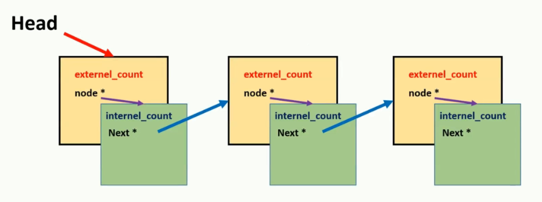

# 23. Lock-free data structure

该章节涉及到

* Thread, mutex, condition variable, futures etc
* Lock based data structures
  * fine grain locking mechanisms
    * **"Fine-grain locking mechanism"** 可以翻译为 **"细粒度锁机制"**。这是一种同步机制，它允许多个线程更有效地同时访问数据结构的不同部分。通过使用更小的锁或更多的锁来保护数据结构的更小部分，细粒度锁可以减少线程之间的争用，并提高并发性。相对应的是粗粒度锁（"coarse-grained locking"），它使用较大的锁或较少的锁来保护整个数据结构或其较大部分，这可能导致更多的争用和较低的并发性。
  * Implantation from ground level
* C++ memory model
  * Atomics
  * Memory ordering sematics


## 23.1 Lock-free与Wait-free

1. **Lock-free（无锁）**：
   - 在无锁编程中，线程之间共享数据，但不使用传统的锁来协调访问。
   - 无锁算法保证系统中至少有一个线程可以取得进展，即使有其他线程被暂停或执行时间被延迟。
   - **无锁算法通常依赖于原子操作**（如CAS - Compare-And-Swap）来实现线程间的协调。
   - 无锁编程可以避免死锁、饥饿和锁竞争，但可能存在活锁和更复杂的程序逻辑。
2. **Wait-free（无等待）**：
   - 无等待算法是无锁编程的一个子集，它提供了更强的保证。
   - 在无等待算法中，每个线程在有限的步骤内都可以取得进展，不管其他线程的状态如何。
   - 无等待算法保证所有线程都以恒定的速度前进，没有线程会因为其他线程的操作而延迟。
   - 实现无等待算法通常比纯粹的无锁算法更难，但它提供了更好的实时性和可预测性。


## 23.2 Lock free Stack


成员函数：

* push

  * race condition

    

    * 之前的做法是使用一个mutex将push整体锁起来，这个方法将限制并发。

* pop

成员变量

* 当前值
* 下一个地址


```c++
#pragma once
# include <iostream>
# include <thread>
# include <atomic>

namespace Lock_free_stack {
	/*
	stack last in first out, use a pointer called head to represent the node last in
	the node->next point to the node goes before it
	*/
	template<typename T>
	class regular_stack {
	private:
		struct node {
			T data;
			node* next;

			node(T const& _data) :data{ _data } {}
		};

		node* head;

	public:
		void push(T const& _data) {//race condition，push两次只插入一次
			node* const new_node = new node(_data);
			new_node->next = head;
			head = new_node;//关键语句
		}

		void pop(T& result) {
			node* old_head = head;
			head = old_head->next;
			result = old_head->data;
			delete old_head;
		}
	};

	template<typename T>
	class lock_free_stack {
		struct node {
			std::shared_ptr<T> data;//使用shared_ptr
			node* next;

			node(T const& _data) :data{ std::make_shared<T>(_data) } {}
		};

		std::atomic<node*> head;
	public:
		void push(T const& _data) {
			// 申请新的节点
			node* const new_node = new node(_data);

			//将新的节点与当前stack head建立联系
			new_node->next = head.load();
			
			//在这一步查看head是否被修改
			// 如果其他的thread已经先行插入了，此时这个class的head就会指向新的，只需要比较我们在上一步建立的联系是否正确，就可以正确的更新head了
			// 如果head的值与->next相同，代表没有thread修改，因此head就更新为此节点。
			// 如果不同，那么new_node->next就会被存为当前head的值，这样也更新了当前节点上一步的错误
			// 循环直到赋值成功，这种方法不保证插入顺序，只保证没有race condition
			while(!head.compare_exchange_weak(new_node->next, new_node));
		}

		std::shared_ptr<T> pop() {
			/*
				我们需要保证head指针在我们分配新head和result时没有改变，不然就会出现pop两次，实际只pop一次
				实际上，无论是push还是pop，我们都只需要关注将head赋值给新旧节点，以及改变head这两句，其余的都是可以同时操作的
				也就是说这里两个race condition的冲突关键点只有head的读取与修改
				在大多数场合，我们对一个冲突的variable使用一个新的temporary variable来存储，就可以将race condition限制到变量的读取与写入这两个操作中。
			*/
			node* old_head = head.load();
			while (old_head && !head.compare_exchange_weak(old_head, old_head->next));
			//这里，需要先判断old head，是因为存在一种情况，stack已经只剩一个了，两个线程同时pop，此时晚pop的线程会因为原子操作，old_head会被赋值为当前的head，因为没有节点因此为nullptr，此时old_head->next就是在dereference一个nullptr，这明显是错误的
			//因此，应该首先排除old_head为空的状态


			//在普通实现中，返回给调用者之前，节点已经被从栈中移除，或者只有当前线程持有该节点的引用。如果在返回结果时发生异常，就无法回滚已经完成的更改。（即为在上一级的exception中已经访问不到这个数据了，无法做出操作）
			// 因此，在这里使用shared_ptr，可以在异常发生时确保资源被释放，同时，可以在其他地方留有备份，令在这个函数中出现差错时，该数据还有迹可循。
			return old_head ? old_head->data : std::shared_ptr<T>();
		}
	};


}
```

有几个点是需要注意的：

* 写入时使用atomic进行自旋锁

* 在pop中delete顶部节点时，需要额外处理

  * 在普通的stack实现中，我们使用一个reference来传回结果。因为我们最终需要删掉这个node，所以如果用return，我们要么不能执行delete，要么不能return这个已经被delete的值。

  * 在lock-free stack中，考虑到多线程需要对exception有鲁棒性，因此我们采取了另一种写法，我们使用shared_ptr来托管这个要传回的数据，然后不考虑这个节点的delete，得到的上面的代码。在接下来，我们会采用另一套机制来解决这个memory leak。

    * 这个鲁棒性体现在，首先如果按照

      ```c++
      void pop(T& result) {
      	node* old_head = head;
      	head = old_head->next;
      	result = old_head->data;
      	delete old_head;
      }
      ```

      那么这个node在函数返回caller thread时实际上已经被移除了，并且只有这个处理的线程有这个结果。

      如果在返回时，出现了任何的exception，那么这个返回就会被作废，我们永远失去了这个值，没有任何重来的方法。

      因此，我们在多线程总通常返回一个能够自动处理exception的类型，在这个例子中，是shared_ptr。它能够帮助我们保证在返回时不会有任何的exception被thrown到上级。

      但是，使用shared_ptr的写法，你返回的就是那个被遗弃节点的值，你就不得不面对node内存释放和返回shared_ptr的取舍了。你先返回了shared_ptr，那么内存就不会被释放。反之，shared_ptr被删除了，返回的就不正确。

      在上面的写法中，我们首先默认了memory leak，在下面我们将给出解决方案。


## 23.3 解决memory_leak：thread counting

```c++
template<typename T>
class lock_free_stack_without_memory_leak {
	struct node {
		std::shared_ptr<T> data;//使用shared_ptr
		node* next;

		node(T const& _data) :data{ std::make_shared<T>(_data) } {}
	};

	std::atomic<node*> head;
	std::atomic<int> thread_in_pop;
	std::atomic<node*> to_be_deleted;


	void try_reclaim(node* old_head) {
		if (thread_in_pop == 1) {
			//delete node pointed by old head
			delete old_head;

			node* claimed_list = to_be_deleted.exchange(nullptr);
			if (!--thread_in_pop) {
				delete_nodes(claimed_list);
			}
			else if(calimed_list) {
				node* last = claimed_list;
				while (node* const next = last->next) {
					last = next;
				}
				last->next = to_be_deleted;
				while (!to_be_deleted.compare_exchange_weak(last->next, claimed_list));
			}
		}
		else {
			//add node pointed by old_head to the to_be_deleted list
			old_head->next = to_be_deleted;
			while (!to_be_deleted.compare_exchange_weak(old_head->next));
			--thread_in_pop;
		}

	}

	void delete_nodes(node* nodes) {
		while (nodes) {
			node* next = nodes->next;
			delete nodes;
			nodes = next;

		}
	}

public:
	void push(T const& _data) {
		node* const new_node = new node(_data);

		new_node->next = head.load();

		while (!head.compare_exchange_weak(new_node->next, new_node));
	}

	std::shared_ptr<T> pop() {
		++thread_in_pop;

		node* old_head = head.load();
		while (old_head && !head.compare_exchange_weak(old_head, old_head->next));
		

		std::shared_ptr<T> res;
		if (old_head) {
			res.swap(old_head->data);
		}

		try_reclaim(old_head);

		return res;
	}
};
```


## 23.4 解决memory_leak: Hazard pointer list


Hazard Pointer 是一种用于无锁编程中的内存管理技术。在无锁编程中，由于多个线程可能同时访问和修改共享数据，因此正确和安全地管理内存回收变得复杂。如果一个线程正在访问一个对象，而另一个线程决定删除同一个对象，这可能导致严重的问题，比如悬空指针和未定义行为。(这个错误在之前的将整个操作mutex时是不会出现的）。Hazard Pointer 正是为了解决这类问题而设计的。

Hazard Pointer 的基本思想是：

1. **标记对象**：当一个线程打算访问一个共享对象时，它先在一个**全局注册表**中标记（或称为“声明”）这个对象。这个标记告诉其他线程有人正在使用这个对象，因此它现在不能被安全地删除。
2. **检查和删除**：当一个线程想要删除一个共享对象时，它首先检查该对象是否被标记为正在使用（即检查**全局**注册表）。如果被标记，那么它不能立即删除该对象。相反，它要么将该对象放入一个待删除列表中，要么稍后再尝试删除。
3. **移除标记**：当一个线程不再访问一个共享对象时，它需要从全局注册表中移除该对象的标记，表明这个对象现在可以被安全地回收。

使用 Hazard Pointer 的优点包括：

- **防止悬空引用**：它可以防止其他线程在对象仍在使用时删除该对象。
- **无锁操作**：它允许无锁数据结构的线程安全内存管理，没有显著的性能损失。

然而，Hazard Pointer 也有其缺点，比如管理注册表的复杂性，以及可能导致的内存回收延迟。在实践中，实现一个有效且正确的 Hazard Pointer 机制是相当复杂的，需要仔细处理同步和数据结构的细节。


这里的Hazard pointer维护的是一个thread ID与node的组合

* 如果任何线程想要删除任何节点，都需要检查在list中是否有任何危险指针占用这个节点
* 如果有，那么这个nodeA将被添加到to-be-deleted list
* 通常，一个线程在第一次进入pop时，都会加入hazard pointer list，并且这个线程之后的访问都是通过这个通道，而非创建一个新的entry（这是一个costly的操作）。因此，当我们确保一个线程不再需要关于不删除节点的保证时，它的node就被设置为nullptr。
* Hazard pointer需要一个全局的上限，static的，全实例共享的。（？应该是为了防止无限调用，资源耗尽）

```c++
template<typename T>
class lock_free_stack_with_harzard_pointer {

	struct node {
		std::shared_ptr<T> data;//使用shared_ptr
		node* next;

		node(T const& _data) :data{ std::make_shared<T>(_data) } {}
	};

	std::atomic<node*> head;
	

	const int max_hazard_pointers = 100;

	struct hazard_pointer {
		std::atomic<std::thread::id> id;
		std::atomic<void*> pointer;
	};

	hazard_pointer hazard_pointers[max_hazard_pointers];

	static class hazard_pointer_manager {
		/*
			每个线程都有一个分配的 hazard pointer manager object，当hazard pointer manager构建时，它将在危hazard pointer list中分配一个条目
		*/
		hazard_pointer* hp;
	
	public:
		hazard_pointer_manager() :hp(nullptr) {
			//find out empty slot in Hazard
			for (unsigned i = 0; i < max_hazard_pointers; ++i) {
				std::thread::id default_id;
				if (hazard_pointers[i].id.compare_exchange_strong(default_id, std::this_thread::get_id()))//防止访问hazard_pointers的race condition
				{
					hp = &hazard_pointers[i];
					break;
				}
			}

			if (!hp) {
				throw std::runtime_error("no hazard pointers available");
			}
		}

		std::atomic<void*>& get_pointer() {
			return hp->pointer;
		}

		~hazard_pointer_manager() {
			//将存入的位置保存给hp，这样下一次就不需要遍历寻找
			hp->pointer.store(nullptr);
			hp->id.store(std::thread::id());
		}

	};

	std::atomic<void*>& get_hazard_pointer_for_current_thread() {
		static thread_local hazard_pointer_manager hz_manager;//allow us to have one manager object for each thread，如果只有static，那么所有的线程会共用，如果只有threadlocal或者什么都没有，那么每次调用就会生成一个新的manager
		return hz_manager.get_pointer();
	}

	bool any_outstanding_hazards(node* p) {
		//检查给定节点对象是否有任何未解决的危险指针
		for (unsigned i = 0; i < max_hazard_pointers; ++i) {
			if (hazard_pointers[i].pointer.load() == p) {
				return true;
			}
			return false;
		}
	}
	
	std::atomic<node*> nodes_to_reclaim;

	void reclaim_later(node* _node) {
		_node->next = nodes_to_reclaim.load();
		while (!nodes_to_reclaim.compare_exchange_weak(_node->next, _node));
	}

	void delete_nodes_with_no_hazards() {
		node* current = nodes_to_reclaim.exchange(nullptr);

		while (current) {
			node* const next = current->next;
			if (!any_outstanding_hazards(current)) {
				delete current;
			}
			else {
				reclaim_later(current);
			}
			current = next;
		}
	}

public:
	void push(T const& _data) {
		node* const new_node = new node(_data);

		new_node->next = head.load();

		while (!head.compare_exchange_weak(new_node->next, new_node));
	}

	void pop(T& result) {
		
		std::atomic<void*>& hp = get_hazard_pointer_for_current_thread();
		node* old_head = head.load();

		//防止运行到此处时（设置该节点为hazard pointer前），其他线程将这个old_head指向的node删除了，我们将下面改为do_while
		do {
			//set hazard pointer
			hp.store(old_head);
		} while (old_head && !head.compare_exchange_strong(old_head, old_head->next));

		//clear hazard pointer
		hp.store(nullptr);

		std::shared_ptr<T> res;
		if (old_head) {
			res.swap(old_head->data);

			if (any_outstanding_hazards(old_head)) {
				reclaim_later(old_head);
			}
			else {
				delete old_head;
			}

			delete_nodes_with_no_hazards();
		}
	}
};
```

主要分为两部分：

* stack主体

  * `struct node`
  * `atomic<node*> head`
  * `push`
  * `pop`:
    * 首先为该线程寻找hazard_pointer_list中的一个位置，返回这个list中该线程占用的`id-node pair`的node部分
    * 将该pop的位置写入hazard_pointer_list，表明这个node已经被删除，但是考虑到有其他线程可能正在通过指针读取/操作这个node，因此暂时不删除
    * 使用do-while防止删除同一个节点的情况
    * 接下来就是全部操作完成后，释放该node的资源，并从hazard_pointer删除该node，表明该线程虽然在hazard_pointer_list中，但是并没有操作的node
      * 将这个node的data转给局部shared_ptr，让他自动销毁
      * 因为这个线程对这个node的操作完了，因此将hazard_pointer_list的node改为nullptr，然后寻找是否有其他线程在修改这个node，如果没有直接delete，如果有就将该节点通过reclaim_later加入nodes_to_reclaim list
      * 然后顺便查查是不是这个nods_to_reclaim中的节点在hazard_list中已经没有被线程占用了，如果是那么就删除，如果不是那么就重新加回nodes_to_reclaim

* Hazard_pointer_list主体

  * `max_hazard_pointer`:代表能够加入hazard_pointer_list的指针上限为100个，这里使用static是防止过多的实例以及过多的线程。如果不加static，实际上是容许了过多的实例，每个实例有很多线程加入hazard_pointer这种情况。

  * `hazard_pointer_manager`

    * 构造函数：查找是否hazard_pointer_list中还有地方插入，没有就报错，有就将这个位置的地址传给hp，表明这个地方已经有人了。这个写法其实有一个问题就是，假如在它搜索到后半段时，前半段一个thread释放了自己的位置，而后半段是满的，其实就会假报错。

      

    * `get_pointer`：返回这个hazard_pointer_list位置中node位置的地址，方便我们修改

    * 析构函数：这个构造函数和析构函数写的其实有问题，细节以后再谈，其实不应该使用for应该使用while，然后在获取hazard_pointers地址的一瞬间就应该赋值其thread_id，不然逻辑上会有bug，即为有同时两个thread获取这个地址。


## 23.5 解决memory_leak: 使用reference counting mechanism

使用两个技术，external count（外部计数）与internal count(内部计数)

* **external count**
  * increased every time the pointer is read
* **internal count** :inside the node
  * increased every time the reading is finished



```c++
template<typename T>
class lock_free_stack_ref_counting {
private:
	struct node;

	struct node_wrapper {
		int external_count;
		node* ptr;
	};

	struct node {
		std::shared_ptr<T> data;
		std::atomic<int> internal_count;
		node_wrapper next;

		node(T const& _data) :data(std::make_shared<T>(_data)), internal_count{ 0 } {}

	};

	std::atomic<node_wrapper> head;


	void increment_head_ref_count(node_wrapper& old_counter) //必须要引用传入，因为old_counter可能会被其他增加reference
	{
		node_wrapper new_counter;//代表结果，old_counter其实是代表输入
		
		//这种操作以后都理解为，head实际上都是在高速变化的，我们通过截取其当前时段的静态状态，来进行操作，然后查看操作这段时间之后，是否这个状态改变了。如果改变了，重新做一遍，如果没变就提交上去。

		do {
			new_counter = old_counter;
			++new_counter.external_count;
		} while (!head.compare_exchange_strong(old_counter, new_counter));//在这里，如果其他wrapper先一步增加reference，那么  old_counter就会被head更新，然后再次尝试+1

		old_counter.external_count = new_counter.external_count;//更新old_counter
	}


public:
	~lock_free_stack_ref_counting() {

	}

	void push(T const& data) {
		//创建即将push的新node，此处是node wrapper
		node_wrapper new_node;

		//然后为这个node wrapper的node创建新的数据
		new_node.ptr = new node(data);
		
        
		//表示基础链表中的引用
		new_node.external_count = 1;
		

		//更新head
		new_node.ptr->next = head.load();
		while (!head.compare_exchange_weak(new_node.ptr->next, new_node));
	}

	std::shared_ptr<T> pop() {
		node_wrapper old_head = head.load();

		while (true)
		{
			increment_head_ref_count(old_head);//此处也更新过old_head，有可能是head wrapper，在这个wrapper中指向一个null的node

			node* const ptr = old_head.ptr;
			if (!ptr) {//如果没东西pop
				return std::shared_ptr<T>();
			}

			if (head.compare_exchange_strong(old_head, ptr->next)) // 如果当前head没有变化，则更新head
			{
				std::shared_ptr<T> res;
				res.swap(ptr->data);

				int const current_external_count = old_head.external_count - 2;//-2减去的是基础列表的引用与当前线程引用

				if (ptr->internal_count.fetch_add(current_external_count) == 0) //内部计数应当与为外部计数的负数
				{
					delete ptr;
				}
				return res;
			}
			else if (ptr->internal_count.fectch_sub(1) == 1) //当前head对象被其他线程更改了，上面的compare_exchange函数会将old_head更新到新的head,这意味着当前线程不再引用该节点，因此我们必须减少internal count
			{
				//进入该block代表internal_count在减之前为0，也就是这条线程是保存引用的最后一个线程
				//这里要特别设置==1
				delete ptr;
			}
		}

	}
};
```

我们用三个线程A，B，C来模拟这个过程，我们设置node中有两个节点`head->wrapperA(nodeA)->wrapperB(nodeB)`

我们认为A,B,C同时访问`pop`，从`increment_head_ref_count(old_head);`之后开始，显然**1个stack引用与3个线程引用，nodeB的external reference为4**

* 首先`threadA`进入:
  * `threadA`继续，此时`ptr=&nodeB`，不为空
  * 将`head`与`&nodeB->next`比较，此时`oldhead`不变
  * 将`nodeB`的data存入局部的res中
  * 减去`nodeB`本身在stack中的reference以及`threadA`的reference
  * 此时，
    * 如果只有`threadA`，那么`internal_count`就应该是+=0还是0，直接就能删除`nodeB`
    * 否则，此时`internal_count=2`只能先return res
* 接着是`threadB`进入，此时head被`threaA`更改为`ptr->next`也就是`&nodeA`
  * `ptr = old_head.ptr = &nodeB`而`head`保存的是`nodeA`,因此`old_head`变为了`wrapperA`
  * 判断`internal_count-1==0`是否为真，发现不为真。注意，在这里，`threadB`减去了自己本应该对`nodeB`的引用，因为他发现已经被A引用了，没他事了
  * 此时，没有一个if符合，重新while
  * `nodeB`的`external_reference`变为2
  * `ptr=&nodeA`，与`head`相符
  * 在这个if里，如果threadC和threadB的进度一样，那threadC还要像threadB一样多循环一次，如果threadC在`if (ptr->internal_count.fetch_add(current_external_count) == 0)`之前还没有添加引用，那么它将在接下来被介绍。
  * `thread_B`直接删除`ptr=&nodeB`并返回`res`
* `threadC`
  * 此时`threadC`中，`ptr=&nodeA`,`head = nullptr`, `old_head = wrapperB`
  * 在`f (head.compare_exchange_strong(old_head, ptr->next))`中，`old_head=空的头wrapper`
  * 此时，`threadC`也收回了自己对一开始`nodeA`的reference，因此进入else if，删除了`&nodeA`
  * 重新while，更新ptr=nullptr，进入`if(！ptr)`，返回空的`shared_ptr`
