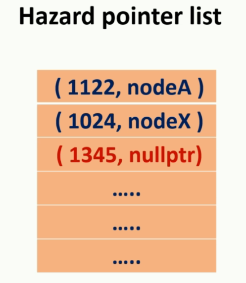

# 23. Lock-free data structure

该章节涉及到

* Thread, mutex, condition variable, futures etc
* Lock based data structures
  * fine grain locking mechanisms
    * **"Fine-grain locking mechanism"** 可以翻译为 **"细粒度锁机制"**。这是一种同步机制，它允许多个线程更有效地同时访问数据结构的不同部分。通过使用更小的锁或更多的锁来保护数据结构的更小部分，细粒度锁可以减少线程之间的争用，并提高并发性。相对应的是粗粒度锁（"coarse-grained locking"），它使用较大的锁或较少的锁来保护整个数据结构或其较大部分，这可能导致更多的争用和较低的并发性。
  * Implantation from ground level
* C++ memory model
  * Atomics
  * Memory ordering sematics


## 23.1 Lock-free与Wait-free

1. **Lock-free（无锁）**：
   - 在无锁编程中，线程之间共享数据，但不使用传统的锁来协调访问。
   - 无锁算法保证系统中至少有一个线程可以取得进展，即使有其他线程被暂停或执行时间被延迟。
   - **无锁算法通常依赖于原子操作**（如CAS - Compare-And-Swap）来实现线程间的协调。
   - 无锁编程可以避免死锁、饥饿和锁竞争，但可能存在活锁和更复杂的程序逻辑。
2. **Wait-free（无等待）**：
   - 无等待算法是无锁编程的一个子集，它提供了更强的保证。
   - 在无等待算法中，每个线程在有限的步骤内都可以取得进展，不管其他线程的状态如何。
   - 无等待算法保证所有线程都以恒定的速度前进，没有线程会因为其他线程的操作而延迟。
   - 实现无等待算法通常比纯粹的无锁算法更难，但它提供了更好的实时性和可预测性。


## 23.2 Lock free Stack


成员函数：

* push

  * race condition

    

    * 之前的做法是使用一个mutex将push整体锁起来，这个方法将限制并发。

* pop

成员变量

* 当前值
* 下一个地址


```c++
#pragma once
# include <iostream>
# include <thread>
# include <atomic>

namespace Lock_free_stack {
	/*
	stack last in first out, use a pointer called head to represent the node last in
	the node->next point to the node goes before it
	*/
	template<typename T>
	class regular_stack {
	private:
		struct node {
			T data;
			node* next;

			node(T const& _data) :data{ _data } {}
		};

		node* head;

	public:
		void push(T const& _data) {//race condition，push两次只插入一次
			node* const new_node = new node(_data);
			new_node->next = head;
			head = new_node;//关键语句
		}

		void pop(T& result) {
			node* old_head = head;
			head = old_head->next;
			result = old_head->data;
			delete old_head;
		}
	};

	template<typename T>
	class lock_free_stack {
		struct node {
			std::shared_ptr<T> data;//使用shared_ptr
			node* next;

			node(T const& _data) :data{ std::make_shared<T>(_data) } {}
		};

		std::atomic<node*> head;
	public:
		void push(T const& _data) {
			// 申请新的节点
			node* const new_node = new node(_data);

			//将新的节点与当前stack head建立联系
			new_node->next = head.load();
			
			//在这一步查看head是否被修改
			// 如果其他的thread已经先行插入了，此时这个class的head就会指向新的，只需要比较我们在上一步建立的联系是否正确，就可以正确的更新head了
			// 如果head的值与->next相同，代表没有thread修改，因此head就更新为此节点。
			// 如果不同，那么new_node->next就会被存为当前head的值，这样也更新了当前节点上一步的错误
			// 循环直到赋值成功，这种方法不保证插入顺序，只保证没有race condition
			while(!head.compare_exchange_weak(new_node->next, new_node));
		}

		std::shared_ptr<T> pop() {
			/*
				我们需要保证head指针在我们分配新head和result时没有改变，不然就会出现pop两次，实际只pop一次
				实际上，无论是push还是pop，我们都只需要关注将head赋值给新旧节点，以及改变head这两句，其余的都是可以同时操作的
				也就是说这里两个race condition的冲突关键点只有head的读取与修改
				在大多数场合，我们对一个冲突的variable使用一个新的temporary variable来存储，就可以将race condition限制到变量的读取与写入这两个操作中。
			*/
			node* old_head = head.load();
			while (old_head && !head.compare_exchange_weak(old_head, old_head->next));
			//这里，需要先判断old head，是因为存在一种情况，stack已经只剩一个了，两个线程同时pop，此时晚pop的线程会因为原子操作，old_head会被赋值为当前的head，因为没有节点因此为nullptr，此时old_head->next就是在dereference一个nullptr，这明显是错误的
			//因此，应该首先排除old_head为空的状态


			//在普通实现中，返回给调用者之前，节点已经被从栈中移除，或者只有当前线程持有该节点的引用。如果在返回结果时发生异常，就无法回滚已经完成的更改。（即为在上一级的exception中已经访问不到这个数据了，无法做出操作）
			// 因此，在这里使用shared_ptr，可以在异常发生时确保资源被释放，同时，可以在其他地方留有备份，令在这个函数中出现差错时，该数据还有迹可循。
			return old_head ? old_head->data : std::shared_ptr<T>();
		}
	};


}
```

有几个点是需要注意的：

* 写入时使用atomic进行自旋锁

* 在pop中delete顶部节点时，需要额外处理

  * 在普通的stack实现中，我们使用一个reference来传回结果。因为我们最终需要删掉这个node，所以如果用return，我们要么不能执行delete，要么不能return这个已经被delete的值。

  * 在lock-free stack中，考虑到多线程需要对exception有鲁棒性，因此我们采取了另一种写法，我们使用shared_ptr来托管这个要传回的数据，然后不考虑这个节点的delete，得到的上面的代码。在接下来，我们会采用另一套机制来解决这个memory leak。

    * 这个鲁棒性体现在，首先如果按照

      ```c++
      void pop(T& result) {
      	node* old_head = head;
      	head = old_head->next;
      	result = old_head->data;
      	delete old_head;
      }
      ```

      那么这个node在函数返回caller thread时实际上已经被移除了，并且只有这个处理的线程有这个结果。

      如果在返回时，出现了任何的exception，那么这个返回就会被作废，我们永远失去了这个值，没有任何重来的方法。

      因此，我们在多线程总通常返回一个能够自动处理exception的类型，在这个例子中，是shared_ptr。它能够帮助我们保证在返回时不会有任何的exception被thrown到上级。

      但是，使用shared_ptr的写法，你返回的就是那个被遗弃节点的值，你就不得不面对node内存释放和返回shared_ptr的取舍了。你先返回了shared_ptr，那么内存就不会被释放。反之，shared_ptr被删除了，返回的就不正确。

      在上面的写法中，我们首先默认了memory leak，在下面我们将给出解决方案。


**接下来的部分进一步学习之后再说**

```c++
template<typename T>
class lock_free_stack_without_memory_leak {
	struct node {
		std::shared_ptr<T> data;//使用shared_ptr
		node* next;

		node(T const& _data) :data{ std::make_shared<T>(_data) } {}
	};

	std::atomic<node*> head;
	std::atomic<int> thread_in_pop;
	std::atomic<node*> to_be_deleted;


	void try_reclaim(node* old_head) {
		if (thread_in_pop == 1) {
			//delete node pointed by old head
			delete old_head;

			node* claimed_list = to_be_deleted.exchange(nullptr);
			if (!--thread_in_pop) {
				delete_nodes(claimed_list);
			}
			else if(calimed_list) {
				node* last = claimed_list;
				while (node* const next = last->next) {
					last = next;
				}
				last->next = to_be_deleted;
				while (!to_be_deleted.compare_exchange_weak(last->next, claimed_list));
			}
		}
		else {
			//add node pointed by old_head to the to_be_deleted list
			old_head->next = to_be_deleted;
			while (!to_be_deleted.compare_exchange_weak(old_head->next));
			--thread_in_pop;
		}

	}

	void delete_nodes(node* nodes) {
		while (nodes) {
			node* next = nodes->next;
			delete nodes;
			nodes = next;

		}
	}

public:
	void push(T const& _data) {
		node* const new_node = new node(_data);

		new_node->next = head.load();

		while (!head.compare_exchange_weak(new_node->next, new_node));
	}

	std::shared_ptr<T> pop() {
		++thread_in_pop;

		node* old_head = head.load();
		while (old_head && !head.compare_exchange_weak(old_head, old_head->next));
		

		std::shared_ptr<T> res;
		if (old_head) {
			res.swap(old_head->data);
		}

		try_reclaim(old_head);

		return res;
	}
};
```


## 23.3 Hazard pointer


Hazard Pointer 是一种用于无锁编程中的内存管理技术。在无锁编程中，由于多个线程可能同时访问和修改共享数据，因此正确和安全地管理内存回收变得复杂。如果一个线程正在访问一个对象，而另一个线程决定删除同一个对象，这可能导致严重的问题，比如悬空指针和未定义行为。(这个错误在之前的将整个操作mutex时是不会出现的）。Hazard Pointer 正是为了解决这类问题而设计的。

Hazard Pointer 的基本思想是：

1. **标记对象**：当一个线程打算访问一个共享对象时，它先在一个**全局注册表**中标记（或称为“声明”）这个对象。这个标记告诉其他线程有人正在使用这个对象，因此它现在不能被安全地删除。
2. **检查和删除**：当一个线程想要删除一个共享对象时，它首先检查该对象是否被标记为正在使用（即检查**全局**注册表）。如果被标记，那么它不能立即删除该对象。相反，它要么将该对象放入一个待删除列表中，要么稍后再尝试删除。
3. **移除标记**：当一个线程不再访问一个共享对象时，它需要从全局注册表中移除该对象的标记，表明这个对象现在可以被安全地回收。

使用 Hazard Pointer 的优点包括：

- **防止悬空引用**：它可以防止其他线程在对象仍在使用时删除该对象。
- **无锁操作**：它允许无锁数据结构的线程安全内存管理，没有显著的性能损失。

然而，Hazard Pointer 也有其缺点，比如管理注册表的复杂性，以及可能导致的内存回收延迟。在实践中，实现一个有效且正确的 Hazard Pointer 机制是相当复杂的，需要仔细处理同步和数据结构的细节。



这里的Hazard pointer维护的是一个thread ID与node的组合

* 如果任何线程想要删除任何节点，都需要检查在list中是否有任何危险指针占用这个节点
* 如果有，那么这个nodeA将被添加到to-be-deleted list
* 通常，一个线程在第一次进入pop时，都会加入hazard pointer list，并且这个线程之后的访问都是通过这个通道，而非创建一个新的entry（这是一个costly的操作）。因此，当我们确保一个线程不再需要关于不删除节点的保证时，它的node就被设置为nullptr。
* Hazard pointer需要一个全局的上限，static的，全实例共享的。（？）

