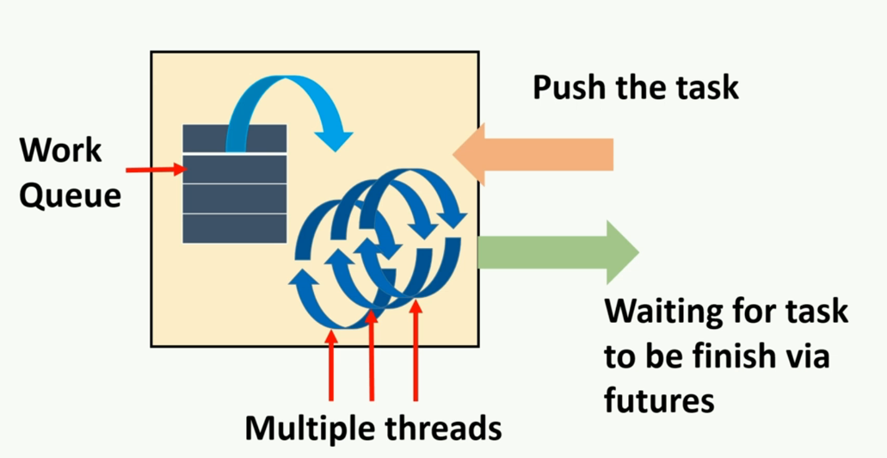
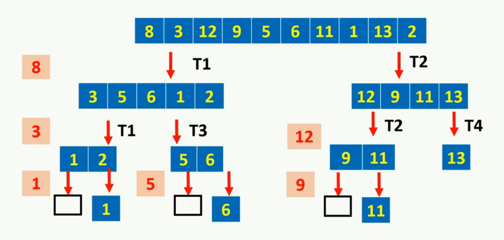
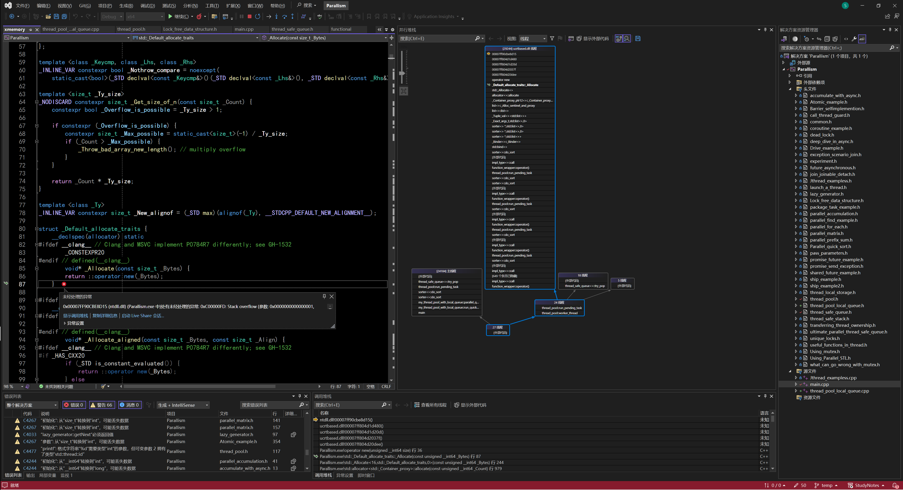
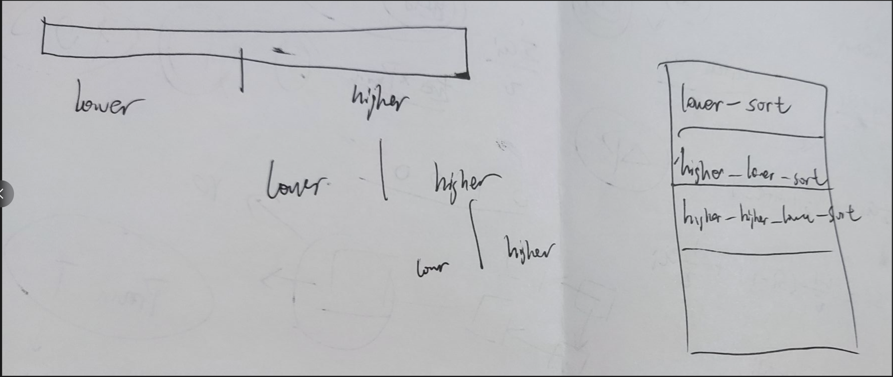

# 24. 线程池


## 24.1 最简单的线程池

* 固定数量的线程来处理工作
* 当有工作要做时，将其放入待处理工作的队列中
* 每一个worker thread从队列中获取工作，运行指定的任务，然后返回到队列寻找新的工作




```c++
namespace my_thread_pool {
	class join_threads {
		std::vector<std::thread>& threads;

	public:
		explicit join_threads(std::vector<std::thread>& _threads) :
			threads(_threads)
		{}

		~join_threads()
		{
			for (long i = 0; i < threads.size(); i++)
			{
				if (threads[i].joinable())
					threads[i].join();
			}
		}

	};

	class thread_pool {
		//用来停止所有线程的执行的标志，如果设置了，所有的线程都必须停止工作，代表我们将不再使用这个线程池
		std::atomic_bool done;

		//待处理工件队列，每个线程在完成当前任务后都会检查下一个线程。存入类型
		thread_safe_queue_space::thread_safe_queue<std::function<void()>> work_queue;
		
		//线程池
		std::vector<std::thread> threads;

		//保证对线程池中每一个线程的join
		join_threads joiner;

		void worker_thread() {
			//对于每个线程

			while (!done) {

				// 尝试从队列中取出任务
				// 若是成功取出任务，那么我们可以执行任务。
				// 若是取出任务失败，则可以yield这个线程，从而让给其他线程CPU空间。
				std::function<void()> task;
				if (work_queue.try_pop(task)) {

					task();
				}
				else {
					
					std::this_thread::yield();
				}
			}
		}
	public:

		thread_pool() :done(false), joiner(threads) {
			//我们拥有的线程数等于硬件支持的最大线程数
			const int thread_count = std::thread::hardware_concurrency();

			try {
				for (int i = 0; i < thread_count; i++) {
					// 第一个参数是一个指向成员函数worker_thread的指针，该成员函数定义了每个线程该做什么
					// 第二个参数指向的是这个线程池对象，这意味着新创建的线程将在这个线程池对象的上下文中运行worker_thread
					// 因为第一个参数调用的是成员函数，才需要第二个参数提供这个类的实例的上下文。
					// 调用的是如下构造函数
					/*
						template< class Function, class... Args >
						explicit thread( Function&& f, Args&&... args );
					*/

					threads.push_back(std::thread(&thread_pool::worker_thread, this));
				}
			}
			catch (...) {
				//包装线程的构造，如果发现异常可以简单的将done设置为true，这将指示其他线程结束运行。
				std::cout << "Error occurs, shut down all threads\n";
				done = true;
				throw;
			}
		}

		~thread_pool() {
			done = true;
		}

		template<typename Function_type>
		void submit(Function_type f) {
			//将任务推送到工作队列

			work_queue.push(std::function<void()>(f));
		}

	};

	void run() {
		//制造一百个任务分配给线程池
		thread_pool pool;
		std::cout << "Testing thread pool" << std::endl;

		for (int i = 0; i < 100; i++) {
			pool.submit([=] {
				printf("%d printed by thread - %d \n", i, std::this_thread::get_id());
				});
		}
		//在这个版本中，并没有等待所有任务完成的机制，因此将task全部压入后会直接调用析构函数，导致正在工作的线程全部停止。
		system("pause");

	}
}
```

* 在这个例子中，线程在等待一个任务完成（也就是说，在任务函数返回之前）时，不能去执行其他的任务。每个线程一次只能执行一个任务，直到这个任务完全完成后，线程才会检查是否有新的任务等待执行。在某些线程池的实现中，线程可以在执行一个长任务的同时，暂停该任务，去执行其他的（可能更短的）任务，然后再回来继续执行原任务。这种机制称为任务窃取（work stealing）。


这个里面的thread_safe_queue实现如下

```c++
namespace thread_safe_queue_space {
	template<typename T>
	class thread_safe_queue {
		std::mutex m;
		std::condition_variable cv;
		std::queue<std::shared_ptr<T>> queue;//为了避免因为资源约束产生的异常情况，使用了shared_ptr
	public:

		thread_safe_queue()
		{}

		thread_safe_queue(thread_safe_queue const& other_queue)
		{
			std::lock_guard<std::mutex> lg(other_queue.m);
			queue = other_queue.queue;
		}

		// 左值引用版本
		void push(const T& value) {
			std::lock_guard<std::mutex> lg(m);
			queue.push(std::make_shared<T>(value));
			cv.notify_one(); 
		}

		// 右值引用版本
		void push(T&& value) {
			std::lock_guard<std::mutex> lg(m);
			queue.push(std::make_shared<T>(value));
			cv.notify_one();
		}

		std::shared_ptr<T> pop() //combine pop and front
		{
			std::lock_guard<std::mutex> lg(m);
			if (queue.empty()) //避免pop和empty的竞争
			{
				return std::shared_ptr<T>();
			}
			else {
				std::shared_ptr<T> ref(queue.front());
				queue.pop();
				return ref;
			}
		}
		

		bool empty() {
			std::lock_guard<std::mutex> lg(m);
			return queue.empty();
		}

		std::shared_ptr<T> wait_pop() //不同于pop,wait_pop旨在实现一个指令队列，不是对当前状态的queue pop，而是总共一定需要pop执行多少指令
		{
			std::unique_lock<std::mutex> lg(m);
			cv.wait(lg, [this] {return !queue.empty(); });
			std::shared_ptr<T> ref = queue.front(); //拷贝初始化，效果与直接初始化ref(queue.front())一样
			queue.pop();
			return ref;
			/*
			第一个线程来执行这个等待函数，它将获取lock，并且检查队列是否为空
			如果不为空，这意味着如果队列铀元素，那么将进行下一个语句，也就是front和pop，同时保持对锁的控制权(holding the lock)
			如果队列为空，那么此条件失败，它将解锁与此唯一锁关联的互斥锁（以方便允许其他线程调用此等待），然后进入睡眠

			因此，可能出现这么一种情况，即多个线程都在等待队列中有一个元素
			当我们push后，这些线程的随机一个就会被唤醒，获得此唯一锁关联的锁，然后检查条件成功，然后继续执行
			当然，我们也可以使用notify_all，这样所有线程都将被唤醒，但是只有一个线程会被允许继续，因为只有一一个线程允许获取与此唯一锁关联的锁
			在该线程超出范围后，该锁将被释放，以便另一个被唤醒的线程可以在获取锁（notify_all是全部唤醒，排队检查),此时另一个线程获取锁的控制权，检查发现不行，接着睡。这里也能体现notify_all的消耗太大
			*/

		}
		size_t size()
		{
			std::lock_guard<std::mutex> lg(m);
			return queue.size();
		}
		//以下是返回该操作是否执行成功的版本，通过引用来获取pop的值
		bool wait_pop(T& ref)
		{
			std::unique_lock<std::mutex> lg(m);
			cv.wait(lg, [this] {
				return !queue.empty();
				});

			ref = *(queue.front().get());
			queue.pop();
			return true;
		}

		bool pop(T& ref)
		{
			std::lock_guard<std::mutex> lg(m);
			if (queue.empty())
			{
				return false;
			}
			else
			{
				ref = queue.front();
				queue.pop();
				return true;
			}
		}

		// 版本1: 返回std::shared_ptr<T>
		std::shared_ptr<T> try_pop() {
			std::lock_guard<std::mutex> lg(m);
			if (queue.empty()) {
				return std::shared_ptr<T>();
			}

			std::shared_ptr<T> ref(queue.front());
			queue.pop();
			return ref;
		}

		//版本2: 通过引用返回值，并返回操作是否成功的bool值
		bool try_pop(T& value) {
			std::lock_guard<std::mutex> lg(m);

			if (queue.empty()) {
				return false;
			}

			value = *(queue.front());
			queue.pop();
			return true;
		}

	};
```


## 24.2 等待任务完成

目标是修改之前的线程池实现，使得调用线程（即提交任务的线程）能够等待这些任务的完成。

采取的方法很简单，即将任务打包为“包任务（package tasks）”，并将这些打包后的任务提交到线程池。

具体来说，将在提交函数中创建“包任务”，然后将这些任务推送到工作队列。每个“包任务”都与一个“future”对象关联，这个对象将被返回给调用线程。

通过这些改动，调用线程可以通过返回的“future”对象来等待任务的完成。这样，调用线程便能知道何时任务完成，以及如何获取任务的结果。


### 24.2.1 一个小问题

#### I:不能copy的packaged_task

首先，我需要明确几个点

我thread pool的队列的声明是

```c++
thread_safe_queue_space::thread_safe_queue<std::function<void()>> work_queue;
```

我函数的封装是

```c++
auto submit(Function_type f) -> std::future<std::invoke_result_t<Function_type>>
{
	typedef typename std::invoke_result_t<Function_type> result_type;
	std::packaged_task<result_type()> task(f);
	std::future<result_type> res=task.get_future();
}
```

也就是说我们push的是一个packaged_task对象

我push的语法是

```c++
work_queue.push(std::move(task));
```

到这里位置都没有任何问题。packaged_task不满足copy assignment，所以我们move进去。

==好，进入线程安全的queue内部，出现问题了==

```c++
// 右值引用版本
void push(T&& value) {
	//std::cout << "右值引用" << std::endl;
	std::lock_guard<std::mutex> lg(m);
	queue.push(std::make_shared<T>(std::move(value)));
	cv.notify_one();
}
```

这里的关键在于 `std::make_shared<T>(std::move(value))` 这一行。即使 `value` 是通过移动语义传递的，`std::make_shared` 内部会尝试拷贝 `T` 类型的对象，因为它需要构造一个新的 `T` 实例来存储在 `std::shared_ptr` 中。`std::function<void()>` 可以接受一个 `std::packaged_task`，但由于 `std::packaged_task` 本身不可拷贝，这里就会出现问题。

当然，也可能是`std::function` 内部不会尝试进行拷贝操作。`std::function` 在某些内部操作中（如分配内部存储空间）可能仍需要可调用对象是可拷贝的。

总而言之，==传入右值也有可能触发意料之外的copy assignment==

- **`std::function`**：即使使用 `std::move` 将 `std::packaged_task` 转换为 `std::function`，`std::function` 的实现可能仍在内部进行拷贝操作。这是因为 `std::function` 必须能够存储任何类型的可调用对象，包括那些只能被拷贝的对象。
- **`std::make_shared`**：当使用 `std::make_shared` 并传入右值时，它会构造一个新对象。如果这个对象的类型不支持移动，或者构造函数不优先使用移动语义，则仍可能发生拷贝。


其他的pop部分，其实不会有太多问题

```c++
//版本2: 通过引用返回值，并返回操作是否成功的bool值
bool try_pop(T& value) {
	std::lock_guard<std::mutex> lg(m);

	if (queue.empty()) {
		return false;
	}

	value =std::move( *(queue.front()));//byd这里找bug找了我半天，当队列是不可复制的例如packaged_task时，就会报错。
	queue.pop();
	return true;
}
```


#### II. function_wrapper

那怎么办？我只能首先自己写一个function wrapper

```c++
// function_wrapper 是一个类型擦除的工具类，用于封装和调用任何可调用对象（如函数、Lambda 表达式和函数对象）。
class function_wrapper {
	// impl_base 是一个内部抽象基类，用于定义统一的调用接口。
	struct impl_base {
		// 纯虚函数，用于在派生类中执行具体的可调用对象。
		virtual void call() = 0;
		// 虚析构函数，确保派生类的正确析构。
		virtual ~impl_base() {}
	};

	// impl_type 是一个模板子类，继承自 impl_base。
	// 它封装了一个具体的可调用对象。
	template<typename F>
	struct impl_type : impl_base {
		F f; // 封装的可调用对象。
		// 构造函数，使用右值引用和 std::move 来支持移动语义。
		impl_type(F&& f_) : f(std::move(f_)) {}
		// 重写 call 函数，调用封装的可调用对象。
		void call() { f(); }
	};

	// impl 是一个指向 impl_base 的 unique_ptr，用于存储具体的 impl_type 实例。
	std::unique_ptr<impl_base> impl;

public:
	// 构造函数，接受任何可调用对象，并将其封装在 impl_type 中。
	template<typename F>
	function_wrapper(F&& f) :
		impl(new impl_type<F>(std::move(f)))
	{}

	// 调用运算符，通过 impl 指针调用实际的可调用对象。
	void operator()() { impl->call(); }

	// 默认构造函数。
	function_wrapper() {}

	// 移动构造函数，允许将 function_wrapper 对象之间进行移动。
	function_wrapper(function_wrapper&& other) :
		impl(std::move(other.impl))
	{}

	// 移动赋值运算符，允许将 function_wrapper 对象之间进行移动。
	function_wrapper& operator=(function_wrapper&& other) {
		impl = std::move(other.impl);
		return *this;
	}

	// 删除拷贝构造函数和拷贝赋值运算符，防止对象被拷贝。
	function_wrapper(const function_wrapper&) = delete;
	function_wrapper(function_wrapper&) = delete;
};

```

`function_wrapper` 类是一个类型擦除工具，用于封装和调用任意类型的可调用对象。

==根据之前的问题，我们希望这个透明的function_wrapper只有移动语义，并且不涉及copy。==

首先我们要知道，`std::function<void()>`不能用的归根到底是因为它封装了又封装的不彻底，我们用`function<void()>`来封装它，同时也失去了对它的直接控制权，它里卖弄乱七八糟的实现可能涉及copy。也就是说我们需要自己写一个容器，==以确保在整个存储和检索过程中都使用移动语义。==


另外，其实关于为什么最后会写成虚函数，我们先写一个初阶的写法

```c++
template<typename F>
class function_wrapper {
	struct impl_type{
		F f;
		impl_type(F&& f_) : f(std::move(f_)) {}
		void call() { f(); }
	};

	impl_type impl;

public:

	function_wrapper(F&& f) :
		impl(std::move(f));
	{}

	void operator()() { impl.call(); }

	function_wrapper() {}

	function_wrapper(function_wrapper&& other) :
		impl(std::move(other.impl))
	{}

	function_wrapper& operator=(function_wrapper&& other) {
		impl = std::move(other.impl);
		return *this;
	}

	function_wrapper(const function_wrapper&) = delete;
	function_wrapper(function_wrapper&) = delete;
};
```


然后我们明确，==`function_wrapper`不应该需要显式的类型，因为它是一个封装，如果需要显式的类型，那么它就没作用了==

那么我们的初阶写法就存在一个大问题，我们的成员value怎么写？问题就换成了，==如果我们想要function_wrapper不具有显式的类型，那么我们的成员value就不应该又显式的类型。==因此，我们引入虚函数，**基类用来表示我们所支持的所有类型的一个模板，继承类来实现具体的类型**，因此基类不需要模板，继承类需要模板。

同时，我们要知道，多态的Dynamic binding概念==只允许基类指针或引用==，我们必须将成员value设置为指针或引用才能够使用。(16.1.3)指针的方法就是一开始给出的写法（unique_ptr)。为什么不使用引用呢？因为引用这个比较麻烦，它需要在基类额外的添加move constructor，这个东西就更复杂了，并且对不同的数据结构，写法也很多，不如就用一个指针来代表控制权来得简单。


#### III .全程需要std::move

首先，在`try_pop()`中，就需要使用引用传递，当然如果你想用std::move return也是可以的。

其次，在submit中，我们push时，需要move进去

```c++
work_queue.push(std::move(task));
```

最后，也是找了最久的bug，还是出在try_pop里面，

```c++
value = *(queue.front());

value =std::move( *(queue.front()));
```

这里，我们需要将front直接传给value，这里也需要使用move。

我还得翻到很久以前的库修改，这是最烦的。


#### IV. 在传入函数时

我选择实现时不考虑传入参数，只是一个可调用函数。

但是在传入时，我会bind函数与参数，这样实现起来更简单。

```c++
template<typename Function_type>
auto submit(Function_type f) -> std::future<std::invoke_result_t<Function_type>>
{
	typedef typename std::invoke_result_t<Function_type> result_type;
	std::packaged_task<result_type()> task(f);
	std::future<result_type> res=task.get_future();

	work_queue.push(std::move(task));


	return res;
}

futures[i] = pool.submit(std::bind(accumulate_block<Iterator, T>(), block_start, block_end));
```

如果是集成到类内部的话应该是如下

```c++
template<typename Function_type, typename... Args>
auto submit(Function_type f, Args&&... args) -> std::future<std::invoke_result_t<Function_type, Args...>> {
    typedef std::invoke_result_t<Function_type, Args...> result_type;

    // 创建 std::packaged_task，绑定函数和参数
    std::packaged_task<result_type()> task(
        std::bind(std::forward<Function_type>(f), std::forward<Args>(args)...)
    );
    std::future<result_type> res = task.get_future();

    // 将任务移动到工作队列
    work_queue.push(std::move(task));

    return res;
}
```


### 24.2.2 完整的例子

```c++
namespace my_thread_pool_with_waiting_threads {
	class join_threads {
		std::vector<std::thread>& threads;

	public:
		explicit join_threads(std::vector<std::thread>& _threads) :
			threads(_threads)
		{}

		~join_threads()
		{
			for (long i = 0; i < threads.size(); i++)
			{
				if (threads[i].joinable())
					threads[i].join();
			}
		}

	};

	
	// function_wrapper 是一个类型擦除的工具类，用于封装和调用任何可调用对象（如函数、Lambda 表达式和函数对象）。
	class function_wrapper {
		// impl_base 是一个内部抽象基类，用于定义统一的调用接口。
		struct impl_base {
			virtual void call() = 0;
			virtual ~impl_base() {}
		};

		// impl_type 是一个模板子类，继承自 impl_base。
		// 它封装了一个具体的可调用对象。
		template<typename F>
		struct impl_type : impl_base {
			F f; 
			impl_type(F&& f_) : f(std::move(f_)) {}
			void call() { f(); }
		};

		// impl 是一个指向 impl_base 的 unique_ptr，用于存储具体的 impl_type 实例。
		std::unique_ptr<impl_base> impl;

	public:
		// 构造函数，接受任何可调用对象，并将其封装在 impl_type 中。
		template<typename F>
		function_wrapper(F&& f) :
			impl(new impl_type<F>(std::move(f)))
		{}

		// 调用运算符，通过 impl 指针调用实际的可调用对象。
		void operator()() { impl->call(); }

		// 默认构造函数。
		function_wrapper() {}

		// 移动构造函数，允许将 function_wrapper 对象之间进行移动。
		function_wrapper(function_wrapper&& other) :
			impl(std::move(other.impl))
		{}

		// 移动赋值运算符，允许将 function_wrapper 对象之间进行移动。
		function_wrapper& operator=(function_wrapper&& other) {
			impl = std::move(other.impl);
			return *this;
		}

		// 删除拷贝构造函数和拷贝赋值运算符，防止对象被拷贝。
		function_wrapper(const function_wrapper&) = delete;
		function_wrapper(function_wrapper&) = delete;
	};
	


	class thread_pool {
		//用来停止所有线程的执行的标志，如果设置了，所有的线程都必须停止工作，代表我们将不再使用这个线程池
		std::atomic_bool done;

		//待处理工件队列，每个线程在完成当前任务后都会检查下一个线程。存入类型
		//thread_safe_queue_space::thread_safe_queue<std::function<void()>> work_queue;//需要存入的对象copy constructable
		//我们需要自己写一个函数包装器
		thread_safe_queue_space::thread_safe_queue<function_wrapper> work_queue;

		//线程池
		std::vector<std::thread> threads;

		//保证对线程池中每一个线程的join
		join_threads joiner;

		void worker_thread() {
			//对于每个线程

			while (!done) {

				// 尝试从队列中取出任务
				// 若是成功取出任务，那么我们可以执行任务。
				// 若是取出任务失败，则可以yield这个线程，从而让给其他线程CPU空间。
				//std::function<void()> task;
				function_wrapper task;
				if (work_queue.try_pop(task)) {

					task();
				}
				else {

					std::this_thread::yield();
				}
			}
		}
	public:

		thread_pool() :done(false), joiner(threads) {
			//我们拥有的线程数等于硬件支持的最大线程数
			const int thread_count = std::thread::hardware_concurrency();

			try {
				for (int i = 0; i < thread_count; i++) {
					// 第一个参数是一个指向成员函数worker_thread的指针，该成员函数定义了每个线程该做什么
					// 第二个参数指向的是这个线程池对象，这意味着新创建的线程将在这个线程池对象的上下文中运行worker_thread
					// 因为第一个参数调用的是成员函数，才需要第二个参数提供这个类的实例的上下文。
					// 调用的是如下构造函数
					/*
						template< class Function, class... Args >
						explicit thread( Function&& f, Args&&... args );
					*/

					threads.push_back(std::thread(&thread_pool::worker_thread, this));
				}
			}
			catch (...) {
				//包装线程的构造，如果发现异常可以简单的将done设置为true，这将指示其他线程结束运行。
				std::cout << "Error occurs, shut down all threads\n";
				done = true;
				throw;
			}
		}

		~thread_pool() {
			done = true;
		}

		/*template<typename Function_type, typename... Args>
		auto submit(Function_type f, Args&&... args) -> std::future<std::invoke_result_t<Function_type, Args...>> {
			typedef std::invoke_result_t<Function_type, Args...> result_type;

			// 创建 std::packaged_task，绑定函数和参数
			std::packaged_task<result_type()> task(
				std::bind(std::forward<Function_type>(f), std::forward<Args>(args)...)
			);
			std::future<result_type> res = task.get_future();

			// 将任务移动到工作队列
			work_queue.push(std::move(task));

			return res;
		}*/
		template<typename Function_type>
		auto submit(Function_type f) -> std::future<std::invoke_result_t<Function_type>>
		{
			typedef typename std::invoke_result_t<Function_type> result_type;
			std::packaged_task<result_type()> task(f);
			std::future<result_type> res=task.get_future();

			work_queue.push(std::move(task));


			return res;
		}
	};

	// 每个线程自己进行的加法
	template<typename Iterator, typename T>
	struct accumulate_block
	{
		T operator()(Iterator first, Iterator last)
		{
			T value = std::accumulate(first, last, T());//以T的默认初始构造作为初始值
			printf(" %d - %d  \n", std::this_thread::get_id(), value);
			return value;
		}
	};

	//
	template<typename Iterator, typename T>
	T parallel_accumulate(Iterator first, Iterator last, T init)
	{
		unsigned long const length = std::distance(first, last);
		thread_pool pool;

		if (!length)
			return init;

		// 计算任务数量
		unsigned long const min_per_thread = 25;
		unsigned long const max_threads =
			(length + min_per_thread - 1) / min_per_thread;

		unsigned long const hardware_threads =
			std::thread::hardware_concurrency();

		unsigned long const num_threads =
			std::min(hardware_threads != 0 ? hardware_threads : 2, max_threads);

		unsigned long const block_size = length / num_threads;


		//分配任务给thread pool
		std::vector<std::future<T> > futures(num_threads - 1);

		Iterator block_start = first;
		for (unsigned long i = 0; i < (num_threads - 1); ++i)
		{
			Iterator block_end = block_start;
			std::advance(block_end, block_size);
			//提交
			futures[i] = pool.submit(std::bind(accumulate_block<Iterator, T>(), block_start, block_end));//move
			block_start = block_end;
		}
		T last_result = accumulate_block<int*, int>()(block_start, last);


		//等待任务完成
		T result = init;
		for (unsigned long i = 0; i < (num_threads - 1); ++i)
		{
			result += futures[i].get();
		}
		result += last_result;
		return result;
	}

	void run() {
		const int size = 1000;
		int* my_array = new int[size];
		srand(0);


		for (size_t i = 0; i < size; i++) {
			my_array[i] = 1;
		}

		long result = parallel_accumulate<int*, int>(my_array, my_array + size, 0);
		std::cout << "final sum is -" << result << std::endl;
	}
}
```


## 24.3 在线程池中的线程实现异步

标题可能比较难理解，我们来考虑一个例子：



这是quicksort的并行算法，在这里，首先caller thread会call出两个thread，这两个thread又会自己再call两个thread。

也就是说，在这个task，相比之前的不同是，之前的线程池接受的task都是只是执行任务，==但是现在我们的task可能会自己call一个新的task加入线程池。==

这个操作带来的问题就是，**考虑到我们线程池的可用线程是有限的**，因此可能正在工作的24个线程都在等待无法被pop的task的结果，这样线程池就产生了死锁。(因为我们的线程池与操作系统不同，不能在当前线程上有一个未完成task时切换task)。

所以我们的解决方式是：==在线程池的接口中提供一个函数，以便于任何线程都可以运行不同的task，只要这个函数觉得合适。==

我们称这个函数为`run_pending_task`。它所做的就是尝试从线程池队列中弹出一个任务并执行。

```c++
void run_pending_task(){
    function_wrapper task;
    if(work_queue.try_pop(task)){
        task();
    }else{
        std::this_thread::yield();
    }
}
```

具体来说，虽然我们的线程池并不能自动控制什么时候这事儿该停一下做新的task，但是我们写算法时是知道的。我们为thread_pool手动添加一个从等待序列取出task运行的方法，并手动的在算法需要其他thread结果时运行时从等待序列取工件，直到条件满足。相比之前的在一个task结束时才能继续取，这种方法造成了一种伪异步的效果。

```c++
// thread pool就是在最后加上run_pending_task
// 并行版本的quick sort
template<typename T>
struct sorter
{
	thread_pool pool;

	std::list<T> do_sort(std::list<T> & chunk_data)
	{
		if (chunk_data.size() < 2)
			return chunk_data;

		std::list<T> result;

		// void splice( const_iterator pos, list& other, const_iterator it );
		// Transfers the element pointed to by it from other into *this. The element is inserted before the element pointed to by pos.
		result.splice(result.begin(), chunk_data, chunk_data.begin());

		T const& partition_val = *result.begin();

		// ForwardIt partition( ForwardIt first, ForwardIt last, UnaryPredicate p );
		// Reorders the elements in the range [first, last) in such a way that all elements for which the predicate p returns true precede the elements for which predicate p returns false. Relative order of the elements is not preserved.
		typename std::list<T>::iterator divide_point = std::partition(chunk_data.begin(), chunk_data.end(), [&](T const& val) {
			
			return val < partition_val;
			});

		std::list<T> new_lower_chunk;
		new_lower_chunk.splice(new_lower_chunk.end(), chunk_data, chunk_data.begin(), divide_point);

		std::future<std::list<T>> new_lower = pool.submit(std::bind(&sorter::do_sort, this, std::move(new_lower_chunk)));

		std::list<T> new_higher(do_sort(chunk_data));

		//这种写法会造成死锁
		//result.splice(result.end(), new_higher);
		//result.splice(result.begin(), new_lower.get());

		result.splice(result.end(), new_higher);
		//手动暂停，为这个线程分配新的任务，直到某个线程把new_lower的活干了。
		while (!new_lower._Is_ready()) {
			pool.run_pending_task();
		}
		result.splice(result.begin(), new_lower.get());

		return result;
	}
};

template<typename T> 
std::list<T> parallel_quick_sort(std::list<T> input) {
	if (input.empty()) {
		return input;
	}
	sorter<T> s;
	return s.do_sort(input);
}

void run_quick_sort() {
	const int size = 900;
	std::list<int> my_array;
	srand(0);

	for (size_t i = 0; i < size; i++) {
		my_array.push_back(rand());
	}

	my_array = parallel_quick_sort(my_array);
	for (size_t i = 0; i < size; i++) {
		std::cout << my_array.front() << std::endl;
		my_array.pop_front();
	}
}
```

这种方法远非理想的实现，当我们将任务提交到线程池或调用pending_task时，在这两种情况中，我们都在访问线程池中相同的work_queue，同时考虑到我们这种方法会频率很高的对work_queue执行submit与pop，因此我们简单的用锁将会造成大量性能损失。

1. **单一工作队列**：线程池使用单个工作队列来存储所有待处理的任务。无论是提交新任务还是执行挂起的任务，都涉及对这个工作队列的操作。
2. **内部同步**：为了确保线程安全，对工作队列的访问（添加任务、取出任务等）需要进行同步。这通常是通过锁（如互斥锁）来实现的。
3. **性能损失**：同步操作（特别是锁的使用）可能导致性能损失。因为当一个线程在访问工作队列时，其他线程必须等待，这会减少并发性，增加线程等待时间。


## 24.4 解决频繁访问同一个queue造成的性能损失

我们称这种问题为Cache ping pong，解决方法是为每个线程使用单独的工作队列，对于每个线程，它将新项目发布到自己的队列中，并仅在自己的本地队列没有工作时从全局队列中获取工作。


```c++
//thread_pool_local_queue.h
#pragma once

# include <atomic>
# include <vector>
# include <iostream>
# include "thread_safe_queue.h"
# include <functional>
# include <algorithm>
# include <list>
# include <memory>
# include <queue>
# include <future>
# include <numeric>

namespace my_thread_pool_with_local_queue {


	class join_threads {
		std::vector<std::thread>& threads;

	public:
		explicit join_threads(std::vector<std::thread>& _threads) :
			threads(_threads)
		{}

		~join_threads()
		{
			for (long i = 0; i < threads.size(); i++)
			{
				if (threads[i].joinable())
					threads[i].join();
			}
		}

	};

	class function_wrapper {
		struct impl_base {
			virtual void call() = 0;
			virtual ~impl_base() {}
		};

		template<typename F>
		struct impl_type : impl_base {
			F f;
			impl_type(F&& f_) : f(std::move(f_)) {}
			void call() { f(); }
		};

		std::unique_ptr<impl_base> impl;

	public:
		template<typename F>
		function_wrapper(F&& f) :
			impl(new impl_type<F>(std::move(f)))
		{}
		void operator()() { impl->call(); }

		function_wrapper() {}

		function_wrapper(function_wrapper&& other) :
			impl(std::move(other.impl))
		{}

		function_wrapper& operator=(function_wrapper&& other) {
			impl = std::move(other.impl);
			return *this;
		}

		function_wrapper(const function_wrapper&) = delete;
		function_wrapper(function_wrapper&) = delete;
	};

	class thread_pool {
		std::atomic_bool done;

		thread_safe_queue_space::thread_safe_queue<function_wrapper> work_queue;

		// 每个线程自己的队列
		typedef std::queue<function_wrapper> local_queue_type;

		//每个线程都有自己的 local_work_queue 实例。这个实例在该线程第一次访问变量时创建，并在线程结束时销毁。
		static thread_local std::unique_ptr<local_queue_type> local_work_queue;

		std::vector<std::thread> threads;

		join_threads joiner;

		void worker_thread() {

			//这句代表创建时初始化，释放原来的对象并指向一个新对象
			local_work_queue.reset(new local_queue_type);

			while (!done) {
				run_pending_task();
			}
		}
	public:
		

		thread_pool() :done(false), joiner(threads) {
			const int thread_count = std::thread::hardware_concurrency();

			try {
				for (int i = 0; i < thread_count; i++) {
					//在被push到线程池的同时，这个线程就具有了local queue
					threads.push_back(std::thread(&thread_pool::worker_thread, this));
				}
			}
			catch (...) {
				std::cout << "Error occurs, shut down all threads\n";
				done = true;
				throw;
			}
		}

		~thread_pool() {
			done = true;
		}

		template<typename Function_type>
		auto submit(Function_type f) -> std::future<std::invoke_result_t<Function_type>>
		{
			// 当我们第一次向线程池submit时，caller thread并不是线程池线程，因此没有local_queue
			// submit在caller thread上向线程池push task
			// 如果这个task还会向同一个线程池push对象，那么此时caller thread就是线程池线程，此时提交到本地queue
			typedef typename std::invoke_result_t<Function_type> result_type;
			std::packaged_task<result_type()> task(f);
			std::future<result_type> res = task.get_future();

			//work_queue.push(std::move(task));
			//如果这个线程是池线程，那么我们可以简单地将任务推送到本地队列，避免争用全局工作队列
			//如果这个线程不是池线程，那么我们将任务推送到池工作队列中
			//即为初始call推送到池线程，递归调用使用本地queue
			//std::cout  << (*local_work_queue).size() << std::endl;
			if (local_work_queue) {
				(*local_work_queue).push(std::move(task));
			}
			else {
				work_queue.push(std::move(task));
			}


			return res;
		}


		// 在waiting task案例中使用
		void run_pending_task() {
			function_wrapper task;
			//如本地队列存在(不是nullptr)且不为空
			if (local_work_queue && !(*local_work_queue).empty()) {
				task = std::move((*local_work_queue).front());
				(*local_work_queue).pop();
				task();
			}
			else if (work_queue.try_pop(task)) {
				//本地队列无任务
				task();
			}
			else {
				//都没有任务
				std::this_thread::yield();
			}
		}
	};

	template<typename T>
	struct sorter
	{
		thread_pool pool;

		std::list<T> do_sort(std::list<T>& chunk_data)
		{
			if (chunk_data.size() < 2)
				return chunk_data;

			std::list<T> result;

			// void splice( const_iterator pos, list& other, const_iterator it );
			// Transfers the element pointed to by it from other into *this. The element is inserted before the element pointed to by pos.
			result.splice(result.begin(), chunk_data, chunk_data.begin());

			T const& partition_val = *result.begin();

			// ForwardIt partition( ForwardIt first, ForwardIt last, UnaryPredicate p );
			// Reorders the elements in the range [first, last) in such a way that all elements for which the predicate p returns true precede the elements for which predicate p returns false. Relative order of the elements is not preserved.
			typename std::list<T>::iterator divide_point = std::partition(chunk_data.begin(), chunk_data.end(), [&](T const& val) {

				return val < partition_val;
				});

			std::list<T> new_lower_chunk;
			new_lower_chunk.splice(new_lower_chunk.end(), chunk_data, chunk_data.begin(), divide_point);

			// 排序
			std::future<std::list<T>> new_lower = pool.submit(std::bind(&sorter::do_sort, this, std::move(new_lower_chunk)));

			std::list<T> new_higher(do_sort(chunk_data));

			//这种写法会造成死锁
			//result.splice(result.end(), new_higher);
			//result.splice(result.begin(), new_lower.get());

			result.splice(result.end(), new_higher);
			//手动暂停，为这个线程分配新的任务，直到某个线程把new_lower的活干了。
			while (!new_lower._Is_ready()) {
				pool.run_pending_task();
			}
			result.splice(result.begin(), new_lower.get());

			return result;
		}
	};

	template<typename T>
	std::list<T> parallel_quick_sort(std::list<T> input) {
		if (input.empty()) {
			return input;
		}
		sorter<T> s;
		
		return s.do_sort(input);
	}

	void run_quick_sort();

}
```


```c++
//thread_pool_local_queue.cpp
# include <atomic>
# include <vector>
# include <iostream>
# include "thread_safe_queue.h"
# include <functional>
# include <algorithm>
# include <list>
# include <memory>
# include <queue>
# include <future>
# include <numeric>
# include "thread_pool_local_queue.h"


namespace my_thread_pool_with_local_queue {
	thread_local std::unique_ptr<std::queue<function_wrapper>> thread_pool::local_work_queue;
	void run_quick_sort() {
		const int size = 800;
		std::list<int> my_array;
		srand(0);

		for (size_t i = 0; i < size; i++) {
			my_array.push_back(rand());
		}

		my_array = parallel_quick_sort(my_array);
		for (size_t i = 0; i < size; i++) {
			std::cout << my_array.front() << std::endl;
			my_array.pop_front();
		}
	}
}

```

这里有几点需要说明一下：

* 因为引入了`static thread_local`，**因此我们必须在一个.cpp中声明一次，因为static并不会在类中申请空间**。同时，我试过在main.cpp中不是很能申请，因此我们必须使用一个.cpp实现文件。因此，考虑到这个头文件会被main.cpp和实现.cpp引用一共两次，在头文件中的所有非模板非内联函数和变量（当然不包括类里面的）都会被重复定义。我们应该只是在头文件申明这些函数和变量，并在实现源文件中添加具体实现。
* 同时，继续使用run_quick_sort这个例子并不十分合适。



我们可以发现，出现了栈溢出。这里是子线程的栈溢出了。因为我们问题的特殊性，我们必须将一整个序列传入sorter，因此根据实现

```c++
std::future<std::list<T>> new_lower = pool.submit(std::bind(&sorter::do_sort, this, std::move(new_lower_chunk)));

std::list<T> new_higher(do_sort(chunk_data));
```

global_work_queue应该如下



左侧是分类，右侧是global_work_queue，我们可以发现从caller thread的视角看，所有的lower都会被push进global_queue，higher则由caller_thread进一步处理

我们可以发现，其实如果运气最不好的时候，lower-sort就是几乎整个序列的长度

此时，我们线程池的第一个线程应该是会将子任务全部push进自己的local_work_queue里面

我怀疑就是因为这个导致了stack overflow。

实际上通过控制递归与控制local_queue的深度即可避免stack_overflow

==我的疑惑在于理论上thread和caller_thread的栈应该是一样大的，为什么我没有使用local_queue的时候就没出问题。==
