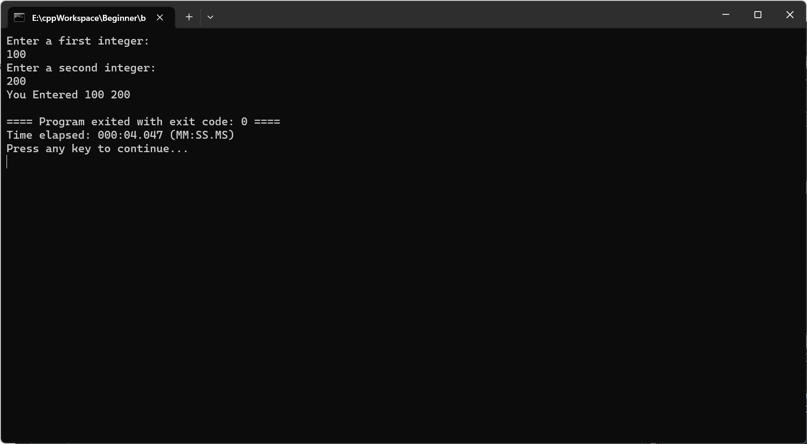
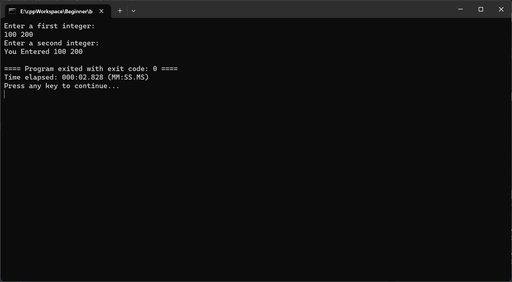
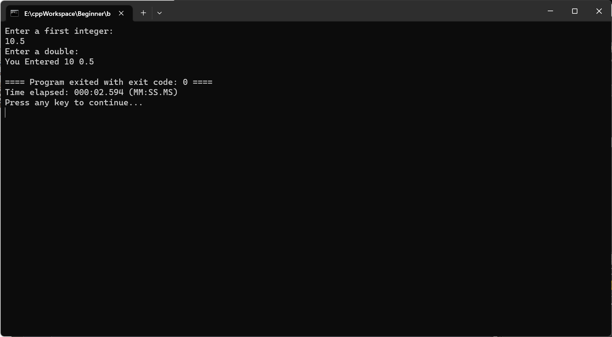
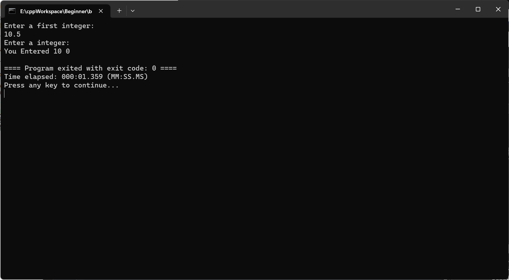

# 1. Basic Components

## 1.1 Keywords

<details>
    <summary>基本数据类型</summary>
    1. `int`：用于声明整数类型的变量。<br>
    2. `float`：用于声明浮点类型的变量。<br>
    3. `double`：用于声明双精度浮点类型的变量。<br>
    4. `char`：用于声明字符类型的变量。<br>
    5. `bool`：用于声明布尔类型的变量，其值为`true`或`false`。<br>
    6. `void`：表示无类型，通常用于函数返回值类型的声明，表示该函数不返回值。<br>
    7. `wchar_t`：用于声明宽字符类型。<br>
    8. `char16_t`：用于表示16位宽的字符，用于存储UTF-16编码的字符。<br>
    9. `char32_t`：用于表示32位宽的字符，用于存储UTF-32编码的字符。<br>
</details>

<details>
    <summary>控制结构</summary>
    1. `if`：条件语句关键字，用于进行条件判断。<br>
    2. `else`：与`if`配合使用，表示`if`条件不满足时执行的语句。<br>
    3. `for`：循环语句关键字，用于执行固定次数的循环。<br>
    4. `while`：循环语句关键字，用于执行满足条件的循环。<br>
    5. `do`：与`while`配合使用，表示先执行循环体，然后再判断条件。<br>
    6. `switch`：选择语句关键字，用于多条件判断。<br>
    7. `case`：与`switch`配合使用，表示满足某个条件时执行的语句。<br>
    8. `default`：与`switch`配合使用，表示所有`case`都不满足时执行的语句。<br>
    9. `break`：用于跳出循环或`switch`语句。<br>
    10. `continue`：用于跳过当前循环中剩余的语句，直接开始下一次循环。<br>
    11. `return`：用于从函数中返回，结束函数的执行。<br>
    12. `goto`：用于无条件跳转到程序的其他部分。<br>
</details>

<details>
    <summary>类和对象</summary>
    1. `class`：用于声明一个类。<br>
    2. `public`：类的访问修饰符，表示公有的成员，可以在任何地方访问。<br>
    3. `private`：类的访问修饰符，表示私有的成员，只能在类的内部访问。<br>
    4. `protected`：类的访问修饰符，表示受保护的成员，只能在类的内部和子类中访问。<br>
    5. `this`：表示当前对象的指针。<br>
    6. `virtual`：用于声明虚函数，实现多态。<br>
    7. `override`：用于声明函数覆盖基类中的虚函数。<br>
    8. `final`：用于声明类不能被继承，或者虚函数不能被覆盖。<br>
    9. `friend`：用于声明友元类或友元函数，可以访问类的私有成员和保护成员。<br>
</details>

<details>
    <summary>模板和泛型编程</summary>
    1. `template`：用于定义模板，实现代码的泛型编程。<br>
    2. `typename`：在模板编程中，用于声明一个类型参数。<br>
    3. `concept`：用于声明一个概念（C++20）。<br>
    4. `requires`：用于指定一个模板的约束（C++20）。<br>
</details>

<details>
    <summary>异常处理</summary>
    1. `try`：用于包含可能抛出异常的代码块。<br>
    2. `catch`：用于捕获异常，并处理异常。<br>
    3. `throw`：用于抛出一个异常。<br>
    4. `noexcept`：指定函数是否会抛出异常。<br>
</details>

<details>
    <summary>新的并发和协程特性</summary>
    1. `co_await`：用于等待一个异步操作的完成（C++20）。<br>
    2. `co_return`：用于从协程中返回值（C++20）。<br>
    3. `co_yield`：用于暂停协程并可能返回一个值（C++20）。<br>
</details>

<details>
    <summary>最新的模块和静态分析特性</summary>
    1. `import`：用于导入一个模块（C++20）。<br>
    2. `module`：用于定义一个模块（C++20）。<br>
    3. `export`：用于导出一个模块的接口（C++20）。<br>
    4. `audit`：用于注解代码的静态分析（C++23，未正式发布）。<br>
    5. `axiom`：用于注解代码的静态分析（C++23，未正式发布）。<br>
</details>
## 1.2 Identifier

<details>
    <summary>common identifier</summary>
    1.int main()<br>
    2.int favorite_number<br>
	3.cout<br>
	4.cin<br>
	5....<br>
</details>

## 1.3 Operators

<details>
    <summary> umcommon operators</summary>
    1.'A << B' means stream B to A<br>
    2.'A >> B' means stream from A and stored in B<br>
    3. '::' 作用域解析运算符<br>
    4. 详细见第九章
</details>

# 2. Preprocessor Directives（超出课程大纲，自行补充）

* Preprocessor process the source code _befor_ Compiler

* * First delete all comments in source file and replace it to a space
  * Find preprocess ==directives== and execute them, whose with a pound or hashtag ,such as 

  ```c++
  # include <iolstream>
  # include "mufile.h"
  用所引用的文件替换以上的行，并递归的处理该文件
  
  # if
  # elif
  # else
  # endif
  # ifdef
  # ifndef
  # define
  # under
  # line
  # error
  # pragma
  ```

  

  * So ,编译器看到的源代码是所有注释都被剥离，并且所有预处理器指令都被处理和删除之后的

* 预处理指令通常用于条件编译代码，例如如果

  * 如果在windows中就调用windows库，在mac10中就调用mac库
  * 使用error指令终止编译并显示错误消息

* C++预处理器不了解C++语法，仅处理其特定指令


# 3. The main function

* 每个C++程序必须有一个main函数
* 主函数由操作系统调用
* return值返回给操作系统，操作系统根据返回值给出运行情况
* 两种main函数，较为复杂的一个需要从命令行向程序传递信息，信息片段的数量argc(argument count )以及argument vector，也就是实际信息

```c++
int main(int argc, char *argv[])
int main()
```


# 4. Namespaces

* 考虑到c++常见构成是我们自己的代码，c++标准库代码以及来自第三方开发者的库代码，里面的命名会重复，而c++会无法处理这个重复。

* 因此C++允许开发人员使用命名空间作为Container(容器)，将他们的代码实体分组到命名空间范围内。例如创建一个Namespace A，里面定义了一个cout，则使用A::cout访问。

* ::称为范围解析运算子，用于解析名称

* * 考虑到cin，cout，endl十分常用，因此我们可以使用using namespace std;来避免繁琐的调用，但是在大型程序中不好用

  * 或者使用以下方式确定想要使用的特定名称

  * * using std::cout;
    * using std::cin
    * using std::endl

    


# 5. Comments

single line comment : //

multi line comment : /* A*/

# 6. Basic I/O using cin and cout

常用C++ standard：cin,cout,cerr,clog，他们都包含在<iostream>中

* C++采用流抽象（stream abstraction)处理控制台与键盘等设备上的IO
* * cout是默认的控制台或是屏幕输出流
  * cerr是默认标准错误输出流
  * clog是默认标准日志输出流
  * cin是键盘输入流
* insertion operator << 用于输出流
* * 可以连续插入流，并且<<不会自己插入换行符号
  * 可以使用<<"\n"或是<<endl。==其中endl作为行尾流操纵器，它会刷新流（buffer)，一个流的缓存直到被刷新才会被写入控制台，详见file stream==
* extraction operator >> 用于输入流
* * Extract data from the cin stream based on data's  type
  * cin can be chained: cin>>data1>>data2;
  * 输入的字符仅当回车之后才会被扔入输入流
  * cin使用空格作为某个提取值的终止
  * 若是cin>>integer1,但是键盘输入字符串，那么会出现存储错误
* 同样的方法也可以写入读取文件流，这是后话


## ATTENTION: 代码中位于后面的cin也会先于之前的cout读取

注意：输入流与读取流并没有严格的遵循先来后到，而是平行的两个流，例如如下这个例子，正常输入回车输入回车会如预料的一样输出，但是如果是“输入 空格 输入”，则实际上两个输入的值存在buffer中，==在回车刷新流后会直接填充到未来所有可能需要的位置中==， 这导致实际上后面==cout了之后会发现cin早就完成了，从而直接跳到下一个cout==。

```c++
# include <iostream>

using namespace std;
 
int main(){
    int firstint, secondint;
    cout << "Enter a first integer:" << endl;
    cin >> firstint;
    cout << "Enter a second integer:" << endl;
    cin >> secondint;
    cout << "You Entered " << firstint << " " << secondint << endl;
    return 0;
}
```



 



## ATTENTION: 读入的数据不严格以空格划分，这也是为什么我们需要以空格作为终止符，不然会出现奇怪的数据

以下可以发现，当输入10.5在integer的输入流时，它会自动识别“.”不为double类型，==将输入分为了10 与 .5==，这里.5也被识别为0.5.

但是再往后就是一些奇怪的值了，所以不要这么做，它总能读出一些奇怪的值。

当然，如果我们直接输入一个string， 输入就会失败，你就会得到一些随机的值，当然，==第一个integer一定是0==

```c++
# include <iostream>

using namespace std;
 
int main(){
    int firstint, secondint;
    double thirdnum;
    cout << "Enter a first integer:" << endl;
    cin >> firstint;
    cout << "Enter a double:" << endl;
    cin >> thirdnum;
    cout << "You Entered " << firstint << " " << thirdnum << endl;
    return 0;
}
```






# List Initialization from c++11

在C++11及其后续版本中，引入了一种新的初始化语法，称为列表初始化（list initialization）或统一初始化（uniform initialization）。这种初始化方式使用大括号 `{}` 来初始化变量，可以用于任何类型的变量，包括基本类型、复合类型、容器、类对象等。

以下是一些使用列表初始化的例子：

```cpp
int a {5}; // 初始化一个整数
double b {3.14}; // 初始化一个双精度浮点数
std::string s {"Hello, World!"}; // 初始化一个字符串
std::vector<int> v {1, 2, 3, 4, 5}; // 初始化一个整数向量
```

列表初始化有几个优点：

1. **防止窄化转换**：列表初始化不允许窄化转换。例如，如果你尝试使用一个浮点数来初始化一个整型变量，如 `int x {3.14};`，编译器将会报错。这可以帮助开发者发现和避免一些潜在的错误。
2. **统一的语法**：列表初始化可以用于任何类型的变量，这使得初始化的语法更加统一。
3. **初始化类和结构体**：列表初始化可以用于初始化类和结构体的成员变量，甚至可以用于初始化类和结构体的对象。
4. **初始化容器**：列表初始化可以用于初始化STL容器，如 `std::vector`、`std::array`、`std::map` 等。

总的来说，列表初始化是一种更加现代和安全的初始化方式，推荐在C++编程中使用。


1. **防止窄化转换**：列表初始化不允许窄化转换。例如，如果你尝试使用一个浮点数来初始化一个整型变量，编译器将会报错。这可以帮助开发者发现和避免一些潜在的错误。

   ```c++
   int x {3.14}; // 编译错误：窄化转换
   ```

2. **统一的语法**：列表初始化可以用于任何类型的变量，这使得初始化的语法更加统一。

   ```c++
   int a {5}; // 整数
   double b {3.14}; // 浮点数
   std::string s {"Hello, World!"}; // 字符串
   ```

3. **初始化类和结构体**：列表初始化可以用于初始化类和结构体的成员变量，甚至可以用于初始化类和结构体的对象。

   ```c++
   struct Point {
       int x;
       int y;
   };
   
   Point p {5, 10}; // 初始化一个Point对象
   ```

4. **初始化容器**：列表初始化可以用于初始化STL容器，如 `std::vector`、`std::array`、`std::map` 等。

   ```c++
   std::vector<int> v {1, 2, 3, 4, 5}; // 初始化一个整数向量
   std::map<std::string, int> m {{"apple", 1}, {"banana", 2}}; // 初始化一个map
   ```

这些例子展示了列表初始化的各种用途和优点。希望这些例子能帮助你更好地理解列表初始化。


## 窄转换

在C++中，窄化转换（Narrowing conversion）是指一种可能导致信息丢失或者改变的类型转换。以下是一些窄化转换的例子：

1. 从一个浮点数类型转换为整数类型。例如，当你将一个浮点数3.14转换为整数，结果将是3，小数部分会被丢弃。

   ```c++
   float f = 3.14;
   int i = f;  // 窄化转换，i的值将会是3
   ```

2. 从一个大的整数类型转换为一个小的整数类型。例如，当你将一个int类型的值转换为char类型，如果这个值超过了char类型能表示的范围，结果将会是一个不确定的值。

   ```c++
   int i = 300;
   char c = i;  // 窄化转换，c的值将会是一个不确定的值
   ```

3. 从一个整数类型转换为浮点数类型。虽然这种转换通常不会丢失信息，但是如果整数的值超过了浮点数能精确表示的范围，结果将会是一个最接近的浮点数。

   ```c++
   int i = 1000000000;
   float f = i;  // 窄化转换，f的值可能不会精确等于1000000000
   ```

在C++11及其后续版本中，列表初始化（list initialization）语法不允许窄化转换。如果你尝试进行窄化转换，编译器将会报错。这可以帮助开发者发现和避免一些潜在的错误。

#  Block 中的内存管理

在C++中，一个块（block）内声明的变量的生命周期是受其作用域限制的。当控制流离开这个块时，这些变量会被销毁。对于这些变量的内存管理，情况如下：

1. **自动存储期（Automatic Storage Duration）的变量**：这些是我们通常在函数或块内部声明的变量。当控制流离开声明这些变量的块时，它们会被自动销毁，并且它们所占用的内存会被释放。例如：

   ```c++
   void someFunction() {
       int x = 10;  // x has automatic storage duration
   }  // x is destroyed here
   ```

   在上述代码中，当`someFunction`执行完毕时，`x`会被自动销毁。

2. **动态存储期（Dynamic Storage Duration）的变量**：这些变量是使用`new`关键字动态分配的，并且必须使用`delete`关键字显式地释放它们。这些变量不会在块结束时自动释放内存。例如：

   ```c++
   void someFunction() {
       int* p = new int(10);  // p points to an int with dynamic storage duration
   }  // memory pointed to by p is NOT automatically released
   ```

   在上述代码中，即使`someFunction`执行完毕，指针`p`所指向的内存仍然没有被释放。为了避免内存泄漏，你需要在适当的地方使用`delete`来释放这块内存。

3. **静态存储期（Static Storage Duration）的变量**：这些变量在程序的生命周期内都存在，例如全局变量或使用`static`关键字声明的变量。它们在程序结束时才被销毁。

总之，只有自动存储期的变量会在其作用域结束时自动销毁并释放内存。动态分配的内存需要程序员显式地管理。

# 程序的存储

在C++中，程序的内存布局通常分为以下几个部分：

1. **代码段（Text Segment）**:
   - 这里存储了程序的可执行代码。
   - 函数名在某种意义上可以看作是指向其对应函数代码起始地址的标签，因此函数名在代码段。
2. **数据段**:
   - 这部分又分为初始化的数据段和未初始化的数据段。
   - 初始化的数据段（Initialized Data Segment）: 存储了全局变量、静态变量和常量，这些变量在声明时被初始化。
   - 未初始化的数据段（Uninitialized Data Segment 或 BSS Segment）: 存储了未被初始化的全局变量和静态变量。这些变量在程序开始执行前被初始化为零。
3. **堆（Heap）**:
   - 堆用于动态内存分配，如使用`new`或`malloc`分配的内存。
   - 当你动态地分配内存时，返回的是一个指向堆上分配内存的指针。
4. **栈（Stack）**:
   - 存储局部变量、函数参数以及用于函数调用的控制信息。
   - 指针变量，当它是局部变量时，存储在栈上。但请注意，指针变量和指针所指向的内容是两回事。指针变量本身（即存储地址的那部分）可能在栈上，但它所指向的数据可能在堆上（如果是动态分配的）或其他内存区域。
5. **常量段（Constant Segment）**:
   - 存储常量字符串和其他常量。
6. **其他**:
   - 还有其他一些内存段，如线程存储和命令行参数，但它们超出了这个问题的范围。

总结：

- 函数名：代码段。
- 全局变量和静态变量：数据段（初始化的或未初始化的）。
- 局部变量和局部指针变量：栈。
- 由`new`或`malloc`分配的内存：堆。
- 常量字符串：常量段。


## 堆与栈详解


在C++中，内存主要分为两个区域：栈（Stack）和堆（Heap）。这两个区域的用途和特性不同，因此在编程时需要根据具体需求选择合适的内存区域。

1. **栈（Stack）**:
   - 当你声明一个局部变量，如 `int x;` 或 `player frank;`，这些变量默认是在栈上分配的。
   - ==栈上的内存分配和释放速度非常快==。
   - ==栈的大小是有限的，通常远小于堆的大小==。
   - 当变量超出其作用域时，它在栈上的内存会自动被释放。
   - 由于栈的大小限制，大型数据结构或数组可能会导致栈溢出。
2. **堆（Heap）**:
   - 堆是一个更大的内存区域，用于存储动态分配的内存。
   - 使用 `new` 在堆上分配内存，使用 `delete` 释放这些内存。
   - 堆上的内存分配和释放速度相对较慢。
   - 堆的大小只受到物理内存和操作系统限制。
   - 必须手动管理堆上的内存。忘记释放已分配的内存会导致内存泄漏。

**为什么需要在堆上额外申请内存？**

- **动态内存需求**：如果你不知道需要多少内存，或者内存需求在运行时会变化，那么堆是合适的选择。
- **大型数据结构**：如果数据结构非常大，可能超出栈的大小限制，那么应该在堆上分配。
- **生命周期**：如果你需要一个超出其声明作用域的生命周期的对象，那么应该在堆上创建它。
- **返回函数中的数据**：如果你想从函数返回一个数据结构，并且该数据结构在函数退出后仍然存在，那么你应该在堆上分配这个数据结构。

总之，选择在栈上还是堆上分配内存取决于你的具体需求。但是，随着现代C++的发展，我们有了更多的工具（如智能指针）来帮助我们更安全地管理堆内存，减少错误和内存泄漏的风险