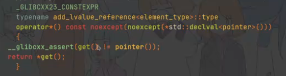

### 未定义行为

未定义行为是指在某些情况下，程序的行为是不可预测的，并且没有一个明确的结果或执行方式。编译器不需要对未定义行为进行检查，也不需要提供任何错误信息。未定义行为的结果可能因编译器、编译选项、操作系统、硬件平台等的不同而不同。

* **不可预测性**：未定义行为意味着程序的行为是不可预测的，这会导致难以调试和追踪的问题。

所有的编译器优化方法不同，这就会导致同一段代码在不同编译器可能结果都不同。但是，所有编译器都遵循C++标准，**也就是说只要你不存在未定义操作，那么编译器一定会输出正确的结果。**


### 调试模式

调试模式会自动的进行更多的未定义Assert，因此开启调试模式能够更清晰的获得代码运行时的未定义行为。


在g++中，开启调试模式的方式是

```c++
#define _GLIBCXX_DEBUG
```


在MSVC中开启的方式是

**启用调试信息**：确保编译时启用调试信息。可以在项目属性中设置：

- Configuration Properties -> C/C++ -> General -> Debug Information Format -> Program Database (/Zi)
- Configuration Properties -> Linker -> Debugging -> Generate Debug Info -> Yes (/DEBUG)

**启用运行时检查**：MSVC提供了运行时检查选项，可以检测常见的运行时错误。

- Configuration Properties -> C/C++ -> Code Generation -> Basic Runtime Checks -> Both (/RTC1)

**使用安全容器**：MSVC提供了“安全”的标准库容器（如`std::vector`、`std::array`等）的实现，这些容器在调试模式下会进行边界检查。

- 确保在Debug配置下编译代码。调试模式下，MSVC会自动启用一些额外的检查。


注意这两者的assert实现不一样，覆盖范围也不一致。


## 空指针类

### 1. 解引用空指针

```c++
#define _GLIBCXX_DEBUG
#include<iostream>
#include<memory>

int main(){
    std::unique_ptr<int> p=nullptr;
    std::cout << p.get() << std::endl;
    std::cout << &*p<< std::endl;
}
```

若是没有开启debug的话，第二个输出不受控制，会输出未定义值

开启了debug之后，第二个输出因为unique_ptr的断言中断(重载*，断言被解引用指针不能为pointer()，也就是空指针)




另外，因为这里是使用的运行时检测的库，我们也可以使用constexpr来让编译器在预编译阶段解读，而不使用运行时检测的库_GLIBCXX_DEBUG

```c++
constexpr void func(){
    std::unique_ptr<int> p=nullptr;
	// cout不是能够编译阶段处理的函数
    //std::cout << *p << std::endl;
    
    *p;
}

int main(){
   	func();
}
```


```c++
struct C{
    [[gnu::noinline]] void print(){
        if(this == nullptr)
        	std::cout << "没有被优化" << std::endl;
    }
    int x;
}
```

事实上,就算你直接在函数内部判断，编译器也会直接优化`this==nullptr`的情况，因为这种情况是不允许存在的。（不开优化才会执行，但是这已经是未定义行为范畴了）

> `[[gnu::noinline]]` 是一个 GCC 扩展属性，用于指示编译器**不要将标记的函数进行内联优化**。内联优化是一种将函数调用替换为函数体以减少函数调用开销的优化技术。使用 `[[gnu::noinline]]` 可以强制编译器保留函数调用，而不是进行内联。


### 2. 解引用end iterator

```c++
#define _GLICXX_DEBUG
#include<iostream>
#include<vector>

void process(int *begin, int *end){
    for(int *p = begin; p!= end;++p){
        std::cout << *p << std::endl;
    }
}

int main(){
    std::vector<int> a={1,2,3};
    int *begin = &*a.begin();
    int *end()=&*a.end();
    process(begin,end);
}
```

end通常指向最后一个数据后面的一个位置，这个位置编译器认为是空的（未定义的）

虽然处理器可以支持进程任意地址的访问，但是编译器是会为这个未定义地址提交assert的。


如果你非要读到这个位置，最好使用纯指针操作

```c++
std::vector<int> v = {1, 2, 3, 4};
int *begin = v.data();
int *end = v.data() + v.size();
```


### 3. `this`不能为空

```c++
struct C{
	void print(){
        this->x = 1;
    }
    int x;
}

constexpr void func(){
    C *c = nullptr;
    c->print();
}

int main(){
    func();
}
```

这里因为this指针为`nullptr`，所以`this->x`肯定是未定义行为。


```c++
struct C{
	void print(){
        
    }
    int x;
}

constexpr void func(){
    C *c = nullptr;
    c->print();//(*c).print()
}

int main(){
    func();
}
```

这里虽然print没有使用`this`指针，但是`c->print()`这一步本身就是`(*c).print()`，因此也违反了不能解引用空指针的规则。


## 指针别名类

### 4. 指针类型强转

首先，强转`(float*)&a`和`reinterpret_cast`作用是一样的

```c++
int i;
float f = *(float *)&i; // 错！
*(int *)(uintptr_t)&i;  // 可以
```

这里，int和float**内存布局和表示是不一致**的，因此不能**对指针强转**

但是`f = (float)i`是可行的，因为这是将内存布局也转换了


`int`和`uintptr_t`因为内存布局一致/兼容，因此可以使用。


> char 和unsigned char总是兼容任何类型,主要是因为其是**字节表示，因此可以逐字节访问和修改对象的存储表示。**
>
> 根据C++标准（ISO/IEC 14882:2017，第6.9.2节），`char`和`unsigned char`可以访问任何对象的字节表示。这意味着可以通过指向任何对象的`char`指针或`unsigned char`指针来操作该对象的存储。

```c++
int main() {
    int i = 42;
    char *buf = (char *)&i;

    std::cout << "Initial int value: " << i << std::endl;

    // 修改i的字节表示
    buf[0] = 1; // 只修改第一个字节

    std::cout << "Modified int value: " << i << std::endl;

    // 使用memcpy将i复制到一个新的int变量
    int j;
    std::memcpy(&j, buf, sizeof(int));

    std::cout << "Copied int value: " << j << std::endl;

    return 0;
}
```


### 5. `union`访问未激活成员

`union`允许在相同的内存位置存储不同类型的数据。一个联合体变量的大小等于它最大成员的大小。由于所有成员共用同一块内存，因此在任何时刻，联合体只能存储其中一个成员的值。

```c++
union MyUnion {
    int i;
    float f;
    char c;
};

```


#### 未定义

```c++
float bitCast(int i) {
    union {
        int i;
        float f;
    } u;
    u.i = i;        // 激活了成员 i
    return u.f;     // 错误！未定义行为，因为 f 不是当前激活的成员
    //重新解释位模式为float
}

```

在这个例子中，将整数 `i` 赋值给联合体 `u` 的成员 `i`，然后试图读取联合体的成员 `f`。这在 C++ 标准中被视为未定义行为，因为在这种情况下，只能读取当前激活的成员。

> 当你将一个联合体的成员赋值为某个值，并访问另一个不同类型的成员时，你实际上是对同一块内存的位模式进行重新解释，这种操作可以被称为位级别的转换。

**这里的未定义指的是“访问未激活成员行为本身”，而不是对内存重新解释。**

因为标准规定你只能读取当前激活的成员。


#### 重新解释的合法行为

##### `memcpy`

```c++
#include <cstring> // for std::memcpy
#include <iostream>

float bitCast(int i) {
    union {
        int i;
        float f;
    } u;
    u.i = i;        // 激活了成员 i 
    float f;
    std::memcpy(&f, &u.i, sizeof(i)); // 按字节复制内存
    return f;
}

int main() {
    int i = 42;
    float f = bitCast(i);
    std::cout << "Bit-casted float: " << f << std::endl;
    return 0;
}

```

这里我们使用**位级别的复制**，但是用float重新解释。会输出与int不同的数值结果。

> **Memcpy按位复制**：
>
> **前提条件**：两个类型的大小必须相同。通常在大多数平台上 `int` 和 `float` 的大小都是 4 字节（32 位），但这不是在所有平台上都一定成立。如果大小不一致，`memcpy` 可能会导致内存越界访问或数据截断问题。
>
>  memcpy 内部被认为是以 char 指针访问的，char 总是兼容任何类型
>
> **数据解释**：
>
> - `int` 和 `float` 的内存布局和表示方式不同。`int` 是一个整数表示，而 `float` 是一个符合 IEEE 754 标准的浮点数表示，包括符号位、指数位和尾数位。
> - 将 `int` 的位级别表示直接复制到 `float` 中，然后以 `float` 的方式解释这些位，可能会得到一个非常不同的数值结果。具体的结果取决于 `int` 的具体值及其在内存中的二进制表示。


##### c++20 `std::bit_cast`

`std::bit_cast` 提供了一种标准化的方式来执行这种位级别的类型转换，并确保类型大小一致。其实底层依赖于memcpy，加入了可行性检查。

```c++
#include <bit> // for std::bit_cast
#include <iostream>

float bitCast(int i) {
    return std::bit_cast<float>(i); // 位级别转换
}

int main() {
    int i = 42;
    float f = bitCast(i);
    std::cout << "Bit-casted float: " << f << std::endl;
    return 0;
}

```

`std::bit_cast` 在编译时会检查两个类型的大小是否一致，并且它的行为是标准定义的。


## 算术类

### 7. 有符号溢出（+，-，*，/）

在 C++ 中，**有符号整数的溢出是未定义行为**。但是，如果你希望使用溢出的行为，并且想要确保这种行为是定义明确的，可以使用无符号整数。无符号整数的溢出在 C++ 中是良定义的（defined behavior），即它会按模运算（wrap around）处理。因此，通过将有符号整数转换为无符号整数进行溢出计算，再将结果转换回有符号整数，是一种常见且安全的方式。

```c++
#include <iostream>
#include <climits>

int main() {
    int y = INT_MAX;
    int x = y+1;//未定义
    
    unsigned int uy = static_cast<unsigned int>(y);
    unsigned int ux = uy + 1;  // 这是定义明确的，按模运算处理
    int x = static_cast<int>(ux);


    return 0;
}
```


为什么会有这种规定呢，主要是编译器为了优化类似

```c++
(x+x)/2=x
```

这种，因此将溢出统统定为未定义操作。


另一个例子是

```c++
for(int seed = 1;seed != 0; seed++);
```

```c++
for(unsignedint seed = 1;seed != 0; seed++);
```

前者理论上不是死循环（x86中承认有回环），但是编译器认为溢出是未定义行为，因此直接判定为死循环，为了减少判定而优化为`while(1);`。注意，**这里不开优化的话（Debug模式）是可以正常运行的**

后者就可以正常的结束。


### 8. shift越界

```c++
constexpr int funcint(){
    return 1 << 32;
}

constexpr unsigned int funcuint(){
    return 1u << 32;
}
```

实际上都会报错，因为无论是有符号整数还是无符号整数，其移动溢出都是未定义行为。


### 9. 除0错误


## 函数类

### 10. 非void函数没有返回

返回类型不为 void 的函数，必须有 return 语句

坑人之处在于，忘记写，不会报错，编译器只是警告。

为了避免忘记写 return 语句，建议 gcc 编译器开启 `-Werror=return-type` 选项，将不写返回语句的警告转化为错误

> Werror代表任何警告都转为错误
>
> Werror=return-type代表return-type的警告转化为错误


### 11.函数指针被调用时，不能为空

函数指针是指向函数的指针，它允许你通过指针调用函数。函数指针在C和C++中是一种强大的工具，可以用于实现回调、事件处理、策略模式等。函数指针与普通指针类似，但它指向的是函数而不是数据。

```c++
#include <iostream>

// 定义一个函数指针类型，指向返回类型为 void，参数为 int 和 double 的函数
typedef void (*func_ptr_t)(int, double);

// 一个符合 func_ptr_t 类型的示例函数
void exampleFunction(int a, double b) {
    std::cout << "a: " << a << ", b: " << b << std::endl;
}

int main() {
    // 声明并初始化函数指针
    func_ptr_t ptr = exampleFunction;
    
    // 使用函数指针调用函数
    ptr(42, 3.14);      // 直接使用指针名调用函数
    (*ptr)(42, 3.14);   // 显式地解引用指针调用函数
    
    return 0;
}

```


**函数指针被调用时，不能为空**

```c++
typedef void (*func_t)();

func_t func = nullptr;
func();    // 错！
```


一个编译器优化未定义行为的导致错乱的展示

```c++
#include <cstdio>

static void func() {
    printf("func called\n");
}

typedef void (*func_t)();

static func_t fp = nullptr;

extern void set_fp() { // 导出符号，虽然没人调用，却影响了 clang 的优化决策
    fp = func;
}

int main() {
    fp(); // Release 时，clang 会把这一行直接优化成 func()
    return 0;
}
```

* `static void func()`：定义了一个静态函数 `func`，它只能在当前编译单元（translation unit）内可见。

* `static func_t fp = nullptr`：定义了一个静态函数指针 `fp`，初始值为 `nullptr`，同样只能在当前编译单元内可见。
* `extern void set_fp()`：定义了一个外部链接的函数 `set_fp`，可以被其他编译单元访问。虽然这个函数在当前编译单元内没有被调用，但它的存在会影响编译器的优化决策。
* `fp();`：在 `main` 函数中，通过 `fp` 调用函数。由于 `fp` 初始值为 `nullptr`，如果 `set_fp` 未被调用，**这里会导致未定义行为。**


使用clang时，编译器在优化过程中会尝试推断代码的行为，以便生成更高效的机器代码。在这个示例中，Clang 可能会做出以下优化推断：

* `fp`被调用的时候有如下几种情况
  * 外部有调用`set_fp`，此时fp=func
  * 外部未调用`set_fp`，此时未定义行为

留给编译器的只有一个合法行为和一个未定义行为，此时clang编译器脑洞大开，会直接优化成`fp=func`


## 生命周期类

### 12. 不能读取未初始化的变量

```c++
int i;
cout << i; // 错！

int i = 0;
cout << i; // 可以，会读到 0

int arr[10];
cout << arr[0]; // 错！

int arr[10] = {};
cout << arr[0]; // 可以，会读到 0
```


### 13. 指针的加减法不能超越数组边界

```c++
int arr[10];
int *p = &arr[0];
p + 1;     // 可以
p + 11;    // 错！
```


### 14. 可以有指向数组尾部的指针（类似 end 迭代器），但不能解引用

```c++
int arr[10];
int *p = &arr[0];
int *end = p + 10; // 可以
*end;              // 错！
```


### 15. 不能访问未初始化的指针

```c++
int *p;
*p; // 错！
```


```c++
struct Dog {
    int age;
};

struct Person {
    Dog *dog;
};

Person *p = new Person;
cout << p->dog->age; // 错！

p->dog = new Dog;
cout << p->dog->age; // 可以
```


### 16. 不能访问已释放的内存

```c++
int *p = new int;
*p; // 可以
delete p;
*p; // 错！
```


```c++
int *p = (int *)malloc(sizeof(int));
*p; // 可以
free(p);
*p; // 错！
```


```c++
int *func() {
    int arr[10];
    return arr; // 错！
}

int main() {
    int *p = func();
    p[0];  // 错！arr 已经析构，不能通过空悬指针 / 空悬引用继续访问已经析构的对象
}
```


### 17. 可以改用更安全的 array 或 vector 容器

```c++
array<int, 10> func() {
    array<int, 10> arr;
    return arr;
}

int main() {
    auto arr = func();
    arr[0];  // 可以，访问到的是 main 函数局部变量 arr，是对 func 中原 arr 的一份拷贝
}
```


### 17. new / new[] / malloc 和 delete / delete[] / free 必须匹配

```
int *p = new int;
free(p);  // 错！
```


```
int *p = (int *)malloc(sizeof(int));
free(p);  // 正确
```


```
int *p = new int[3];
delete p; // 错！
```


```
int *p = new int[3];
delete[] p; // 正确
```


```
vector<int> a(3);
unique_ptr<int> a = make_unique<int>(42);
```


### 18. 不要访问已经析构的对象

```
struct C {
    int i;
    ~C() { i = 0; }
};

C *c = (C *)malloc(sizeof(C));
cout << c->i; // 可以
c->~C();
cout << c->i; // 错！
free(c);
```


```
std::string func() {
    std::string s = "hello";
    std::string s2 = std::move(s);
    return s;  // 语言：OK，标准库作者：s 不一定是空字符串
}
```


## 库函数类

### 19. ctype.h 中一系列函数的字符参数，必须在 0~127 范围内（即只支持 ASCII 字符）

```c++
isdigit('0');    // 可以，返回 true
isdigit('a');    // 可以，返回 false
isdigit('\xef'); // 错！结果未定义，在 MSVC 的 Debug 模式下会产生断言异常

char s[] = "你好A"; // UTF-8 编码的中文
// "你好a"？
std::transform(std::begin(s), std::end(s), std::begin(s), ::tolower); // 错！结果未定义，因为 UTF-8 编码会产生大于 128 的字节
```


MSVC STL 中 is 系列函数的断言：

```
assert(-1 <= c && c < 256);
```

理论上可以这样断言：

```
assert(0 <= c && c <= 127);
```

解决方法：要么改用 iswdigit（MSVC：0-65536，GCC：0-0x010ffff）

```
iswdigit('0');       // 可以，返回 true
iswdigit('\xef');    // 可以，返回 false
iswspace(L'\ufeff'); // 可以，UTF-8 locale 时返回 true，ASCII locale 时返回 false
```


要么自己实现判断

```
if ('0' <= c && c <= '9')  // 代替 isdigit(c)
if (strchr(" \n\t\r", c))  // 代替 isspace(c)
```


### 20. memcpy 函数的 src 和 dst 不能为空指针

```
void *dst = nullptr;
void *src = nullptr;
size_t size = 0;
memcpy(dst, src, size); // 错！即使 size 为 0，src 和 dst 也不能为空指针
```


### 21. 可以给 size 加个判断

```
void *dst = nullptr;
void *src = nullptr;
size_t size = 0;
if (size != 0) // 可以
    memcpy(dst, src, size);
```


### 22. memcpy 不能接受带有重叠的 src 和 dst

```
char arr[10];
memcpy(arr, arr + 1, 9); // 错！有的同学，以为这个是对的？错了，memcpy 的 src 和 dst
memcpy(arr + 1, arr, 9); // 错！
memcpy(arr + 5, arr, 5); // 可以
memcpy(arr, arr + 5, 5); // 可以
```


如需拷贝带重复区间的内存，可以用 memmove

```
char arr[10];
memmove(arr, arr + 1, 9); // 可以
memmove(arr + 1, arr, 9); // 可以
memmove(arr + 5, arr, 5); // 可以
memmove(arr, arr + 5, 5); // 可以
```


从 memcpy 的 src 和 dst 指针参数是 restrict 修饰的，而 memmove 没有，就可以看出来，memcpy 不允许任何形式的指针重叠，无论先后顺序

### 23. v.back() 当 v 为空时是未定义行为

```
std::vector<int> v = {};
int i = v.back();                  // 错！back() 并不会对 v 是否有最后一个元素做检查，此处相当于解引用了越界的指针
int i = v.empty() ? 0 : v.back();  // 更安全，当 v 为空时返回 0
```


### 24. vector 的 operator[] 当 i 越界时，是未定义行为

```
std::vector<int> v = { 1, 2, 3 };
v[3]; // 错！相当于解引用了越界的指针
```


可以用 at 成员函数

```
std::vector<int> v = { 1, 2, 3 };
v.at(3); // 安全，会检测到越界，抛出 std::out_of_range 异常
```


### 25. 容器迭代器失效

```
std::vector<int> v = { 1, 2, 3 };
auto it = v.begin();
v.push_back(4); // push_back 可能导致扩容，会使之前保存的 v.begin() 迭代器失效
*it = 0;        // 错！
```


如果不需要连续内存，可以改用分段内存的 deque 容器，其可以保证元素不被移动，迭代器不失效。

```
std::deque<int> v = { 1, 2, 3 };
auto it = v.begin();
v.push_back(4); // deque 的 push_back 不会导致迭代器失效
*it = 0;        // 可以
```


- https://www.geeksforgeeks.org/iterator-invalidation-cpp
- https://en.cppreference.com/w/cpp/container


## 多线程类

### 26. 容器元素引用失效

```
std::vector<int> v = {1, 2, 3};
int &ref = v[0];
v.push_back(4); // push_back 可能导致扩容，使元素全部移动到了新的一段内存，会使之前保存的 ref 引用失效
ref = 0;        // 错！
```


如果不需要连续内存，可以改用分段内存的 deque 容器，其可以保证元素不被移动，引用不失效。

```
std::deque<int> v = {1, 2, 3};
int &ref = v[0];
v.push_back(4); // deque 的 push_back 不会导致元素移动，使引用失效
ref = 0;        // 可以
```


### 27. 多个线程访问同一个对象，其中至少一个线程是写访问，是未定义行为（俗称数据竞争）

```
std::string s;

void t1() {
    s.push_back('a'); // 写访问，出错！
}

void t2() {
    cout << s.size(); // 读访问
}
```


```
std::string s;

void t1() {
    s.push_back('a'); // 写访问，出错！
}

void t2() {
    s.push_back('b'); // 写访问，出错！
}
```


### 28. 多个线程同时对两个 mutex 上锁，但顺序相反，会产生未定义行为（俗称死锁）

```
std::mutex m1, m2;

void t1() {
    m1.lock();
    m2.lock(); // 错！
    m2.unlock();
    m1.unlock();
}

void t2() {
    m2.lock();
    m1.lock(); // 错！
    m1.unlock();
    m2.unlock();
}
```


解决方法：不要在多个 mutex 上同时上锁，如果确实要多个 mutex，保证顺序一致

```
std::mutex m1, m2;

void t1() {
    m1.lock();
    m2.lock();
    m2.unlock();
    m1.unlock();
}

void t2() {
    m1.lock();
    m2.lock();
    m2.unlock();
    m1.unlock();
}
```


或使用 std::lock

```
std::mutex m1, m2;

void t1() {
    std::lock(m1, m2);
    std::unlock(m1, m2);
}

void t2() {
    std::lock(m2, m1);
    std::unlock(m2, m1);
}
```


1. 对于非 recursive_mutex，同一个线程对同一个 mutex 重复上锁，会产生未定义行为（俗称递归死锁）

```
std::mutex m;

void t1() {
    m.lock();
    m.lock();     // 错！
    m.try_lock(); // 错！try_lock 也不允许！
    m.unlock();
    m.unlock();
}

void t2() {
    m.try_lock(); // 可以
}
```


解决方法：改用 recursive_mutex，或使用适当的条件变量

```
std::recursive_mutex m;

void t1() {
    m.lock();
    m.lock(); // 可以
    m.try_lock(); // 可以，返回 true
    m.unlock();
    m.unlock();
    m.unlock();
}
```


