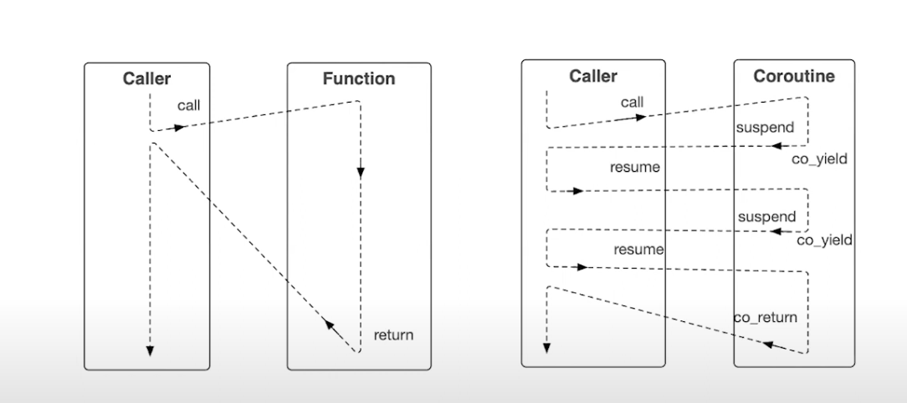
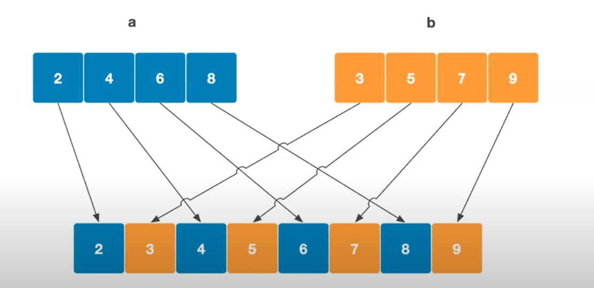

> https://www.youtube.com/watch?v=8sEe-4tig_A



suspend by `co_yeild` or `co_await`

Defference between Functions(shown as left) and Coroutine is that coroutine execute parts of its instructions and return or suspend while meet co_return;

This allows u load data into coroutine or get data our from a running coroutine;


There is two implementations of coroutine, stack-full or stack-less. C++ standard library choose stack-less coroutine implementation, which means instead of maintenance coroutine frame in stack, it uses the heap.


## Interacting with a coroutine

`co_yield` or `co_await` pause a coroutine

`co_return` ends a coroutine


## Elements of coroutine


## Coroutine chat

```c++
Chat Fun()								// Wrapper type chat containing the promise type
{	
	co_yield "Hello!\n"s;   			// Calls promise_type.yield_value
    std::cout << co_await std::string{};// Calls promise_type.await_transform
    cp_return "Here!\n"s;				// Calls promise_type.return value
}


void Use(){
    Chat chat = Fun(); 					// Creation of the coroutine
    std::cout << chat.listen();			// Trigger the machine
    chat.answer("Where are you?\n"s);	// Send data into the coroutine
    std::cout << chat.listen();			// Wait for more data from the coroutine
    
}
```

```c++
struct promise_type{
    std::string _msgOut{}, _msgIn{};			//Storing a value from or for the coroutine
    void unhandled_exception() noexcept {}		// What to do in case of an exception
   	Chat get_return_object(){					// Coroutine creation
        return Chat{this};
    }
    
    std::suspend_always initial_suspend() noexcept {	// start up
        return{};
    }
    std::suspend_always yield_value(std::string msg) noexcept{	// Value from co_yield
        _msgOut = std::move(msg);
    }
    
    auto await_transform(std::string) noexcept{			// Value from co_await
        struct awaiter{						// Customized version instead of using suspend_never
           	promise_type& pt;
            constexpr bool await_ready() const noexcept{
                return true;
            }
            
            std::string await_resume() const noexcept{
                return std::move(pt._msgIn);
            }
            void await_suspend(std::coroutine_handle<>) const noexcept{}
            
        };
        
        return awaiter{*this};      
    }
    
    void return_value(std::string msg) noexcept{	// value from co_return
        _msgOut = std::move(msg);
    }
    
    std::suspend_always final_suspend() noexcept{	// ending
        return {};
    }
    
}
```

```c++
struct Chat{
    #include "promise-type.h"
    using Handle = std::coroutine_handle<promise_type>; // Shorcut for the handle type
    
    Handle mCoroHdl{};
    
    explicit Chat(promise_type* p) 		// Get the handle form the promise
        : mCoroHdl{std::exchange(rhs.mCoroHdl, nullptr)}
    	{
            
        }
    
    Chat(Chat&& rhs) 				// Move only
        : mCoroHdl{std::exchange(rhs.mCoroHdl,nullptr)}{
            
        }
    
    ~Chat()	
    {
        if(mCoroHdl)
        {
            mCoroHdl.destroy();
        }
    }
    
    std::string listen()
    {
        if(not mCoroHdl.done()){
            mCoroHdl.resume();
        }
        return std::move(mCoroHdl.promise()._msgOut);
    }
    
    void answer(std::string msg)
    {
        mCoroHdl.promise()._msgIn = msg;
        if(not mCoroHdl.done()){
            mCoroHdl.resume();
        }
    }
};
```


## Interleaving two std::vectors



```c++
// Make sure the lifetime of value u passed into Generator is longer than Generator's lifetime when pass by reference
// A easy way to handle this is pass by value
Generator interleaved(std::vector<int> a, std::vector<int> b){
    auto lamb = [](std::vector<int>& v)->Generator{
      for(const auto& e:v){co_yield e;}  
    };
    
    auto x = lamb(a);
    auto y = lamb(b);
    
    while(not x.finished() or not y.finished()){
        if(not x.finished()){
            co_yield x.value();
            x.resume();
        }
        
        if(not y.finished()){
            co_yield y.value();
            y.resume();
        }
    }
   	
}
```

```c++
struct promise_type{
    // value we want to pull out from coroutine
    int _val{};
    
    Generator 	get_return_object(){
        return Generator{this};
    }
    
    std::suspend_never initial_suspend() noexcept{
        return {};
    }
    
    
    std::suspend_always final_suspend() noexcept{
        return {};
    }
    
    
    std::suspend_always yield_value(int v){
        _val = v;
        return {};
    }
    
    void unhandled_exception(){
        
    }
};
```

```c++
struct Generator{
    using Handle = std::coroutine_handle<promise_type>;
    Handle mCoroHdl{};
    
    explicit Generator(promise_type* p)
        : mCoroHdl{Handle::from_promise(*p)}
    {
        
    }
    
    // automatically disables copy operations
    
    Generator(Generator&& rhs)
        : mCoroHdl{std::exchange(rhs.mCoroHdl,nullptr)}
    {
        
    }
    
    ~Generator()
    {
        if(mCoroHdl)
        {
            mCoroHdl.destroy();
        }
    }
    
    int value() const 
    {
        return mCoroHdl.promise()._val;
    }
    
    bool finished() const 
    {
        return mCoroHdl.done();
    }
    
    void resume(){
        if(not finished()){
            mCoroHdl.resume();
        }
    }
};
```

```c++
void Use(){
    std::vector a{2,4,5,8};
    std::vector b{3,4,7,9};
    
    Generator g{interleaved(std::move(a),std::move(b))};
    
    
    while(not g.finished()){
        std::cout << g.value() << '\n';
        
        g.resume();
    }
}
```


Next is adding support for range-based for loops et. al.

* we need an iterator which fullfils the iterator-concept: equal, comparable, incrementable, dereferenceable
* This type is declared inside Generator, but you are free to write a more general version

```c++
struct sentinel {};

struct iterator{
    Handle mCoroHdl {};
    
    bool operator==(sentinel) const
    {
        return mCoroHdl.done();
    }
    
    iterator& operator++()
    {
    	mCoroHdl.resume();
        return *this;
    }
    
    const int operator*() const
    {
        return mCoroHdl.promise()._val;
    }
};
```

Therefore , the `Generator` can be changed to

```c++
struct Generator{
    //...
    
    iterator begin() {return {mCoroHdl};}
    sentinel end(){return {};}
}
```

The usage can be changed to 

```c++
std::vector a{2,4,6,8};
std::vector b{3,5,7,9};

Generator g{interleaved(std::move(a), std::move(b))};

for(const auto& e : g){
    std::cout << e << '\n';
}
```


## Scheduling multiple tasks

### A common way with parameters

```c++
void Use(){
    Scheduler scheduler{};
    
    taskA(scheduler);
    taskB(scheduler);
    
    while(scheduler.schedule()){}
}
```

```c++
Task taskA(Scheduler& sched){
    std::cout << "Hello, from task A\n" ;
    
    co_await sched.suspend();
    
    std::cout << "a is back doing work\n";
    
    co_await sched.suspend();
    
    std::cout << "a is back doing more work\n";
}


Task taskB(Scheduler& sched){
    std::cout << "Hello, from task B\n" ;
    
    co_await sched.suspend();
    
    std::cout << "b is back doing work\n";
    
    co_await sched.suspend();
    
    std::cout << "b is back doing more work\n";
}
```

```c++
struct Scheduler{
    std::list<std::coroutine_handle<>> _tasks{};
    
    bool schedule(){
        auto task = _tasks.front();
        _tasks.pop_front();
        if(not task.done()){
            task.resume();
        }
        
        return not _tasks.empty();
    }
    
    
    auto suspend(){
        struct awaiter : std::suspend_always{
            Scheduler& _sched;
            
            explicit awaiter(Scheduler& sched) : _sched{sched}{}
            
            void await_suspend(std::coroutine_handle<> coro) const noexcept{
                _sched._tasks.push_back(coro);
            }
            
        };
        
        return awaiter{*this};
    }
}
```

```c++
struct Task{
    struct promise_type{ // why this promise_type is so short
        Task get_return_object(){return {};}
        
        std::suspend_never initial_suspend() noexcept {return {};}
        
        std::suspend_never final_suspend() noexcept {return {};}
        
        void unhandled_exception() {}
    };
};
```


### An alternative way with no parameters

```c++
void Use(){
    // no parameter transferred to task
    taskA();
    taskB();
    
    while(gScheduler.schedule()){}// a global scheduler existing
}
```

```c++
Task taskA(Scheduler& sched){
    std::cout << "Hello, from task A\n" ;
    // calling co_await on a new ojbect self constructed
    co_await suspend{};
    
    std::cout << "a is back doing work\n";
    
    co_await suspend{};
    
    std::cout << "a is back doing more work\n";
}


Task taskB(Scheduler& sched){
    std::cout << "Hello, from task B\n" ;
    
    co_await suspend{};
    
    std::cout << "b is back doing work\n";
    
    co_await suspend{};
    
    std::cout << "b is back doing more work\n";
}
```

```c++
struct Scheduler{
    std::list<std::coroutine_handle<>> _tasks{};
    
    void suspend(std::coroutine_handle<> coro){_tasks.push_back(coro);}
    
    bool schedule(){
        auto task = _tasks.front();
        
        _tasks.pop_front();
        
        if(not task.done()){
            task.resume();
        }
        
        return not _tasks.empty();
    }
};
```

```c++
static Scheduler gScheduler{};

struct suspend{
    auto operator co_await()
    {
        struct awaiter : std::suspend_always{
            void await_suspend(std::coroutine_handle<> coro) const noexcept {gScheduler.suspend(coro);}
        };
        return awaiter{};
    }
};
```


