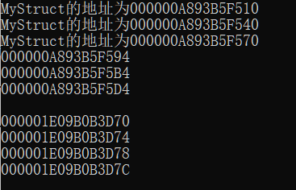
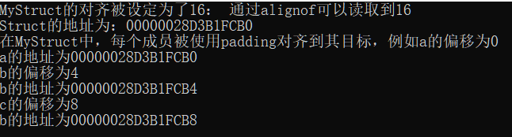
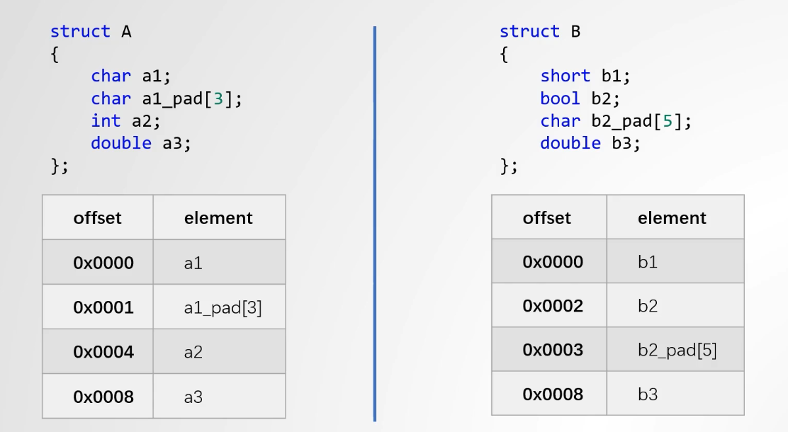

## 关键字 `alignas`，`alignof`

C++11引入，常用于指定一个类型或对象(type or object)的对齐要求

`alignas` 关键字用于指定一个变量或数据结构在内存中的对齐方式。如果一个数据类型的自然对齐要求没有达到指定的 `alignas` 对齐要求，编译器会自动添加填充（padding）来确保数据对齐。这种对齐是为了提高内存访问的效率，特别是在与硬件操作相关的应用程序中，正确的数据对齐可以显著提高性能。例如，如果使用 `alignas(16)` 为某个结构体指定对齐，编译器将确保这个结构体的每个实例都在16字节的边界上开始，必要时会添加填充字节来达到这一要求。

==如果一个类型需要 `n` 字节对齐，那么它的内存起始地址应该是 `n` 的倍数。==

正确的数据对齐可以减少CPU缓存未命中的次数，提高缓存利用率，从而加速数据的处理速度。在C++中，`alignas` 关键字用于显式指定变量或类型的最小对齐要求。通常cache_line是128字节大小

==注意，`alignas`指定的对齐必须是2的幂次==


**alignof通常用来获取这个数据已经被设定的对齐大小**,==alignof不能使用在对象上==

```c++
int a = 0;
struct MyStruct{
    int a;
}
MyStruct test;
alignof(int);//可以使用
alignof(MyStruct);//可以使用
alignof(a);//不能使用，这是一个实例对象
alignof(test);//不能使用，这是一个实例对象
```


举例来说， 

```c++
# include<iostream>
# include <cstddef>

using namespace std;
struct alignas(16) MyStruct {
    char a;        // 默认对齐为1
    int b;         // 默认对齐为4
    double c;      // 默认对齐为8
};

int main() {
    MyStruct test1,test2,test3;
    cout << "MyStruct的地址为" << &test1 << endl;
    cout << "MyStruct的地址为" << &test2 << endl;
    cout << "MyStruct的地址为" << &test3 << endl;

    int a, b, c;
    int* d = (int*)malloc(sizeof(int) * 4);
    cout << &a << endl << &b << endl << &c << endl << endl;
    cout << d << endl << &d[1] << endl << &d[2] << endl << &d[3] << endl;
}

```

首先，对齐为16的Mystruct明显地址上开头都在16的倍数上(最后一位为0)

其次，以int为例，所有被生成的值都是在4的倍数上




## `offsetof`

`offsetof` 是在 C 标准库头文件 `<stddef.h>` 中定义的宏，用于计算结构体中成员==相对于结构体开始位置的字节偏移量==。这个宏在需要精确管理数据结构字段在内存中的布局时非常重要，例如在硬件接口或符合特定协议格式的数据结构匹配中。使用 `offsetof` 可以得到结构体成员的偏移量，类型为 `size_t`。这在编程中帮助理解和应用复杂的内存布局是非常有用的。


## 结构体与其内的对齐规则

```c++
# include<iostream>
# include <cstddef>

using namespace std;
struct alignas(16) MyStruct {
    char a;        // 默认对齐为1
    int b;         // 默认对齐为4
    double c;      // 默认对齐为8
};

int main() {
    MyStruct test;

    cout << "MyStruct的对齐被设定为了16： 通过alignof可以读取到" << alignof(MyStruct) << endl;
    cout << "Struct的地址为：" << &test << endl;
    cout << "在MyStruct中，每个成员被使用padding对齐到其目标，例如a的偏移为" << offsetof(MyStruct, a) << endl;
    cout << "a的地址为" << static_cast<void*>(&test.a) << endl;//必须要转换为void*才能正确输出，暂时不知道为什么
    cout << "b的偏移为" << offsetof(MyStruct, b) << endl;
    cout << "b的地址为" << &test.b << endl;

    cout << "c的偏移为" << offsetof(MyStruct, c) << endl;
    cout << "b的地址为" << &test.c << endl;
}
```

从输出可以发现几点：

* struct头地址对齐16
* 每个成员通过添加padding来对齐到他们需要的地方，例如b的头地址本来应该为FCB1（考虑到a实际上只有一个字节），但是它会被对齐到alignof(int)的位置，因为a后面增加了三个padding。






## struct的对齐必须严格大于所有的成员

考虑这么一个情况，如果struct设置为4对齐，但是里面的成员是8对齐，就会存在一个可能性，这个struct开头需要额外填充4个padding来对齐，如果struct严格大于所有成员，那么实际上这种不必要的padding就会少很多，因为对齐都是严格需要为2的幂。

对于结构体的对齐要求，如果设定的对齐值小于其内部某个成员的对齐要求，那么在实际内存布局中，为了满足最大对齐要求的成员，可能需要在结构体开始处添加额外的填充。而如果结构体的对齐值大于等于内部所有成员的对齐要求，就不需要在结构体的开始处添加这种额外的填充。确保结构体的对齐值至少和最大的成员对齐值一致，可以使得整个结构体布局更加紧凑，减少不必要的内存空间浪费。对齐通常是2的幂次方是因为这样可以更容易地在多种系统中进行有效的内存访问和缓存管理。

==如果struct对齐长度小于其成员，那么struct设定的对齐会被忽略==


