来自cppcon

https://www.youtube.com/watch?v=HqsEHG0QJXU


##### 需要在头文件中完整定义

Template are usually **defined** in header file

* Not only declared
* No inline necessary

如果headfile只声明了template，会有一个link error

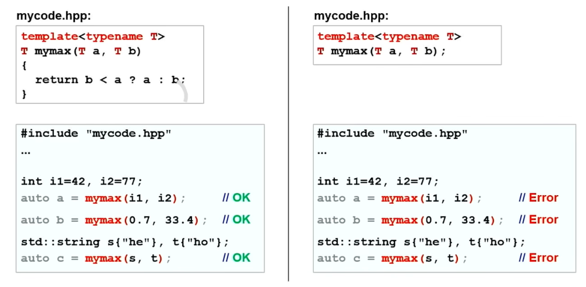


##### auto Parameter for Ordinary functions

自从C++20以来，允许参数类型以auto传入

这其实也是template的一种，只不过它虽然方便，但是并没有表面看起来这么好：如果你在函数内需要这个类型，你需要手动去询问传入参数的类型。


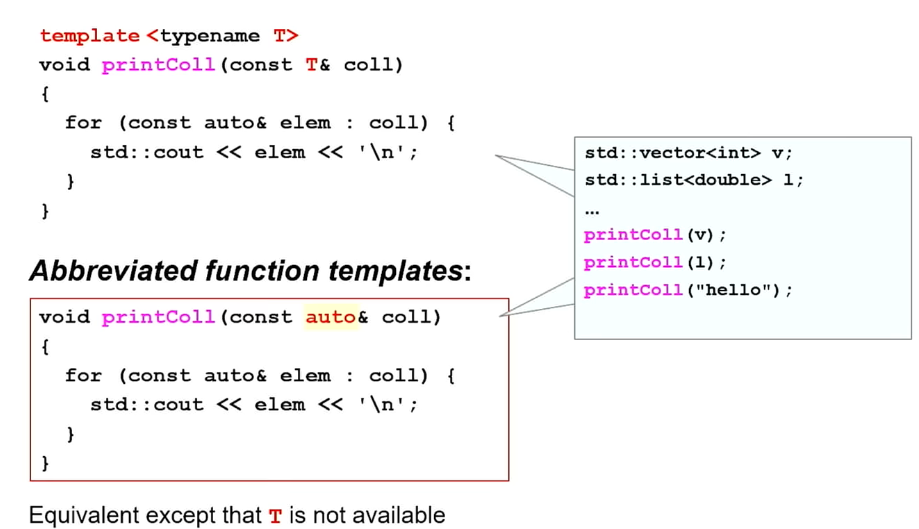


> 在 C++20 中引入的新特性，允许在普通函数参数中使用 `auto` 关键字，实际上是将这些函数隐式地转化为函数模板。
>
> ### 隐式函数模板
>
> 当你在函数参数中使用 `auto` 关键字时，如 `void function(auto input)`，这个函数实际上是一个模板函数，其行为类似于下面显式定义的模板：
>
> ```c++
> template<typename T>
> void function(T input) {
>     // 函数体
> }
> ```
>
> 这意味着，使用 `auto` 关键字的函数在被调用时会根据提供的参数类型自动实例化，这和传统的模板函数行为一致。
>
> ### 在头文件中的实现
>
> 由于这类函数实际上是模板，==它们通常需要在头文件中完全定义（实现），==以确保在编译时可以适当地实例化。这一点与传统的模板函数相同。如果你将这类函数的定义放在源文件中，那么编译器在处理其他源文件时可能无法访问到模板定义，导致链接错误。


> 另一个很容易和隐式函数模板混淆的其实是==返回类型推断==。
>
> 在 C++ 中，使用 `auto` 作为普通函数的返回类型并不是创建模板函数，但它是利用 C++11 后引入的尾返回类型（trailing return type）特性或者 C++14 的返回类型推导来使函数能够自动推导其返回类型。
>
> ### C++11 的尾返回类型
>
> 在 C++11 中，可以使用 `auto` 关键字配合 `->` 操作符来指定函数的返回类型，这通常用在返回类型依赖于函数参数的场景中。这样做的好处是在函数签名中就能明确知道返回类型，而不必等到函数体的实现。这种情况下，尾返回类型可以让代码更清晰：
>
> ```c++
> #include <type_traits>
> 
> template <typename T, typename U>
> auto add(T t, U u) -> decltype(t + u) {
>     return t + u;
> }
> ```
>
> ### C++14 的返回类型推导
>
> 从 C++14 开始，可以直接使用 `auto` 作为函数的返回类型，编译器将会自动推导返回类型，这类似于自动变量的类型推导。这使得编写函数变得更简洁，特别是当返回类型很复杂或难以手动指定时：
>
> ```c++
> #include <vector>
> 
> auto getVector() {
>     return std::vector<int>{1, 2, 3};
> }
> ```
>
> 在这里，`getVector` 函数的返回类型会被自动推导为 `std::vector<int>`。
>
> ### 是否需要在头文件中实现？
>
> 对于使用 `auto` 返回类型的函数，==它们不是模板函数==，除非显式地使用了模板参数。当你使用 `auto` 作为返回类型，而函数本身不是模板函数时，你可以在头文件中声明函数，在源文件中实现它，就像普通函数一样：
>
> ```c++
> // header.h
> auto getNumber() -> int;  // 尾返回类型声明
> 
> // source.cpp
> #include "header.h"
> 
> auto getNumber() -> int {
>     return 42;
> }
> ```
>
> 但如果函数是模板函数，或者其返回类型依赖于模板参数，那么通常需要在头文件中提供实现，这是因为编译器需要在模板实例化时看到完整的定义。


##### template中的隐式要求

==**写类模板时**==

考虑到你传入的类型可能是一个自定义类，那么你要好好注意你的函数实现是否和类相悖。

例如，如下的函数要求传入的T有两个性质：

* 能够进行比较
* copyable（无论是传入还是return都需要）

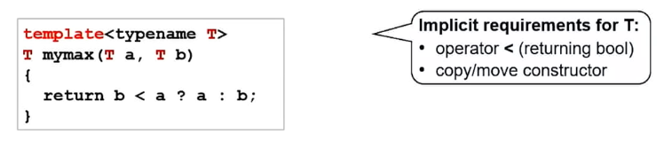

例如，假设complex类没有定义less than，因此会出现error


另一个例子是`std::atomic`

`std::atomic` 类型被设计用来提供原子操作，主要用于多线程编程中以确保对单个变量的操作是原子性的，即不可中断。由于它们的这种特殊性质和用途，`std::atomic` 对象具有一些限制，包括不能被拷贝构造、赋值、移动和比较。这些限制有助于避免在多线程环境中可能导致数据竞争和同步问题的操作。

```c++
atomic(const atomic&) = delete;
atomic& operator=(const atomic&) = delete;

atomic(atomic&&) = delete;
atomic& operator=(atomic&&) = delete;


/*

至于比较，C++20 之前的标准中并没有定义 std::atomic 类型的比较运算符。这是因为在多线程环境中，比较两个原子类型的值本身就可能面临竞态条件——两个值可能在比较的过程中被修改。C++20 引入了对原子类型进行比较的支持，但这需要显式地使用成员函数（如 load()）来获取当前的值，并在获取值的瞬间进行比较，而不是直接比较两个 std::atomic 对象。

*/
```


==**使用类模板时**==

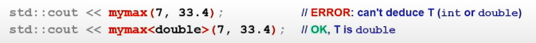

第一个无法自动推断，因为传入类型不同，你可以手动指定


##### C++20:Concepts in template

Concepts:To formulate formal constraints for generic code

考虑这么一个情况，你调用了一个template函数，传入了一个自定义的类。这个template函数又调用了其他函数，这么嵌套下去，可能在潜在的几万行代码中，有一个地方告诉你，你的传入class需要copyable或者支持lessthan ，否则会报错。此时，实际上，你会看着这个错误一脸懵逼，点进那个上古的文件中完全不知道这个错误在表达什么。

因此，C++20中引入了Concepts的概念，它显式的确定了模板函数对于模板的要求。


```c++
template<typename T>
concept SupportsLessThan = requires (T x){x < x;}

template<typename T>
requires std::copyable<T> && SupportsLessThan<T>
T mymax(T a, T b){
    return b < a ? a : b;
}
```

这里我们自定义了比较的concept：SupportLessThan，来规定了`mynax`模板函数需要可复制与可比较。

这里注意，concept定义中，右侧的`requires (T x){x < x;}`，这并不是 code we called， 而是 code we check，用来探索这个操作是否有效。如果定义了（重载了<)，那么就称为" This concept is satisfied"

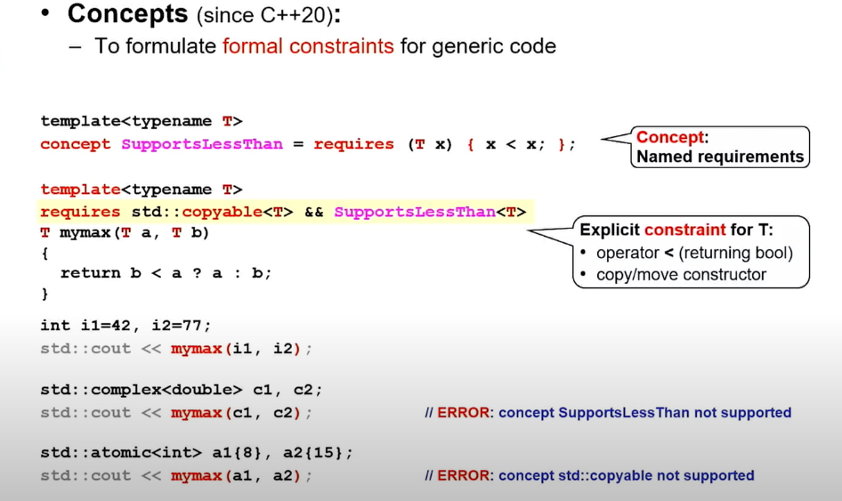

这个机制的作用就在于，如果你传入了不满足要求的参数，它不会进入template提醒你，它会直接在你调用时提醒你，传入参数缺少support。


##### 返回类型推断

考虑这么一个情况

```c++
template<typename T1, typename T2>
??? mymax(T1 a, T2 b){
    return b < a ? a : b;
}
```

在这个地方，传入了两个类型，这使得返回类型变得难以推断。

通常来说，C++编译器提供了一套自动的共同类型转换规则。

例如，如果输入是int，double，那么共同类型就是double，int就会自动转换为double


自从**C++14**，编译器允许你使用auto来直接让编译器替你推断

```c++
template<typename T1, typename T2>
auto mymax(T1 a, T2 b){
    return b < a ? a : b;
}
```

* Templates are usualyy a good application of return type auto
  - The type is always right
  - Better than gussing wrong


##### Class template

同样的，对于template class，也具有这个限制，你必须在头文件中实现，同时如果你不直接在template class中实现时，你需要显式的使用template<typename T>

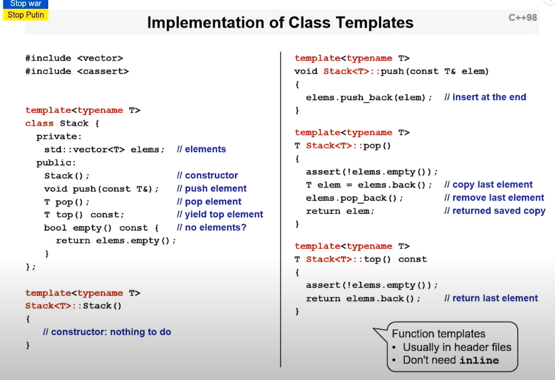

考虑一个新函数print，它增加了一个隐式要求：流重载。

此时，你传入的T如果没有流重载，你任然可以使用其他的函数，你只是不能使用print，也就是说这个隐式条件是一个optional support

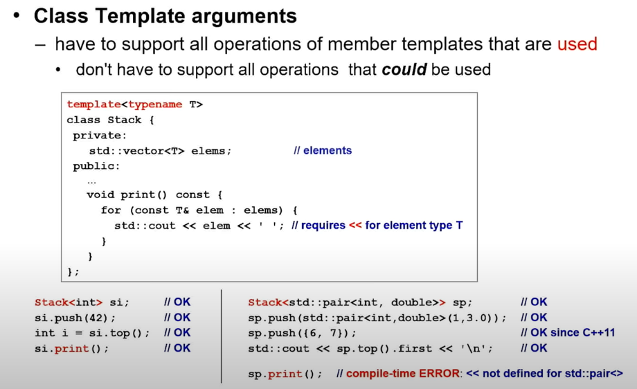

你可以在C++新feature很常见的看到这个表达”We have conditional support for some features"，就是这个意思。


**你也可以为特定的method施加requires**

在 ==C++20==中，你可以在模板类的成员函数定义中直接应用concept，以此来约束该函数适用的模板参数类型。这允许类模板在其其他成员函数上具有更广泛的适用性，同时对特定函数施加更具体的类型约束。

```c++
// MyClass.h
#include <concepts>  // Include the header for standard concepts

template<typename T>
class MyClass {
public:
    void doSomething() requires std::integral<T>; // Apply concept on this member function
};

// Implementation of the function can be in the header or source file.
template<typename T>
void MyClass<T>::doSomething() {
    // implementation
    // This implementation only compiles if T is an integral type
}
```

在这个例子中，`doSomething` 函数通过 `requires std::integral<T>` 语句指定了一个概念约束，要求模板参数 `T` 必须是一个整数类型。这意味着只有当 `T` 满足 `std::integral` 概念时，`doSomething` 方法才可用。


##### 模板的分离编译

- 尽管通常推荐在头文件中实现模板，但有些复杂的项目可能因为编译时间和项目结构的需求而需要尝试分离模板的声明和定义。这可以通过使用 `extern template` 声明和显式实例化结合来实现。

- 你可以在头文件中声明模板类和模板函数，并在一个源文件中定义它们。在另一个源文件中，通过 `extern template`

   声明告诉编译器这些模板的实例化将在其他地方进行：

  ```c++
  // MyClass.h
  template<typename T>
  class MyClass {
      void doSomething();
  };
  
  // MyClass.cpp
  template<typename T>
  void MyClass<T>::doSomething() {
      // implementation
  }
  
  // Explicit instantiation
  template class MyClass<int>;
  template class MyClass<double>;
  
  // OtherFile.cpp
  extern template class MyClass<int>;
  extern template class MyClass<double>;
  ```


##### 模板的输入参数推导

自==C++17==以来，支持了不用显式指定模板类型，而编译器自动deduce类型的情况。

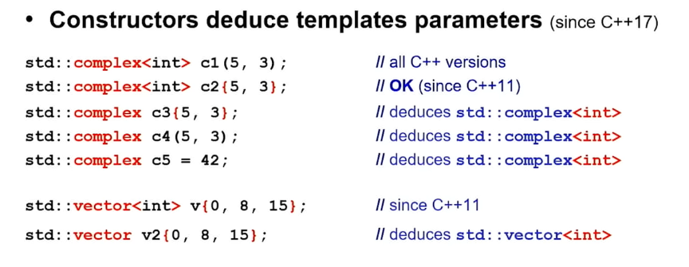


你可以通过上面的例子发现，container也支持类型deduce，但是这也引出了一些严重的问题-编译器该如何推断你输入的参数是使用哪个重载？（考虑到以前给定了参数类型，更好推断，现在的情况对编译器明显更复杂）

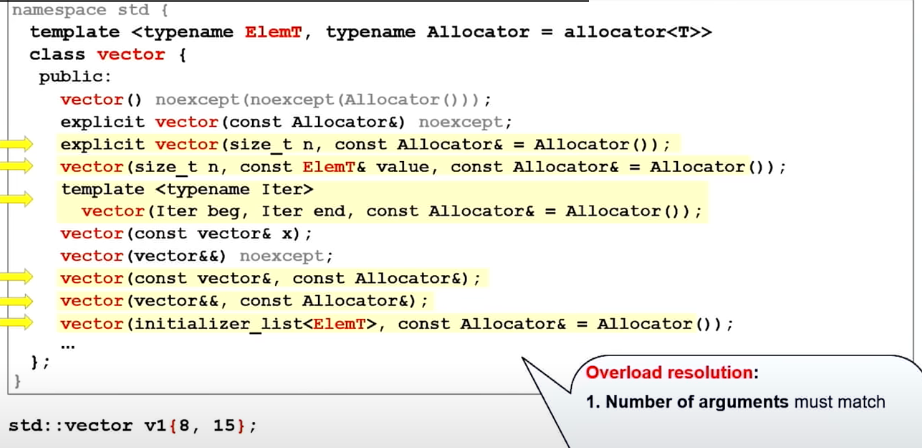

考虑这么一个情况，显然输入两个参数会使得所有仅需要两个参数的重载都会被考虑。


接着，我们考虑这些参数能够为int的情况，就剩下三个重载可能为目标了

* int不能被转换为allocator，这样就排除了三个
* 剩下的三个分别是
  * vector(8,15)
  * vector(iterator 8, iterator 15)：这里编译器并不知道iterator是什么，它只是认为这两个int也可以为typename iter的可能性是存在的。
  * vector{8,15}，{8,15}作为initializer传入（C++11）

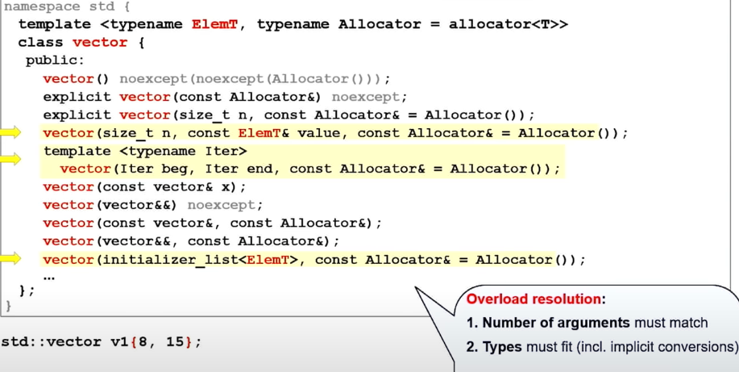

接下来，编译器会根据一些已经确定的规则选出哪一个重载fit best。

反正有一条rule就是，如果这个container有initializer输入，而你是使用{a,b,c}这种形式输入，那么选这个总是没错的

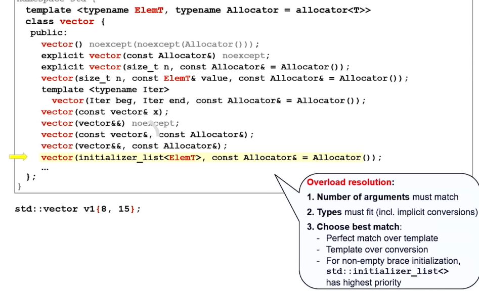

这个规则其实没有想象的这么好，因为如果你想将vector的一部分复制给另一个vector，那么问题就会出现，它会错误的deduce。

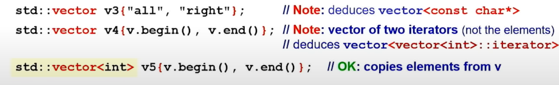


==因此，记住一个规则，除非这个deduction是十分明显的，不然不要使用deduction，事实上，你只应该在不得不使用deduction时使用==


##### NTTP:非类型模板参数

非类型模板参数（Non-Type Template Parameters, NTTP）是模板参数的一种，它不是一个类型，而是一个值。在C++模板编程中，模板参数可以是类型也可以是值，非类型模板参数就是后者。它们让你可以将常量值作为参数传递给模板，这些值在模板实例化时需要是已知的，并且在程序运行之前就确定下来。

**非类型模板参数的特点：**

1. **常量值**：非类型模板参数必须是一个常量表达式，这意味着它在编译时就必须有确定的值。
2. **受限的类型**：非类型模板参数的类型受限于整型、枚举、指向函数或对象的指针、引用、`std::nullptr_t`等。
3. **编译时决定**：非类型模板参数的值在编译时用于模板的实例化，并且这个值不能在运行时改变。
4. **模板实例化**：不同的非类型模板参数的值会导致模板的不同实例化。例如，`std::array<int, 5>` 和 `std::array<int, 10>` 是两个不同的类型，因为非类型模板参数的值不同。

**使用示例：**

这是一个使用非类型模板参数的简单例子：

```c++
template<typename T, size_t Size>
class StaticArray {
    T data[Size]; // Size 是一个非类型模板参数
public:
    T& operator[](size_t index) {
        return data[index];
    }
    // ... 其他成员函数 ...
};

StaticArray<int, 5> myArray; // 实例化一个整型数组，大小为 5
```

在这个例子中，`size_t Size` 是一个非类型模板参数，它定义了静态数组的大小。

**C++20中的改进：**

C++20增加了对非类型模板参数类型的支持，允许浮点数、类字面量以及 lambda 等更复杂的类型用作非类型模板参数。这些扩展开辟了模板编程的新领域，提供了更多的灵活性和表达能力。


1. **支持的 NTTP 类型（在 C++98/C++20 中）**：
   - 常量整数值类型（例如 `int`, `long`, `enum` 等）。
   - `std::nullptr_t` 类型（代表 `nullptr` 的类型）。
   - 指向全局可见对象、函数或成员的指针。
   - 指向对象或函数的左值引用。
2. **不支持作为 NTTP 的类型**：
   - 字符串字面值（直接作为模板参数）。
   - 类。
3. **C++20 新增支持的 NTTP 类型**：
   - 浮点类型（如 `float`, `double` 等）。
   - 具有公共成员的数据结构。
   - Lambda 表达式。

> 在 C++ 中，非类型模板参数 (NTTP) 允许你将值传递给模板，就像你将类型作为参数一样。以下是一些正确和错误的用法示例。
>
> ### 支持的 NTTP 类型的正确用法例子
>
> 1. **整数类型作为非类型模板参数**：
>
> ```c++
> template<int N>
> struct Array {
>     int data[N];
> };
> 
> Array<10> myArray; // 正确：使用整数作为非类型模板参数
> ```
>
> 1. **指针类型作为非类型模板参数**：
>
> ```c++
> int globalVar;
> 
> template<int* ptr>
> struct IntWrapper {
>     static void print() {
>         std::cout << "Value: " << *ptr << std::endl;
>     }
> };
> 
> IntWrapper<&globalVar> wrapper; // 正确：使用全局变量地址作为非类型模板参数
> ```
>
> 1. **浮点型（C++20 新增）**：
>
> ```c++
> template<double Value>
> struct Threshold {
>     static bool greaterThan(double val) {
>         return val > Value;
>     }
> };
> 
> Threshold<3.14> threshold; // 正确：C++20 允许使用浮点数作为非类型模板参数
> ```
>
> ### 不支持的 NTTP 类型的错误用法例子
>
> 1. **字符串字面值作为非类型模板参数**（不直接支持）：
>
> ```c++
> template<const char* str>
> struct Message {
>     static void print() {
>         std::cout << str << std::endl;
>     }
> };
> 
> const char* hello = "Hello, World!";
> // Message<hello> message; // 错误：字符串字面值不能直接作为非类型模板参数
> ```
>
> 1. **类作为非类型模板参数**：
>
> ```c++
> class MyClass {};
> 
> template<MyClass obj>
> struct Wrapper {
>     // ...
> };
> 
> // Wrapper<MyClass{}> wrapper; // 错误：类类型不能作为非类型模板参数
> ```
>
> 要正确使用字符串字面值或类作为模板参数，你可以使用它们作为类型模板参数，而不是非类型模板参数。下面是使用字符串作为类型模板参数的正确方法：
>
> ```c++
> template<typename T>
> struct Message {
>     T str;
>     static void print() {
>         std::cout << T::value << std::endl;
>     }
> };
> 
> struct Hello {
>     static constexpr const char* value = "Hello, World!";
> };
> 
> Message<Hello> message; // 正确：使用类的静态成员作为模板参数
> ```
>
> 在上面的例子中，我们定义了一个 `Hello` 结构体，它有一个静态成员 `value`，这个静态成员可以作为 `Message` 结构体模板的类型参数。这样绕过了字符串字面值作为非类型模板参数的限制。在 C++20 中，你也可以使用 `std::string_view` 或 `consteval` 函数来实现类似的功能。


##### 可变参数模板

Variadic templates 是 C++11 中引入的一项强大的语言特性，允许模板接受可变数量的模板参数，这使得编写能够接受任意数量和类型参数的通用函数和类成为可能。

在 C++11 之前，如果你想编写一个函数接受不同数量的参数，你需要重载这个函数多次或者使用函数参数列表（如 `printf` 的用法）。使用 variadic templates，你可以用一种更安全、类型安全的方式来编写这样的函数。

通常使用为

```c++
template<typename T, typename... Types>
void print(T firstArg, Types... args)
{
   
}
```

其中`typename... Types`代表任意个数个type，`Types... args`代表任意数量个属于Types的数

具体来说，

1. **`typename... Types`**： 这是模板参数包的声明，其中 `...` **表示零个或多个额外的类型参数可以被传递到模板中。**`typename` 关键字表示跟在后面的是类型而非值。这里的 `Types` 是一个占位符，实际在使用模板时，可以传递任意数量的任意类型，比如 `int, double, std::string` 等。
2. **`Types... args`**： 这是函数参数包的声明。`Types` 是上文中定义的类型参数包的名称。在函数参数中，`args` 表示一系列参数，每个都是前面声明的 `Types` 中的一种类型。在函数体内，你可以通过展开这个参数包 (`args...`) 来访问传递给函数的每个参数。


考虑这么一个例子，我们递归的调用print，它会首先将firstArg deduce为const char*，然后将types deduce为`{int, const char*}`，此时Types代表两种Type，args代表两个参数。

然后，我们将参数包作为参数调用print


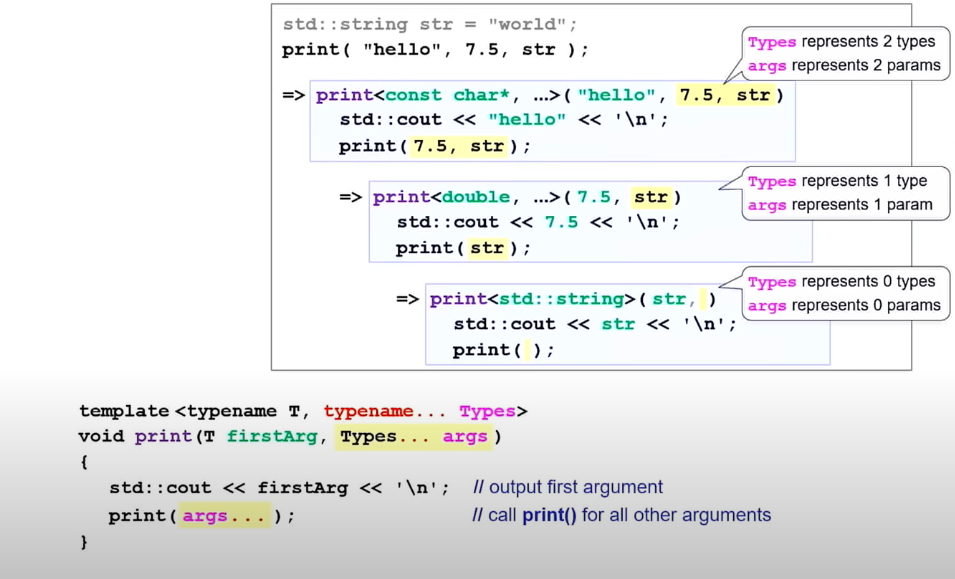

到最后，你会发现，传入的参数包为空，此时会抛出一个编译器错误，一个简单的做法就是增加一个这个函数

```c++
void print(){
    
}
```

这样就可以了。

这个方式可以方便的打印你传入的所有参数，它会被编译为

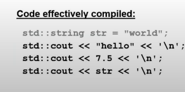


==你可以使用sizeof...来查询有多少个组件在一个打包中==

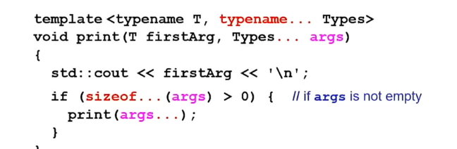

这段代码如果在我们没有使用`void print()`的情况下的话，会发生一个很隐蔽的错误

首先，明确一点，==一旦你知道了模板的类型，一个实例就已经被创建了，因此所有的代码都必须是有效的，即使它永远不会被执行==

在这个代码中，`if`是在runtime被调用，但是模板是在compile time被创建的，因此它也会最终创建一个args...为空的print(args...)调用，此时就会出现错误，找不到一个无输入的print function。

> Even if we never run print(args...) if args is empty, it's too late for compiler to see it.

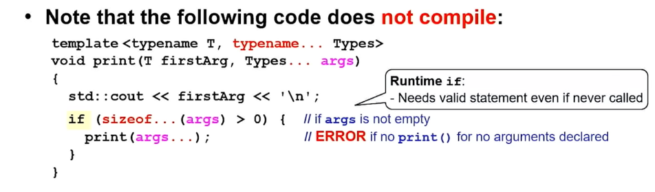


这就促成了C++17提出的==Compile time if==

编译器说我可以check 一下compile time时，if是否执行。这在泛型编程中十分常见。

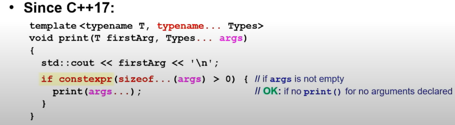

> * ### `constexpr` 变量
>
>   当你声明一个 `constexpr` 变量时，你告诉编译器这个变量的值是一个编译时常量。编译器会尝试验证这一声明，并确保变量的值在编译时就可以确定。
>
>   ```c++
>   constexpr int max_size = 100;  // 编译时常量
>   ```
>
>   ### `constexpr` 函数
>
>   `constexpr` 函数能在编译时对其参数进行计算，前提是所有的参数也都是编译时常量。如果用非常量参数调用 `constexpr` 函数，则函数会像普通函数一样在运行时执行。
>
>   ```c++
>   constexpr int add(int x, int y) {
>       return x + y;
>   }
>   
>   constexpr int sum = add(3, 4);  // 编译时计算
>   ```
>
>   `constexpr` 函数体内的所有操作都必须是编译时确定的，因此有一些限制，例如不能有循环、动态分配等。
>
>   ### `constexpr` 构造函数
>
>   类的构造函数也可以被声明为 `constexpr`。这使得该类的对象可以在编译时构造。这通常用于用户定义的字面量类型或用于模板元编程。
>
>   ```c++
>   class Point {
>   public:
>       constexpr Point(double xVal, double yVal) : x(xVal), y(yVal) {}
>       constexpr double getX() const { return x; }
>       constexpr double getY() const { return y; }
>   
>   private:
>       double x, y;
>   };
>   
>   constexpr Point origin(0.0, 0.0);
>   ```
>
>   ### `constexpr` 和 `const`
>
>   `constexpr` 比 `const` 更严格，`const` 变量可以在编译时或运行时初始化，但 `constexpr` 变量必须在编译时就能确定其值。
>
>   ###  C++17 中的 条件编译
>
>   C++14 放宽了对 `constexpr` 函数的限制，允许它们拥有更复杂的结构，包括局部变量和循环。C++17 进一步增加了对 `if constexpr` 的支持，允许在模板代码中根据模板参数进行条件编译。


##### Concepts to parameter:C++20

```c++
template<typename Coll, typename T>
void add(Coll& coll, const T& val){
    coll.push_back(val);
}

// auto deduction
void add(auto& coll, const auto& val){
    coll.push_back(val);
}
```

显然，这里的coll必须满足拥有push_back method

当然，你可以通过只是调用含有这个method的container来回避这个问题

```c++
std::vector<int> coll1;
add(coll1,42);//OK
```


好，我们考虑一个更复杂的情况，例如我们也需要对平衡树结构添加

```c++
void add(auto& coll, const auto& val){
    coll.push_back(val);
}

void add(auto& coll, const auto& val){
    coll.insert(val);
}


std::vector<int> coll1;
std::set<int> coll2;

add(coll1, 42); //ERROR:ambiguous
add(coll2,42);	//ERROR:ambiguous
```

考虑到compiler不看主体，只看declaration（except return value），compiler会认为这两个重载完全一样，完全没办法选择一个优先级更高的，给你扔了一个Error

> 1. **链接时**： 编译器在编译一个函数调用时，它需要知道被调用函数的签名，也就是函数的名称、参数类型以及返回类型。函数的具体实现细节在这一阶段是不关心的，因为实现可能在另一个编译单元（编译后的源文件）中。只有在链接阶段，链接器才会解析这些调用到具体的函数实现上。
> 2. **模板实例化时**： 对于模板函数，编译器同样主要关注其声明，而不是定义。当模板被实例化时，它会根据模板声明来生成具体的实现。模板的定义必须对编译器可见（通常在头文件中），但编译器在实际展开模板定义之前，不会尝试理解函数体的具体内容。这意味着，你可以声明一个模板函数，而将其定义放在另一个文件中，只要确保在任何使用该模板的地方，定义都是可见的。
>
> 此外，例外情况是 `constexpr` 和 `inline` 函数，对于这些函数，编译器需要查看函数体来确定它们是否满足 `constexpr` 或 `inline` 的要求。对于 `constexpr` 函数，编译器必须评估函数体以确保所有操作都满足在编译时计算的要求。


事实上，我们可以使用concepts来修饰，为编译器区分

```c++
template<typename Coll>
concept HasPushBack = requires (Coll c, Coll::value_type v){
    c.push_back(v);
};


void add(HasPushBack auto& coll, const auto& val){
    coll.push_back(val);
}

void add(auto& coll, const auto& val){
    coll.insert(val);
}


std::vector<int> coll1;
std::set<int> coll2;

add(coll1, 42); //OK
add(coll2,42);	//OK
```

Coll::value_type 指的是 Coll 类型的嵌套类型别名 value_type。许多容器类，如 std::vector, std::list, std::deque 等，都定义了一个名为 value_type 的嵌套类型，它表示容器内元素的类型。

当 Coll 类型没有 value_type 嵌套类型时，typename Coll::value_type v 这部分将会导致一个编译时错误，因为编译器试图在一个不包含该类型别名的类型中查找它。

也可以套娃来写

```c++
#include <concepts>
#include <type_traits>

// 先定义一个概念检查是否存在value_type
template<typename T>
concept HasValueType = requires { typename T::value_type; };

// 然后定义HasPushBack概念
template<typename Coll>
concept HasPushBack = HasValueType<Coll> && requires (Coll c, typename Coll::value_type v) {
    c.push_back(v);
};

```


##### requires and Compile-Time if

不使用concept的话其实有另一种写法，需要C++17的 compile time if

首先，requires是一个boolean expression

```c++
void add(auto& coll, const auto& val){
    if constexpr(requires{coll.push_back(val);}){// if push_back is supported
        coll.push_back(val);//call push back
    }else{
        coll.insert(val);
    }
}
```

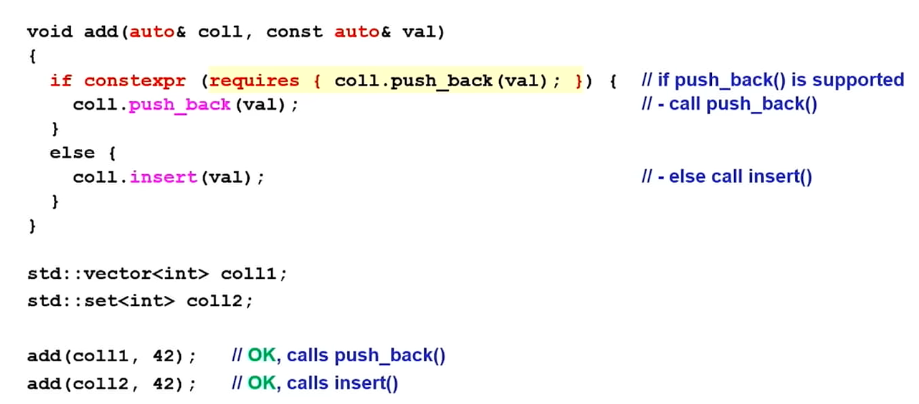