# 1. 并行计算

## 1.1 并行计算的概念

* 应用程序的潜在并行可能性指的是当系统资源是可用的情况下，可以通过任何顺序执行程序中的操作，而不会造成逻辑上的问题或是错误的结果。

* 并行硬件有许多不同的特性，我们着重介绍其中的几种非常规硬件：

  * **超线程**
    * 超线程的目的是提高每个CPU核心的效率，它通过在单个物理核心中模拟出两个逻辑核心来实现
    * ==超线程允许一个核心在一个时钟周期内处理两个线程==(超线程并不刻意同时执行两个线程，而是可以在这两个线程之间快速切换，也就是将两个指令队列交错的运行在硬件逻辑单元上)

  * **向量处理器**:
    * 向量处理器，也叫数组处理器，是专门用于执行向量计算的处理器，其不是对单个数据项进行标量操作，而是对数据向量的并行操作。
    * 向量处理器通常拥有==高带宽的内存访问能力==
    * 向量处理器的==位宽==(向量单位)指定了同时执行的指令数。例如一个256位宽的的向量单元可以同时执行4个64位(double)或是8个32位(float)的指令。
    * 向量处理器通常包含专门的硬件：向量寄存器，向量算术逻辑单元。
    * SIMD指令集是向量处理思想的一种实现。

  * **并行资源计算例子**：以一个具有超线程的16核CPU和一个256位宽的向量单元为例：
    * 考虑到每个核心可以执行两个线程(超线程),每个线程可以在单个指令中操作(256/64)个double数据
    * 16核$\times$2超线程$\times$(256位宽的向量单元)/64位(double) = 128路并行
    * 因此一个使用单核且没有向量化的串行程序只使用了该处理器0.8%的理论处理性能。

* 计算应用程序的能耗：

  * $P = N(个处理器)\times(R瓦/处理器)\times (T小时)$
  * 其中P为能耗，N为处理器数量，R为热设计功率，T为应用程序运行时间

## 1.2 并行计算的基本定律

相比与串行计算中，所有的操作都与时钟频率线性相关，在并行计算中，要复杂得多。

### 1.2.1 Amdahl定律

代码中并不只有并行代码，串行代码对并行结果的同步需求也是不可避免的。该定律根据并行代码数量，描述了计算的潜在加速比。
$$
Speedup(N)=\frac{1}{S + \frac{P}{N}}
$$
P是代码并行部分的分数，S是代码串行部分的分数，这意味着$P+S=1$，$N$是处理器数量。

Amdahl定律强调，无论让代码并行部分运行有多快，总会受到代码运行串行部分的限制，在固定规模的问题中这种标度称为==强标度==

例如，如果程序的95%可以并行化，剩下的5%必须串行执行，那么即使你增加无限多的处理器，根据Amdahl定律，你也只能实现20倍的加速（假设并行部分是完美的并行）。

### 1.2.2 Gustafson-Barsis

$$
Speedup(N) = N-S(N-1)
$$

N是处理器数量，S是串行部分分数。

这一定律提供了一个更乐观的视角，强调了随着处理器数量的增加，我们可以在相同的时间内处理更多的数据，而不仅仅是加速已有的固定大小的问题。

Gustafson-Barsis定律的主要观点是：随着处理器数量的增加，我们通常会增加问题的大小，因此并行部分的绝对时间会增加，而串行部分的绝对时间保持不变。

简而言之，Gustafson-Barsis定律提供了一个更实际、更乐观的并行计算视角，强调了随着处理器数量的增加，我们可以处理更大的数据集或问题规模。

也就是弱标度：==弱标度定义为对于每个处理器的固定问题规模，求解时间如何随处理器数量而变化==

### 1.2.3 运行时伸缩性与内存伸缩性

运行时伸缩性目标是增加==计算资源==来提高性能

内存伸缩性目标是增加==内存资源==来处理更多数据并提供更好的性能

**运行时伸缩性例子 - 网站服务器**：

假设你有一个电商网站。随着活动或节日促销，访问量激增。为了处理这些请求，你可能会采用以下策略：

- **垂直扩展 (Vertical Scaling)**：为你的服务器增加更强大的处理器、更多的核心，从而提高其处理能力。这是增加计算资源的方式。
- **水平扩展 (Horizontal Scaling)**：通过增加更多的服务器并将流量均匀分配到这些服务器上（例如，使用负载均衡器），从而提高处理能力。这样，更多的请求可以同时被处理。

这个例子展示了如何通过增加计算资源来应对更大的工作负载，这就是运行时伸缩性的体现。

**内存伸缩性例子 - 大数据分析**：

假设你有一个任务，需要分析数十亿条记录的数据集。你的初次尝试在一个只有8GB RAM的机器上运行失败了，因为数据太大，无法完全装入内存。

为了解决这个问题，你可以：

- **增加RAM (Vertical Scaling)**：你可以选择一个有128GB或更多RAM的机器来运行此任务。这将使你能够在内存中处理更大的数据集。
- **使用分布式内存解决方案 (Horizontal Scaling)**：例如Apache Spark，它可以将数据集分布在多台机器的内存中。这样，你可以使用一个集群，每台机器贡献一部分内存，从而达到需要的总内存。

一般来，如果应用程序的内存分配选择了分布式运行，那么运行时通常也是可以伸缩的

限制运行时的扩展意味着作业运行速度会变慢(串行)，而限制内存的扩展与i围着作业根本无法运行

## 1.3 并行计算方法分类与并行化思路

* 基于进程的并行化
* 基于线程的并行化
* 向量化
* 流处理

通常对于一个问题，我们有如下并行化思路：

* **将问题离散化（分解为更小的单元格或元素）**

* **定义一个计算核心（操作）对网格的每个元素进行操作**

* **在CPU和GPU上添加并行曾来执行计算：**

  * **向量化：一次处理多个数据单元**：通常如果处理器能够同时处理多个数据，我们就认为他有向量操作能力，举例来说，假设一个特定的向量运算是在4个双精度上同时进行的，该操作可以在单个时钟周期内完成，而只比单个串行操作增加很少的能耗（注意这是由一个CPU核心完成的）。

    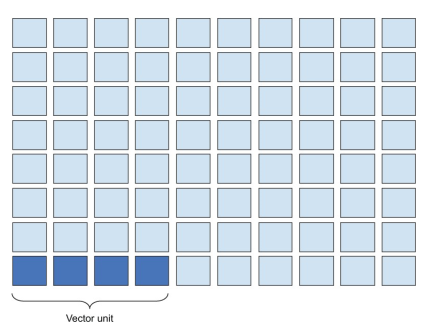

  * **多线程：部署多个计算路径，从而可以使用更多的处理核心**：进一步的，我们可以利用线程部署多个计算路径以便使用更多处理核心

    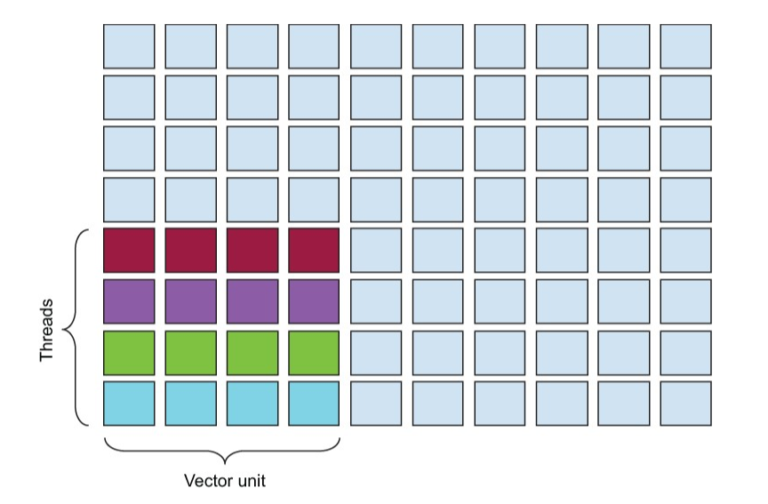

  * **进程：单独的程序实例，将计算分散到单独的内存空间中。**进一步在两台台式机上的处理器之间对工作进行划分，这种模式通常称为并行处理中的节点。当工作被划分到多个节点时，==每个结点的内存空间是独立的==。如下图，每个进程使用四个线程，每个线程在一个时钟周期内处理一个分布在4个节点上的向量单元。

    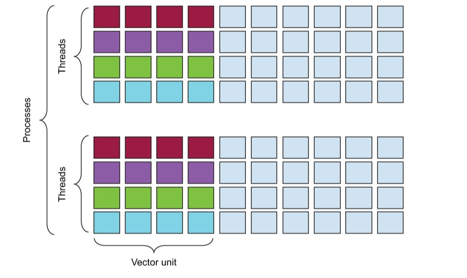

    > 进程是计算机科学中的一个基本概念，它指的是计算机程序在执行时与相关的数据之间的关系，以及操作系统用来管理这种执行的信息。
    >
    > 更具体地说：
    >
    > 1. **定义**：进程是一个正在执行的程序实例。它包括程序代码（有时称为文本或二进制文件）、相关的数据、程序计数器、堆栈以及一系列用于其执行的资源。
    > 2. **独立性**：每个进程都有其独立的内存地址空间。这意味着一个进程无法直接访问另一个进程的变量或数据结构。任何需要的进程间通信都需要通过特定的机制（如管道、消息传递、套接字等）进行。
    > 3. **生命周期**：进程从创建（或叫启动）开始，经历一系列的状态（例如，运行、等待、挂起等），最后结束。操作系统负责管理所有进程的生命周期。
    > 4. **上下文切换**：当操作系统从一个进程切换到另一个进程时，它保存当前进程的状态并加载另一个进程的状态。这被称为上下文切换。
    > 5. **多任务**：现代操作系统支持多任务，这意味着它们可以在看似同时的情况下运行多个进程。实际上，对于单核CPU，操作系统会快速地在不同的进程之间切换，使我们感觉它们是同时运行的。
    > 6. **父子进程**：进程可以创建其他进程。创建进程的进程称为父进程，而被创建的进程称为子进程。
    >
    > 要注意的是，进程与线程有所不同。线程是进程内的一个执行单元，==多个线程可以共享同一个进程的资源。这使得线程间的通信更为容易，但也增加了并发执行的复杂性。==
    >
    > CPU处理器有多个处理核心，他们并不等同于进程。进程是一个操作系统的概念，而处理器则是一个硬件组件。==无论应用程序产生多少进程，这些进程都是由操作系统调度到处理核心上运行的。==例如我们要对一个4核笔记本运行8个进程，他们将在处理核心之间进行交换运行。为了让进程通过交替的方式在处理核心上运行，==我们需要用一些策略来告诉操作系统如何处理进程的工作，以及是否将进程”绑定“到某一个处理核心==，这些将在后文14章讨论

  * **流处理：我们将计算通过流推送到GPU上（图形处理器上）进行计算.**通过GPU，我们可以利用大量的流式处理器来工作(streaming multiprocessor)。例如下图显示了将工作拆分为$8\times 8$的tile。这些tile可以由分布在84个SM上的32个双精度核心操作，也就是共有2688个双精度核心可以同时工作。如果有16个节点的集群，每个节点都有84个SM，每个SM32个double，这也就是43008路并行化。

    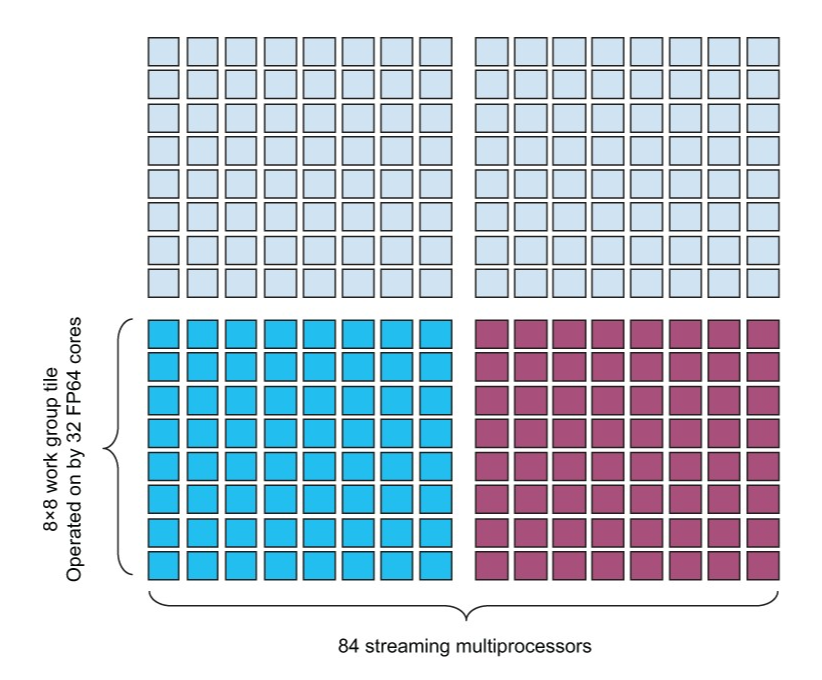

  

  ==对于CPU处理，对于最常见的硬件配置，都存在32倍的潜在加速：==

  ==2台台式机(节点)$\times$4个核心$\times$(256位宽向量单元)$/$(64位双精度)=32倍潜在加速==

尽管这些理论加速数字十分的让人兴奋，但是实际的加速因为前面的两个定律肯定到不了这么高。

## 1.4 编译与计算流程概述

当然可以，让我们更详细地探讨每个阶段并区分它们属于操作系统(OS)还是计算机体系结构(Architecture)的知识：

1. **源代码编写**：
   - 代码逻辑（编程语言和算法）
2. **编译阶段**：
   - **预处理**：宏替换、文件包含（OS & Compiler Design）
   - **词法分析**：转换源代码为记号（Compiler Design）
   - **语法分析**：生成抽象语法树（Compiler Design）
   - **中间代码生成**：生成三地址代码（Compiler Design）
   - **优化**：进行数据流分析等优化（Compiler Design）
   - **目标代码生成**：转换为特定架构的机器代码（Compiler Design & Architecture）
   - **链接**：合并目标文件和库文件（OS）
3. **加载到内存**：
   - 操作系统的加载器（OS）
4. **CPU指令执行**：（大部分属于Architecture）
   - **指令取指**：通过指令缓存（Architecture）
   - **指令解码**：解码机器指令（Architecture）
   - **指令分发**：分发微操作到执行单元（Architecture）
   - **操作数取值**：从寄存器或内存中获取操作数（Architecture）
   - **执行**：ALU或其他专用硬件执行操作（Architecture）
   - **内存访问**：加载和存储指令与内存互动（Architecture & OS）
   - **结果写回**：将结果写入寄存器或内存（Architecture）
5. **内存访问的细节**：（Architecture & OS）
   - **缓存查询**：查询各级数据缓存（Architecture）
   - **缓存替换策略**：决定替换哪个缓存行（Architecture）
   - **主存访问**：当所有缓存都未命中时，访问主内存（Architecture）
   - **写回/直写**：决定如何在缓存与主存间同步数据（Architecture）
6. **硬件辅助**：
   - 乱序执行、分支预测、指令级并行、超线程等（Architecture）
7. **进程管理**：（OS）
   - 进程调度、进程切换、资源分配、信号、互斥量和同步原语等操作系统概念对于多任务和并行程序来说是核心的。
8. **虚拟内存与物理内存**：（OS & Architecture）
   - 页面、页表、TLB、页面置换算法等都与内存管理有关。

## 1.4 当今异构并行系统的硬件模型

* **分布式内存架构：跨节点并行**

  * 分布式内存集群是==扩展性最好的方法之一==，其可以几乎无限的合并节点

  * 每个CPU有自己的本地DRAM内存

  * 通过通信网络与其他CPU相连

  * 该架构还为每个节点将总可寻址内存划分为更小的子空间，从而提供了一些内存局部性，使得==节点外访问内存与节点内访问内存存在明显差异==。迫使程序员需要明确的访问不同的内存区  域。==缺点就是需要在应用程序开始时对内存空间进行划分。==

    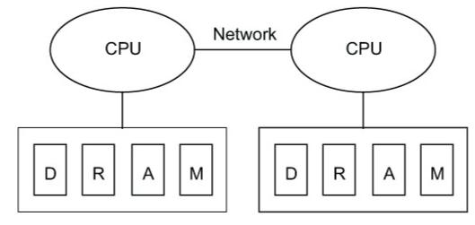

* **共享内存架构:节点内并行**

  * 两个CPU直接连接到同一个共享内存

  * 优点是==处理器共享同一个地址空间==，简化了编程过程

  * 缺点是会引入潜在的内存冲突问题，从而导致不正确的结果以及性能问题。并且多个CPU之间，或者多核CPU多个核心之间==同步内存访问和值的代价是很大的（同步成本较高）==

    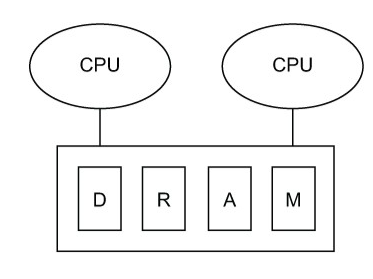

* **向量单位：通过单一指令执行多项操作**

  * 增加时钟频率提高计算速度通常是不可取的，以超频为例，其会产生更多的能耗与热量，能耗的电力限制通常被称为==电力墙(power wall)==，而热量更是一个大麻烦

  * 相比与增加时钟频率，我们选择==在每个周期执行多次操作==，即向量化。

  * 使用向量化，我们可以在单个时钟周期内处理比串行操作更多的数据，多项操作的电源需求几乎没有变化，并且可以减少运行时间，从而降低总能耗。

    > 向量单元，特别是那些在现代处理器中实现为SIMD（单指令多数据）硬件的向量单元，提供了高效的数据并行性。这些单元可以在单个指令中处理多个数据元素。那么，为什么在使用向量操作时电源需求几乎没有变化，但可以处理更多的数据呢？以下是主要的原因：
    >
    > 1. **同时操作多个数据**: 向量操作的核心理念是单指令多数据（SIMD）。这意味着使用一个==单一的指令可以操作一整个数据向量==，这通常包括多个数据元素。因此，与执行多个独立的串行指令相比，==处理器可以在一个操作中同时处理多个数据项==，从而极大地提高了效率。
    > 2. **向量操作通道**: 为了支持SIMD操作，现代处理器中的向量单元通常配备有==专门设计的硬件，称为向量操作通道或向量ALUs（算术逻辑单元）==。这些通道经过优化，以支持高吞吐量的并行数据操作。这些专门的通道可以更快、更有效地执行向量操作，与常规的标量ALUs相比。
    >
    > 还有一些次要的原因：
    >
    > 1. **重复的硬件减少**: 在标准的串行操作中，每个操作可能需要完整的指令获取、解码、执行和写回阶段。但在向量操作中，这些阶段可以在多个数据上共享。例如，一个向量指令可能会操作16个数据元素，但只需要一次指令获取和解码。
    > 2. **数据局部性**: 向量单元通常与紧密的数据缓存（如L1或L2缓存）结合使用。这确保了数据的高局部性，从而减少了对主内存的访问，这是一个高能耗的操作。
    >
    > 以上各点基本上属于**计算机体系结构**的知识领域，因为它们涉及到硬件设计和操作的细节。这种设计的目标是在不显著增加能耗的情况下增加性能，这正是向量和SIMD单元提供的。

  * 下图中，以不同的阴影表示了通过向量单元的四条路径，也就是==向量操作通道==

    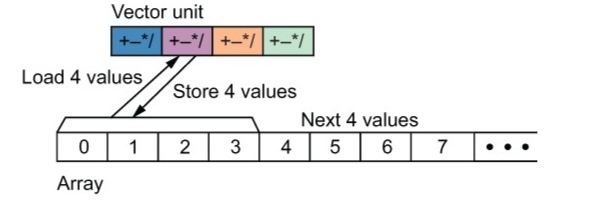

  * 大多数CPU与GPU都有向量化能力，其向量长度代表了在一个时钟周期内处理的数据量，==这取决于处理器上向量单元的大小==。目前，最常用的向量长度（位宽）是256位，也就是说如果我们处理64位double，我们可以通过向量操作同时执行4个浮点操作。

  * 向量硬件单元==每次加载一整块数据，然后同时对这些数据进行操作，最后将结果保存回去==

* **加速器设备：特殊用途的附加处理器。**

  * GPU拥有大量的SM，通过外围组件接口（PCI）总线连接到CPU
  * 虽然独立的GPU增加了数据和指令的通信成本，但是其可以提供更强大的计算能力和更好的性能。

  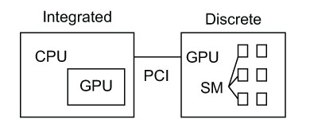

* **通用异构并行架构模型**

  * 就是将所有的这些不同的硬件架构合成一个模型

  * 图中的有两个节点，每个节点有两个CPU，共享相同的DRAM内存，每个CPU集成GPU(核显)

  * PCI总线的独立GPU连接到其中一个CPU（尽管CPU共享内存，他们通常位于不同的非同一内存访问区域中（NUMA）,这意味着访问第二个CPU的内存比获取他自己的内存代价更高。

    > **非同一内存访问（NUMA）**是一种计算机内存设计，其中处理器可以更快地访问其本地内存（或私有内存）比它可以访问远程内存（其他处理器的内存）。在NUMA架构中，每个处理器都有其自己的本地内存，并与其他处理器共享一些远程内存。访问远程内存的速度通常比访问本地内存要慢，因为数据必须跨越更长的距离和可能的总线和交换机。

    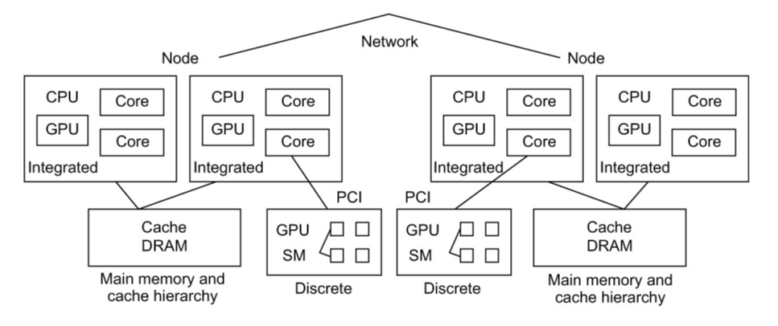

## 1.5 并行化技术的具体应用

* 基于进程的并行化————消息传递

  * 消息传递的方法是位分布式内存架构开发的
  * 它使用显式报文在进程之间移动数据
  * 在这个模型中，应用程序将生成独立的进程，也被称作**进程秩(rank)**，进程具有自己的内存空间和指令管道
  * 进程被交给操作系统并放置在处理器上
  * 应用程序位于“用户空间”的部分，在哪里用户拥有操作权限
  * 下面的部分式核心空间，它可以防止用户执行危险操作

  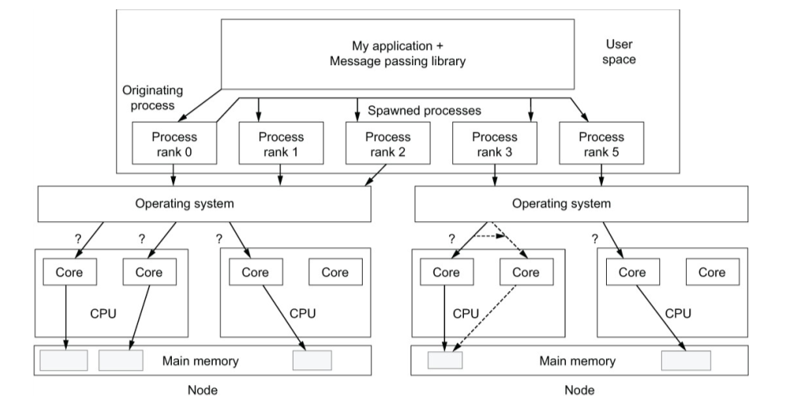

  > 1. **消息传递库**(Message passing library): 这是一个为分布式内存架构开发的工具。==它允许独立的进程间通信并同步它们的操作==。在这种环境下，数据不是自动共享的，进程必须显式地发送和接收消息以交换数据。
  > 2. **进程秩 (Rank)**: 这是应用程序==并行执行的独立实体==。每个进程有其自己的内存空间和指令流。例如，"Process rank 0"、"Process rank 1"等表示应用程序的不同并行部分。
  > 3. **用户空间**: 这是应用程序运行的地方。用户有权限在此空间内操作，但对系统资源的更深入访问是受限的。
  > 4. **操作系统**: 它管理硬件资源并决定哪些进程应当运行以及在何处运行。在图中，您可以看到进程被交给操作系统，然后被调度到特定的CPU和核心上。
  > 5. **CPU和核心**: 现代计算机系统通常具有多个CPU，每个CPU可能有多个核心。这允许多个进程或线程并行执行。
  > 6. **主内存**: 每个节点都有其主内存。在分布式内存架构中，每个进程的内存是隔离的。要在进程之间共享数据，必须使用消息传递库。
  > 7. **核心空间**: 与用户空间相对，核心空间是操作系统和硬件进行交互的地方。用户通常没有权限直接访问或修改这部分，因为这可能会影响系统的稳定性和安全性。
  >
  > 总的来说，图示展示了一个基于消息传递的并行程序如何与操作系统和硬件交互。在编写此类程序时，开发者需要明确地管理进程间的数据通信，并理解其如何映射到物理硬件上。

* 基于线程的并行化————通过内存共享数据

  * 基于线程的并行化方法在==同一个进程内生成独立的指令指针==，因此可以在线程之间轻松的共享进程内存中的内容。
  * 这会带来潜在的数据正确性与性能问题。
  * 我们将在后文讨论OpenMP，一个卓越的线程系统
  * 总的来说，基于线程并行化的方法中， 
    * 应用程序进程会产生线程，
    * 线程会被限制在节点资源范围内
    * 操作系统决定放置线程的位置
    * ==内存在线程之间共享==

  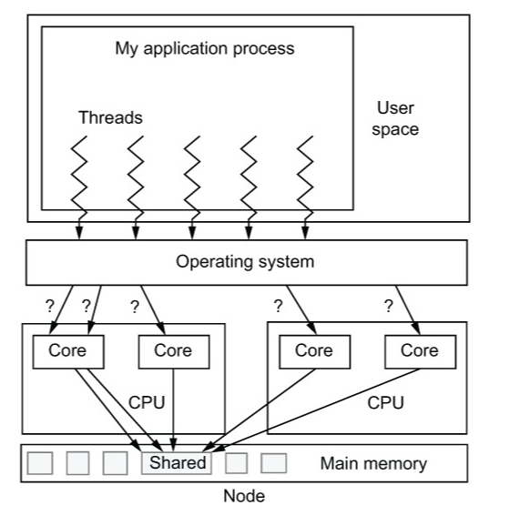

* 向量化—————————使用一条指令执行多个操作

  * 向量化操作分类属于单一指令，多个数据（SIMD）

  * 向量化操作通常是通过==源代码编译指示==或者==编译器分析==来完成的，这两者都是提供给编译器的提示，因此二者都十分以来编译器所提供的功能。==如果没有明确的编译器标志，编译器将生成用于处理能力最差的而处理器以及较小的向量长度。==有些机制可以绕过编译器，但是更复杂且代码不可移植。

  * 这也意味着，我们能通过源代码中的向量指令，使编译器生成性能不同的代码。

    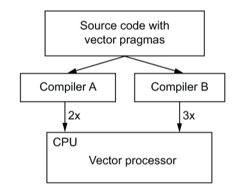

    

* 流式处理————————使用专用处理器

  * 流处理器是一个数据流的概念，其中的数据流将由更简单的专用处理器进行处理

  * 数据和kernel通过PCI总线发送到GPU进行计算，数据处理后将被传回CPU。

    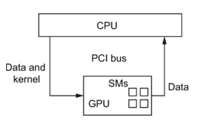

## 1.6 并行方法

### 1.6.1 Flynn分类法

`SISD`，`SIMD`,`MISD`,`MIMD`以及GPU的`SIMT`

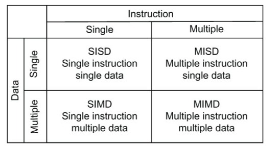

### 1.6.2 并行策略

* **数据并行化**：即为上文所讲的处理方法，通常也是最简单的方法。每个进程执行相同的程序，并对唯一的数据子集进行操作。数据并行的优点是，随着问题规模的不断扩大，可以通过增加处理器的数量来扩展。

  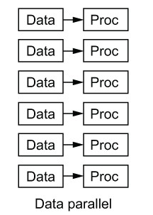

* **任务并行化**：

  * **pipeline**：在流水线处理中，指令被分解为不同的阶段，每个阶段由处理器的不同部分完成。而这些阶段可以并行地进行。。

    * ==在一个四阶段的流水线中，指令A在第一阶段，指令B在第二阶段，指令C在第三阶段，指令D在第四阶段。这四个指令都在同一时刻并行执行==。

  * **bucket-brigade**：使用所有处理器在一个操作序列中对数据进行操作和转换。

    * 想象一个桶接力比赛，其中参与者在一条线上排成一排，他们需要将桶（数据）从起点传到终点。这个动作是顺序的，每个人都会接过桶，可能进行某种操作（例如加水），然后将桶传给下一个人。
    * 在计算的上下文中，“bucket-brigade”方法指的是一种数据处理方法，其中所有处理器都按顺序对数据进行操作和转换。当一个处理器完成其操作后，它会将数据传递给下一个处理器，依此类推。这确保了所有处理器都有机会处理和/或转换数据。
    * ==设想一个场景，有三个处理器A、B和C。任务1首先给到处理器A，当A完成任务1的一部分并开始处理任务1的下一部分时，它将任务2传递给处理器B。处理器B在完成任务2的一部分后将任务3传递给处理器C，如此类推==。

    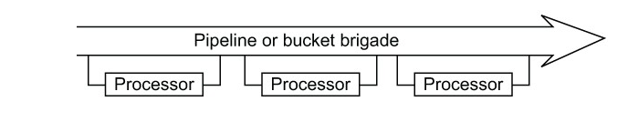

  不难看出，==流水线主要关注于指令的并行执行，而水桶传递则关注于任务在处理器之间的分配和传递。==

  * **主处理器法**：在这种方法中，==有一个主要的处理器，它负责为所有其他的“工作”处理器调度和分配任务==。==工作处理器处理任务，并在完成后返回结果给主处理器==。当工作处理器返回其先前的任务时，主处理器会检查并给它分配下一个工作项。

    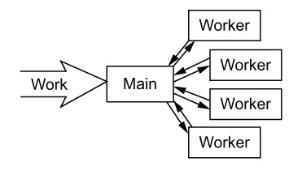

## 1.7  学习大纲

* 什么时候该使用MPI？什么时候使用（OpenMP)?
* 估计向量化带来的加速
* 识别应用程序哪一个部分最有可能实现加速
* 决定什么时候利用GPU来加速应用程序最合适
* 确定应用程序的最大潜在性能
* 估算应用程序的能源成本

