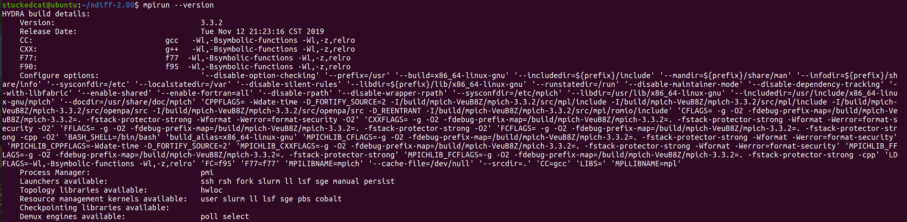
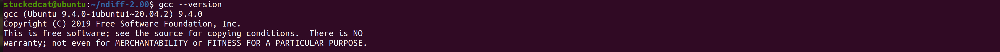
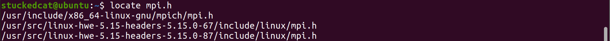

# 1. CTest示例

## 1.1 安装

1. 安装OpenMPI
   - OpenMPI是一个开源的MPI（消息传递接口）实现，它用于在分布式系统中进行进程间通信。

```bash
sudo apt-get update  # 更新软件包列表
sudo apt-get install mpich  # 安装OpenMPI
```

2. 安装CMake

- CMake是一个开源的跨平台构建系统，它可以用于管理项目的构建过程。

```bash
sudo apt-get install cmake  # 安装CMake

```

3. 安装GCC

- GCC是GNU编译器集合，它包括了C、C++和其他语言的编译器。

```bash
sudo apt-get install build-essential  # 安装基本的构建工具，包括GCC

```

4. 安装ndiff

- ndiff是一个用于比较两个文件中数值数据的工具。

```bash
wget https://www.math.utah.edu/~beebe/software/ndiff/ndiff-2.00.tar.gz  # 下载ndiff源码包
tar xzf ndiff-2.00.tar.gz  # 解压缩源码包
cd ndiff-2.00  # 进入源码目录
./configure  # 配置编译选项
make  # 编译ndiff
sudo make install  # 安装ndiff

```

> 如果第一个下载失效，直接进去https://www.math.utah.edu/~beebe/software/ndiff/找到对应工具，将其下载地址替换即可
>
> 


> sudo make install有一个小问题，
>
> 
>
> 不知道为什么创建不了这个目录，手动创建即可
>
> ```bash
> sudo mkdir -p /usr/local/man/man1
> 
> ```


## 1.2 验证







## 1.3 建立仓库

> Snap是一种应用程序包管理系统，它允许开发人员将软件及其依赖项打包在一起，以便能够在多种Linux发行版上运行。Snap包是自包含的，带有应用程序及其运行所需的所有依赖项。它们也能够自动更新，并提供安全机制以保护系统和用户数据。Snap是Canonical公司为Ubuntu设计的，但它也可以在其他Linux发行版上使用。

> CMake是一个开源的、跨平台的自动化构建系统，它可以控制软件编译过程，生成标准的构建文件（如Makefiles或项目文件），从而使软件能够在多种平台上构建。CMake不直接构建软件，而是为诸如Make、Ninja、或IDEs（如Visual Studio或Xcode）等实际的构建工具生成配置文件。它能处理大型项目，支持多种编程语言，提供了许多高级功能，如依赖管理和组件化构建，是许多开源和商业项目的首选构建工具。
>
> 通常的C++项目可以通过多种方法构建。CMake是其中一种流行的选择，它提供了一种灵活和可移植的方式来管理项目构建。但也有其他构建系统如Makefile, QMake或者Bazel等。相比于传统的Makefile，CMake能自动解析依赖关系，更易于维护，且可以为多种不同的构建工具和IDE生成配置文件。

**返回主目录**

```bash
cd ~
```

**安装Visual Studio Code**:

```bash
sudo snap install --classic code
```

这条命令使用snap包管理器安装VS Code。参数`--classic`允许VS Code访问系统的更多资源。


```bash
code//打开vscode
```


**安装驱动**

我的是4090，选择520驱动

```bash
sudo apt install nvidia-driver-520
```


**安装CUDA Toolkit**:

```bash
sudo apt-get install nvidia-cuda-toolkit
```

此命令通过apt包管理器安装CUDA Toolkit，以便进行CUDA开发。


**配置VS Code以支持CUDA**

- 打开VS Code。
- 转到Extensions视图（侧栏中的四个方块图标），搜索并安装"C/C++"和"NVIDIA CUDA"扩展。

**添加全局路径**

我在使用`mpi.h`时发生了找不到的错误，因此额外配置一下VScode中C/C++扩展的搜索路径

首先装一个寻找路径的method

```bash
sudo apt install mlocate 
```

查找`mpi.h`的路径

```bash
locate mpi.h
```



将这个路径加入VScode的includePath中

以下是如何为VS Code的C/C++扩展进行全局配置：

1. 打开VS Code。
2. 点击左侧边栏的齿轮图标或者使用快捷键`Ctrl` + `,`来打开设置。
3. 选择右上角settingjson修改其配置即可全局生效


```json
//原
{
    "workbench.colorTheme": "Default High Contrast Light",
    "C_Cpp.default.compilerPath": "/usr/bin/gcc",
    "C_Cpp.files.exclude": {
        "**/.vscode": true,
        "**/.vs": true
    }
}

//现
{
    "workbench.colorTheme": "Default High Contrast Light",
    "C_Cpp.default.compilerPath": "/usr/bin/gcc",
    "C_Cpp.files.exclude": {
        "**/.vscode": true,
        "**/.vs": true
    },
    //新添加的includePath
    "C_Cpp.default.includePath": [
        "/usr/include/x86_64-linux-gnu/mpich/",//用于MPICH库
		"/usr/src/linux-hwe-5.15-headers-5.15.0-67/include/linux/",//用于内核级开发，非内核级开发不用
		"/usr/src/linux-hwe-5.15-headers-5.15.0-87/include/linux/",//用于内核级开发，非内核级开发不用
        "${workspaceFolder}/**"//代表在当前工作区${workspaceFolder}及其所有子目录/**都生效
    ]
    
}
```

请确保替换上述代码中的`/path/to/mpi/include`为您系统上`mpi.h`的实际路径。

保存`settings.json`文件后，这些全局路径将应用于所有项目，除非项目具有其自己的`.vscode/c_cpp_properties.json`设置，这种情况下项目设置会覆盖全局设置。


**安装git**：版本控制，可以不装

在Ubuntu上，您可以直接在终端中使用Git。如果您的系统中还没有安装Git，您可以通过以下命令来安装它：

```bash
sudo apt-get install git
```

安装完成后，您可以在Ubuntu的终端中使用`git`命令来管理您的仓库。

使用

```bash
nvidia-smi
nvcc --version
```

即可确定是否完成

鉴于目前使用虚拟机，等到host机上再完善。

## 1.4 Cmake 入门

开始使用CMake，您需要了解基本的CMake语法和构建过程。以下是简单的步骤：

**安装CMake**:

```bash
sudo apt-get install cmake
```

1. 创建CMakeLists.txt
   - 在项目目录中创建`CMakeLists.txt`文件。
   - 在文件中定义项目名、目标等。

```bash
cmake_minimum_required(VERSION 3.10)
project(MyProject)
add_executable(MyExecutable main.cpp)
```

**构建项目**:

```bash
mkdir build
cd build
cmake ..
make
```

这些步骤将创建一个简单的CMake项目。`CMakeLists.txt`是CMake的核心，您可以在其中定义项目设置、目标和依赖关系。通过学习CMake的文档和教程，您可以逐渐掌握更多高级功能。


## 1.5 Ctest例子

`.ctest` 文件是与 CTest 测试系统相关的配置文件。CTest 是 CMake 的测试驱动程序，用于管理和执行项目的测试。它可以执行一组预定义的测试，并收集结果以报告测试的成功或失败。

`.ctest` 文件通常包含指定如何运行测试的指令和参数。例如，它可能会指定测试的名称、所需的执行文件、输入和输出文件、预期的结果以及如何比较实际结果和预期结果。此外，它也可能包含有关如何设置和清理测试环境的指令。

这种文件使开发者能够以标准和可重复的方式运行和验证他们的代码，确保代码的更改不会引入错误或破坏现有的功能。

在具体的项目中，`.ctest` 文件的内容和格式可能会有所不同，具体取决于项目的需求和 CTest 的配置。如果您有一个具体的 `.ctest` 文件，查看该文件的内容可能会提供有用的信息，以理解如何使用 CTest 来配置和运行项目的测试。

```c++
//TimeIt.cpp
#include<unistd.h>
#include<stdio.h>
#include<time.h>

int main(int argc, char *argv[]){
    
    struct timespec tstart, tstop, tresult;
    
    clock_gettime(CLOCK_MONOTONIC,&tstart);
    sleep(10);
    clock_gettime(CLOCK_MONOTONIC,&tstop);

    tresult.tv_sec = tstop.tv_sec - tstart.tv_sec;
    tresult.tv_nsec = tstop.tv_nsec - tstart.tv_nsec;

    printf("Elapsed time is %f secs\n",(double)tresult.tv_sec + (double)tresult.tv_nsec*1.0e-9);

}
```

```c++
//MPITimeIt.cpp
#include<unistd.h>  //for sleep
#include<stdio.h>   
#include<mpi.h>     //for MPI

int main(int argc, char *argv[]){
    int mype;
    
    MPI_Init(&argc,&argv);                  // Initialize MPI environment, which is essential in MPI programm before MPI method
    MPI_Comm_rank(MPI_COMM_WORLD,&mype);    // Identify rank(Identify code) of process

    double t1,t2;

    t1 = MPI_Wtime();
    sleep(10);
    t2 = MPI_Wtime();

    if(mype == 0)
        printf("Elapsed time is %f secs\n",t2-t1);

    MPI_Finalize();
}

    
```

如果你不初始化MPI环境（即不调用`MPI_Init`），并尝试使用其他MPI函数，你将遇到以下问题：

1. **未定义的行为**: `MPI_Init`为MPI库设置了必要的环境，包括初始化通信器、分配资源等。如果不调用它，其他MPI函数将在未初始化的环境中执行，这可能导致未定义的行为。
2. **错误和故障**: MPI库会检查是否已调用`MPI_Init`。如果你试图在没有先调用`MPI_Init`的情况下调用其他MPI函数，很可能会收到一个错误消息，并且程序可能会崩溃或异常终止。
3. **进程通信问题**: 由于MPI环境没有被初始化，进程之间的通信可能不会正常工作，导致程序卡住或无法正常运行。
4. **资源未分配**: MPI可能需要在内部分配和配置资源，如缓冲区、通信路径等。未调用`MPI_Init`将导致这些资源未被正确配置，进而可能影响程序的功能和性能。


然后写一个shell脚本：

```shell
//mympiapp.ctest

#!/bin/sh

./TimeIt > run0.out
mpirun -n 1 ./MPITimeIt > run1.out
mpirun -n 2 ./MPITimeIt > run2.out

ndiff --relative-error 1.0e-4 run1.out run2.out
test1=$?

ndiff --relative-error 1.0e-4 run0.out run2.out
test2=$?

exit "$(($test1 + $test2))"

```

这是一个shell脚本。Shell脚本是用于自动执行命令序列的脚本。以下是这个脚本的逐行解析：

1. `#!/bin/sh`
   - 这是一个[魔法数字](https://zh.wikipedia.org/wiki/魔法数字_(Unix))，它告诉系统该脚本应该使用 `/bin/sh` 解释器来执行。
2. `./TimeIt > run0.out`
   - 这会运行当前目录下的 `TimeIt` 程序，并将它的输出重定向到 `run0.out` 文件中。
3. `mpirun -n 1 ./MPITimeIt > run1.out`
   - 使用 `mpirun` 命令执行 `MPITimeIt` 程序，指定只使用1个进程。输出重定向到 `run1.out` 文件中。
4. `mpirun -n 2 ./MPITimeIt > run2.out`
   - 同上，但这次使用2个进程来运行程序。
5. `ndiff --relative-error 1.0e-4 run1.out run2.out`
   - 使用 `ndiff` 命令比较 `run1.out` 和 `run2.out` 两个文件的内容，设置相对误差为 `1.0e-4`。
6. `test1=$?`
   - `$?` 是上一个命令的退出状态。这行将其值赋给变量 `test1`。
7. `ndiff --relative-error 1.0r-4 run0.out run2.out`
   - 这行命令是为了比较 `run0.out` 和 `run2.out` 两个文件。
8. `test2=$?`
   - 同上，保存上一个命令的退出状态。
9. `exit "$(($test1 + $test2))"`
   - 退出脚本并返回一个退出状态，这个状态是 `$test1` 和 `$test2` 的和。

这个脚本的主要目的似乎是运行两个程序（一个是单进程，另一个是多进程）并比较其输出。如果两次运行的输出之间存在差异，那么ndiff将报告这些差异，并通过脚本的退出代码反馈这些差异。


**CMake**

```cmake
cmake_minimum_required(VERSION 3.0)

project(TimeIt)

enable_testing()

find_package(MPI)

add_executable(TimeIt TimeIt.cpp)
add_executable(MPITimeIt MPITimeIt.cpp)

target_include_directories(MPITimeIt PUBLIC ${MPI_INCLUDE_PATH})
target_link_libraries(MPITimeIt ${MPI_LIBRARIES})

file(GLOB TESTFILES RELATIVE "${CMAKE_CURRENT_SOURCE_DIR}" "*.ctest")


foreach(TESTFILE ${TESTFILES})
    add_test(
    NAME ${TESTFILE} WORKING_DIRECTORY 
        ${CMAKE_BINARY_DIR}
    COMMAND sh
        ${CMAKE_CURRENT_SOURCE_DIR}/${TESTFILE}
    )
endforeach()


add_custom_target(distclean
    COMMAND rm -rf CMakeCache.txt CMakeFiles
    CTestTestfile.cmake Makefile Testing
    cmake_install.cmake)
```

这段代码是一个基于CMake的构建脚本，主要用于配置和生成一个项目的构建系统。我将为你逐步解析这个脚本：

1. `cmake_minimum_required(VERSION 3.0)`:
   - 设置项目最低所需的CMake版本为3.0。
2. `project(TimeIt)`:
   - 通过`project(TimeIt)`为整个项目定义了一个名称。这有助于组织和识别项目及其组件。
3. `enable_testing()`:
   - 启用项目的测试功能，这使得可以添加和运行测试。
4. `find_package(MPI)`:
   - 寻找名为MPI的软件包。
   - find package 定义了`MPI_FOUND,MPI_INCLUDE_PATH，MPI_LIBRARIES`
5. `add_executable(TimeIt TimeIt.cpp)`:
   - 为源文件`TimeIt.cpp`添加一个名为`TimeIt`的可执行文件目标。
6. `add_executable(MPITimeIt MPITimeIt.cpp)`:
   - 为源文件`MPITimeIt.cpp`添加一个名为`MPITimeIt`的可执行文件目标。
7. `target_include_directories(MPITimeIt PUBLIC ${MPI_INCLUDE_PATH})`:
   - 为目标`MPITimeIt`添加包含目录，即MPI的头文件目录。
8. `target_link_libraries(MPITimeIt ${MPI_LIBRARIES})`:
   - 将MPI库链接到`MPITimeIt`目标。
   - ==为了确保MPI程序可以正确编译，我们需要包括MPI的头文件，并链接到MPI的库。这是通过`target_include_directories`和`target_link_libraries`来完成的。==
9. `file(GLOB TESTFILES RELATIVE "${CMAKE_CURRENT_SOURCE_DIR}" "*.ctest")`:
   - 使用GLOB命令搜索当前源目录中的所有`.ctest`文件，并将其存储在变量`TESTFILES`中。
10. `foreach(TESTFILE ${TESTFILES}) ... endforeach()`:
    - 遍历所有找到的`.ctest`文件，并为每一个都添加一个测试。
    - ==项目可能包含多个测试，这些测试文件的扩展名为`.ctest`。通过使用`file(GLOB ...)`和`foreach ...`，脚本能够自动找到并为每个测试文件添加一个测试。==
11. `add_custom_target(distclean ...)`:
    - 添加一个名为`distclean`的自定义目标，该目标用于清理构建目录中的临时文件。
    - ==`add_custom_target(distclean ...)`定义了一个用于清理构建系统中的临时文件的目标。这对于维护一个干净的构建环境很有用。==

### 1.5.1 编译

通过以下代码运行测试

```bash
mkdir build && cd build
cmake ..
make
make test
```

1. **`make`**：
   - 这是一个构建工具，主要用于编译源代码生成可执行文件、库等。
   - 当您在构建目录中运行 `make`，它会查找一个 `Makefile`，然后根据这个 `Makefile` 的指令来执行构建。
2. **`make test`**：
   - 如果在使用 `CMake` 的项目中，您在 `CMakeLists.txt` 文件中启用了测试 (`enable_testing()`) 并添加了一些测试 (`add_test()`)，那么当您运行 `cmake` 生成构建文件时，一个特殊的目标 `test` 会被创建。
   - 运行 `make test` 将执行这些测试，但请注意，它不提供太多的选项或详细的输出。


或者

```bash
mkdir ctestbuild && cd ctestbuild
cmake ..
ctest
```


这里只运行了0.01sec是因为利用了之前的结果与预编译信息，不过我们已经发现它是成功编译的。


**获取失败测试的输出**

这个是在使用ctest运行测试失败时才会显示测试的输出，这在大批量测试中可以让你更容易地看到导致测试失败的原因

```bash
ctest --output-on-failure
```


# 2. 使用gcov分析代码的覆盖率

`gcov`是一个用于分析GCC程序覆盖率的工具。通过使用`gcov`，开发者可以确定程序中哪些代码行已经执行，哪些尚未执行，从而帮助提高代码质量和测试覆盖率。

下面是一个使用`gcov`分析代码覆盖率的实际示例。

### 场景：

假设你正在开发一个简单的计算器库，其中包含一个函数用于判断一个数字是否为正数。现在你想确保测试涵盖了所有可能的代码路径。

### 1. 代码：`calculator.c`

```
cCopy code#include <stdbool.h>

bool is_positive(int number) {
    if (number > 0) {
        return true;
    } else {
        return false;
    }
}
```

### 2. 测试代码：`test_calculator.c`

```
cCopy code#include <assert.h>
#include "calculator.c"

int main() {
    assert(is_positive(5) == true);
    return 0;
}
```

注意：这个测试只测试了正数，而没有测试负数或零。

### 3. 使用`gcov`分析覆盖率

首先，使用`-fprofile-arcs`和`-ftest-coverage`选项编译和链接测试代码。

```bash
gcc -fprofile-arcs -ftest-coverage test_calculator.c -o test_calculator
```

运行测试程序：

```bash
./test_calculator
```

现在，使用`gcov`分析代码覆盖率：

```bash
gcov calculator.c
```

查看生成的`calculator.c.gcov`文件：

```arduino
        -:    1: #include <stdbool.h>
        -:    2:
        -:    3: bool is_positive(int number) {
        1:    4:     if (number > 0) {
        1:    5:         return true;
    #####:    6:     } else {
    #####:    7:         return false;
        -:    8:     }
        -:    9: }
```

从上面的输出中，我们可以看到，`if`分支被执行了（行4和5都有执行次数），但`else`分支（行6和7）没有被执行。这意味着我们的测试未能覆盖所有可能的代码路径。

**用途**：

1. **识别未测试的代码**：上述示例清楚地指出了哪些代码行没有被执行，这有助于开发者识别并编写额外的测试用例，以确保完全覆盖代码。
2. **提高代码质量**：识别并测试未覆盖的代码路径可以减少潜在的错误和缺陷。
3. **优化测试策略**：分析代码覆盖率可以帮助团队优化其测试策略，确保重要和关键的代码部分得到充分的测试。

总之，`gcov`为开发者提供了一个量化的方法，用于评估测试的全面性，并为改进提供了具体的指导。


# 3. 代码测试

## 3.1 代码测试的方式

* **回归测试：**定期运行以防止代码倒退，通常情况下使用**cron**作业调度器，在每周的指定时间运行测试任务。
* **单元测试：**开发过程中对子例程或者小范围代码进行测试。单元测试爱好者通常使用TDD（测试驱动开发）模式进行开发
  * 首先创建测试
  * 然后编写代码以通过这些测试
  * 然后将测试类型合并到并行代码开发中，测试在并行语言中的具体实现
* **持续集成测试：**当代码提交时自动触发并运行测试
* **提交测试：**可在极短时间内从命令行运行。在提交之前使用一个小型测试集进行测试。

通常人们会采用下图这种模式：

* 在开发阶段使用单元测试
* 在修改阶段使用持续集成测试
* 提交
* 代码更改使用提交测试
* bug修复使用回归测试


## 3.2 使用CMake和Ctest执行提交测试的开发工作流（以后再说）

我们使用CTest例子中的TimeIt.cpp，将sleep增加到30秒

```ctext
// blur_short.ctest

#!/bin/sh
make
```


```ctest
//blur_long.ctest

#!/bin/sh
./TimeIt
```


```ctest
//CMakeLists.txt

cmake_minimum_required(VERSION 3.0)

project(TimeIt)

enable_testing()

add_executable(TimeIt TimeIt.cpp)

add_test(
    NAME blur_short_commit WORKING_DIRECTORY 
    ${CMAKE_BINARY_DIRECTORY}
    COMMAND
    ${CMAKE_CURRENT_SOURCE_DIR}/blur_short.ctest
)


add_test(
    NAME blur_long WORKING_DIRECTORY
    ${CMAKE_BINARY_DIRECTORY}
    COMMAND
    ${CMAKE_CURRENT_SOURCE_DIR}/blur_long.ctest
)

add_custom_target(
    commit_tests
    COMMAND
    ctest -R commit DEPENDS <myapp>
)

add_custom_target(
    distclean
    COMMAND
    rm -rf CMakeCache.txt CmakeFiles
    CTestTestfile.cmake Makefile Testing
    cmake_install.cmake
)
```

- **cmake_minimum_required(VERSION 3.0)**: 指定最低CMake版本为3.0。
- **project(TimeIt)**: 定义了项目名称为 `TimeIt`。
- **enable_testing()**: 启用CTest，这样我们就可以添加和运行测试了。
- **add_executable(TimeIt TimeIt.c)**: 从 `TimeIt.c` 源文件创建一个名为 `TimeIt` 的可执行文件。
- **add_test()**: 定义了两个测试：
  - `blur_short_commit`，它运行 `blur_short.ctest` 脚本（即运行 `make`）。
  - `blur_long`，它运行 `blur_long.ctest` 脚本（即运行 `./TimeIt` 程序）。
- **add_custom_target()**: 定义了两个自定义目标：
  - ==`commit_tests`: 运行与 "commit" 相关的测试。注意，我们没有任何测试名包含 "commit"，所以这个目标实际上不会运行任何测试。另外，`<myapp>` 在这里可能是一个占位符，它应该被替换为真正的依赖项。==
  - `distclean`: 删除与构建和测试相关的文件和目录，用于清理项目。


上面描述了一种软件开发工作流，重点是在提交（commit）代码之前如何进行测试，确保代码质量。

1. **提交测试（Commit Tests）：**

- **提交测试**是一组测试，设计目的是在代码提交到版本控制系统之前快速运行。这样可以快速捕获任何明显的问题。
- 这些测试可以通过 `ctest -R commit` 命令或 `make commit_tests`（一个在 `CMakeLists.txt` 中定义的自定义目标）来运行。
- 当使用 `make test` 或 `ctest` 命令时，所有的测试（包括长时间运行的测试）都会被运行。但是，`commit` 命令只会运行名称中包含“commit”的测试，以快速检查关键功能。

2. **工作流：**

以下是一个典型的开发工作流：

1. **编辑源代码**：使用文本编辑器，如 `vi`，编辑源代码。
2. **构建代码**：使用 `make` 命令编译代码。
3. **运行提交测试**：使用 `make commit_tests` 运行提交测试。
4. **提交代码更改**：使用 `git commit` 命令提交代码到版本控制系统。

然后，这个过程会重复。

3. **持续集成测试（Continuous Integration Tests）：**

- 持续集成测试是当代码提交到主代码库时自动触发的测试，它作为一个额外的防护层来防止提交有问题的代码。
- 简单地说，当开发者提交代码更改时，持续集成系统会自动构建和测试这些更改。如果测试失败，开发者会收到通知。
- 常见的持续集成工具包括：
  - Jenkins,(https://www.jenkins.io)
  -  Travis CI, https://travis-ci.com)
  - GitLab CI 和 (https://about.gitlab.com/stages-devops-lifecycle/continuous-integration/)
  - CircleCI，(https://circleci.com)

4. **回归测试（Regression Tests）：**

- **回归测试**通常在夜间通过 `cron` 作业设置运行，这意味着测试集可以比其他测试类型的测试集更为广泛。
- 这些测试可以持续较长的时间，但应该在早上报告之前完成。
- 通常，回归测试还会进行额外的测试，如内存检查和代码覆盖率测试，因为它们需要更长的运行时间并且报告周期较长。
- 回归测试的结果通常随时间跟踪，连续通过的测试结果被视为项目健康状况的指标，通常称为“一墙之隔”。

总的来说，这段内容强调了在软件开发过程中进行适当的测试的重要性，以确保代码的质量和项目的成功。


# 4. 查找和修复内存问题

使用`valgrind`解决**内存覆盖**和**未初始化内存**的问题

* `valgrind`最好与GCC编译器配合
* 同时在使用Intel编译器时不要使用向量化
* `valgrind`会产生大量输出，在确认了无内存问题之后应取消valgrind


调用

```bash
valgrind <./my_app>
```

或是

```bash
mpirun -n 2 valgrind <./myapp>
```


## 例子

```c++
#include<stdlib.h>

int main(int argc,char* argv[]){
    int ipos,ival;//ipos未赋值

    int *iarray = (int *)malloc(10 * sizeof(int));
    if(argc == 2) ival = atoi(argv[1]);
    for(int i = 0; i <= 10;i++) {iarray[i] = ipos;}//ipos被加载到iarray
    for(int i = 0;i <= 10;i++){
        if(ival == iarray[i]) ipos = i;//标记未初始化内存
    }
}
```


**安装Valgrind**

```bash
sudo apt install valgrind
```

**编译代码**

在运行Valgrind之前，首先确保源代码已经被编译且包含了调试信息。这样，Valgrind报告的任何问题都会指向源代码的准确位置。使用`-g`选项来编译你的程序以包含调试信息:

```bash
g++ -g -o memory_check_example memory_check_example.cpp
```

**使用 Valgrind 运行程序**:

你可以使用以下命令来运行Valgrind检查你的程序:

```bash
valgrind --leak-check=full ./memory_check_example
```

终端会输出报告

```bash
stuckedcat@ubuntu:~/ParallelComputing/memorycheck$ valgrind --leak-check=full ./memory_check_example
==63436== Memcheck, a memory error detector
==63436== Copyright (C) 2002-2017, and GNU GPL'd, by Julian Seward et al.
==63436== Using Valgrind-3.15.0 and LibVEX; rerun with -h for copyright info
==63436== Command: ./memory_check_example
==63436== 
==63436== Invalid write of size 4
==63436==    at 0x1091CA: main (memory_check_example.cpp:8)
==63436==  Address 0x4a53068 is 0 bytes after a block of size 40 alloc'd
==63436==    at 0x483B7F3: malloc (in /usr/lib/x86_64-linux-gnu/valgrind/vgpreload_memcheck-amd64-linux.so)
==63436==    by 0x109185: main (memory_check_example.cpp:6)
==63436== 
==63436== Conditional jump or move depends on uninitialised value(s)
==63436==    at 0x1091F8: main (memory_check_example.cpp:10)
==63436== 
==63436== Invalid read of size 4
==63436==    at 0x1091F3: main (memory_check_example.cpp:10)
==63436==  Address 0x4a53068 is 0 bytes after a block of size 40 alloc'd
==63436==    at 0x483B7F3: malloc (in /usr/lib/x86_64-linux-gnu/valgrind/vgpreload_memcheck-amd64-linux.so)
==63436==    by 0x109185: main (memory_check_example.cpp:6)
==63436== 
==63436== 
==63436== HEAP SUMMARY:
==63436==     in use at exit: 40 bytes in 1 blocks
==63436==   total heap usage: 1 allocs, 0 frees, 40 bytes allocated
==63436== 
==63436== 40 bytes in 1 blocks are definitely lost in loss record 1 of 1
==63436==    at 0x483B7F3: malloc (in /usr/lib/x86_64-linux-gnu/valgrind/vgpreload_memcheck-amd64-linux.so)
==63436==    by 0x109185: main (memory_check_example.cpp:6)
==63436== 
==63436== LEAK SUMMARY:
==63436==    definitely lost: 40 bytes in 1 blocks
==63436==    indirectly lost: 0 bytes in 0 blocks
==63436==      possibly lost: 0 bytes in 0 blocks
==63436==    still reachable: 0 bytes in 0 blocks
==63436==         suppressed: 0 bytes in 0 blocks
==63436== 
==63436== Use --track-origins=yes to see where uninitialised values come from
==63436== For lists of detected and suppressed errors, rerun with: -s
==63436== ERROR SUMMARY: 14 errors from 4 contexts (suppressed: 0 from 0)
stuckedcat@ubuntu:~/ParallelComputing/memorycheck$ 


```

1. **Invalid write of size 4**
   - 位置：`memory_check_example.cpp:8`
   - 问题描述：程序试图写入一个它不应该访问的内存地址。
   - 详情：程序试图写入分配给 `iarray` 的内存块后面的内存。这是一个数组越界问题。因为数组大小是 10，但在循环中，它尝试访问索引 10 的位置（实际上应该是0到9）。
2. **Conditional jump or move depends on uninitialised value(s)**
   - 位置：`memory_check_example.cpp:10`
   - 问题描述：程序根据未初始化的值进行条件跳转或移动。
   - 详情：`ipos` 和 `ival` 在使用之前没有被初始化。特别是，当 `argc` 不等于 2 时，`ival` 保持未初始化，并在后面的循环中使用。
3. **Invalid read of size 4**
   - 位置：`memory_check_example.cpp:10`
   - 问题描述：程序试图读取一个它不应该访问的内存地址。
   - 详情：与上面的 "Invalid write" 问题相同，这是由于数组越界。
4. **HEAP SUMMARY**
   - 详情：在程序结束时，堆上分配了40字节的内存，并且没有被释放。
5. **LEAK SUMMARY**
   - 详情：确实存在内存泄漏。程序分配了40字节的内存，并在结束时没有释放它。这在 `memory_check_example.cpp:6` 中的 `malloc` 调用中发生。
6. **ERROR SUMMARY**
   - 详情：Valgrind 检测到共有 14 个错误。


# 5. ==(面试)==

## 5.1 提高代码的可移植性

* **valgrind（内存管理检测）**最适合**GCC**
* **Intel Inspector(线程正确工具)**最适合**Intel编译器**
* **CUDA Fortran**仅适用于PGI编译器
  * **CUDA Fortran** 是Fortran的一个扩展，允许直接在NVIDIA GPU上编写和执行并行计算代码。
* 基于GPU指令的语言OpenACC和OpenMP仅在一小部分编译器可用
  * **OpenACC** 和 **OpenMP** 都是用于并行计算的编程模型。==它们的目标是让程序员能够使用高层次的指令来标注哪些代码部分应该并行化，而不必进行低级的线程管理。==
  * 虽然这两种模型的目的是增加代码的可移植性，但实际上==它们只在一小部分编译器中可用==，这会限制代码的可移植性。
  * 明确OpenMP的三个功能：
    * 通过SIMD指令进行向量化，
    * 从原始OpenMP模型进行CPU线程化：原始的OpenMP模型提供了一种方式，使得程序员可以轻松地在多个CPU核心之间分发任务。
    * 将计算下放到加速器（GPU）上运行：近年来，OpenMP已经扩展到支持将代码下放到加速器（如GPU）上运行。


## 5.2 算法评估

评估的是算法的各个部分的复杂度与伸缩性

比如一个$N^2$的部分，虽然目前因为数据较少计算时间很少，然而在某些情况下其计算时间平方式增长，这时这个部分就是需要被潜在优化的部分。


## 5.3 扩展阅读

扩展阅读能看出各个部分的重要性

* **版本控制系统**
  * Mike McQuaid, *Git in Practice*(Manning,2014)
  * Rick Umali, *Learn Git in a Month of Lunches*(Manning,2015)
* **测试（特别是单元测试）**
  * Vladimir Khorikov, *Unit Testing Principles*, Practices, and Patterns(Manning, 2020)
* **浮点运算精度**
  * David Goldberg, *What every computer scientist should know about float-point arithmetic*, ACM Computing Surveys(CSUR)23,no.1(1991):5-48


