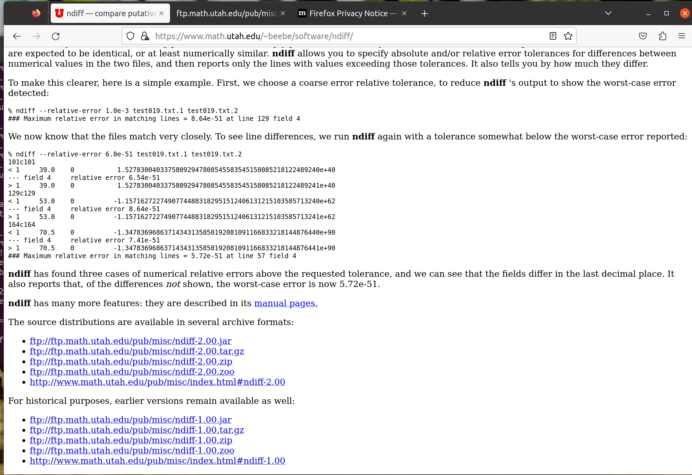
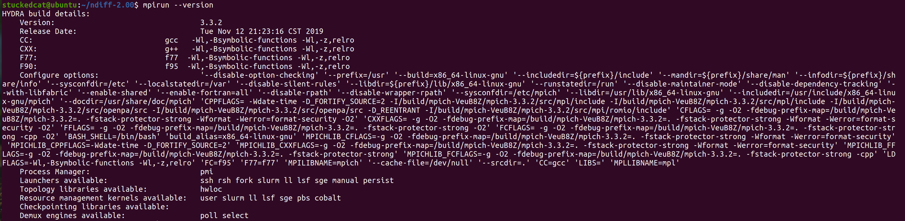
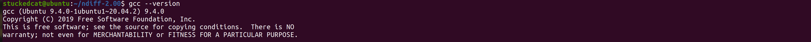
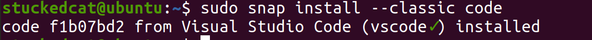
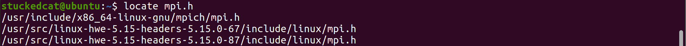
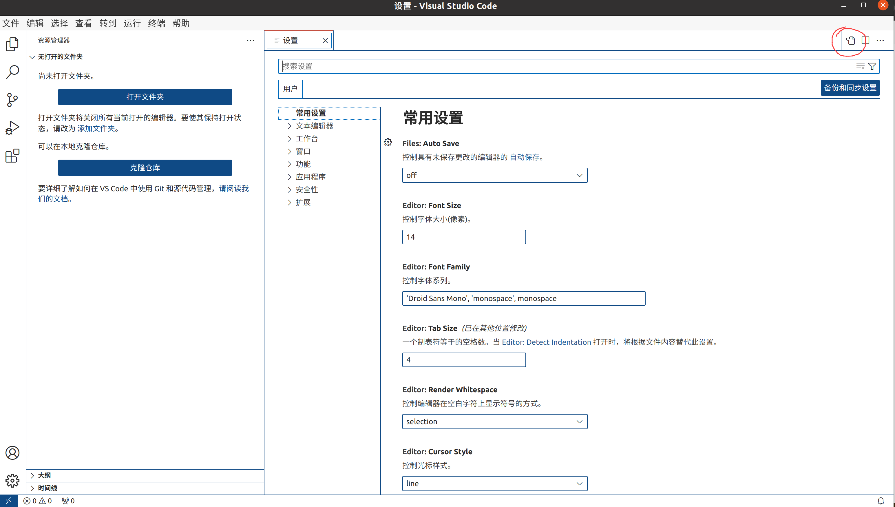

# CTest示例

## 安装

1. 安装OpenMPI
   - OpenMPI是一个开源的MPI（消息传递接口）实现，它用于在分布式系统中进行进程间通信。

```bash
sudo apt-get update  # 更新软件包列表
sudo apt-get install mpich  # 安装OpenMPI
```

2. 安装CMake

- CMake是一个开源的跨平台构建系统，它可以用于管理项目的构建过程。

```bash
sudo apt-get install cmake  # 安装CMake

```

3. 安装GCC

- GCC是GNU编译器集合，它包括了C、C++和其他语言的编译器。

```bash
sudo apt-get install build-essential  # 安装基本的构建工具，包括GCC

```

4. 安装ndiff

- ndiff是一个用于比较两个文件中数值数据的工具。

```bash
wget https://www.math.utah.edu/~beebe/software/ndiff/ndiff-2.00.tar.gz  # 下载ndiff源码包
tar xzf ndiff-2.00.tar.gz  # 解压缩源码包
cd ndiff-2.00  # 进入源码目录
./configure  # 配置编译选项
make  # 编译ndiff
sudo make install  # 安装ndiff

```

> 如果第一个下载失效，直接进去https://www.math.utah.edu/~beebe/software/ndiff/找到对应工具，将其下载地址替换即可
>
> 


> sudo make install有一个小问题，
>
> 
>
> 不知道为什么创建不了这个目录，手动创建即可
>
> ```bash
> sudo mkdir -p /usr/local/man/man1
> 
> ```


## 验证







## 建立仓库

> Snap是一种应用程序包管理系统，它允许开发人员将软件及其依赖项打包在一起，以便能够在多种Linux发行版上运行。Snap包是自包含的，带有应用程序及其运行所需的所有依赖项。它们也能够自动更新，并提供安全机制以保护系统和用户数据。Snap是Canonical公司为Ubuntu设计的，但它也可以在其他Linux发行版上使用。

> CMake是一个开源的、跨平台的自动化构建系统，它可以控制软件编译过程，生成标准的构建文件（如Makefiles或项目文件），从而使软件能够在多种平台上构建。CMake不直接构建软件，而是为诸如Make、Ninja、或IDEs（如Visual Studio或Xcode）等实际的构建工具生成配置文件。它能处理大型项目，支持多种编程语言，提供了许多高级功能，如依赖管理和组件化构建，是许多开源和商业项目的首选构建工具。
>
> 通常的C++项目可以通过多种方法构建。CMake是其中一种流行的选择，它提供了一种灵活和可移植的方式来管理项目构建。但也有其他构建系统如Makefile, QMake或者Bazel等。相比于传统的Makefile，CMake能自动解析依赖关系，更易于维护，且可以为多种不同的构建工具和IDE生成配置文件。

**返回主目录**

```bash
cd ~
```

**安装Visual Studio Code**:

```bash
sudo snap install --classic code
```

这条命令使用snap包管理器安装VS Code。参数`--classic`允许VS Code访问系统的更多资源。



```bash
code//打开vscode
```


**安装驱动**

我的是4090，选择520驱动

```bash
sudo apt install nvidia-driver-520
```


**安装CUDA Toolkit**:

```bash
sudo apt-get install nvidia-cuda-toolkit
```

此命令通过apt包管理器安装CUDA Toolkit，以便进行CUDA开发。


**配置VS Code以支持CUDA**

- 打开VS Code。
- 转到Extensions视图（侧栏中的四个方块图标），搜索并安装"C/C++"和"NVIDIA CUDA"扩展。

**添加全局路径**

我在使用`mpi.h`时发生了找不到的错误，因此额外配置一下VScode中C/C++扩展的搜索路径

首先装一个寻找路径的method

```bash
sudo apt install mlocate 
```

查找`mpi.h`的路径

```bash
locate mpi.h
```



将这个路径加入VScode的includePath中

以下是如何为VS Code的C/C++扩展进行全局配置：

1. 打开VS Code。
2. 点击左侧边栏的齿轮图标或者使用快捷键`Ctrl` + `,`来打开设置。
3. 选择右上角settingjson修改其配置即可全局生效



```json
//原
{
    "workbench.colorTheme": "Default High Contrast Light",
    "C_Cpp.default.compilerPath": "/usr/bin/gcc",
    "C_Cpp.files.exclude": {
        "**/.vscode": true,
        "**/.vs": true
    }
}

//现
{
    "workbench.colorTheme": "Default High Contrast Light",
    "C_Cpp.default.compilerPath": "/usr/bin/gcc",
    "C_Cpp.files.exclude": {
        "**/.vscode": true,
        "**/.vs": true
    },
    //新添加的includePath
    "C_Cpp.default.includePath": [
        "/usr/include/x86_64-linux-gnu/mpich/",//用于MPICH库
		"/usr/src/linux-hwe-5.15-headers-5.15.0-67/include/linux/",//用于内核级开发，非内核级开发不用
		"/usr/src/linux-hwe-5.15-headers-5.15.0-87/include/linux/",//用于内核级开发，非内核级开发不用
        "${workspaceFolder}/**"//代表在当前工作区${workspaceFolder}及其所有子目录/**都生效
    ]
    
}
```

请确保替换上述代码中的`/path/to/mpi/include`为您系统上`mpi.h`的实际路径。

保存`settings.json`文件后，这些全局路径将应用于所有项目，除非项目具有其自己的`.vscode/c_cpp_properties.json`设置，这种情况下项目设置会覆盖全局设置。


**安装git**：版本控制，可以不装

在Ubuntu上，您可以直接在终端中使用Git。如果您的系统中还没有安装Git，您可以通过以下命令来安装它：

```bash
sudo apt-get install git
```

安装完成后，您可以在Ubuntu的终端中使用`git`命令来管理您的仓库。

使用

```bash
nvidia-smi
nvcc --version
```

即可确定是否完成

鉴于目前使用虚拟机，等到host机上再完善。

## Cmake 入门

开始使用CMake，您需要了解基本的CMake语法和构建过程。以下是简单的步骤：

**安装CMake**:

```bash
sudo apt-get install cmake
```

1. 创建CMakeLists.txt
   - 在项目目录中创建`CMakeLists.txt`文件。
   - 在文件中定义项目名、目标等。

```bash
cmake_minimum_required(VERSION 3.10)
project(MyProject)
add_executable(MyExecutable main.cpp)
```

**构建项目**:

```bash
mkdir build
cd build
cmake ..
make
```

这些步骤将创建一个简单的CMake项目。`CMakeLists.txt`是CMake的核心，您可以在其中定义项目设置、目标和依赖关系。通过学习CMake的文档和教程，您可以逐渐掌握更多高级功能。


## Ctest例子

`.ctest` 文件是与 CTest 测试系统相关的配置文件。CTest 是 CMake 的测试驱动程序，用于管理和执行项目的测试。它可以执行一组预定义的测试，并收集结果以报告测试的成功或失败。

`.ctest` 文件通常包含指定如何运行测试的指令和参数。例如，它可能会指定测试的名称、所需的执行文件、输入和输出文件、预期的结果以及如何比较实际结果和预期结果。此外，它也可能包含有关如何设置和清理测试环境的指令。

这种文件使开发者能够以标准和可重复的方式运行和验证他们的代码，确保代码的更改不会引入错误或破坏现有的功能。

在具体的项目中，`.ctest` 文件的内容和格式可能会有所不同，具体取决于项目的需求和 CTest 的配置。如果您有一个具体的 `.ctest` 文件，查看该文件的内容可能会提供有用的信息，以理解如何使用 CTest 来配置和运行项目的测试。

```c++
//TimeIt.cpp
#include<unistd.h>
#include<stdio.h>
#include<time.h>

int main(int argc, char *argv[]){
    
    struct timespec tstart, tstop, tresult;
    
    clock_gettime(CLOCK_MONOTONIC,&tstart);
    sleep(10);
    clock_gettime(CLOCK_MONOTONIC,&tstop);

    tresult.tv_sec = tstop.tv_sec - tstart.tv_sec;
    tresult.tv_nsec = tstop.tv_nsec - tstart.tv_nsec;

    printf("Elapsed time is %f secs\n",(double)tresult.tv_sec + (double)tresult.tv_nsec*1.0e-9);

}
```

```c++
//MPITimeIt.cpp
#include<unistd.h>  //for sleep
#include<stdio.h>   
#include<mpi.h>     //for MPI

int main(int argc, char *argv[]){
    int mype;
    
    MPI_Init(&argc,&argv);                  // Initialize MPI environment, which is essential in MPI programm before MPI method
    MPI_Comm_rank(MPI_COMM_WORLD,&mype);    // Identify rank(Identify code) of process

    double t1,t2;

    t1 = MPI_Wtime();
    sleep(10);
    t2 = MPI_Wtime();

    if(mype == 0)
        printf("Elapsed time is %f secs\n",t2-t1);

    MPI_Finalize();
}

    
```

如果你不初始化MPI环境（即不调用`MPI_Init`），并尝试使用其他MPI函数，你将遇到以下问题：

1. **未定义的行为**: `MPI_Init`为MPI库设置了必要的环境，包括初始化通信器、分配资源等。如果不调用它，其他MPI函数将在未初始化的环境中执行，这可能导致未定义的行为。
2. **错误和故障**: MPI库会检查是否已调用`MPI_Init`。如果你试图在没有先调用`MPI_Init`的情况下调用其他MPI函数，很可能会收到一个错误消息，并且程序可能会崩溃或异常终止。
3. **进程通信问题**: 由于MPI环境没有被初始化，进程之间的通信可能不会正常工作，导致程序卡住或无法正常运行。
4. **资源未分配**: MPI可能需要在内部分配和配置资源，如缓冲区、通信路径等。未调用`MPI_Init`将导致这些资源未被正确配置，进而可能影响程序的功能和性能。


然后写一个shell脚本：

```shell
//mympiapp.ctest

#!/bin/sh

./TimeIt > run0.out
mpirun -n 1 ./MPITimeIt > run1.out
mpirun -n 2 ./MPITimeIt > run2.out

ndiff --relative-error 1.0e-4 run1.out run2.out

test1=$?
ndiff --relative-error 1.0r-4 run0.out run2.out
test2=$?

exit "$(($test1 + $test2))"

```

这是一个shell脚本。Shell脚本是用于自动执行命令序列的脚本。以下是这个脚本的逐行解析：

1. `#!/bin/sh`
   - 这是一个[魔法数字](https://zh.wikipedia.org/wiki/魔法数字_(Unix))，它告诉系统该脚本应该使用 `/bin/sh` 解释器来执行。
2. `./TimeIt > run0.out`
   - 这会运行当前目录下的 `TimeIt` 程序，并将它的输出重定向到 `run0.out` 文件中。
3. `mpirun -n 1 ./MPITimeIt > run1.out`
   - 使用 `mpirun` 命令执行 `MPITimeIt` 程序，指定只使用1个进程。输出重定向到 `run1.out` 文件中。
4. `mpirun -n 2 ./MPITimeIt > run2.out`
   - 同上，但这次使用2个进程来运行程序。
5. `ndiff --relative-error 1.0e-4 run1.out run2.out`
   - 使用 `ndiff` 命令比较 `run1.out` 和 `run2.out` 两个文件的内容，设置相对误差为 `1.0e-4`。
6. `test1=$?`
   - `$?` 是上一个命令的退出状态。这行将其值赋给变量 `test1`。
7. `ndiff --relative-error 1.0r-4 run0.out run2.out`
   - 这行有一个小错误。`1.0r-4` 应该是 `1.0e-4`。这行命令是为了比较 `run0.out` 和 `run2.out` 两个文件。
8. `test2=$?`
   - 同上，保存上一个命令的退出状态。
9. `exit "$(($test1 + $test2))"`
   - 退出脚本并返回一个退出状态，这个状态是 `$test1` 和 `$test2` 的和。

这个脚本的主要目的似乎是运行两个程序（一个是单进程，另一个是多进程）并比较其输出。如果两次运行的输出之间存在差异，那么ndiff将报告这些差异，并通过脚本的退出代码反馈这些差异。