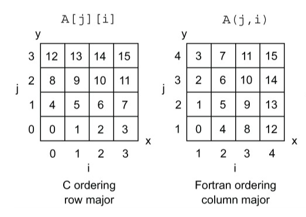
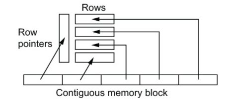
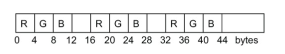
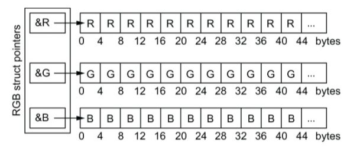
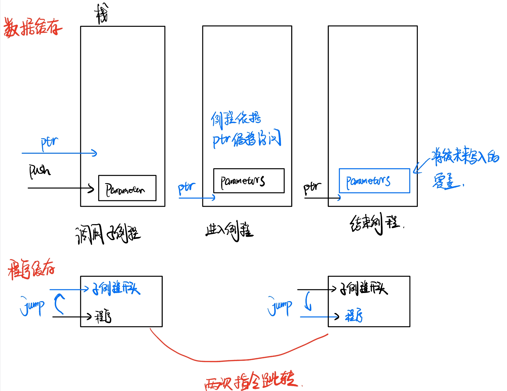
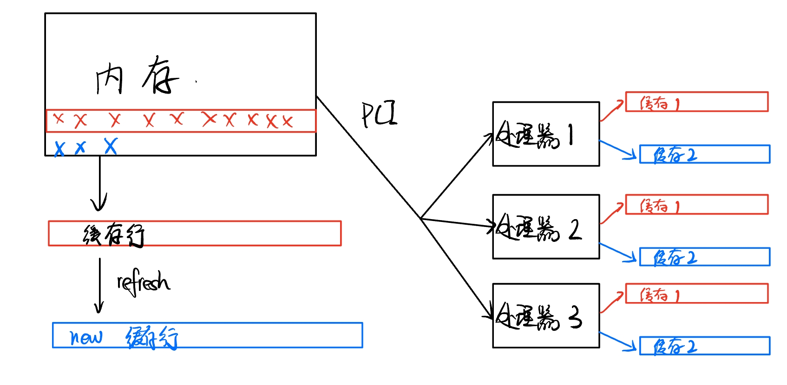
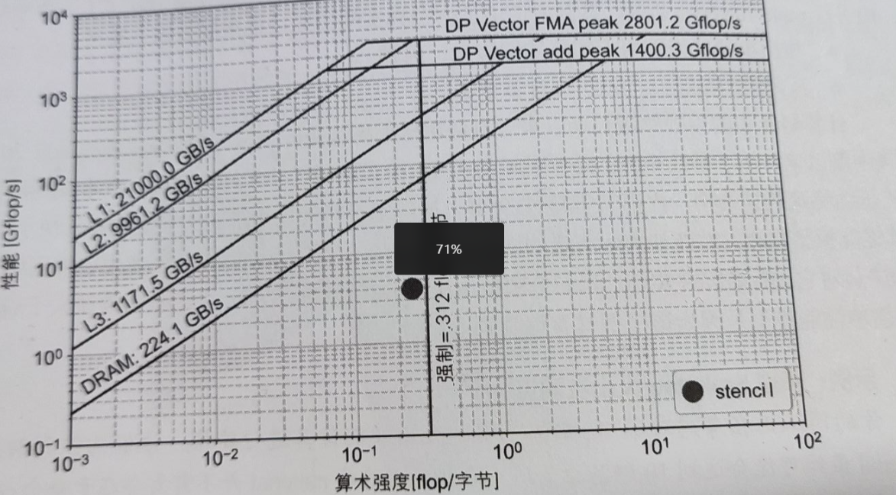

## 1. 面向数据设计的编程方法

在编程领域，数据结构和数据布局的选择往往对应用程序的性能产生深远影响。当进行并行编程时，推荐采用以数据为核心的方法，主要体现在以下方面：

- 集中关注数据，而非仅仅是代码本身。
- 更多地考虑内存带宽，而不是仅关注浮点操作。
- 关心整个缓存行的存储和读取，而非单一的数据元素。
- 尽量优先处理缓存中的数据。

### 1.1 前置知识

要深入理解面向数据设计，我们首先需要掌握以下几点：

- 数据在计算机内部的分布方式。
- 数据是如何从主内存加载到缓存行，然后再进入CPU的。
- 数据的布局方式如何影响计算性能。

**重要观察**：在面向对象编程(OOP)中，类通常会将多种数据类型组合在一起，这样做有助于组织和管理源代码。但是，这种设计方式可能会导致由于极少的几行代码而引起的频繁方法调用。例如，对于每个方法调用：

- 必须首先将类放入缓存。
- 数据也需要被加载到缓存。
- 还要加载类的其他相关或邻近元素。

对于密集计算的场景，如果每次方法调用都要遍历深度调用堆栈，这将导致指令缓存命中率下降，同时也会降低数据缓存的使用率。深度调用堆栈指的是由于函数或方法之间的调用关系，导致函数调用的深度增加，增加了计算的复杂性。

### 1.2 面向数据设计的实践方法

1. **操作数组，而非单一数据元素**：这样可以减少函数调用的开销，同时避免缓存中的指令和数据的未命中。
2. **优先使用数组而不是其他数据结构**：数组的连续性内存布局可以更好地利用缓存，因为它们提供了数据的空间局部性。
3. **使用内联子例程**：相比于多层嵌套的函数调用，内联子例程可以减少函数调用的开销。例如，一个简单的加法操作可以通过内联函数完成，而不是通过一个完整的函数调用。
4. **控制内存分配**：避免后台通过无指向性(undirected)方式重新分配内存，这通常意味着在没有明确的方向或目的地的情况下进行内存分配。
5. **使用基于连续数组的链表**：相比于C和C++的标准链表，这种链表在数据局部性上表现更好，因为标准链表的元素分散在内存中，导致缓存的利用率不佳。

### 1.3 shared memory并行化和向量化的问题

当我们谈到大型数据结构或类，意味着它们可能包含多个数据成员或属性。在并行环境中，==决定哪些数据应该为某个特定线程私有（即只有该线程可以访问）以及哪些数据应该是全局的（即所有线程都可以访问）==是一大挑战。例如，考虑一个类，它有许多属性。如果我们希望每个线程处理类的一个实例（obj)，那么理论上每个线程都应该有自己的数据副本。

同时，对于任何数据结构，当其需要全局同步或共享时，管理这些数据和避免数据竞争（多个线程试图同时修改同一数据）变得复杂。类让这件事变得更糟：

1. **封装**：类通常被用作数据和与数据相关的方法的封装。这种封装可能会隐藏某些并发问题，直到它们在运行时变得明显。
2. **继承和多态**：对象可能从其他类继承属性和方法。这可能会导致不同的线程以不可预测的方式操作数据，尤其是在涉及多态的情况下。
3. **数据布局**：类的对象实例通常在内存中分散存储，而不是像数组那样连续存储。这可能会影响缓存性能和并行访问模式。

OpenMP是一个流行的并行编程框架，它为程序员提供了一种简单的方式来并行化代码。然而，当使用OpenMP时，上述问题可能会被放大。向量化是一种特殊的并行化，目的是在单个操作中同时处理多个数据元素。为了实现向量化，通常使用的方法是将==同构数据（即类型和性质相同的数据）组织成多元素数组==。然而，面向对象的类设计通常会将==异构数据（即不同类型或性质的数据）组织在一起==。这使得向量化变得困难，因为不同的数据元素可能需要不同的处理方式。例如，考虑一个类，其中有整数、浮点数和字符串三种属性。如果我们想要向量化这个类的处理，就需要单独处理每种数据类型，这比处理一个只包含整数的数组要复杂得多。


==性能模型是基于数据结构和算法对性能的粗略预测==，因为首先对计算机操作全部复杂性推理将是不可能的，其次每个操作系统操作细节不同，如果想要泛用的适用每个操作系统，就需要抽象出来一个性能模型来评估。

### 1.4 多维数组

#### 1.4.1 存储方式

鉴于Fortran也是高性能计算常用的语言，并且可以被C调用(numerical库),因此我们同时也会讲到Fortran。

* 首先，我们要明确，**C语言存储是行优先的**(行数据在内存中是连续的)，**Fortran是列优先的**(列数据在内存中是连续的)，这意味着C语言对行数据的变更要快于列数据的变更，Fortran反之。

  

* **循环**：鉴于C语言和Fortran的存储结构不同，其使用循环时也应做如下区分，保证访问内存时的速度。

  * 在C语言中,`A[i][j]`的`j`是必须作为嵌套循环的内循环的（因为行优先）

  * 在Fortran中，`A[i][j]`的`i`是作为嵌套循环的内循环的（列优先）

    

#### 1.4.2 分配连续存储的二维空间

* **二维数组存储的连续性**：

  * **Fortran**：一般都是连续的，当需要**padding**或**使用切片运算符得到的子数组**会不连续。

    * **一般连续：**

      从语言规范的角度看，**Fortran**并不保证所有数组或数据都在连续的内存位置上，除非在数组设定了`contiguous`属性。这给编译器开发者一定的自由度，允许他们在特定的平台或情况下做出最佳的决策。

      尽管Fortran的规范没有严格要求连续的内存分配，但实际上，为了性能优化和与其他语言（如C和C++）的互操作性，**几乎所有现代的、常用的Fortran编译器都会为数组分配连续的内存。**连续的内存通常可以提高数据访问的速度，特别是在需要高性能的数值计算应用中。

      ==连续存储指的是例如存的二维数组是[[1 4] [2 5] [3 6]]，其内存上是1 2 3 4 5 6,因为Fortran是列优先，所以这样保证了三点，行是不连续的(跨步的)，列是连续的，总体是连续的==

    ```c++
    real, allocate, contiguous :: x(:,:)
    ```

    * **padding:**

      当编译器试图优化数据结构以匹配硬件的特定性能特点时，它可能会在数组元素之间或数据结构的末尾添加额外的空间，这称为填充。这样做的目的是为了**确保数据对齐**，**从而提高缓存访问性能**。例如，当编译器知道特定的硬件平台上缓存行的大小时，**它可能会调整数据结构，使每个数据元素的起始位置与缓存行对齐**，从而提高数据访问速度。在这种情况下，尽管数据结构内的实际数据可能不连续，但填充的存在是为了提高性能。

    * **切片运算符：**

      在Fortran中，可以使用切片运算符从数组中取出一个子集。例如，如果你有一个大数组`A`，你可能只想访问其中的一部分，如`A(3:5)`，这将返回一个新的数组，包含`A`的第3、4、5个元素。

      在Fortran（列优先）中，二维数组的第一列的元素是连续存储的。因此，**如果你从一个二维数组中取一个列切片，那么结果确实是连续的。但是，如果你从该数组中取一个行切片，结果子数组的元素在原始数组中是不连续的。**

      有时你可能想要从数组中每隔n个元素取一个元素。例如，在某些情况下，你可能希望取出数组中的每一个奇数位置的元素或每一个偶数位置的元素。这样的操作会导致切片中的元素在原始数组中不是连续的。

      ==这意味着我们应该避免在调用Fortran子例程时使用切片运算符，因为这将导致Fortran赋值数据并传给子例程(避免破坏连续的数据)，并增加性能成本==

      * 子例程：可以执行一系列操作但不返回值的程序单位。它与函数（function）有所不同

    

    

    

    

  * **C**:考虑到C语言通常对二维数组进行动态分配，因此连续不连续取决于操作者

    * ```c++
      //普通的二维数组分配,非连续
      double **x = (double **)malloc（jmax*sizeof(double *));
      
      for(j = 0;j < jmax;j++){
          x[j] = (double *)malloc(imax*sizeof(double));
          free(x[j]);
      }
      free(x);
      
      ```

    * ```c++
      //分配连续的内存：一口气申请内存imax*jmax个，一级指针存储对应的起始坐标
      double **x = (double **)malloc(jmax*sizeof(double *));
      
      x[0] = (double *)malloc(jmax * imax*sizeof(double));
      
      for(int j = 1;j < jmax;j++){
          x[j] = x[j-1] + imax;//为每个行指针分配指向数据块内存的位置,在C语言中，当对指针进行加法操作时，增加的数量会乘以所指向数据的大小。因此，x[j-1] + imax 会自动考虑 double 的大小，并使指针指向 imax 个 double 之后的位置。
      }
      //free主要是为了标记为可用，以及合并相邻空闲块，因此申请的什么指针就free什么指针。它会自动把前面申请的那么多空间全部标记可用。
      free(x[0]);//将jmax*imax大小的空间标记可用
      free(x);//将储存的行索引这些空间标记可用
      ```

      

    * 另外考虑一种写法

      ```c++
      double *x = (double *)malloc(n * m * sizeof(double));
      //然后使用
      x[i * m + j]来访问
      ```

      ==这种写法在内存分配和释放上更为简洁和高效，但是数据访问上需要额外的计算==

      但是上一种写法可以使用`x[j][i]`这样的高效访问。


我们可以将第二种写法打包，得到一个内存块，提高内存分配和缓存效率，这个数组也可以被索引为一维或者二维数组，==使用一维数组可以减少整数地址的计算，并且更容易向量化或者线程化==

```c++
double **x = (double **)malloc2D(jmax,imax);//malloc2D就是打包的
double *x1d = x[0];
//一维数组索引，方便线程化，即global index
for(i = 0;i < imax*jmax;i++){
    x1d[i] = 0.0;
}
```


### 1.5 结构数组(AoS)与数组结构(SoA)

#### 1.5.1 什么是AoS与SoA

AoS (Array of Structures) 和 SoA (Structure of Arrays) 是两种常见的数据组织策略，尤其在高性能计算和图形编程中。这两种策略描述了如何在内存中组织和访问数据。

##### 1.5.1.1 **AoS (Array of Structures)**

在 AoS 中，你有一个结构体数组。每个结构体通常包含多种数据类型的字段。==这意味着当你遍历此数组时，每次迭代都会访问到这个结构的一个实例，包括其所有字段。==

AoS 的一个常见问题是，当你只需要访问结构中的一个或几个字段时，可能会造成不必要的内存加载。这可能会导致缓存未命中和性能下降。

```c++
struct RGB{
    int R;
    int G;
    int B;
};
struct RGB polygon_color[1000];
```

AoS的一个常见的例子是用于绘制图形对象的颜色值，其在内存中的布局如下图



注意，编译器自己插入了padding以获得16字节的内存对齐。

这种布局是合理的，因为RGB值通常将被一起用于绘制图形。


##### 1.5.1.2 **SoA (Structure of Arrays)**

与 AoS 相反，SoA 是将结构中的每个字段作为独立的数组来存储。==这意味着当你需要访问某个特定字段时，你只需要遍历该字段的数组，而不是整个结构体。==

```c++
struct RGB{
    int *R;
    int *G;
    int *B;
};
struct RGB polygon_color;

polygon_color.R = (int*)malloc(1000*sizeof(int));
polygon_color.G = (int*)malloc(1000*sizeof(int));
polygon_color.B = (int*)malloc(1000*sizeof(int));

free(polygon_color.R);
free(polygon_color.G);
free(polygon_color.B);
```

使用 SoA，当你只对一个字段感兴趣时，可以更高效地遍历该字段，因为相关数据在内存中是连续的。这有助于优化缓存利用率。

==我们可以使用连续内存分配器将R,G,B的指针强制分配到一起==


##### 1.5.1.3 SoA与AoS性能评估

==一般来说，AoS在CPU，SoA在GPU这个分配是较好的==

* 当我们需要读取大量的整个数据实例时（RGB三个点都需要被读入），**AoS是更好的方式。**
  * 如果编译器添加了padding，虽然增加了内存负载，但是AoS仍然是值得考虑的
  * 如果循环仅仅访问RGB中的一个，**那么循环会跳过不需要的值，这意味着编译器在向量化时，需要使用效率低的`gather`和`scatter`操作**
    * **Gather 操作**:
      - 这是从非连续的内存位置读取数据并将其放入连续的位置（例如，一个向量寄存器）的操作。
      - 例如，从数组中读取所有偶数索引的元素并将其放入一个向量。
      - 这在硬件中可能不是最优的，因为内存系统通常更善于连续访问。
    * **Scatter 操作**:
      - 这是从连续的位置（例如，向量寄存器）读取数据并将其写入非连续的内存位置的操作。
      - 例如，将一个向量的内容写入数组的所有偶数索引。
      - 同样，这在硬件上可能不是最优的。


* 对于SoA布局，RGB值拥有单独的缓存行，显然适用于连续读取一个值

  

  

例如，

```c++
//使用AoS
struct point{
    double x,y,z;
};

struct point cell[1000];
double radius[1000];

for(int i = 0;i < 1000;i++){
    radius[i] = sqrt(cell[i].x * cell[i].x + 
                     cell[i].y * cell[i].y +
                     cell[i].z * cell[i].z);
}


//使用SoA
struct point{
    double *x,*y,*z;
}

struct point cell;
cell.x = (double*)malloc(1000*sizeof(double));
cell.y = (double*)malloc(1000*sizeof(double));
cell.z = (double*)malloc(1000*sizeof(double));

double *density = (double*)malloc(1000*sizeof*(double));

for(int i = 0;i < 1000;i++){
    density_gradient[i] = (density[i] - density[i-1])/(cell.x[i] - cell.x[i-1]);
}

free(cell.x);
free(cell.y);
free(cell.z);
free(density); 
```


#### 1.5.2 为什么类在高性能计算的地位如此低下

给个总结：

- **数据局部性**：高性能代码通常依赖于数据局部性原则，这意味着近期访问过的数据很可能在不久的将来再次被访问。上述`Cell`类的布局可能不是最优的，因为它把位置信息（x、y、z）和`radius`放在了一起。当只需要访问位置信息但不需要`radius`时，这可能导致不必要的数据加载。
- **函数调用开销**：类通常包括方法，这可能导致额外的函数调用开销，尤其是当这些函数不被内联时。
- **内存访问模式**：像`my_cells[i].calc_radius();`这样的代码可能导致不连续的内存访问模式，这可能不如使用简单的C风格数组和循环结构高效。


首先我们看一个类

```c++
class Cell{
    double x;
    double y;
    double z;
    double radius;
public:
    void calc_radius(){
        radius = sqrt(x*x+y*y+z*z);
    }
    
    void big_calc();
}


Cell my_cells[1000];

for(int i = 0;i < 1000;i++){
    my_cells[i].calc_radius();
}


void Cell::big_calc(){
    radius = sqrt(x*x+y*y+z*z);
    //还有很多其他代码使得不能这个函数不能内联
}
```

运行此代码会导致几次指令缓存失效以及每个单元格的子例程调用开销。

* **指令未命中的增加**

  * 指令缓存（或称为指令I-cache）是专门存储处理器即将执行的指令的缓存。当处理器预测下一个要执行的指令并尝试从指令缓存中获取它时，如果指令不在缓存中，就会发生指令未命中。
  * 子例程==调用（如`calc_radius`方法）和其他函数调用会导致指令流跳转，增加指令缓存失效的机会==。
  * ==上面内联的calc方法不会有这种问题，但是不能内联的big_calc就会出现这个问题。==

* **调用子例程**

  * 现代处理器设计中，为了加速访问速度，通常有多级缓存（如L1、L2、L3）。其中L1缓存是与处理器核心最近的缓存。一般来说，**L1缓存被分成两部分：数据缓存（用于存储变量和其他程序数据）和指令缓存（用于存储机器代码指令）**。这种分开的设计可以让处理器同时从数据缓存读取数据和从指令缓存读取指令，从而提高执行效率。
  * 当程序调用一个子例程（函数）时，它需要执行一些额外的操作来确保子例程可以正常运行。**首先，它将子例程的参数“推入”一个特殊的内存区域，称为“栈”**。这样，子例程就可以从栈中读取这些参数并使用它们。
  * 然后，将会进行**指令跳转**。“指令跳转”是指处理器从当前执行的代码位置跳转到子例程的代码开始位置。这意味着处理器将从一个内存地址跳到另一个地址，并开始在那里执行指令。
  * 当子例程开始执行时，它会从栈中“弹出”之前推入的参数，这样就可以在函数内部使用这些参数了。
  * 尽管参数已被“弹出”，但这些参数的值仍然在栈中，直到该位置被其他数据覆盖为止，**只是栈指针会向下移动到之前的位置。**函数或子例程会使用基于栈指针的偏移来访问这些参数值。
  * 当子例程执行完毕，处理器需要返回到调用该子例程的代码位置继续执行。这就涉及到另一个“指令跳转”，使处理器回到子例程被调用的位置。
  * ==这增加了额外的处理时间和指令跳转，可能导致指令缓存失效。==

  

* **多处理器时的缓存冲突**

  * 当处理器访问某个数据时（例如x、y、z或半径），**不仅仅是那个特定的数据被加载到缓存中，而是一个包含那个数据的完整的缓存行也被加载。**这意味着即使你只需要访问一个数据，与它相邻的数据（在这里是x、y、z和半径）也会被预先加载到缓存中，以便快速访问。
  * ==也就是说，假如我仅需要修改某个实例的例如x的值，这整个缓存行都会失效==
  * 在多处理器或多核心的环境中，**不同的处理器可能会同时操作同一个数据。**如果一个处理器修改了在缓存行中的数据（在这里是“半径”），==那么其他处理器中的同一缓存行的数据可能会变得过时或无效==。当其他处理器需要访问这个数据时，它们必须重新从主内存中加载最新的数据到它们的缓存中，这导致了性能开销。




#### 1.5.3 提高性能的方法

##### 1.5.3.1 在调用例程时使用解引用(dereference)

当你有一个指向某个类对象的指针，并且你需要多次访问该对象的多个成员时，每次访问都涉及到解引用这个指针。如果这些访问是分散的，每次都伴随着其他操作（可能是其他指令），**那么每次解引用都可能导致指令缓存未命中，因为解引用操作的指令可能不再缓存中。**

所以，为了避免这种重复的解引用开销和可能的指令缓存未命中，==一种策略是在例程（或循环、函数等）的开始时，预先解引用该指针并将结果存储在一个局部变量中==。接下来，在该例程中，**你可以直接使用这个局部变量，而不是每次都解引用原始的类指针。**这样可以减少内存访问次数和潜在的指令缓存未命中。


假设我们有以下的`Person`类和一个函数，该函数需要多次访问类的成员：

```c++
class Person {
public:
    int age;
    double height;
    double weight;

    // 构造函数，为简化省略
};

void printDetails(Person* p) {
    // 重复解引用
    cout << "Age: " << p->age << endl;
    cout << "Height: " << p->height << " meters" << endl;
    cout << "Weight: " << p->weight << " kg" << endl;
}
```

在`printDetails`函数中，我们三次解引用了指针`p`以访问`Person`类的不同成员。如果这三次访问之间还有其他操作，每次解引用都可能导致指令缓存未命中。

为了减少这种开销，我们可以在函数开始时解引用指针，并将结果存储在一个局部变量中：

```c++
void printDetailsOptimized(Person* p) {
    // 一次解引用，并存储结果在局部变量
    Person &person = *p;

    cout << "Age: " << person.age << endl;
    cout << "Height: " << person.height << " meters" << endl;
    cout << "Weight: " << person.weight << " kg" << endl;
}
```

在优化后的`printDetailsOptimized`函数中，我们只解引用指针`p`一次，并使用引用`person`来直接访问类的成员。这样，我们避免了重复的解引用操作和潜在的指令缓存未命中。


##### 1.5.3.2 其他方法

1. **循环优化**：

   - 循环展开：

     ```c++
     // 传统循环
     for (int i = 0; i < 8; i++) { ... }
     // 展开后
     for (int i = 0; i < 8; i+=2) { ...; ...; }
     ```

   - 连续内存访问：

     ```c++
     int arr[10][10];
     // 利用行主序优化
     for (int i = 0; i < 10; i++) 
        for (int j = 0; j < 10; j++) 
            arr[i][j] = i + j;
     ```

2. **使用SoA哈希而非AoS哈希**

   ```c++
   struct hash_type{
       int *key;
       int *value;
   } hash;
   hash.key = (int *)malloc(1000*sizeof(int));
   hash.value = (int *)malloc(1000*sizeof(int));
   ```

   在AoS方式下，每个元素都是一个结构体，结构体包含了所有的属性。如果你想访问一个特定属性（例如key），那么你需要遍历这些结构体，并跳过每个结构体中不需要的部分（例如value）。这会导致缓存使用不充分，因为在缓存行中，每次可能只有一部分数据被用到。

   在SoA方式下，每个属性都有自己的数组。这意味着如果你想访问一个特定的属性（例如key），你可以连续地遍历一个单一的数组，这样可以高效地使用缓存，找到相对偏移之后直接访问value即可。

3. **减少函数调用开销**：

   - 内联函数：

     ```c++
     inline int square(int x) {
         return x*x;
     }
     ```

4. **缓存优化**：

   - 将相关数据结构放在一起：

     ```c++
     struct Data {
         int id;
         char name[50];
         int age;
     } data[100];
     ```


#### 1.5.4 AoSoA结构

##### AoSoA 的基本概念：

考虑我们有一个包含多个字段的结构。在AoS中，我们会按顺序存储每个实例的所有字段。在SoA中，我们为每个字段都分配一个单独的数组。而AoSoA是这两者的结合。在AoSoA中，我们首先按AoS的方式分组一小部分结构，然后以SoA的方式存储这些组。

为了更直观地理解，考虑以下结构：

```c++
struct Particle {
    float x, y, z;
    float vx, vy, vz;
};
```

在AoS中，我们可以这样存储：

```c++
Particle particles[1000];
```

在SoA中，我们可以这样存储：

```c++
float x[1000], y[1000], z[1000];
float vx[1000], vy[1000], vz[1000];
```

而在AoSoA中，如果我们选择大小为4的组，它可能看起来像这样：

```c++
struct ParticleBlock {
    float x[4], y[4], z[4];
    float vx[4], vy[4], vz[4];
};
ParticleBlock particles[250];
```


更一般的，我们可以使用如下方式实现

```c
const int V = 4;
struct SoA_type{
    int R[V],G[V],B[V];
};

int main(argc,char *argv){
    int len = 1000;
    struct SoA_type AoSoA[len/V];
    
    for(int j = 0;j < len/V;j++){
        for(int i = 0;i < V;i++){
            AoSoA[j].R[i] = 0;
            AoSoA[j].G[i] = 0;
            AoSoA[j].B[i] = 0;
        }
    }
}
```

$$
\it{E(\tilde{npe})}
$$


通过改变V来匹配硬件向量长度或GPU工作组的大小。


##### AoSoA 的优势：

1. **向量化**: AoSoA 是为现代 SIMD (单指令多数据) 处理器设计的，它们可以一次处理多个数据。例如，一个256位宽的SIMD单元可以同时处理8个32位浮点数。通过确保数组大小与SIMD宽度匹配，AoSoA 可以充分利用这种并行性。
2. **缓存局部性**: 由于结构的每个字段现在都存储在连续的内存中，这有助于减少缓存未命中，并提高数据的缓存局部性。
3. **灵活性**: AoSoA 提供了一种方法，可以根据需要在AoS和SoA之间进行平衡，这有助于优化特定的访问模式或工作负载。
4. **并行处理**: 对于GPU和其他并行架构，AoSoA 允许更均匀的数据分布和并行访问，从而提高性能。

总之，AoSoA是一种高效的数据布局策略，特别适用于需要向量化和并行处理的应用程序。


#### 1.5.5 缓存未命中的3C：强制，容量与冲突

##### 1.5.5.1 什么是缓存未命中

缓存的效率决定了密集计算的性能。

* 如果数据被缓存，计算将被快速处理
* 当请求数据，而发现数据没有被缓存时，就是**缓存未命中**。==处理器必须暂停并等待数据加载完毕。缓存未命中的成本约为100~400个周期。==

想要最小化缓存未命中的情况，就需要了解数据是如何从主内存加载到CPU的。

##### 1.5.5.2 数据转移加载模型

这个模型将缓存未命中的情况分为三个C：强制(Compulsory), 容量(Capacity), 冲突(Conflict)

##### 为什么需要缓存

* 首先，我们需要了解，为什么需要缓存。CPU在运行时需要频繁访问数据，而从内存中获取数据相对较慢。缓存是一种位于CPU和主内存之间的较小但速度更快的存储介质，它可以存储经常访问的数据，以减少访问主内存的次数，从而提高性能。

##### 缓存映射

* 当CPU需要读取一个内存地址的数据时，它首先检查这个数据是否在缓存中（这被称为“缓存命中”）。缓存不会像主内存那样存储所有的数据，它只存储小部分数据。为了确定一个数据是否在缓存中，它使用一个称为“映射函数”的算法来**决定内存的哪个地址会被放在缓存的哪个位置**。

  * **直接映射**：在直接映射缓存中，主存储器的每个块只能映射到缓存的一个特定位置。这种映射是通过一个简单的算法完成的，通常是取模操作。例如，考虑一个只有四行的小缓存，那么主存储器中的块地址`A`将被映射到缓存位置`A mod 4`。

    这意味着，对于地址为`4`, `8`, `12`...的主存储器块，它们都会被映射到缓存的同一位置。

    * **优势**:

      1. **简单**: 直接映射的主要优势是其简单性。硬件实现起来非常直接，因此响应时间很快。
      2. **确定性**: 对于给定的主存储器地址，其在缓存中的位置是固定的，这使得检查缓存命中或未命中变得非常简单和快速。

      **局限**:

      1. **冲突**: 最大的问题是冲突。如果两个经常被访问的内存块映射到了缓存的同一个位置，那么这两个块将不断地互相替换，即使缓存中的其他位置是空闲的。这被称为“冲突未命中”。
      2. **不充分利用缓存**: 正如上面的冲突所示，直接映射可能导致缓存的部分位置长时间保持未使用，而另一些位置则频繁地更替。

  * **全关联 (Fully associative)**：

    - 任何内存块都可以放在缓存中的任何位置。
    - 虽然这种策略减少了冲突，但需要更复杂的硬件来确定缓存中是否有某个内存块。

  * **集合关联 (Set associative)**：

    - 结合了直接映射和全关联的特点。缓存被分为若干集合，每个集合包含若干行。一个内存块可以放在其对应集合中的任何行上。
    - N-路集合关联表示每个集合有N行。例如，2-路集合关联意味着每个集合有2行。
    - 这种方法旨在平衡直接映射的简单性和全关联的灵活性。

  * **写回 (Write-back)** vs. **写直达 (Write-through)**：

    - 当缓存的数据被修改时，写回策略会在某个时间点将其写回到主内存，但不是立即写回。
    - 写直达策略则是每次修改缓存时都会立即写回主内存。

  * **写分配 (Write-allocate)** vs. **不写分配 (No-write allocate)**：

    - 当写操作目标的数据块不在缓存中时，写分配策略会将该数据块加载到缓存。
    - 不写分配策略则会直接在主内存中进行写操作，不加载该数据块到缓存。

  * **最近最少使用 (Least Recently Used, LRU)**：

    - 用于决定替换哪个缓存行的算法。最长时间未使用的缓存行将首先被替换。

  * **随机 (Random)**：

    - 另一个决定替换哪个缓存行的方法。随机选择一个缓存行进行替换。

  * **先进先出 (First In, First Out, FIFO)**：

    - 替换最早进入缓存的数据块。


##### 数据加载

* **当数据被加载时，它会以块的形式被加载，这些块称为缓存行，通常长64字节。**

* 然后根据缓存在内存中的地址将他们插入到缓存位置。
  * 对于直接映射缓存，只有一个位置可将数据加载到缓存中，需要注意，当两个数组被映射到同一个位置时，使用直接映射缓存，一次只能缓存一个数组。为了避免这种情况的出现，大多数处理器都有一个N路集合关联缓存。
    * **N路集合关联缓存**：在这种缓存中，每个内存地址可以映射到缓存中的N个位置之一。这意味着，如果有两个内存地址经常被访问，而且它们映射到同一个集合，那么它们可以同时存在于缓存中，只要这个集合的大小（N）允许。
  * **数据预取**：为了进一步提高效率，处理器可能会预测哪些数据将在未来被访问，并提前从主内存中加载这些数据到缓存中，这被称为“**数据预取**”。这通常在连续和规律的内存访问模式中，例如遍历数组时，发挥作用。

##### 数据逐出

缓存是一个有限的存储空间，用于存储从主内存中读取的数据块，以加速将来的内存访问。但是，由于它的大小是有限的，所以当缓存被填满时，新的数据块必须替换掉旧的数据块。这个过程被称为“逐出”。

* 当缓存空间不足以容纳新的数据块时，逐出操作将选择一个现有的缓存行（即数据块）来为新的数据块腾出空间。选择哪个缓存行逐出取决于所使用的替换策略（例如，LRU、FIFO、随机等）。
* **逐出操作的两个主要原因：**
  * **缓存冲突 (Conflict misses)**：在直接映射或集合关联的缓存中，某些内存地址可能会映射到同一缓存位置。当两个或更多的地址映射到同一位置且都需要被缓存时，一个地址的数据块必须被逐出以为另一个数据块腾出空间。这种情况称为缓存冲突。
  * **容量缺失 (Capacity misses)**：即使没有冲突，如果缓存被所有其他数据块填满，新的数据块也需要替换旧的数据块。这种情况称为容量缺失，意味着缓存的总体容量不足以容纳所有想要缓存的数据。

##### 写策略

* 有各种不同的写策略会影响写操作的具体细节

* 缓存的三个C是理解缓存未命中来源的简单方法，这些缓存未命中的情况是影响密集计算运行时性能的主要原因

  * **强制 (Compulsory)**：这是指首次访问数据时必然会出现的缓存未命中。即使是完全空的缓存，当你第一次访问一个数据项时，它不在缓存中，所以这是一个强制未命中。这种未命中在程序执行期间只会发生一次，因为之后的访问都会从缓存中获得，除非该数据被逐出。
  * **容量 (Capacity)**：当缓存不足以容纳所有被访问的数据时，就会出现容量未命中。即使没有任何地址冲突，但由于缓存的大小限制，一些数据将被逐出来为新的数据腾出空间。当再次访问被逐出的数据时，就会发生容量未命中。
  * **冲突 (Conflict)**：当两个或多个数据项映射到同一个缓存位置时，会出现冲突未命中。在直接映射的缓存中，这种情况尤为常见，因为每个内存位置都映射到缓存中的一个固定位置。当两个不同的地址映射到同一个位置，并且它们被频繁地交替访问时，就会发生冲突，因为它们会互相逐出。

* 当由于容量或冲突而导致缓存未命中，并随后重新加载缓存行时，这被称为**缓存抖动**

  


## 2. 3C性能模型

### 2.0 3C性能模型概述

3C性能模型更加专注于缓存和内存系统对性能的影响，其中“3C”指的是：

1. **强制性未命中（Compulsory Misses）**：当数据首次被加载到缓存中时发生的未命中。这些未命中是不可避免的，因为数据必须从内存或存储加载到缓存中。
2. **容量未命中（Capacity Misses）**：当缓存容量不足以容纳所有需要的数据时发生的未命中。这导致一些数据被逐出，以便为新数据腾出空间。
3. **冲突未命中（Conflict Misses）**：在具有有限数量缓存行的缓存中，不同数据可能映射到同一个缓存行，导致一个数据替换另一个数据，即使缓存并未满。

3C模型通常用于理解和优化涉及大量内存操作的程序，在这些程序中，缓存行为对性能影响显著。

### 2.1 以一个stencil kernel为例

stencil kernel就是

考虑如下代码：

```c++
#include <stdio.h>
#include <stdlib.h>
#include <sys/time.h>

#include "malloc2D.h"
#include "timer.h"

#include "likwid.h"

#define SWAP_PTR(xnew,xold,xtmp) (xtmp=xnew, xnew=xold, xold=xtmp)

int main(int argc, char *argv[])
{
   LIKWID_MARKER_INIT;
   LIKWID_MARKER_REGISTER("STENCIL");
   struct timespec tstart_cpu, tstop_cpu;
   double cpu_time;
   int imax=2002, jmax = 2002;

   double **xtmp, *xnew1d, *x1d;
   double **x = malloc2D(jmax, imax);
   double **xnew = malloc2D(jmax, imax);
   int *flush = (int *)malloc(jmax*imax*sizeof(int)*10);

   xnew1d = xnew[0]; x1d = x[0];
   for (int i = 0; i < imax*jmax; i++){
      xnew1d[i] = 0.0; x1d[i] = 5.0;
   }   
   for (int j = jmax/2 - 5; j < jmax/2 + 5; j++){
      for (int i = imax/2 - 5; i < imax/2 -1; i++){
         x[j][i] = 400.0;
      }   
   }   

   for (int iter = 0; iter < 10000; iter++){
      for (int l = 1; l < jmax*imax*10; l++){
          flush[l] = 1.0;
      }   
      cpu_timer_start(&tstart_cpu);
      LIKWID_MARKER_START("STENCIL");
      for (int j = 1; j < jmax-1; j++){
         for (int i = 1; i < imax-1; i++){
            xnew[j][i] = ( x[j][i] + x[j][i-1] + x[j][i+1] + x[j-1][i] + x[j+1][i] )/5.0;
         }   
      }   
      LIKWID_MARKER_STOP("STENCIL");
      cpu_time += cpu_timer_stop(tstart_cpu);

      SWAP_PTR(xnew, x, xtmp);
      if (iter%100 == 0) printf("Iter %d\n",iter);
   }   

   printf("Timing is %f\n",cpu_time);

   free(x);
   free(xnew);
   free(flush);

   LIKWID_MARKER_CLOSE;
}
```

1. **使用的总内存**：

   - **定义**：程序在其整个运行过程中访问的内存总量，**包括所有变量，数组，对象等的读取和写入操作。**
   - **重要性**：在深入了解程序的内存使用模式和性能特征时，了解程序在整个运行周期中使用了多少内存是非常有用的。例如，这有助于识别内存密集型操作、可能的内存泄漏或不必要的内存分配。
   - 代码中，两个数组`x`和`xnew`的大小为`imax`×`jmax`，即2002×2002。每个数组元素是一个`double`，通常占用8字节。
   - 在核心计算循环中，每个元素`xnew[j][i]`被赋值为其自身和周围四个元素（`x[j][i]`、`x[j][i-1]`、`x[j][i+1]`、`x[j-1][i]`、`x[j+1][i]`）的平均值。
   - 因此，对于每个元素，有5次内存读取操作和1次存储操作，每次操作处理8字节数据。
   - 所以，==**使用的总内存大约是：2000×2000×(5读取+1存储)×8字节 ≈ 192MB。**==

2. **加载和存储的强制存储器**：

   - **定义**：程序执行过程中必须从主内存加载到缓存中，以及必须写回主内存的数据量。
   - **重要性**：“强制”在这里意味着这些存储器操作是不可避免的，因为它们是程序逻辑的一部分。例如，初始化数组、读取输入数据或写入结果都会产生强制的内存加载和存储。
   - 这指的是在程序执行过程中，两个数组`x`和`xnew`占用的内存大小。
   - 由于数组的实际尺寸为2002×2002，并且有两个这样的数组，因此==**占用的内存是：2002×2002×8字节×2 ≈ 64.1MB。**==.

   通过分析这两种内存使用情况，可以更深入地了解程序的性能特点，特别是在计算和内存使用之间的平衡方面。例如，一个程序可能有高算术强度（每次内存访问有很多计算），**但如果它的强制内存负载很高，那么程序的性能可能仍然受限于内存带宽。**反之，即使算术强度低，但如果强制存储器负载低，则程序可能更多地受限于计算速度而非内存速度。

3. **算术强度**：

   - **定义**：每个内存操作执行的浮点运算次数，通常表示为执行的总浮点操作数除以内存操作的总字节数。准确地说，算术强度是指在程序中，对于每个从内存读取的字节或位进行的浮点运算次数的平均值。它反映了程序在计算（如浮点操作）和内存带宽（即数据的读取和写入）之间的平衡。
   - $算数强度=\frac{执行的总浮点操作数}{内存操作的总字节数}$
   - **重要性**：**这个指标有助于判断程序是计算密集型还是内存带宽密集型**。
     - **高算术强度**：如果一个程序的算术强度很高，这意味着对于每次内存访问，它执行了大量的计算。这类程序通常是**计算密集型的**，其性能瓶颈更可能是处理器的计算能力而不是内存带宽。
     - **低算术强度**：相反，如果算术强度较低，表明程序对于每次内存访问执行的计算较少。**这样的程序可能更多地受限于内存带宽**，因为它需要频繁地从内存中读取或写入数据。
   - 算术强度是计算与内存操作之间的比率，通常表示为每字节操作的浮点运算次数。
   - 在这个例子中，每次迭代的每个元素执行==5次浮点运算==（4次加法和1次除法）。
   - 在这个例子中，算术强度会考虑这 5 个浮点操作与执行这些操作所需的内存访问量之间的比例
   - 因此，算术强度是：5 flops × 2000×2000元素 / 64.1MB ≈ 0.312 flop/字节，或者换算为每个缓存行（通常为64字节）：0.312 flop/字节 × 64 字节/缓存行 ≈ 2.5 flop/缓存行。

> 您的问题非常合理。确实，看似使用“总内存”来计算算术强度会更全面，因为它考虑了程序中所有的内存活动。但是，选择使用“强制存储器操作”而非“总内存”来计算算术强度，是基于以下几个原因：
>
> 1. **关注点是数据与计算的比例**：算术强度的核心是衡量每次内存访问（读取/写入）与随后进行的计算之间的比例。因此，重点是评估数据加载（从内存到 CPU）后，执行了多少计算。这反映了程序对内存带宽和计算能力的相对需求。
> 2. **强制存储器操作更具代表性**：程序中的内存操作可以分为必要的（强制性的）和非必要的。强制存储器操作是指那些不可避免、直接与程序逻辑相关的内存操作。这些操作更能代表程序在执行核心计算时的内存访问模式。
> 3. **总内存使用可能包括非关键操作**：“总内存使用量”可能包括一些与程序核心计算不直接相关的内存操作，如预先分配、缓存、非关键数据结构的处理等。这些操作可能会扭曲算术强度的计算，使其无法准确反映计算与内存操作之间的关键平衡。
> 4. **强调性能瓶颈**：通过强调强制存储器操作，算术强度更能准确地指出性能瓶颈是在处理器的计算能力还是内存带宽。

通过结合这三个指标，可以更全面地理解和分析程序的性能瓶颈，从而更有效地进行性能优化。例如，针对内存密集型的程序，可能需要优化数据访问模式以减少内存延迟和带宽压力；而对于计算密集型程序，则可能需要关注算法优化和处理器使用效率。


### 2.2 使用likwid分析

#### 2.2.1 修整书籍原代码

修改源代码的makefile以运行，主要修改了LIKWID路径，如果LIKWID是使用apt-get安装的，可以使用`dpkg -L likwid`来寻找。

> 根据 `dpkg -L likwid` 的输出，你可以选择以下路径来设置 `Makefile` 中的 `LIKWID_PATH`：
>
> 1. **头文件路径** (`include` 目录)：
>    - `/usr/include`
>    - 这个路径包含了 `likwid` 的头文件，如 `likwid-marker.h` 和 `likwid.h`。在 `Makefile` 中设置这个路径可以让编译器找到 `likwid` 的头文件。
> 2. **库文件路径** (`lib` 目录)：
>    - `/usr/lib/x86_64-linux-gnu`
>    - 这个路径包含了 `likwid` 的库文件，如 `liblikwid.so`。在 `Makefile` 中设置这个路径可以让链接器找到 `likwid` 的动态库。
>
> 在你的 `Makefile` 中，`LIKWID_PATH` 应该设置为库文件的路径。修改后的 `Makefile` 应该看起来像这样：
>
> ```makefile
> LIKWID_PATH=/usr/lib/x86_64-linux-gnu
> LDLIBS=-L${LIKWID_PATH} -llikwid
> 
> CFLAGS=-g -O3 -march=native -ftree-vectorize
> CFLAGS=-g -O3 -march=native -ftree-vectorize -I/usr/include -DLIKWID_PERFMON
> ```
>
> 请注意，这里的 `-I/usr/include` 是用来指定 `likwid` 头文件的位置，而 `LDLIBS` 中的 `-L${LIKWID_PATH}` 是用来指定库文件的位置。
>
> 确保在编译时 `likwid` 的头文件和库文件都能被正确找到。如果编译过程中出现找不到头文件或库文件的错误，可能需要调整这些路径以匹配你的系统环境。

```makefile
default: stencil

LIKWID_PATH=/usr/lib/x86_64-linux-gnu
LDLIBS=-L${LIKWID_PATH} -llikwid

CFLAGS=-g -O3 -march=native -ftree-vectorize
CFLAGS=-g -O3 -march=native -ftree-vectorize -I/usr/include -DLIKWID_PERFMON


stencil: stencil.o malloc2D.o timer.o

clean:
	rm -f stencil *.o
```

**make并运行**

1. **打开终端** 并导航到包含 `Makefile` 和源代码的目录。

2. **运行 `make`** 命令来编译程序：

   ```bash
   make
   ```

   这将使用 `Makefile` 中定义的规则来编译源代码，并生成 `stencil` 程序。

3. **执行程序**：

   ```bash
   //Run the program with 
   ./stencil
   
   //Measure the performance with
   likwid-perfctr -C 0 -g MEM_DP -m ./stencil
   ```

   如果一切顺利，这将运行你的 `stencil` 程序。

4. **清理**： 如果需要重新编译，可以先运行：

   ```bash
   make clean
   ```

   然后再次运行 `make`。


#### 2.2.2 Likwid

##### 程序输出的性能指标：

1. **DP MFLOP/s**：这表示双精度（Double Precision）浮点操作每秒的数量。它是衡量程序进行浮点计算快慢的一个重要指标。
2. **AVX DP MFLOP/s**：这指的是使用 AVX（Advanced Vector Extensions）指令集进行的双精度浮点操作的性能。AVX 指令集能够同时处理多个数据，从而提高性能。
3. **Operational Intensity**：这是计算强度的一个衡量标准，通常定义为每读取/写入字节的操作数。它有助于分析程序是计算密集型还是内存带宽密集型。

##### 关于 LIKWID 输出的解读：

- 当程序执行完毕，LIKWID 会在程序的尾部输出一个性能报告。这个报告包含了程序运行期间的各种性能指标。
- 这些指标对于理解程序的性能特点非常有用。例如，如果 DP MFLOP/s 的值很高，说明程序进行了大量的浮点运算；如果 Operational Intensity 很高，说明程序可能是计算密集型的。
- LIKWID 通过标记特定的代码区域（如使用 `LIKWID_MARKER_START` 和 `LIKWID_MARKER_STOP`），使得用户可以精确地测量特定部分的性能。

##### 如何使用 LIKWID：

- 确保 LIKWID 已经正确安装在您的系统上。
- 在程序中，您需要包含 LIKWID 的头文件，并在程序开始处初始化 LIKWID（使用 `LIKWID_MARKER_INIT`），在程序结束处关闭 LIKWID（使用 `LIKWID_MARKER_CLOSE`）。
- 在您想要测量性能的代码区域，使用 `LIKWID_MARKER_START` 和 `LIKWID_MARKER_STOP` 来标记。
- 编译时，确保链接了 LIKWID 的库，并在运行时可能需要设置一些环境变量


### 2.3 提高缓存利用率



在书中图4-10展示了，如果核心发生==冷缓存==（cold cache，也称为空cache，所在数据不在cache中），它就不能获得超过强制限制的性能。冷缓存意味着在进入核心之前的任何操作中都没有所需相关数据的缓存。

冷缓存是一种在进入核心之前的执行的任何操作中都没有所需相关数据的缓存。上图中的大圆点和强制限制之间的距离让我们知道这个核心中的缓存效率。这种情况下的核心很简单，容量和冲突缓存只比强制缓存大15%左右。因此，核心性能没有太多改进空间。大圆点和DRAM Roofline之间的距离是因为这是一个具有向量化的穿行核心，而Roofline与OpenPM是平行的，因此有可能添加并行性来提高性能。 因为这是要给loglog图，实际的差异可能比显示的差异大，仔细观察，并行性可能你带来数量级上的性能提升。要提高缓存利用率，可使用缓存行中的其他值或在数据存在于缓存中的时候，多次重用数据来实现，这是两种不同的情况，这被称为空间局部性或时间局部性。

#### 冷缓存

“冷缓存”是指缓存中没有预先加载执行核心所需的数据。当一个计算核心（即程序的一个计算密集部分）开始执行时，如果所需的数据不在缓存中，它就必须从主内存中加载这些数据，这会导致性能下降。

#### 缓存效率和Roofline模型

这段话中提到的“大圆点和强制限制之间的距离”可能是指在Roofline模型中的一个特定点（代表程序或核心的性能）与理论上的内存带宽限制（即“强制限制”）之间的距离。Roofline模型是一种可视化工具，用于分析程序的性能限制因素，包括计算速度和内存带宽。

如果这个距离较小，意味着程序的性能已经非常接近于由内存带宽决定的最大可能性能。这说明在当前的算法和数据访问模式下，缓存效率已经很高，提升空间不大。

#### 向量化和并行性

这段话中提到的“具有向量化的穿行核心”，可能是指程序中某个部分已经使用了向量指令（如 SIMD 指令），来加速数据的处理。向量化可以显著提高性能，但它依赖于数据在内存中的布局。

此外，提到“有可能添加并行性来提高性能”，这意味着通过使用如 OpenMP 这样的技术来引入多线程并行处理，可能会进一步提高程序性能。

#### 空间和时间局部性

空间局部性指的是如果程序访问了某个数据，那么它不久后可能会访问邻近的数据。时间局部性是指如果程序访问了某个数据，那么它不久后可能会再次访问同样的数据。提高空间和时间局部性通常可以提高缓存的效率。


## 3. 简单性能模型

### 3.1 概述

简单性能模型通常关注基本的性能参数，比如：

1. **执行时间**：程序从开始到结束所需的总时间。
2. **CPU时钟周期数**：程序执行过程中CPU时钟周期的总数。
3. **指令数**：程序执行的总指令数。
4. **时钟周期时间**：每个时钟周期的持续时间。
5. **IPC（每周期指令数）**：平均每个时钟周期内完成的指令数。

这种模型通常用于衡量和比较不同算法或程序实现的效率，特别是在处理器性能是主要瓶颈时。

==该性能模型主要统计==

* ==内存加载和存储（memops）==
* ==flop==
* ==内存加载是否连续==
* ==是否存在可能影响性能的分支==
* ==流带宽==
* ==广义操作计数==

在这里，将以压缩稀疏数据结构为例，展示将简单性能模型用于实际的编程设计问题。


### 3.2 性能参数

* 对于带有分支的算法，如果我们几乎总对分支进行处理，那么分支代价就会较低。当处理分支不够频繁时，我们将增加分支预测成本和可能未命中的预取成本。
  * **什么是分支预测**：处理器使用分支预测来猜测程序中的条件分支将如何执行，从而提前加载数据和指令。当预测正确时，程序可以无缝继续执行，而无需等待分支结果。当预测错误时，处理器必须丢弃已经预加载的数据和指令，并重新加载正确的数据，这会导致性能损失。
  * **分支经常被执行：**
    * 当程序中的某个分支（如循环或条件语句）经常被执行时，处理器的分支预测器可以学习这种模式，并准确预测分支的行为。
    * 在这种情况下，预测通常是准确的，因此分支的处理成本较低。处理器可以有效地提前加载正确的数据和指令，从而提高执行效率。
  * **分支不够频繁**：
    * 如果程序中的分支不够频繁或其行为不可预测，分支预测器可能无法准确预测分支结果。
    * 在这种情况下，错误的预测会导致更多的性能损失。处理器必须撤销错误预测的结果，同时承担未命中预取的成本。这包括**清除错误加载的指令和数据，以及重新加载正确的指令和数据。**
  * **建模分支预测消耗**：
    * 记分支预测成本$B_c$与可能未命中的预取成本$P_c$
    * 考虑分支预测器会使用出现最多的情况作为预测路径，因此如果由于数据的局部性而在分支路径上产生某些聚类，就可以降低成本。
      * 数据局部性是指程序在短时间内频繁访问同一数据集合的趋势。这种特性可以被分支预测器利用来提高预测的准确性。
        - **时间局部性**：如果程序在短时间内反复评估相同的分支条件（例如，在循环中），预测器可以利用这种模式，预测该分支在未来的迭代中也会有相同的结果。
        - **空间局部性**：如果程序在处理接近的数据元素时倾向于做出相同的分支决策，这种模式也可以被预测器利用来提高预测的准度。
        - 如果由于数据的局部性，在分支路径上出现了某种形式的聚类（即相似的决策倾向于在一起出现），分支预测器可以更有效地预测这些分支的结果。例如，如果一个数据集导致分支A大多数时间都是“真”，而另一个数据集则让它大多数时间是“假”，预测器可以利用这种模式来减少预测错误。
    * 分支差损值($B_p$)可以由$N_b B_f(B_c+P_c)/v$来计算，衡量的是分支预测错误对程序性能的总影响。
      * $B_p$: 分支差损值（Branch Penalty）。它是指由于分支预测错误而导致的性能损失。通常以处理器的时钟周期数来衡量。
      * $N_b$: 遇到的分支次数。它表示在给定的代码段或程序中分支的总数。
      * $B_f$: 分支漏检频率，指分支预测器**未能正确**预测分支结果的情况占所有分支决策的比例。
      * $B_c$: 分支预测成功的成本，通常以处理器时钟周期来衡量。这可能是指执行分支预测所需的时间，例如指令流水线的调整或者数据依赖性的解决。==典型架构通常为16周期。==
      * $P_c$: 分支预测失败的额外成本，同样以时钟周期来衡量。这通常是指预测错误后处理器需要花费额外时间来纠正错误，如撤销已经执行的指令和重新加载正确的指令。==典型架构通常为112周期。==
      * $v$: 指令的平均执行速度，通常以每个时钟周期执行的指令数来衡量。
  * **建模循环消耗**
    * **循环开销（Loop Overhead）**：这是指管理循环的控制结构所需的额外处理时间。对于小型循环，尤其是那些迭代次数未知或非常少的循环，这种开销相对于循环体内的工作量来说可能会很显著。循环开销主要包括**初始化循环计数器、检查循环终止条件、以及循环计数器的增减等。**
    * **循环成本（$L_c$）**：这通常是一个固定的值，表示每次循环迭代结束时（例如，每次检查循环条件时）的固定成本。我们默认为**20周期/出口**，意味着每次循环退出时会消耗大约20个CPU时钟周期。这可能包括循环条件的评估和跳转指令的执行。
    * **循环差损值（Loop Penalty, $L_p$）**：这是由于循环开销导致的性能损失。在这个上下文中，循环差损值是指由于循环控制结构（如条件检查和跳转）导致的性能损失。
    * **计算循环差损值**：循环差损值 $L_p$被定义为$L_c/v$，其中 $v$ 是指令的平均执行速度（通常以每个时钟周期执行的指令数来衡量）。这个计算考虑了循环控制结构相对于整体指令流的效率影响。
      * **关注点**：$L_p$ 主要关注循环的控制结构，特别是那些在每次迭代中都会执行的部分，例如条件检查和迭代器更新。这些控制指令在小型或高频循环中对性能的影响更加显著。
      * **衡量标准**：$L_p$ 提供了一个标准来衡量循环控制结构的效率，使得开发者可以识别并优化那些在每次迭代中带来相对较大开销的循环。
      * **性能优化**：通过减少 $L_c$（循环的每次迭代开销）或提高 $v$（指令的平均执行速度），可以减少 $L_p$ 的值，从而提高循环的整体性能。


## 4. 高级性能模型ECM

ECM模型（Execution-Cache-Memory Model）是一种用于分析和优化高性能计算（HPC）应用程序性能的方法。它主要关注于处理器、缓存和内存之间的交互，以及这些交互如何影响程序的执行时间。ECM模型尤其适用于理解和预测现代多核处理器上的数据传输和计算性能。

### 基本概念

1. **Execution (E)**: 指的是程序执行的计算部分，包括算术运算、逻辑运算等。
2. **Cache (C)**: 涉及到缓存层级（如L1、L2、L3缓存）的数据访问和处理。
3. **Memory (M)**: 涉及到从主内存到缓存的数据传输。

### ECM模型的应用

- **性能分析**：通过分析程序的不同部分（计算、缓存访问、内存访问），ECM模型可以帮助识别性能瓶颈。
- **优化指导**：基于ECM模型的分析，可以指导程序员进行针对性的优化，如改进数据局部性、减少缓存未命中、优化内存访问模式等。
- **预测性能**：ECM模型可以用来预测在不同的硬件配置下程序的性能表现。

### ECM模型的重要性

在高性能计算领域，仅仅关注算法的计算复杂度是不够的。随着处理器核心数量的增加和内存带宽的限制，数据传输和缓存效率变得越来越重要。ECM模型提供了一种系统性的方法来分析和优化这些方面，从而提高程序的整体性能。

### 实际应用

在实际应用中，使用ECM模型通常需要深入了解硬件的细节，如缓存的大小和行为、内存的带宽、处理器的微架构等。这需要程序员具备较强的系统级知识和性能调优技能。
