## 5.1 CUDA Execution Model


注意x,y维度，别混淆为高x,长y，厚z

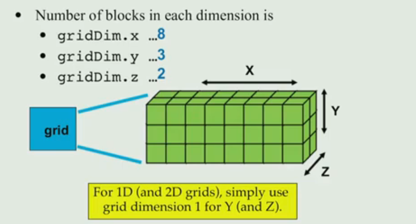


* ==Threads **within a block** cooperate via **shared memory, atiomic operations and barrier synchronoization**==

​	Threads in different blocks cooperate less


* 另一个值得注意的地方就是，CPU上，操作系统有段错误检查(seg fault check)，而GPU并没有

  > 在CPU上，操作系统通过虚拟内存管理来提供内存保护，从而实现段错误检查（seg fault check）。当一个程序试图访问它没有被授权访问的内存时，操作系统会捕获到这个错误并通常通过抛出一个段错误（seg fault）来终止程序。这是操作系统用来隔离程序和防止它们相互干扰的安全机制之一。
  >
  > 而在GPU上，这样的内存保护通常不像在CPU上那样普遍或者严格。GPU是为了高效的并行计算而设计的，所以它们的架构更加专注于计算吞吐量而非严格的内存隔离。因此，GPU上的内核（kernel）运行时可能不会提供与CPU操作系统相同水平的段错误检查。如果GPU上的程序试图访问无效的内存地址，它可能不会产生一个明显的错误，而是导致不正确的计算结果或者在某些情况下导致GPU驱动程序崩溃。
  >
  > 为了确保在GPU上运行的程序不会产生这种隐蔽的错误，开发者必须更加小心地管理内存访问，并且通常需要依靠其他调试工具来检测和修复问题。这也是为什么开发GPU加速程序通常比在CPU上开发更具挑战性的原因之一。在GPU编程中，例如使用CUDA或OpenCL时，开发者必须确保所有内存访问都在有效的内存范围内，并且核心代码（kernel code）在访问任何内存资源时都需要进行额外的检查。


## 5.2 SIMT


* All threads in a block execute the same kernel program(SPMD,single program multiple data),(only one version of code)
* Threads in the same block $\color{red}share\ data$ and $\color{red} synchronize $​ while doing their share of the work
  * 所有线程可以使用 `__syncthreads()` 函数来同步（用以让若干个warp同步）
* Threads in different blocks cannot cooperate$\color{red}( 更准确地说是can\ cooperate\ but\ expensive)$​
  * 在同一个核函数内部，**没有直接的方式来同步不同的块**。
  * **使用原子操作**：原子操作可以用来实现一些级别的跨块协调，例如通过原子加法来计数完成的块数。
  * **内核分割**：将一个复杂的问题分解为多个步骤，每个步骤用不同的核函数实现，并在它们之间同步。每个核函数的结束自然地为随后的核函数提供了同步点。
  * **CPU侧同步**：在两个需要同步的CUDA核函数调用之间，在CPU代码中加入同步操作，比如使用`cudaDeviceSynchronize()`。这个函数会阻塞CPU的执行，直到GPU完成所有先前的任务
* Blocks execute in arbitrary order(block的执行顺序不确定)
* Threads within the same block execute in warp order


## 5.3 简要GPU模型介绍

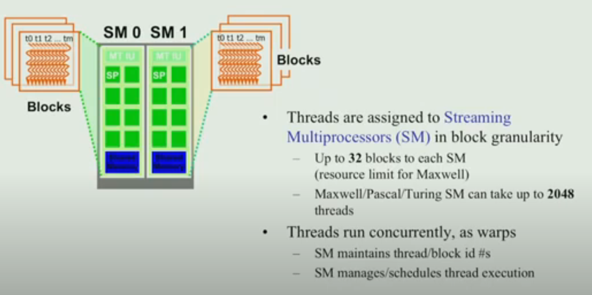

当一个内核被创建时，每个block都会被分配到一个SM上，一个SM可以有多个block。

不同的架构的GPU决定了你的block最多能有多少个threads以及你的一个SM能够最多拥有多少个block。

* 每个SM的最大线程块数量是由GPU的架构决定的固定值。例如，早期的CUDA架构可能允许每个SM运行8个线程块，而较新的架构如Volta和Turing可能允许更多。

* 线程块可以同时使用的资源数量（如寄存器、共享内存，execution hardware）也限制了一个SM可以同时运行多少个线程块。如果一个线程块占用大量资源（寄存器，共享内存），则同一个SM能够并行执行的线程块数量会减少。

* 总而言之，

  * $\color{red} 架构决定一个SM可以被分配多少个block$

  * $\color{red} 资源决定可以并行运行多少个block$

  * $\color{red} 如果有block没有被分配到SM（因为架构限制）$

    $\color{red} 那么它会在池中等待直到有可用资源（然后分配给SM）$


在SM中，**block被投入warp池，用以分配资源。**

* 线程以warp的形式并行运行：

  - SM维护线程/块的ID。
  - SM管理/调度线程的执行。

* 每个线程块以32线程的warp执行（warp的顺序）：

  - 这是一个编译器决策，不是CUDA编程模型的一部分。

  - Warp根据线性化的线程索引被划分：
    - thread0-31：warp 0
    - thread32-63：warp 1，依此类推。
    - 按X维度、Y维度然后是Z维度划分。

- Warp是SM中的调度单位。

**当一个warp需要等待一些数据（传输的很慢的数据）时**，这个warp就会被挂起，scheduler会直接选择另一个就绪的warp分配给他这个资源。这个warp即使数据到了也需要等某一个warp结束获取它的资源。

**warp没有priority。**

如下图，考虑这是一个SM，那些绿色的块代表已经就绪的warp，SM就会调度这些warps来分享这些资源（Register，L1，shared_memory)


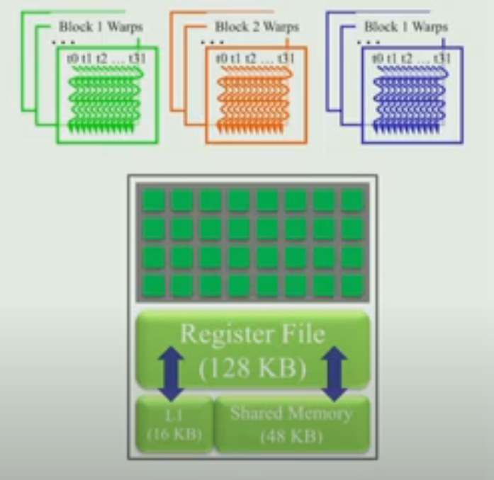


## 5.4 深入GPU内存模型

在上一节我们知道，warp没有priority，我们在设计并行算法时就认为每个thread都是处理的独立的数据。因此，warp scheduler pick一个warp是by design而不是by order。


### 5.4.1 SM pipeline

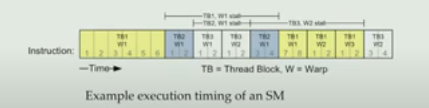

SM使用了零开销的warp切换

* 上下文切换通常是指在暂停一个线程的执行并开始执行另一个线程时，操作系统或运行时环境需要保存和恢复线程的状态信息（如寄存器值、程序计数器等）。这个过程涉及一定的时间和资源开销。

  在 CUDA 中，==没有context switching==，因为context switching总是需要时间。

  相对的，一个warp中的线程

  * 共享指令地址和一些执行状态，这意味着同一个 warp 内的线程在执行过程中状态是一致的。
  * CUDA中的warp切换也是非常快速的，==因为每个warp的状态（如寄存器状态）都是独立保存在硬件中的。当一个warp因为数据依赖等原因暂停时，调度器可以迅速切换到另一个就绪的warp进行执行，而这个切换的成本非常低。==看起来和coroutine十分相似。

  


流水线是现代处理器架构中用来提高处理速度的一种技术，通过将指令执行过程分解为多个连续的步骤，每个步骤由不同的处理器部件并行处理，从而实现高效的指令执行。

**CUDA中的SM流水线**

在NVIDIA的CUDA架构中，每个SM包含了多个核心，这些核心能够并行处理多个线程。这些线程是以warp为单位进行组织的，每个warp包含32个线程。SM的流水线允许这些warp中的指令被有效地并行执行。这里的流水线通常包括以下几个关键部分：

1. **指令获取（Instruction Fetch）**：
   - 流水线的第一步是从指令存储器中获取当前warp的指令。
2. **指令解码（Instruction Decode）**：
   - 获取的指令需要被解码或解释成具体的操作和操作数。
3. **执行（Execution）**：
   - 解码后的指令被送到执行单元，这里可能包括算术逻辑单元（ALU）、浮点单位（FPU）、特殊功能单元等。
   - 对于数据访问指令，还涉及到访问寄存器文件或通过负载/存储单元访问全局内存和共享内存。
4. **结果写回（Result Write-Back）**：
   - 执行完毕后，结果需要写回到寄存器或内存中。


**Warp调度与流水线**

==SM的流水线设计优化了warp的调度和执行，使得即使某些warp在等待内存访问或数据依赖解决时暂停执行，其他warp仍然可以继续在流水线中前进。这种设计极大地提高了执行效率和处理器的利用率，因为它减少了空闲时间和等待周期。==


### 5.4.2 Control\branch\warp divergence

考虑到SIMT的特性，一个warp内所有的线程都会被要求使用相同的控制流，这也是其并行性的来源。

但是考虑如果kernel中写了一个if的话，就会出现divergence，毕竟总有线程会走向if的另一面。

此时，为了使得他们的if之后的控制流对齐，因此需要一些thread暂停，另一些符合if的继续运行，然后反过来符合if的暂停，符合else的开始。

这意味着，==divergence直接增加了指令流的长度==，或者**可以说一次if指令的实际长度是其所有分支指令的长度之和。**

这被称为predictive execution。

warp divergence的设计透露出了GPU高效的理念：硬件层面的单指令解码，高效运行32个线程。

至于怎么设计这32个线程，这是程序员的事。


### 5.4.3 不同内存的访问时间

* Read/Write per-thread $\color{red} registers$ **(1 cycle)**
* Read/Write per-block $\color{red} shared\ memory$**(5 cycles)**
* Read/Write per-grid $\color{red}global\ memory$ **(500 cycles)**
* Read/Write per-grid $\color{red} constant\ memory$**(5 cycles with caching)**

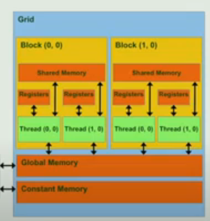


### 5.4.4 硬件角度的内存模型

在GPU中，global memory是使用DRAM存储的，而Shared Memory和Register都是用SRAM从年初的。


#### DRAM

**DRAM(动态随机存取存储器)**

* DRAM的基本存储单元由一个**电容器**和一个晶体管组成。电容器用于存储电荷（表示数据位的状态），晶体管用于控制对电容器的访问。

* 由于电容器会漏电，DRAM需要**周期性地刷新（refresh）**，即重新写入数据，以防止数据丢失。刷新周期通常为几毫秒。

* 由于结构简单，每个存储单元只需一个晶体管和一个电容器，**因此DRAM具有较高的存储密度与较低的成本**，能够在较小的芯片面积内存储更多的数据。

* **DRAM读写十分的慢**，是因为电容慢。具体来说，在读写时

  * 由于电容器存在漏电效应，DRAM需要周期性地刷新数据（通常每隔几毫秒），以确保数据不丢失。刷新操作会占用存储器的时间，影响其读写效率。

  * 必须通过晶体管对电容器进行**充电或放电**。这一过程需要一定的时间，尤其是在电容器的电荷状态非常微弱且需要精确测量的情况下。

    具体来说，DRAM采用行列地址选择的方式进行访问。每次读写操作都需要先选择行（行激活），然后再选择列进行操作。*行选择（激活）过程需要一定时间*。

    选择新的行时，又需要将原来的行放电以准备新行。

    $\color{red}因此，在随机访问时，不断地对行激活，放电占用了大量时间$

> 以下展示了DRAM读写的详细过程
>
> 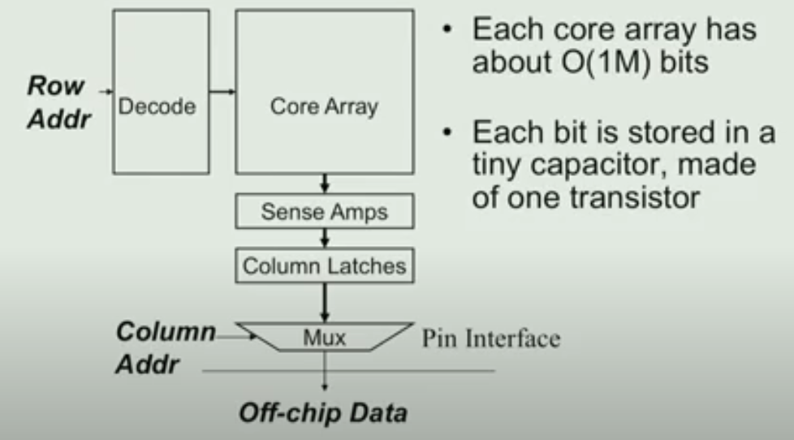
>
> * 主机将目标地址的行地址发送到DRAM
>
> * 行地址被送入行地址解码器（Row Address Decode）
>
> * 行地址解码器根据行地址激活目标行，选择DRAM核心阵列（Core Array）中的相应行，该行的所有存储单元（存储电容）被选中，准备进行读写操作
>
>   这一行通常被称为一个**page**或者一个**行缓存(row buffer)**
>
>   ==一个page的数据可以被快速访问。==
>
>   * Page Active：载入了这个行
>   * Page Hit：后续内存访问请求是请求的当前行，Page Hit不用再激活其他行
>   * Page Miss：如果后续的内存访问请求需要访问不同的行，则称为Page失误。在这种情况下，需要关闭当前行并激活新行，这会增加内存访问延迟。
>
> 
>
> * 读写操作
>   * **读取操作：**选中的行数据被送到感应放大器（Sense Amps），感应放大器检测并放大这些数据。
>   * **写入操作：**如果是写操作，数据将先暂存到列锁存器（Column Latches），等待列地址的选择。
> * 此时新的行预充电
> * 主机将目标地址的列地址部分发送到DRAM。列地址被送入多路复用器（Mux）。
> * 读写操作
>   * **读取操作：**经过放大的数据从感应放大器通过多路复用器（Mux)，进入引脚接口（Pin Interface），最终传送到外部设备。
>   * **写入操作：**写入数据从列锁存器（Column Latches)通过多路复用器(Mux)，写入选中的行列存储单元（电容）。
> * 数据传输
>   * **读取操作：**经过多路复用器(Mux)选择的数据从引脚接口传送到主机，完成读取操作。
>   * **写入操作：**数据通过引脚接口进入DRAM芯片，经过多路复用器(Mux)选择后写入选中的行列存储单元，完成写入操作。

#### DRAM bank 机制

> 后来，随着DRAM的存储容量更多，DRAM被划分成了若干个bank，每个bank独立的拥有上面所提到的这一套。
>
> 当一个地址请求进来，对应的bank的对应行会被激活。
>
> 通过多个bank的并行操作，可以同时处理多个内存请求，增加内存带宽。
>
> 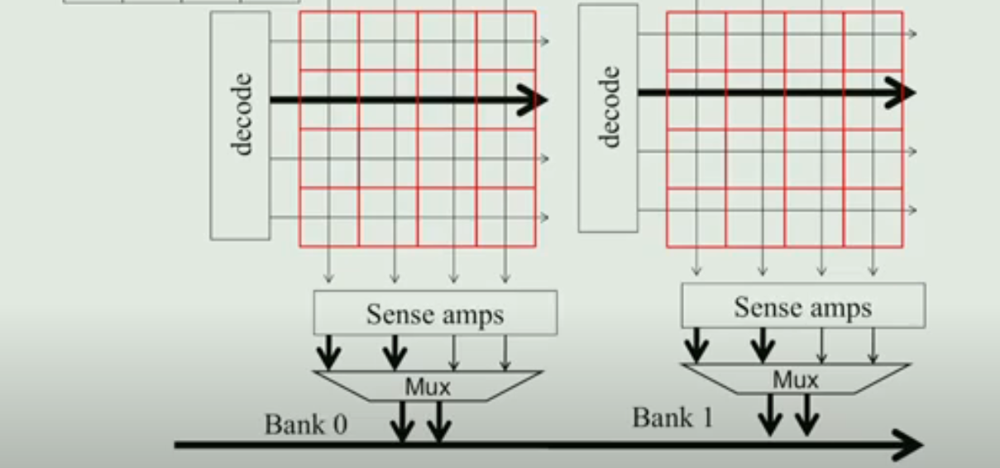
>
> 这使得如果你访问的地址位于不同的DRAM banks中，实际上是可以实现并行访问的。
>
> 在这种架构下，最坏情况的访问是对同一个bank不同行的连续访问。

#### 取代每次读一个数据：Burst传输

==Burst传输方法==

> 为了充分利用内存带宽，提出了**burst。**
>
> 在使用burst传输模式时，通常会传输一个预定长度的数据块（例如4、8或16个数据字），即使在某些情况下并不需要全部这些数据。这种方式的主要目的是提高内存带宽和数据传输效率。
>
> - 当一个burst传输请求被发出时，内存控制器会按照预定的长度连续读取或写入数据。
> - 即使处理器或设备当前只需要其中的一部分数据，burst传输也会传输整个数据块。这是因为预取多个数据字可以减少每次单独传输的控制和地址开销，提高整体传输效率。
> - 如果请求的数据量小于burst传输的长度，未使用的数据会被传输。这可能会导致某种程度上的带宽浪费，但在大多数情况下，预取机制带来的性能提升是值得的。
>
> 假设我们有一个8-word burst传输，开始地址为A：
>
> 1. **读取操作**：
>    - 处理器请求从地址A读取数据，但实际上，内存控制器会从地址A开始，连续读取8个数据字：A, A+1, A+2, A+3, A+4, A+5, A+6, A+7。
>    - 如果处理器只需要地址A和A+1的数据，A+2到A+7的数据虽然被传输，但可能暂时不被使用。
> 2. **写入操作**：
>    - 类似地，如果处理器需要写入数据到地址A，内存控制器会从地址A开始，连续写入8个数据字。
>    - 如果处理器只更新地址A和A+1的数据，其余地址的数据可能仍然被传输，尽管它们的值没有变化。
>
> 当处理器执行**向量化指令**时，需要从内存中加载一块连续的数据。为了提高数据加载效率，内存控制器会使用burst传输，从内存中预取一块数据（如4、8或16个字）。
>
> - 现代处理器的缓存系统（如L1、L2、L3缓存）通常会以burst方式从内存中预取数据。这些预取的数据块被存储在缓存中，以供后续指令快速访问。
> - 当向量化指令访问缓存中的数据时，如果数据在缓存中命中（cache hit），处理器可以非常快速地读取这些数据。

#### burst与cache line

==可以发现，burst只是传输方法，需要和cache line的最小单位属性区分。==

> **Burst不一定等于cache line**，cache line是一个固定值，代表最小的cache刷新单位。
>
> 例如一个cache line 有64个字节，确实可以直接进行**一次8-word burst传输**(1 word 8 byte)的，但是也存在使用**两次4-word burst传输(**1word 8byte)的情况，
>
> 或者，就是普通的**8次1word burst传输**
>
> 假设处理器需要从内存地址A开始读取一个数据字，且该数据字不在缓存中（cache miss），缓存行需要从内存加载到缓存：
>
> 1. **缓存行对齐**：
>    - 假设地址A位于一个缓存行的起始位置，或者需要加载的缓存行对齐到64字节边界。
>    - 地址A所在的缓存行为64字节，从A开始到A+63。
> 2. **第一次Burst传输**：
>    - 内存控制器发起一个4-word（32字节）的burst传输。
>    - 从地址A开始，连续读取4个8字节的数据字（word），即读取地址范围A到A+31的内容。
>    - 这些数据被加载到缓存行的前半部分（32字节）。
> 3. **第二次Burst传输**：
>    - 为了完成整个64字节缓存行的加载，内存控制器**需要再发起一次4-word**（32字节）的burst传输。
>    - 从地址A+32开始，连续读取4个8字节的数据字（word），即读取地址范围A+32到A+63的内容。
>    - 这些数据被加载到缓存行的后半部分（32字节）。


#### SRAM

**SRAM（静态随机存取存储器）**

* SRAM的基本存储单元由多个晶体管（通常是六个）组成，不需要电容器。**这种结构能够保持数据状态**，直到电源被关闭。
* SRAM通过晶体管保持数据状态，不需要像DRAM那样定期刷新。因此，SRAM被称为“静态”存储器。
* 每个存储单元需要多个晶体管，导致存储密度较低，占用更多芯片面积。
* **SRAM的读写很快**，这是因为
  * **由于没有刷新需求，SRAM具有更快的读写速度和更低的访问延迟。**
  * SRAM存储单元直接通过晶体管切换状态，事实上SRAM的六个晶体管组成了一个触发器电路(flip-flop)，这使得它不需要像DRAM那样又复杂的行列选择和充放电过程。
  * **SRAM还能同时执行多个存储单元的读写**，即支持高并发访问。


## 5.5 矩阵乘

### 5.5.1 基础矩阵乘-Mapping data

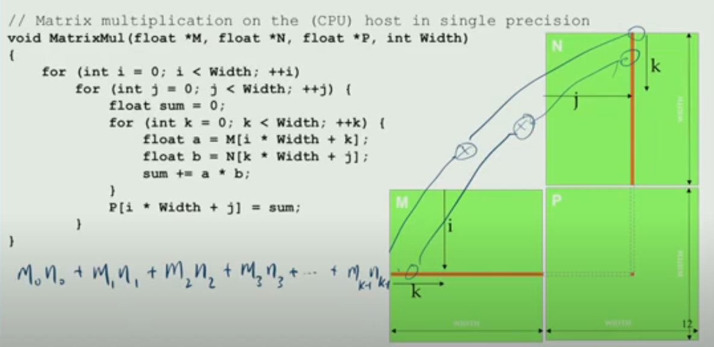

以上是在CPU的实现，而下面是在GPU的实现

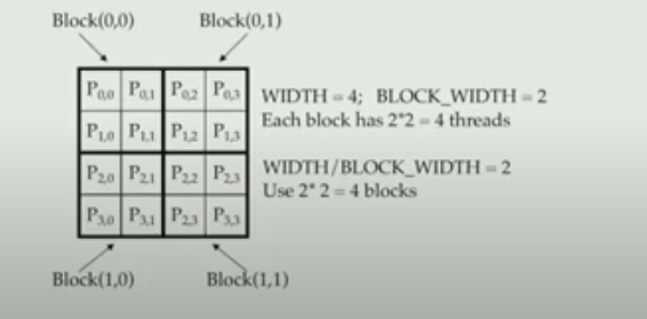

为什么采用子矩阵作为block处理的对象而非一行或者一列作为对象呢？

从下图可以发现，记$A\times B = C$，C的一个子矩阵(例如$C_{1,1},C_{1,2},C_{2,1},C_{2,2}$)需要的仅仅是A矩阵的第一第二行和B矩阵的第一第二列。

如果你一个block处理一行C，那么你需要导入的就是A的对应的一行和整个B，事实上这高下立判。

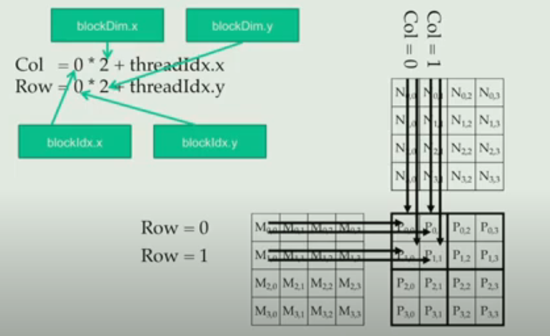

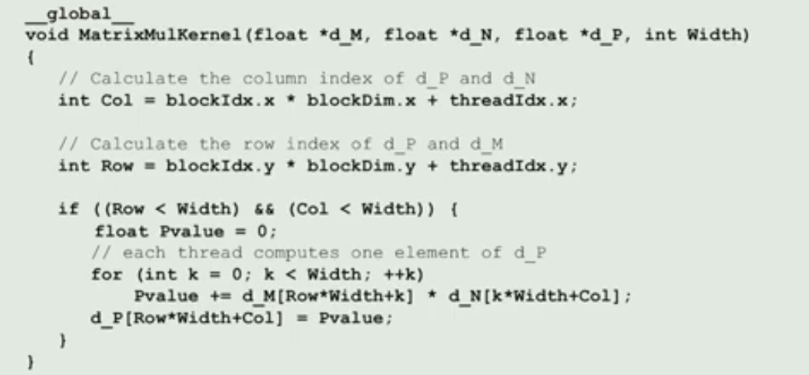


考虑之前的数据都是存在Global memory中的，因此read/write很慢。

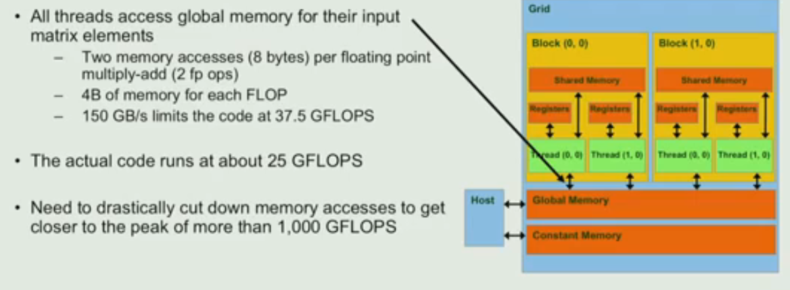


### 前置知识：Atomic 操作

考虑一个简单的kernel

```c++
__global__ void add(int* x){
    *x++;
}

add<<<1,128>>>(&x);
```

不难看出，首先因为warp的存在，可能的结果应该是{1,2,3,4}这其中一种

因为*x++本质上包括了

* LOAD to register1
* ADD on register1(register1 = register1 + 1)
* STORE to x

这样，因为data race，实际上结果是不可控的，更不要说还有warp


解决方法是考虑一个将这三个操作打包成一个单元操作，并在这个单元操作占用x时锁住x，这样我们就能获得128了，这个操作就是Atomic操作

```c++
__global__ void add(int* x){
    atomicAdd(*x,1);
}

add<<<1,128>>>(&x);
```


### 5.5.2 tiling:Using shared_memory

#### 5.5.2.1Naive kernel 数值表现

以下是一个CPU version 乘法，你可以发现它实际上也有类似的+=，这就是我们在后面需要解决的。

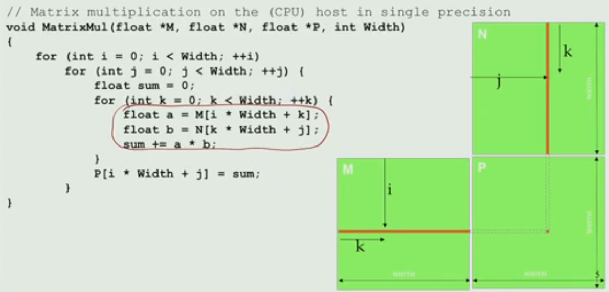

考虑一个8*8的矩阵，我们将其数据mapping到GPU上，应该是分成四个block，每个block管理一个`4*4`的子矩阵输出，也就是每个block有16个线程。

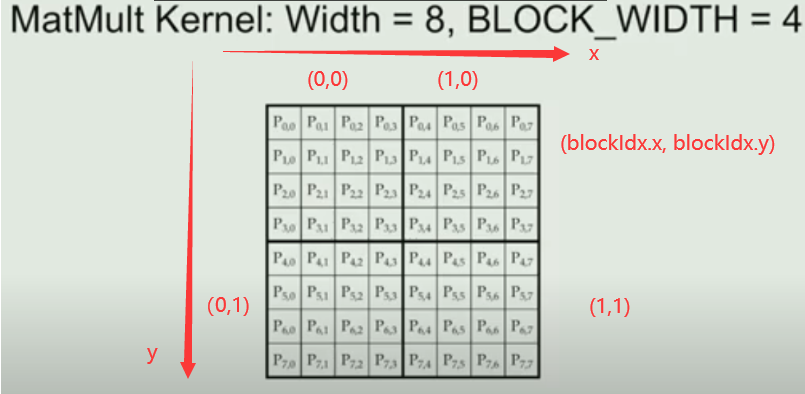

然后就可以写出一个naive kernel，需要注意的是GPU中x代表的其实是col坐标维度，y代表的是row坐标维度

```c++
//d_M左矩阵，d_N右矩阵,d_P结果矩阵
__global__ void MatrixMulKernel(float* d_M, float* d_N, float* d_P, int Width){
    // The col_index this thread calculate
    int col = blockIdx.x * blockDim.x + threadIdx.x;
    
    // row_index this thread calculate
    int row = blockIdx.y * blockDim.y + threadIdx.y;
    
    
    if((Row < Width) && (Col < Width)){
        float Pvalue = 0;
        for(int k = 0;k < Width;k++){
            Pvalue += d_M[Row * Width + k] * d_N[k * Width + col];
        }
        d_P[Row * Width + Col] = Pvalue;
    }
}
```

1. **浮点运算**：在代码中，所有线程都直接从全局内存（Global Memory）中读取输入矩阵 `d_M` 和 `d_N` 的元素。

   只关注浮点运算的话，实际上是两次LOAD操作与一次multiply-add操作

   1. 在每次浮点乘加操作（即 FMA，floating-point multiply-add）中，需要访问内存两次，每次访问4字节（因为每个浮点数通常占4字节），总共8字节。
   2. 浮点乘加操作是指一次操作中完成一次乘法和一次加法，这是矩阵乘法中每个元素计算所必需的操作。例如，计算$c = a\times b + c$，它需要两次浮点运算操作，因此是`2 floating point operations`


因此，每进行一个浮点运算操作(FLOP)，平均需要4字节的内存访问(8byte / 2fp ops)。

这表明，如果你的内存带宽为150 GB/s，代码的性能上限是 (150GB / 4byte) FLOPS，也就是37.5GFLOPS，这就是带宽限制计算的典型例子。

> 内存带宽的讨论通常涵盖多个不同层次的数据传输路径，包括从内存到各级缓存（如L1、L2、L3缓存）以及到寄存器的数据传输。每一层的带宽和访问速度都有所不同，并且对整体系统性能有显著影响。
>
> 此处讨论的是GPU中Global Memory->Register

实际上，代码跑的时候可能是25GFLOPS（Nsight测得），毕竟内存带宽没有占满，子函数有计算瓶颈。


为了接近超过1000 GFLOPS的峰值性能，需要大幅减少内存访问次数。这意味着优化代码，减少每次计算所需的数据传输，以更好地利用GPU的计算资源。这可能涉及使用更多的寄存器和共享内存，减少对全局内存的依赖，以及优化算法以减少冗余计算和内存操作。


#### 5.5.2.2 访存瓶颈

考虑第0个block，实际上它使用了左矩阵$0-3$行，右矩阵$0-3$列

对于每个thread，它需要Width次`d_M`,`d_N`读取。

如果不修改，那么读取的总时间实际上可以表示为

总通讯时间=`global_to_register_time * Width`

实际上，我们可以将这个thread所需要的数据都传到shared_memory中，那么总通讯时间就变成了

总通讯时间=`global_to_shared_memory_time + Width * shared_memory_to_register_time`

>  这里简化了将元素从全局内存拷贝到共享内存的time，它实际上是由一个block内的所有thread同时一个一个拷贝过来的，如果记每个thread搬运k个，那么实际上应该是
>
> `global_to_shared_memory_time * k`
>
> 当然使用向量化，例如向量化float4(满足cache line为128),k还能减少4倍


==可以发现，这里使用shared_memory是因为两个关键因素==

* 线程对于一个数据的复用，使用shared_memory减少了对global_memory的访问
* 线程之间共享这部分数据（这也意味着shared_memory能够拥有更高的利用率)

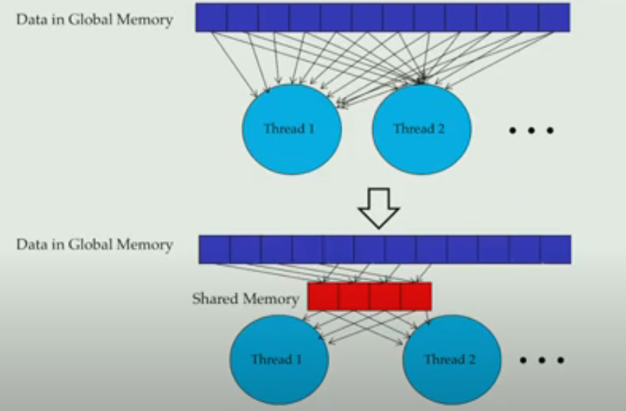


#### 初级思想（弃用）

考虑到我们之前提到的复用，实际上我们每个block对应的是左矩阵的若干行和右矩阵的若干列（当然你可以存储为行以Packing数据，也就是优化存储局部，也就是对左矩阵packing，然后对两个矩阵做tiling）

实际上，如果你的矩阵很大，你甚至可以计算$C[i][j]$的一部分，然后不同block累加起来，也就是上图所示，将行，列均匀分成$p$份，这样你就可以安排p个block来处理

$c[i][j] =\sum_{block_{id}}\sum_p (left\_matrix[i][k_{block_{id},p}] * right\_matrix[k_{block_{id},p}][j])$

这个式子的意义是最终结果$C[i][j]$的答案是每个处理它的$block_{id}$的值加起来，其中$k_{block_{id},p}$​代表的是第block_id个block处理的第p个乘积，这代表了全局视角下的某一个加数。

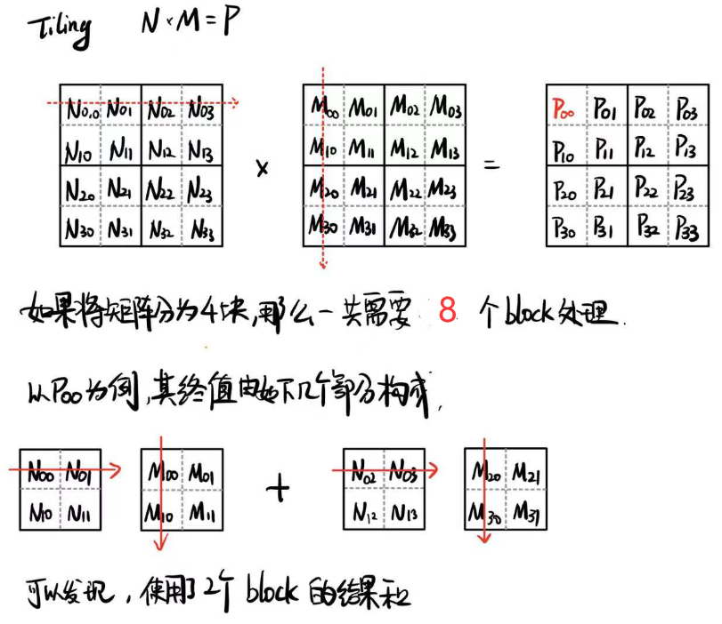

每个block分别是

* N(0,0) M(0,0)
* N(0,1) M(1,0)
* N(0,0) M(0,1)
* N(0,1) M(1,1)
* N(1,0) M(0,0)
* N(1,1) M(1,0)
* N(1,0) M(0,1)
* N(1,1) M(1,1)

不难发现，如果左矩阵将行分为$l$份,列分为$c$份

左矩阵的形状为$(M,K)$，右矩阵为$(K,N)$

因此一共需要$\frac{K}{l}\cdot\frac{M}{c} \cdot\frac{M}{c}$ 


更常见的说法是，我们称分配后的每个块的宽度为tile width($\frac{M}{c}$)


####  5.5.2.3 标准做法-Tiling与`__synchronize()`

==主要的思想是一个线程完成一个结果的计算==

==次要思想是将一个向量分成n份来计算==

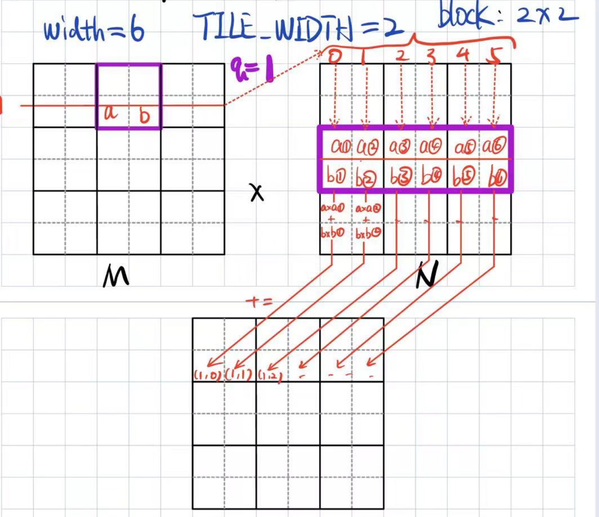

实际上思想很巧妙，我们目前以一个$6*6$矩阵为例，传入的Width就是矩阵的维度，目前不考虑$n*m$​的矩阵

首先，我们需要用到的线程数和所有的元素数一致，我们设计TILE_BLOCK为$2*2$，因此kernel的启动参数为
$$
girdSize = (3*3),blockSize=(2*2)
$$
即为block和TILE_BLOCK形状一致


然后，我们可以发现，图中第一行TILE_BLOCK，q=1的TILE_BLOCK，所需要计算的对象是第q行的所有TILE_BLOCK。==这里的q帮助我们定位了了M和N中需要计算的子矩阵位置。==

因此我们可以给出如下流程，来代表每个kernel的计算

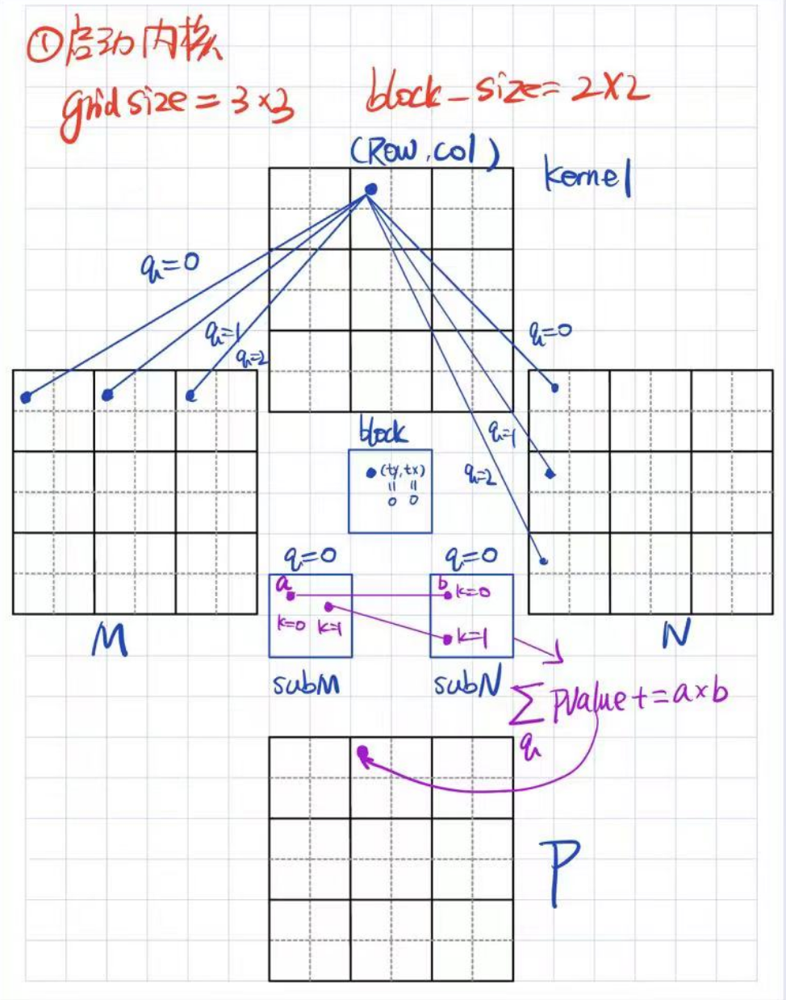


在上图中，kernel中的某一个线程，它对应的全局坐标为(`TILE_WIDTH==blockDim.x==blockDim.y`)
$$
Row = blockIdx.y * TILE\_WIDTH + threadIdx.y
\\
Col = blockIdx.x * TILE\_WIDTH + threadIdx.x
$$
==我们期望每个线程直接算出它对应位置的值，直接赋值给P(Row,Col)==

我们可以发现，对于(Row,Col)，我们只需要迭代的计算点积和即可。

在上图中的例子，

* 加载q=i的block，M加载的是(0,i)的TILE_BLOCK，N加载的是(i,0)的TILE_BLOCK
* 对这两个TILE_BLOCK执行局部运算，具体就是，
  * $k < TILE\_WIDTH$
  * 在M的subMatrix中，选取$(threadIdx.y,k)$的点
  * 在N的subMatrix中，选取$(k,threadIdx.x)$​的点
  * 点积，加到PValue中,k++

这个方式**使用threadIdx.y来在subM矩阵中定位所需**，使**用threadIdx.x来在subN矩阵中定位所需**，利用k来完成点积，这一点是十分容易从向量乘中发现这个规律的。

忽略q的话，其实就是两个一维向量点积。

> 这里的关键在于，在q=i的时候，一个block内一次load实际上是将这个block所需要的所有数据都load进来了
>
> 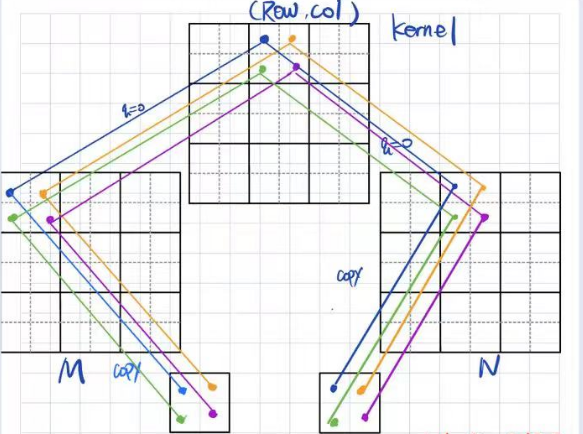
>
> 然后，下一次q=i+1的时候，shared_memory刷新为下一次block需要的所有数据
>
> 不难发现，相比于以前每个线程都要从全局内存自己取所有的值，这个方法每个线程少取了(TILE_SIZE-1)次，只需要从全局内存读取1次，然后从shared_memory读取剩下的(TILE_SIZE-1)次

> 接下来以q=1为例，说明这个位置的线程读取M和N的哪些位置，这里有一个点很值得关注
>
> ==对于最终P矩阵的(Row,Col)位置，其一定使用了第Row行的M矩阵和第Col列的N矩阵，因此这里实际也可以参考这个思想，**Row来约束M，Col来约束N，然后用q来读取M的一整行和N的一整列**==
>
> 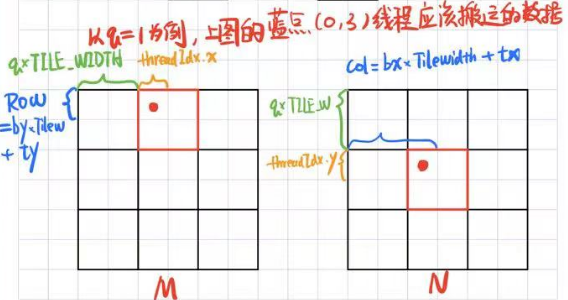


```c++

__global__ void MatrixMulKernel(float* M, float* N, float* P, int Width){
    __shared__ float subTileM[TILE_WIDTH][TILE_WIDTH];
    __shared__ float subTileN[TILE_WIDTH][TILE_WIDTH];
    
    int Row = blockIdx.y * TILE_WIDTH + threadIdx.y;//行Idx
    int Col = blockIdx.x * TILE_WIDTH + threadIdx.x;//列idx
    // 计算过程中间结果
    float Pvalue = 0;
    
    // 对一列上的每个TILE
    for(int q = 0; q < Width/TILE_WIDTH;q++){
        subTileM[threadIdx.y][threadIdx.x] = M[Row * Width + (q*TILE_WIDTH + threadIdx.x)];
        subTileN[threadIdx.y][threadIdx.x] = N[(q*TILE_WIDTH + threadIdx.y)*Width + Col];
        
        // 同步一个block中的所有warp的加载操作，因为我们后续要用到一个block的所有数据
        __syncthtreads();
        
        for(int k = 0;k < TILE_WIDTH;++k){
            Pvalue += subTileM[threadIdx.y][k] * subTileN[k][threadIdx.x];
        }
        
        // 你必须等待所有人使用完数据之后才能重新写入，不然出大问题
        __syncthreads();
    }
    P[Row*Width+Col]=Pvalue;
    
    
}
```


#### 5.5.2.4 TILING的数值表现与Tradeoff

之前提到，你一个线程实际上少LOAD (TILE_SIZE-1)次，因此相对的我们可以说**每次访问global memory获得的数据被使用了TILE_SIZE次**


之前说过，一个浮点运算平均需要4byte内存，因此之前的带宽被限制在了（150/4）GFLOPS

现在，因为我们一次load能使用TILE_SIZE次，因此我们的计算能力实际提升到了

$150/4*TILE\_SIZE$ GFLOPS


此处有一些Tradeoff需要注意，TILE_SIZE看起来是越大越好，但是不要忘了shared_memory是有限的，你存入的是$TILE\_SIZE^2$的数据，这导致了你的**每个SM因为资源限制，被分配的block变少了**。这会导致一系列连锁反应

* 可能一个SM的资源总量为N，你一个block是N/2+1，大大浪费了资源，导致有些block直接在等待，使得效率大大下降

* block越大，synchronize的cost就越大，因为总会有一些warp出问题，可能一些warp都在等了，另一些warp还没获得资源开始。

* 考虑一个更普遍的情况，你的SM中block数量变少了，这代表你block内synchronize时候，有fewer opportunities to fill the gap。

  例如一个block的有些warp在synchronize等待，它释放了资源，结果发现其他block中待调度warp也很少，会导致有一段时间，计算资源根本没有拉满。如果block多的话这个情况的概率就很小了。


#### 5.5.2.5 查询GPU信息

因此，你最好查询一下你的GPU的架构

```c++
	int deviceCount;
    cudaGetDeviceCount(&deviceCount);  // 获取设备数量

    // 遍历每个设备
    for (int i = 0; i < deviceCount; i++) {
        cudaDeviceProp devProp;
        cudaGetDeviceProperties(&devProp, i);  // 获取设备属性

        // 输出所需的设备信息
        std::cout << "Device " << i << ":\n";
        std::cout << "  Max Threads Per Block: " << 			devProp.maxThreadsPerBlock << "\n";
        std::cout << "  Shared Memory Per Block: " << devProp.sharedMemoryPerBlock << " bytes\n";
    }

```

> 每个块的最大共享内存大小确实受限于GPU上单个流处理器（SM, Streaming Multiprocessor）的总共享内存容量，但这并不意味着一个块的最大共享内存大小等同于单个SM的全部共享内存资源。
>
> 每个SM拥有一定量的共享内存，这个量是固定的，根据具体的GPU型号而定。这个共享内存需要被该SM上运行的所有活跃块共同使用。
>
> 单个块可以使用的最大共享内存是受限的，**通常远低于SM的总共享内存容量**。这是因为一个SM通常会同时运行多个块，所以必须在它们之间共享SM的共享内存资源。
>
> 一个SM可以同时执行多个块，而这些块的总共享内存需求不能超过SM的共享内存总容量。


#### 5.5.2.6 更通用的矩阵乘法：考虑TILE_SIZE不能够整除

考虑一个$3*3$的矩阵需要$2*2$的TILE_SIZE

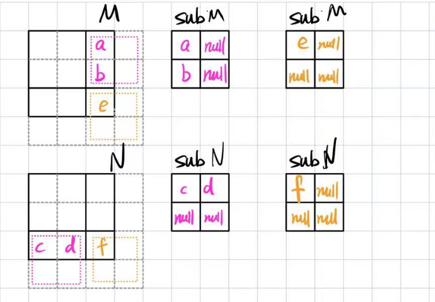

一个简单的想法就是，将这个矩阵padding成符合算法的形状，让所有线程都计算（以减少divergence），然后选择性的填入到输出矩阵即可。


```c++
// q向上取整
for(int q = 0;q < (ceil((float)Width/TILE_WIDTH));++q){
    // 搬运M时考虑有效数据的范围
    if(Row < Width && (q*TILE_WIDTH + threadIdx.x) < Width){
        subTileM[threadIdx.y][threadIdx.x]=M[Row*Width + q*TILE_WIDTH + threadIdx.x];
    }else{
        //填充0以免影响结果
        subTileM[threadIdx.y][threadIdx.x] = 0;
    }
    
    
    
    //搬运N时考虑有效数据的范围
    if(Col < Width && (q*TILE_WIDTH+threadIdx.y) < Width)
	    subTileN[(q*TILE_WIDTH + threadIdx.y) * Width + Col];
    else{
        subTileN[threadIdx.y][threadIdx.x] = 0;
    }
    
    
    __syncthreads();
    
    for(int k = 0;k < TILE_WIDTH;k++){
        Pvalue+= subTileM[threadIdx.y][k] * subTileN[k][threadIdx.x];
    }
    
    __syncthreads();  
}

if(Row < Width && Col < Width){
    P[Row*Width + Col] = Pvalue;
}
```

这里选择先计算，在赋值时采用if，理论上和计算时使用if选择性计算的性能是一样的，但是更加方便理解。


### 5.6 内存事务优化

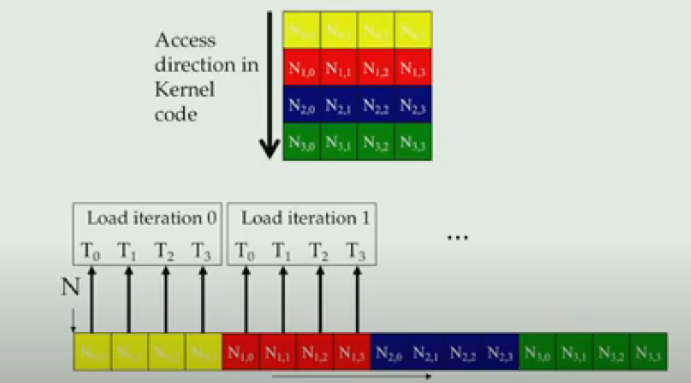

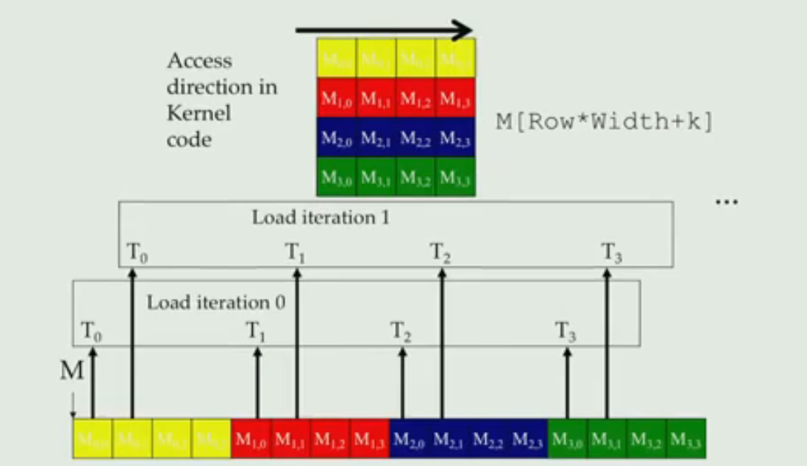

在CUDA中，矩阵永远是被展开存储的，在5.4.4的DRAM结构中我们可以发现，我们希望访问的是连续值。

考虑Naive kernel中，直接从global memory读取（DRAM读取）

左矩阵永远是连续访问的，而右矩阵是离散访问的。在矩阵足够大（只要一行存储需求超过128字节吧），那么按列访问一定是更差的，这会导致更多的load时间，或者说更多的cache miss。


#### 内存事务

内存事务（Memory Transaction）是指在内存系统中，一次完整的内存访问操作（包括读事务Read Transaction和写事务Write Transaction），包括从发出请求到完成数据传输的全过程。

* GPU/CPU发出内存访问请求，指定目标地址和操作类型（READ/WRITE)
* Memory Controller解析内存地址，获得内存中的行列坐标
* Memory Controller生成相应的内存访问命令(READ WRITE)
* Memory Controller从内存读取数据或将数据写入内存
* Memory Controller通知GPU/CPU内存事务结束

> 注意，
>
> CPU中，每次发生Cache miss，==就会要求一次以所需数据为首，cache line大小的内存行读取。==
>
> GPU中，因为是手动管理的Shared memory，因此实际上是==按内存事务为单位传输的==（当然内存事务一般最大也是128byte）。如果内存事务无法合并，仍然只会每次传输当前内存事务（就算只有一个值）

下图就展示了一次读写的过程，可以对应上面的流程。

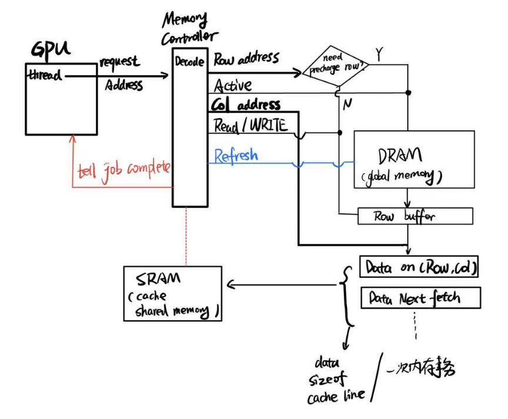

```
CPU -> Memory Controller: Read Request (Address A)
Memory Controller: Decode Address (Row A, Column A)
Memory Controller: ACTIVATE Row A
Memory Controller: READ Column A
Memory Controller -> CPU: Data from Address A
```


##### **内存事务合并**

由于GPU以warp为基础执行单位，Nvidia为GPU提供了内存事务合并的功能。

内存事务合并是**内存控制器自发进行的优化过程(burst传输)**。

* **地址解码的角度**

  * **没有内存事务合并时**，每个内存访问请求都会独立解析地址，并生成相应的内存访问命令。这意味着多个独立请求需要多次行激活（ACTIVATE）和列访问（READ/WRITE）操作，增加了开销。

  * **通过内存事务合并**，内存控制器可以将连续的内存访问请求**合并成一个请求**，只需**解析一次地址**，并生成一次内存访问命令，从而减少多次行激活和列访问的开销。

* **数据传输的角度**

  * **没有内存事务合并时**，每个内存访问请求都会独立进行数据传输，导致内存总线频繁切换，每次传输都需要单独的时间。
  * **通过内存事务合并**，多个请求被合并为一个整体进行传输，减少内存总线切换的次数和时间。通过一次连续的数据传输，可以更高效地利用内存总线带宽。


> ```
> //假设有如下内存请求
> Request 1: Read from Address A
> Request 2: Read from Address A+4
> Request 3: Read from Address A+8
> Request 4: Read from Address A+12
> ```
>
> #### 合并前
>
> 假设有4个独立的内存读取请求，地址分别为A、A+4、A+8、A+12：
>
> 1. **地址解析和命令生成**：
>    - 4次独立的地址解析和命令生成。
>    - 可能涉及4次行激活和列读取操作。
> 2. **数据传输**：
>    - 4次独立的数据传输。
>    - 每次传输之间需要切换内存总线，增加了额外的开销。
>
> ```
> GPU -> Memory Controller: Read A
> Memory Controller: Decode A (Row R1, Column C1)
> Memory Controller: ACTIVATE Row R1
> Memory Controller: READ Column C1
> Memory Controller -> CPU: Data from A
> 
> CPU -> Memory Controller: Read A+4
> Memory Controller: Decode A+4 (Row R1, Column C2)
> Memory Controller: ACTIVATE Row R1 (if not already active)
> Memory Controller: READ Column C2
> Memory Controller -> CPU: Data from A+4
> 
> ... (similar for A+8 and A+12)
> 
> ```
>
> 
>
> #### 合并后
>
> 内存控制器检测到这4个请求的地址是连续的，可以合并成一个内存事务：
>
> 1. **地址解析和命令生成**：
>    - 1次地址解析和命令生成。
>    - 1次行激活和列读取操作。
> 2. **数据传输**：
>    - 1次连续的数据传输。
>    - 减少了内存总线的切换开销，提高了数据传输效率。
>
> ```
> GPU -> Memory Controller: Read A, A+4, A+8, A+12 (coalesced request)
> Memory Controller: Decode A (Row R1, Column C1-C4)
> Memory Controller: ACTIVATE Row R1
> Memory Controller: READ Columns C1, C2, C3, C4
> Memory Controller -> CPU: Data from A, A+4, A+8, A+12
> ```


#### 内存事务合并如何减少时间

==内存事务合并在如下几个方面减少了时间==

* **减少行激活次数**：减少了行激活请求/询问次数，
* **减少列访问延迟**：合并后的请求在同一行内**连续读取多个列的数据**，减少了每次单独列访问的延迟。
* **提高总线利用率**：一次连续的数据传输减少了总线切换次数


#### 内存事务合并与Burst传输的关系

事实上，内存事务合并可以看作一个**Burst传输请求**，只要你传入连续地址的读写，Memory Controller就会自动的用Burst帮你合并。

==它令内存控制器发送一个连续的读写命令，而非多个（行请求，列请求）命令对。==

简单就是，只需一次地址解析

```
// 普通的Request
GPU -> Memory Controller: Read A
Memory Controller: Decode A, ACTIVATE Row, READ Column
Memory Controller -> CPU: Data from A

GPU -> Memory Controller: Read A+4
Memory Controller: Decode A+4, ACTIVATE Row, READ Column
Memory Controller -> CPU: Data from A+4

... (similar for A+8 and A+12)


// Burst mode Request
GPU -> Memory Controller: Read A to A+12 (burst request)
Memory Controller: Decode A, ACTIVATE Row
Memory Controller: READ Columns (A to A+12) in burst mode
Memory Controller -> CPU: Data from A, A+4, A+8, A+12

```


#### 内存事务的对齐

假设我们有一个内存系统，内存控制器处理64字节对齐的访问请求。

**如果内存请求地址是64的倍数，并且请求大小是64字节的整数倍**，那么该请求是对齐的：

```
Request: Address = 0x100, Size = 64 bytes
Aligned Access: Address 0x100 is 64-byte aligned
Memory Controller can handle this request in one transaction

```

如果内存请求地址不是64的倍数，或者请求大小不是64字节的整数倍，那么该请求是不对齐的


**当内存访问请求不对齐时，内存控制器需要进行多个事务来处理这个请求。**

假设我们有一个64字节对齐的内存系统，每个内存事务可以处理一个64字节的内存块。

如果内存请求不对齐，例如请求从地址0x108开始读取64字节数据

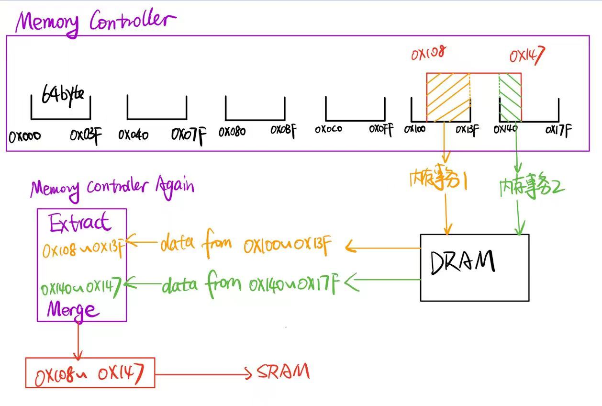

我们可以发现，它这段数据横跨了两个对齐的64byte读取块，

1. **确定请求的内存块**：
   - 内存控制器首先确定请求跨越的内存块。
   - 对于地址0x108开始的64字节请求，它跨越了两个64字节对齐的内存块：一个是从0x100到0x13F，另一个是从0x140到0x17F。
2. **分解请求**：
   - 由于请求跨越了两个内存块，内存控制器需要将其**分解成两个独立的内存事务。**
   - 第一个内存事务读取地址0x100到0x140的内存块。
   - 第二个内存事务读取地址0x140到0x180的内存块。
3. **执行多个内存事务**：
   - 内存控制器分别执行这两个内存事务，读取每个内存块的数据。
4. **组合数据**：
   - 内存控制器将两个内存块中所需的部分组合起来，形成最终的请求数据。


#### 对齐数据结构与内存分配(C++)

```c++

```

