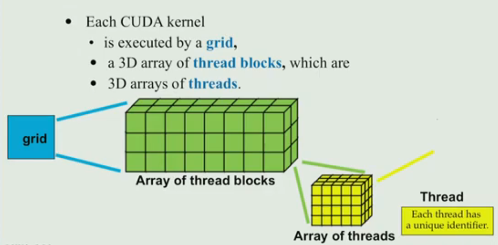

## 5.1 CUDA Execution Model

注意x,y维度，别混淆为高x,长y，厚z

* ==Threads **within a block** cooperate via **shared memory, atiomic operations and barrier synchronoization**==

​	Threads in different blocks cooperate less

* 另一个值得注意的地方就是，CPU上，操作系统有段错误检查(seg fault check)，而GPU并没有

  > 在CPU上，操作系统通过虚拟内存管理来提供内存保护，从而实现段错误检查（seg fault check）。当一个程序试图访问它没有被授权访问的内存时，操作系统会捕获到这个错误并通常通过抛出一个段错误（seg fault）来终止程序。这是操作系统用来隔离程序和防止它们相互干扰的安全机制之一。
  >
  > 而在GPU上，这样的内存保护通常不像在CPU上那样普遍或者严格。GPU是为了高效的并行计算而设计的，所以它们的架构更加专注于计算吞吐量而非严格的内存隔离。因此，GPU上的内核（kernel）运行时可能不会提供与CPU操作系统相同水平的段错误检查。如果GPU上的程序试图访问无效的内存地址，它可能不会产生一个明显的错误，而是导致不正确的计算结果或者在某些情况下导致GPU驱动程序崩溃。
  >
  > 为了确保在GPU上运行的程序不会产生这种隐蔽的错误，开发者必须更加小心地管理内存访问，并且通常需要依靠其他调试工具来检测和修复问题。这也是为什么开发GPU加速程序通常比在CPU上开发更具挑战性的原因之一。在GPU编程中，例如使用CUDA或OpenCL时，开发者必须确保所有内存访问都在有效的内存范围内，并且核心代码（kernel code）在访问任何内存资源时都需要进行额外的检查。

