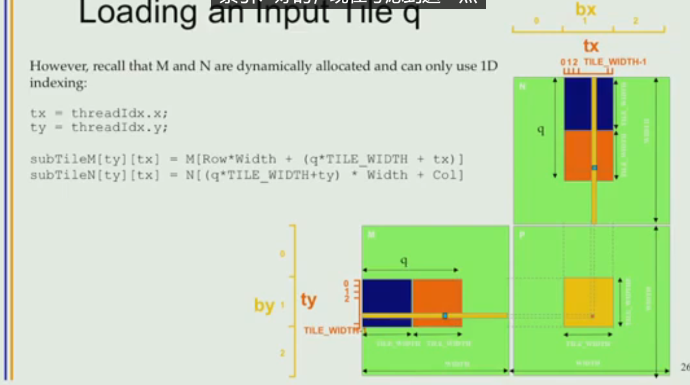

## 5.1 CUDA Execution Model


注意x,y维度，别混淆为高x,长y，厚z


* ==Threads **within a block** cooperate via **shared memory, atiomic operations and barrier synchronoization**==

​	Threads in different blocks cooperate less


* 另一个值得注意的地方就是，CPU上，操作系统有段错误检查(seg fault check)，而GPU并没有

  > 在CPU上，操作系统通过虚拟内存管理来提供内存保护，从而实现段错误检查（seg fault check）。当一个程序试图访问它没有被授权访问的内存时，操作系统会捕获到这个错误并通常通过抛出一个段错误（seg fault）来终止程序。这是操作系统用来隔离程序和防止它们相互干扰的安全机制之一。
  >
  > 而在GPU上，这样的内存保护通常不像在CPU上那样普遍或者严格。GPU是为了高效的并行计算而设计的，所以它们的架构更加专注于计算吞吐量而非严格的内存隔离。因此，GPU上的内核（kernel）运行时可能不会提供与CPU操作系统相同水平的段错误检查。如果GPU上的程序试图访问无效的内存地址，它可能不会产生一个明显的错误，而是导致不正确的计算结果或者在某些情况下导致GPU驱动程序崩溃。
  >
  > 为了确保在GPU上运行的程序不会产生这种隐蔽的错误，开发者必须更加小心地管理内存访问，并且通常需要依靠其他调试工具来检测和修复问题。这也是为什么开发GPU加速程序通常比在CPU上开发更具挑战性的原因之一。在GPU编程中，例如使用CUDA或OpenCL时，开发者必须确保所有内存访问都在有效的内存范围内，并且核心代码（kernel code）在访问任何内存资源时都需要进行额外的检查。


## 5.2 SIMT


* All threads in a block execute the same kernel program(SPMD,single program multiple data),(only one version of code)
* Threads in the same block $\color{red}share\ data$ and $\color{red} synchronize $​ while doing their share of the work
  * 所有线程可以使用 `__syncthreads()` 函数来同步（用以让若干个warp同步）
* Threads in different blocks cannot cooperate$\color{red}( 更准确地说是can\ cooperate\ but\ expensive)$​
  * 在同一个核函数内部，**没有直接的方式来同步不同的块**。
  * **使用原子操作**：原子操作可以用来实现一些级别的跨块协调，例如通过原子加法来计数完成的块数。
  * **内核分割**：将一个复杂的问题分解为多个步骤，每个步骤用不同的核函数实现，并在它们之间同步。每个核函数的结束自然地为随后的核函数提供了同步点。
  * **CPU侧同步**：在两个需要同步的CUDA核函数调用之间，在CPU代码中加入同步操作，比如使用`cudaDeviceSynchronize()`。这个函数会阻塞CPU的执行，直到GPU完成所有先前的任务
* Blocks execute in arbitrary order(block的执行顺序不确定)
* Threads within the same block execute in warp order


## 5.3 简要GPU模型介绍


当一个内核被创建时，每个block都会被分配到一个SM上，一个SM可以有多个block。

不同的架构的GPU决定了你的block最多能有多少个threads以及你的一个SM能够最多拥有多少个block。

* 每个SM的最大线程块数量是由GPU的架构决定的固定值。例如，早期的CUDA架构可能允许每个SM运行8个线程块，而较新的架构如Volta和Turing可能允许更多。

* 线程块可以同时使用的资源数量（如寄存器、共享内存，execution hardware）也限制了一个SM可以同时运行多少个线程块。如果一个线程块占用大量资源（寄存器，共享内存），则同一个SM能够并行执行的线程块数量会减少。

* 总而言之，

  * $\color{red} 架构决定一个SM可以被分配多少个block$

  * $\color{red} 资源决定可以并行运行多少个block$

  * $\color{red} 如果有block没有被分配到SM（因为架构限制）$

    $\color{red} 那么它会在池中等待直到有可用资源（然后分配给SM）$


在SM中，**block被投入warp池，用以分配资源。**

* 线程以warp的形式并行运行：

  - SM维护线程/块的ID。
  - SM管理/调度线程的执行。

* 每个线程块以32线程的warp执行（warp的顺序）：

  - 这是一个编译器决策，不是CUDA编程模型的一部分。

  - Warp根据线性化的线程索引被划分：
    - thread0-31：warp 0
    - thread32-63：warp 1，依此类推。
    - 按X维度、Y维度然后是Z维度划分。

- Warp是SM中的调度单位。

**当一个warp需要等待一些数据（传输的很慢的数据）时**，这个warp就会被挂起，scheduler会直接选择另一个就绪的warp分配给他这个资源。这个warp即使数据到了也需要等某一个warp结束获取它的资源。

**warp没有priority。**

如下图，考虑这是一个SM，那些绿色的块代表已经就绪的warp，SM就会调度这些warps来分享这些资源（Register，L1，shared_memory)


## 5.4 深入GPU内存模型

在上一节我们知道，warp没有priority，我们在设计并行算法时就认为每个thread都是处理的独立的数据。因此，warp scheduler pick一个warp是by design而不是by order。


### 5.4.1 SM pipeline


SM使用了零开销的warp切换

* 上下文切换通常是指在暂停一个线程的执行并开始执行另一个线程时，操作系统或运行时环境需要保存和恢复线程的状态信息（如寄存器值、程序计数器等）。这个过程涉及一定的时间和资源开销。

  在 CUDA 中，==没有context switching==，因为context switching总是需要时间。

  相对的，一个warp中的线程

  * 共享指令地址和一些执行状态，这意味着同一个 warp 内的线程在执行过程中状态是一致的。
  * CUDA中的warp切换也是非常快速的，==因为每个warp的状态（如寄存器状态）都是独立保存在硬件中的。当一个warp因为数据依赖等原因暂停时，调度器可以迅速切换到另一个就绪的warp进行执行，而这个切换的成本非常低。==看起来和coroutine十分相似。

  


流水线是现代处理器架构中用来提高处理速度的一种技术，通过将指令执行过程分解为多个连续的步骤，每个步骤由不同的处理器部件并行处理，从而实现高效的指令执行。

**CUDA中的SM流水线**

在NVIDIA的CUDA架构中，每个SM包含了多个核心，这些核心能够并行处理多个线程。这些线程是以warp为单位进行组织的，每个warp包含32个线程。SM的流水线允许这些warp中的指令被有效地并行执行。这里的流水线通常包括以下几个关键部分：

1. **指令获取（Instruction Fetch）**：
   - 流水线的第一步是从指令存储器中获取当前warp的指令。
2. **指令解码（Instruction Decode）**：
   - 获取的指令需要被解码或解释成具体的操作和操作数。
3. **执行（Execution）**：
   - 解码后的指令被送到执行单元，这里可能包括算术逻辑单元（ALU）、浮点单位（FPU）、特殊功能单元等。
   - 对于数据访问指令，还涉及到访问寄存器文件或通过负载/存储单元访问全局内存和共享内存。
4. **结果写回（Result Write-Back）**：
   - 执行完毕后，结果需要写回到寄存器或内存中。


**Warp调度与流水线**

==SM的流水线设计优化了warp的调度和执行，使得即使某些warp在等待内存访问或数据依赖解决时暂停执行，其他warp仍然可以继续在流水线中前进。这种设计极大地提高了执行效率和处理器的利用率，因为它减少了空闲时间和等待周期。==


### 5.4.2 Control\branch\warp divergence

考虑到SIMT的特性，一个warp内所有的线程都会被要求使用相同的控制流，这也是其并行性的来源。

但是考虑如果kernel中写了一个if的话，就会出现divergence，毕竟总有线程会走向if的另一面。

此时，为了使得他们的if之后的控制流对齐，因此需要一些thread暂停，另一些符合if的继续运行，然后反过来符合if的暂停，符合else的开始。

这意味着，==divergence直接增加了指令流的长度==，或者**可以说一次if指令的实际长度是其所有分支指令的长度之和。**

这被称为predictive execution。

warp divergence的设计透露出了GPU高效的理念：硬件层面的单指令解码，高效运行32个线程。

至于怎么设计这32个线程，这是程序员的事。


### 5.4.3 不同内存的访问时间

* Read/Write per-thread $\color{red} registers$ **(1 cycle)**
* Read/Write per-block $\color{red} shared\ memory$**(5 cycles)**
* Read/Write per-grid $\color{red}global\ memory$ **(500 cycles)**
* Read/Write per-grid $\color{red} constant\ memory$**(5 cycles with caching)**


## 5.5 矩阵乘

### 5.5.1 基础矩阵乘-Mapping data


以上是在CPU的实现，而下面是在GPU的实现


为什么采用子矩阵作为block处理的对象而非一行或者一列作为对象呢？

从下图可以发现，记$A\times B = C$，C的一个子矩阵(例如$C_{1,1},C_{1,2},C_{2,1},C_{2,2}$)需要的仅仅是A矩阵的第一第二行和B矩阵的第一第二列。

如果你一个block处理一行C，那么你需要导入的就是A的对应的一行和整个B，事实上这高下立判。


考虑之前的数据都是存在Global memory中的，因此read/write很慢。


### 前置知识：Atomic 操作

考虑一个简单的kernel

```c++
__global__ void add(int* x){
    *x++;
}

add<<<1,128>>>(&x);
```

不难看出，首先因为warp的存在，可能的结果应该是{1,2,3,4}这其中一种

因为*x++本质上包括了

* LOAD to register1
* ADD on register1(register1 = register1 + 1)
* STORE to x

这样，因为data race，实际上结果是不可控的，更不要说还有warp


解决方法是考虑一个将这三个操作打包成一个单元操作，并在这个单元操作占用x时锁住x，这样我们就能获得128了，这个操作就是Atomic操作

```c++
__global__ void add(int* x){
    atomicAdd(*x,1);
}

add<<<1,128>>>(&x);
```


### 5.5.2 tiling:Using shared_memory

#### Naive kernel 分析

以下是一个CPU version 乘法，你可以发现它实际上也有类似的+=，这就是我们在后面需要解决的。


考虑一个8*8的矩阵，我们将其数据mapping到GPU上，应该是分成四个block，每个block管理一个`4*4`的子矩阵输出，也就是每个block有16个线程。


然后就可以写出一个naive kernel，需要注意的是GPU中x代表的其实是col坐标维度，y代表的是row坐标维度

```c++
//d_M左矩阵，d_N右矩阵,d_P结果矩阵
__global__ void MatrixMulKernel(float* d_M, float* d_N, float* d_P, int Width){
    // The col_index this thread calculate
    int col = blockIdx.x * blockDim.x + threadIdx.x;
    
    // row_index this thread calculate
    int row = blockIdx.y * blockDim.y + threadIdx.y;
    
    
    if((Row < Width) && (Col < Width)){
        float Pvalue = 0;
        for(int k = 0;k < Width;k++){
            Pvalue += d_M[Row * Width + k] * d_N[k * Width + col];
        }
        d_P[Row * Width + Col] = Pvalue;
    }
}
```

1. **浮点运算**：在代码中，所有线程都直接从全局内存（Global Memory）中读取输入矩阵 `d_M` 和 `d_N` 的元素。

   只关注浮点运算的话，实际上是两次LOAD操作与一次multiply-add操作

   1. 在每次浮点乘加操作（即 FMA，floating-point multiply-add）中，需要访问内存两次，每次访问4字节（因为每个浮点数通常占4字节），总共8字节。
   2. 浮点乘加操作是指一次操作中完成一次乘法和一次加法，这是矩阵乘法中每个元素计算所必需的操作。例如，计算$c = a\times b + c$，它需要两次浮点运算操作，因此是`2 floating point operations`


因此，每进行一个浮点运算操作(FLOP)，平均需要4字节的内存访问(8byte / 2fp ops)。

这表明，如果你的内存带宽为150 GB/s，代码的性能上限是 (150GB / 4byte) FLOPS，也就是37.5GFLOPS，这就是带宽限制计算的典型例子。

> 内存带宽的讨论通常涵盖多个不同层次的数据传输路径，包括从内存到各级缓存（如L1、L2、L3缓存）以及到寄存器的数据传输。每一层的带宽和访问速度都有所不同，并且对整体系统性能有显著影响。
>
> 此处讨论的是GPU中Global Memory->Register

实际上，代码跑的时候可能是25GFLOPS（Nsight测得），毕竟内存带宽没有占满，子函数有计算瓶颈。


为了接近超过1000 GFLOPS的峰值性能，需要大幅减少内存访问次数。这意味着优化代码，减少每次计算所需的数据传输，以更好地利用GPU的计算资源。这可能涉及使用更多的寄存器和共享内存，减少对全局内存的依赖，以及优化算法以减少冗余计算和内存操作。


#### 访存瓶颈

考虑第0个block，实际上它使用了左矩阵$0-3$行，右矩阵$0-3$列

对于每个thread，它需要Width次`d_M`,`d_N`读取。

如果不修改，那么读取的总时间实际上可以表示为

总通讯时间=`global_to_register_time * Width`

实际上，我们可以将这个thread所需要的数据都传到shared_memory中，那么总通讯时间就变成了

总通讯时间=`global_to_shared_memory_time + Width * shared_memory_to_register_time`

>  这里简化了将元素从全局内存拷贝到共享内存的time，它实际上是由一个block内的所有thread同时一个一个拷贝过来的，如果记每个thread搬运k个，那么实际上应该是
>
> `global_to_shared_memory_time * k`
>
> 当然使用向量化，例如向量化float4(满足cache line为128),k还能减少4倍


==可以发现，这里使用shared_memory是因为两个关键因素==

* 线程对于一个数据的复用，使用shared_memory减少了对global_memory的访问
* 线程之间共享这部分数据（这也意味着shared_memory能够拥有更高的利用率)


#### Tiled Multiply


考虑到我们之前提到的复用，实际上我们每个block对应的是左矩阵的若干行和右矩阵的若干列（当然你可以存储为行以Packing数据，也就是优化存储局部，也就是对左矩阵packing，然后对两个矩阵做tiling）


实际上，如果你的矩阵很大，你甚至可以计算$C[i][j]$的一部分，然后不同block累加起来，也就是上图所示，将行，列均匀分成$p$份，这样你就可以安排p个block来处理

$c[i][j] =\sum_{block_{id}}\sum_p (left\_matrix[i][k_{block_{id},p}] * right\_matrix[k_{block_{id},p}][j])$

这个式子的意义是最终结果$C[i][j]$的答案是每个处理它的$block_{id}$的值加起来，其中$k_{block_{id},p}$​代表的是第block_id个block处理的第p个乘积，这代表了全局视角下的某一个加数。


每个block分别是

* N(0,0) M(0,0)
* N(0,1) M(1,0)
* N(0,0) M(0,1)
* N(0,1) M(1,1)
* N(1,0) M(0,0)
* N(1,1) M(1,0)
* N(1,0) M(0,1)
* N(1,1) M(1,1)

不难发现，如果左矩阵将行分为$l$份,列分为$c$份

左矩阵的形状为$(M,K)$，右矩阵为$(K,N)$

因此一共需要$\frac{K}{l}\cdot\frac{M}{c} \cdot\frac{M}{c}$ 


更常见的说法是，我们称分配后的每个块的宽度为tile width($\frac{M}{c}$)


