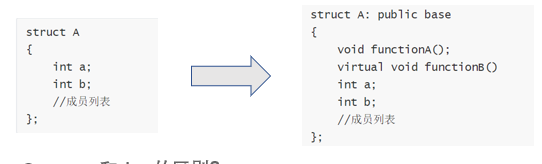

# 1.基础题

## 1.1 . C struct和C++ struct的区别？C++ struct和class的区别？ 

**C++** **struct****相比****C struct****扩充了如下：**

1.struct可以包括**成员函数**

2.struct可以实现**继承**

3.struct可以实现**多态**



**C++ struct****和****class****的区别？

**1.**默认的继承访问权。**class默认的是private, strcut默认的是public**

2.默认访问权限。**struct默认的数据访问控制是public的，class默认的成员变量访问控制是private的。**


## 1.2 


## 1.3 `new`和`malloc`

new和malloc都非常慢，因此我们常常需要减少new和malloc的使用次数


## 1.4 C++的内存分区

在 C++ 中，程序的内存分为几个主要区域，每个区域都有其特定的用途和特性。这些区域包括代码段、数据段、BSS段、堆（Heap）和栈（Stack）。下面是对这些区域的简要描述和分析：

### 1. 代码段（Text Segment）

- **用途**：存储程序的二进制指令，即为程序==编译后的二进制代码==。**CPU需要运行什么指令，会直接去代码段找。**
- **特性**：通常是只读的，以防止程序意外修改其指令。

### 2. 数据段（Data Segment）

- **用途**：存储程序中的**全局变量**和**静态变量**。
- 分为两部分
  - **初始化的数据段**：存储初始化的全局变量和静态变量。
  - **未初始化的数据段（BSS）**：存储未初始化的全局变量和静态变量。
- **特性**：数据段在程序启动时分配，并在程序结束时释放。

### 3. BSS段（Block Started by Symbol）

- **用途**：存储未初始化的全局变量和静态变量。
- **特性**：BSS段中的变量在程序启动时自动初始化为零或空（NULL）。

### 4. 堆（Heap）

- **用途**：动态内存分配。
- 特性
  - 由程序员显式管理（使用 `new` 和 `delete` 或 `malloc` 和 `free`）。
  - 生命周期不受作用域限制，直到显式释放或程序结束。
  - 适用于大小未知或需要长期存储的数据。
- **示例**：通过 `new` 分配的对象。

### 5. 栈（Stack）

- **用途**：存储局部变量、函数参数、**返回地址**等。
  - ==这里有一个很容易搞混的概念，stack通常存的是返回地址，并没有“存储返回值”这个概念。返回值通常是被存入一个寄存器中方便快速调用，也就是一个右值。如果你将返回值赋值给stack的一个变量，那他才成了stack内存的数据。==
  - **返回地址**：当一个函数被调用时，程序需要知道在函数执行完毕后应该返回到哪里继续执行。这个“返回到哪里”的信息就是返回地址（Return Address），它被存储在栈上。返回地址指向调用该函数的代码中紧跟在函数调用指令后的那条指令。
- 特性
  - **自动管理**，随着函数调用和返回而自动分配和释放。
  - 生命周期受函数作用域限制。
  - 访问速度快，但大小有限。

### 分析

- **安全性**：堆内存的管理更容易出错（如内存泄漏、野指针），而栈内存相对安全，因为它由编译器自动管理。
- **生命周期**：堆内存的生命周期由程序员控制，而栈内存的生命周期通常与函数调用相关。
- **性能**：栈内存的分配和释放通常比堆内存更快，因为栈内存是线性分配的。
- **大小限制**：栈空间相对较小，适用于小型数据和临时变量；堆空间更大，适用于大型数据和长期存储。

理解这些内存分区对于编写高效和稳定的 C++ 程序至关重要。错误的内存管理可能导致各种问题，如内存泄漏、内存损坏和程序崩溃。

### 例子

### 示例程序

```c++
#include <iostream>
#include <string>

int globalVar; // 未初始化的全局变量，存储在 BSS 段
int initializedGlobalVar = 5; // 初始化的全局变量，存储在数据段

void function(int arg) {
    int localVar = 10; // 局部变量，存储在栈上
    static int staticVar = 20; // 静态局部变量，存储在数据段
    int *dynamicVar = new int(30); // 动态分配的变量，存储在堆上

    std::cout << "Local variable: " << localVar << std::endl;
    std::cout << "Static variable: " << staticVar << std::endl;
    std::cout << "Dynamic variable: " << *dynamicVar << std::endl;

    delete dynamicVar; // 释放堆内存
}

int main() {
    function(5);

    std::cout << "Global variable (uninitialized): " << globalVar << std::endl;
    std::cout << "Global variable (initialized): " << initializedGlobalVar << std::endl;

    return 0;
}
```

### 内存分区解释

1. **代码段（Text Segment）**
   - 包含程序的可执行代码，例如 `function` 和 `main` 函数的定义。
2. **数据段（Data Segment）**
   - `initializedGlobalVar`（初始化的全局变量）存储在此区域。
   - `staticVar`（静态局部变量）也存储在数据段，因为它是静态的。
3. **BSS段（Block Started by Symbol）**
   - `globalVar`（未初始化的全局变量）存储在 BSS 段。在程序启动时，它会被自动初始化为 0。
4. **堆（Heap）**
   - `dynamicVar` 是一个指针，指向堆上分配的 `int` 类型的内存。这是通过 `new` 关键字动态分配的。
5. **栈（Stack）**
   - `localVar`（局部变量）和 `arg`（函数参数）存储在栈上。它们的生命周期仅限于 `function` 函数的执行期间。

```lua
+-------------------+
|    代码段         |
|-------------------|
| function()        |
| main()            |
+-------------------+
|    数据段         |
|-------------------|
| initializedGlobal |
| staticVar         |
+-------------------+
|    BSS段          |
|-------------------|
| globalVar         |
+-------------------+
|    堆             |
|-------------------|
| *dynamicVar       |
+-------------------+
|    栈             |
|-------------------|
| localVar (function)|
| arg (function)    |
| ...               |
+-------------------+

```


## 1.5 堆栈区别

第二行：堆是使用内存池来管理的（查询内存池与实现）

### 内存池（Memory Pool）

内存池是一种内存管理技术，它预先分配一块大的内存区域，并从中分配==小块内存==给程序使用。这种方法可以提高内存分配的效率，减少内存碎片，并提高程序性能。

#### **为什么使用内存池？**

1. **减少内存碎片**：通过预分配大块内存，减少了小块内存分配和释放导致的碎片。
2. **提高分配效率**：从预分配的内存池中分配内存通常比从堆中分配更快。
3. **减少系统调用**：减少了向操作系统请求/释放内存的次数。
4. **提高性能**：对于频繁分配/释放小块内存的场景，内存池可以显著提高性能。

#### **实现方式**

1. **静态内存池**：在程序启动时预分配一大块固定大小的内存。适用于已知内存需求的场景。
2. **动态内存池**：根据需要动态增长，但初始时也预分配一定量的内存。

#### **实现步骤**

1. **预分配内存**：在内存池初始化时，预先分配一大块内存。
2. **管理分配**：使用数据结构（如链表、栈、位图等）来跟踪哪些部分已被分配，哪些仍然可用。
3. **分配与回收**：当请求内存时，从可用部分中分配；当释放内存时，将其标记为可用。

#### **示例代码（简化版）**

```c++
class MemoryPool {
private:
    struct Block {
        Block* next;
    };

    Block* freeList;
    void* pool;

public:
    MemoryPool(size_t size) {
        // 分配一大块内存
        pool = malloc(size);

        // 初始化空闲链表
        freeList = static_cast<Block*>(pool);
        freeList->next = nullptr;
    }

    void* allocate(size_t size) {
        if (freeList == nullptr) return nullptr; // 没有可用内存

        // 从空闲链表中分配
        void* block = freeList;
        freeList = freeList->next;
        return block;
    }

    void deallocate(void* block) {
        // 将内存块放回空闲链表
        Block* blk = static_cast<Block*>(block);
        blk->next = freeList;
        freeList = blk;
    }

    ~MemoryPool() {
        free(pool);
    }
};
```

第四行：

* **内存碎片**：内部碎片分为内部碎片和外部碎片
  * **外部碎片**指的是，假如我4G的堆，有2G的数据，但是这些数据很零散，因为是随机hit到的。它不会帮你移动规整这些数据。因此，如果你想再申请1G的空间，此时会为你寻找连续的1G空间，大概率找不到，最后就会报错（std::bad_alloc）。
  * **内部碎片**：指分配给程序的内存块中未被使用的部分。**例如，如果一个程序请求100字节的内存，但系统以256字节为单位分配内存，那么剩余的156字节就是内部碎片。**
  * 需要记住的是，==假如你一直申请内存，但是不释放，那你永远不会有碎片问题==，因为申请的时候是从低到高申请的，只有释放了之后才会出现小空隙。

第五行：生长方向

* **内存中的高低地址**：在计算机内存管理中，"高地址"和"低地址"是指内存地址空间中的相对位置。这些术语基于内存地址的数值来定义：

  - **低地址**：这是内存地址空间的开始部分，拥有较小的数值。例如，在一个典型的32位系统中，地址可能从`0x00000000`开始，这就是最低的地址。
  - **高地址**：这是内存地址空间的末端部分，拥有较大的数值。继续以32位系统为例，地址可能延伸到`0xFFFFFFFF`，这就是最高的地址。

  在大多数现代操作系统和计算机体系结构中，内存被划分为不同的区域以存储不同类型的数据。例如，栈（Stack）和堆（Heap）是两种主要的内存区域，它们在内存地址空间中的位置通常是相对固定的：

  - **栈（Stack）**：
    - **从高地址向低地址分配**：栈是用于存储局部变量和函数调用信息的区域。每当一个函数被调用时，它的返回地址和参数会被压入栈中，而当函数返回时，这些信息会被弹出。这种“后进先出”（LIFO）的特性使得栈从高地址向低地址增长更为合适。
    - **高效性**：栈的这种分配方式使得函数调用非常高效，因为它只涉及到指针的增减操作。
  - **堆（Heap）**：
    - **从低地址向高地址分配**：堆是用于动态内存分配的区域，程序在运行时可以根据需要分配和释放内存。由于堆的大小不是固定的，它需要能够灵活地向上（向高地址）增长以适应动态分配的需求。
    - **灵活性**：堆的这种分配方式提供了更大的灵活性，允许程序根据需要分配任意大小的内存块。


## 1.6 inline


## 1.7 重载与重载决策


## 1.8 resnet50的模型结构

主要是cublas和cutlass库


AI模型优化主要有三块

* 计算图优化：graph（算子融合fusion）
* 算子层面：卷积
* 程序运行时：runtime（优化new和malloc，例如内存池，也算）


## 1.8 transformer模型结构


# 2. 中等题

## 2.1 Copy constructor


## 2.2 什么时候需要自己写copy constructor


## 2.3 shallow copy and deep copy


## 2.4 batchnorm和softmax


