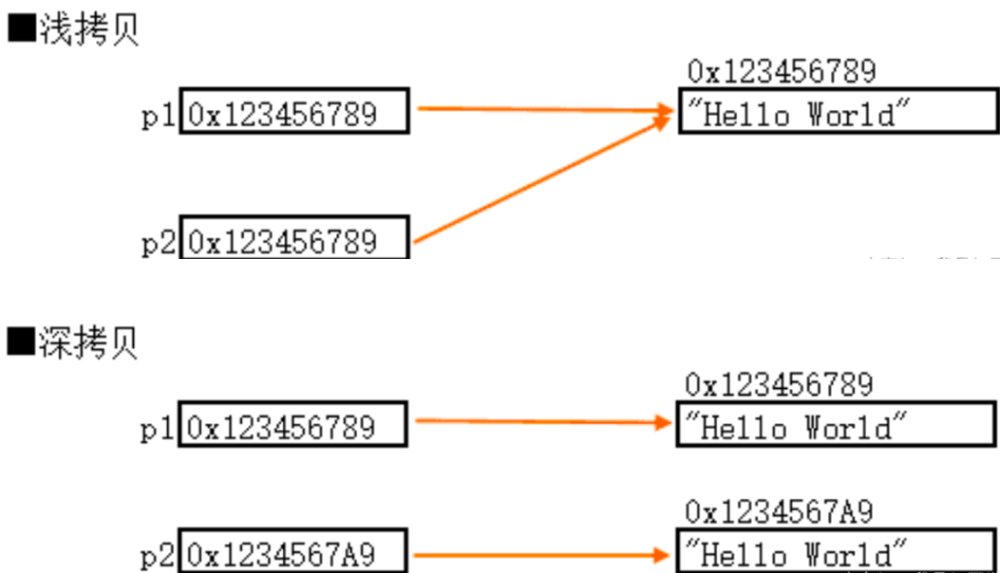

# 1.基础概念

## 1.1 . C struct和C++ struct的区别？C++ struct和class的区别？

**C++** **struct**相比**C struct**扩充了如下：

1.struct可以包括成员**函数**

2.struct可以实现**继承**

3.struct可以实现**多态**


**C++ struct**和**class**的区别？

**1.**默认的继承访问权。**class默认的是private, strcut默认的是public**

2.默认访问权限。**struct默认的数据访问控制是public的，class默认的成员变量访问控制是private的。**


## 1.2 类成员的访问权限

### 1. 公开（Public）

- **定义**：公开成员在任何地方都是可访问的。
- **继承**：当一个类继承另一个类时，基类中的公开成员在派生类中仍然是公开的。

### 2. 保护（Protected）

- **定义**：保护成员在其**所在的类及该类的派生类**中可访问。
- **继承**：基类中的保护成员在派生类中保持保护状态，这意味着它们对派生类自身和其进一步的派生类可见，但对其他类不可见。

### 3. 私有（Private）

- **定义**：私有成员仅在其定义的类内部可访问。
- **继承**：基类的私有成员在派生类中不可直接访问。虽然派生类继承了这些成员，但它不能直接使用它们。通常需要通过基类提供的公开或保护方法来间接访问私有成员。

### 特殊情况 - 继承类型

在某些语言中，如C++，继承本身也可以有不同的访问权限：

- **公开继承（Public Inheritance）**：保持基类成员的访问级别不变。例如，基类的公开成员在派生类中仍然是公开的。
- **保护继承（Protected Inheritance）**：将所有基类成员转换为保护成员。例如，基类的公开和保护成员在派生类中都变成了保护的。
- **私有继承（Private Inheritance）**：将所有基类成员转换为私有成员。例如，基类的公开和保护成员在派生类中都变成了私有的。

## 1.3 `new`和`malloc`

### 1.3.1 new 和 malloc的区别

```c++
int *p = new float[2];//编译错误
int *p = (int*) malloc(2*sizeof(double));//无编译错误
```

* new是类型安全的，`new-delete`

  * **类型明确**：`new`操作符在使用时需要指定明确的数据类型，它会返回该类型的正确指针。

  * **构造函数**：`new`不仅会分配内存，还会调用对象的构造函数（如果存在），确保对象被正确初始化。

  * **类型检查**：因为`new`需要具体的类型信息，编译器能够在编译时进行类型检查，减少类型错误的可能。

  * **组成**:new由**Operator new**与**Placement new**组成，

    * `Operator new `通常包括**分配内存(malloc)+指针类型转换**

    * `Placement new`通常用于在*已经分配的内存*上**构造对象**

      ```c++
      Myclass* myObject = new (place_address) Myclass();
      \\在指针place_address指向的地址上构造一个MyClass类型的对象。
      ```

      

* malloc不是类型安全的,`malloc-free`

  * **不明确类型**：`malloc`仅分配一定数量的字节，它不关心或不知道你将如何使用这些内存。例如，`malloc(10)`只是简单地分配10个字节，不知道这是用于存储多少个什么类型的数据。
  * **无构造函数调用**：`malloc`只负责分配内存，不会调用任何类型的构造函数，如果用于分配对象，需要调用`palcement new`来初始化对象，这增加了出错的风险。
  * **手动类型转换**：`malloc`返回的是一个`void*`类型的指针，使用时通常需要显式转换到正确的类型。这个转换过程没有编译时的类型检查，如果转换错误，可能导致未定义行为。


*malloc调用palcement new新建一个指针对象的例子：*

```c++
	// 分配足够的未初始化内存来存储一个MyClass对象
    void* ptr = malloc(sizeof(MyClass));
    
    if (!ptr) {
        // 处理分配失败
    }
    
    // 使用placement new在已分配的内存上构造对象
    MyClass* myObject = new (ptr) MyClass();
    
    // ... 使用myObject ...
    
    // 明确调用析构函数
    myObject->~MyClass();
    
    // 释放内存
    free(ptr);
```


### 1.3.2 能否malloc->delete或是new->free?

即为malloc申请的存储空间能用delete释放吗? new申请的内存能用free释放吗？ 

从编程纪律上说，是不可以， 因为 new 和delete 操作时, 是把对象当成一个类，要执行类的构造/析构函数。 而 malloc 和 free 则不会执行构造/析构。

参考如下代码：

```c++
//当对象是简单类型时，确实是不会出错， 原因是 int，float 这种数字类型过于简单，没有复杂的构造/析构函数，因此此时 new 和 malloc是等价的
int *i = new int[100];
free(i);

//当对象是复杂类
class A{
public:
    void *t;
    A(){
        t = malloc(100);
    }
    
    ~A(){
        free(t);
    }
};


void main(){
    A *m = new A();
    // 使用malloc分配足够存储A对象的内存，但没有调用A的构造函数
    A *n = (A*) malloc(sizeof(A));
    //不会调用对象的析构函数，可能导致资源泄漏
    free(m);
    //由于n的构造函数从未被调用，析构函数的行为也是未定义的
    delete n;
}

```

正确的做法

- 当使用`new[]`时，应与`delete[]`配对使用。
- 当使用`new`时，应与`delete`配对使用。
- 当使用`malloc`时，应与`free`配对使用。


### 1.3.3 为什么要控制new和malloc的次数

new和malloc在C++中都非常慢，因此在高性能计算领域我们常常需要减少new和malloc的使用次数


#### 1. 分配和释放开销

- **内存分配器**：每次调用`new`或`malloc`时，内存分配器都需要找到足够大的空闲块来满足请求。这个过程可能涉及到*内部数据结构的搜索和修改*，特别是在内存碎片化严重时，这个过程可能非常缓慢。
- **释放内存**：与分配类似，释放内存（使用`delete`或`free`）也需要内存分配器做一些*内部数据结构的更新*。如果频繁进行，这也是一项开销较大的操作。


#### 2. 构造和析构开销

- **构造函数**：使用`new`创建对象时，除了分配内存，还会调用对象的构造函数。如果构造函数复杂或对象层级深，这会是一个显著的开销。
- **析构函数**：同样，使用`delete`释放对象时，会调用析构函数，如果频繁执行，这也会成为性能瓶颈。


#### 3. 内存碎片

- **碎片化**：频繁地分配和释放不同大小的内存块会导致内存碎片化，这意味着可用内存被小块占用，难以为大对象找到连续的空间，影响后续分配的效率。


#### 解决策略：

* **内存池**：尽可能地一次性分配一大块内存
* **避免不必要的动态内存分配**：尽可能使用自动（栈）分配，或者静态分配的对象和数组。


## 1.4 C++的内存分区

在 C++ 中，程序的内存分为几个主要区域，每个区域都有其特定的用途和特性。这些区域包括代码段、数据段、BSS段、堆（Heap）和栈（Stack）。

* **代码段(Text Segment)**
  * 存储程序的二进制指令，即为程序==编译后的二进制代码==。**CPU需要运行什么指令，会直接去代码段找。**
  * 通常是只读的，以防止程序意外修改其指令。
* **数据段(Data Segment)**
  * 这个区域专门用于存储生命周期为整个程序的数据，即为存储程序中==已经被初始化==的**全局变量**和**静态变量**
    * 静态变量在程序启动时初始化，并在程序结束时销毁。
      * **静态局部变量**：在函数内声明的静态变量只在该函数内可见，但它不会在函数调用结束时销毁。下一次调用该函数时，变量将保持其最后的状态。
      * **静态全局变量**：在文件或模块内声明的静态变量可以在整个文件或模块中访问，但不能被其他文件或模块访问。这限制了变量的作用域，有助于避免命名冲突。
* **BSS段（Block Started by Symbol）**
  * 存储==未被初始化==的全局变量、静态变量
  * BSS段中的变量在程序启动时自动初始化为零或空（NULL）。
* **堆（Heap）**
  * malloc或new申请的内存，生命周期不受作用域限制，直到显式释放或程序结束。
  * 访问慢，地址从低位到高位
* **栈（Stack）**
  * 存储局部变量、函数参数、**返回地址**
    * **返回地址**：当一个函数被调用时，程序需要知道在函数执行完毕后应该返回到哪里继续执行。这个“返回到哪里”的信息就是返回地址（Return Address），它被存储在栈上。返回地址指向调用该函数的代码中紧跟在函数调用指令后的那条指令。
    * **返回值：**函数的返回值所需的空间会预先在caller栈中被申请，作为一个右值从被call的栈的寄存器复制/移动过来。


### 示例程序

```c++
#include <iostream>
#include <string>

int globalVar; // 未初始化的全局变量，存储在 BSS 段
int initializedGlobalVar = 5; // 初始化的全局变量，存储在数据段

void function(int arg) {
    int localVar = 10; // 局部变量，存储在栈上
    static int staticVar = 20; // 静态局部变量，存储在数据段
    int *dynamicVar = new int(30); // 动态分配的变量，存储在堆上

    std::cout << "Local variable: " << localVar << std::endl;
    std::cout << "Static variable: " << staticVar << std::endl;
    std::cout << "Dynamic variable: " << *dynamicVar << std::endl;

    delete dynamicVar; // 释放堆内存
}

int main() {
    function(5);

    std::cout << "Global variable (uninitialized): " << globalVar << std::endl;
    std::cout << "Global variable (initialized): " << initializedGlobalVar << std::endl;

    return 0;
}
```

#### 内存分区解释

1. **代码段（Text Segment）**
   - 包含程序的可执行代码，例如 `function` 和 `main` 函数的定义。
2. **数据段（Data Segment）**
   - `initializedGlobalVar`（初始化的全局变量）存储在此区域。
   - `staticVar`（静态局部变量）也存储在数据段，因为它是静态的。
3. **BSS段（Block Started by Symbol）**
   - `globalVar`（未初始化的全局变量）存储在 BSS 段。在程序启动时，它会被自动初始化为 0。
4. **堆（Heap）**
   - `dynamicVar` 是一个指针，指向堆上分配的 `int` 类型的内存。这是通过 `new` 关键字动态分配的。
5. **栈（Stack）**
   - `localVar`（局部变量）和 `arg`（函数参数）存储在栈上。它们的生命周期仅限于 `function` 函数的执行期间。

```lua
+-------------------+
|    代码段         |
|-------------------|
| function()        |
| main()            |
+-------------------+
|    数据段         |
|-------------------|
| initializedGlobal |
| staticVar         |
+-------------------+
|    BSS段          |
|-------------------|
| globalVar         |
+-------------------+
|    堆             |
|-------------------|
| *dynamicVar       |
+-------------------+
|    栈             |
|-------------------|
| localVar (function)|
| arg (function)    |
| ...               |
+-------------------+

```


## 1.5 堆栈区别

|                  | 堆                                                           | 栈                                                           |
| ---------------- | ------------------------------------------------------------ | ------------------------------------------------------------ |
| **管理方式**     | 堆中资源由程序员控制(memory leak)                            | 栈资源由编译器自动管理，无需手工控制                         |
| **内存管理机制** | 系统拥有记录空闲内存地址的链表，当申请空间时，首先遍历链表找到第一个大于所需的节点，然后从列表删除该节点，并插入使用空间剩下的空间形成的节点（详见内存池管理） | 栈就是按顺序压栈出栈                                         |
| **空间大小**     | 堆是不连续的内存空间，通常为计算机系统中的有效虚拟内存(4G或更大) | 栈是一块连续的内存区域，通常是操作系统预定好的，2M           |
| **碎片问题**     | 见如下**内存碎片**                                           | 栈是一个先进后出的队列，不会出现碎片                         |
| **生长方向**     | 向高地址方向增长                                             | 栈向低地址方向生长（上面的是栈）                             |
| **分配方式**     | 堆都是动态分配                                               | 栈的静态分配由编译器完成(局部变量分配)，动态分配由alloca函数分配（压栈） |
| 分配效率         | 低                                                           | 考虑到计算机在底层对栈数据结构提供支持，分配专门的寄存器存放栈地址，并且栈操作由专门的指令，因此很快 |

### 1.5.1 内存碎片

**内存碎片**：内部碎片分为内部碎片和外部碎片

* **外部碎片**指的是，假如我4G的堆，有2G的数据，但是这些数据很零散，因为是随机hit到的。它不会帮你移动规整这些数据。因此，如果你想再申请1G的空间，此时会为你寻找连续的1G空间，大概率找不到，最后就会报错（std::bad_alloc）。
* **内部碎片**：指分配给程序的内存块中未被使用的部分。**例如，如果一个程序请求100字节的内存，但系统以256字节为单位分配内存，那么剩余的156字节就是内部碎片。**
* 需要记住的是，==假如你一直申请内存，但是不释放，那你永远不会有碎片问题==，因为申请的时候是从低到高申请的，只有释放了之后才会出现小空隙。


### 1.5.2 生长方向

**内存中的高低地址**：在计算机内存管理中，"高地址"和"低地址"是指内存地址空间中的相对位置。这些术语基于内存地址的数值来定义：

- **低地址**：这是内存地址空间的开始部分，拥有较小的数值。例如，在一个典型的32位系统中，地址可能从`0x00000000`开始，这就是最低的地址。
- **高地址**：这是内存地址空间的末端部分，拥有较大的数值。继续以32位系统为例，地址可能延伸到`0xFFFFFFFF`，这就是最高的地址。

在大多数现代操作系统和计算机体系结构中，内存被划分为不同的区域以存储不同类型的数据。例如，栈（Stack）和堆（Heap）是两种主要的内存区域，它们在内存地址空间中的位置通常是相对固定的：

- **栈（Stack）**：
  - **从高地址向低地址分配**：栈是用于存储局部变量和函数调用信息的区域。每当一个函数被调用时，它的返回地址和参数会被压入栈中，而当函数返回时，这些信息会被弹出。这种“后进先出”（LIFO）的特性使得栈从高地址向低地址增长更为合适。
  - **高效性**：栈的这种分配方式使得函数调用非常高效，因为它只涉及到指针的增减操作。
- **堆（Heap）**：
  - **从低地址向高地址分配**：堆是用于动态内存分配的区域，程序在运行时可以根据需要分配和释放内存。由于堆的大小不是固定的，它需要能够灵活地向上（向高地址）增长以适应动态分配的需求。
  - **灵活性**：堆的这种分配方式提供了更大的灵活性，允许程序根据需要分配任意大小的内存块。


### 1.5.3

**内存池（Memory Pool）**

内存池是一种内存管理技术，它预先分配一块大的内存区域，并从中分配==小块内存==给程序使用。这种方法可以提高内存分配的效率，减少内存碎片，并提高程序性能。

**为什么使用内存池？**

1. **减少内存碎片**：通过预分配大块内存，减少了小块内存分配和释放导致的碎片。
2. **提高分配效率**：从预分配的内存池中分配内存通常比从堆中分配更快。
3. **减少系统调用**：减少了向操作系统请求/释放内存的次数。
4. **提高性能**：对于频繁分配/释放小块内存的场景，内存池可以显著提高性能。

#### **实现方式**

1. **静态内存池**：在程序启动时预分配一大块固定大小的内存。适用于已知内存需求的场景。
2. **动态内存池**：根据需要动态增长，但初始时也预分配一定量的内存。

#### **实现步骤**

1. **预分配内存**：在内存池初始化时，预先分配一大块内存。
2. **管理分配**：使用数据结构（如链表、栈、位图等）来跟踪哪些部分已被分配，哪些仍然可用。
3. **分配与回收**：当请求内存时，从可用部分中分配；当释放内存时，将其标记为可用。

#### **示例代码（简化版）**

```c++
class MemoryPool {
private:
    struct Block {
        Block* next;
    };

    Block* freeList;
    void* pool;

public:
    MemoryPool(size_t size) {
        // 分配一大块内存
        pool = malloc(size);

        // 初始化空闲链表
        freeList = static_cast<Block*>(pool);
        freeList->next = nullptr;
    }

    void* allocate(size_t size) {
        if (freeList == nullptr) return nullptr; // 没有可用内存

        // 从空闲链表中分配
        void* block = freeList;
        freeList = freeList->next;
        return block;
    }

    void deallocate(void* block) {
        // 将内存块放回空闲链表
        Block* blk = static_cast<Block*>(block);
        blk->next = freeList;
        freeList = blk;
    }

    ~MemoryPool() {
        free(pool);
    }
};
```


## 1.6 inline

>  什么是inline？作用？缺点？能写出具体代码体现用法吗？

1.inline**定义：** 函数A调用函数B的时候，直接把B函数体给替换过来

2.**作用**： 避免函数A调用B造成的栈空间（栈帧）==创建==（局部变量和函数参数）和==释放开销==。具体来说，对于进入一个函数，它会新push这个函数进栈，具体为首先创建栈空间，然后参数变量压栈，结束时销毁栈空间。

Inline省去了创建栈与销毁栈与压栈的消耗，因此适用于频繁使用的代码块。但是，对于长代码不适用，==cache可能装不下这么长的指令，因此容易造成cache miss，从而去内存找，导致访问时间过长。==

3.**缺点**：当函数B的函数体比较复杂的时候，不宜inline，（再深入一点：此时会造成某个栈空间的代码膨胀，造成CPU流水线前端fetch指令发生cache miss，降低性能，毕竟栈能这么快有一部分就是因为一般call一个新的栈，其通常能被cache完全cover）


## 1.7 重载与重载决策

重载的定义：某个**函数**和**运算符**可以有多个定义，**参数个数、顺序、类型**有一个不同即可，分别称为**函数重载**和**运算符重载**。编译器会根据实际调用传进去的实参在这多个定义中选择最合适的重载函数或重载运算符，称为**重载决策**。


* 普通函数重载

* 类的成员函数重载

  * 函数重载（构造函数）

  * 运算符重载

    * 普通运算符重载：重载为类内函数(this和&rhs)，重载为全局函数(&lhs和&rhs)

      ```c++
      //返回引用：通常是有三类需求，避免不必要的复制，允许连锁赋值，修改调用对象
      
      // Copy assignment: This = rhs
      Type& operator=(const Type &rhs);
      
      // += overload, 其余同理(*=,-=)
      Type& operator+=(const Type &rhs);
      
      //move assignment
      Type& operator=(Type &&rhs);
      
      //[]
      Type &operator[](int a);
      
      //一元运算符++,--,!
      ReturnType &operator--();
      
      
      //返回value副本
      
      // 二元操作符几乎都是返回副本，例如 + overload, 包括其他二元运算符同理(*,/,-,==,!=,<,>等)
      // This + rhs 等同于 This.operator+(rhs)
      Type operator+(const Type &rhs); 					//*this + rhs
      friend ReturnType operator+(const Type &lhs, const Type &rhs);	//重载为全局函数写法lhs+rhs
      
      //一元运算符-(取负)并不会修改原本的值
      ReturnType operator-();
      
      ```

    * 流重载:显然将流>><<重载为成员函数是没有意义的(不清楚可以看14.6)，因此通常重载为全局函数

      ```c++
      // os对象不可复制，因此使用&
      // &operator允许连续操作
      // 以std::cout << "Hello" << " " << "World!";为例，在第一个<<中，&operator只是修改了std::cout的引用，如果没有return，那么后面的<<的os将读不到输入。看起来就像 空 << " " << "World!";
      //而加上了return就看起来像 修改后的std::cout << " " << "World!";
      std::ostream &operator<<(std::ostream &os, const Mystring &obj){
          os << obj.str;
          return os;
      }
      
      
      std::istream &operator>>(std::istream &is,Mystring &obj){
          //char *buff = new char[1000]; //不泛用
          string buff;
          is >> buff;
          obj = Mystring {buff};//如果定义了move assignment就很完美
          
          delete [] buff;
          return is;
      }
      ```

      


**使用引用（&）返回类型**

当你希望返回对象的引用时，你会使用`&`。这样做有几个原因：

1. **避免不必要的复制**：如果你返回一个对象的引用，你避免了返回值时复制对象的开销。对于大型对象，这可能是性能的重要考量。
2. **允许连锁赋值**：重载赋值运算符（`operator=`）通常需要返回一个对象的引用，以允许连锁赋值，如`a = b = c`。连锁的效果通常需要return帮助实现。考虑到**等号=**本身具有==右结合性==，因此在计算连等时自动从右到左。相反的，**流操作符**具有==左结合性==，因此计算连着的<<，>>时自动从左到右。
3. **修改调用对象**：如果你的运算符重载需要修改调用对象并希望这些改动反映到原对象上，你需要返回引用。


## 1.8 Copy constructor and Copy Assignment

### 1.8.1 调用场景

 **C++类的拷贝构造函数有哪三种调用场景？什么时候会调用到拷贝赋值函数而不是拷贝构造函数？能写出实例代码吗？**


**拷贝构造函数在三种情况下被调用**：

1. **初始化**：创建同类的新对象时，用另一个对象去初始化这个新对象。
2. **函数参数**：当一个类的对象作为值传递给函数时。
3. **函数返回值**：当函数返回一个类的对象时。

**拷贝赋值运算符**：

- 当一个对象已经初始化，并被赋予另一个同类对象的新值时，会调用拷贝赋值运算符。
- 考虑以下情况：
  - 如果`c2`未初始化，`Complex c2(c1);` 调用拷贝构造函数。
  - 如果`c2`已初始化，`c2 = c1;` 调用拷贝赋值运算符。

**示例代码**：

```c++
class Complex {
private:
    double real;
    double imag;

public:
    // Regular constructor
    Complex(double r = 0.0, double i = 0.0) : real(r), imag(i) {}

    // Copy constructor
    Complex(const Complex& c) : real(c.real), imag(c.imag) {
        std::cout << "Copy constructor called" << std::endl;
    }

    // Copy assignment operator
    Complex& operator=(const Complex& c) {
        std::cout << "Copy assignment operator called" << std::endl;
        if (this != &c) {
            real = c.real;
            imag = c.imag;
        }
        return *this;
    }

};

int main() {
    Complex c1, c2;
    // 调用拷贝构造函数
    Complex c2(c1); 

    // 调用拷贝赋值运算符
    c2 = c1; 
}
```

------

记住，拷贝构造函数用于从已存在的对象创建一个新对象，而拷贝赋值运算符用于将一个已创建对象的值复制到另一个对象。


### 1.8.2 什么时候需要自己写？

当C++类中包含==指针类型==的数据成员或者其他需要==显式控制的资源（如IO句柄、网络连接等）==时，需要自定义拷贝构造函数和拷贝赋值运算符以确保这些资源被正确管理，避免深浅拷贝问题和资源泄漏。

```c++
#include <iostream>
#include <fstream>
#include <cstring>

class FileWrapper {
private:
    std::fstream* fileHandle; // 模拟文件句柄
    char* buffer;             // 动态分配的内存缓冲区

public:
    // Regular constructor
    FileWrapper(const char* filename) {
        fileHandle = new std::fstream(filename, std::fstream::in | std::fstream::out | std::fstream::app);
        buffer = new char[256]; // 假设我们有一个缓冲区
        std::cout << "File and buffer initialized" << std::endl;
    }

    // Copy constructor
    FileWrapper(const FileWrapper& other) {
        fileHandle = new std::fstream(*other.fileHandle); // 创建新的文件句柄
        buffer = new char[256];                           // 分配新的缓冲区
        std::strcpy(buffer, other.buffer);
        std::cout << "Copy constructor called" << std::endl;
    }

    // Copy assignment operator
    FileWrapper& operator=(const FileWrapper& other) {
        if (this != &other) {
            delete fileHandle; // 关闭并删除原来的文件句柄
            delete[] buffer;   // 释放原来的缓冲区
            fileHandle = new std::fstream(*other.fileHandle); // 创建新的文件句柄
            buffer = new char[256];                           // 分配新的缓冲区
            std::strcpy(buffer, other.buffer);
            std::cout << "Copy assignment operator called" << std::endl;
        }
        return *this;
    }

    // Destructor
    ~FileWrapper() {
        if (fileHandle->is_open()) {
            fileHandle->close(); // 确保文件被关闭
        }
        delete fileHandle;       // 释放文件句柄资源
        delete[] buffer;         // 释放缓冲区内存
        std::cout << "Resources freed" << std::endl;
    }

    // ... (其他成员函数)
};

int main() {
    FileWrapper fw1("example.txt");
    FileWrapper fw2 = fw1;        // 调用拷贝构造函数
    FileWrapper fw3("temp.txt");
    fw3 = fw1;                    // 调用拷贝赋值运算符

    // ... (其他操作)

    return 0;
}

```


### 1.8.3 Shallow copy and deep copy 



**注意，深拷贝有别于Move，深拷贝是需要额外创建一个空间的**

* Shallow copy中raw pointer被copy了，而非raw pointer指向的数据被copy了

  ```c++
  class Shallow{
  private:
      int *data;
  public:
      //Constructor
      Shallow(int d){
          data = new int;
          *data = d;
      }
      Shallow(const Shallow &source):data(source.data){}//Memberwise copy
      ~Shallow(){
          delete data;
      }
  }
  ```

* Deep copy创建一个raw pointer所指向的数据的备份

  ```c++
  class Deep{
  private:
      int *data;
  public:
      //Constructor
      Deep(int d){
          data = new int;
          *data = d;
      }
      //change
      Deep(const Deep &source){
  		data = new int;//需要额外申请
          *data = *source.data;
      }
      
      ~Deep(){
          delete data;
      }
  }
  ```

  


## 1.9 STL容器特性

### 1.9.1 Sequence Container

序列容器实现了可以按顺序访问的数据结构

#### `array`:静态连续数组


#### `vector`：动态连续数组

元素是连续存储的，这意味着元素不仅可以通过迭代器访问，还可以使用指向元素的常规指针的偏移量来访问。

载体的存储是自动处理的，并根据需要进行扩展。向量通常比静态数组占用更多的空间，因为分配了更多的内存来处理未来的增长。这样，向量就不需要在每次插入元素时重新分配，而只需要在额外内存耗尽时才重新分配。可以使用` capacity（）` 函数查询分配的内存总量。额外的内存可以通过调用 `shrink_to_fit（）` 返回给系统。

就性能而言，重新分配通常是成本高昂的操作。如果事先知道元素的数量，`reserve（）` 函数可用于消除重新分配。

`vector`常见操作的复杂度（效率）如下：

| 操作                    | 复杂度                                                 |
| ----------------------- | ------------------------------------------------------ |
| 随机访问(Random Access) | constant $O(1)$                                        |
| 在尾部插入或移除元素    | **Amortized** constant $O(1)$                          |
| 插入或移除元素          | Linear in the distance to the end of the vector $O(n)$ |


#### `deque`:双端队列


#### `forward_list`：单向列表


#### `list`: 双向列表


### 1.9.2 Associative containers


