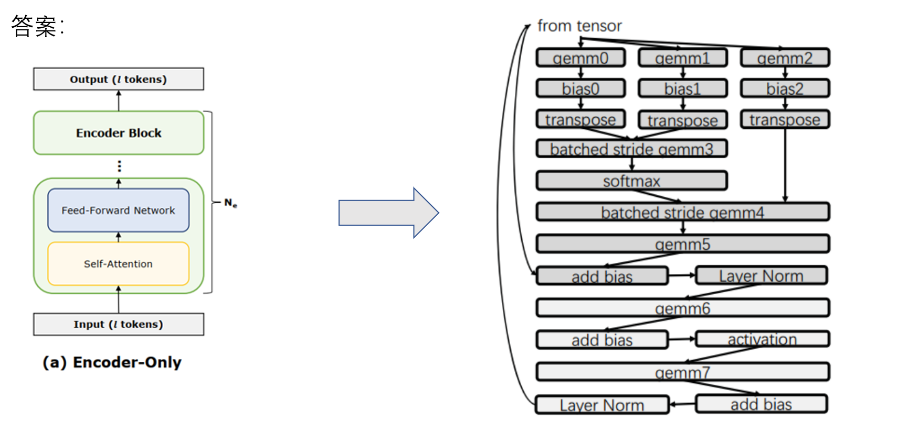
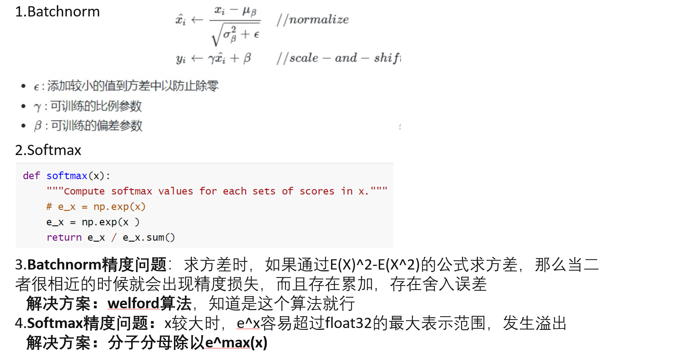
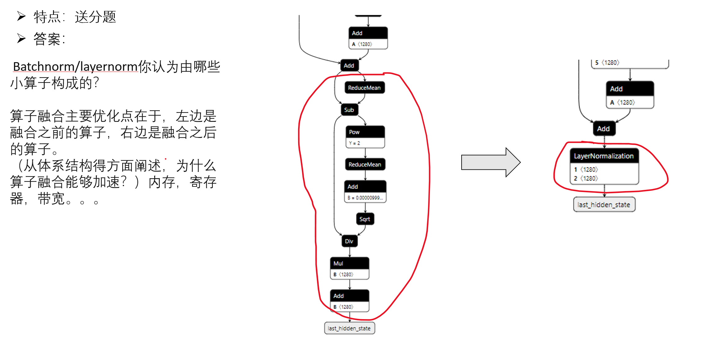
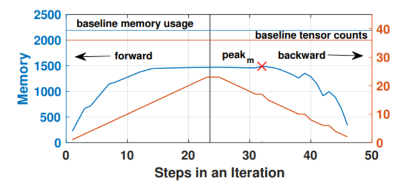

AI优化的分类：

计算图层面Graph:通常使用netron.app查看，通常包括算子融合，算子内部

程序运行时(runtime)：编译器优化

Cublas,cutlass都是优化库

CPU矩阵乘法的高效计算Anatomy of High-Performance Matrix Multiplication 

GPU矩阵乘法的高效计算见nvidia cutlass

## 1. Resnet50

说出resnet50的模型结构（包含哪些算子等等）？

答出主要的算子即可，比如conv2d，matmul，pooling，relu，batchnorm，softmax，mul等，要是能说出某种算子的优化方式就更好了，另外，加上一些算法idea上的思考也可以，比如conv2d可以通过转换成矩阵乘法来计算，算法名称叫做im2col（image to column)，cuDNN内部就是这样计算conv2d

## 2. Transformer

说出transformer encoder block的模型结构（包含哪些算子等等）？？

## 3. Batchnorm和Softmax

写出batchnorm和softmax的公式？ Batchnorm你认为由哪些小算子构成的？

batchnorm和softmax在什么情况下计算结果可能会出现精度问题？为什么？怎么解决？

为什么不把一整个模型的所有算子都融合起来？一很难，二没有通用性

## 4.加速AI模型的推理速度，该从哪些角度去考虑？

1. **计算效率**：

   - 优化算法以==减少计算复杂度==，或使用更高效的数学运算库。
   - ==使用更快的硬件==，利用特定硬件（如GPU、TPU）进行并行计算。
   - ==优化模型==：采用**量化技术**，将浮点运算转换为整数运算。或**优化模型架构**，如剪枝不必要的连接和神经元。

2. **访存效率**：

   - 优化数据布局，减少缓存未命中。
   - 采用有效的数据压缩技术减少内存占用。
   - 使用分块或瓦片技术，确保数据适合缓存大小。
   - 避免不必要的数据复制和移动。

3. **计算与访存相重叠**：

   **计算与访存重叠**意味着在处理器执行计算任务时，并行地进行内存数据的读写操作。这样可以确保处理器在等待数据从内存加载时不至于空闲，而是能够执行其他不依赖于这部分数据的计算任务。这通常需要硬件和软件的支持，比如现代CPU/GPU架构通常支持非阻塞的内存预取和多线程技术，软件层面则可以通过智能调度和异步编程模式来实现。

   - 利用==异步执行技术==，如CUDA流。在使用NVIDIA GPU进行深度学习模型推理时，可以利用CUDA流（Streams）来并行执行内存传输（如从主内存到GPU内存的数据拷贝）和核函数计算（如矩阵运算），以此来提高整体的运行效率。
   - ==设计流水线算法==，使得下一步计算可以在当前步骤访存时就开始。

4. **计算与通信相重叠**：

   **计算与通信重叠**则是在==分布式系统==中的概念，尤其是在使用多个处理器或计算节点时。当一个节点正在进行计算时，它可以同时开始与其他节点的数据交换过程。例如，一个节点可以发送上一轮迭代计算得到的梯度值给其他节点，同时开始执行下一轮的计算任务。这样做可以减少等待通信完成的时间，尤其是在大规模并行计算场景中非常重要。

   - 在分布式系统中，优化数据传输过程。
   - 使用高效的通信协议和网络拓扑。
   - 在数据传输时进行其他计算任务，以利用等待时间。
   - 调整数据包大小和通信频率以减少延迟和带宽消耗。

## 5.模型大小的评估指标

- **N**: Number of samples in a batch（批量大小） - 一次处理的图像数量。
- **C**: Channels（通道数） - 图像的深度，例如彩色图像有RGB三个通道。
- **H**: Height（高度） - 图像的高度。
- **W**: Width（宽度） - 图像的宽度。

对于模型大小的评估，四个关键指标—计算量、参数量、访存量和峰值内存占用—提供了衡量和优化模型性能的多维度视角。以下是对这些指标的理解和一些例子的优化版说明：

1. **计算量**：

   - 计算量衡量模型需要执行的操作次数，它直接反映了模型对处理器计算能力的需求。这些操作包括加法、乘法等。
   - 计算量的单位通常是OPs（操作），对于浮点数运算，这个单位是FLOPs（浮点操作次数）。
   - **例子**：对于两个形状为(N, C, H, W)的float32张量进行相加操作，每个元素的相加都被视为一次操作，因此总计算量是N x C x H x W FLOPs。

2. **参数量**：

   - 参数量是模型中所有可训练参数的总数，这影响模型在磁盘上的存储需求。
   - 在卷积神经网络（CNN）中，参数主要包括卷积层（Conv）和全连接层（FC）的权重。
   - 参数量不仅关系到存储空间，也与模型的泛化能力和训练时间有关。

3. **访存量**：

   - 访存量是指在模型推理过程中需要从内存中读取或写入的数据量。
   - 这个指标关键地影响了模型对内存带宽的需求。
   - **例子**：对于两个形状为(N, C, H, W)的float32张量相加，访存量是输入和输出张量总大小，即(2个输入张量 + 1个输出张量) x N x C x H x W x sizeof(float32)字节。

4. **峰值内存占用**：

   - 峰值内存占用指的是模型运行（训练或推理）过程中内存使用的最高点。

   - 在前向传播结束时通常达到峰值，因为此时所有中间结果都需要保留在内存中。

   - 在反向传播开始时，一些中间结果不再需要，内存占用将开始下降。

   - **图示解释**：所提供的图表展示了一个迭代过程中的内存使用情况。在前向传播阶段，内存使用量随着步骤增加而上升，达到峰值（标记为"peak"），然后在反向传播阶段逐渐下降，因为不再需要的数据被释放了。

     

参数量对于那些对软件包大小有严格限制的应用场景尤其重要，如移动应用（APP）或嵌入式设备，这些场景下可能会有存储容量的限制。在这些情况下，模型需要被设计得更为紧凑，以适应有限的存储空间。

## 6.加速resnet50的推理速度

如果让你加速resnet50的推理速度，你能想到哪些手段？

加速ResNet-50模型的推理速度可以从多个层面进行考虑，以下是一些优化策略的解释和例子：

1. **算子内部优化**：

   - 使用专用的算子加速库，如NVIDIA的cuDNN和cuBLAS，以利用GPU上的高效计算能力。
   - 在CPU上，可以利用oneDNN库或SIMD指令集（如AVX或SSE）来进行算子级的优化。
   - 模型中的每个算子（如卷积、池化等）都可以针对具体硬件进行底层优化。

2. **计算图层面优化**：

   * **int8量化**

     - 通过**int8量化**将模型中的浮点数参数转换为int8类型，这样可以减少模型的大小和内存带宽需求，从而加速推理。

     - 使用Netron等工具可以直观展示模型结构，帮助识别优化机会。

   * **算子融合**：

     - 将多个连续的算子合并为一个算子，减少内存访问次数和提高缓存利用率。

     - 例如，卷积层（conv2d）后紧接着的批量归一化（Batch Normalization, BN）可以合并为一个算子，减少中间结果的存储和读取。

       融合前：$output = W_{bn}(W_{conv}*input+b_{conv})+b_{bn}$

       融合后: $output = W'_{conv}*input + b'_{conv}$

       这样，我们修改了conv2d的weight和bias，我们可以在推理阶段完全舍弃BN层，这样会**省去推理时在BN层的计算时间以及内存搬运时间**

       

3. **运行时优化**(runtime optimization)：

   - **静态显存管理**：通过优化内存分配，减少动态内存分配和释放的开销。
   - **图优化**：对计算图进行调整，以最大化硬件资源的利用，如层与层之间并行计算。

4. **软件和硬件协同设计**：

   - 对模型进行裁剪，根据硬件特性移除或融合某些层。
   - 选择或设计适合特定硬件特性的网络架构。

5. **其他优化**：

   - 选择更快的推理引擎，如TensorRT。
   - 利用模型剪枝和知识蒸馏等技术减少模型复杂度。

