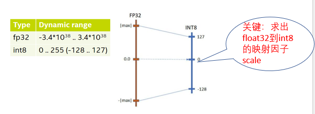
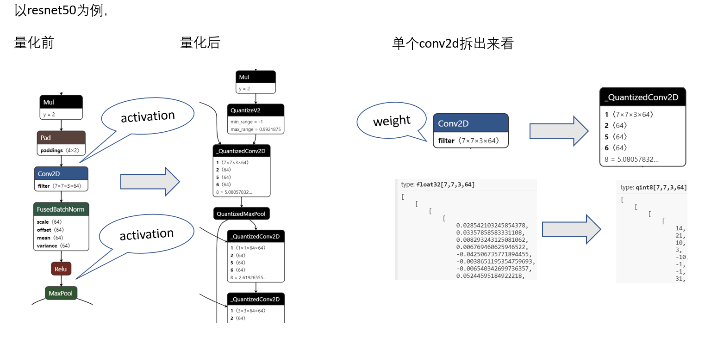
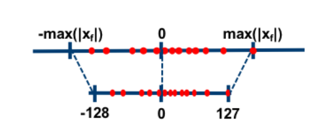
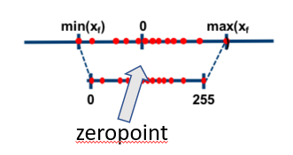

## 1. 模型优化基础

### 1.1  稀疏化（Sparsity）

稀疏化旨在将模型中的权重矩阵变得稀疏（即大部分权重为零）。这样做可以减少模型的存储需求和计算量，因为零权重意味着相应的计算可以被省略。稀疏化通常通过正则化技术实现，如L1正则化，它鼓励模型学习到更多的零或接近零的权重。

### 1.2 蒸馏（Distillation）

知识蒸馏是一种模型压缩技术，它通过将大型、复杂模型（称为教师模型）的知识转移给更小、更简单的模型（称为学生模型）来工作。学生模型在训练过程中，不仅要学习正确的输出，还要模仿教师模型的行为和输出。通过这种方式，学生模型可以继承教师模型的表现力，同时保持较小的大小和更快的推理速度。

### 3. 剪枝（Pruning）

剪枝技术旨在通过移除模型中的一些神经元或连接来减少模型的复杂性。这通常是通过评估权重的重要性来完成的。不重要（例如，权重很小或对最终性能影响很小）的连接可以被删除，从而减少模型的大小和计算需求。剪枝可以是结构化的（例如，移除整个卷积核或神经网络层）或非结构化的（即随机移除单个连接）。

### 4. 量化（Quantization）

量化涉及将模型中的浮点数权重和激活转换为低精度的表示，例如将float32转换为int8。这可以显著减少模型的大小和加速推理，因为整数运算通常比浮点运算更快且更高效。量化的挑战在于保持模型的性能，因为低精度表示可能导致精度损失。

## 2. 模型量化的基本认知

### 2.0 量化训练分类

量化通常发生在模型训练完成后，作为模型部署前的一步。这个过程被称为后训练量化（Post-training Quantization）或者推理时量化（Inference-time Quantization）。不过，也有一种在训练过程中应用量化的方法，称为量化感知训练（Quantization-aware Training）。以下是这两种方法的简要介绍：

#### 1. 后训练量化（Post-training Quantization）PTQ

后训练量化是最常见的量化方法，==它在模型训练完成后进行==。这个过程包括：

- **分析模型权重和激活**：收集权重和激活的统计信息，如最大值和最小值，以确定最佳的量化参数。
- **选择量化策略**：确定使用对称量化还是非对称量化，以及选择量化的精度（例如，int8或int16）。
- **应用量化**：将float32的权重和激活转换为低精度整数。

后训练量化的优点是操作简单，不需要重新训练模型。不过，由于它没有在训练过程中考虑量化的影响，有时可能会导致精度的显著下降。

 训练后量化（Post-Training Quantization,PTQ），PTQ不需要再训练，因此是一种轻量级的量化方法。在大多数情况下，PTQ足以实现接近FP32性能的INT8量化。然而，它也有局限性，特别是针对激活更低位的量化，如4bit、2bit。这时就有了训练时量化的用武之地。

#### 2. 量化感知训练（Quantization-aware Training）QAT

量化感知训练在整个训练过程中模拟量化的效果。这意味着在训练过程中，权重和激活被量化然后反量化（从低精度转回高精度），以确保模型可以适应量化带来的精度损失。这个过程包括：

- **模拟量化**：在前向传播和反向传播过程中模拟量化和反量化的过程。
- **训练更新**：在量化的约束下更新模型的权重。
- **量化后微调**：在模型训练完成后，可能还需要进行额外的微调，以进一步提高量化模型的性能。

量化感知训练可以显著减少量化对模型精度的影响，但它比后训练量化更复杂，需要更多的计算资源和时间。

**训练时量化**也叫量化感知训练（Quantization-Aware-Training,QAT），它可以获得高精度的低位量化，但是缺点也很明显，就是需要修改训练代码，并且反向传播过程对梯度的量化误差很大，也容易导致不能收敛。

### 2.1 为什么训练模型时数据类型通常是float32而不是int8

**精度和稳定性**：float32提供了足够的精度来捕捉微小的梯度变化，这对于训练过程中的梯度下降和权重更新非常重要。int8由于其有限的表示范围和精度，可能会导致精度损失，从而影响模型的性能和稳定性。

训练过程中需要计算梯度并更新weight，梯度通常都是

* 精确到小数点后好几位的浮点数，
* 十分靠近0的小数
* 以及有的数值表示范围大于127

整型达不到这种精度以及表示范围

### 2.2 模型量化: float32映射为int8

模型量化是一种技术，它将模型中的权重和激活从浮点数（如float32）映射为整数（如int8）。这个过程通常包括以下步骤：

- **量化范围的确定**：确定原始数据（float32）的最小值和最大值，以确定量化的范围。
- **量化参数的计算**：计算缩放因子和零点，这些参数将用于将浮点数映射到整数。
- **转换过程**：使用量化参数将float32数据转换为int8表示。

### 2.3 量化的收益和缺点

**收益**：

- **更小的模型尺寸**：使用int8代替float32可以显著减少模型的存储空间需求，通常可以达到3.5-4倍的压缩率。
- **更低的设备功耗**
- **更低的内存占用**
- **更快的推理速度**：2-4倍的提升

**缺点**：

- **模型精度降低**：量化可能会导致模型精度的下降，尤其是当模型非常复杂或者对权重的精细调整非常敏感时。
- **量化只支持有限的算子**：conv2d, pooling, matmul, linear, concat，因为所有算子都支持量化会导致模型精度大幅度下降

### 2.4 量化应用场景

量化可以用在多种场景中，特别是在资源受限的环境下，例如：

- 内存和功耗要求大，推理速度慢的场景
- 大模型
- 资源限制的设备（嵌入式设备，移动设备）

### 2.5 量化的一个对比例子

以conv2d为例，我们可以很明显的看出来，截取的conv参数被转换为了整数。

`filter 7 7 3 64` 在卷积神经网络中描述了一个卷积核（或卷积滤波器）的维度。这个维度通常表示为 $(H,W,D,K)$，其中：

- *H* 是滤波器的高度（在这个例子中为7）。
- *W* 是滤波器的宽度（也是7）。
- *D* 是滤波器的深度，通常与输入数据的通道数相匹配（在这里是3，例如对于彩色图像，可能代表RGB三个通道）。
- *K* 是滤波器的数量，也就是这个卷积操作将生成的输出特征图（feature maps）的数量（在这个例子中为64）。

## 3. 模型量化：公式，量化方式，量化粒度

### 3.1 对称量化与非对称量化

量化可以是对称的（Symmetric）或非对称的（Asymmetric），两者的区别在于如何映射浮点数到整数。

#### 对称量化（Symmetric Quantization）

对称量化中，浮点数到整数的映射是==围绕零点对称==的。这意味着正数和负数具有相同的量化步长和范围。在对称量化中，==没有使用零点偏移（zero-point offset）==，因为整数值的零能够映射到浮点值的零。换句话说，量化函数是一个关于原点对称的线性映射。

对称量化的优点是简单和计算效率高，因为它避免了在量化和反量化过程中的额外计算。不过，它可能不会充分利用整数表示的全部动态范围，特别是当数据分布不是均匀围绕零点时。

#### 非对称量化（Asymmetric Quantization）

非对称量化允许使用不同的量化步长，并且可以有一个非零的零点偏移。这意味着零值可以映射到任何整数值，这使得非对称量化能够更精确地表示不是关于零对称的数据分布。非对称量化通常需要计算两个参数：一个缩放因子（scale）和一个零点偏移（zero-point）。

非对称量化的优点是能够更准确地表示数据，因为它可以适应任意的数据分布。不过，这种方法计算上更复杂，因为它在执行量化和反量化操作时需要考虑零点偏移。

### 3.2 量化粒度

量化的粒度决定了==量化参数（如缩放因子和零点）的共享程度==。不同的粒度可以影响模型的精度和性能。

以一个

* 第一层：卷积层（Conv1），具有32个3x3大小的滤波器。
* 第二层：卷积层（Conv2），具有64个3x3大小的滤波器。
* 第三层：全连接层（FC1），输出128个节点。

的网络结构为例

#### Per-Tensor量化（全局量化）

在Per-Tensor量化中，==一个单一的缩放因子和零点被用于整个权重张量或激活张量。==也就是说，所有的权重或激活值共享相同的量化参数。这种方法简单且易于实现，但**它可能不会考虑到张量中不同通道的数据分布差异。**因此，Per-Tensor量化可能不会充分利用整个数值范围，特别是对于卷积网络中的权重，不同的过滤器可能有非常不同的数据分布。

也就是每一层所有通道使用同一个scale与零点

#### Per-Channel量化（按通道量化）

==在Per-Channel量化中，每个通道有其独立的缩放因子和零点。==对于权重张量，**通常这是指卷积层中每个输出通道的权重有不同的量化参数。**这允许每个通道独立地调整其量化范围以更好地适应其值的分布，从而可以提高量化的精度。

也就是每一层每个通道都会有一个scale与零点，例如，在Conv1中，每个3x3的滤波器都有独立的缩放因子和零点，共有32组不同的量化参数。对于Conv2，同样会有64组不同的量化参数。

#### Per-Group量化

在使用分组卷积的网络架构中（例如，深度可分离卷积），每个分组的权重可以单独量化。这允许每一组的权重独立调整其量化参数，可能比整个层一起量化要精确。

如果我们的网络使用分组卷积，比如Conv2是分组卷积层，有4个分组，每组16个滤波器，那么每组的16个滤波器将共享一组量化参数，这样Conv2就会有4组不同的量化参数。

#### Mixed-Precision量化

混合精度量化涉及将模型中不同部分量化到不同的精度级别。例如，一些层可能使用较高的精度（如int16），而其他层可能使用较低的精度（如int8）。这种策略允许在对模型精度影响较大的部分保持更高的数值精度，在对精度影响较小的部分进行更激进的量化。

不同的层可能会使用不同的数据类型。例如，由于第一层卷积层（Conv1）对精度的要求可能不高，可以使用int8量化。但是，全连接层（FC1）可能需要更高的精度，因此可能使用int16量化。这样，网络就结合了不同的量化级别。

#### 动态量化（Dynamic Quantization）

动态量化主要关注模型的激活而不是权重。权重通常在模型加载时静态量化，而激活则是在模型运行时动态量化。这意味着激活的量化参数（缩放因子和零点）会根据输入数据的实际分布动态调整。

**动态量化通常用于递归神经网络（RNN），如LSTM和GRU，因为这些网络类型的激活在==每个时间步都是不同的==，而且==依赖于输入序列==。**

假设我们有一个用于文本分类的LSTM模型，该模型在训练后以浮点数精度存储权重。现在我们想要将这个模型部署到一个内存资源受限的设备上。我们可以选择使用动态量化来减少模型在推理时的资源消耗。

在推理前，模型的权重将被静态量化为int8或其他低精度格式，以减小模型的大小和加速权重的加载。然而，由于LSTM在处理序列时，激活（隐状态）是动态变化的，所以不可能预先知道所有激活的范围。因此，我们不能在训练后就静态量化激活。

当模型运行推理时，输入序列逐步进入模型。对于每个时间步或一小批时间步，模型会计算当前的激活，==并且只在那一刻将这些激活量化为低精度整数。==**量化的参数（如缩放因子和零点）会根据当前激活的值动态计算。一旦完成这个时间步的计算**，==量化的激活就会被用于计算下一个时间步的激活==，直到整个序列处理完毕。

这种方法的优点是，由于激活值是根据实际运行时的数据动态量化的，因此可以更准确地表示激活值，而无需担心预先设定的量化范围无法覆盖所有可能的激活值。这有助于保持推理精度，同时减少模型的运行时内存占用。

### 3.3 量化公式

根据需要量化的参数可以分类两类：权重量化和权重激活量化。

权重量化，即仅仅需要对网络中的权重执行量化操作。由于网络的权重一般都保存下来了，因而我们可以提前根据权重获得相应的量化参数Scale和Zeropoint，而不需要额外的校准数据集。一般来说，推理过程中，==权重值的数量远小于激活值，仅仅对权重执行量化的方法能带来的压缩力度和加速效果都一般。==

权重激活量化，即不仅对网络中的权重进行量化，还对激活值进行量化。由于激活层的范围根据输入而变化，通常不容易提前获得，因而需要在网络推理的过程中进行计算或者根据模型进行大致的预测。当然也可以对实际的激活值动态计算，因此激活值量化可以被分为**在线量化**和**离线量化**。

#### 3.3.0 激活量化的参数确定方式

* **指数平滑法**，即将校准数据集送入模型，收集每个量化层的输出特征图，计算每个batch的S和Z值，并通过指数平滑法来更新S和Z值。
* **直方图截断法**，即在计算量化参数Z和S的过程中，由于有的特征图会出现偏离较远的奇异值，导致max非常大，所以可以通过直方图截取的形式，比如抛弃最大的前1%数据，以前1%分界点的数值作为max计算量化参数。
* **KL散度校准法**，即通过计算KL散度（也称为相对熵，用以描述两个分布之间的差异）**来评估量化前后的两个分布之间存在的差异**，搜索并选取KL散度最小的量化参数Z和S作为最终的结果。TensorRT中就采用了这种方法。

#### 3.3.1 Symmetric Quantization

因为是对称量化，因此我们的scale只需要将float的范围对应上int的范围即可，在保证零点对应的基础上。

**对于weight**
$$
SCALE_w = \frac{127}{max(abs(W_i))}\rightarrow Wint8 = round(SCALE_w * Wfloat)
$$
**对于activation**（ReLU，ReLU函数在输入小于零时输出零，在输入大于零时输出等于输入的值。因此，ReLU激活后的数据自然是非负的。）
$$
SCALE_a = \frac{255}{max(abs(A_i))}\rightarrow Auint8 = round(SCALE_a * Afloat)
$$

通常，通过calibration，也就是小批量采样收集conv2d输出的最大最小值，来获得激活值的范围

#### 3.3.2 Asymmetric Quantization

**weight**:与对称相同

## 4.

