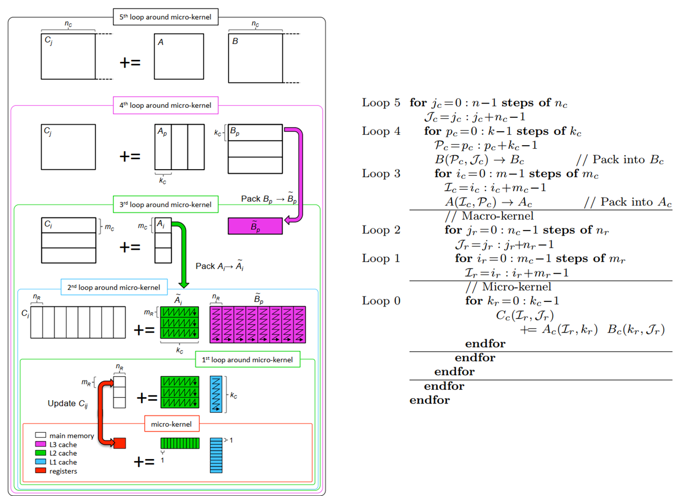

## 利用Loop Tiling优化矩阵乘法

在计算机编程中，特别是在性能优化领域，循环展开（Loop Unrolling）和循环分块（Loop Tiling，又称为 Loop Blocking 或 Blocking Transformation）是两种提高程序效率的常用技术。它们虽然都是循环优化的策略，但目的和实现方式有所不同。

### 循环展开（Loop Unrolling）

- **目的**：==减少循环的迭代次数和循环开销==（如循环控制和分支预测失败）。

- **实现方式**：在每次迭代中执行多个操作。例如，一个简单的循环体在展开后，其内部的操作可能会被复制几次，每次迭代处理多个数据元素。

- **效果**：可以减少循环次数，减少分支预测失败的成本，以及减少循环维护（如索引增加和终止条件检查）的开销。

- **适用情况**：当循环体较小，且迭代次数较多时，循环展开通常效果显著。

- 示例

  ```c++
  // 原始循环
  for (int i = 0; i < n; i++) {
      array[i] = 2 * i;
  }
  
  // 循环展开
  for (int i = 0; i < n; i += 2) {
      array[i] = 2 * i;
      array[i + 1] = 2 * (i + 1);
  }
  ```

### 循环分块（Loop Tiling）

- **目的**：==优化数据的缓存利用==，特别是对于多维数据处理（如矩阵运算）。

- **实现方式**：将大循环分解成小块（“tiles”），这样可以使得处理的数据集更好地适应缓存大小，从而减少缓存缺失（Cache Miss）。

- **效果**：通过保持当前工作集合在缓存中，可以减少对主内存的访问，提高数据访问的局部性。

- **适用情况**：在处理大数组或矩阵时尤为有效，如矩阵乘法。

- 示例

  ```c++
  // 假设对一个大矩阵进行处理
  for (int i = 0; i < N; i += TILE_SIZE) {
      for (int j = 0; j < N; j += TILE_SIZE) {
          // 处理一个 TILE_SIZE x TILE_SIZE 的小块
          for (int k = i; k < i + TILE_SIZE; k++) {
              for (int l = j; l < j + TILE_SIZE; l++) {
                  // 处理元素 array[k][l]
              }
          }
      }
  }
  ```

### 区别总结

- **目的区别**：循环展开主要是为了减少循环的迭代次数和循环开销，而循环分块主要是为了改善缓存的使用效率。
- **实现区别**：循环展开通过增加单次迭代的工作量来减少迭代次数；循环分块则通过重组循环的迭代顺序来增加数据的局部性和缓存命中率。
- **适用场景不同**：循环展开适用于小循环体和多迭代的情况，循环分块则更适合于大规模数据处理，特别是需要优化内存访问模式的场景。


## GEMM

GEMM 是 General Matrix Multiply（通用矩阵乘法）的缩写，指的是一种在科学计算、工程应用和机器学习等领域常用的基本操作，即两个矩阵的乘法。GEMM 在许多数值计算库和框架中都是一个核心函数，因为它是许多更复杂运算的基础。

GEMM 的一般形式可以表示为：

```mathematica
C = αAB + βC
```

其中：

- `A` 和 `B` 是输入矩阵。
- `C` 是输出矩阵。
- `α` 和 `β` 是标量因子。

在这个操作中，你可以控制矩阵乘法的比例（通过 `α`）以及结果与原始 `C` 矩阵的混合方式（通过 `β`）。这种灵活性使得 GEMM 可以适用于各种矩阵运算场景。

### 应用

1. **科学计算**：在物理、工程、经济学等领域的模型和计算中，矩阵乘法是解决线性代数问题的基本操作。
2. **机器学习和深度学习**：神经网络的许多操作，如全连接层的前向和反向传播，可以表示为 GEMM 操作。
3. **图像处理**：在图像处理和计算机视觉中，许多滤波器和变换操作也可以通过矩阵乘法实现。

### 实现和优化

由于 GEMM 的重要性，很多数值计算库（如 BLAS、LAPACK）提供了高度优化的 GEMM 实现。这些实现通常会利用多线程、向量化（SIMD 指令）以及特定硬件（如 GPU）的特性来提高计算效率。

例如，使用 CUDA 或 OpenCL 在 GPU 上实现的 GEMM，可以显著提高大规模矩阵乘法的性能，这在深度学习训练中尤为重要。

总的来说，GEMM 是一个在多个领域中广泛应用的基本运算，对于高性能计算尤为关键。


## Loop tiling / multi-level cache tiling

