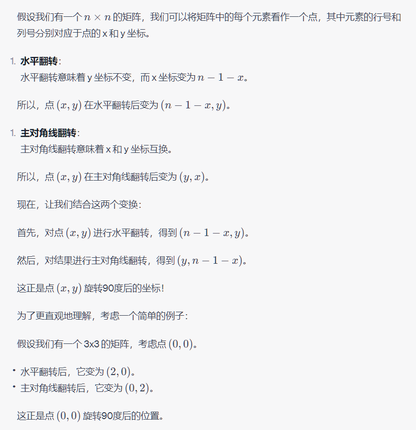
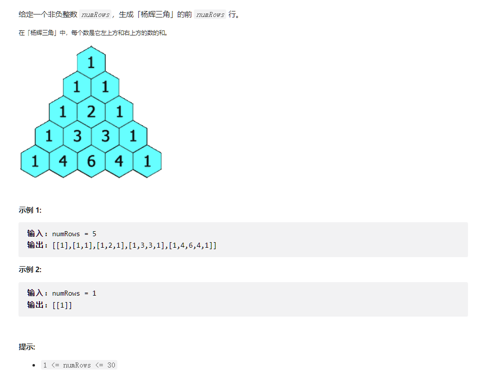
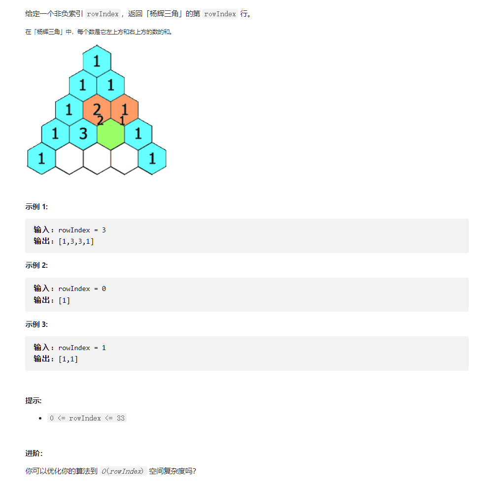
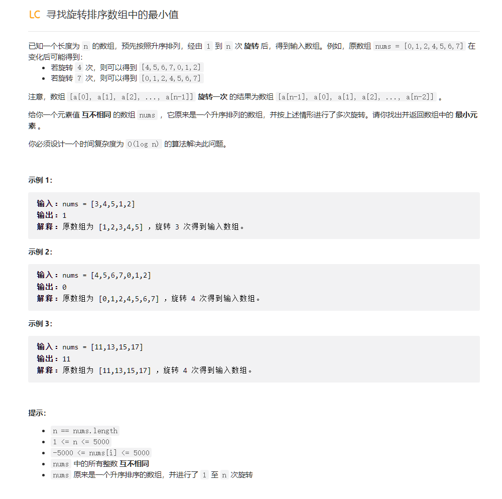
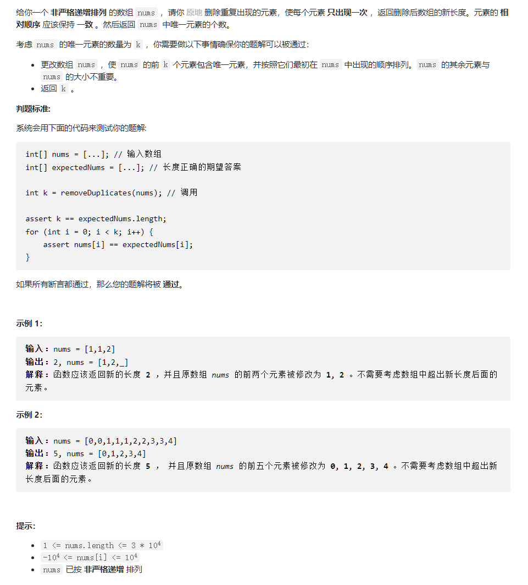
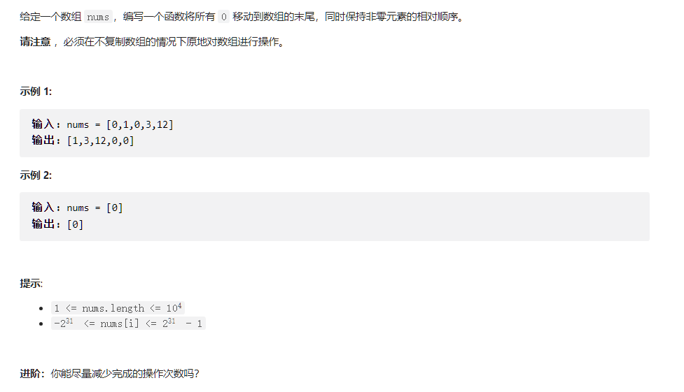

计算算法的复杂度通常涉及到两种主要的复杂度：时间复杂度和空间复杂度。

1. **时间复杂度**：表示算法执行的步骤数与输入大小的关系。它给出了算法运行时间如何随输入大小的增加而变化。
2. **空间复杂度**：表示算法使用的内存量与输入大小的关系。

以下是计算时间复杂度的一般步骤：

1. **确定输入的大小**：首先，你需要确定算法的输入大小。这通常是问题的规模，例如数组的长度或列表中的元素数量。
2. **识别基本操作**：确定算法中最频繁执行的操作。例如，在排序算法中，比较操作可能是最基本的操作。
3. **计数基本操作**：对于给定大小的输入，计算基本操作的数量。
4. **使用大O表示法**：忽略常数和较小的项，只关注主要的项。例如，对于`3n^2 + 2n + 4`，时间复杂度是`O(n^2)`。

常见的时间复杂度（按增长速度排序）：

- **O(1)**：常数时间
- **O(log n)**：对数时间
- **O(n)**：线性时间
- **O(n log n)**：线性对数时间
- **O(n^2), O(n^3), ...**：多项式时间
- **O(2^n)**：指数时间
- **O(n!)**：阶乘时间

计算空间复杂度的方法与时间复杂度类似，但关注的是算法使用的内存量，而不是执行的步骤数。

**注意**：实际的运行时间和空间使用可能会受到许多因素的影响，如硬件、编译器优化等。复杂度分析提供了一个高层次的、与实现和硬件无关的算法性能评估。

最后，虽然复杂度分析是评估算法效率的关键工具，但在实际应用中，还需要考虑其他因素，如常数因子、低阶项和实际数据分布等。


# 1.数组和字符串

## 1.1 集合、列表和数组


集合包含列表，列表包含数组。

* 集合无序类型不定
* 列表有序，包含连续存储的顺序表与非连续存储的链表
* 数组有序（申请连续内存空间），相比列表，数组有索引，且是连续存储的

### 1.1.1 数组的操作

* 读数据：下标索引，地址索引(*)两种方法

######  申请内存与解地址符

> 1. **为什么申请内存需要乘 `sizeof(type)`**：
>
>    当你在 C++ 中使用 `malloc` 或 `new` 为一个类型（如 `int`、`double` 等）申请内存时，你实际上是在请求为该类型的一个或多个实例分配内存。因为不同的数据类型有不同的大小，所以你需要使用 `sizeof(type)` 来确定每个实例所需的字节数。
>
>    例如，假设你想为一个 `int` 数组分配内存，该数组有 10 个元素。在大多数系统上，一个 `int` 占用 4 字节，所以你需要 40 字节的内存。这就是为什么你会这样做：
>
>    ```
>    cppCopy code
>    int* arr = new int[10];  // 或使用 malloc： int* arr = (int*)malloc(10 * sizeof(int));
>    ```
>
>    在上面的代码中，`new` 或 `malloc` 会为你分配 40 字节的内存。
>
> 2. **为什么使用 `\*(p+1)` 这种方式访问不需要乘 `sizeof(type)`**：
>
>    当你对指针进行算术运算时，C++ 已经为你考虑了指针所指向的数据类型的大小。这意味着，当你增加或减少一个指针的值时，它实际上是按照它所指向的数据类型的大小来移动的。
>
>    例如，如果 `p` 是一个指向 `int` 的指针，并且 `int` 在你的系统上占用 4 字节，那么 `p+1` 会指向内存中的下一个 `int`，即 `p` 之后的 4 字节。
>
>    这就是为什么你可以这样做：
>
>    ```
>    cppCopy codeint* arr = new int[10];
>    int* p = arr;       // p 指向数组的第一个元素
>    int* next = p + 1;  // next 指向数组的第二个元素
>    ```
>
>    在上面的代码中，`p + 1` 自动考虑了 `int` 的大小，所以你不需要明确地乘以 `sizeof(int)`。

* 查找元素：遍历
* 插入元素：需要链表
* 删除元素：`O（N）`

### 1.1.2 题目-寻找数组中心索引

用一个前缀数组即可，对于i,前缀为`sum[i]`,后缀为`total-sum[i-1]-num[i]`

### 1.1.3 题目-搜索插入位置

有一个小问题，以下两段代码,第一段代码会报错。

```c++
class Solution {
public:
    int searchInsert(vector<int>& nums, int target) {
        int left = 0;
        int right = nums.size();
        int idx =(left+right)/2;
        int lst_idx = idx;
        bool is_exist {true};
        while(is_exist){
            if(nums[idx] < target){
                left = idx;
                idx = (left+right)/2;
            }else if(nums[idx] > target){
                right = idx;
                idx = (left + right)/2;
            }else{
                return idx;
            }
            if(idx == lst_idx){
                is_exist=false;
                return idx+1;
            }
            lst_idx = idx;
        }
        
    }

};
```

```c++
class Solution {
public:
    int searchInsert(vector<int>& nums, int target) {
        int left = 0;
        int right = nums.size();
        int idx =(left+right)/2;
        int lst_idx = idx;
        bool is_exist {true};
        while(is_exist){
            if(nums[idx] < target){
                left = idx;
                idx = (left+right)/2;
            }else if(nums[idx] > target){
                right = idx;
                idx = (left + right)/2;
            }else{
                return idx;
            }
            if(idx == lst_idx){
                is_exist=false;
            }
            lst_idx = idx;
        }
        return idx+1;
        
    }

};
```

###### 编译器静态分析代码与分支函数报错

确实，由于 `is_exist` 的初始值为 `true`，并且只有在 `idx` 和 `lst_idx` 相等时 `is_exist` 才会被设置为 `false`，`while` 循环会继续执行，直到满足其中一个 `return` 条件。

==但是，编译器在静态分析代码时可能无法确定 `while` 循环的确会在某个时刻退出。因此，编译器可能会认为存在一个潜在的路径，使得函数没有返回值，从而导致错误。==

为了消除这种不确定性并使代码更清晰，建议在函数的末尾提供一个默认的返回值，即使在逻辑上看起来这个返回值可能永远不会被执行。

所以，即使在实际运行时第一段代码可能永远不会遇到没有返回值的情况，但为了代码的清晰性和消除编译器的警告/错误，最好确保所有可能的执行路径都有返回值。

==另外需要考虑这个值是最小的情况，此段代码不会返回idx=0，需要另外判别（即边界情况）==

```c++
class Solution {
public:
    int searchInsert(vector<int>& nums, int target) {
        int left = 0;
        int right = nums.size();
        int idx =(left+right)/2;
        int lst_idx = idx;
        bool is_exist {true};
        while(is_exist){
            if(nums[idx] < target){
                left = idx;
                idx = (left+right)/2;
            }else if(nums[idx] > target){
                right = idx;
                idx = (left + right)/2;
            }else{
                return idx;
            }
            if(idx == lst_idx){
                is_exist =false;
            }
            lst_idx = idx;
        }
        if(idx == 0){
            if(target < nums[0])
                return 0;
            else    
                return idx+1;
        }else
        {
            return idx+1;
        }
    }

};


```

### 1.1.4 题目-合并区间

#### 知识点

###### **lambda表达式**

**[]**：这是 lambda 表达式的捕获子句。它定义了 lambda 函数体外部的哪些变量可以在 lambda 函数体内部使用。在这个例子中，捕获子句是空的，这意味着 lambda 函数不捕获任何外部变量。

- `[=]`：捕获所有外部变量，并以值方式传递。
- `[&]`：捕获所有外部变量，并以引用方式传递。
- `[x, &y]`：捕获变量 `x` 以值方式传递，捕获变量 `y` 以引用方式传递。

以下是一些 lambda 表达式的示例，以及它们的用途：

1. **基本的 lambda 表达式**：

```c++
auto simpleLambda = []() { std::cout << "Hello from lambda!" << std::endl; };
simpleLambda();  // 输出: Hello from lambda!
```

1. **带参数的 lambda 表达式**：

```c++
auto add = [](int a, int b) { return a + b; };
std::cout << add(3, 4);  // 输出: 7
```

1. **捕获外部变量的 lambda 表达式**：

```c++
int x = 10;
auto addX = [x](int a) { return a + x; };
std::cout << addX(5);  // 输出: 15
```

1. **以引用方式捕获外部变量**：

```c++
int y = 20;
auto modifyY = [&y](int newVal) { y = newVal; };
modifyY(50);
std::cout << y;  // 输出: 50
```

1. **使用 `mutable` 关键字修改以值方式捕获的外部变量**：

```c++
int z = 30;
auto modifyZ = [z](int newVal) mutable { z = newVal; return z; };
std::cout << modifyZ(100);  // 输出: 100
std::cout << z;  // 输出: 30 (原始的 z 值没有改变)
```

1. **复杂的 lambda 表达式，例如在 `std::sort` 中使用**：

```c++
std::vector<std::string> fruits = {"apple", "banana", "cherry", "date"};
std::sort(fruits.begin(), fruits.end(), [](const std::string& a, const std::string& b) {
    return a.length() < b.length();
});
// fruits: {"date", "apple", "cherry", "banana"} (按字符串长度排序)
```

1. **使用 lambda 表达式作为其他函数的参数**：

```c++
std::vector<int> numbers = {1, 2, 3, 4, 5};
int countEven = std::count_if(numbers.begin(), numbers.end(), [](int n) { return n % 2 == 0; });
std::cout << countEven;  // 输出: 2 (因为有两个偶数: 2 和 4)
```


#### 题目与解答

以数组 intervals 表示若干个区间的集合，其中单个区间为 intervals[i] = [starti, endi] 。请你合并所有重叠的区间，并返回 一个不重叠的区间数组，该数组需恰好覆盖输入中的所有区间 。

 

示例 1：

输入：intervals = [[1,3],[2,6],[8,10],[15,18]]
输出：[[1,6],[8,10],[15,18]]
解释：区间 [1,3] 和 [2,6] 重叠, 将它们合并为 [1,6].
示例 2：

输入：intervals = [[1,4],[4,5]]
输出：[[1,5]]
解释：区间 [1,4] 和 [4,5] 可被视为重叠区间。


提示：

$1 <= intervals.length <= 104$
$intervals[i].length == 2$
$0 <= starti <= endi <= 104$


```c++
class Solution {
public:
    vector<vector<int>> merge(vector<vector<int>>& intervals) {
        sort(intervals.begin(),intervals.end(),[](const vector<int>& a, const vector<int>& b){
            if (a[0] == b[0]) {
                return a[1] < b[1];
            }
            return a[0] < b[0];
        });

        int left {0};
        int right{0};
        
        vector<vector<int>> result; 

        for(int i{0};i < intervals.size();i++)
        {   
            if(i == 0)
            {
                left = intervals[0][0];
                right = intervals[0][1];
            }
            else
            {
                // update
                if(intervals[i][0] <= right)
                {
                    right = max(right, intervals[i][1]);
                }
                
                // change interval
                if(intervals[i][0] > right)
                {
                    vector<int> temp;
                    temp.push_back(left);
                    temp.push_back(right);
                    result.push_back(temp);
                    left = intervals[i][0];
                    right = intervals[i][1];
                }
            }
            // meet end
            if(i == intervals.size()-1){
                    vector<int> temp;
                    temp.push_back(left);
                    temp.push_back(right);
                    result.push_back(temp);
                    break;
                }
            
        }
        return result;
    }
};
```


## 1. 2 二维数组

### 1.2.1 二维数组简介

类似一维数组，对于一个二维数组 A = [[1, 2, 3, 4],[2, 4, 5, 6],[1, 4, 6, 8]]，计算机同样会在内存中申请一段 连续 的空间，并记录第一行数组的索引位置，即 A[0][0] 的内存地址，它的索引与内存地址的关系如下图所示。


### 1.2.2 题目-旋转矩阵

解法：容易找到规律，$vec[a][b]\rightarrow vec[b][N-a-1]$，$O(N^2)$

额外要求：不占用额外存储

新解法：

###### 旋转算法

###### ###### vector swap

==vector只能进行vector层面的交换，而如果要对vector<int>a,a[0]和a[1]两个int交换，则只能使用std::swap==

`std::vector` 提供了一个 `swap` 成员函数，它允许你快速交换两个向量的内容。这个操作是非常高效的，因为它只交换内部的指针、大小和容量，而不是实际的数据。

以下是如何使用 `std::vector` 的 `swap` 函数的示例：

```c++
#include <iostream>
#include <vector>

int main() {
    std::vector<int> vec1 = {1, 2, 3, 4, 5};
    std::vector<int> vec2 = {10, 20, 30, 40, 50};

    // 使用成员函数 swap 交换两个向量的内容
    vec1.swap(vec2);

    // 输出 vec1 的内容
    for (int num : vec1) {
        std::cout << num << " ";
    }
    std::cout << std::endl;

    // 输出 vec2 的内容
    for (int num : vec2) {
        std::cout << num << " ";
    }

    return 0;
}
```

输出：

```c++
10 20 30 40 50 
1 2 3 4 5 
```

除了成员函数 `swap`，C++ 标准库还提供了一个通用的 `swap` 函数，你可以使用 `std::swap(vec1, vec2)` 来达到同样的效果。但对于 `std::vector`，使用成员函数 `swap` 通常更为直观。

###### 结果

```c++
class Solution {
public:
    void rotate(vector<vector<int>>& matrix) {
        int size = matrix.size();
        for(int i {0};i < size/2;i++){
            matrix[i].swap(matrix[size-1-i]);
        }
        for(int i {0}; i < size;i++){
            for(int j = i+1; j < size;j++){
                swap(matrix[i][j],matrix[j][i]);
            }
        }
    }
};
```

### 1.2.3 题目-0矩阵

编写一种算法，若M × N矩阵中某个元素为0，则将其所在的行与列清零。

 

示例 1：

输入：
[
  [1,1,1],
  [1,0,1],
  [1,1,1]
]
输出：
[
  [1,0,1],
  [0,0,0],
  [1,0,1]
]
示例 2：

输入：
[
  [0,1,2,0],
  [3,4,5,2],
  [1,3,1,5]
]
输出：
[
  [0,0,0,0],
  [0,4,5,0],
  [0,3,1,0]
]

作者：LeetCode
链接：https://leetcode.cn/leetbook/read/array-and-string/ciekh/
来源：力扣（LeetCode）
著作权归作者所有。商业转载请联系作者获得授权，非商业转载请注明出处。


过程：我们只需要确定哪些行列存在0即可

```c++
class Solution {
public:
    void setZeroes(vector<vector<int>>& matrix) {
        int col = matrix.size();
        int row = matrix[0].size();
        vector<int> rcount(row,1),ccount(col,1);

        for(int i {0}; i < col;i++){
            for(int j {0};j < row;j++){
                if(matrix[i][j] == 0){
                    if(rcount[j])
                        rcount[j]=0;
                    if(ccount[i])
                        ccount[i]=0;
                }
            }
        }
        for(int i {0}; i < col;i++){
            for(int j {0};j < row;j++){
                if(!rcount[j] || !ccount[i])
                    matrix[i][j] = 0;
            }
        }

        
    }
};
```

### 1.2.4 题目-对角线遍历

###### 题目

给你一个大小为 m x n 的矩阵 mat ，请以对角线遍历的顺序，用一个数组返回这个矩阵中的所有元素。

 

示例 1：


输入：mat = [[1,2,3],[4,5,6],[7,8,9]]
输出：[1,2,4,7,5,3,6,8,9]
示例 2：

输入：mat = [[1,2],[3,4]]
输出：[1,2,3,4]


提示：

m == mat.length
n == mat[i].length
1 <= m, n <= 104
1 <= m * n <= 104
-105 <= mat[i][j] <= 105

作者：LeetCode
链接：https://leetcode.cn/leetbook/read/array-and-string/cuxq3/
来源：力扣（LeetCode）
著作权归作者所有。商业转载请联系作者获得授权，非商业转载请注明出处。

###### 解答

挺麻烦的一个模拟题,思路就是模拟对角线，一共有两种对角线，左下和右上，分别对应(x-1,y+1),(x+1,y-1)的操作。需要注意以下几个点：

* 每个方向在边上越界有两种情况
  * 左下方向的`if(x > mat.size()-1)`和`if(y < 0)`
  * 右上方向的`if(y > mat[0].size()-1)`和`if(x < 0)`
* 为了判别在角上越界的情况(右上角，左下角），需要考虑判断重合，重复操作的问题
  * `if(x > mat.size()-1)`必须在`if(y < 0)`前
  * `if(y > mat[0].size()-1)`必须在`if(x < 0)`前
* 还有一种写法是用while写

```c++
class Solution {
public:

    vector<int> findDiagonalOrder(vector<vector<int>>& mat) {
        bool is_left_down {false};
        bool is_not_terminated{true};
        vector<int> result;
        int x {0};
        int y {0};
        do{
            result.push_back(mat[x][y]);
            if(x == mat.size()-1 && y == mat[0].size()-1)
                is_not_terminated = false;
            if(is_left_down){
                x = x + 1;
                y = y - 1;

                if(x > mat.size()-1){
                    x = mat.size()-1;
                    y += 2;
                    is_left_down = false;
                }
                if(y < 0){
                    y = 0;
                    is_left_down = false;
                }
                
            }else{
                x = x - 1;
                y = y + 1;
                if(y > mat[0].size()-1){
                    
                    x += 2;
                    y = mat[0].size() - 1;
                    is_left_down = true;
                }
                if(x < 0){
                    x = 0;
                    is_left_down = true;
                }
                
            }
            
        }while(is_not_terminated);
        return result;
    }
};
```

## 1.3 字符串介绍

* C++比较: `==`
* 连接操作(string 可以直接相加,cstyle string只能和string相加)


### 1.3.1 题目-最长公共前缀

```c++
class Solution {
public:
    string longestCommonPrefix(vector<string>& strs) {
        int idx {0}; 
        bool notstop {true};
        string result{};
        int min_length {300};
        for(int i {0}; i < strs.size();i++){
            if(strs[i].length()==0){
                return "";
            }
            if(strs[i].length() < min_length){
                min_length = strs[i].length();
            }
        }
        if(strs.size()==1)
            return strs[0];
        while(notstop && idx < min_length)
        {
            char temp = strs[0][idx];
            for(int i {1}; i < strs.size();i++)
            {
                if(temp != strs[i][idx])
                {
                    notstop = false;
                    break;
                }

            }
            if(notstop){
                result+=temp;
            }
            idx++;

        }
        return result;
    }
};
```


### 1.3.2 最长回文串

**动态规划解法**：

```c++
class Solution {
public:
    string longestPalindrome(string s) {
        int len = s.length();

        int maxlength {1}; //因为默认单个字符也算回文串，若是不置为0会忽略例如"ac"，"a"为回文串
        int ml_idx {0};
        vector<vector<int>>dp(len, vector<int>(len, 0));
        
        //讨论s为单独字符的情况
        if(s.length()==1){
            return s;
        }

        for(int i {0}; i < len; i++){
            dp[i][i] = 1;
        }
        //dp
        // 遍历长度,L是字符串长度
        for(int L {2}; L < len+1; L++)//L<len+1最好，不然对于"bb"这种字符串，根本不会进入循环
        {
            for(int begin {0}; begin < len; begin++){
                // 需要减一是为了从“aa”这种情况开始考虑
                int end = begin + L-1;
                if(end > len-1){
                    break;
                }
                if(s[begin] == s[end]){
                    // 奇数个情况或是偶数情况:aba这种一定回文,aa也是
                    if(L <= 3){
                        dp[begin][end] = 1;
                    }else{
                        //因为上面的if,这里的end-begin一定大于3，不会出现begin+1比end-1大
                        dp[begin][end] = dp[begin+1][end-1]; 
                    }
                }
                // 更新最优解
                if(dp[begin][end] == 1 && maxlength < L){
                    maxlength = L;
                    ml_idx = begin;
                }
            }
        }
        return s.substr(ml_idx, maxlength);

    }
};
```

**Manacher算法O(n)**

还有一个复杂度为 O(n)O(n)O(n) 的 Manacher\text{Manacher}Manacher 算法。然而本算法十分复杂，一般不作为面试内容。这里给出，仅供有兴趣的同学挑战自己。

为了表述方便，我们定义一个新概念臂长，表示中心扩展算法向外扩展的长度。如果一个位置的最大回文字符串长度为 2 * length + 1 ，其臂长为 length。

下面的讨论只涉及长度为奇数的回文字符串。长度为偶数的回文字符串我们将会在最后与长度为奇数的情况统一起来。

思路与算法

在中心扩展算法的过程中，我们能够得出每个位置的臂长。那么当我们要得出以下一个位置 i 的臂长时，能不能利用之前得到的信息呢？

答案是肯定的。具体来说，如果位置 j 的臂长为 length，并且有 j + length > i，如下图所示：

当在位置 i 开始进行中心拓展时，我们可以先找到 i 关于 j 的对称点 2 * j - i。那么如果点 2 * j - i 的臂长等于 n，我们就可以知道，点 i 的臂长至少为 min(j + length - i, n)。那么我们就可以直接跳过 i 到 i + min(j + length - i, n) 这部分，从 i + min(j + length - i, n) + 1 开始拓展。

我们只需要在中心扩展法的过程中记录右臂在最右边的回文字符串，将其中心作为 j，在计算过程中就能最大限度地避免重复计算。

那么现在还有一个问题：如何处理长度为偶数的回文字符串呢？

我们可以通过一个特别的操作将奇偶数的情况统一起来：我们向字符串的头尾以及每两个字符中间添加一个特殊字符 #，比如字符串 aaba 处理后会变成 #a#a#b#a#。那么原先长度为偶数的回文字符串 aa 会变成长度为奇数的回文字符串 #a#a#，而长度为奇数的回文字符串 aba 会变成长度仍然为奇数的回文字符串 #a#b#a#，我们就不需要再考虑长度为偶数的回文字符串了。

注意这里的特殊字符不需要是没有出现过的字母，我们可以使用任何一个字符来作为这个特殊字符。这是因为，当我们只考虑长度为奇数的回文字符串时，每次我们比较的两个字符奇偶性一定是相同的，所以原来字符串中的字符不会与插入的特殊字符互相比较，不会因此产生问题。

```c++
class Solution {
public:
    int expand(const string& s, int left, int right) {
        while (left >= 0 && right < s.size() && s[left] == s[right]) {
            --left;
            ++right;
        }
        return (right - left - 2) / 2;
    }

    string longestPalindrome(string s) {
        int start = 0, end = -1;
        string t = "#";
        for (char c: s) {
            t += c;
            t += '#';
        }
        t += '#';
        s = t;

        vector<int> arm_len;
        int right = -1, j = -1;
        for (int i = 0; i < s.size(); ++i) {
            int cur_arm_len;
            if (right >= i) {
                int i_sym = j * 2 - i;
                int min_arm_len = min(arm_len[i_sym], right - i);
                cur_arm_len = expand(s, i - min_arm_len, i + min_arm_len);
            } else {
                cur_arm_len = expand(s, i, i);
            }
            arm_len.push_back(cur_arm_len);
            if (i + cur_arm_len > right) {
                j = i;
                right = i + cur_arm_len;
            }
            if (cur_arm_len * 2 + 1 > end - start) {
                start = i - cur_arm_len;
                end = i + cur_arm_len;
            }
        }

        string ans;
        for (int i = start; i <= end; ++i) {
            if (s[i] != '#') {
                ans += s[i];
            }
        }
        return ans;
    }
};

```


### 1.3.3 翻转字符串里的单词

给你一个字符串 s ，请你反转字符串中 单词 的顺序。

单词 是由非空格字符组成的字符串。s 中使用至少一个空格将字符串中的 单词 分隔开。

返回 单词 顺序颠倒且 单词 之间用单个空格连接的结果字符串。

注意：输入字符串 s中可能会存在前导空格、尾随空格或者单词间的多个空格。返回的结果字符串中，单词间应当仅用单个空格分隔，且不包含任何额外的空格。

 

示例 1：

输入：s = "the sky is blue"
输出："blue is sky the"
示例 2：

输入：s = "  hello world  "
输出："world hello"
解释：反转后的字符串中不能存在前导空格和尾随空格。
示例 3：

输入：s = "a good   example"
输出："example good a"
解释：如果两个单词间有多余的空格，反转后的字符串需要将单词间的空格减少到仅有一个。


提示：

1 <= s.length <= 104
s 包含英文大小写字母、数字和空格 ' '
s 中 至少存在一个 单词


进阶：如果字符串在你使用的编程语言中是一种可变数据类型，请尝试使用 O(1) 额外空间复杂度的 原地 解法。

```c++
class Solution {
public:
    string reverseWords(string s) {
        int ptr {0};
        string result{};
        while(ptr < s.length()){
            if(s[ptr] != ' '){
                string temp{};
                while(s[ptr] != ' ' && ptr < s.length()){
                    temp.push_back(s[ptr]);
                    ptr++;
                }
                if(result.empty()){
                    result = temp;
                }else
                    result = temp +" "+ result;
            }else{
                ptr++;
            }

        }
        return result;
    }

};
```


### 1.3.4 KMP**

KMP 算法中，使用一个数组 `next` 来保存 `P` 中元素不匹配时，下一步应该重新开始的下标。

构造方法为：**`next[i]` 对应的下标，为 `P[0...i - 1]` 的最长公共前缀后缀的长度，令 `next[0] = -1`。**


* 考虑一定存在解
* 返回匹配字符串起始位置

```c++
int *buildNext(char* Pattern){
    size_t pattern_length = strlen(Pattern);
    size_t j = 0;
    
    int *N = new int[pattern_length];
    int matchlen  = N[0] = -1;//模式串的第一个字符与目标串的当前字符不匹配时，模式串不需要回退，而目标串应该前进一个字符。
    
    while(j < pattern_length - 1){
        if(matchlen < 0 || Pattern[j] == Pattern[matchlen])//match or not begin yet
        {
            N[j+1] = matchlen+1;
            j++;matchlen++; 
        }else{
            matchlen = N[matchlen];	//
        }
    }
    return N;
}


int KMP(char *Pattern, char *Target){//模板串与目标串
    int *next = buildNext(Pattern);// generate next array
    
    int Tlen = (int)strlen(Target),i=0;
    int Plen = (int)strlen(Pattern),j=0;
    
    
    while(j < Plen && i < Tlen){
        if(j < 0 || Target[i] == Pattern[j])//match
        //如果j小于0，这意味着模式串需要从其第一个字符开始重新匹配(j++=0)，同时目标串前进一个字符(i++)。
        {
            i++;j++;//turn to next 
        }else{
            j = next[j]; //pattern pointer refresh
            //注意这里没有推进i和j
        }
    }
    delete []next;
    return j == Plen-1 ? (i-j) : -1;
    
}


```


### 1.3.5 实现字符匹配

给你两个字符串 haystack 和 needle ，请你在 haystack 字符串中找出 needle 字符串的第一个匹配项的下标（下标从 0 开始）。如果 needle 不是 haystack 的一部分，则返回  -1 。

 

示例 1：

输入：haystack = "sadbutsad", needle = "sad"
输出：0
解释："sad" 在下标 0 和 6 处匹配。
第一个匹配项的下标是 0 ，所以返回 0 。
示例 2：

输入：haystack = "leetcode", needle = "leeto"
输出：-1
解释："leeto" 没有在 "leetcode" 中出现，所以返回 -1 。


提示：

1 <= haystack.length, needle.length <= 104
haystack 和 needle 仅由小写英文字符组成


```c++
class Solution {
public:
    int *buildNext(string Pattern){
        size_t pattern_length = Pattern.length();
        size_t j = 0;
    
        int *N = new int[pattern_length];
        int t  = N[0] = -1;
    
        while(j < pattern_length - 1){
            if(t < 0 || Pattern[j] == Pattern[t])//match or not begin yet
            {
                N[j+1] = t+1;
                j++;t++; 
            }else{
                t = N[t];	
            }
        }
        return N;
    }
    int strStr(string haystack, string needle) {
        int *next = buildNext(needle);

        int lenH = haystack.length(),i = 0;
        int lenN = needle.length(),j = 0;

        while(j < lenN && i < lenH){
            if(j < 0 || haystack[i] == needle[j]){
                i++;j++;
            }else{
                j = next[j];//else refresh pattern
            }
        }

        delete []next;
        return j == lenN ? (i-j) : -1;

    }
};
```


## 1.4 双指针技巧

双指针即首尾指针同时操作，没了，根本算不上个技巧


### 1.4.1 反转字符串

编写一个函数，其作用是将输入的字符串反转过来。输入字符串以字符数组 s 的形式给出。

不要给另外的数组分配额外的空间，你必须原地修改输入数组、使用 O(1) 的额外空间解决这一问题。

 

示例 1：

输入：s = ["h","e","l","l","o"]
输出：["o","l","l","e","h"]
示例 2：

输入：s = ["H","a","n","n","a","h"]
输出：["h","a","n","n","a","H"]


提示：

1 <= s.length <= 105
s[i] 都是 ASCII 码表中的可打印字符

```c++
class Solution {
public:
    void swap(vector<char>& s, int a, int b){
        char temp = s[a];
        s[a] = s[b];
        s[b] = temp;
    }
    void reverseString(vector<char>& s) {
        int front_ptr {0}, tail_ptr {(int)s.size()-1};
        while(front_ptr < tail_ptr){
            swap(s,front_ptr,tail_ptr);
            front_ptr++;
            tail_ptr--;
        }
    }
};
```


### 1.4.2 数组拆分I


给定长度为 2n 的整数数组 nums ，你的任务是将这些数分成 n 对, 例如 (a1, b1), (a2, b2), ..., (an, bn) ，使得从 1 到 n 的 min(ai, bi) 总和最大。

返回该 最大总和 。

 

示例 1：

输入：nums = [1,4,3,2]
输出：4
解释：所有可能的分法（忽略元素顺序）为：
1. (1, 4), (2, 3) -> min(1, 4) + min(2, 3) = 1 + 2 = 3
2. (1, 3), (2, 4) -> min(1, 3) + min(2, 4) = 1 + 2 = 3
3. (1, 2), (3, 4) -> min(1, 2) + min(3, 4) = 1 + 3 = 4
所以最大总和为 4
示例 2：

输入：nums = [6,2,6,5,1,2]
输出：9
解释：最优的分法为 (2, 1), (2, 5), (6, 6). min(2, 1) + min(2, 5) + min(6, 6) = 1 + 2 + 6 = 9


提示：

1 <= n <= 104
nums.length == 2 * n
-104 <= nums[i] <= 104


> 排序然后偶数下标元素之和

```c++
class Solution {
public:
    int arrayPairSum(vector<int>& nums) {
        sort(nums.begin(),nums.end());
        int sum {0};
        for(int i = 0; i < nums.size();i+=2){
            sum += nums[i];
        }
        return sum;
    }
};
```


> 标准解法给的是桶排，然后对应数字偶数除二，奇数借一个


### 1.4.3 两数之和 II - 输入有序数组

给你一个下标从 1 开始的整数数组 numbers ，该数组已按 非递减顺序排列  ，请你从数组中找出满足相加之和等于目标数 target 的两个数。如果设这两个数分别是 numbers[index1] 和 numbers[index2] ，则 1 <= index1 < index2 <= numbers.length 。

以长度为 2 的整数数组 [index1, index2] 的形式返回这两个整数的下标 index1 和 index2。

你可以假设每个输入 只对应唯一的答案 ，而且你 不可以 重复使用相同的元素。

你所设计的解决方案必须只使用常量级的额外空间。


示例 1：

输入：numbers = [2,7,11,15], target = 9
输出：[1,2]
解释：2 与 7 之和等于目标数 9 。因此 index1 = 1, index2 = 2 。返回 [1, 2] 。
示例 2：

输入：numbers = [2,3,4], target = 6
输出：[1,3]
解释：2 与 4 之和等于目标数 6 。因此 index1 = 1, index2 = 3 。返回 [1, 3] 。
示例 3：

输入：numbers = [-1,0], target = -1
输出：[1,2]
解释：-1 与 0 之和等于目标数 -1 。因此 index1 = 1, index2 = 2 。返回 [1, 2] 。


提示：

2 <= numbers.length <= 3 * 104
-1000 <= numbers[i] <= 1000
numbers 按 非递减顺序 排列
-1000 <= target <= 1000
仅存在一个有效答案
相关标签


==双指针秒了==

```c++
class Solution {
public:
    vector<int> twoSum(vector<int>& numbers, int target) {
        int front_ptr {0};
        int back_ptr {(int)numbers.size()-1};
        int result = numbers.at(front_ptr) + numbers.at(back_ptr);
        vector<int> arr{};
        while(front_ptr < back_ptr){
            if(result > target){
                back_ptr--;
            }else if(result < target){
                front_ptr++;
            }else{
                {
                    arr.push_back(front_ptr+1);
                    arr.push_back(back_ptr+1);
                    break;
                }
            }
            result = numbers.at(front_ptr) + numbers.at(back_ptr);
            
        }
        return arr;
    }
};
```


### 1.4.4 移除元素

给你一个数组 nums 和一个值 val，你需要 原地 移除所有数值等于 val 的元素，并返回移除后数组的新长度。

不要使用额外的数组空间，你必须仅使用 O(1) 额外空间并 原地 修改输入数组。

元素的顺序可以改变。你不需要考虑数组中超出新长度后面的元素。

 

说明:

为什么返回数值是整数，但输出的答案是数组呢?

请注意，输入数组是以「引用」方式传递的，这意味着在函数里修改输入数组对于调用者是可见的。

你可以想象内部操作如下:

// nums 是以“引用”方式传递的。也就是说，不对实参作任何拷贝
int len = removeElement(nums, val);

// 在函数里修改输入数组对于调用者是可见的。
// 根据你的函数返回的长度, 它会打印出数组中 该长度范围内 的所有元素。
for (int i = 0; i < len; i++) {
    print(nums[i]);
}


示例 1：

输入：nums = [3,2,2,3], val = 3
输出：2, nums = [2,2]
解释：函数应该返回新的长度 2, 并且 nums 中的前两个元素均为 2。你不需要考虑数组中超出新长度后面的元素。例如，函数返回的新长度为 2 ，而 nums = [2,2,3,3] 或 nums = [2,2,0,0]，也会被视作正确答案。
示例 2：

输入：nums = [0,1,2,2,3,0,4,2], val = 2
输出：5, nums = [0,1,4,0,3]
解释：函数应该返回新的长度 5, 并且 nums 中的前五个元素为 0, 1, 3, 0, 4。注意这五个元素可为任意顺序。==你不需要考虑数组中超出新长度后面的元素。==


提示：

0 <= nums.length <= 100
0 <= nums[i] <= 50
0 <= val <= 100


> 使用双指针，back_ptr是val直接略去，front_ptr是val用back_ptr代替
>
> 使用while(front_ptr <= back_ptr)的原因是`[3,3]`的例子

```c++
class Solution {
public:
    int removeElement(vector<int>& nums, int val) {
        int front_ptr {0}, back_ptr{(int)nums.size()-1};

        if(front_ptr == back_ptr){
            if(nums[0] == val)
                return 0;
            else
                return 1;
        }

        while(front_ptr <= back_ptr){
            if(nums.at(back_ptr) == val){
                back_ptr--;
            }
            else if(nums.at(front_ptr) == val){
                nums.at(front_ptr) = nums.at(back_ptr);
                back_ptr--; 
                front_ptr++;
            }else{
                front_ptr++;
            }
        }
        
        return back_ptr+1;
    }
};
```


### 1.4.5 最大连续1的个数

给定一个二进制数组 nums ， 计算其中最大连续 1 的个数。

 

示例 1：

输入：nums = [1,1,0,1,1,1]
输出：3
解释：开头的两位和最后的三位都是连续 1 ，所以最大连续 1 的个数是 3.
示例 2:

输入：nums = [1,0,1,1,0,1]
输出：2


提示：

1 <= nums.length <= 105
nums[i] 不是 0 就是 1.

> 注意需要while(i < nums.size() && nums[i] == 1)这里面&&前后顺序不变，不然数组越界`[1,1,0,1]`

```c++
class Solution {
public:
    int findMaxConsecutiveOnes(vector<int>& nums) {
        int maxlen {0};

        for(int i = 0; i < nums.size();i++){
            int templen {0};
            while(i < nums.size() && nums[i] == 1){
                templen++;
                i++;
            }
            maxlen = max(templen,maxlen);
        }
        return maxlen;
    }
};
```


### 1.4.6 长度最小的子数组

给定一个含有 n 个正整数的数组和一个正整数 target 。

找出该数组中满足其总和大于等于 target 的长度最小的 连续子数组 [numsl, numsl+1, ..., numsr-1, numsr] ，并返回其长度。如果不存在符合条件的子数组，返回 0 。

 

示例 1：

输入：target = 7, nums = [2,3,1,2,4,3]
输出：2
解释：子数组 [4,3] 是该条件下的长度最小的子数组。
示例 2：

输入：target = 4, nums = [1,4,4]
输出：1
示例 3：

输入：target = 11, nums = [1,1,1,1,1,1,1,1]
输出：0


提示：

1 <= target <= 109
1 <= nums.length <= 105
1 <= nums[i] <= 105


进阶：

如果你已经实现 O(n) 时间复杂度的解法, 请尝试设计一个 O(n log(n)) 时间复杂度的解法。


> 不要怕用双while，这使得结构更加清晰

```c++
class Solution {
public:
    int minSubArrayLen(int target, vector<int>& nums) {
        int front_ptr{0}, back_ptr{0};
        int acc{0};
        int minimum_len {1000005};
        while(back_ptr < nums.size()){
            acc += nums[back_ptr];
            while(acc >= target){
                minimum_len = min(minimum_len,back_ptr - front_ptr + 1);
                acc -= nums[front_ptr];
                front_ptr++;
            }
            back_ptr++;
        }
        return (minimum_len == 1000005)?0:minimum_len;
    }
};
```


## 1.5 其他

### 1.5.1 杨辉三角

简单的杨辉三角，没见过一遍过



```c++
class Solution {
public:
    vector<vector<int>> generate(int numRows) {
        vector<vector<int>> result;

        for(int i = 0;i < numRows;i++){
            vector<int> temp {};
            for(int j = 0;j < i+1;j++){
                if(j == 0 || j == i)
                    temp.push_back(1);
                else
                    temp.push_back(result[i-1][j-1]+result[i-1][j]);
            }
            result.push_back(temp);
        }
        return result;
    }
};
```


### 1.5.2 杨辉三角II

仅输出一行

O(rowIndex)的空间复杂度



```c++
class Solution {
public:
    vector<int> getRow(int rowIndex) {
        rowIndex++;
        vector<int> result(rowIndex,1);
        for(int i = 0; i < rowIndex;i++){
            for(int j = i-1;j >0;j--)//首尾不变,应从后向前，因为后面会用到前面的
            {
                result[j] = result[j-1] + result[j];
            }
        }
        return result;
    }
};
```


### 1.5.3 反转字符串中的单词III

1. 遍历字符串`s`。
2. 当遇到非空格字符时，使用`j`来找到该单词的末尾。
3. 使用`std::reverse`函数来反转从`i`到`j`的单词。
4. 更新`i`的值为`j-1`，以便在下一次迭代中跳过已处理的单词。

```c++
class Solution {
public:
    string reverseWords(string s) {

        for (int i = 0; i < s.size(); i++)
        {
            if (s[i] != ' ')
            {
                int j = i;
                while (j < s.size() && s[j] != ' ')j++;
                reverse(s.begin() + i, s.begin() + j);
                i = j -1;
            }
        }
        return s;
    }
};
```


### 1.5.4 寻找旋转排序数组中的最小值**



简单的思路，这个序列明显的分为两个部分，并且其情况是有限的，只考虑当前指针与左右指针的关系，

为了方便讲解，以[3,4,5,1,2]为例, 有以下三种情况：

* 左<当前< 右:正常升序
* 左>当前，右>当前：说明当前在[1,2]中
* 左<当前，右<当前：说明当前在[3,4,5]中

我的代码：

```c++
class Solution {
public:
    int findMin(vector<int>& nums) {
        int left = 0,right = nums.size()-1;
        int ptr = (left + right)/2;

        while(left < right){
            if(nums[left] < nums[ptr] && nums[right] > nums[ptr]){
                right = ptr;
                ptr = (left + right)/2;
            }
            else if(nums[left] > nums[ptr] && nums[right] > nums[ptr]){
                right = ptr;
                ptr = (left + right)/2;

            }
            else if(nums[left] < nums[ptr] && nums[right] < nums[ptr]){
                left = ptr;
                ptr = (left + right)/ 2;
            }else if(left == ptr){
                //等于是为了num[left] = num[ptr] = 1,num[right] = 2的类似情况
                //等于是为了num[left] = num[ptr] = 5,num[right] = 1的类似情况 
                ptr = (nums[right] > nums[left]) ? left : right;
                break;
            }

        }
        return nums[ptr];
    }
};
```

有几点：

* ```c++
  int left = 0,right = nums.size()-1;
  int ptr = (left + right)/2;
  
  //而非
  int ptr = nums.size()/2;
  int left = 0,right = nums.size()-1;
  
  
  //在[1,2]案例中，第二个写法使得ptr=1
  ```

* 考虑到ptr按(left+right)/2最后都会收敛到一个情况：`left=ptr=right-1`，因此需要特别判断一下这种情况


#### 标准答案

标准答案在给right和left变更时直接进行了操作，以避免之前提到的这种情况。

```c++
class Solution {
public:
    int findMin(vector<int>& nums) {
        if(nums.size()<1)return -1;
        if(nums.size()==1){
            return nums[0];
        }
        int n = nums.size();
        int l = 0;
        int r = n-1;
        int idx = 0;
        while(l<=r){
            int mid = (l+r)>>1;
            if(nums[mid]>nums[mid+1]){
                idx = n-mid-1;
                break;
            }else if(nums[mid]<nums[0]){
                r = mid-1;
            }else if(nums[mid]>nums[n-1]){
                l = mid+1;
            }else{
                break;
            }
        }
        return idx==0?nums[0]:nums[n-idx];
    }
};
```


### 1.5.5 删除排序数组中的重复项



简单的移位

```c++
class Solution {
public:
    int removeDuplicates(vector<int>& nums) {
        int current_index{1};
        int last_number{nums[0]};

        for(int i = 1;i < nums.size();i++){
            if(nums[i] != last_number){
                last_number = nums[i];
                nums[current_index++] = nums[i];
            }
        }
        return current_index;   
    }
};
```


### 1.5.6 移动零*



减少操作很简单，就是记录0的位置，记录0之后的非零，交换，然后更新0的位置。

```c++
class Solution {
public:
    void swap(vector<int>& nums,int i, int j){
        int temp = nums[i];
        nums[i] = nums[j];
        nums[j] = temp;
    }
    void find_next_zero(int &now, vector<int> &nums){
        for(int i = now;i < nums.size();i++){
            if(nums[i] == 0){
                now = i;
                return;
            }
        }
    }
    void moveZeroes(vector<int>& nums) {
        //减少移位次数就是用后面的非零和前面的所有零交换
        int current_zero_ptr{0};
        find_next_zero(current_zero_ptr,nums);
        for(int i = 0; i < nums.size(); i++){
            if(i > current_zero_ptr && nums[i] != 0 && nums[current_zero_ptr] == 0){
                swap(nums,current_zero_ptr,i);
                find_next_zero(current_zero_ptr,nums);
            }
        }
        return;
    }
};
```


**标准答案：**

思路相同，双指针，更简洁

这个解决方案使用了双指针技巧。其中，`left`指针指向当前考虑的元素，而`right`指针始终位于`left`指针的右侧，寻找非零元素。这种方法的关键思想是，当`left`指针指向一个零时，`right`指针会前进，直到找到一个非零元素，然后交换这两个元素。

**时间复杂度**：O(n)。每个元素最多被考虑两次。 **空间复杂度**：O(1)。只使用了常数额外空间。

```c++
class Solution {
public:
    void moveZeroes(vector<int>& nums) {
    int len=nums.size();
    int left=0;
    int right=1;
    while(right<len)
    {
            if(nums[left])
            {
                left++;
                right++;
            }
            else 
            {
                if(nums[right])
                swap(nums[left],nums[right]);
                else right++;
            }
    }

    }
};
```

