## 数据结构


数据结构的常用操作：增查删(改)

### 线性数据结构

* 插入：头部尾部中间
* 删除：头部尾部中间
* 查找：顺序查找（从头部往后），随即查找（直接查找数据结构中的某个值）


数组:所有操作需要在O(1)实现

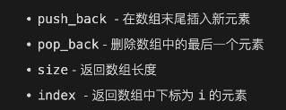

栈：后进先出，所有操作需要在O(1)内完成，pop和push都在栈顶

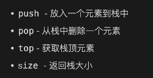

队列：队列只能从尾部插入，在头部删除

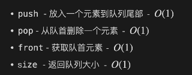

双端队列：只用一端就是栈，只用一端插入一端删除就是普通队列


链表：

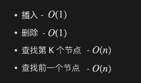


### 其他数据结构

字典：记录某个元素在之前是否出现过，并记录该元素对应的属性

* 有序字典
* 无序字典
  * 基于哈希算法，O(1)实现元素存储(插入)与映射(查找)，但无法保留相对大小顺序
  * 基于平衡树实现：O(logn)实现，可以得到比某个数更大或更小的数


树：链表的变种，有一个前驱节点与多个后驱节点


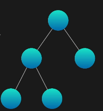


## 动态数组

动态数组：长度可以改变的数组(vector,list)

静态数组: 长度自申请之后不可改变


数组的基本操作

* push_back
* pop_back
* size
* index


用静态数组实现动态数组：

* 每次push都申请一次

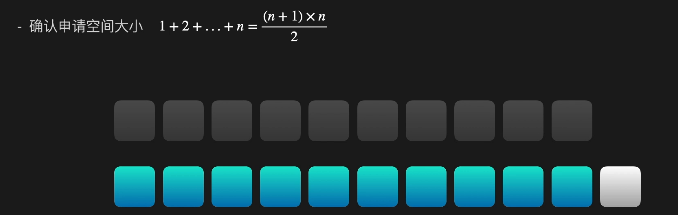

* 先申请一小段空间，每次用完了申请两倍的空间

假如我们最后的数组长度为n，那么我们的时间复杂度就是

n 的从旧空间转移到新空间 + O(1)的插入 + n/2 + O(1) + ...

<= 2n + O(1)

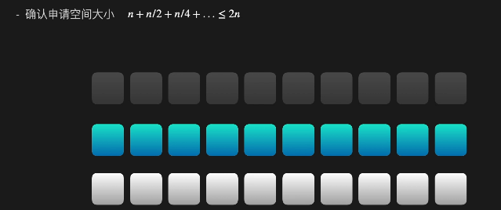


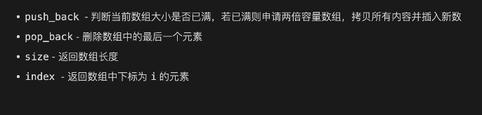

```c++
//实现动态数组
class LCArray {
    int* Array;
    int ArrayCapacity;
    int ArraySize;

    void Reallocate(){
        ArrayCapacity *= 2;
        
        int* NewArray = new int[ArrayCapacity];
        
        for(size_t i = 0; i < ArraySize; i++){
            NewArray[i] = Array[i];
        }

        delete [] Array;
        Array = NewArray;

        return;
    }
public:
    LCArray() :ArrayCapacity(10), ArraySize(0){
        Array = new int [ArrayCapacity];
    }
    ~LCArray(){
        delete [] Array;
    }
    void push_back(int n) {
        if(ArraySize == ArrayCapacity){
            Reallocate();
        }

        Array[ArraySize++] = n;
        return;

    }
    
    void pop_back() {
        ArraySize--;
        return;
    }
    
    int size() {
        return ArraySize;
    }
    
    int index(int idx) {
        try{
            return Array[idx];
        }
        catch(...){
            std::out_of_range("Out of range");
        }
        return -1;
    }
};

/**
 * Your LCArray object will be instantiated and called as such:
 * LCArray* obj = new LCArray();
 * obj->push_back(n);
 * obj->pop_back();
 * int param_3 = obj->size();
 * int param_4 = obj->index(idx);
 */
```


## 用队列实现栈

假如我们认为队列queue不能访问队末(实际上STL能访问的)，那么使用队列来实现栈就需要两个queue，每次top都需要将这个队列内的元素转移到只剩一个。pop同理

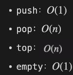

事实上，像衔尾蛇一样的操作，使用一个queue即可完成这个操作。

再一次的事实上，back是可以用的。

```c++
//用队列实现栈
class MyStack {
    std::queue<int> queue1;

    int find(){
        int size = queue1.size() - 1;
        int temp;
        while(size--){
            temp = queue1.front();
            queue1.pop();
            queue1.push(temp);
        }
        temp = queue1.front();
        return temp;
    }
public:
    MyStack() {

    }
    
    void push(int x) {
        queue1.push(x);
    }
    
    int pop() {
        int temp = find();
        queue1.pop(); 
        return temp;
    }
    
    int top() {
        int temp = find();;
        queue1.pop();
        queue1.push(temp);
        return temp;
    }
    
    bool empty() {
        return queue1.empty();
    }
};

/**
 * Your MyStack object will be instantiated and called as such:
 * MyStack* obj = new MyStack();
 * obj->push(x);
 * int param_2 = obj->pop();
 * int param_3 = obj->top();
 * bool param_4 = obj->empty();
 */
```

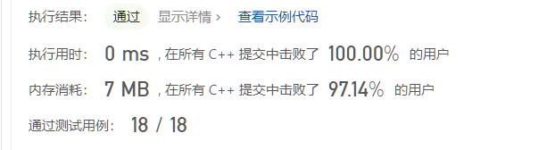


## 循环队列

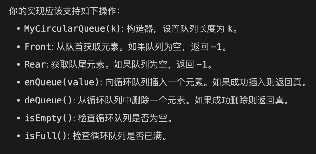

可以发现，循环队列有如下几个特性：

* 不用支持随即查找-意味着我们可以使用链表
* 大小固定-意味着我们可以使用双指针（头尾指针）来模拟出队和入队

额外的，如果扩容则仿照动态数组，上面方法的操作复杂度都为O(1)

下面是一个使用数组实现的案例

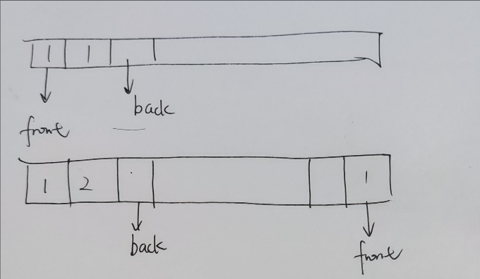

```c++
//设计循环队列
class MyCircularQueue {
    std::unique_ptr<int[]> CircularQueue;
    int front;
    int back;
    int size;
    int current_size;
public:
    MyCircularQueue(int k) {
        CircularQueue.reset(new int[k]);//自动构造
        front = 0;
        back = 0;
        size = k;
        current_size = 0;
    }
    
    bool enQueue(int value) {
        current_size++;
        if(current_size > size){
            //注意插入错误代表插入失败，不代表queue废了，因此需要重置current_size状态
            current_size--;
            return false;
        }

        CircularQueue[back] = value;
        back = (back+1) % size;
        return true;
        
    }
    
    bool deQueue() {
        if(current_size == 0){
            return false;
        }
        front = (front + 1) % size;
        current_size--;
        return true;
    }
    
    int Front() {
        if(!current_size) return -1;
        return CircularQueue[front];
    }
    
    int Rear() {
        if(!current_size) return -1;
		//易错，注意back的范围
        return CircularQueue[(back+size-1)%size];
    }
    
    bool isEmpty() {
        return current_size == 0;
    }
    
    bool isFull() {
        return current_size == size;
    }
};

/**
 * Your MyCircularQueue object will be instantiated and called as such:
 * MyCircularQueue* obj = new MyCircularQueue(k);
 * bool param_1 = obj->enQueue(value);
 * bool param_2 = obj->deQueue();
 * int param_3 = obj->Front();
 * int param_4 = obj->Rear();
 * bool param_5 = obj->isEmpty();
 * bool param_6 = obj->isFull();
 */
```


## 哈希表

使用哈希表解决两数之和

```c++
//两数之和
class Solution {
public:
    vector<int> twoSum(vector<int>& nums, int target) {
        std::unordered_map<int,int> u;
        for(int i = 0; i < nums.size();i++){
            int pair = target - nums[i];
            if(u.find(pair) != u.end()){
                return {u[pair], i};
            }

            u[nums[i]] = i;
        }
        return {};
    }
};
```


这一节主要是熟悉hash_map的用法

C++ 11标准中加入了unordered系列的容器。unordered_map记录元素的hash值，根据hash值判断元素是否相同。map相当于java中的TreeMap，unordered_map相当于HashMap。无论从查找、插入上来说，unordered_map的效率都优于hash_map，更优于map；而空间复杂度方面，hash_map最低，unordered_map次之，map最大。


使用哈希表解决数组中每个数第一次出现的位置

```c++
//求数组中每个数第一次出现的位置
class Solution {
public:
    vector<int> find_left_repeat_num(vector<int>& nums) {
        std::unordered_map<int, int> u;
        std::vector<int> result;
        for(int i = 0; i < nums.size();i++){
            if(u.find(nums[i]) == u.end()){
                u.insert(std::make_pair(nums[i],i));
                result.push_back(-1);
            }else{
                result.push_back(u[nums[i]]);
            }
        }
        return result;
    }
};
```


**unordered_map与map的对比：**

　　存储时是根据key的hash值判断元素是否相同，即unordered_map内部元素是无序的，而map中的元素是按照二叉搜索树存储（用红黑树实现），进行中序遍历会得到有序遍历。所以使用时map的key需要定义operator<。而unordered_map需要定义hash_value函数并且重载operator==。但是很多系统内置的数据类型都自带这些。

　　总结：结构体用map重载<运算符，结构体用unordered_map重载==运算符。


`unordered_map` 是 C++ 标准库中的一个非常有用的容器，基于哈希表实现，提供了快速的元素查找、插入和删除操作。下面是 `unordered_map` 的一些常用用法和特点：

### 基本用法

1. **声明和初始化**:

   ```c++
   std::unordered_map<KeyType, ValueType> map;
   ```

   其中 `KeyType` 是键的类型，`ValueType` 是值的类型。

2. **插入元素**:

   - ==使用 `insert`方法:==

     ```c++
     map.insert(std::make_pair(key, value));
     ```

   - 使用下标操作符:

     ```c++
     map[key] = value;
     ```

3. **访问元素**:

   - 使用下标操作符:

     ```c++
     ValueType value = map[key];
     ```

   - 使用 `at`方法（如果键不存在，会抛出 `std::out_of_range` 异常）:

     ```c++
     ValueType value = map.at(key);
     ```

4. **检查元素存在**:

   - 使用 `find` 方法:

     ```c++
     if (map.find(key) != map.end()) {
         // 键存在
     }
     ```

5. **删除元素**:

   - 使用 `erase` 方法:

     ```c++
     map.erase(key);
     ```

6. **遍历 `unordered_map`**:

   - 使用范围 for 循环:

     ```c++
     for (const auto& pair : map) {
         // pair.first 是键，pair.second 是值
     }
     ```

7. **获取元素数量**:

   - 使用 `size` 方法:

     ```c++
     size_t numElements = map.size();
     ```

### 高级用法

1. **自定义哈希函数和相等函数**: 如果 `KeyType` 不是基本类型，可以提供自定义的哈希函数和相等判定函数。
2. **负载因子和重哈希**:
   - `load_factor` 方法返回当前负载因子（元素个数 / 桶数）。
   - `rehash` 方法用于重新哈希，改变桶的数量。
3. **预留空间**: 使用 `reserve` 方法预留空间可以提高插入操作的效率。

### 注意事项

- `unordered_map` 的元素不是有序的。
- 键必须是可哈希的，对于自定义类型，可能需要提供哈希函数。
- 插入、删除和访问操作

的时间复杂度通常是 O(1)，但在最坏的情况下可能退化为 O(n)。

- 对于自定义类型作为键，除了提供哈希函数，还可能需要提供等于（equality）函数。

### 实用技巧

- **使用自定义类型作为键**: 如果你的键是自定义类型，你需要提供一个哈希函数和一个相等判断函数。例如，如果你有一个自定义结构体 `MyStruct` 作为键，你需要这样做：

  ```c++
  struct MyStruct {
      int a;
      double b;
      // 其他成员...
  };
  
  struct MyStructHash {
      size_t operator()(const MyStruct& s) const {
          // 提供合适的哈希计算
      }
  };
  
  struct MyStructEqual {
      bool operator()(const MyStruct& lhs, const MyStruct& rhs) const {
          // 提供合适的相等判断
      }
  };
  
  std::unordered_map<MyStruct, ValueType, MyStructHash, MyStructEqual> myMap;
  ```

- **避免不必要的重哈希**: 预先知道元素的数量时，使用 `reserve` 方法来避免在插入时发生不必要的重哈希。

- **用作计数器**: `unordered_map` 可以很方便地用作计数器。例如，统计数组中每个元素出现的次数：

  ```c++
  std::unordered_map<int, int> counter;
  for (int num : nums) {
      counter[num]++;
  }
  ```

`unordered_map` 是一个非常强大且灵活的数据结构，适用于需要快速查找、插入和删除操作的场景。正确使用它可以显著提高代码的性能和效率。


