# 必修题

## 15. 三数之和（第一次做有点难度）

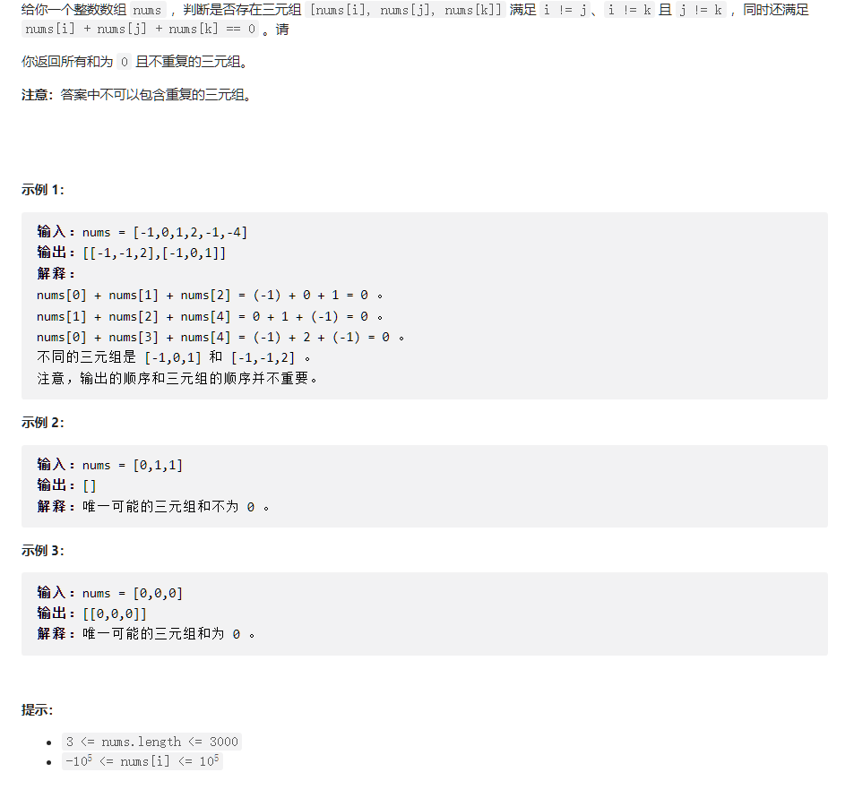

方法就是先==排序==，然后一层循环套双指针搜索

```c++
class Solution {
public:
    // 考虑到a+b+c，a和b确定了那么c就是唯一的
    // 因此，按我们的方法，以a为开头的所有情况都在循环内找到了，因此a在循环中不能相同
    // 同理，b也不能相同
    // 同理，c也不能相同

    void double_pointer(int i, vector<int>& nums, vector<vector<int>>& result){
        //这个函数的作用是在给定i的情况下，双指针搜索空间
        //对于每个固定的nums[i], j和end就是双指针搜索
        int end = nums.size() - 1;
        for(int j = i+1; j < nums.size();j++){
                // i+1是因为，如果存在,我们一定能够搜索出带nums[i]的序列，找不到nums[i]就直接被丢弃了
                
                if(j > i+1 && nums[j] == nums[j-1]) continue;

                while(nums[j] + nums[end] + nums[i] >= 0 && end > j){
                    
                    if(nums[j] + nums[end]+nums[i] == 0){
                        
                        //result.emplace_back{nums[j],nums[end],nums[i]};
                        result.push_back(std::vector<int> {nums[i], nums[j], nums[end]});
                        
                        //删掉所有的相同end
                        while(nums[end] == nums[end-1] && end > j){
                            end--;
                        }
                    }
                    end--;
                
                }

            }
            return;
    }
    vector<vector<int>> threeSum(vector<int>& nums) {
        vector<vector<int>> result;
        std::sort(nums.begin(), nums.end());

        for(int i = 0; i < nums.size();i++){
            if(i > 0 && nums[i] == nums[i-1]) continue;
            double_pointer(i, nums, result);
            
        }
        /*
        result.erase(
            std::remove_if(result.begin(),result.end(),[](const std::vector<int>& v){return v.empty();}),
            result.end());
*/
        
        return result;
    }
};
```


## 26. 删除有序数组中的重复象

具TM简单，数组复用，整一个指针标识哪些没用了就好了。

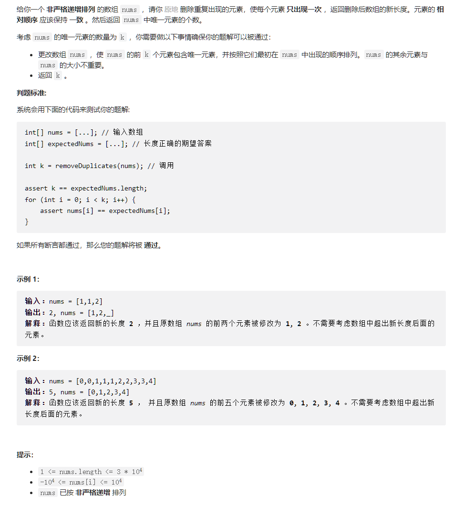

```c++
class Solution {
public:
    int removeDuplicates(vector<int>& nums) {
        //有效数组长度
        int end = 1;
        for(int i = 1 ; i < nums.size();i++){
            if(nums[i] == nums[i-1]){
                continue;
            }
            else{
                nums[end++] = nums[i];
            }
        }
        return end;
    }
};
```


## 48. 旋转图像（记住即可）

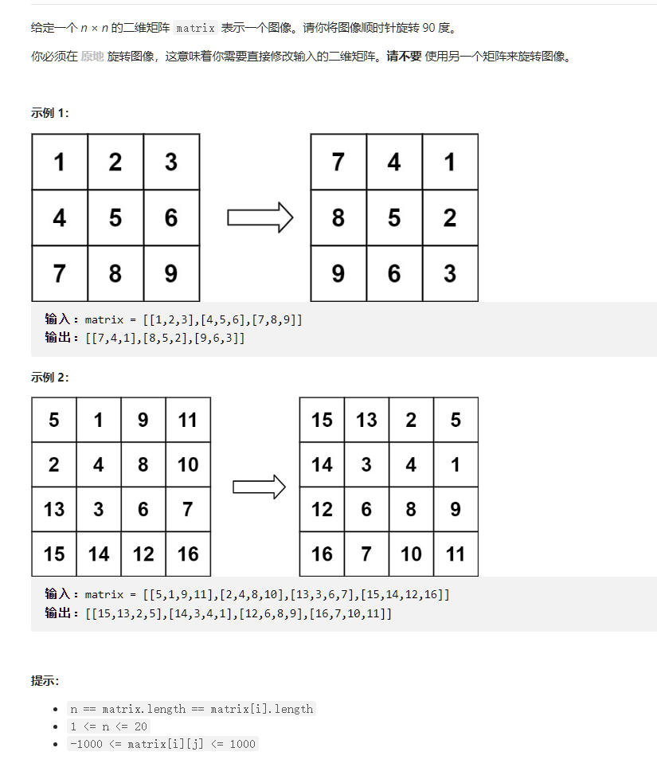

没什么好说的，在本来的矩阵中旋转图像顺时针90°，就是先转置后对每行翻转

注意转置的范围是`for(i=0;i < n;i++) for(j=0;j < i;j++)`

```c++
class Solution {
public:
    void rotate(vector<vector<int>>& matrix) {
        //转置
        for(int i = 0;i < matrix.size();i++){
            for(int j = 0;j < i;j++){
                std::swap(matrix[i][j], matrix[j][i]);
            }
        }

        //翻转每一行
        for(int i = 0; i < matrix.size();i++){
            std::reverse(matrix[i].begin(),matrix[i].end());
        }
    }
};
```


## 914. 卡牌分组（最大公约数怎么写）

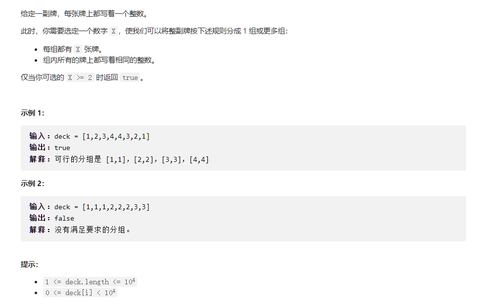

统计+寻找最大公约数

记住最大公约数的欧几里得解法即可

欧几里得算法基于一个事实：两个整数的最大公约数和它们的差的最大公约数相同。算法可以表述为以下步骤：

假设有两个正整数 `a` 和 `b`（其中 `a > b`），则 `a` 和 `b` 的最大公约数等于 `b` 和 `a % b`（`a` 除以 `b` 的余数）的最大公约数。算法重复这个过程，直到余数为 0。当余数为 0 时，最后的非零余数就是最大公约数。

#### 实现（递归版本）：

```c++
int gcd(int a, int b) {
    if (b == 0) return a;
    return gcd(b, a % b);
}
```

#### 实现（迭代版本）：

```c++
int gcd(int a, int b) {
    while (b != 0) {
        int temp = a % b;
        a = b;
        b = temp;
    }
    return a;
}
```

```c++
class Solution {
public:
    int gcd(int a, int b){
        if(b == 0)
            return a;
        return gcd(b,a%b);
    }
    bool hasGroupsSizeX(vector<int>& deck) {
        if(deck.size() < 2){
            return false;
        }
        
        // 获得计数
        std::unordered_map<int, int> u;
        int gcd_ = -1;
        for(int i = 0; i < deck.size();i++){
            if(u.find(deck[i]) == u.end()){
                u[deck[i]] = 1;
            }else{
                u[deck[i]] = u[deck[i]] + 1;
                
            }
        }
        
        //寻找最大公约数
        for(const auto &pair:u){
            if(gcd_ < 0){
                gcd_ = pair.second;
                continue;
            }
            int max_ = max(gcd_, pair.second);
            int min_ = min(gcd_, pair.second);

            gcd_ = gcd(max_, min_);
            if(gcd_ < 2){
                return false;
            }
        }
        return true;
    }
};
```


## 232. 用栈实现队列

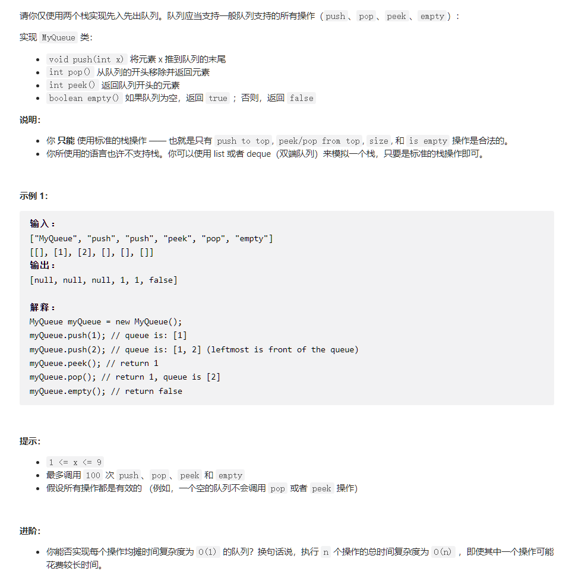

只能使用栈的pop,push,top,empty,

```c++
class MyQueue {
    std::stack<int> stk1;//for push
    std::stack<int> stk2;//for pop

    void reverse_and_swap(){
        int temp;
        if(stk1.empty()){
            while(!stk2.empty()){
                temp = stk2.top();
                stk2.pop();
                stk1.push(temp);
            }
        }else if(stk2.empty()){
            while(!stk1.empty()){
                temp = stk1.top();
                stk1.pop();
                stk2.push(temp);
            }
        }
    }
public:
    MyQueue() {

    }
    
    void push(int x) {
        if(!stk2.empty()){
            reverse_and_swap();
        }
        stk1.push(x);
    }
    
    int pop() {
        if(!stk1.empty()){
            reverse_and_swap();
        }
        int temp = stk2.top();
        stk2.pop();
        return temp;
    }
    
    int peek() {
        if(!stk1.empty()){
            reverse_and_swap();
        }
        return stk2.top();
        
    }
    
    bool empty() {
        return stk1.empty() && stk2.empty();
    }
};

/**
 * Your MyQueue object will be instantiated and called as such:
 * MyQueue* obj = new MyQueue();
 * obj->push(x);
 * int param_2 = obj->pop();
 * int param_3 = obj->peek();
 * bool param_4 = obj->empty();
 */
```


## 414. 第三大的数

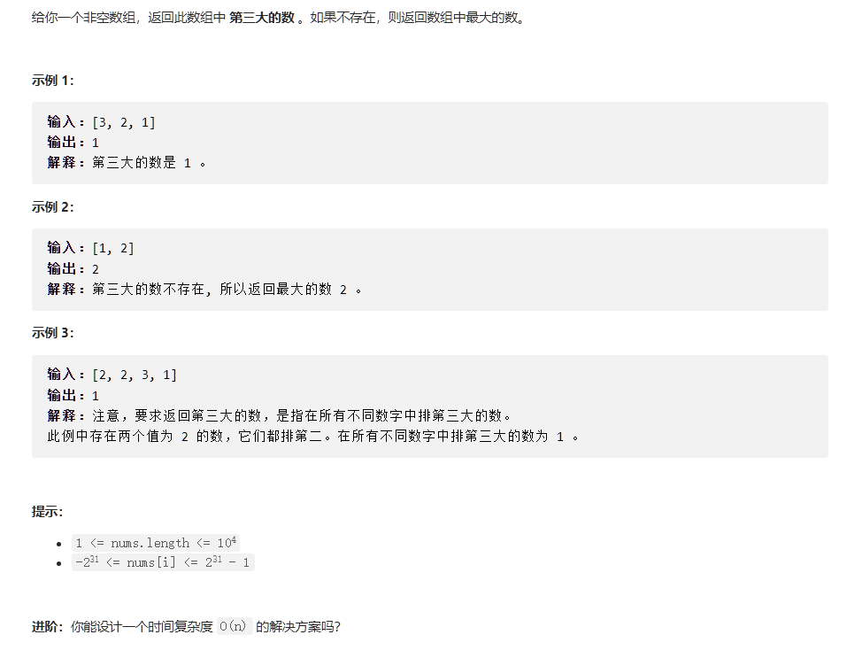

z最简单的解法：排序遍历

```c++
class Solution {
public:
    int thirdMax(vector<int>& nums) {
        std::sort(nums.begin(),nums.end(),[](int a, int b){
            return a > b;
        });

        int size = 2;
        for(int i = 1; i < nums.size();i++){
            if(nums[i] != nums[i-1])
            {
                size--;
            }
            if(!size){
                return nums[i];
            }
        }
        return nums[0];
    }
};
```

O(n)的简单解法1

遍历同时维护三个数

```c++
class Solution {
public:
    int thirdMax(vector<int> &nums) {
        long a = LONG_MIN, b = LONG_MIN, c = LONG_MIN;
        for (long num : nums) {
            if (num > a) {
                c = b;
                b = a;
                a = num;
            } else if (a > num && num > b) {
                c = b;
                b = num;
            } else if (b > num && num > c) {
                c = num;
            }
        }
        return c == LONG_MIN ? a : c;
    }
};

```


O(n)简单解法2

有序容器set

查找、插入和删除操作的时间复杂度为 O(log n)。

由于有序集合的大小至多为 3，插入和删除的时间复杂度可以视作是 O(1) 的，因此时间复杂度为 O(n)。

set自动去重排序

```c++
class Solution {
public:
    int thirdMax(vector<int>& nums) {
        std::set<int> result;
        for(const int& num:nums){
            result.insert(num);
            if(result.size() > 3){
                result.erase(result.begin());
            }
        }
        if(result.size() < 3){
            return *result.rbegin();//注意不能使用end，要使用reversebegin
        }
        return *result.begin();
    }
};
```


## 283. 移动零

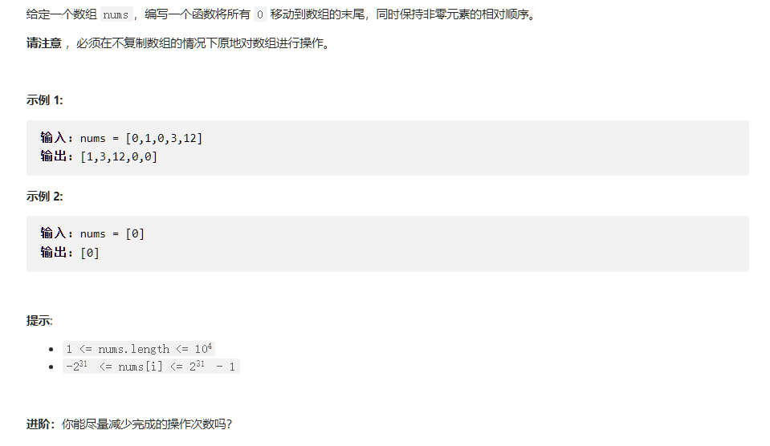

简单的双指针，用一个标记完成的序列的尾部（例如完成的序列是12300，那这个标记应该只想第四个位置)，然后用i遍历遇到非零就通过交换添加到这个尾部。

```c++
class Solution {
public:
    void moveZeroes(vector<int>& nums) {
        int end_of_ok_sequence = 0;
        for(int i = 0; i < nums.size();i++){
            if(nums[i] != 0 && end_of_ok_sequence < i){
                std::swap(nums[end_of_ok_sequence], nums[i]);
                end_of_ok_sequence++;
            }
            else if(nums[i]!= 0)
            {
                end_of_ok_sequence++;
            }
        }

    }
};
```


## 380. O(1) 时间插入、删除和获取随机元素

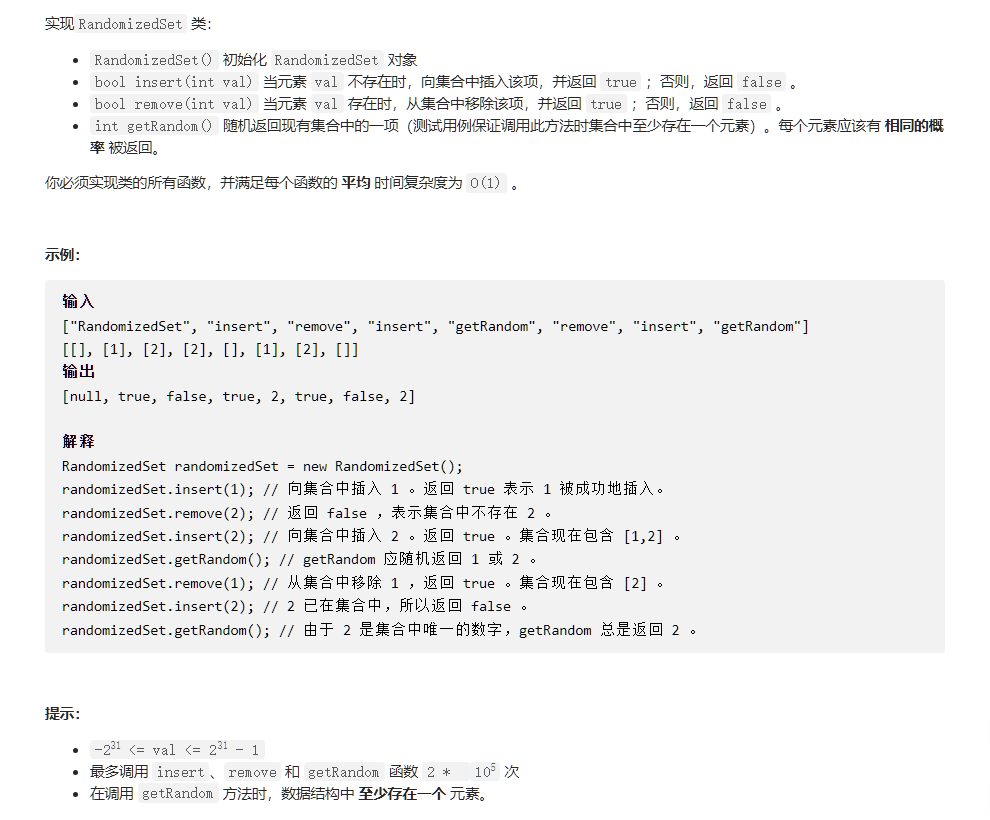

模拟题

主要就是考虑到hash表不能获取随机元素，数组不能O(1)插入和删除

因此结合这两个，hash表维护数组中元素位置即可

第一次做比较麻烦的是删除，其实就是将要删除的元素在数组中和数组末尾交换，更新hash表然后pop数组最后一个元素即可。

```c++
class RandomizedSet {
    std::vector<int> nums;
    std::unordered_map<int,int> u;
public:
    RandomizedSet() {
        srand(static_cast<unsigned>(time(0)));
    }
    
    bool insert(int val) {
        if(u.find(val) == u.end()){
            nums.push_back(val);
            u[val] = nums.size()-1;
            return true;
        }
        return false;
    }
    
    bool remove(int val) {
        if(u.find(val) == u.end()){
            return false;
        }
        u[nums[nums.size()-1]] = u[val];
        std::swap(nums[u[val]], nums[nums.size()-1]);
        

        nums.pop_back();
        u.erase(val);
        return true;
    }
    
    int getRandom() {
        unsigned pos = rand() % nums.size();

        return nums[pos];
    }
};

/**
 * Your RandomizedSet object will be instantiated and called as such:
 * RandomizedSet* obj = new RandomizedSet();
 * bool param_1 = obj->insert(val);
 * bool param_2 = obj->remove(val);
 * int param_3 = obj->getRandom();
 */
```


## 239. 滑动窗口最大值(HARD)-Priority_queue

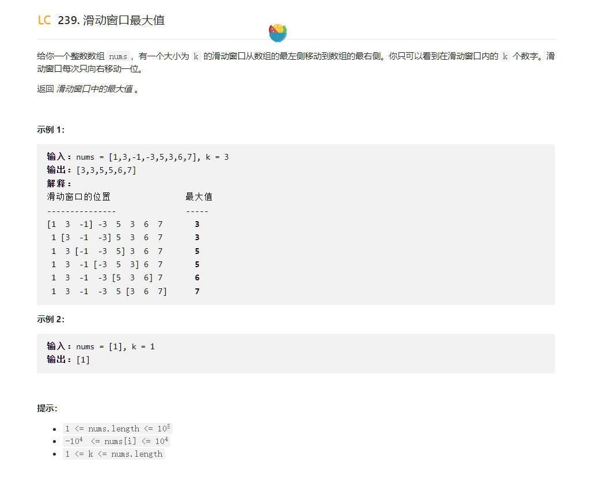

这题乍一看很简单，我首先使用如下代码

我判断初始k个的最大值，得到其坐标max_index，然后利用滑动窗口进来的新值来判断是否取代。

有一种可能是全取代不了，此时max_index坐标是小于当前坐标的（不在窗口内），因此我们要再搜索一次。这个方法的问题是，对于从大到小的特殊情况，运行时间爆了。这个方法就等同于对每个窗口搜索。

```c++
class Solution {
    int find_max_in_k(vector<int>& nums, int& k, int begin){
        int max_index = begin;
        for(int i = begin + 1; i < begin + k;i++){
            if(nums[i] > nums[max_index]){
                max_index = i;
            }
        }
        return max_index;
    }
public:
    vector<int> maxSlidingWindow(vector<int>& nums, int k) {
        int max_index = find_max_in_k(nums, k, 0);
        vector<int> result;
        result.push_back(nums[max_index]);
        for(int i = 1;i < nums.size() - k+1;i++){
            // 检查推入的元素是否能够充当最大值
            if(nums[i+k-1] >= nums[max_index]){
                max_index = i+k-1;
            }
            //这种情况发生在旧的max_index已经不在窗口内了
            if(max_index < i){
                max_index = find_max_in_k(nums,k,i);
            }

            result.push_back(nums[max_index]);
        }
        return result;
        
    }
};
```


这个时候就应该用priority_queue了，还是很简单，priority_queue本身会排序，我们只需要每次判断一下其top是不是超出范围即可。关于priority_queue的自定义排序用法自行查找

Priority_queue是使用大根堆（二叉树堆排序）实现的，因此其复杂度每次应该都是log级别的（毕竟和二分同源）。

* `push`:$O(log n)$
* `pop`:$O(log n)$

* `top`:$O(1)$
* `size`:$O(1)$

```c++
class Solution {
public:
    vector<int> maxSlidingWindow(vector<int>& nums, int k) {
        auto cmp = [](std::pair<int,int> a, std::pair<int,int> b){return a.second < b.second;};
        //std::priority_queue<DataType, container, compare_function_type> Name(compare_function);
        std::priority_queue<std::pair<int,int>, std::vector<std::pair<int,int>>, decltype(cmp)> pq(cmp);

        vector<int> result;
        for(int i = 0; i < nums.size();i++){
            pq.push(std::make_pair(i, nums[i]));
            if(pq.size() > k){
                while(pq.top().first < i - k + 1){
                    pq.pop();
                }
            }
            if(i >= k-1){
                result.push_back(pq.top().second);
            }

        }
        return result;
    }
};
```


## 1338. 数组大小减半

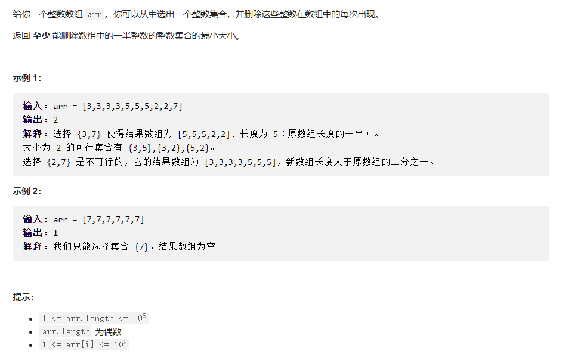

这个题本身很简单，但是你要考虑用什么数据结构来做

我一开始选择的map，但是==出了一个很大的错误==

在 `std::map` 中使用了一个自定义的比较器 `cmp`，这个比较器是基于 `pair` 的 `second` 值（频率）来排序的。但 `std::map` 本质上是一个基于键（`key`）排序的容器，而非基于值（`value`）排序。即使你提供了一个自定义比较器，它也只会影响键的排序，而不是值。

```c++
class Solution {
public:
    int minSetSize(vector<int>& arr) {
        auto cmp = [](std::pair<int, int> a, std::pair<int,int> b){return a.second > b.second;};
        std::map<int, int, decltype(cmp)> m(cmp);

        for(int i = 0; i < arr.size();i++){
            if(m.find(arr[i]) == m.end()){
                m.insert(std::make_pair(arr[i], 1));
            }
            else{
                m[arr[i]]++;
            }
        }
        int max_size = arr.size();
        int count = 0;
        for(auto &pair : m){
            if(max_size > arr.size()/2){
                max_size -= pair.second;
                count ++;
            }else{
                return count;
            }
        }
        return 0;
    }
};
```


因此，我们只能使用vector和hash map来实现了

```c++
class Solution {
public:
    int minSetSize(vector<int>& arr) {
        std::unordered_map<int, int> u;
        for(int i = 0; i < arr.size();i++){
            if(u.find(arr[i]) == u.end()){
                u.insert(std::make_pair(arr[i], 1));
            }else{
                u[arr[i]]++;
            }
        }
        
        std::vector<int> count_arr;
        for(auto& pair:u){
            count_arr.push_back(pair.second);
        }
        std::sort(count_arr.begin(),count_arr.end(), [](int a, int b){return a > b;});
        int max_size = arr.size();
        for(int i = 0; i < count_arr.size();i++){
            if(max_size > arr.size()/2){
                max_size -= count_arr[i];
            }else{
                return i;
            }
        }
        return 1;
    }
};
```


## 436.寻找右区间

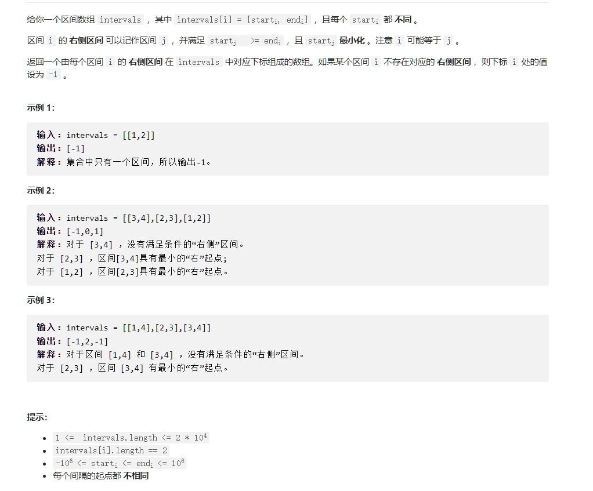

这是一个比较麻烦的问题

题目看懂就要一会儿，就是对每个区间找到离他最近的区间的下标输出


做法很简单，排序后，==我们对每个区间末端，寻找每个区间开端，第一个大于的开端的区间就是我们要的。==

具体做起来就需要很多空间了，并且我们需要记录末端本来的位置作为输出的排序，开端本来的位置作为输出的结果。

```c++
class Solution {
public:
    vector<int> findRightInterval(vector<vector<int>>& intervals) {
        std::vector<std::pair<int, int>> start_sort;
        std::vector<std::pair<int, int>> end_sort;

        for(int i = 0; i < intervals.size();i++){
            start_sort.emplace_back(std::make_pair(intervals[i].at(0),i));
            end_sort.emplace_back(std::make_pair(intervals[i].at(1),i));
        }

        std::sort(start_sort.begin(),start_sort.end(),
        [](std::pair<int,int> a, std::pair<int,int> b){
            return a.first < b.first;
        });

        std::sort(end_sort.begin(),end_sort.end(),
        [](std::pair<int,int> a, std::pair<int,int> b){
            return a.first < b.first;
        });
        
        std::vector<std::pair<int,int>> result;
        int index = 0;
        for(int i = 0; i < intervals.size();i++){
            //对每个end找到第一个大于它的start
            while(index < intervals.size() && start_sort[index].first < end_sort[i].first){
                index++;
            }
            //保存对应end_sort的位置所需要的start区间坐标(result,position)
            if(index >= intervals.size())
                result.emplace_back(std::make_pair(-1,end_sort[i].second));
            else{
                result.emplace_back(std::make_pair(start_sort[index].second,end_sort[i].second));
            }
        }

        std::sort(result.begin(),result.end(),
        [](std::pair<int,int> a, std::pair<int,int> b){
            return a.second < b.second;
        });
        vector<int> res;
        for(int i = 0; i < result.size();i++){
            res.push_back(result[i].first);
        }
        return res;
    }
};
```


# 选修题

## 206. 翻转链表

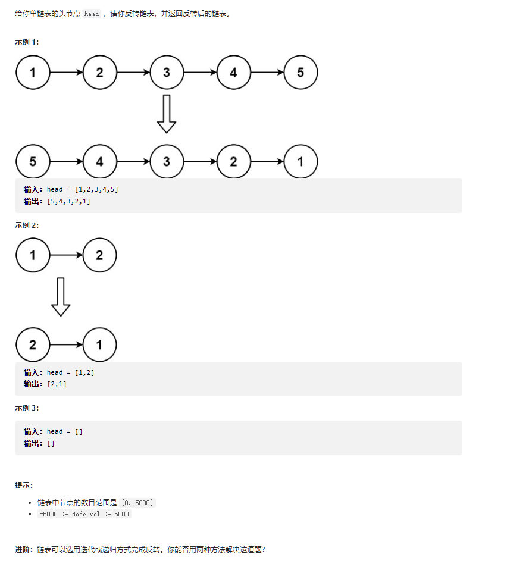

迭代实现，自己别脑子混了就行。

```c++
/**
 * Definition for singly-linked list.
 * struct ListNode {
 *     int val;
 *     ListNode *next;
 *     ListNode() : val(0), next(nullptr) {}
 *     ListNode(int x) : val(x), next(nullptr) {}
 *     ListNode(int x, ListNode *next) : val(x), next(next) {}
 * };
 */
class Solution {
    
public:
    ListNode* reverseList(ListNode* head) {
        //单节点实例,注意需要head判断在前，不然会出现对nullptr访问成员
        if( head == nullptr || head->next == nullptr){
            return head;
        }


        //首节点设置
        //设置上一个节点
        ListNode* LastNode = head;
        //设置下一个节点
        ListNode* NextNode = head->next;

        head->next = nullptr;

        head = NextNode;
        
        while(head->next != nullptr){
            NextNode = head->next;
            //翻转
            head->next = LastNode;

            LastNode = head;

            head = NextNode;
        }

        //尾节点设置
        head->next = LastNode;
        return head;
    }
};
```


## 25.K个一组翻转链表(HARD)

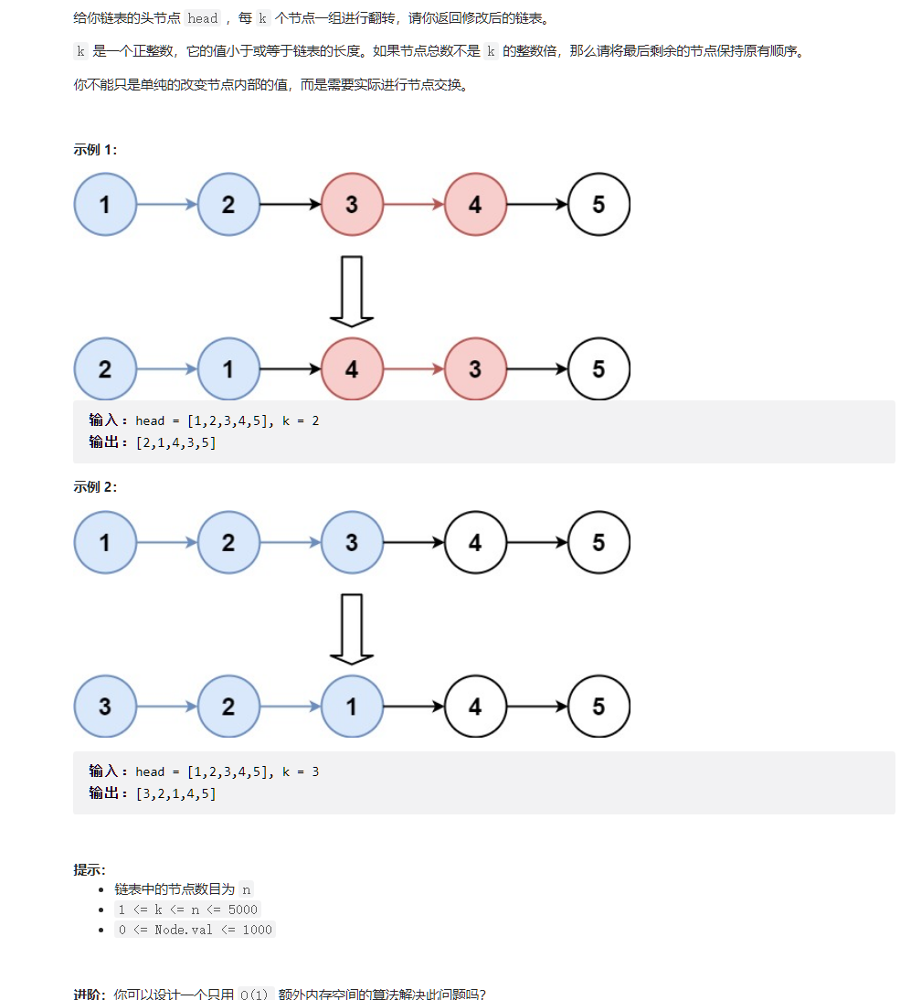

将问题细化成对k大小的block翻转即可，模拟Hard题

```c++
/**
 * Definition for singly-linked list.
 * struct ListNode {
 *     int val;
 *     ListNode *next;
 *     ListNode() : val(0), next(nullptr) {}
 *     ListNode(int x) : val(x), next(nullptr) {}
 *     ListNode(int x, ListNode *next) : val(x), next(next) {}
 * };
 */
class Solution {
    std::pair<ListNode*, ListNode*> reverse_block(ListNode* thisnode, ListNode* end){
        // 设定为这里的end节点也需要翻转

        //提前存档头节点
        ListNode* beginNode = thisnode;

        //获取上一个节点，下一个节点
        ListNode* lastnode = thisnode;
        ListNode* nextnode = thisnode->next;

        //thisnode不为end时
        while(thisnode != end){
            //到下一个节点
            thisnode = nextnode;
            nextnode = thisnode->next;

            //翻转
            thisnode->next = lastnode;

            //更新lastnode
            lastnode = thisnode;

        }
        //返回块的新开始与新结束
        return std::make_pair(end, beginNode);

    }
public:
    ListNode* reverseKGroup(ListNode* head, int k) {
        if(head == nullptr || head->next == nullptr){
            return head;
        }
        int count = 0;
        ListNode* Block_begin = nullptr;
        ListNode* Block_end = nullptr;
        ListNode* Unreversed_first_ndoe = nullptr;
        std::vector<std::pair<ListNode*, ListNode*>> vec;
        bool done = true;

        while(head->next != nullptr && done){
            if(count == 0){
                Block_begin = head;
                count ++;
            }else{
                head = head->next;
                count++;
            }
            if(count % k == 0){
                //块结尾为当前节点
                Block_end = head;
                
                //不完整尾部列表开头
                //如果Unreserved_first_node为null_ptr，那么正好给最后一个完整的block的next赋值
                Unreversed_first_ndoe = head->next;

                //更新head到下一个块的开始，注意检索这个head正好是链表最后一个节点的情况
                if(head->next != nullptr){
                    head = head->next;
                    //如果head->next是nullptr那么什么都不做就可以靠while终止
                }else{
                    done = false;
                }
                
                //翻转块
                vec.push_back(reverse_block(Block_begin, Block_end));
                //重置计数
                count = 0;
                
            }
            
        }
        //推入尾部链表，可能为dummy node
        vec.push_back(std::make_pair(Unreversed_first_ndoe, nullptr));
        //拼接
        for(int i = 0; i < vec.size()-1;i++){
            vec[i].second->next = vec[i+1].first;
        }

        return vec[0].first;
    }
};
```


## 54. 螺旋矩阵

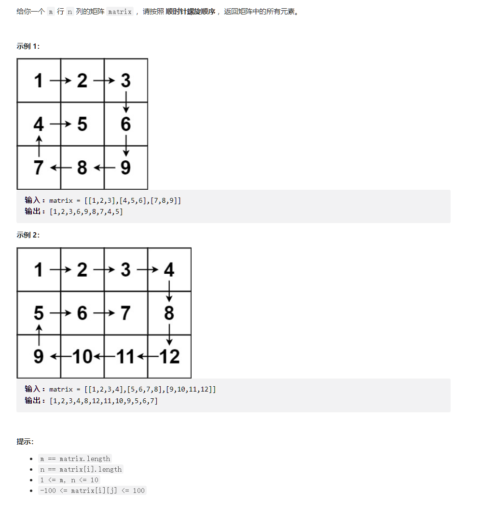

我认为这种题目，不应该去追求绝对的速度，应该保证逻辑的可维护性，因此我使用空间换来了这个可维护性。

我包装了每次的行为 dire

我记录了哪些路径没走过 flag

然后就是输出了。

这个方法很容易理解，很容易维护，并且也没有那么的耗费时间。

```c++
class Solution {
public:
    vector<int> spiralOrder(vector<vector<int>>& matrix) {
        std::vector<std::pair<int,int>> dire{{0,1},{1,0},{0,-1},{-1,0}};
        int pos = 0;
        std::vector<vector<int>> flag(matrix.size(), std::vector<int>(matrix[0].size(),0));

        vector<int> result;
        int begin_row= 0, begin_col = 0;
        result.push_back(matrix[begin_row][begin_col]);
        flag[begin_row][begin_col]++;
        for(int count = 1;count < matrix.size()*matrix[0].size();){
            int temprow = begin_row + dire[pos].first;
            int tempcol = begin_col + dire[pos].second;
            if(temprow < matrix.size() 
            && temprow > -1
            && tempcol < matrix[0].size()
            && tempcol > -1
            && !flag[temprow][tempcol]){
                begin_row = temprow;
                begin_col = tempcol;
                result.push_back(matrix[begin_row][begin_col]);
                flag[begin_row][begin_col]++;
                count++;
            }else{
                pos = (pos + 1) % 4;
            }
        }
        return result;

    }
};
```


## 20. 有效的括号（stack & unordered_map)

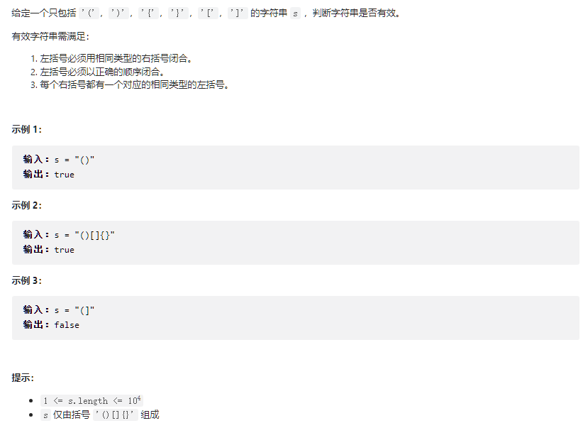

简单题，使用栈即可

```c++
class Solution {
public:
    bool isValid(string s) {

        //这里要注意""是char*，而''才是char
        std::unordered_map<char,char> u{std::make_pair('(',')'), std::make_pair('{','}'), std::make_pair('[',']')};
        /*
        std::unordered_map<char, char> u{
            {'(', ')'}, 
            {'{', '}'}, 
            {'[', ']'}
        };
        */

        std::stack<char> stk;
        for(auto& c:s){
            if(stk.empty()){
                //是右半
                if(u.find(c) == u.end()){
                    return false;
                }
                stk.push(c);
                continue;
            }
            //如果为右半
            if(u.find(c) == u.end()){
                /*
                //stk中存的也是右半，但是这是不可能发生的
                if(u.find(stk.top()) == u.end()){
                    return false;
                }
                */
                if(u[stk.top()] == c){
                    stk.pop();
                }else{
                    return false;
                }
            }
            //如果为左半
            else{
                stk.push(c);
            }

        }
        if(stk.empty())
            return true;
        else
            return false;

    }
};
```


## 456. 132模式(multi-set**)

这个题目比较难想。

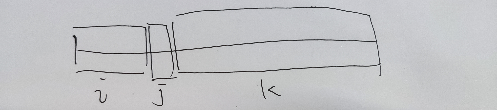

如图所示，我们可以枚举j

在`i`中维护最小的

在`k`中寻找小于`j`的，换句话说，==在`k`中寻找刚好大于`i`的==

这刚好是multi-set的作用，或者我们可以叫他允许重复元素的默认排序的set

1. **高效查找**：提供快速查找功能，查找特定元素的时间复杂度为 O(log n)。
2. **高效插入和删除**：插入和删除元素的时间复杂度通常也是 O(log n)。
3. `std::multiset` 中的元素在插入时会自动排序。默认情况下使用 `<` 运算符进行排序，但也可以自定义排序准则。
4. `insert`：插入一个或多个元素。
5. `erase`：删除一个或多个元素。
6. `find`：查找特定元素。
7. `count`：返回特定值的元素数量。
8. `lower_bound` 和 `upper_bound`：用于获取指定值的范围。
   * `lower_bound` 函数返回一个迭代器，该迭代器指向在有序容器中“不小于”（即大于或等于）给定值的第一个元素。
   * `upper_bound` 函数返回一个迭代器，该迭代器指向在有序容器中“大于”给定值的第一个元素。

假设你有一个排序的序列（或容器）并想找出某个特定值的范围，或者你想找到第一个大于或等于特定值的位置，这时 `lower_bound` 和 `upper_bound` 就非常有用。


```c++
class Solution {
public:
    bool find132pattern(vector<int>& nums) {
        std::multiset<int> ms;

        int i = 0;
        for(int j = 0; j < nums.size();j++){
            ms.insert(nums[j]);
        }

        for(int j = 1; j < nums.size();j++){
            // 我们需要保证i是左区间最小的
            if(nums[j] < nums[i]){
                ms.erase(ms.find(nums[i]));
                i = j;
                continue;
            }
            //我们需要在右区间找到一个刚好大于nums[i]的值，并期望它小于Nums[j]
            auto k = ms.upper_bound(nums[i]);
            // k 存在且其值小于nums[j]
            if(k != ms.end() && *k < nums[j] ){
                return true;
            }


            //我们需要保证multi-set只包含i,j,以及k>j这些下标
            ms.erase(ms.find(nums[j]));
        }
        return false;
    }
};
```

注意，此处27行必须使用iterator删除。

使用iterator删除，我们只会找到一个删除，这不会影响我们的算法

如果使用`ms.erase(nums[j])`，它会删除所有的和Nums[j]相同的key，这是我们所不希望的。


## 240. 搜索二维矩阵II（使用STL算法upperbound)

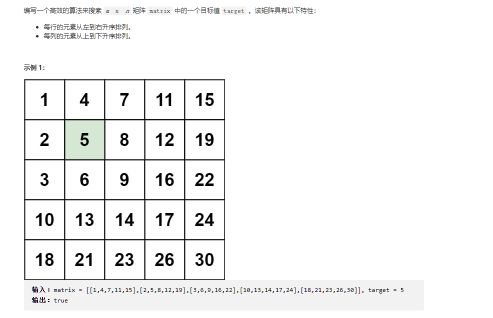

我的评价是别整什么Z字型

老老实实二分查找每一行就行了。

我额外做了一个边界确定，感觉有点画蛇添足

```c++
class Solution {
public:
    bool searchMatrix(vector<vector<int>>& matrix, int target) {
        int row_length = matrix[0].size()-1, col_length = matrix.size()-1;

        for(int i = 0; i < matrix.size();i++){
            if(matrix[i][0] >= target){
                col_length = i;
                break;
            }
        }
        for(int i = 0; i < matrix[0].size();i++){
            if(matrix[0][i] >= target){
                row_length = i;
                break;
            }
        }
    

        for(int i = 0; i < col_length+1;i++){
            auto end = matrix[i].begin() + row_length+1;
            auto it = std::lower_bound(matrix[i].begin(),end,target);
            if(it != end && *it == target){
                return true;
            }
        }
        return false;

    }
};
```

