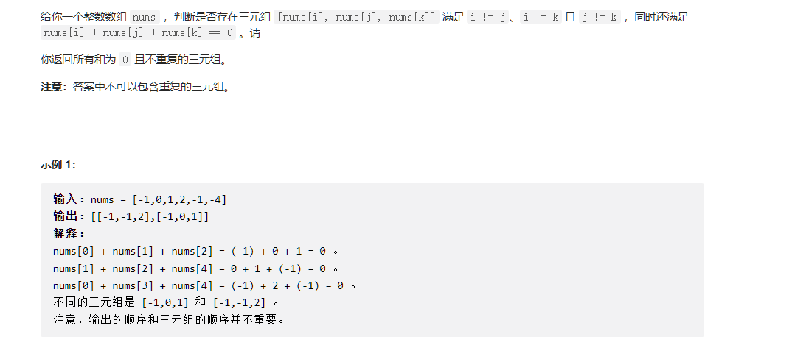
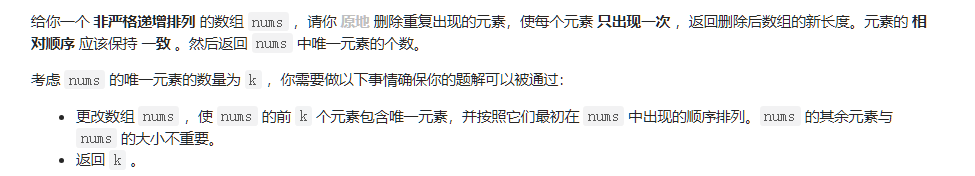

# 必修题

## 15. 三数之和（第一次做有点难度）



方法就是先==排序==，然后一层循环套双指针搜索

```c++
class Solution {
public:
    // 考虑到a+b+c，a和b确定了那么c就是唯一的
    // 因此，按我们的方法，以a为开头的所有情况都在循环内找到了，因此a在循环中不能相同
    // 同理，b也不能相同
    // 同理，c也不能相同

    void double_pointer(int i, vector<int>& nums, vector<vector<int>>& result){
        //这个函数的作用是在给定i的情况下，双指针搜索空间
        //对于每个固定的nums[i], j和end就是双指针搜索
        int end = nums.size() - 1;
        for(int j = i+1; j < nums.size();j++){
                // i+1是因为，如果存在,我们一定能够搜索出带nums[i]的序列，找不到nums[i]就直接被丢弃了
                
                if(j > i+1 && nums[j] == nums[j-1]) continue;

                while(nums[j] + nums[end] + nums[i] >= 0 && end > j){
                    
                    if(nums[j] + nums[end]+nums[i] == 0){
                        
                        //result.emplace_back{nums[j],nums[end],nums[i]};
                        result.push_back(std::vector<int> {nums[i], nums[j], nums[end]});
                        
                        //删掉所有的相同end
                        while(nums[end] == nums[end-1] && end > j){
                            end--;
                        }
                    }
                    end--;
                
                }

            }
            return;
    }
    vector<vector<int>> threeSum(vector<int>& nums) {
        vector<vector<int>> result;
        std::sort(nums.begin(), nums.end());

        for(int i = 0; i < nums.size();i++){
            if(i > 0 && nums[i] == nums[i-1]) continue;
            double_pointer(i, nums, result);
            
        }
        /*
        result.erase(
            std::remove_if(result.begin(),result.end(),[](const std::vector<int>& v){return v.empty();}),
            result.end());
*/
        
        return result;
    }
};
```


## 26. 删除有序数组中的重复象

具TM简单，数组复用，整一个指针标识哪些没用了就好了。



```c++
class Solution {
public:
    int removeDuplicates(vector<int>& nums) {
        //有效数组长度
        int end = 1;
        for(int i = 1 ; i < nums.size();i++){
            if(nums[i] == nums[i-1]){
                continue;
            }
            else{
                nums[end++] = nums[i];
            }
        }
        return end;
    }
};
```


## 48. 旋转图像（记住即可）

没什么好说的，在本来的矩阵中旋转图像顺时针90°，就是先转置后对每行翻转

注意转置的范围是`for(i=0;i < n;i++) for(j=0;j < i;j++)`

```c++
class Solution {
public:
    void rotate(vector<vector<int>>& matrix) {
        //转置
        for(int i = 0;i < matrix.size();i++){
            for(int j = 0;j < i;j++){
                std::swap(matrix[i][j], matrix[j][i]);
            }
        }

        //翻转每一行
        for(int i = 0; i < matrix.size();i++){
            std::reverse(matrix[i].begin(),matrix[i].end());
        }
    }
};
```


# 选修题

## 206. 翻转链表


迭代实现，自己别脑子混了就行。

```c++
/**
 * Definition for singly-linked list.
 * struct ListNode {
 *     int val;
 *     ListNode *next;
 *     ListNode() : val(0), next(nullptr) {}
 *     ListNode(int x) : val(x), next(nullptr) {}
 *     ListNode(int x, ListNode *next) : val(x), next(next) {}
 * };
 */
class Solution {
    
public:
    ListNode* reverseList(ListNode* head) {
        //单节点实例,注意需要head判断在前，不然会出现对nullptr访问成员
        if( head == nullptr || head->next == nullptr){
            return head;
        }


        //首节点设置
        //设置上一个节点
        ListNode* LastNode = head;
        //设置下一个节点
        ListNode* NextNode = head->next;

        head->next = nullptr;

        head = NextNode;
        
        while(head->next != nullptr){
            NextNode = head->next;
            //翻转
            head->next = LastNode;

            LastNode = head;

            head = NextNode;
        }

        //尾节点设置
        head->next = LastNode;
        return head;
    }
};
```


