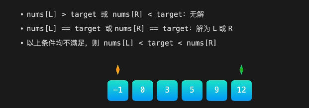
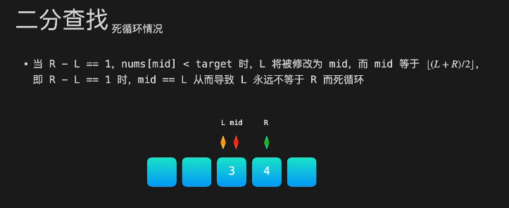
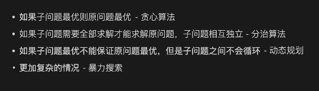
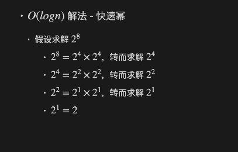
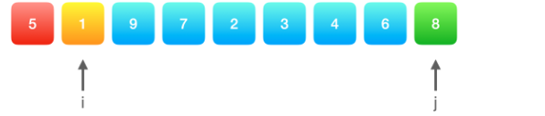
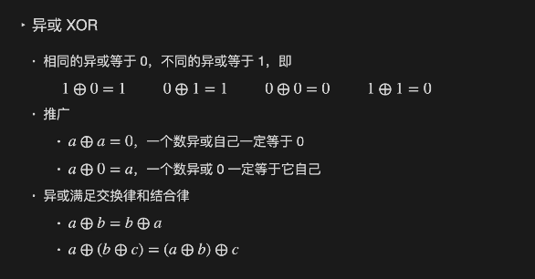
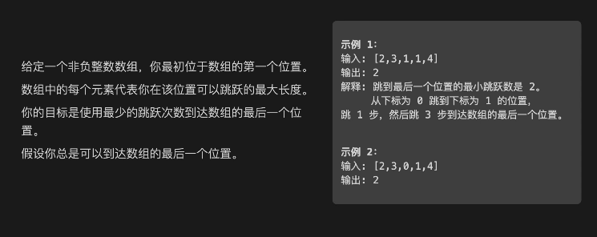
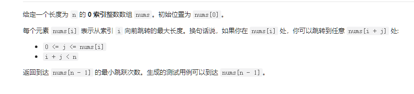
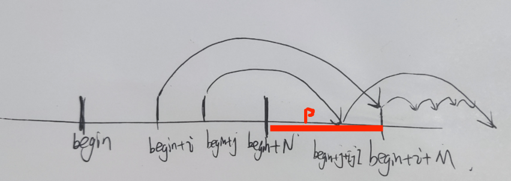

## 1. 二分查找

二分查找需要数组有序，然后双指针表示头尾，逐步收缩范围。





解决方案

* 重新设计收缩规则：`R->mid`,`L->mid + 1`
* 边界判断:`if(R-L==1)`对R，L，mid分别判断。


## 2. 贪心算法

局部最优一定保证全局最优，不能保证则需要转而使用动态规划或者搜索。


## 3.分治

复杂的原始问题可能可以拆分成若干个子问题，如果子问题之间互相独立（即一个子问题的计算结果不依赖于其他子问题）


分治思想适用的问题都能多线程。





## 快速幂

O(n)乘n次->O(logn) 分治乘



```c++
//这里需要my_pow_with_sign_check来处理n为负的情况
class Solution {
public:
    double my_pow_with_sign_check(double x, int n){
         if(n == 0){
           return 1;
       } 

       double y = my_pow_with_sign_check(x,n/2);
       
       return n%2 == 0 ? y*y : y*y*x;
    }
    double myPow(double x, int n) {
        double result = my_pow_with_sign_check(x,n);
        if(n < 0)
            return 1/result;
        return result;
    }
};
```


## 快排

快速排序的核心思想是，每次我们选择一个参照数，然后将数组中小于这个参照数的数放在其左边，大于参照数的数放在其右边。当然，这样放置以后参考数自身也在合适的位置了。


接着，定义两个指针i,j，将除了flag之外的所有数分块



Pivot函数

* i指针指向第一个比flag大的
* j指针指向第一个比flag小的
* 交换，以此类推，直到i，j碰面。
* 碰面之后，将i与5比较即可
  * 交换flag与最后一个小于flag的位置即可


```c++
class Solution {
    void quickSortRecursive(std::vector<int>& nums, int low, int high) {
        if (low < high) {
            int pivotIndex = partition(nums, low, high);
            quickSortRecursive(nums, low, pivotIndex - 1);  // Sort left part
            quickSortRecursive(nums, pivotIndex + 1, high); // Sort right part
        }
    }

    int partition(std::vector<int>& nums, int low, int high) {
        int pivot = nums[high]; // Choosing the last element as pivot
        int i = low; // Index of smaller element

        for (int j = low; j < high; j++) {
            if (nums[j] < pivot) {
                std::swap(nums[i], nums[j]);
                i++;
            }
        }
        std::swap(nums[i], nums[high]); // Swap pivot to the correct position
        return i; // Return pivot's final position
    }

public:
    vector<int> sortArray(vector<int>& nums) {
        quickSortRecursive(nums, 0, nums.size()-1);
        return nums;
    }
};
```


## 只出现一次的数字：异或消消乐



对于136.只出现一次的数字，如果想不利用额外的空间（也就是不使用hash map），那么这个解法就比较难想到。


这里限制了，出现两次，并且只要求这个元素本身而非下标，那异或这种==消消乐==就能用了。

全部异或起来，由于交换律，剩下的一定是单独的。


初始值可以设置为0，因为相同的等于0，不同的等于1，0就是初始值，不会影响结果。

```c++
class Solution {
public:
    int singleNumber(vector<int>& nums) {
        int ans=0;
        for(auto& v:nums)
            ans^=v;
        return ans;
    }
};
```


## 跳跃游戏




这里的贪心想法就在“可达区间”的概念



首先声明一点，就是这里是nums[i]从**索引i向前跳跃的最大长度，你可以不跳这么多**

解法上，贪心。

简单来说就是==每次在上次能跳到的范围（end）内选择一个能跳的最远的位置作为起跳点==

这一定是最优的，我们可以用反证证明

假如存在一个起跳点begin，其值为N，其是第k次跳跃

那么它的可达区间就是[begin+1,begin+N]，这段区间都是第k+1次跳跃可达

假如$begin+i,1\leq i \leq N$是跳的最远的，其值是M，那么第k+1次跳跃就可达begin+i+M

我们现在假设，$begin+j,1 \leq j \leq N$到达终点时使用的次数小于begin+i，我们来看是否有可能


首先我们知道，第k+1次跳跃$begin+i+M > begin + j + [j]$

这个已经注定了是不可能存在这个$j$了

我的图中表明了这一点，即使存在某一个位置$p\in(begin+N,begin+i+M]$之间，它有很大的值，作为j位置的跳点，那我明显直接选择这个点就行了啊。

因为我不需要跳满

==也就是说其他的解一定不比我好==

==当然，如果必须要跳满的话，只能用动态规划==



```c++
class Solution {
public:
    int jump(vector<int>& nums) {
        if(nums.size() == 1)
            return 0;
        int count = 0;
        int now = 0;
        for(;now < nums.size();){
            int end = now + nums[now];
            // 表明最后一跳所能到的范围包括了末尾
            if(end >= nums.size()-1){
                return ++count;
            }

            // 寻找这一跳能跳最远的地方
            int max = 0;
            int max_pos = 0;
            for(int i = now+1;i <= end;i++){
                if(nums[i] + i > max){
                    max = nums[i] + i;
                    max_pos = i;
                }
            }
            now = max_pos;
            count++;
        }
        return 0;
    }
};

```


## 下一个排列


```c++
class Solution {
public:
    void nextPermutation(vector<int>& nums) {
        // 简单理解下，如果我们要以字典序比较两个序列
        // 那么字典序越接近的两个序列，应该拥有尽可能多的同序子序列
        // 也就是说，在最佳的情况下，我们只需要交换序列末尾的两个数字即可
        // 但是，交换序列末尾的两个数字不一定会使得字典序变大
        // 更广泛的情况是，对于序列末尾的连续最大降序序列，我们无论怎么改都不会使得字典序变大
        // 因此，我们要找到第一个序列末尾非降序的数字

        // 接下来就是考虑将这个数字放到哪里
        // 这个数字的后面是一个降序序列，我们想要调换后离着当前序列字典序最近，也就是这两个调换数应该相距很近
        // 也就是序列末尾
        // 然后将剩余的降序序列升序即可
        // 需要考虑的特殊情况包括
        // 2. 3. 1. 这种其实就是begin > end(2 > 1)，如果交换那其实是变小，因此我们需要切换end（也就是往前推），寻找到第一个大于begin的倒序序列成员
        
        bool flag = false;
        int end = nums.size()-1;
        for(int i = nums.size()-2;i >= 0;i--){
            if(nums[i] < nums[i+1]){
                // 例如1,5,1，如果是nums[i] > nums[end]，那么两个相等的值就会互换
                while(nums[i] >= nums[end] && end-1 > i){
                    end--;
                }
                std::swap(nums[i],nums[end]);
                std::reverse(nums.begin()+i+1, nums.end());
                    
                
                flag = true;
                break;
            }
        }
        //全是倒序序列
        if(!flag){
            std::reverse(nums.begin(),nums.end());
        }

    }
};
```


## 环形列表


