# 必修


## 19. 删除链表的倒数第 N 个结点

使用定长queue记录即可

同理，双指针也可

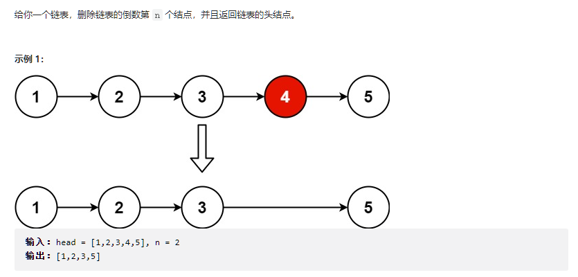

```c++
/**
 * Definition for singly-linked list.
 * struct ListNode {
 *     int val;
 *     ListNode *next;
 *     ListNode() : val(0), next(nullptr) {}
 *     ListNode(int x) : val(x), next(nullptr) {}
 *     ListNode(int x, ListNode *next) : val(x), next(next) {}
 * };
 */
class Solution {
public:
    ListNode* removeNthFromEnd(ListNode* head, int n) {
        if(head == nullptr || head->next == nullptr)
        {
            return nullptr;
        }
        int count_list = 0;
        std::queue<ListNode*> q;
        ListNode* t = head;
        while(t != nullptr){
            count_list++;
            q.push(t);
            t = t->next;
            if(q.size() > n+1){
                q.pop();
            }
        }
        //处理删除掉头节点的情况
        if(count_list == n){
            return head->next;
        }

        q.front()->next = q.front()->next->next;

        return head;
    }
};
```


## 160. 相交链表(看了一点提示)

需要注意两个list不相交的情况。

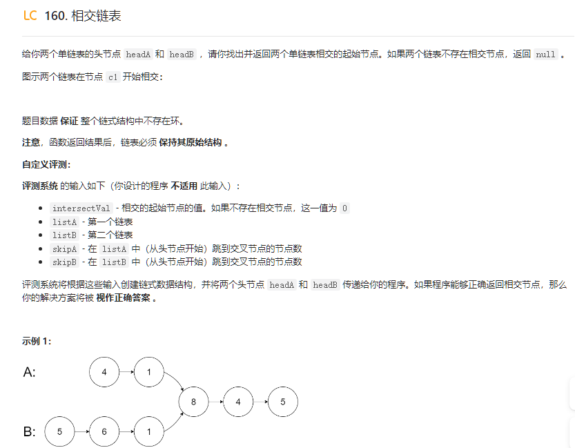

```c++
/**
 * Definition for singly-linked list.
 * struct ListNode {
 *     int val;
 *     ListNode *next;
 *     ListNode(int x) : val(x), next(NULL) {}
 * };
 */
class Solution {
public:
    ListNode *getIntersectionNode(ListNode *headA, ListNode *headB) {
        //我们假设listA长为A,listB长为B
        //如果其共长为D，那么listA分支长度为A-D，listB分支长度为B-D
        //因此，如果我们用两个指针，分别先遍历A后遍历B，先遍历B后遍历A，步长相同
        //那么，指针相交的地方一定在A+B-D的地方

        ListNode* a = headA,*b = headB;//用以标识两条list不相交的情况
        bool al = true,bl=true;
        while(a != b){
            if(a->next == nullptr && al){
                a = headB;
                al = false;
            }else{
                a = a->next;
            }
            if(b->next == nullptr && bl){
                b = headA;
                bl = false;
            }else{
                b = b->next;
            }

        }

        return a;
    }
};
```


## 215. 数组中的第K个最大元素

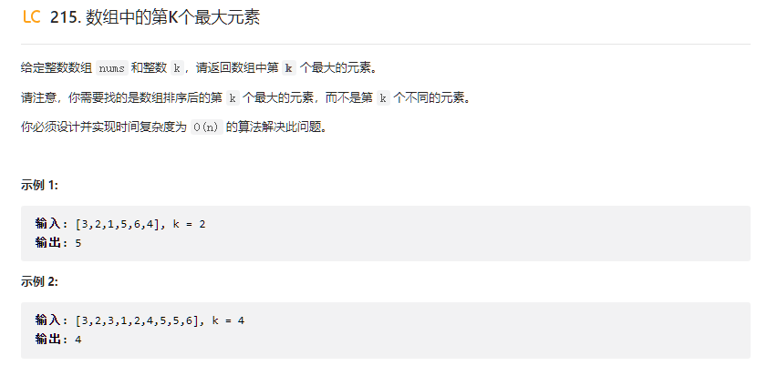

方法一：排序然后找到第k个即可，NlogN

方法二：堆排序/priority_queue，当然是使用floyd建堆维护而非那个NlogN的swim方法。

https://www.bilibili.com/video/BV1AF411G7cA/?spm_id_from=333.337.search-card.all.click&vd_source=61f56e9689aceb8e8b1f51e6e06bddd9


O(N)与O(NlogN)的建堆方法,优先队列pop，push的方法,堆排原理

Floyd 建堆算法是一种更高效的建堆方法，可以在 O(N) 时间内从无序数组创建一个堆。该方法的基本思想是从最后一个非叶子节点开始，逐个向前对每个节点执行下沉（`heapify`）操作，直到根节点。这种方法利用了堆中大部分元素都是叶子节点的事实，通过从后向前进行下沉操作，可以减少不必要的比较和交换操作。

- **下沉（`heapify`）**：对于每个选中的节点，如果它违反了堆的性质（即它小于（或大于）其子节点），则将它与其最大（或最小）的子节点交换，并继续下沉操作，直到恢复堆的性质或成为叶子节点。

STL解法

```c++
class Solution {
public:
    int findKthLargest(vector<int>& nums, int k) {
        std::priority_queue<int, std::vector<int>, std::greater<int>> pq;

        for(auto &num:nums){
            if(pq.size() < k){
                pq.push(num);
            }else{
                if(pq.top() < num){
                    pq.pop();
                    pq.push(num);
                }
            }
        }
        return pq.top();
    }
};
```

我自己写的小根堆

```c++
class Solution {
public:
    void down(vector<int>& heap, int i){
        //小根堆叶子节点大于父亲节点
        while(2*i+1<heap.size()){//如果存在左子节点
            int son = 2*i+1;
            if(2*i+2<heap.size() && heap[son] > heap[2*i+2]){//如果存在右子节点，记录较为小的点
                son = 2*i+2;
            }
            //如果父亲节点比子节点还大，那么与比较小的交换
            if(heap[i] > heap[son])
                std::swap(heap[i], heap[son]);

            //我们保证了子结构一定是符合堆序的，因此我们只需要关注这个新下来的点
            i = son;
        }
    }
    int findKthLargest(vector<int>& nums, int k) {
        //小根堆
        vector<int> heap;
        heap.reserve(k);
        for(int i = 0; i < k;i++){
            heap.push_back(nums[i]);
        }
        // floyd堆排
        for(int i = (k-2)/2;i >= 0;i--){
            down(heap,i);
        }
        //插入新值
        for(int i = k; i < nums.size();i++){
            if(heap[0] < nums[i]){//因为我们要最大的k个数，这里不能小于等于
                heap[0] = nums[i];
                down(heap,0);
            }
        }
        return heap[0];

    }
};
```


## 134. 加油站(贪心)

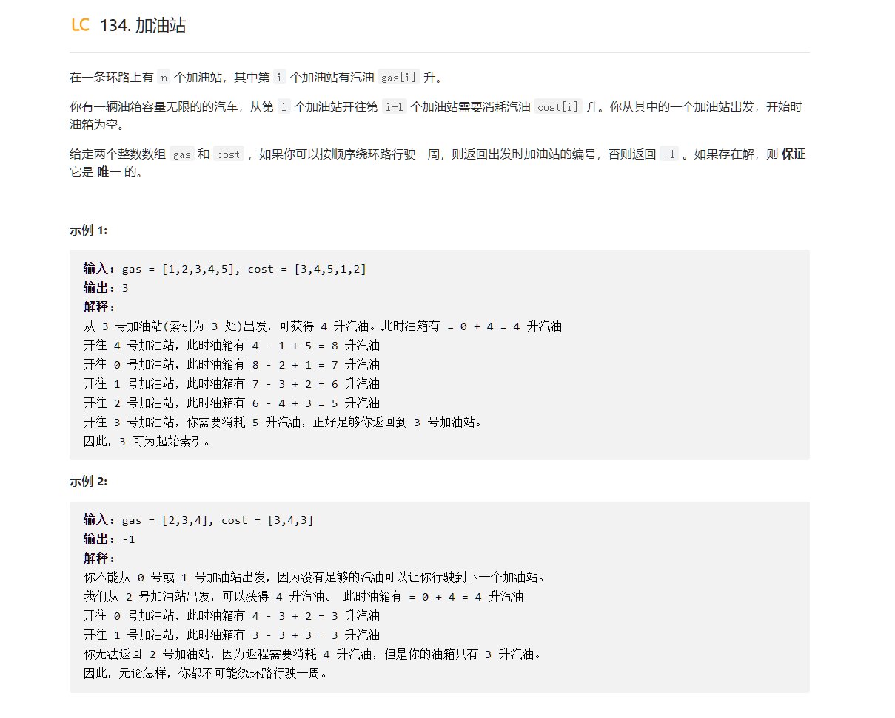

```c++
class Solution {
public:
    int canCompleteCircuit(vector<int>& gas, vector<int>& cost) {
        //这道题的关键在于，例如a b c d e五个加油站，从a出发最远到d，那么从b,c出发也只能最远到d
        // 因为a开到b剩余的油量总是大于等于0，这样都开不到e，从b,c出发少了这些油更不可能了
        // 因此，此题贪心，更新起始加油站为第一个到不了的加油站即可

        //遍历起点
        for(int i = 0; i <  gas.size();){
            int current_tank = 0;
            int current_pos = i;
            bool flag = false;
            while(current_tank>= 0){
                if(current_pos == i && flag){
                    return i;
                }
                flag = true;
                current_tank += gas[current_pos] - cost[current_pos];
                current_pos = (current_pos+1) % gas.size(); 
            }

            if(current_pos <= i){//此时不可能成功，因为<i的部分我们已经验证过不能到达了，=i的话代表最后一段到起点的油不够
                return -1;
            }else{
                i = current_pos;
            }
        }
        return -1;
    }
};
```


## 138. 复制带随即指针的链表

这道题就是什么意思，就是你必须另外处理random指向的新地址，会出现各种问题，例如这个地址对应的deepcopy还未建立，你就需要递归的建立一下，我觉得没必要这么麻烦，递归滚出c++。

为了防止太麻烦，我选择直接存一下新旧节点的对应map，而非像标准解答那样递归。

第一遍建立map，第二遍替换random指向即可。

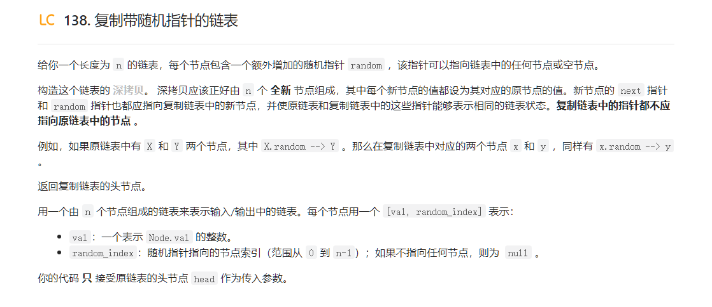


```c++
/*
// Definition for a Node.
class Node {
public:
    int val;
    Node* next;
    Node* random;
    
    Node(int _val) {
        val = _val;
        next = NULL;
        random = NULL;
    }
};
*/

class Solution {
public:
    Node* copyRandomList(Node* head) {
        if(head == nullptr){
            return head;
        }
        unordered_map<Node*, Node*> mapp;

        Node* result;
        result = new Node(head->val);

        Node* this_ptr = head;
        Node* copy_ptr = result;
        mapp.insert(std::make_pair(head, result));
        while(this_ptr->next != nullptr){
            //创建了一个节点
            Node* node = new Node(this_ptr->next->val);
            mapp.insert(std::make_pair(this_ptr->next, node));
            copy_ptr->next = node;
            copy_ptr->random = this_ptr->random;

            copy_ptr = copy_ptr->next;
            this_ptr = this_ptr->next;
        }

        //尾部处理,this_ptr指向最后一个节点，copy_ptr指向最后一个节点
        copy_ptr->next = nullptr;
        copy_ptr->random = this_ptr->random;

        //替换random
        copy_ptr = result;
        while(copy_ptr != nullptr){
            copy_ptr->random = mapp[copy_ptr->random];
            copy_ptr = copy_ptr->next;
        }
        
        return result;
    }
};
```


## 260. 只出现一次的数字III（技巧）


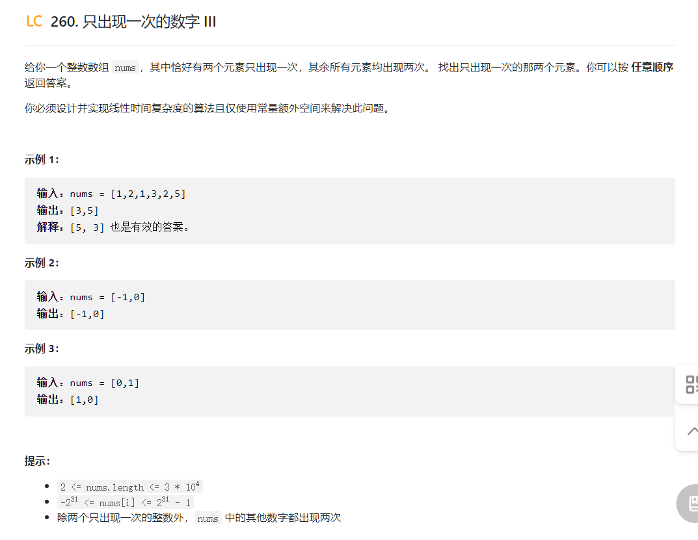

这种方法能够将两个只出现一次的数字分成两组的原理基于异或运算的性质。当我们对数组中所有元素进行异或运算时，最终的结果是那两个只出现一次的数字的异或结果，记作`xorResult`。-因为这两个数字是不同的，所以`xorResult`不可能为0，==这意味着至少有一个位上，这两个数字是不同的（一个是0，另一个是1）。==

通过找到`xorResult`中任意一个为1的位，==我们实际上找到了一个可以区分这两个唯一数字的标准。==假设在`xorResult`中，第k位是1，这意味着在这两个只出现一次的数字中，一个在第k位上是1，另一个在第k位上是0。


对于大多数整数`x`，`-x`能够正常产生一个补码形式的负数。然而，对于最小的负整数（在32位整数中是`-2,147,483,648`，二进制表示为`1000 0000 0000 0000 0000 0000 0000 0000`），取负操作会导致一个问题。理论上，这个数的负值应该是`2,147,483,648`，但这个值在32位有符号整数中无法表示，因为有符号整数的最大值是`2,147,483,647`。这导致取负操作的结果仍然是`-2,147,483,648`，不会改变其值，但这个操作本身并不会导致越界。实际上，越界风险不是由这个操作引起的。

`-2147483648`（`int`类型在32位系统上的最小值）进行取负操作时遇到的一个特定问题。根据错误信息："negation of -2147483648 cannot be represented in type 'int'; cast to an unsigned type to negate this value to itself"，这意味着在尝试将`-2147483648`取负时发生了未定义行为（Undefined Behavior，简称UB），因为结果超出了`int`类型可表示的范围。

在C++中，`int`类型通常是有符号的，并且在32位系统上范围是从`-2,147,483,648`到`2,147,483,647`。当你尝试对`-2,147,483,648`取负时，理论上的结果是`2,147,483,648`，但这超出了`int`类型的最大正值，因此这个操作导致了未定义行为。


这段代码中的特殊处理`int the_different_flag = (xorsum == INT_MIN ? xorsum : xorsum & (-xorsum));`是为了解决当`xorsum`等于`INT_MIN`（即`-2,147,483,648`，或者在二进制中为`1000 0000 0000 0000 0000 0000 0000 0000`）时由于取负操作导致的未定义行为问题。在这种情况下，直接对`INT_MIN`取负是未定义的，因为其结果不在`int`类型的范围内。

==**当`xorsum`等于`INT_MIN`时**，表示`xorsum`的二进制表示中只有最高位是1。此时，直接使用`xorsum`作为`the_different_flag`，即使用最高位来区分两个数。这同样满足算法的需要，因为这意味着其中一个数在最高位为1，另一个为0，可以据此将数组分为两组。==

```c++
class Solution {
public:
    vector<int> singleNumber(vector<int>& nums) {
        int xorsum = 0;
        for(auto &num:nums){
            xorsum^= num;
        }

        int the_different_flag = (xorsum == INT_MIN ? xorsum : xorsum & (-xorsum));
        int type1 = 0, type0 = 0;
        for(auto &num:nums){
            if(num & the_different_flag)//此位为1
            {
                type1^= num;
            }else{
                type0 ^= num;
            }
        }

        return {type1, type0};
    }
};
```


## 268.丢失的数字

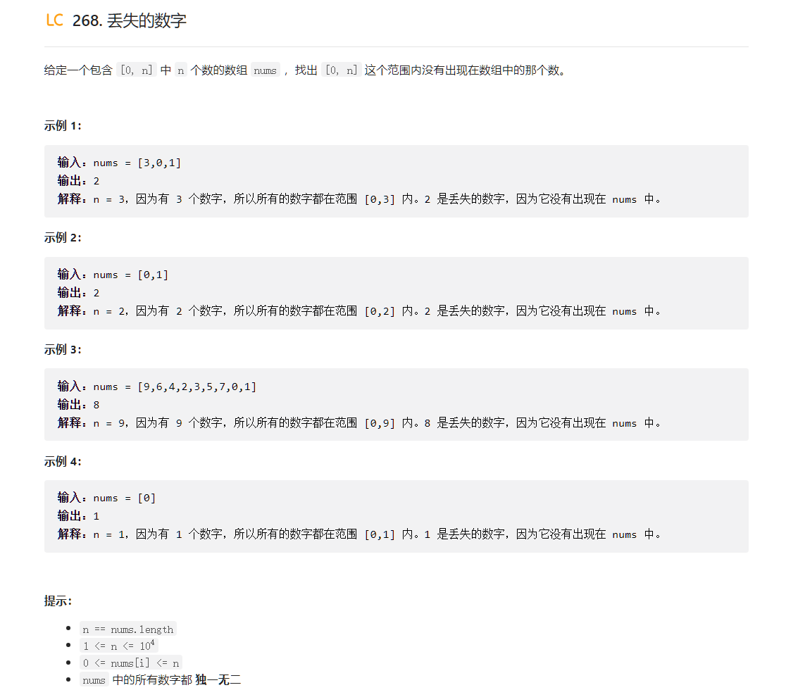

虽然我没做出来，但是这确实是个简单题


两种做法，一种就是使用0-n与这个数组的异或和再异或一遍，少了的是奇数，异或之后就剩这个。


第二种就是放空大脑，高斯公式减去数组和即可。

```c++
class Solution {
public:
    int missingNumber(vector<int>& nums) {
        return (1+nums.size())*nums.size()/2 - std::accumulate(nums.begin(),nums.end(),0);
    }
};
```


## 315. 计算右侧小于当前元素的个数(困难)


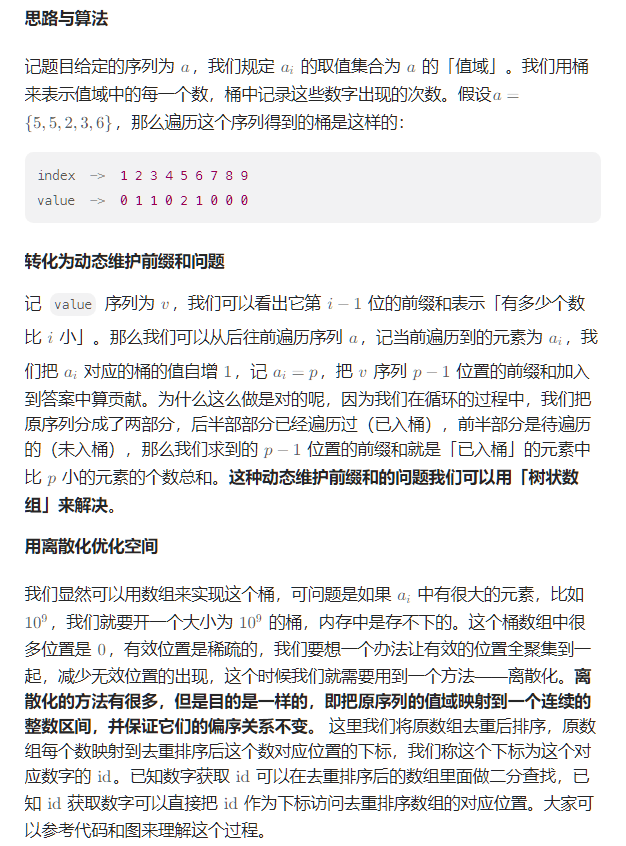

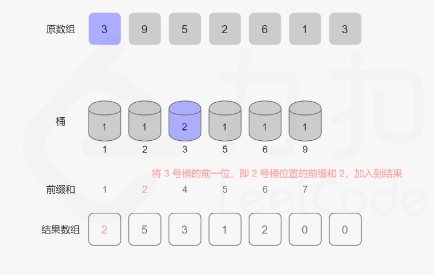


我首先尝试用传统的vector来实现，但是在presum环节实在太耗费时间了，被卡了一个超时

```c++
class Solution {
    
public:
    vector<int> countSmaller(vector<int>& nums) {
        std::unordered_map<int, int> um;//存在的值与buck位置的映射
        // 创建离散桶映射
        vector<int> copy_nums(nums);
        std::sort(copy_nums.begin(),copy_nums.end());
        int pos = 0;
        um.insert(std::make_pair(copy_nums[0], pos++));
        for(int i = 1; i < copy_nums.size();i++){
            if(copy_nums[i] == copy_nums[i-1])
                continue;
            um.insert(std::make_pair(copy_nums[i], pos++));
        }

        // 维护一个桶与其前缀和
        //std::vector<int> bucket(pos,0);
        std::vector<int> presum(pos,0);
        std::vector<int> result(nums.size(),0);

        for(int i = nums.size()-1;i >= 0;i--){
            int pos = um[nums[i]];
            //bucket[um[nums[i]]]++;
            
            result[i] = presum[pos];
            std::for_each(presum.begin()+pos+1, presum.end(),[](int &x){
                x+= 1;
            });  
        }
        return result;

            
        

    }
};
```


所以我们使用BIT二进制索引树来高效的操作这个前缀和数组

二进制索引树（Binary Indexed Tree，BIT），也被称为 Fenwick 树，是一种用于高效处理对一个存储数字的列表进行更新及求前缀和的数据结构。它的优势在于，相较于普通的数组，它能更快地计算任意位置的前缀和，同时支持更新数组中的值。

BIT 的核心思想是，每个节点存储了一段范围内元素的累积和，而这个范围取决于节点索引的二进制表示中最低位的1的位置。具体来说：

- 对于数组 `arr[0...n-1]`，BIT 是一个数组 `bit[1...n]`（注意 BIT 的索引从 1 开始）。
- `bit[i]` 存储了从 `arr[i - 2^r + 1]` 到 `arr[i]` 的累积和，其中 `r` 是 `i` 的二进制表示中最低位的1的位置（从右往左数，从0开始）。

例如，如果 `i = 12`（在二进制中为 `1100`），最低位的1在第二位（`2^2 = 4`），那么 `bit[12]` 将包含 `arr[9]` 到 `arr[12]`（`12 - 4 + 1 = 9`）的累积和。

BIT 支持两种操作：

1. **更新（Update）**: 更新数组 `arr[i]` 的值时，BIT 中的多个位置也需要被更新。更新的方式是，从索引 `i+1` 开始（因为 BIT 的索引从 1 开始），通过不断加上 `i` 的二进制表示中最低位的1的值，直到超出数组长度。

   * 如果我们修改了数组a，然后计算前缀和，要怎么更新二叉前缀树呢？最笨的方法是重新计算一遍二叉前缀树，而我们可以利用位运算技巧来简化更新二叉前缀树。代码如下

     ```text
     void update(int x, int delta,int BIT[],int n)  {
         for(; x <= n; x += x&-x)
               BIT[x] += delta;
     }
     ```

     假设我们更新a[13] = 13 为a[13] = 15即 **update(13, 15-13)**.

     我们从前面的图片中可以知道我们修改了a[13]则BIT[13],BIT[14]和BIT[16]都要进行修改，只需要将（15-13） = 2 都加到BIT[13]],BIT[14]和BIT[16]即可

     首先更新BIT[13]

     ```text
         BIT[13] += 2;
     ```

     计算x = 13(1101)的最后一组位即1，由x += x&(-x)得下一个需要更新的下标为14，然后给BIT[14]加上2即可，以此类推

2. **查询（Query）**: 要获取 `arr[0]` 到 `arr[i]` 的累积和，我们可以从 `bit[i+1]` 开始查询，通过不断减去 `i` 的二进制表示中最低位的1的值，直到 `i` 变为 0。

这种存储方式使得 BIT 能以 O(log n) 的时间复杂度进行更新和查询操作，比传统的累积和数组更加高效。以下是 BIT 实现的基本函数：

- **增加（Add）**：增加某个元素的值。
- **求和（Sum）**：计算前缀和，即从数组的开始到指定索引的所有元素的和。


```c++
class Solution {
private:
    vector<int> c;
    vector<int> a;

    void Init(int length) {
        c.resize(length, 0);
    }

    int LowBit(int x) {
        return x & (-x);
    }

    void Update(int pos) {
        while (pos < c.size()) {
            c[pos] += 1;
            pos += LowBit(pos);// 移动到下一个要更新的位置
        }
    }

    int Query(int pos) {
        int ret = 0;

        while (pos > 0) {
            ret += c[pos];
            pos -= LowBit(pos);
        }

        return ret;
    }

    void Discretization(vector<int>& nums) {
        a.assign(nums.begin(), nums.end());
        sort(a.begin(), a.end());
        a.erase(unique(a.begin(), a.end()), a.end());
    }
    
    int getId(int x) {
        return lower_bound(a.begin(), a.end(), x) - a.begin() + 1;
    }
public:
    vector<int> countSmaller(vector<int>& nums) {
        vector<int> resultList;

        Discretization(nums);

        Init(nums.size() + 5);
        
        for (int i = (int)nums.size() - 1; i >= 0; --i) {
            int id = getId(nums[i]);
            resultList.push_back(Query(id - 1));
            Update(id);
        }

        reverse(resultList.begin(), resultList.end());

        return resultList;
    }
};

```


### 效率对比

- **时间复杂度**：你的方法在更新前缀和时，对于每个元素都有一个线性的遍历过程（基于`std::for_each`），这使得整体时间复杂度接近O(n^2)，而BIT方法中，更新和查询的时间复杂度都是O(log n)，所以在处理大数据集时BIT方法会显著更快。
- **空间复杂度**：两种方法的空间复杂度都主要由离散化后的数组和其他辅助数据结构决定，但BIT方法在空间使用上更加高效，因为它直接在BIT数组上操作，而不需要额外的前缀和数组来存储中间结果。


## 162.寻找峰值（仔细读题）

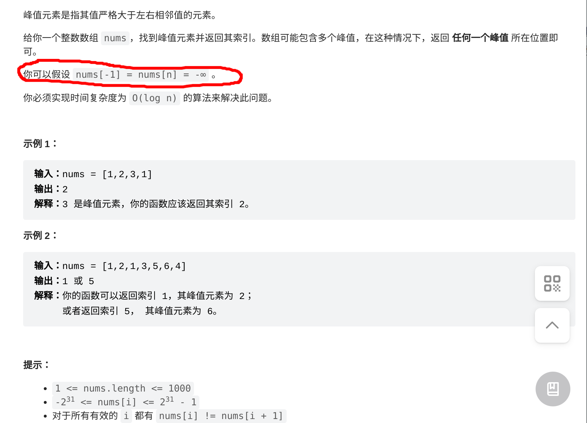

又要Logn，因此是二分

简单来说，为了在时间复杂度为 O(log n) 的条件下找到峰值元素，我们可以使用二分查找的方法。这种方法的关键在于，如果一个元素不是峰值，我们总可以沿着较大的邻居方向继续寻找，因为存在峰值的一侧至少会有一个元素大于当前元素，直到找到一个真正的峰值为止。

关键在于更新时`left = mid +1`,`right = mid`这样最后边界时(right = left+1)时候

* mid = left
* mid < right那么left = right
* 否则right = left
* 那么这个值一定是符合的吗，一定是符合的，这个值有两种情况
  * 第一个就是边界(0或者size-1)，考虑到题目设定，边界也算
  * 第二个，这个值不是边界，==那么我们知道left每次变动一定是在上升的，right每次变动每次变动都是不会下降的，这样看来，他们汇合的点一定是山峰==

```c++
class Solution {
public:
    int findPeakElement(vector<int>& nums) {
        int size = nums.size();

        int left = 0;
        int right = size - 1;
        while(left < right){
            int mid = (left+right)/2;
            if(nums[mid] < nums[mid+1]){
                //峰值在右侧
                left = mid + 1;
            }else{
                right = mid;
            }
        }
        return left;
    }
};
```

> 当然，让我们使用数组 `4 5 4 3 2 1 2 3 4 5 6` 来模拟二分查找找到峰值的过程。数组长度为11，因此索引范围是0到10。
>
> 初始时：
>
> - left = 0
> - right = 10
>
> ### 第一步
>
> 中间索引 mid = (0 + 10) / 2 = 5，对应的元素是 `1`。
>
> - 检查 `nums[mid] < nums[mid + 1]` 是否成立，即 `1 < 2`，这是成立的，说明峰值在右侧。
> - 更新 left = mid + 1 = 6
>
> 现在：
>
> - left = 6
> - right = 10
>
> ### 第二步
>
> 中间索引 mid = (6 + 10) / 2 = 8，对应的元素是 `4`。
>
> - 检查 `nums[mid] < nums[mid + 1]` 是否成立，即 `4 < 5`，这是成立的，说明峰值还在右侧。
> - 更新 left = mid + 1 = 9
>
> 现在：
>
> - left = 9
> - right = 10
>
> ### 第三步
>
> 中间索引 mid = (9 + 10) / 2 = 9，对应的元素是 `5`。
>
> - 检查 `nums[mid] < nums[mid + 1]` 是否成立，即 `5 < 6`，这是成立的，说明峰值还在右侧。
> - 更新 left = mid + 1 = 10
>
> 现在：
>
> - left = 10
> - right = 10
>
> 到这一步，left 和 right 汇聚在同一位置，这就是峰值所在的索引，即索引10对应的元素`6`。
>
> 通过这个例子，我们可以看到二分查找逻辑确实能够有效地找到数组中的一个峰值元素。在这个过程中，我们始终根据中间元素与其右侧元素的比较结果来确定峰值可能所在的半区，并逐步缩小搜索范围，直到找到峰值。


# 选修


## 4. 寻找两个正序数组的中位数

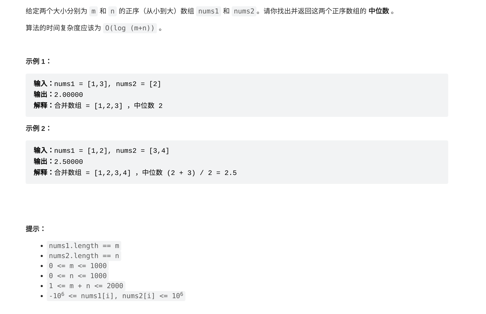

主要就是确定两个数组的分割点，转而我们可以简化为确定一个数组的分割点，因为另一个数组的分割点是可以用mid得出的。

因此，问题变为了二分查找某一个数组的分割点，使得两个数组分割点左边都小于两个数组分割点右边。


```c++
class Solution {
public:
    double findMedianSortedArrays(vector<int>& nums1, vector<int>& nums2) {
         //具体想法很简单，中点一定是mid = nums1.size+nums2.size/2，因此实际上我们只要对一个数组做二分，另一个数组对应的点在哪就定了
        //首先规定，我们从nums1取k个，nums2取p个，因此k+p = mid
        //我们的目标是nums1[k-1] <= nums2[p]且nums2[p-1] <= nums1[k]
        //nums1 x x x ... nums1[k-1]   | nums1[k] ...
        //nums2 x x x ... nums2[p-1]   | nums2[p] ... 
        // 确保nums1是较短的数组，能够规避很多边界问题。
        if (nums1.size() > nums2.size()) {
            return findMedianSortedArrays(nums2, nums1);
        }

        int m = nums1.size();
        int n = nums2.size();
        int left = 0, right = m, mid = (m + n + 1) / 2;//只需要找到nums1的分割点就能很容易找到nums2的分割点

        while (left < right) {
            //二分找nums1中的分割点
            int i = left + (right - left) / 2; // nums1中的分割线位置
            int j = mid - i; // nums2中的分割线位置
            
            if (nums1[i] < nums2[j - 1]) { // i太小，需要右移
            //这里，注意i是下标，因此nums1实际取了i+1个，因此nums2应该取j-2个，因此这里是nums1[i]与nums2[j-1]比较
            // nums1[i]     | nums1[i+1]
            // nums2[j-2]   | nums2[j-1] nums2[j]
                left = i + 1;
            } else { // i太大或者刚好，需要左移
                right = i;
            }
        }

        int i = left;
        int j = mid - i;
        int nums1LeftMax = (i == 0) ? INT_MIN : nums1[i - 1];
        int nums2LeftMax = (j == 0) ? INT_MIN : nums2[j - 1];
        int nums1RightMin = (i == m) ? INT_MAX : nums1[i];
        int nums2RightMin = (j == n) ? INT_MAX : nums2[j];

        if ((m + n) % 2 == 1) { // 奇数个元素
            return max(nums1LeftMax, nums2LeftMax);
        } else { // 偶数个元素
            return (max(nums1LeftMax, nums2LeftMax) + min(nums1RightMin, nums2RightMin)) / 2.0;
        }
    }
};
```


## 34. 在排序数组中查找元素的第一个和最后一个位置


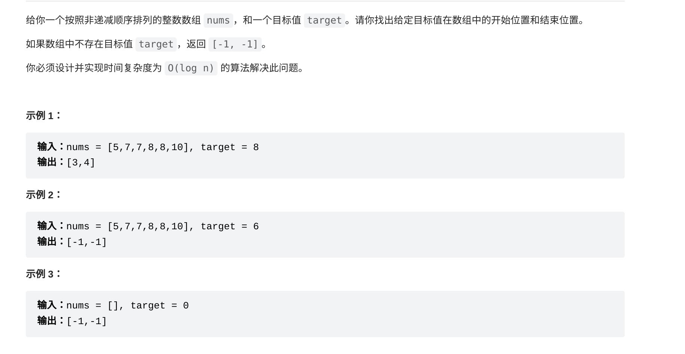

- **findFirst** 函数：通过二分查找，找到目标值在数组中的开始位置。如果`nums[mid]`大于等于目标值，向左移动`right`指针。每次发现与目标值相等的元素时，更新`index`变量，最终返回`index`。
- **findLast** 函数：通过二分查找，找到目标值在数组中的结束位置。如果`nums[mid]`小于等于目标值，向右移动`left`指针。和`findFirst`函数类似，每次发现与目标值相等的元素时，更新`index`变量，最终返回`index`。
- **searchRange** 函数：调用`findFirst`和`findLast`函数，返回目标值在数组中的开始位置和结束位置组成的数组。

```c++
#include <vector>
using namespace std;

class Solution {
public:
    vector<int> searchRange(vector<int>& nums, int target) {
        int start = findFirst(nums, target);
        int end = findLast(nums, target);
        return {start, end};
    }

    int findFirst(vector<int>& nums, int target) {
        int index = -1;
        int left = 0;
        int right = nums.size() - 1;
        while (left <= right) {
            int mid = left + (right - left) / 2;
            if (nums[mid] >= target) {
                right = mid - 1;
            } else {
                left = mid + 1;
            }
            if (nums[mid] == target) index = mid;
        }
        return index;
    }

    int findLast(vector<int>& nums, int target) {
        int index = -1;
        int left = 0;
        int right = nums.size() - 1;
        while (left <= right) {
            int mid = left + (right - left) / 2;
            if (nums[mid] <= target) {
                left = mid + 1;
            } else {
                right = mid - 1;
            }
            if (nums[mid] == target) index = mid;
        }
        return index;
    }
};

```


## 136. 只出现一次的数字

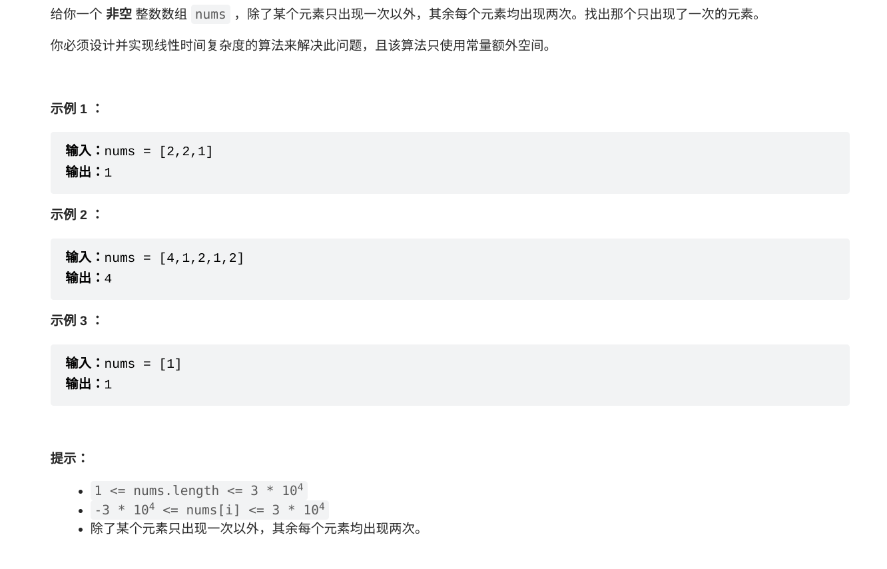

```c++
class Solution {
public:
    int singleNumber(vector<int>& nums) {
        int target = 0;
        for(auto& num:nums){
            target^=num;
        }
        return target;
    }
};
```


## 24. 两两交换链表中的相邻节点

简单题，维护四个点即可

```c++
/**
 * Definition for singly-linked list.
 * struct ListNode {
 *     int val;
 *     ListNode *next;
 *     ListNode() : val(0), next(nullptr) {}
 *     ListNode(int x) : val(x), next(nullptr) {}
 *     ListNode(int x, ListNode *next) : val(x), next(next) {}
 * };
 */
class Solution {
public:
    ListNode* swapPairs(ListNode* head) {
        if(head == nullptr || head->next == nullptr){
            return head;
        }
        ListNode* Head = nullptr;
        ListNode* first = head;
        ListNode* second,*third;
        head = first->next;
        while(first != nullptr && first->next != nullptr){
            second = first->next;
            third = second->next;

            if(Head){
                Head->next = second;
            }
            first->next = third;
            second->next = first;
            

            Head = first;
            first = third;
        }
        return head;
    }
};
```


## 394. 字符串解码

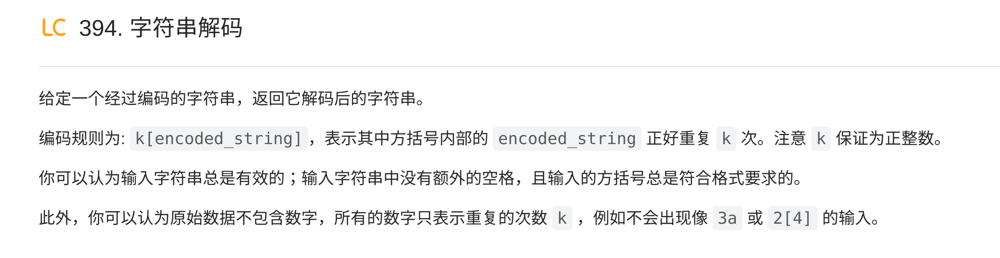

简单来说，我们使用递归

读取每一个字符，如果是【就进入递归，递归传入当前位置，在【】内计算完成后的位置以及【】内的内容应该被复制几遍

几个坑

* 需要考虑长度超过1的数字
* string复制n次时不能自己+=n次

```c++
class Solution {
public:
    string generate_new_substring(string& s, int pos, int &new_pos,int num){
        std::string substring;
        int sub_num =-1;
        while(pos < s.size() && s[pos] != ']' ){
            if(isdigit(s[pos])){
                //这里需要考虑类似100[leetcode]这样，需要读出一个数字序列
                if(sub_num != -1)
                    sub_num = sub_num*10 + s[pos]-'0';
                else
                    sub_num = s[pos]-'0';

            }
            else if(s[pos]=='['){
                substring += generate_new_substring(s,pos+1,pos,sub_num);

            }else if(isalpha(s[pos])){
                substring += s[pos];

            }
            if(s[pos]==']')
                sub_num = -1;
            pos++;
        }
        new_pos = pos;
        string rs;
        for(int i = 0;i < num;i++){
            rs+=substring;
        }
        return rs;
    }
    string decodeString(string s) {
        //如果遇到英文，直接输出
        //如果遇到数字，记录
        //如果遇到左括号，开始往栈压入
        int num = -1;
        std::string result;
        for(int i = 0; i < s.size();i++){
            if(isdigit(s[i])){
                if(num != -1)
                    num = num*10+s[i]-'0';
                else
                    num = s[i]-'0';
            }
            else if(s[i] == '['){
                result+=generate_new_substring(s,i+1,i,num);
            }else if(isalpha(s[i])){
                result+= s[i];
            }

            if(s[i] == ']'){
                num = -1;
            }

        }

        return result;

    }
};
```


