过于简单，简单的提一下概念：

* 树

* 子结点，父节点

* 深度

* 节点之间的距离

* 二叉树

* 完全二叉树：除了最后一层外其他全满

* 满二叉树：全满

* d层满二叉树:$2^d-1$个节点，最后一层$2^{d-1}$个节点

* 树的遍历：前中后，访问根的时机

  * 前序遍历：根-左-右

    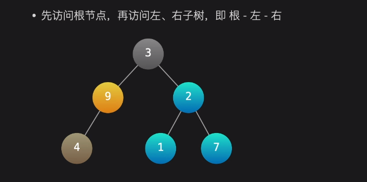

  * 中序遍历：左-根-右

  * 后序遍历：左右根

* 二叉查找树：父节点值大于等于左子树所有节点值，小于等于右子树所有节点值

  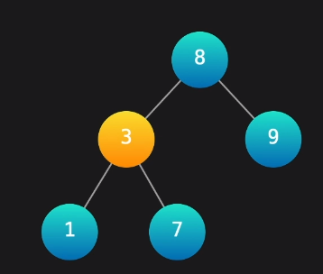

  * 二叉查找树的中序遍历=有序序列

  * 左子树节点值<=父节点值<= 右子树节点值

  * 二叉查找树的查找操作都为O(h)/O（logn)，h为树高度,n为节点数:

    * 查找最大值：父节点一直往右走

    * 查找最小值：父节点一直往左走

    * 查找任意值：类似二分查找

    * 查找某个值的前后值：类似二分查找，找到之后某个节点的前驱后继节点就是这个节点的左右son。这是二叉查找树的性质决定的，由中序遍历可以发现。

      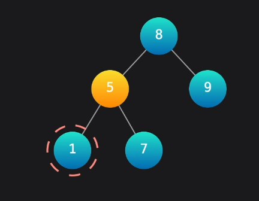

    * 查找某个值第一次/最后一次出现的位置：必须判断到左右子树都比目标值小/大才行

      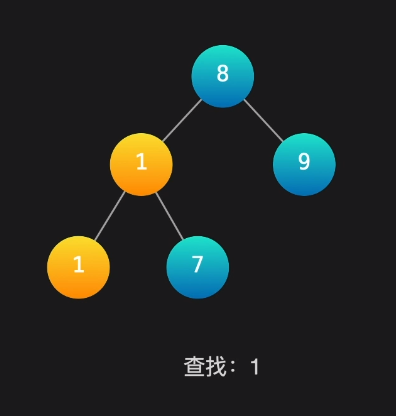

      这就是为什么必须判断完左右子树的特殊情况

      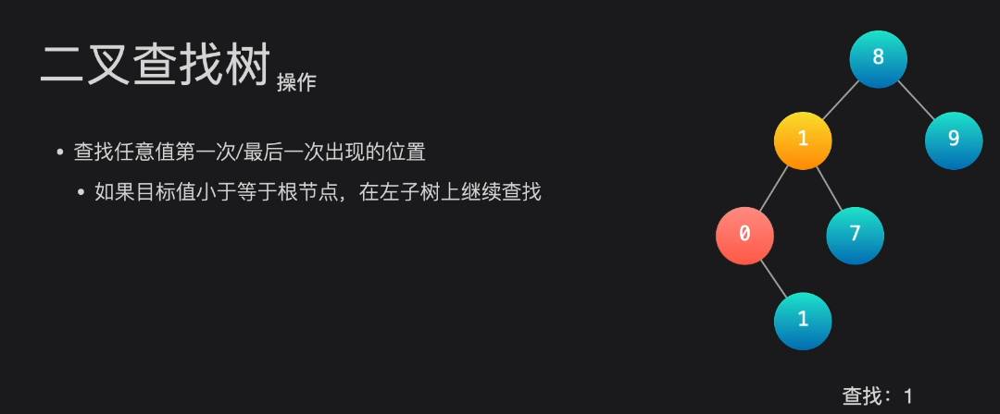

    * 查找某个节点的前驱：

    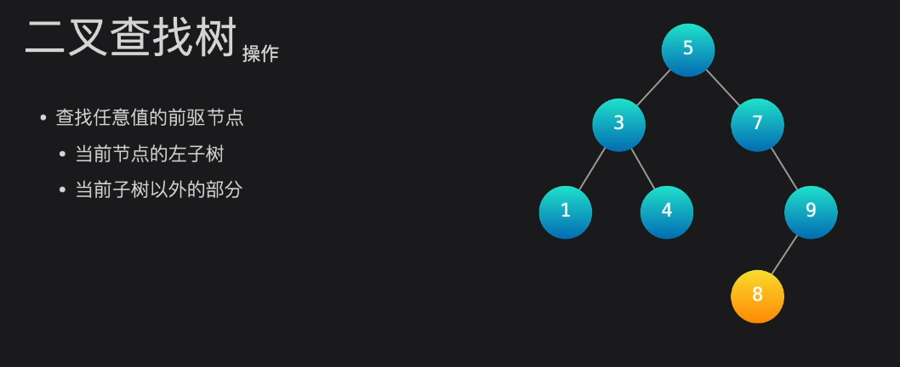

    

    ==如果父节点和左孩子同时存在，那么前驱节点在左子树上==

    * 如果父节点与左孩子都存在，node节点是左孩子（node_father > node)，那么前驱节点一定在左子树上(node_son < node)

      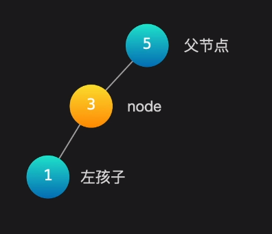

    * 如果父节点与左孩子都存在，node节点是右孩子，那么(nodefather < node,nodeson< node )，因此以中序遍历的顺序，应该是左孩子更靠近node，因此前驱节点还是左孩子

      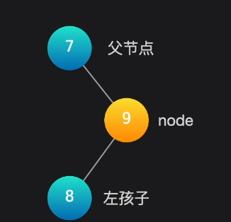

    同理能有

    ==只有父节点存在，前驱节点只能是当前子树以外的部分或者不存在==

    这个其实就是，只有在根节点右子树才会发生吧

    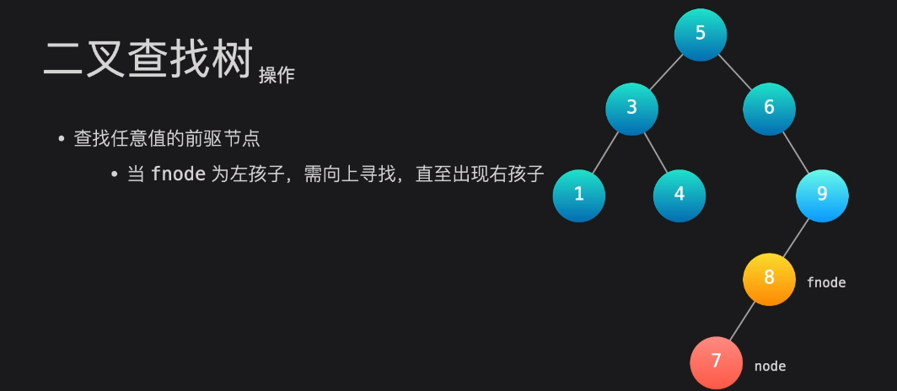

    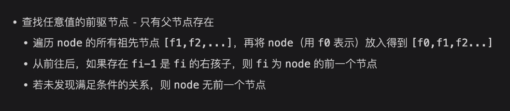

    ==只有左节点存在，那么前驱节点只能在左子树上==

    

    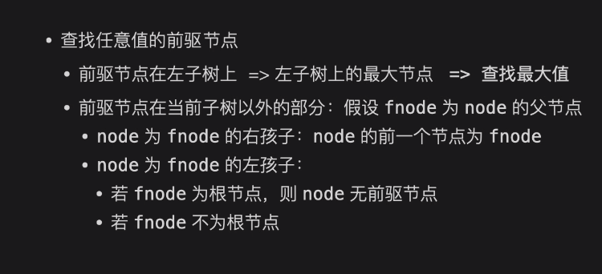

  * 二叉查找树操作

    