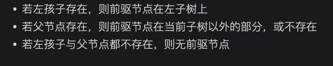

过于简单，简单的提一下概念：

* 树

* 子结点，父节点

* 深度

* 节点之间的距离

## 1. 二叉树

* 二叉树

* 完全二叉树：除了最后一层外其他全满

* 满二叉树：全满

* d层满二叉树:$2^d-1$个节点，最后一层$2^{d-1}$个节点

* 树的遍历：前中后，访问根的时机

  * 前序遍历：根-左-右

    

  * 中序遍历：左-根-右

  * 后序遍历：左右根

## 2. 二叉查找树

### 2.1 二叉查找树基础

* 二叉查找树：父节点值大于等于左子树所有节点值，小于等于右子树所有节点值，即为无论什么时候，都是左边大右边小

  

  * 二叉查找树的中序遍历=有序序列

  * 左子树节点值<=父节点值<= 右子树节点值

### 2.2 查找操作

#### 无重复值查找

  * 二叉查找树的查找操作都为O(h)/O（logn)，h为树高度,n为节点数:

    * 查找最大值：父节点一直往右走

    * 查找最小值：父节点一直往左走

    * 查找任意值：类似二分查找

    * 查找某个值的前后值：类似二分查找，找到之后某个节点的前驱后继节点就是这个节点的左右son。这是二叉查找树的性质决定的，由中序遍历可以发现。

      
#### 有重复查找
  ==有重复值时==，查找某个值第一次/最后一次出现的位置：必须判断到左右子树都比目标值小/大才行

  

  这就是为什么必须判断完左右子树的特殊情况

  

#### 前驱后驱查找

中序遍历

* 查找某个节点的前驱：


查找树严格遵守左<=中<=右的规律，此时不难得出结论，找前驱节点只需要在左子树找就好了，可是有例外

如图所示，如果找8的前驱节点，实际上是父父节点7，这是因为8没有左子树。如果8有左子树是否可能前驱节点


==如果父节点和左孩子同时存在，那么前驱节点在左子树上==

* 如果父节点与左孩子都存在，node节点是左孩子（node_father > node)，那么前驱节点一定在左子树上(node_son < node)

  

* 如果父节点与左孩子都存在，node节点是右孩子，那么(nodefather < node,nodeson< node )，因此以中序遍历的顺序，应该是左孩子更靠近node，因此前驱节点还是左孩子

  

同理能有

==只有父节点存在，前驱节点只能是当前子树以外的部分或者不存在==

这个其实就是，只有在根节点右子树才会发生吧


==只要左节点存在，那么前驱节点只能在左子树上==




### 2.3 插入

* 插入
  * 插入元素小于等于当前节点
    * 当前节点左子树不为空，递归左子树
    * 为空，插入左子树
  * 插入节点大于当前节点
    * 当前节点右子树不为空，递归右子树
    * 为空，插入右子树


根据当前节点与待插入节点的大小关系决定往左子树还是右子树走


### 2.4 删除

* 删除叶子节点：直接删除

* 删除的节点有一个孩子：直接将孩子和其父节点相连

  * 如果是根节点需要将其孩子作为根节点

* 删除的节点有两个孩子：

  情况稍微复杂了一些，以下图为例

  

  用三角代表子树，圆圈代表节点

  考虑，删除节点N

​	现在我们来捋一下关系

 1. X（N的右子节点的左孩子）一定是最接近N且大于N的数

 2. X一定没有左孩子，如果有就继续往左设置X，与N交换的X一定没有左孩子

    考虑中序遍历，此时应该是(因为不清楚N是F的左还是右，不考虑F)

    L->N->R,但是R还有子树，因此是

    L->N->X->R->R(子树)

    如果X有左孩子X1，那么就是

    L->N->X1->X->R->R(子树)

    如果X有右孩子X2，那么就是

    L->N->X->X2->R->R(子树)

    ==因此，我们可以发现，按照中序遍历，X一定没有左孩子==

因此，如果我们删除N，我们可以发现，顺序为

L->X->R->R(子树)

==也就是我们交换N和X，然后删除N即可==


此时删除N就变成了之前的删除叶子节点或者有一个孩子的情况

我一直在想，考虑这么一个树

```markdown
                   8
         /                   \
      4                         12
    /       \                  /      \
   2         6               10       14
 /   \     /   \           /    \     /    \
1     3   5     7         9    11   13    15

```

你可以发现，删除8的过程，你会找到节点9来与8交换，显然，因为BST的插入机制，最靠近删除节点的节点一定是叶子节点或者有一个右孩子的叶子节点。

总结一下：

> 在二叉搜索树中删除一个具有两个子节点的节点时，替换节点通常选择自右子树的最小节点（或左子树的最大节点），此节点被称为"继承者"节点。
>
> **删除的节点的替换节点（继承者）通常是一个叶子节点（没有子节点）或者仅有一个右子节点的节点。**


> 思考一下，为什么X一定没有左孩子，这体现了传统的BST插入的一个弊端，它的树结构高度与插入顺序相关。
>
> 例如，对于[4,2,6,1,3,5,7]，的顺序，我们可以获得一个满二叉树
>
> ```markdown
>     4
>    / \
>   2   6
>  /|   |\
> 1 3   5 7
> ```
>
> 插入序列 [1,2,3,4,5,6,7][1,2,3,4,5,6,7] 到一个初始为空的二叉搜索树（BST）中，按照常规的BST插入规则（即较小的值插入左子树，较大的值插入右子树），将导致生成一个高度极不平衡的树，特别是如果元素是预排序的。这里的情况会形成一个右倾的线性链，如下所示：
>
> ```markdown
> 1
>  \
>   2
>    \
>     3
>      \
>       4
>        \
>         5
>          \
>           6
>            \
>             7
> 
> ```
>
> 
>
> 按照的基本二叉查找树（BST）插入规则，树成为满二叉树（完美平衡）的情况非常罕见，除非插入的元素顺序特别设计过。这种插入方法通常会导致树的结构依赖于插入元素的顺序，可能会形成不平衡的树，特别是在连续插入有序或部分有序数据时。
>
> 为了使二叉查找树的插入和整体结构更加平衡，平衡树被提了出来：
>
> 1. **AVL树**：通过在每次插入后进行一系列==旋转操作==，保持树的平衡，确保任何节点的左右子树高度差不超过1。
> 2. **红黑树**：通过设置==节点颜色和执行颜色==翻转及旋转，保持树的近似平衡。
> 3. **伸展树（Splay Tree）**：通过splay操作（一系列的旋转），将每次访问的节点移动到根，间接实现了树的平衡。
> 4. **Treaps（树堆）**：结合二叉搜索树和堆的性质，通过旋转操作维持堆性质，以此来达到平衡。
> 5. **B树及其变体（如B+树）**：通过节点可以有多个子项，保持树的平衡，广泛应用于数据库系统中。
>
> 通过平衡的插入，我们能将O(h),h代表树的高度，的复杂度，变为O(logn)

### 2.5 性能


## 3. 平衡树


### 3.1 AVL树


### 3.2 红黑树


### 3.3 B树与B+树


### 3.4 Splay Tree（伸展树）


### 3.5 Treaps 树堆


## 4. 堆

### 4.1 堆基础

我们抛开平衡树，如果我们只是想O(logn)的时间内进行插入和删除，或者在常数时间内获得最值，那么我们应该使用堆


从这个描述我们不难推断出，

* 堆是一个完全二叉树
* 堆顶一定是最大值或者最小值（大根堆小根堆），否则没法O(1)获得

实际上，堆还有其他特性

* 堆的任意一个子树也是一个堆，最大堆的子树一定是最大堆，最小堆同理。


​	这使得我们能够应付这么一个情况：在一个长为n的数组里，查找每m个连续位置数字的最大值

通常来说，暴力需要O(nm)，使用堆，我们能使用滑动窗口解决，因此插入删除都是logm，因此我们能将m优化为logm，总体降为O(nlogm)


* 最大堆根节点值一定大于等于其所有孩子
* 最小堆根节点值一定小于等于其所有孩子


### 4.2 堆的复杂度

明确一下，堆的查询最大最小值为O(1)（不可兼得)

查询任意值为O(n)

插入为O(logn)

删除需要遍历找到值，因此是O(n),删除操作是O(1),删除操作可能破坏堆结构，需要重新堆化(heapify)，复杂度为logn


### 4.3 堆的操作

二叉树表示与数组表示[8, 7, 2, 1, 3]，注意父子节点的关系是2n和2n+1


### 4.4 堆的操作

#### 4.4.1 插入与Shift up 操作

> 新节点插入完全二叉树末尾
>
> ```c++
> while(not satisfy)
> 	if(new_insert > father)  
>     	swap;
> ```
>
> 时间复杂度因此为O(logn)

考虑一个堆，我们向里面插入1，或者可以说我们向数组末尾加一


可以发现，插入之后节点满足一个局部性质：它小于父节点

* 考虑到它插入的是一个堆，因此整个堆仍然满足堆性质（大根堆性质）
* 考虑到我们直接插入到数组末尾，因此该结构一定是完全二叉树结构


如果我们向其插入9


显然，9>2，违反了定义，因此我们交换它与其父节点

> 考虑如果2已经有一个节点a, 则a<2
>
> 因此，交换2与9使得这个子树称为一个大根堆子树
>
> 2<9,a<9


这个数组仍然不满足大根堆定义，我们仍然是交换父节点与根

> 父节点是整个子树最大的，因此这么交换对于节点2和节点a仍然是够大的


#### 4.4.2 删除与Shift_down

* 删除堆顶：

  * 首先与堆尾部交换，然后删除堆尾部（为了不破坏大根堆的结构）O(1)

  * 如果当前节点小于任意子节点，则它与子节点较大的一个交换 O(logn)

    ```c++
    while(Not satisfy)
        if(father < son1 || father < son2){
            swap(father,max(son))
        }
    ```

* 删除堆中：实际上会发生另一种情况：
  
  * 考虑如果经过步骤1后，如果当前节点大于父节点，则与父节点交换(shift up)
    
  


==shift_up与shift_down不会同时发生！==

考虑将想要删除节点和末尾交换后，会发生三种情况：

* 已经满足
* 它比一个孩子小
* 它比父亲大

以及shift_up与shift_down本身的操作每一步都是确保了已经处理部分大根堆的性质，因此每个情况只会对应一种操作


#### 4.5 什么是堆排

* 将n个元素转为最小堆
* 每次删除堆顶

这样就是一个从小到大的排序了。


#### 4.6 建堆

自顶向下：自顶向下建堆是从根节点开始，逐步将元素插入堆中，并保持堆的性质（最大堆或最小堆）。每次插入新元素时，元素从堆的底部开始，向上调整以维持堆的性质，这个过程称为上浮（Percolate Up或Sift Up）。

* 每次插入操作的最坏情况下的时间复杂度是 *O*(log*n*)，其中 *n* 是插入前堆中的元素数量，因为元素可能需要从堆的底部上浮到根节点。
* 对于 *n* 个元素的完整建堆过程，最坏情况下的时间复杂度为 *O*(*n*log*n*)，因为每个元素都可能需要上浮。

自底向上：建立完全二叉树，然后对每一个非叶子节点，从后往前进行shift_down，这样就能O(n)建堆。

* 下沉操作的时间复杂度为 *O*(log*n*)，因为元素可能需要从节点下沉到树的底部。

* 建堆时从后向前对每个非叶子节点进行下沉操作。对于 *n* 个元素，非叶子节点大约是*n*/2 个，每个节点执行下沉操作的复杂度是 *O*(log*n*)。

* 然而，由于下沉操作的复杂度随节点深度的减小而减小，整体建堆过程的时间复杂度可以通过更精细的分析证明为 *O*(*n*)。这是因为堆的下层有更多的节点，而这些节点的下沉代价较小。

  可以用以下近似算得,h = logn

$$
2^0 * h + 2 * (h-1) + ... + 2^{h-1} * 1 \approx n
$$

自顶向下通常是不知道n的时候使用，自底向上是知道n的时候使用
