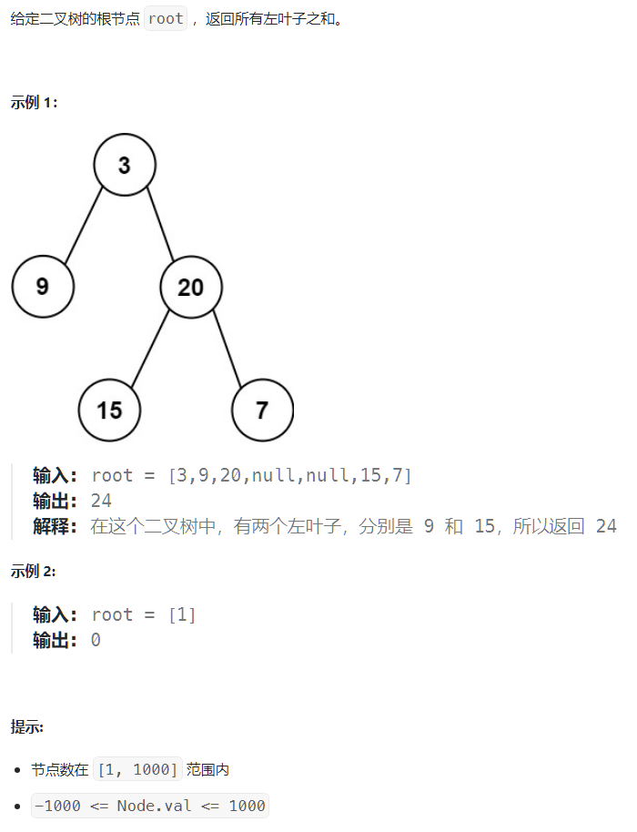

## 必修题


### 226. 翻转二叉树

简单规律题，递归，交换每个孩子即可

```c++
/**
 * Definition for a binary tree node.
 * struct TreeNode {
 *     int val;
 *     TreeNode *left;
 *     TreeNode *right;
 *     TreeNode() : val(0), left(nullptr), right(nullptr) {}
 *     TreeNode(int x) : val(x), left(nullptr), right(nullptr) {}
 *     TreeNode(int x, TreeNode *left, TreeNode *right) : val(x), left(left), right(right) {}
 * };
 */
class Solution {
public:
    TreeNode* invertTree(TreeNode* root) {
        // invert two son
        if(root == nullptr)
            return root;
        TreeNode* temp;
        temp = root->left;
        root->left = root->right;
        root->right = temp;
        invertTree(root->left);
        invertTree(root->right);
        return root;
    }
};
```


### 199. 二叉树的右视图

简单模拟题，直接在每一层寻找最右边的即可

可惜是链表，爷最烦链表了，正常人谁用啊

链表那就没办法了，BFS，DFS

DFS就是每层维护一个值，考虑到BFS的访问顺序，每层一定是最右边的最后被访问，因此是O(n)

我怕觉得还是BFS比较贴合

BFS就是每层找到最右边的即可

简单来说，分解为子问题，每一层的节点都存在一个queue里面，queue的最后一个节点就是我们需要的，每一层只需要将下一层存在节点存在新queue里面递归即可。

```c++
/**
 * Definition for a binary tree node.
 * struct TreeNode {
 *     int val;
 *     TreeNode *left;
 *     TreeNode *right;
 *     TreeNode() : val(0), left(nullptr), right(nullptr) {}
 *     TreeNode(int x) : val(x), left(nullptr), right(nullptr) {}
 *     TreeNode(int x, TreeNode *left, TreeNode *right) : val(x), left(left), right(right) {}
 * };
 */
class Solution {
public:
    void find_this_layer(std::queue<TreeNode*>& node_this_layer, std::vector<int>& res){
        if(node_this_layer.size() == 0){
            return ;
        }
        std::queue<TreeNode*> node_next_layer;
        res.push_back(node_this_layer.back()->val);

        while(node_this_layer.size() > 0){
            TreeNode* temp;
            temp = node_this_layer.front();
            node_this_layer.pop();

            if(temp->left != nullptr){
                node_next_layer.push(temp->left);
            }
            if(temp->right != nullptr){
                node_next_layer.push(temp->right);
            }
        }
        find_this_layer(node_next_layer, res);
    }
    vector<int> rightSideView(TreeNode* root) {
        std::queue<TreeNode*> node_this_layer;
        std::vector<int> res;
        if(root == nullptr){
            return res;
        }
        res.push_back(root->val);
        if(root->left != nullptr)
            node_this_layer.push(root->left);
        if(root->right != nullptr)
            node_this_layer.push(root->right);
        find_this_layer(node_this_layer, res);
        return res;
    }
};
```


考虑到（虽然不太可能）递归会发生栈溢出，也有迭代写法

写的麻烦一点，就是你得额外维护一个该节点是什么深度，然后用一个queue来找就好了。

```c++
/**
 * Definition for a binary tree node.
 * struct TreeNode {
 *     int val;
 *     TreeNode *left;
 *     TreeNode *right;
 *     TreeNode() : val(0), left(nullptr), right(nullptr) {}
 *     TreeNode(int x) : val(x), left(nullptr), right(nullptr) {}
 *     TreeNode(int x, TreeNode *left, TreeNode *right) : val(x), left(left), right(right) {}
 * };
 */
class Solution {
public:
    vector<int> rightSideView(TreeNode* root) {
        std::vector<int> res;
        if(!root){
            return res;
        }
        //记录每一层的最右值
        std::unordered_map<int,int> rightEST;
        // 记录层-节点对
        std::queue<std::pair<int, TreeNode*>> node_list;

        node_list.push(std::make_pair(0,root));

        while(node_list.size()){
            std::pair<int, TreeNode*> thisNode = node_list.front();

            node_list.pop();
		   // 考虑访问顺序，后访问的一定是我们需要的
            rightEST[thisNode.first] = thisNode.second->val;
		   // 添加子节点
            if(thisNode.second->left != nullptr)
                node_list.push(std::make_pair(thisNode.first + 1, thisNode.second->left));
            if(thisNode.second->right != nullptr)
                node_list.push(std::make_pair(thisNode.first + 1, thisNode.second->right));
        }


        for(int i = 0; ; i++){
            if(rightEST.find(i) != rightEST.end()){
                res.push_back(rightEST[i]);
            }else{
                break;
            }
        }
        return res;

    }
};
```


### 297.二叉树的序列化与反序列化（困难）


这个题加深了前序，中序，后序遍历（按根节点访问顺序所命名）的作用。

首先，考虑到节点数为10000，肯定不能构造完全二叉树，因为极限情况（链）会需要$2^{10001}-1$大小的数组，同时，我们还需要反序列化， 因此不能只存储已有节点。

这个时候，我们就需要考虑，一个序列化后的树需要哪些信息，才能够还原。

答案显而易见，序列化时的规则（需要无后效性，即为已经构造完成的不会受到未构造部分的插入而改变结构），以及每个节点是否为最后一个节点。

每个节点是否为最后一个节点又分为有左孩子，有右孩子，无孩子。


有了这两个信息，配合前序/中序/后序遍历规则，即可将一棵树的信息完整表示。


我们使用的null来表示空节点（无孩子），实际上会遇到一些情况，有过多的null（最多会有10000+1），这是没办法的，我们得考虑所有的节点都不是一个有两个孩子的节点，这就意味着我们至多需要节点数目个null来标识节点性质。


还有一种邪道写法是使用括号的嵌套结构来标识节点性质，就是反序列化的时候烦了很多


为了遍历方便起见，我们使用前序遍历

```c++
/**
 * Definition for a binary tree node.
 * struct TreeNode {
 *     int val;
 *     TreeNode *left;
 *     TreeNode *right;
 *     TreeNode(int x) : val(x), left(NULL), right(NULL) {}
 * };
 */
class Codec {
    // 用于序列化构造
    void serialize_acess(std::string &res, TreeNode* this_node){
        if(this_node->left){
            res += "," + std::to_string(this_node->left->val);
            serialize_acess(res, this_node->left);
        }else{
            res += ",#";
        }

        if(this_node->right){
            res += "," + std::to_string(this_node->right->val);
            serialize_acess(res, this_node->right);
        }else{
            res += ",#";
        }

        return;
    }
    //for deserialize
    // 用于获得下一个数字
    int get_next_num(std::string &data, int &pos, bool &is_null){
        std::string temp = {};
        int res = 0;
        if(data[pos] == '#'){
            is_null = true;
            pos++;
            pos++;
            return res;
        }
        // 需要用来额外判断是否为负数
        if(data[pos] == '-'){
            temp += '-';
            pos++;
        }
        while(isdigit(data[pos])){
            temp += data[pos++];
        }
        res = std::stoi(temp);
        pos++;
        is_null = false;
        return res;
    }
	
    // 用于前序构造
    void PreOrder(TreeNode* father, int &pos, bool &is_null, std::string &data){
        int val;
        // left
        if(pos >= data.size()) return;
        val = get_next_num(data, pos, is_null);
        if(is_null){
            father->left = nullptr;
        }else{
            father->left = new TreeNode(val);
            PreOrder(father->left, pos, is_null, data);
        }

        // right
        if(pos >= data.size()) return;
        val = get_next_num(data, pos, is_null);
        if(is_null){
            father->right = nullptr;
        }else{
            father->right = new TreeNode(val);

            PreOrder(father->right, pos, is_null, data);
        }

        return;

    }

public:
    
    // Encodes a tree to a single string.
    string serialize(TreeNode* root) {
        if(!root){
            return {};
        }
        std::string res = std::to_string(root->val);
        serialize_acess(res, root);
        //std::cout << res << std::endl;
        return res;
    }

    // Decodes your encoded data to tree.
    TreeNode* deserialize(string data) {
        if(data.empty()){
            return nullptr;
        }


        int pos = 0;
        bool is_null = false;

        int val = get_next_num(data, pos, is_null);
        if(is_null){
            return nullptr;
        }

        TreeNode* root = new TreeNode(val);


        PreOrder(root, pos, is_null, data);

        return root;
    }
};

// Your Codec object will be instantiated and called as such:
// Codec ser, deser;
// TreeNode* ans = deser.deserialize(ser.serialize(root));
```


### 230. 二叉搜索树中第k个最小的值（中等）-递归中序遍历

给定一个二叉搜索树的根节点 `root` ，和一个整数 `k` ，请你设计一个算法查找其中第 `k` 个最小元素（从 1 开始计数）。

**进阶：**如果二叉搜索树经常被修改（插入/删除操作）并且你需要频繁地查找第 `k` 小的值，你将如何优化算法？


```c++
// 暴力做法，set建树
/**
 * Definition for a binary tree node.
 * struct TreeNode {
 *     int val;
 *     TreeNode *left;
 *     TreeNode *right;
 *     TreeNode() : val(0), left(nullptr), right(nullptr) {}
 *     TreeNode(int x) : val(x), left(nullptr), right(nullptr) {}
 *     TreeNode(int x, TreeNode *left, TreeNode *right) : val(x), left(left), right(right) {}
 * };
 */
class Solution {
    void build_tree(std::set<int> &t, TreeNode* this_node){
        if(this_node){
            t.insert(this_node->val);
            build_tree(t, this_node->left);
            build_tree(t, this_node->right);
        }
        return;
    }
public:
    int kthSmallest(TreeNode* root, int k) {
        std::set<int> t;

        build_tree(t,root);

        auto it = t.begin();
        while(--k && it != t.end()){
            it++;
        }
        return *it;
    }
};
```

```c++
// 不考虑进阶的做法：中序遍历
/**
 * Definition for a binary tree node.
 * struct TreeNode {
 *     int val;
 *     TreeNode *left;
 *     TreeNode *right;
 *     TreeNode() : val(0), left(nullptr), right(nullptr) {}
 *     TreeNode(int x) : val(x), left(nullptr), right(nullptr) {}
 *     TreeNode(int x, TreeNode *left, TreeNode *right) : val(x), left(left), right(right) {}
 * };
 */
class Solution {
    void mid_search(std::vector<int>& t, TreeNode* root, int k){
        if(!root) return;
        if(t.size() == k) return;
        // 左
        if(root->left)
            mid_search(t, root->left, k);
        if(t.size() == k) return;
        // 中
        t.push_back(root->val);
        if(t.size() == k) return;

        // 右
        if(root->right)
            mid_search(t, root->right, k);

        return;
    }
public:
    int kthSmallest(TreeNode* root, int k) {
        std::vector<int> t;

        mid_search(t, root, k);

        return t[k-1];

    }
};
```

```c++
// 在前序遍历的基础上，每个节点额外储存一个这个节点为根节点的子树size，这样就可以应对极端情况下插入后的搜索了，这里就不写了。我的评价是有平衡树不用有点幽默。
```


### 173.二叉搜索树迭代器（中等）-迭代中序遍历


一个做法就是直接遍历一遍，然后存入vector，每次读vector就好了

另一个做法很巧妙，填补了迭代遍历的空白，具体来说，对于每个节点，首先读完左子树到最左边，然后==手动将current node转到右子树==。

具体来说，如下图，记得栈中就是中序遍历的顺序，都是未读取的有效值

> 第一次next()，读到节点3的左子节点null
>
> 直接读栈顶就是我们需要的
>
> ==手动转到这个有效节点3的右子节点==
>
> 第二次next，考虑右子节点不为空，会被压栈，同时开始搜索这个节点4的左节点，发现5，压栈，然后找5的左子节点，null
>
> 直接读栈顶，5，就是我们要的
>
> 手动转到5的右子节点
>
> 第三次next， current是5的右子节点，为空，因此直接取栈顶4
>
> 手动转到4的右子节点
>
> 以此类推


```c++
/**
 * Definition for a binary tree node.
 * struct TreeNode {
 *     int val;
 *     TreeNode *left;
 *     TreeNode *right;
 *     TreeNode() : val(0), left(nullptr), right(nullptr) {}
 *     TreeNode(int x) : val(x), left(nullptr), right(nullptr) {}
 *     TreeNode(int x, TreeNode *left, TreeNode *right) : val(x), left(left), right(right) {}
 * };
 */
class BSTIterator {
    TreeNode* current;
    std::stack<TreeNode*> stk;
public:
    BSTIterator(TreeNode* root) :current{root}{

    }
    
    int next() {
        // 这里的压栈思想很巧妙
        // 具体流程是找到最左的节点，然后取值，将current转到右边
        // 如果右没有，那么它就不会被压栈，它就会直接从栈中读
        // 如果右有，那么它会一直到右边的最左
        // 这样就造成了一个情况， 读左，然后手动转右，如果左右都为空那么就从栈拿，这是一个很巧妙的针对二叉树的写法

        // 保证了栈内都是有效且未取值节点
        while(current != nullptr){
            stk.push(current);
            current = current->left;
        }

        current = stk.top();
        stk.pop();

        int res = current->val;

        current = current->right;
        return res;

    }
    
    bool hasNext() {
        // 需要考虑有右节点的情况
        return current || !stk.empty();
    }
};

/**
 * Your BSTIterator object will be instantiated and called as such:
 * BSTIterator* obj = new BSTIterator(root);
 * int param_1 = obj->next();
 * bool param_2 = obj->hasNext();
 */
```


### 108. 有序数组转换为平衡树（简单，C++错误）

简单二分题，写了一些递归中的内存错误。

```c++
/**
 * Definition for a binary tree node.
 * struct TreeNode {
 *     int val;
 *     TreeNode *left;
 *     TreeNode *right;
 *     TreeNode() : val(0), left(nullptr), right(nullptr) {}
 *     TreeNode(int x) : val(x), left(nullptr), right(nullptr) {}
 *     TreeNode(int x, TreeNode *left, TreeNode *right) : val(x), left(left), right(right) {}
 * };
 */
class Solution {
    bool build(int left, int right, TreeNode* root, vector<int>& nums){
        if(left > right){
            // 我之前写的是root = nullptr;这个写法实际上是不对的，因为它修改的是按值传入的root地址
            // 如果要修改这个，也有一种方法是TreeNode*&root,但是没必要
            // 我第二次修改
            // delete root;// 注意此处很容易出错
            // 这也是不对的，因为父节点指向这里会指向一个悬空指针
            // 最好的方法是使用一个返回值指定是否为空，或者在new Treenode之前判定
            return false;
        }
        if(left == right){
            root->val = nums[left]; 
            return true;
        }
        int mid = (left + right) / 2;
        root->val = nums[mid];
        root->left = new TreeNode();
        root->right = new TreeNode();
        if(!build(left, mid-1, root->left, nums)){
            root->left = nullptr;
        }
        if(!build(mid+1,right,root->right, nums)){
            root->right = nullptr;
        }
        return true;

    }
public:
    TreeNode* sortedArrayToBST(vector<int>& nums) {
        TreeNode* root = new TreeNode();
        build(0, nums.size()-1, root, nums);
        return root;
    }
};
```


### 257.二叉树的所有路径（简单）


将当前已访问路径pass by value传给子节点即可。

```c++
/**
 * Definition for a binary tree node.
 * struct TreeNode {
 *     int val;
 *     TreeNode *left;
 *     TreeNode *right;
 *     TreeNode() : val(0), left(nullptr), right(nullptr) {}
 *     TreeNode(int x) : val(x), left(nullptr), right(nullptr) {}
 *     TreeNode(int x, TreeNode *left, TreeNode *right) : val(x), left(left), right(right) {}
 * };
 */
class Solution {
    void go_deep_next(std::string so_far_road, TreeNode* root, std::vector<std::string> &res){
        so_far_road += "->" + std::to_string(root->val);
        
        if(root->left){
            go_deep_next(so_far_road, root->left,res);
        }
        if(root->right){
            go_deep_next(so_far_road, root->right,res);
        }

        if(root->left == nullptr && root->right == nullptr){
            res.push_back(so_far_road);
        }
        return;
        
    }
public:
    vector<string> binaryTreePaths(TreeNode* root) {
        std::string head = std::to_string(root->val);
        std::string so_far_road{head};
        std::vector<std::string> res;
        if(root->left)
            go_deep_next(so_far_road, root->left,  res);
        if(root->right)
            go_deep_next(so_far_road, root->right,  res);
        if(!root->left && !root->right){
            res.push_back(so_far_road);
        }
        return res;
    }
};
```


### 404. 左叶子之和（简单）



遍历时添加节点标记即可。

```c++
/**
 * Definition for a binary tree node.
 * struct TreeNode {
 *     int val;
 *     TreeNode *left;
 *     TreeNode *right;
 *     TreeNode() : val(0), left(nullptr), right(nullptr) {}
 *     TreeNode(int x) : val(x), left(nullptr), right(nullptr) {}
 *     TreeNode(int x, TreeNode *left, TreeNode *right) : val(x), left(left), right(right) {}
 * };
 */
class Solution {
    void find_son(TreeNode* root, int &res, bool is_left){
        if(!root->left && !root->right && is_left){
            res+= root->val;
        }
        if(root->left)
            find_son(root->left, res, true);
        if(root->right)
            find_son(root->right, res,false);
        
        return;

    }
public:
    int sumOfLeftLeaves(TreeNode* root) {
        int res = 0;

        find_son(root, res, false);

        return res;
    }
};
```


