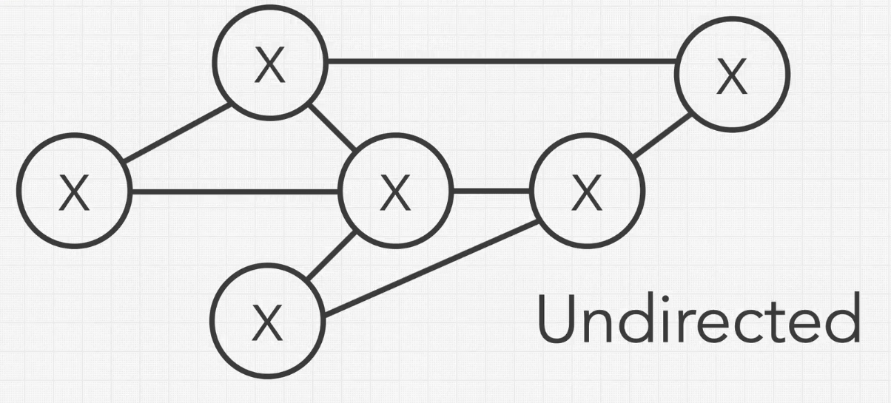
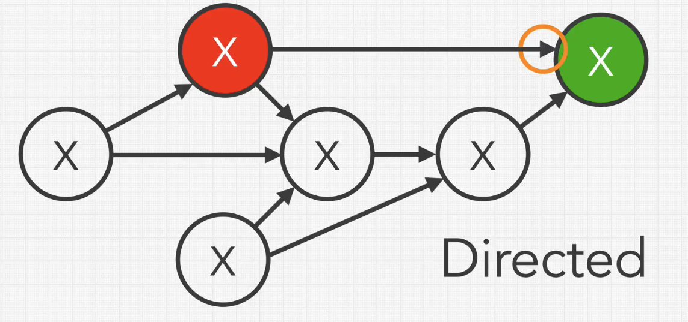
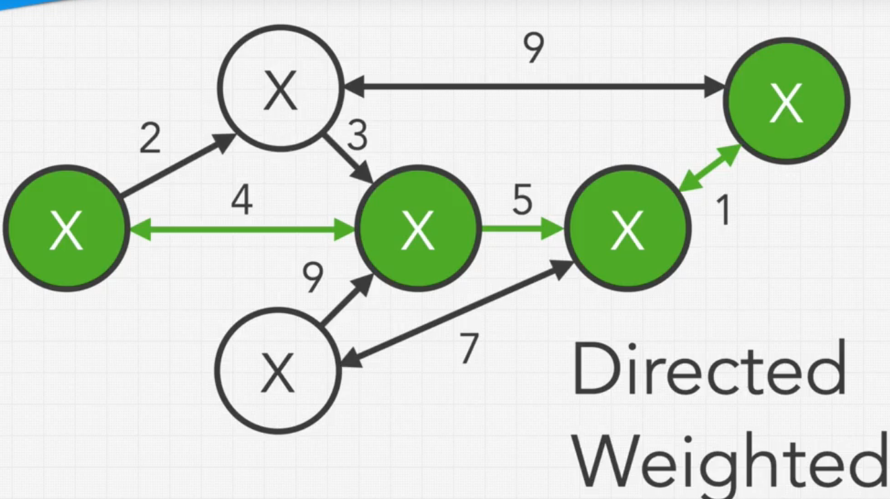
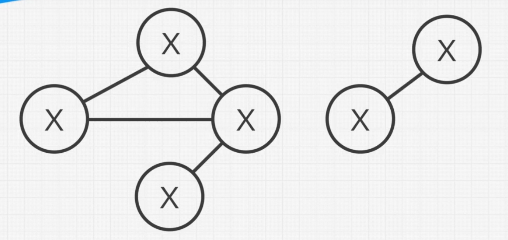
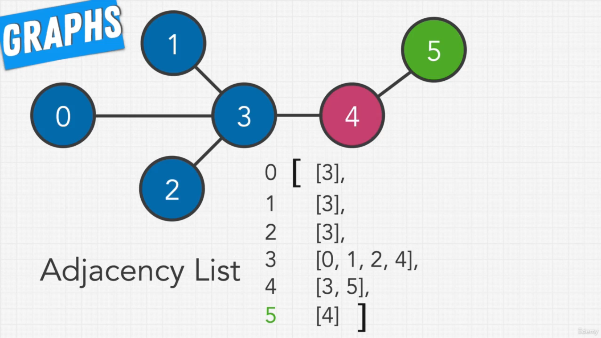
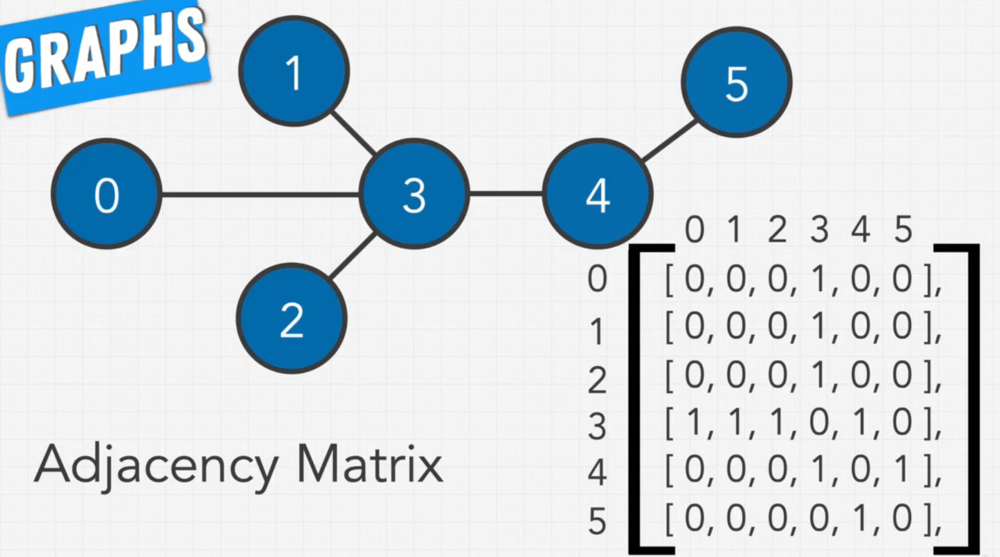
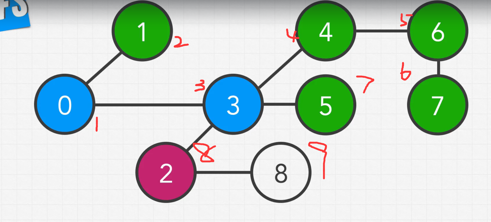

## 基础定义


### Undirected Graph

Graph通常由node（vertex）和edge组成，不同于Tree，Graph可以组成环（cycle），并且每个node可以与任意数量的其他node连接




### Directed Graph

如图所示称为一个Undirected Graph，在这个Graph中node能抵达所有连接的node，并从这些node返回（Traverse back），因为边是undirected



在另一种图中（即Directed Graph），节点可以沿着arrow的方向traverse，但是并不能traverse back。*需要注意的是，directed graph也会拥有双向的arrow，此时这个连接并不能限制traverse back*


### Weighted Graph

在以上两种的情况下，为edge添加weight，即可称为Directed/Undirected weighted Graph




### Unconnected Graph

另外还存在一种情况，就是所有的node并不是互相可达的，他们实际上被分成了几块graph，这也就是unconnected graph




## Graph的表现形式

### Adjacency list

常用于node更多的稀疏图




### Adjacency Matrix

常用于edge更多的稠密图




## 遍历图的方式

### Breadth First Search

略

通常来说，使用一个queue来维护接下来可能访问的节点，通过当前节点的neighbor为queue添加后序访问节点，需要注意的是已访问节点不应该添加入queue

因此，需要维护的只有一个queue和一个vector visited

```c++
void bfs(const std::vector<std::vector<int>> & adjacency_list, int begin_node){
    std::queue<int> q{begin_node};
    std::vector<int> visited(adjacency_list.size(),0);
    visited[current_node] = 1;
    
    while(!q.empty())
    {
        int current_node = q.front();
        q.pop();
        std::for_each(adjacency_list[current_node].begin(), adjacency_list[current_node].end(),[&](int a){
        if(!visited[a]){
            q.push(a);
            visited[a] = 1;
        }});
    }
}
```


### Depth First Search

略



相比于BFS，DFS就要简单许多了，简单的来说就是选中一个neighbor之后，以neighbor为主再访问其neighbor，直到没有neighbor为止，换句话说，深度就体现在这个顺序（不是遍历一个节点的所有neighbor，而是以某个neighbor为跳板往下遍历），因此DFS通常使用recursive遍历，或者使用stack

推荐使用recursive，因为stack通常需要将`vector<vector<int>>`转换为`vector<queue<int>>`来避免对已访问节点的重复修改，（大概就像下面这样）

> ```c++
> void dfs(const std::vector<std::vector<int>> & adjacency_list, int begin_node){
>     std::stack<int> stk{begin_node};
>     std::vector<int> visited(adjacency_list, 0);
>     std::vector<std::queue<int>> adj_ls;
>     for_each(adjacency_list.begin(),adjacency_list.end(),[](){
>         
>     });
>     visited[begin_node] = 1;
>     
>     while(!stk.empty()){
>     	// 每次stk.top对应的adj_ls为空就pop出去
>     }
> }
> ```


```c++
void dfs(const std::vector<std::vector<int>>& adjacency_list, std::vector<int>& isvisited, int current_node) {

    std::cout << current_node << " ";

    isvisited[current_node] = 1;

    for (int neighbor : adjacency_list[current_node]) {
        if (!isvisited[neighbor]) {
            dfs(adjacency_list, isvisited, neighbor);
        }
    }
}
```

