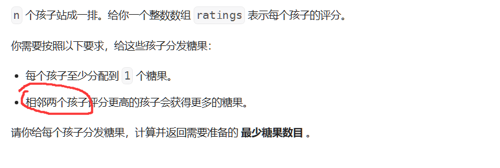

## 回溯算法

### 17.电话号码的字母组合

[17. 电话号码的字母组合 - 力扣（LeetCode）](https://leetcode.cn/problems/letter-combinations-of-a-phone-number/description/)

```c++
class Solution {
    vector<string> ans;
    vector<string> table{"","","abc","def","ghi","jkl","mno","pqrs","tuv","wxyz"};
    string path;
    void dfs(int curpos, string &digits){

        if(curpos >= digits.size()){
            ans.push_back(path);
            return;
        }
        int curNumber = digits[curpos]-'0';
        if(curNumber == 0 || curNumber == 1){
            dfs(curpos+1,digits);
            return;
        }
        for(auto c : table[curNumber]){
            path.push_back(c);
            dfs(curpos+1,digits);
            path.pop_back();
        }
        return;
    }
public:
    vector<string> letterCombinations(string digits) {
        if(digits.empty()) return {};
        dfs(0,digits);
        return ans;
    }
};
```


### 51. N 皇后

[51. N 皇后 - 力扣（LeetCode）](https://leetcode.cn/problems/n-queens/description/)

就是对一个N*N的网格，所有的皇后位置不能影响其同一行，同一列，和两个斜对角的位置

```c++
class Solution {
    vector<int> col;//col[i]=j 代表第i列被第j行占用
    unordered_set<int> leftup;//col-row
    unordered_set<int> rightup;// col + row
    vector<vector<string>> ans;
    bool check(int row,int col){
        if(leftup.find(col - row) == leftup.end()
        &&
        rightup.find(col + row) == rightup.end()){
            return true;
        }
        return false;
    }
    void print(vector<int>& nums){
        vector<string> s(nums.size(),string(nums.size(),'.'));
        for(int i = 0;i < nums.size();i++){
            s[nums[i]][i] = 'Q';
        }
        ans.push_back(s);
    }
    void find(int row, int n){
        
        if(row == n){
            print(col);
            return;
        }
        for(int i = 0;i < n;i++){
            if(col[i] != -1 || !check(row,i)){
                continue;
            }
            col[i] = row;
            leftup.insert(i-row);
            rightup.insert(i+row);
            find(row+1,n);
            leftup.erase(i-row);
            rightup.erase(i+row);
            col[i] = -1;
        }
        return;

    }
public:
    vector<vector<string>> solveNQueens(int n) {
        col = vector<int>(n,-1);
        find(0,n);
        return ans;
    }
};
```


### 真题

题目描述：

给你一个整数 M 和数组 N,N 中的元素为连续整数，要求根据 N 中的元素组装成新的数组 R，

组装规则：

1. R 中元素总和加起来等于 M
2. R 中的元素可以从 N 中重复选取 
3. R 中的元素最多只能有 1 个不在 N 中，且比 N 中的数字都要小（不能为负数）

请输出：数组 R 一共有多少组装办法 


输入描述：第一行输入是连续数组 N，采用空格分隔，第二行输入数字 M 

输出描述：输出的是组装办法数量，int 类型 补充说明：1 <= N.length <= 30，1 <= N.length <= 1000


**N的大小只有30个，直接回溯**

尝试将N中的元素加入path

每次有这么几个操作：将当前位置的元素加入若干个，或者直接使用一个新的元素，这个元素应该小于N中的数字。


## 贪心算法

### 135.分发糖果

[135. 分发糖果 - 力扣（LeetCode）](https://leetcode.cn/problems/candy/description/)



相邻保证了局部最优就是全局最优

只要想一下就可以发现，这里会让我们回头修改之前的要素就是递减的序列。

递减序列的开头必定受到结尾的影响，同时也受到其上一个元素的影响。

递减序列的结尾不受任何影响，一般直接设置为1。

``` c++
class Solution {
    void print(vector<int> a){
        for(auto i:a){
            cout << i << " ";
        }
        cout << endl;
    }
public:
    int candy(vector<int>& ratings) {

        int begin = 0;
        vector<int> ans(ratings.size(),0);
        for(int i = 1;i <= ratings.size();i++){
            // 分数相同的reward不需要相同
            if(i < ratings.size() && ratings[i] < ratings[i-1]){
                continue;
            }

            assert(i == ratings.size() || ratings[i] >= ratings[i-1]);
            // 回头去构建此递减序列的约束
            ans[i-1] = 1;
            for(int j = i-2;j >= begin;j--){
                if(ratings[j] == ratings[j+1]){
                    ans[j] = ans[j+1];
                }else{
                    assert(ratings[j] > ratings[j+1]);
                    ans[j] = ans[j+1]+1;
                }
            }
            // 这个递减序列的开头满足了递减序列的约束之后需要额外判断与上一个元素的约束
            if(begin - 1 >= 0){
                // 1 0 2
                if(ratings[begin-1] < ratings[begin]){
                    ans[begin] = max(ans[begin-1]+1,ans[begin]);
                }
            }
            begin = i;
        }

        //print(ans);
        return accumulate(ans.begin(),ans.end(),0);
        
    }
};
```


### 11.盛最多水的容器

[11. 盛最多水的容器 - 力扣（LeetCode）](https://leetcode.cn/problems/container-with-most-water/)

这里需要推导出来贪心的方法（双指针）


具体来说，对于区间`[i,j]`

其容量为`min(height[i],height[j]) * (j-i)`

首先，每次缩小区间，`j-i`一定变小

因此，我们必须移动`height`较小的一个指针，因为它限制了上限。

如果我们移动了height较大的指针，那么

* 新的height更大，这没用，因为容量区间受限于较小的height
* 新的height更小，会使得容量更小


```c++
class Solution {
public:
    int maxArea(vector<int>& height) {
        int begin = 0;
        int end = height.size()-1;
        int mx = 0;
        while(begin < end){
            int contain = min(height[begin],height[end]) * (end-begin);
            if(contain > mx){
                mx = contain;
            }

            if(height[begin] < height[end]){
                begin++;
            }else{
                end--;
            }
        }
        return mx;
    }
};
```


### 真题

题目描述：

给定一组数字，表示扑克牌的牌面数字，忽略扑克牌的花色，请按如下规则对这一组扑克牌进行整理：

步骤 

1、对扑克牌进行分组，形成组合牌，规则如下：

当牌面数字相同张数大于等于 4 时，组合牌为“炸弹”；

3 张相同牌面数字 + 2 张相同牌面数字，且 3 张牌与 2 张牌不相同时，组合牌为“葫芦”；

3 张相同牌面数字，组合牌为“三张”；

2 张相同牌面数字，组合牌为“对子”；

剩余没有相同的牌，则为“单张”；

步骤 2、对上述组合牌进行由大到小排列，规则如下：

不同类型组合牌之间由大到小排列规则：“炸弹” > "葫芦" > "三张" > "对子" > “单张”；

相同类型组合牌之间，除“葫芦”外，按组合牌全部牌面数字加总由大到小排列；

“葫芦”则先按 3 张相同牌面数字加总由大到小排列，3 张相同牌面数字加总相同时，再按另

外 2 张牌面数字加总由大到小排列；

由于“葫芦”>“三张”，因此如果能形成更大的组合牌，也可以将“三张”拆分为 2 张和 1

张，其中的 2 张可以和其它“三张”重新组合成“葫芦”，剩下的 1 张为“单张”

步骤 3、当存在多个可能组合方案时，按如下规则排序取最大的一个组合方案：

依次对组合方案中的组合牌进行大小比较，规则同上；

当组合方案 A 中的第 n 个组合牌大于组合方案 B 中的第 n 个组合牌时，组合方案 A 大于组合方

案 B；

==具体指的是：当我们有多个可能的组合方案时，**依次比较它们对应的组合牌**，一旦在某一个组合牌上方案 A 的牌大于方案 B 的牌，就可以确定方案 A 更大，不需要继续比较后续的牌。==

输入描述：

第一行为空格分隔的 N 个正整数，每个整数取值范围[1,13]，N 的取值范围[1,1000]

输出描述：

经重新排列后的扑克牌数字列表，每个数字以空格分隔


直接按照牌面优先级做就好了，没什么好说的


## 优先队列

### 关键点：

- **`Compare` 函数**：在 `priority_queue` 中，`Compare` 用来定义两个元素的顺序。如果 `Compare(a, b)` 返回 `true`，表示 `a` 的优先级低于 `b`，即 `a` 在 `b` 之前（根据弱排序，`a` 被认为小于 `b`）。
- **最大堆**：`priority_queue` 默认是最大堆，这意味着**优先级高的元素（较大元素）会首先被取出**。

但是，由于 `priority_queue` 的输出顺序和 `Compare` 的逻辑相反，实际上 `Compare` 中认为**排在前面的元素**会**排在队列的后面**，而**排在后面的元素（优先级高的）会先输出**。


==换句话说，compare(a,b)正常来说，返回true代表a排在b前面。可以看作一个queue，First in first out==

==而对于priority queue，compare(a,b)如果返回true，a仍然排在b前面，但是可以看作一个stack，last in first out==


### 215. 数组中第K个最大元素


```c++
class Solution {
public:
    int findKthLargest(vector<int>& nums, int k) {
        struct comp{
			// a越大越最后被弹出
            bool operator()(int a,int b){
                return a > b;
            }
        };
        priority_queue<int,vector<int>,comp> pq;
        for(auto i:nums){
            if(pq.size() < k){
                pq.push(i);
            }else{
                if(i > pq.top()){
                    pq.pop();
                    pq.push(i);
                }
            }
        }
        cout << pq.size() << endl;
        return pq.top();
    }
};
```


## 栈

### 真题

题目描述：

现需要实现一种算法，能将一组压缩字符串还原成原始字符串，还原规则如下：

1、字符后面加数字 N，表示重复字符 N 次。例如：压缩内容为 A3，表示原始字符串为 AAA。

2、花括号中的字符串加数字 N，表示花括号中的字符串重复 N 次。例如：压缩内容为{AB}3，

表示原始字符串为 ABABAB。

3、字符加 N 和花括号后面加 N，支持任意的嵌套，包括互相嵌套。例如：压缩内容可以

{A3B1{C}3}3。


**输入描述：**

输入一行压缩后的字符串

**输出描述：**

输出压缩前的字符串

**补充说明：**

输入保证，数字不会为 0，花括号中的内容不会为空，保证输入的都是合法有效的压缩字符串

输入输出字符串区分大小写

输入的字符串长度为范围[1, 10000]

输出的字符串长度为范围[1, 100000]

数字 N 范围[1, 10000]


