单纯的记录一下，无详细解释

## 0. ACM输入输出

#### `cin/cout`

基础的大伙都知道了，cin就是对`istream`不同input type的流重载，并且返回带引用的`istream`以方便链式传导，我们说点实用的

* `cin`通常**不识别空格**
* `cin`实现时设置了两个标志位，`eofbit`和`failbit`
  * `cin`如果遇到某一段输入与目标类型不匹配，则会设置`failbit`
  * `cin`如果遇到`End Of File`则会设置`eofbit`
  * 当使用`while(cin>>a)`时，只要存在`eofbit`或者`failbit`被设置，则循环退出，也就是`while(!eofbit || !failbit)`
  * 当使用 `cin >> c` 读取字符时，默认情况下，`cin` 会**跳过所有的空白字符（包括空格、制表符和换行符），并读取下一个非空白字符。**因此，`cin >> c` 不会读取空格字符。

cout没什么好说的，可以额外使用流操作符输出

**小数点位数**

```c++
#include <iostream>
#include <iomanip> // 包含操纵符头文件
using namespace std;

int main() {
    double pi = 3.14159;
    cout << fixed << setprecision(2) << pi << endl; // 保留2位小数，结果为 "3.14"
    return 0;
}

```

**输出宽度**

```c++
#include <iostream>
#include <iomanip> // 包含操纵符头文件
using namespace std;

int main() {
    int n = 42;
    cout << setw(5) << n << endl;  // 输出宽度为5，右对齐，结果为 "   42"
    cout << left << setw(5) << n << endl; // 输出宽度为5，左对齐，结果为 "42   "
    return 0;
}

```


#### `scanf/printf`

`scanf`是cin的鼻祖，因此自然做法相同

对于

```c++
int a,b;
scanf("%d %d", &a, &b);
// scanf返回成功赋值个数
// 输入{1 2} a b分别被赋值1 2
// 输入{1,} a被赋值1，设置fail状态，b不会被赋值，scanf返回1
// 输入{1 ,} 同上
// 输入{1     2} 包含多个空格，scanf自动忽略空格，制表，换行，因此a b被成功赋值，scanf返回2
// 输入{1 a} scanf读取1，a会使得fail状态被设置，scanf返回1
```

```c++
while ((n = scanf("%d", &x)) != EOF && n != 0) {
    // 读取到非EOF且读取到了
}
```


这个只需要记得几点

| 类型                             | 说明符 |
| -------------------------------- | ------ |
| 整数Integer                      | ` %d`  |
| 无符号整数Unsigned Integer       | `%u`   |
| 浮点数float                      | `%f`   |
| 双精度double                     | `%lf`  |
| 字符char                         | `%c`   |
| 字符串（直到遇到空白字符）string | `%s`   |

额外的，

```c++
printf("%5d\n", 42);   // 输出宽度为5的整数，右对齐，结果为 "   42"
printf("%-5d\n", 42);  // 输出宽度为5的整数，左对齐，结果为 "42   "
printf("%.2f\n", 3.14159); // 保留2位小数，结果为 "3.14"
// 如果同时指定输出宽度和小数个数，那么冲突时以小数个数为标准
```


#### `getline/getchar`

`cin` 和 `scanf` 在处理空白字符（如空格、换行符、制表符）时，通常会跳过这些字符，导致在某些场景下不方便处理。因此，`getchar` 和 `getline` 通常会作为补充，用于读取空白字符和整行输入。

**`getchar`**

`getchar` 用于读取单个字符，包括空白字符。它不会跳过任何输入，因此非常适合读取逐字符输入，包括空白字符。.

* 成功读取字符，返回该字符ASCII值
* 读到EOF，返回特殊值EOF(-1)

通常使用为

```c++
int ch;
while((ch = getchar()) != EOF){
    
}
```

`getchar()`可以读取换行符


**`getline()`**

`getline` 用于读取整行输入，包括空白字符。它会一直读取，直到遇到换行符（`'\n'`）或文件末尾（EOF）。

getline返回读取的字符数（包括换行符），不包括终止符`\0`

如果读到EOF返回-1。

```c++
#include <stdio.h>
#include <stdlib.h>

char *line = NULL;
// 分配给line缓冲区的字节数（包括终止空字符)
size_t len = 0;
//ssize_t为getline返回值，表示成功读取的字符数，包括换行符，但不包括终止的空字符（null terminator）。
ssize_t read; 
while ((read = getline(&line, &len, stdin)) != -1) {
        printf("Retrieved line of length %zd:\n", read);
        printf("%s", line);
    }
```

`getline()`因为能够读取到换行符，通常需要额外做处理

```c++
#include <stdio.h>
#include <stdlib.h>

char *line = NULL;
size_t len = 0;
ssize_t read;
while ((read = getline(&line, &len, stdin)) != -1) {
        // 检查是否有换行符，并将其替换为字符串结束符
        if (line[read - 1] == '\n') {
            line[read - 1] = '\0';
        }
        
        // 输出处理后的行
        printf("Processed line: %s\n", line);
    }
```


#### 新一代`getline/getchar`

上面的太过冗余，c++提供了getline和getchar与流的交互

注意，在使用过cin之后，通常需要使用`cin.ignore()`来清空缓存区，这是因为cin通常不会读取`\n`（或者说需要读取下一个时会自动跳过），因此如果你先`cin`了，应该防止`getchar`或者`getline`读取这个`\n`

##### `cin`与`getchar`

不是那么有用的组合，我只能想到你需要这个字符的ascii值

```c++
#include <iostream>
#include <string>
using namespace std;

int main() {
    int a;
    string line;

    // 使用 cin 读取整数
    cout << "Enter an integer: ";
    cin >> a;
    cout << "You entered: " << a << endl;

    // 使用 getline 读取整行字符串
    cout << "Enter a line of text: ";
    cin.ignore(); // 清除输入缓冲区中的换行符
    getline(cin, line);
    cout << "You entered: " << line << endl;

    return 0;
}

```


##### `cin`与`getline`

这个就有意思了

==注意，`cin`不会读取换行符，它会被从输入流中提取并丢弃，因此不用额外处理==

```c++
#include <iostream>
#include <string>
using namespace std;

int main() {
    int a;
    string line;

    // 使用 cin 读取整数
    cout << "Enter an integer: ";
    cin >> a;
    cout << "You entered: " << a << endl;

    // 使用 getline 读取整行字符串
    cout << "Enter a line of text: ";
    cin.ignore(); // 清除输入缓冲区中的换行符
    getline(cin, line);
    cout << "You entered: " << line << endl;

    return 0;
}

```


#### 一些常见的输入处理

##### 靠EOF终止

通常来说，输入长成

```txt
1 2 3
2 3 4
3 4 5
EOF
```

使用

```c++
int a, b, c;
while(cin >> a >> b >> c);//eofbit会使得其退出循环
```

或者

```c++
```


##### 强迫读取整行

[7. 平均绩点 (kamacoder.com)](https://kamacoder.com/problempage.php?pid=1006)

这里，你虽然可以通过cin读取所有非空格的字符，但是你不知道换行符在哪里

因此需要使用getline和cin组合

```c++
#include<iostream>
#include<string>

int main(){
    string s;
    while(getline(cin, s)){
        for(auto &c:s){
            
        }
    }
}
```


##### 有规律的字符和整数混合读取

这个倒是简单了，因为有规律（通常指的是能够人为通过输入确定，而不需要通过换行符确定每个request）

直接使用cin即可

> [13. 镂空三角形 (kamacoder.com)](https://kamacoder.com/problempage.php?pid=1012)

```c++
int main(){
    char c;
    int n;
    while(cin >> c){
        if(c == '@'){
            break;
        }
        cin >> n;
    }
}
```


##### 所有使用空格隔开的数据读取

包括字符串，字符，数字

都直接使用cin

[14. 句子缩写 (kamacoder.com)](https://kamacoder.com/problempage.php?pid=1013)

```c++
#include<iostream>
#include<string>
using namespace std;

int main(){
    int n;
    cin >> n;
    cin.ignore();//注意这里很容易错
    while(n--)
    {
        string s;
        getline(cin,s);
        
        string res = "";
        int flag = 0;
        for(auto &c : s){
            if(c == ' '){
                flag = 0;
            }
            else{
                
                if(!flag)
                    res += toupper(c);
                flag = 1;
            }
        }
        cout << res << endl;
    }
}
```


#### 常用的功能函数

##### 数字与字符转换

在C中

`stdio.h``stdlib.h`

**ASCII to Integer **

```c++
char str[] = "12345";
int num = atoi(str);
```

**ASCII to long**

```c++
char str[] = "1234567890";
long num = atol(str);
```

**ASCII to Float**

```c++
char str[] = "123.45";
float num = atof(str);
```


在C++中

`#include<iostream>`

`#include<string>`

**String to Integer**

```c++
string str = "12345";
int num = stoi(str);
```


**string to long**

```c++
string str = "1234567890";
long num = stol(str);
```


**String to float**

```c++
string str = "123.45";
float num = stof(str);
```


##### 大小写转换

C中`ctype.h`只能修改单个字符

**toupper**

```c++
void to_uppercase(char *str) {
    while (*str) {
        *str = toupper(*str);
        str++;
    }
}
```

**tolower**

```c
void to_lowercase(char *str) {
    while (*str) {
        *str = tolower(*str);
        str++;
    }
}
```


C++的`cctype`，同理只能单个字符

```c++
void to_uppercase(std::string &str) {
    for (char &c : str) {
        c = toupper(c);
    }
}
void to_lowercase(std::string &str) {
    for (char &c : str) {
        c = tolower(c);
    }
}

```

但是实际上string提供了类似的功能，通过算法库的transform

```c++
std::string str = "Hello, World!";
std::transform(str.begin(), str.end(), str.begin(), ::toupper);

std::transform(str.begin(), str.end(), str.begin(), ::tolower);
```


#### 总结

* cin不读换行和空格制表符，适用于大多情况
* getline能读取`\n`，和cin搭配虽然读取不了`\n`但是能够整行读取分析


合理利用`cin`和`getline`和`cin.ignore()`能够解决我见过的100%的ACM输入输出问题，虽然有些不是最搞笑的。


## 1. 二分查找

此处我采用左闭右开的写法

#### 704.二分查找(简单)

```c++
class Solution {

public:
    int search(vector<int>& nums, int target) {
        int begin = 0;
        int end = nums.size();


        while(begin < end){
            int middle = (begin+end)/2;
            if(nums[middle] < target){
                begin = middle + 1;
            }else if(nums[middle] > target){
                end = middle;
            }else{
                return middle;
            }
        }

        return -1;


    }
};
```


#### 35. 搜索插入位置(简单)

懒得写了，直接用库

需要注意序列要求排序且非降序

```c++
class Solution {
public:
    int searchInsert(vector<int>& nums, int target) {
        auto it = std::lower_bound(nums.begin(),nums.end(), target);
        return std::distance(nums.begin(), it);
        
        
    }
};
```


#### 34.在排序数组中查找元素的第一个和最后一个位置（中等）

两次二分

```c++
class Solution {
public:
    vector<int> searchRange(vector<int>& nums, int target) {
        auto itbegin = std::lower_bound(nums.begin(),nums.end(),target);
        auto itend = std::upper_bound(nums.begin(),nums.end(),target);

        if(itbegin == nums.end() || *itbegin != target) return {-1,-1};
        return {(int)std::distance(nums.begin(),itbegin),(int)std::distance(nums.begin(),itend)-1};
    }
};
```


#### 69. x的平方根(简单)

需要注意的是最后得到的数如果平方大于x那么需要减1.

最好使用begin

```c++
class Solution {
public:
    int mySqrt(int x) {
        long long begin = 0;
        long long end = x;
        long long mid=0;
        while(begin < end){
            mid = (begin + end) / 2;
            if(mid* mid > x){
                end = mid;
            }else if(mid * mid < x){
                begin = mid + 1;
            }else{
                return mid;
            }
        }

        return (int)(begin*begin > x ? begin-1:begin);
    }
};
```


#### 367. 有效的完全平方数

```c++
class Solution {
public:
    bool isPerfectSquare(int num) {
        if(num==1) return true;
        long begin = 0;
        long end = num;

        long mid = 0;
        while(begin < end){
            mid = (begin+end)/2;

            if(mid * mid > num){
                end = mid;
            }else if(mid * mid < num){
                begin = mid + 1;
            }else{
                return true;
            }
        }
        return false;
    }
};
```


## 2. 双指针

#### 27.移除元素(简单)

双指针，只需要注意最后的临界情况即可

```c++
class Solution {
public:
    int removeElement(vector<int>& nums, int val) {
        if(nums.empty()) return 0;
        int front = 0;
        int back = nums.size()-1;
        while(front < back){
            if(nums[front] == val){
                std::swap(nums[front], nums[back]);
                back--;
            }else{
                front++;
            }
        }

        // 两种情况，
        // front和back同时指向最后一个非value
        // front和back同时指向第一个value
        if(nums[front] == val) return front;
        else return front+1;
    }
};
```


#### 26. 删除有序数组中的重复项(简单)

快慢指针，

这里发现，是删除，最好不要使用交换，删除意味着可以直接覆盖，因为要保持删除后元素的相对顺序

因此使用快慢指针，**题目已排序**，快指针寻找新元素，慢指针填充元素

```c++
class Solution {
public:
    int removeDuplicates(vector<int>& nums) {
        // 快慢指针
        int slow = 0;
        int fast = 1;

        for(;fast<nums.size();fast++){
            if(nums[slow] != nums[fast]){
                if(fast-slow > 1){
                    nums[++slow] = nums[fast];
                }else{
                    slow++;
                }
            }
        }

        return slow+1;

    }
};
```


#### 283. 移动零

边界条件数清楚即可，方法一较慢，方法二较快

```c++
class Solution {
public:
    void moveZeroes(vector<int>& nums) {
        //方法一：快慢指针使用swap，快指针寻找第一个非0，慢指针寻找第一个0
        
        int slow = -1;
        for(slow = 0; slow < nums.size();slow++){
            if(nums[slow] == 0){
                break;
            }
        }

        if(slow == nums.size()) return;


        int fast = slow + 1;
        // 上面的预处理保证了slow不会比fast快，因为每次交换都是代表fast前一定有0
        for(;fast < nums.size();fast++){
            if(nums[fast] != 0){
                std::swap(nums[slow],nums[fast]);
                while(nums[slow]){
                    slow++;
                }
            }
        }

        


        // 第二个方法
        // 慢指针逐个递增,指向被覆盖的地方
        // 快指针逐个指向需要被移动到前面的数
        // 完成后将剩余的赋值0
        // 需要注意nums[0]==0的情况
        int slow = 0;
        int fast = 1;
        // 处理开头
        if(nums[slow] == 0){
            while(fast < nums.size() && !nums[fast]){
                fast++;
            }
            // for situation [0]
            if(fast < nums.size())
            {
                nums[slow] = nums[fast];
            }
            else return;
            slow++;
            fast++;
        }else{
            slow++;
        }
        //主体
        for(;fast < nums.size();fast++){
            if(nums[fast]){
                nums[slow++] = nums[fast];
            }
        }

        for(;slow < nums.size();slow++){
            nums[slow] = 0;
        }


        
    }
};
```


#### 844. 比较含退格的字符串

一个方法是模拟（使用栈，或者使用双指针模拟栈）

另一个方法O(1)O(n)是从后往前步进

```c++
class Solution {
public:
    bool backspaceCompare(string s, string t) {
        // 除了模拟，可以使用双指针来达成O(1)空间复杂度，即为在s和t上构造最终的字符串（类似于前面的删除题

        // 考虑到删除的特性（删除仅对其之前的起作用），因此倒序遍历可以让我们达成类似从最终字符串尾部开始比较的效果，使得时间复杂度为O(max(s,t))


        int cur_s = s.size()-1;
        int cur_t = t.size()-1;
        int skip_s = 0;
        int skip_t = 0;

        while(cur_s >= 0 || cur_t >= 0){
            // a loop is a jump

            while(cur_s >= 0 && (s[cur_s] == '#' || skip_s))
            {
                if(s[cur_s] == '#'){
                    skip_s++;
                }else{
                    skip_s--;
                }
                cur_s--;
            }

            while(cur_t >= 0 && (t[cur_t] == '#' || skip_t))
            {
                if(t[cur_t] == '#'){
                    skip_t++;
                }else{
                    skip_t--;
                }
                cur_t--;
            }
            
            // now cur pos stand for a comparison pos
            if(cur_s >= 0 && cur_t >= 0) {
                if(s[cur_s] != t[cur_t]) return false;
            }else if(cur_s < 0 && cur_t < 0){
                return true;
            }else
                return false;

            cur_t--;
            cur_s--;

        }

        return true;
        
    }
};
```


#### 977. 有序数组的平方

方法一：平方后排序

方法二：利用其有序性，找到正负分界线双指针填入

```c++
class Solution {
public:
    vector<int> sortedSquares(vector<int>& nums) {

        vector<int> ans(nums.size());


        auto it = std::lower_bound(nums.begin(), nums.end(),0);

        int positive = std::distance(nums.begin(), it);
        int negative = positive-1;
        int cur = 0;
        while(positive < nums.size() && negative >= 0){
            if(abs(nums[positive]) > abs(nums[negative])){
                ans[cur++] = nums[negative] * nums[negative];
                negative--;
            }else{
                ans[cur++] = nums[positive] * nums[positive];
                positive++;
            }
        }

        while(positive < nums.size()){
            ans[cur++] = nums[positive]*nums[positive];
            positive++;
        }
        while(negative >= 0){
            ans[cur++] = nums[negative]*nums[negative];
            negative--;
        }

        return ans;


    }
};
```


## 3. 滑动窗口

我觉得滑动窗口叫蜗牛算法或者史莱姆算法更贴切啊（笑）

一般使用双指针来做，end先走一步，然后begin指针开始收缩直到某个条件

#### 209. 长度最小子数组（中等）

每一轮迭代，将 nums[end] 加到 sum，如果 sum≥s，则更新子数组的最小长度（此时子数组的长度是 end−start+1），然后将 nums[start] 从 sum 中减去并将 start 右移，直到 sum<s，在此过程中同样更新子数组的最小长度。在每一轮迭代的最后，将 end 右移。


```c++
class Solution {
public:
    int minSubArrayLen(int target, vector<int>& nums) {
        if(nums.size() ==1){
            return nums[0] > target ? 1 : 0;
        }
        int sum = 0;

        int begin = 0;
        int end = 1;
        sum += nums[0];
        int minLen = INT_MAX;
        while(end < nums.size()){
            
            while(end < nums.size() && sum < target){
                sum += nums[end++];
            }
            while(sum >= target)
            {
                minLen = (end-begin < minLen) ? (end-begin) : minLen;
                sum -= nums[begin++];
            }
        }
        if(begin == 0 && end == nums.size()) return 0;


        return minLen;
    }
};
```


官方写法更优雅

```c++
class Solution {
public:
    int minSubArrayLen(int s, vector<int>& nums) {
        int n = nums.size();
        if (n == 0) {
            return 0;
        }
        int ans = INT_MAX;
        int start = 0, end = 0;
        int sum = 0;
        while (end < n) {
            sum += nums[end];
            while (sum >= s) {
                ans = min(ans, end - start + 1);
                sum -= nums[start];
                start++;
            }
            end++;
        }
        return ans == INT_MAX ? 0 : ans;
    }
};


```


#### 904. 水果成篮（中等）

类滑动窗口，维护窗口内类型数量

```c++
class Solution {
public:
    int totalFruit(vector<int>& fruits) {
        // 这里因为需要“连续选取”的特性，因此仍然可以使用滑动窗口
        // 滑动窗口维护了目前窗口内的类型个数，具体来说使用一个hashmap来维护
        // 类型个数多于2则xxx，小于2则xxxx
        int begin = 0;
        int end = 0;
        int cnt = 0;
        map<int,int> mp;
        int maxLen = 0;
        while(end < fruits.size()){
            // push
            if(mp.find(fruits[end]) == mp.end()){
                mp[fruits[end]] = 1;
                cnt++;
            }else{
                mp[fruits[end]]++;
            }

            while(cnt > 2){
                mp[fruits[begin]]--;
                if(mp[fruits[begin]] == 0){
                    cnt--;
                    mp.erase(fruits[begin]);
                }
                begin++;
            }

            if(end - begin + 1 > maxLen){
                maxLen = end - begin + 1;
            }
            end++;
        }
        return maxLen;
    }
};
```


#### 76. 最小覆盖子串（困难）

一遍过哥们

就是一个滑动窗口，不过维护的又变了，变成了两个字符串用哈希表统计的元素是否符合条件

做了一个优化，就是当收缩`begin`指针的时候，根据当前移除的char直接O(1)判断是否会改变availability

但是在推进end的时候，做了s.size()次的比较，对于类似

`s=DEFGHIJKLMNOPQRSTABC`，`t=ABC`的情况很不友好，意味着比较`s.size()*t.size()`次，这个暂时没想法


不过没超时就是好事

```c++
class Solution {
    bool check(map<char,int>& target, map<char,int>& cur){
        for(auto& p:target){
            if(cur.find(p.first) == cur.end()){
                return false;
            }else{
                if(cur[p.first] < p.second){
                    return false;
                }
            }
        }
        return true;
    }
public:
    string minWindow(string s, string t) {
        map<char, int> mps;
        map<char, int> mpt;

        for(char& c:t){
            if(mpt.find(c) == mpt.end()){
                mpt[c] = 1;
            }else{
                mpt[c]++;
            }
        }


        int begin = 0;
        int end = 0;

        int minLen = INT_MAX;
        int ans_begin = -1;
        while(end < s.size()){
            // push
            if(mps.find(s[end]) == mps.end()){
                mps[s[end]] = 1;
            }else{
                mps[s[end]]++;
            }

            bool old_available = check(mpt,mps);
            // check & shorten
            bool is_available = old_available;
            while(is_available){
                mps[s[begin]]--;
                if( mpt.find(s[begin]) != mpt.end() && 
                    mps[s[begin]] < mpt[s[begin]]){
                        is_available = false;
                    }
                begin++;
            }
			// 如果之前判断是符合的，并且保证了while之后是不符合的，那么一定是上一个begin纳入集合会符合
            if(old_available){
                int length = end - (begin - 1) + 1;
                if(length < minLen){
                    minLen = length;
                    ans_begin = begin-1;
                }
            }
            end++;
        }

        if(ans_begin < 0){
            return "";
        }else{
            return s.substr(ans_begin, minLen);
        }
        
    }
};
```


## 4.模拟题

### 59. 螺旋矩阵II

简单模拟题，递归每次固定操作即可

```c++
class Solution {
    void fill(vector<vector<int>>& ans, int r,int c,int cur,int n){

        if(cur > n*n){return;}

        while(c < n && !ans[r][c]){
            ans[r][c] = cur++;
            c++;
        }
        c--;r++;
        while(r < n && !ans[r][c]){
            ans[r][c] = cur++;
            r++;
        }
        r--;c--;
        while(c >= 0 && !ans[r][c]){
            ans[r][c] = cur++;
            c--;
        }
        c++;r--;
        while(r >= 0 && !ans[r][c]){
            ans[r][c] = cur++;
            r--;
        }
        r++;c++;

        fill(ans,r,c,cur,n);
        return;
    }
public:
    vector<vector<int>> generateMatrix(int n) {
        vector<vector<int>> ans(n,vector<int>(n,0));

        fill(ans,0,0,1, n);
        return ans;
    }
};
```


### 54. 螺旋矩阵

同理，添加一个visited矩阵即可。

```c++
class Solution {
    void solve(vector<int>& ans, vector<vector<int>>& visited, vector<vector<int>>& matrix, int cur, int r, int c){
        int m = matrix.size();
        int n = matrix[0].size();
        if(cur >= n*m) return;
        while(c < n && !visited[r][c]){
            ans[cur++] = matrix[r][c];
            visited[r][c] = 1;
            c++;
        }
        c--;r++;
        while(r < m && !visited[r][c]){
            ans[cur++] = matrix[r][c];
            visited[r][c] = 1;
            r++;
        }
        r--;c--;
        while(c >= 0 && !visited[r][c]){
            ans[cur++] = matrix[r][c];
            visited[r][c] = 1;
            c--;
        }
        c++;r--;
        while(r >= 0 && !visited[r][c]){
            ans[cur++] = matrix[r][c];
            visited[r][c] = 1;
            r--;
        }
        r++;c++;
        solve(ans,visited,matrix,cur,r,c);
        return;
    }
public:
    vector<int> spiralOrder(vector<vector<int>>& matrix) {
        vector<int> ans(matrix.size()*matrix[0].size());
        vector<vector<int>> visited(matrix.size(),vector<int>(matrix[0].size(),0));

        solve(ans, visited, matrix,0, 0, 0);
        return ans;
    }
};
```


### LCR146. 螺旋遍历二维数组

同上

```c++
class Solution {
    void solve(vector<int>& ans, vector<vector<int>>& visited, vector<vector<int>>& matrix, int cur, int r, int c){
        int m = matrix.size();
        int n = matrix[0].size();
        if(cur >= n*m) return;
        while(c < n && !visited[r][c]){
            ans[cur++] = matrix[r][c];
            visited[r][c] = 1;
            c++;
        }
        c--;r++;
        while(r < m && !visited[r][c]){
            ans[cur++] = matrix[r][c];
            visited[r][c] = 1;
            r++;
        }
        r--;c--;
        while(c >= 0 && !visited[r][c]){
            ans[cur++] = matrix[r][c];
            visited[r][c] = 1;
            c--;
        }
        c++;r--;
        while(r >= 0 && !visited[r][c]){
            ans[cur++] = matrix[r][c];
            visited[r][c] = 1;
            r--;
        }
        r++;c++;
        solve(ans,visited,matrix,cur,r,c);
        return;
    }
public:
    vector<int> spiralArray(vector<vector<int>>& matrix) {
        if(matrix.empty()) return {};
        vector<int> ans(matrix.size()*matrix[0].size());
        vector<vector<int>> visited(matrix.size(),vector<int>(matrix[0].size(),0));

        solve(ans, visited, matrix,0, 0, 0);
        return ans;
    }
};
```


## 5. 前缀和

前缀和通常用于减少**连续区间**内的重复运算

### 58.区间和(Karma code)

https://kamacoder.com/problempage.php?pid=1070

一个简单的想法就是维护一个前缀和数组nums，

nums[i]代表算上第i个给定数据的前缀和

因此，如果需要获得[a,b]范围内的和，注意这里a,b是从零开始的，也就是包含第a+1和b+1个数据，因此直接nums[b+1]-nums[a]即可

```c++
#include<iostream>
#include<vector>
int main(){
    int n;
    std::cin >> n;
    std::vector<int> nums(n+1);
    
    int sum = 0;
    nums[0] = 0;
    for(int i = 1; i <= n; i++){
        int temp;
        std::cin >> temp;
        sum += temp;
        nums[i] = sum;
    }
    
    
    
    int begin,end;
    while(std::cin >> begin >> end){
        std::cout << (nums[end+1]-nums[begin]) << std::endl;
    }
}
```


### 44.开发商购买土地

> https://kamacoder.com/problempage.php?pid=1044

行列的前缀和比较即可

```c++
#include<iostream>
#include<cmath>
#include<vector>
#include<climits>
using namespace std;
int main(){
    int n,m;
    cin >> n >> m;
    
    vector<vector<int>> nums(n,vector<int>(m));
    
    // rowsum[i] : 第i行和
    vector<int> rowsum(n,0);
    // colsum[i]：第i列和
    vector<int> colsum(m,0);
    for(int i = 0; i < n; i++){
        for(int j = 0; j < m; j++){
            int temp;
            cin >> temp;
            rowsum[i] += temp; 
            colsum[j] += temp;
        }
    }
    


    
    for(int i = 1; i < n; i++){
        rowsum[i] += rowsum[i-1];
        
    }
    for(int j = 1;j < m; j++){
        colsum[j] += colsum[j-1];
        
    }


    int minn = INT_MAX;
    
    for(int i = 0; i < n-1; i++){
        if(i != n-1 && abs(2*rowsum[i]-rowsum[n-1]) < minn){
            minn = abs(2*rowsum[i]-rowsum[n-1]);
        }
    }
    
    for(int i = 0; i < m-1; i++){
        if(i != m-1 && abs(2*colsum[i]-colsum[m-1]) < minn){
            minn = abs(2*colsum[i]-colsum[m-1]);
        }
    }
    
    cout << minn << endl;
}
```


## 6. 链表

设置dummy job难度减半

链表的题大多是模拟题，不存在难题

模拟题最重要的就是思路清晰，代码清晰，尽量避免花里胡哨的压行写法

### 203. 移除链表元素

可以改进为while，同理，懒得写了，主要就是需要删除头节点为满足条件时的情况，并返回新的head

```c++
/**
 * Definition for singly-linked list.
 * struct ListNode {
 *     int val;
 *     ListNode *next;
 *     ListNode() : val(0), next(nullptr) {}
 *     ListNode(int x) : val(x), next(nullptr) {}
 *     ListNode(int x, ListNode *next) : val(x), next(next) {}
 * };
 */
class Solution {
    void rmv(ListNode* cur, int val, ListNode* father){
        if(cur == nullptr) return;
        if(val == cur->val){
            father->next = cur->next;
            //free(cur);
            rmv(father->next,val,father);
        }
        rmv(cur->next,val,cur);
        

    }   
public:
    ListNode* removeElements(ListNode* head, int val) {
        // 预处理所有开头的val相同的，保证传入rmv的第一个节点存在
        while(head != nullptr && head->val == val)
        {
            head = head->next;
        }
        if(head != nullptr)
            rmv(head, val, nullptr);

        return head;
    }
};
```


### 707. 设计链表

模拟题，关键在于设置Dummy node，难度减少一半

```c++
class MyLinkedList {
    struct ListNode{
        int val;
        ListNode* next;

        ListNode(){
            next= nullptr;
        }

        ListNode(int _){
            next = nullptr;
            val = _;
        }
    };

    ListNode* head;

    
public:
    MyLinkedList() {
        head = new ListNode();
    }
    
    int get(int index) {
        int cnt = -1;
        ListNode* cur = head;

        while(cur != nullptr && cnt < index){
            cur = cur->next;
            cnt++;
        }

        if(cnt == index && cur != nullptr){
            return cur->val;
        }else{
            return -1;
        }
    }
    
    void addAtHead(int val) {
        ListNode* n = new ListNode(val);
        ListNode* nxt = head->next;
        
        head->next = n;
        n->next = nxt;
    }
    
    void addAtTail(int val) {
        ListNode* cur = head;

        while(cur->next != nullptr){
            cur = cur->next;
        }

        ListNode* n = new ListNode(val);
        cur->next = n;

    }
    
    void addAtIndex(int index, int val) {
        int cnt = -1;
        ListNode* cur = head;
        ListNode* lst = head;

        //这里需要index==链表长度时插入到末尾，因此写cur != nullptr，最后退出时cur可能为nullptr
        //如果没有“index >= 链表长度"的这一条，那么直接使用cur->next != nullptr作为条件
        while(cur != nullptr && cnt < index){
            lst = cur;
            cur = cur->next;
            cnt++;
        }
        ListNode* n = new ListNode(val);
        if(cnt == index && cur != nullptr)
        {
            lst->next = n;
            n->next = cur;
        }else if(cnt == index && cur == nullptr){
            lst->next = n;
        }
        return;

    }
    
    void deleteAtIndex(int index) {
        int cnt = -1;

        ListNode* cur = head;
        ListNode* lst = head;
        // cur->next != nullptr保证输出cur节点存在，这样就不会删除不存在的节点
        while(cur->next != nullptr && cnt < index){
            lst = cur;
            cur = cur->next;
            cnt++;
        }

        if(cnt == index){
            lst->next = cur->next;
        }
        return;
    }
};

/**
 * Your MyLinkedList object will be instantiated and called as such:
 * MyLinkedList* obj = new MyLinkedList();
 * int param_1 = obj->get(index);
 * obj->addAtHead(val);
 * obj->addAtTail(val);
 * obj->addAtIndex(index,val);
 * obj->deleteAtIndex(index);
 */
```


### 206. 反转链表

```c++
/**
 * Definition for singly-linked list.
 * struct ListNode {
 *     int val;
 *     ListNode *next;
 *     ListNode() : val(0), next(nullptr) {}
 *     ListNode(int x) : val(x), next(nullptr) {}
 *     ListNode(int x, ListNode *next) : val(x), next(next) {}
 * };
 */
class Solution {
public:
    ListNode* reverseList(ListNode* head) {
        if(head == nullptr) return head;
        ListNode* cur = head;

        // 应该被指向的节点
        ListNode* lst = nullptr;
        
        // 结束时cur指向最后一个,返回这个cur
        // lst变为cur指向
        // 更新lst为cur
        // 更新cur为curnext
        while(cur->next != nullptr){
            ListNode* nxt = cur->next;
            
            cur->next = lst;
            lst = cur;
            cur = nxt;
        }

        cur->next = lst;
        return cur;


    }
};
```


### 24. 两两交换链表中的节点

判断清楚每次涉及的节点，每个节点是否可以访问next以及哪些节点需要保存即可

事实上不需要写的很简短，这样思路是最清晰的，能够一遍过

```c++
/**
 * Definition for singly-linked list.
 * struct ListNode {
 *     int val;
 *     ListNode *next;
 *     ListNode() : val(0), next(nullptr) {}
 *     ListNode(int x) : val(x), next(nullptr) {}
 *     ListNode(int x, ListNode *next) : val(x), next(next) {}
 * };
 */
class Solution {
public:
    ListNode* swapPairs(ListNode* head) {
        if(head == nullptr) return head;
        ListNode* newhead = head;
        if(head->next != nullptr) newhead = head->next;


        ListNode* cur = head;

        while(cur != nullptr){
            ListNode* first = cur;
            ListNode* second = first->next;
            if(second == nullptr){
                break;
            }


            ListNode* third = second->next;
            if(third == nullptr){
                second->next = first;
                first->next = third;
                break;
            }
            ListNode* fourth = third->next;
            if(fourth == nullptr){
                second->next = first;
                first->next = third;
                break;
            }

            // 四个节点全都存在
            second->next = first;
            first->next = fourth;
            cur = third;
        }

        return newhead;
    }
};
```


### 19. 删除链表倒数第N个节点：快慢指针

这一题十分经典，一般的想法有三个

* 遍历两次，第一次计数找到对应节点，第二次直接访问修改
* 递归，递归的return其实可以类似于双向链表的向前，你只需要设置一个cnt位，在到达链表末尾触发即可，当到达cnt所在的节点就可以修改，这里因为有堆栈的开销，看起来是O(n)但是消耗很大

* **快慢指针**：想法是，直接设置一个相隔N的指针，尾部触到了链表末尾，那么头部必然在倒数第N个。复杂度为O（N)

我们使用快慢指针写一份

```c++
/**
 * Definition for singly-linked list.
 * struct ListNode {
 *     int val;
 *     ListNode *next;
 *     ListNode() : val(0), next(nullptr) {}
 *     ListNode(int x) : val(x), next(nullptr) {}
 *     ListNode(int x, ListNode *next) : val(x), next(next) {}
 * };
 */
class Solution {
public:
    ListNode* removeNthFromEnd(ListNode* head, int n) {
        if(head == nullptr) return head;
        ListNode* fast = head;
        ListNode* slow = head;
        n = n-1;
        // n--需要放在后面
        while(fast->next != nullptr && n--){
            fast = fast->next;
        }

        // 节点数不够
        if(n > 0){
            return head;
        }

        // fast站住最后一个节点返回
        ListNode* lst = nullptr;
        while(fast->next != nullptr){
            fast = fast->next;
            lst = slow;
            slow = slow->next;
        }
        //第一个节点就是要删除的节点
        if(lst == nullptr){
            return head->next;
        }

        lst->next = slow->next;

        return head;


    }
};
```

实际上这里使用dummy node会更加清晰，我这样写虽然也处理了边界条件但是有可能理不清

（例如n=1的情况，都需要额外想一下，使用dummy head就好很多）

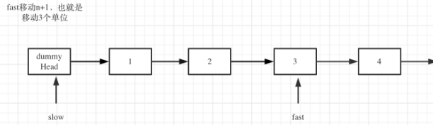


### [面试题 02.07. 链表相交](https://leetcode.cn/problems/intersection-of-two-linked-lists-lcci/)：规律题

这一题，看出来规律即可

相交部分的尾部一定长度相同

也就是说，如果链表一长一短，那么只要让长的先移动指针到剩余节点和短的一样，然后同时遍历，他们就能同时交汇

复杂度应该是O(N+M)

```c++
/**
 * Definition for singly-linked list.
 * struct ListNode {
 *     int val;
 *     ListNode *next;
 *     ListNode(int x) : val(x), next(NULL) {}
 * };
 */
class Solution {
public:
    ListNode *getIntersectionNode(ListNode *headA, ListNode *headB) {
        if(headA == nullptr || headB == nullptr) return nullptr;
        ListNode* cura = headA;
        ListNode* curb = headB;

        int cnta = 0;
        int cntb = 0;

        while(cura != nullptr){
            cnta++;
            cura = cura->next;
        }
        while(curb != nullptr){
            cntb++;
            curb = curb->next;
        }

        int minn = min(cnta,cntb);

        int pusha = cnta - minn;
        int pushb = cntb - minn;

        cnta = 0;
        cntb = 0;
        cura = headA;
        curb = headB;

        while(cnta < pusha){
            cura=cura->next;
            cnta++;
        }

        while(cntb < pushb){
            curb=curb->next;
            cntb++;
        }

        while(cura != nullptr && curb!= nullptr && cura != curb){
            cura = cura->next;
            curb = curb->next;
        }

        if(cura == nullptr || curb == nullptr){
            return nullptr;
        }
        if(cura == curb){
            return cura;
        }
        return nullptr;
    }
};
```


### 142. 环形链表II: 快慢指针判环，数学算入口(★)

判环： 快慢指针，快指针比慢指针快两倍

判断入口：

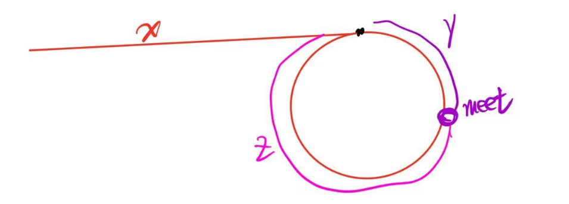

如果设环中有r个节点的话

slow走了`x+y`个节点，其中`y>r`是可能存在的

fast走了`x+n*(z+y)+y`个节点


同时已知`2*slow = fast`

整理可知`x = (n-1)*(y+z)+z`


这意味着，当n=1时，从头节点到分支的距离正好等于从接头点到分支点的距离

同理，当n>1时，我们只需要让从头节点出发的一起跟着转几圈就好了。


```c++
/**
 * Definition for singly-linked list.
 * struct ListNode {
 *     int val;
 *     ListNode *next;
 *     ListNode(int x) : val(x), next(NULL) {}
 * };
 */
class Solution {
public:
    ListNode *detectCycle(ListNode *head) {
        ListNode* slow = head;
        ListNode* fast = head;

        int cntslow = 0;
        int cntfast = 0;

        while(slow != nullptr && fast != nullptr && fast->next != nullptr){
            slow = slow->next;
            cntslow++;

            fast = fast->next;
            if(fast == nullptr){
                break;
            }
            fast = fast->next;
            cntfast+=2;


            if(slow == fast){
                ListNode* cur = head;

                while(cur != slow){
                    cur = cur->next;
                    slow = slow->next;
                }

                return cur;
            }
        }

        return nullptr;
    }   
};
```


## 7. 哈希

### 242. 有效字母的异位词：数组作为哈希，建模有限的状态

一个想法是直接用unordered_map,后面还有更好的想法

```c++
class Solution {
public:
    bool isAnagram(string s, string t) {
        unordered_map<char,int> m1;
        unordered_map<char,int> m2;

        for(auto c : s){
            if(m1.find(c) == m1.end()){
                m1[c] = 1;
            }
            else m1[c]++;
        }
        for(auto c : t){
            if(m2.find(c) == m2.end()){
                m2[c] = 1;
            }
            else m2[c]++;
        }

        for(auto& p : m1){
            if(m2.find(p.first) != m2.end() && m2[p.first] == p.second){
                m2.erase(p.first);
            }else{
                return false;
            }
        }

        if(!m2.empty()) return false;
        return true;

        
    }
};
```

更好的想法是考虑到这里只包含小写字母，因此可以直接使用数组作为哈希表（同理你也可以使用ASCII码作为哈希表，对于更宽泛的字符情况）

这样快很多,避免了上面每次`O(bucket_size)`的查询时间

```c++
class Solution {
public:
    bool isAnagram(string s, string t) {
        int record[26] = {0};
        for (int i = 0; i < s.size(); i++) {
            // 并不需要记住字符a的ASCII，只要求出一个相对数值就可以了
            record[s[i] - 'a']++;
        }
        for (int i = 0; i < t.size(); i++) {
            record[t[i] - 'a']--;
        }
        for (int i = 0; i < 26; i++) {
            if (record[i] != 0) {
                // record数组如果有的元素不为零0，说明字符串s和t 一定是谁多了字符或者谁少了字符。
                return false;
            }
        }
        // record数组所有元素都为零0，说明字符串s和t是字母异位词
        return true;
    }
};
```


### 383.赎金信:方法同上

```c++
class Solution {
public:
    bool canConstruct(string ransomNote, string magazine) {
        vector<int> record1(26,0);
        vector<int> record2(26,0);

        for(char c : ransomNote){
            record1[c-'a']++;
        }
        for(char c : magazine){
            record2[c-'a']++;
        }

        for(int i = 0; i < 26; i++){
            if(record1[i]  > record2[i]){
                return false;
            }
        }
        return true;

    }
};
```


### 49. 字母异位词分组

这一题有如下几个做法，我们分析一下复杂度：

* 如上面哈希的方法，每个单词建立一个字符表统计

  然后做一个`for(i){for(j)}`，`i`代表当前被推入ans的解，j代表比较它是否和ans相同的解。

  为了减少重复比较，你可以使用一个visited数组表示是否已经被推入结果数组。

* 在这个基础上，我们可以做一些优化

  * 其实给出的大多是小string，因此可以使用unordered_map来替代固定大小的26个字符数组
  * 可以读取每个字符串的值总和作为一个初筛，相同值的才能够两两比较，非相同值的一定不同。

  如下的实现就是这种做法，不过使用的是26字符数组哈希

* 还有一个做法，将每个string从大到小排序，然后直接比较string，其实其时间复杂度也挺高（因为两个string相同比较起来也很费时间）。


```c++
class Solution {
    bool check(int a, int b, vector<vector<int>>& cnt){
        for(int i = 0; i < 26; i++){
            if(cnt[a][i] != cnt[b][i]){
                return false;
            }
        }
        return true;
    }
public:
    vector<vector<string>> groupAnagrams(vector<string>& strs) {
        // 当前字符串的哈希值总和，存储为{总和，当前代表第几个字符串}
        vector<pair<int,int>> summ(strs.size());
        // 当前字符串每个字符出现的频率
        vector<vector<int>> cnt(strs.size(), vector<int>(26, 0));
        vector<vector<string>> ans;
		// 计算cnt和summ
        for(int i = 0; i < strs.size();i++){
            int temp = 0;

            for(int j = 0; j < strs[i].size();j++){
                cnt[i][strs[i][j]-'a']++;
                temp += strs[i][j]-'a';
            }

            summ[i] = {temp, i};
        }
		
        sort(summ.begin(),summ.end(),[](pair<int,int>& a, pair<int,int>& b){
            return a.first < b.first;
        });

        int begin = 0;
        int end = 0;
        
        while(1){
            // 找到[begin,end)区间，区间内summ完全相同
            while(end < strs.size() && summ[begin].first == summ[end].first){
                end++;
            }

            // 分类推入ans
            vector<int> visited(end-begin,0);
            //对于区间内的每个summ
            for(int i = begin; i < end; i++){
                //读取过则跳过
                if(visited[i-begin]) continue;
                
                visited[i-begin] = 1;
                
                // 将当前词推入
                vector<string> tothis{strs[summ[i].second]};
                for(int j = i+1; j < end;j++){
                    if(!visited[j-begin])
                    {
                        
                        if(check(summ[i].second,summ[j].second, cnt)){
                            visited[j-begin] = 1;
                            tothis.push_back(strs[summ[j].second]);
                        }
                    }
                }
                ans.push_back(tothis);
            }
            if(end == strs.size()) break;
            begin = end;
        }

        return ans;
    }
};
```


### 438. 找到字符串中所有字母异位词：滑动窗口+哈希

简单来说，因为异位词拥有一个性质：其长度一定相同

因此，可以直接使用滑动窗口，维护滑动窗口内的一个map来解决

```c++
class Solution {
public:
    vector<int> findAnagrams(string s, string p) {
        vector<int> cnt(26, 0);

        vector<int> ans;

        if(s.size() < p.size()) return {};

        int begin = 0;
        int end = p.size();

        for(int i = 0; i < p.size();i++){
            cnt[s[i]-'a']++;
            cnt[p[i]-'a']--;
        }

        // 代表当前s窗口的统计相对于p多还是少多少
        unordered_map<int,int> mp;
        for(int i = 0; i <26;i++){
            if(cnt[i] != 0){
                mp[i] = cnt[i];
            }
        }
        // 如果map为空则代表完全匹配
        if(mp.empty()){
            ans.push_back(begin);
        }
        for(int i = end; i < s.size();i++){
            // 减去begin
            if(mp.find(s[begin]-'a') == mp.end()){
                mp[s[begin]-'a'] = -1;
            }else{
                mp[s[begin]-'a']--;
                if(mp[s[begin]-'a'] == 0) mp.erase(s[begin]-'a');
            }
            begin++;

            // 加上end
            if(mp.find(s[i]-'a') == mp.end()){
                mp[s[i]-'a'] = 1;
            }else{
                mp[s[i]-'a']++;
                if(mp[s[i]-'a'] == 0) mp.erase(s[i]-'a');
            }

            if(mp.empty()){
                ans.push_back(begin);
            }
        }
        return ans;
    }
};
```


### 649. 两个数组的交集

这里因为要求数唯一，并且不用记录value，因此使用unordered_set，其也是哈希底层。

注意找到一个删除一个，防止重复输出

```c++
class Solution {
public:
    vector<int> intersection(vector<int>& nums1, vector<int>& nums2) {
        unordered_set<int> st;
        vector<int> ans;
        for(int i : nums1){
            st.insert(i);
        }

        for(int i : nums2){
            if(st.find(i) != st.end()){
                ans.push_back(i);
                // 注意
                st.erase(i);
            }
        }

        return ans;
    }
};
```


### 350.两个数组的交集II

两次map即可

```c++
class Solution {
public:
    vector<int> intersect(vector<int>& nums1, vector<int>& nums2) {
        // pair中存储的是nums1的个数和nums2的个数
        unordered_map<int,pair<int,int>> mp;
        vector<int> ans;
        for(int i : nums1){
            if(mp.find(i) != mp.end()){
                mp[i].first++;
            }
            else{
                mp[i].first = 1;
                mp[i].second = 0;
            }
        }

        for(int i : nums2){
            if(mp.find(i) != mp.end()){
                mp[i].second++;
            }
            else{
                mp[i].first = 0;
                mp[i].second = 0;
            }
        }

        for(auto &p : mp){
            if(p.second.first && p.second.second ){
                int cnt = min(p.second.second,p.second.first);
                vector<int> temp(cnt,p.first);
                ans.insert(ans.end(), temp.begin(), temp.end());
            }
        }
        return ans;
    }
};
```


###  202. 快乐数

使用哈希表检测环

同样的，也可以使用快慢指针

```c++
class Solution {
public:
    bool isHappy(int n) {
        // 主要是哈希防止循环

        unordered_set<int> st{n};
        while(n != 1){
            int sum = 0;

            while(n){
                sum += pow(n%10,2);
                n/=10;
            }
            if(st.find(sum) != st.end()){
                return false;
            }

            st.insert(sum);
            n = sum;


        }
        return true;

    }
};
```


### 1. 两数之和

经典mp题，我看错题目了，以为要输出所有组合，所以声明了一个奇怪的mp

```c++
class Solution {
public:
    vector<int> twoSum(vector<int>& nums, int target) {
        // pair for index and numbers
        unordered_map<int,pair<int,int>> mp;
        vector<int> ans;
        for(int i = 0; i < nums.size();i++){
            if(mp.find(target-nums[i])==mp.end()){
                if(mp.find(nums[i]) == mp.end()){
                    mp[nums[i]] = {i,1};
                }else{
                    mp[nums[i]].second++;
                }
            }else{
                return {mp[target-nums[i]].first,i};

            }
        }
        return ans;
    }
};
```


### 454. 四数之和II:分治+哈希

其实这里的mp仍然是用来避免重复寻找的

例如，如果我使用四层for，那么一共是$n^4$​的复杂度，此处也就是`1.6e9`的复杂度

但是，如果我们分治一下，也就是用两个数组和两个数组分队来匹配，那么就是

`n^2*2`的复杂度，也就是最多2e4的复杂度提升很大

```c++
class Solution {
public:
    int fourSumCount(vector<int>& nums1, vector<int>& nums2, vector<int>& nums3, vector<int>& nums4) {
        unordered_map<int,int> um1;
        unordered_map<int,int> um2;


        for(int i = 0; i < nums1.size();i++){
            for(int j = 0; j < nums2.size();j++){
                int sum = nums1[i] + nums2[j];

                if(um1.find(sum) == um1.end()){
                    um1[sum] = 1;
                }else{
                    um1[sum]++;
                }
            }
        }

        for(int i = 0; i < nums3.size();i++){
            for(int j = 0; j < nums4.size();j++){
                int sum = nums3[i] + nums4[j];

                if(um2.find(sum) == um2.end()){
                    um2[sum] = 1;
                }else{
                    um2[sum]++;
                }
            }
        }
        int cnt = 0;
        for(auto& p: um1){
            if(um2.find(0-p.first) != um2.end()){
                cnt += p.second * um2[0-p.first];
            }
        }

        return cnt;


    }
};
```


### 15.三数之和：什么时候抛弃map，使用双指针

这一题可以使用map来写，但是十分的复杂，我写完十分的复杂


我是用一个map来存储数组中两两的和，用一个map来存储当前`nums[idx]`所能造成的sum

每次，我们删除当前`nums[idx]`所能形成的sum，并删除无效化其导向的sum

同时，你还需要区分，相同值不同idx所造成的sum，你只能删除对应idx造成的sum


最后，再使用一个map来将ans去重，因为不同idx形成的ans可能含有相同的元素


其实这看起来就很麻烦了

```c++
class Solution {


    struct Node{
            int cnt;
            vector<pair<int,int>> idx;
            vector<int> isdeleted;
            bool is_dealed;
            Node(pair<int,int> _){
                idx.push_back(_);
                cnt = 1;
                is_dealed = false;
            }

            void add(pair<int,int> _){
                idx.push_back(_);
                cnt++;
            }
            // 标识某个idx某个位置是否失效
            void construct_complete(){
                isdeleted = vector<int>(idx.size(),0);
            }
            // 
            // 删除节点i后，Node的状态变化，如果Node不应该存在则返回false
            bool erase(int i){
                if(!is_dealed){
                    construct_complete();
                    is_dealed = true;
                }

                for(int i = 0; i < idx.size();i++){
                    if(isdeleted[i]) continue;

                    if(idx[i].first == i || idx[i].second == i){
                        cnt--;
                        isdeleted[i] = false;
                    }
                }

                if(cnt) return true;
                return false;
            }

            void addans(vector<vector<int>>& ans,vector<int>& nums, int cur){
                if(!is_dealed){
                    construct_complete();
                    is_dealed = true;
                }
                for(int i = 0; i < idx.size();i++){
                    if(isdeleted[i]) continue;
                    vector<int>temp{nums[cur],nums[idx[i].first],nums[idx[i].second]};
                    sort(temp.begin(),temp.end());
                    ans.push_back(temp);
                }
            }
        };

    void erase_idx(int i, unordered_map<int,Node*>&mp,unordered_map<int,vector<int>>& mps ){
        for(auto sum : mps[i]){
            if(mp.find(sum) != mp.end())
            {
                bool flag = mp[sum]->erase(i);
                // 删除idx=i后，mp中的某个sum失效
                if(!flag) mp.erase(sum);
            }
        }
    }
public:
    vector<vector<int>> threeSum(vector<int>& nums) {
        
        // 双哈希表
        // 数组内的两两和，以及其个数，index下标
        unordered_map<int,Node*> mp;
        
        // 每个数组元素对应的可能存在的和
        unordered_map<int,vector<int>> mps;

        for(int i = 0; i < nums.size();i++){
            for(int j = i+1; j < nums.size();j++){
                int sum = nums[i] + nums[j];

                if(mp.find(sum) == mp.end()){
                    mp[sum] = new Node({i,j});
                }else{
                    mp[sum]->add({i,j});
                }

                mps[i].push_back(sum);
                mps[j].push_back(sum);
            }
        }

        // 首先从集合中删除当前i对应数组构成的sum，然后搜索
        vector<vector<int>> ans;
        for(int i = 0; i < nums.size() - 2;i++){
            erase_idx(i, mp,mps);
            if(mp.find(0-nums[i]) != mp.end()){
                // 找寻里面的每一种组合，添加到ans中,已排序
                mp[0-nums[i]]->addans(ans,nums,i);
            }
        }

        sort(ans.begin(),ans.end(),[](vector<int>& a, vector<int>& b){
            if(a[0] == b[0]){
                if(a[1] == b[1]){
                    return a[2] < b[2];
                }
                return a[1] < b[1];
            }
            return a[0] < b[0];
        });

        vector<vector<int>> newans;
        if(ans.empty()) return{};

        newans.push_back(ans[0]);
        for(int i = 1; i < ans.size();i++){
            for(int j = 0; j<3;j++){
                if(newans[newans.size()-1][j] != ans[i][j]){
                    newans.push_back(ans[i]);
                    break;
                }
            }
        }

        return newans;
    }
};
```


一个更简单方法就是三指针，简单来说，一切的麻烦都可以先排序再处理

==这里不使用map的原因是，map建立好后本身会需要修改，这就很麻烦，你为了处理修改的界限就需要很多额外操作==


三指针就简单的多了

`nums[i]+nums[left]+nums[right]`

`nums[left]`只会向右变动，也就是让总和变大

`nums[right]`只会向左变动，也就是让总和变小

那么是否存在一个情况，

`nums[i]+nums[left+1]+nums[right]<0`

`nums[i]+nums[left+1]+nums[right]>0`，

此时我们只会想让右边-1，那么

`nums[i]+nums[left+1]+nums[right-1]<0`

此时我们只会去搜索

`nums[i]+nums[left+2]+nums[right-1]`了


是否存在以下没有被处理的情况正好为解呢？

`nums[i]+nums[left]+nums[right-1]==0`

不会，因为`nums[i]+nums[left+1]+nums[right-1]<0`中`nums[left+1] > nums[left]`，因此我们可以知道

==区间的收缩是因为一定没有合适解==

left收缩一定是因为小了

right收缩一定是因为大了

不存在right收缩了，整体变小了，而遍历过的left正好能让其等于0，因为left一定小于当前left


在证明了无后效性之后，只需要注意去重就好了。

```c++
class Solution {
public:
    vector<vector<int>> threeSum(vector<int>& nnums) {
        vector<vector<int>> ans;
        sort(nnums.begin(),nnums.end());
        for(int i = 0; i < nnums.size()-2;i++){
            cout << nnums[i] << endl;
            int left = i+1;
            int right = nnums.size()-1;
            
            while(left < right){
                if(nnums[i] + nnums[left]+nnums[right]==0){
                    ans.push_back(vector<int>{nnums[i],nnums[left],nnums[right]});
                    left++;
                    right--;
                    // 需要继续执行寻找其余可能组合，容易知道当前成立的left和right肯定都不能用，去重
                    while(left < right && nnums[left]==nnums[left-1]){
                        left++;
                    }
                    while(left < right && nnums[right] == nnums[right+1]){
                        right--;
                    }
                }
                else if(nnums[i] + nnums[left]+nnums[right]>0){
                    right--;
                }else{
                    left++;
                }
            }
            // 去重
            while(i+1 < nnums.size() && nnums[i+1] == nnums[i]){
                i++;
            }
        }
        return ans;
    }
};
```


### 18.四数之和:双指针

这里就是，原本是固定一个值，用双指针找剩余两个值

现在是固定两个值（固定`nums[i]`,`nums[j]`，其中i<j），然后对`[j+1,nums.size()-1]`区间的值使用双指针收缩


想法是一样的，先固定第一个，然后找出和上一次搜索的第二个不同的`nums[j]`，这样能够保证ans不会重复


这里需要注意，`target-nums[i]-nums[j]`可能越界，因此需要使用`long long t = (long long)target -nums[i]-nums[j] `

```c++
class Solution {
public:
    vector<vector<int>> fourSum(vector<int>& nums, int target) {
        vector<vector<int>> ans;
        sort(nums.begin(),nums.end());
        for(int i = 0; i < nums.size();i++){
            for(int j = i+1; j < nums.size();j++){
                long long t = (long long)target-nums[i] - nums[j];

                int begin = j+1;
                int end = nums.size()-1;

                while(begin < end){
                    if((long long)nums[begin] + nums[end] == t){
                        ans.push_back(vector<int>{nums[i],nums[j],nums[begin],nums[end]});                  
                        begin++;
                        end--;
                        while(begin < end && nums[begin] == nums[begin-1]){
                            begin++;
                        }

                        while(begin < end && nums[end] == nums[end+1]){
                            end--;
                        }
                    }else{
                        if((long long)nums[begin] + nums[end] > t){
                            end--;
                        }else if((long long)nums[begin] + nums[end] < t){
                            begin++;
                        }
                    }
                }
                //去重
                while( j + 1 < nums.size() && nums[j] == nums[j+1]){
                    j++;
                }
            }
            while(i + 1 < nums.size() && nums[i] == nums[i+1]){
                i++;
            }
        }

        return ans;
    }
};
```


## 8. 字符串

字符串的基本操作是**reverse**

reverse通常通过双指针或者`std::reverse`来完成

reverse能够引申出很多题目，包括

* 翻转按空格分开的单词：双指针找出单词区间(121)
* 将整个字符串分割换位：整体翻转加上局部翻转(55)


字符串中的另一个常见题目是KMP

通常来说，题目包括直接的字符串匹配(可以使用find)

以及利用next表的性质完成的题目（459）

### 344. 反转字符串：双指针

可以说类似双指针，一个比较奇怪的点是swap居然比直接temp要慢（当然是可理解的，毕竟多调用了一层）

```c++
class Solution {
public:
    void reverseString(vector<char>& s) {
        for(int i = 0; i < s.size()/2;i++){
            int temp;
            temp = s[i];
            s[i] = s[s.size()-1-i];
            s[s.size()-1-i] = temp;

        }
    }
};
```


### 541. 反转字符串II

双指针即可

此处使用`std::reverse`来翻转

```c++
class Solution {
public:
    string reverseStr(string s, int k) {
        int begin = 0;
        int end = 2*k;
        for(;end <= s.size();end+=2*k){
            std::reverse(s.begin()+begin,s.begin()+begin+k);
            begin = end;
        }

        if(begin < s.size()){
            if(begin + k < s.size()){
                std::reverse(s.begin()+begin,s.begin()+begin+k);
            }else{
                std::reverse(s.begin()+begin,s.end());
            }
        }
        return s;
    }
};
```


### 54.替换数字：理清了一些基础，同时也可以算双指针

> https://kamacoder.com/problempage.php?pid=1064

这一题本身没有多难，因此我在这一题上踩了几个语法的坑

* `std::transform`一般用于映射关系，其对目标container每一个元素执行一个转换，然后会自动将指针指向`OutputIt start`的后一个

  这里将字符换成非等长的"number"会导致结果的长度超过目标长度，从而使得出错。

* 我使用`res+=isdigit(c) ? "number" : c;`

  这是错的，因为这里这个三元计算返回值是const char*和char，类型不一致

* 使用`res+=isdigit(c) ? "number" : (""+c);`

  这里其实是和一个概念搞混了，即为**C style string不能相加，但是能通过和C++ string相加来转换成c++ string**

  原理在于Cstyle string("this is a string")，这个字面量是一个const char*的指针，因此两个cstyle string相加就相当于指针相加，无意义，同理，你用cstyle string加上char，就相当于用一个常量加上一个指针，指针会越界，也无意义

  ```c++
  #include <iostream>
  #include <string>
  
  int main() {
      const char* cstyle = "Hello";
      std::string cppstyle = "World";
  
      // C 风格字符串与 C++ 字符串的连接
      std::string result = cstyle + cppstyle;
      std::cout << result << std::endl;  // 输出 "HelloWorld"
  
      // C++ 字符串可以直接与 C 风格字符串连接
      result = cppstyle + "!";
      std::cout << result << std::endl;  // 输出 "World!"
  
      return 0;
  }
  
  ```


当然，这道题还是很简单的

```c++
#include<iostream>
#include<algorithm>
#include<string>
using namespace std;

int main(){
    string s;
    cin >> s;
    string res;
    
    for(char c:s){
        res += isdigit(c) ? "number" : string{c};
        /*
        if(isdigit(c)){
            res.append("number");
        }else{
            res+=c;
        }
        */
    }
    cout << res << endl;
}

```

当然，你也可以先判断一共有几个数字，然后计算结果的总长度多长，然后resize增长string，将所有的string搬到最后，然后再前面填充即可

容易证明填入"number"一定不会影响未处理的末尾元素。

这就是双指针


### 151.翻转字符中的单词


#### 每个单词反转

题目看错了，看成反转每个单词了

```c++
class Solution {
public:
    string reverseWords(string s) {
        int begin = 0;
        while(begin < s.size() && s[begin] == ' '){
            begin++;
        }
        int end = begin;

        while(begin < s.size()){
            // end到第一个空格
            while(end < s.size() && s[end] != ' '){
                end++;
            }
            reverse(s.begin()+begin,s.begin()+end);
            //end到第一个非空格
            while(end < s.size() && s[end] == ' '){
                end++;
            }
            begin = end;
        }

        return s;
    }
};
```


#### 使用辅助空间

实际上差不多，只用向string前面插入单词就好了

```c++
class Solution {
public:
    string reverseWords(string s) {
        int begin = 0;
        while(begin < s.size() && s[begin] == ' '){
            begin++;
        }
        int end = begin;
        string ans;
        while(begin < s.size()){
            // end到第一个空格
            while(end < s.size() && s[end] != ' '){
                end++;
            }
            if(!ans.empty()){
                //插入字符在位置0，插入1次
                ans.insert(0,1,' ');
            }
            ans.insert(0,s.substr(begin,end-begin));
            //end到第一个非空格
            while(end < s.size() && s[end] == ' '){
                end++;
            }
            begin = end;
        }
        return ans;
    }
};
```


#### 不使用辅助空间：双指针

更进一步，如果不使用辅助空间，就是整个字符串反转加上每个单词反转，同时考虑下一个插入位置。


```c++
class Solution {
public:
    string reverseWords(string s) {
        reverse(s.begin(),s.end());
        int insert_begin = 0;
        int begin = 0;
        while(begin < s.size() && s[begin] == ' '){
            begin++;
        }
        int end = begin;

        while(begin < s.size()){
            // end到第一个空格
            while(end < s.size() && s[end] != ' '){
                end++;
            }

            // 翻转单词
            reverse(s.begin()+begin,s.begin()+end);
            //替换单词
            s.replace(insert_begin,end-begin,s.substr(begin, end - begin));
            //更新插入位置
            insert_begin+=end-begin;
            if(insert_begin < s.size())
                s[insert_begin++] = ' ';

            //end到第一个非空格
            while(end < s.size() && s[end] == ' '){
                end++;
            }
            begin = end;
        }

        // 结束时，insert_begin应该指向正确字符串结尾空格后一位,也就是例子"string t"中的t位置
        // 或者，考虑原本字符串是"aa bb cc"的情况，此时指向的是end()
        // 或者， 考虑原本的字符串是" aa bb cc"的情况，insert_begin会首先插入空格然后指向end()
        // 一个更简单的方式可以在一开始遍历一遍字符串，直接计算出正确的长度
        if(insert_begin != s.size() || (insert_begin == s.size() && s[insert_begin-1] == ' ' )){
            insert_begin--;
            s.erase(s.begin()+insert_begin,s.end());
        }

        return s;
    }
};
```


### 55. 右旋字符串:翻转的用法

https://kamacoder.com/problempage.php?pid=1065

```c++
#include<iostream>
#include<string>
#include<algorithm>
using namespace std;

/*
    这里，限制使用空间，不能额外申请空间
    
    右转指的是末尾转移到头部
    
    这个操作其实是将一个序列切割并重排了
    
    注意，切割并重排，维持原有顺序，可以通过reverse的组合来解决
    
    因为对所有元素一次reverse，相当于将被切割的序列重排
    
    对每个被切割的序列再次reverse将其还原到了原本的顺序，维持了原有顺序

*/


int main(){
    int n;
    cin >> n;
    
    string s;
    cin >> s;
    
    reverse(s.begin(),s.end());
    
    reverse(s.begin(),s.begin()+n);
    reverse(s.begin()+n,s.end());
    cout << s << endl;
}


```

同理，我们可以做出扩展


如果是左旋转该怎么办？

> 'abcd' 2 ->'cdab'

事实上，前n位的左旋转就是相当于后size-n位的右旋转

但是，如果要直接写的话，也是没问题的，完全一致

```c++
 reverse(s.begin(), s.end()); // 整体反转
 reverse(s.begin(), s.begin() + n); // 先反转前一段，长度n
 reverse(s.begin() + n, s.end()); // 再反转后一段

```


### 28. 找出字符串中第一个匹配项的下标:KMP


KMP经典题目，一句话概括KMP的核心算法就是==搜索每个可能的相同前缀后缀，使得新添加的元素能够成为新后缀==。这里的前缀一定是越来越小的，或者说我们一定是首先搜索最大的前缀，第二大的前缀。。。

至于当前前缀中一定存在下一个可能使用的前缀，这是由“最长相同前缀后缀”这个本身来保证的。


简要提一下KMP的写法，KMP通过记录最长的前缀后缀相同子串长度来跳跃式的搜索，避免重复搜索。

简单来说，我们可以将一个任意长的字符串看作三个部分：前缀，后缀，中间。我们不关注中间，我们只关注前缀后缀。

有一个next数组，`next[i]`记录了序列`[0,i]`的最长相同前缀后缀的长度

> 例如对于`aaabbaaa`，`next[7] = 3`

每次添加一个新的元素，我们首先比较，如果这个元素加在后缀后面，是否能够让前缀增加一个长度，使得加上这个元素后，最长相同前缀后缀长度更长。

如果不行，这意味着当前后缀已经无法使用了，或者说当前前缀已经无法使用了，我们应该去搜索第二长的前缀，也就是前缀的前缀，期待它能够成为加上这个元素的前缀。

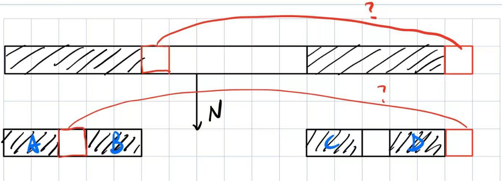


如图所示，我们往当前串中添加一个新元素。当前串能够看作一个前缀，后缀，中间的组合。

前缀和后缀一定完全相同，我们期待延长这个前缀后缀，因此比较前缀的后一个，和当前添加的新元素。

如果不匹配，那么就意味着这个前缀不能用了，我们需要搜索另一个：前缀的前缀。

这里可以发现，我们的当前后缀D一定和新前缀A相同，因此我们要做的就是比较A的后一个和当前添加的新元素。


以此类推即可，对于一般的字符串匹配，一个简单的写法就是将两个串按**模式串+"一个不会出现的字符"+匹配串**的方式组合起来，这样我们只需要计算这个新串的next数组，然后判断是否有相同前缀后缀长度等于模式串即可。


具体的指针转移关系如下

我们使用front来代表当前前缀的后一位

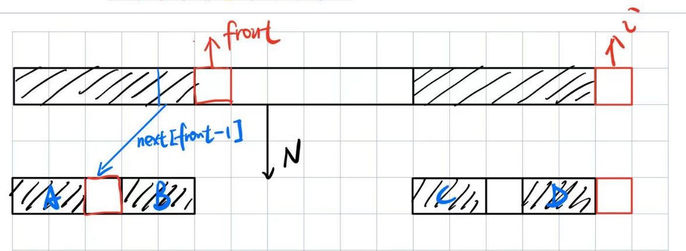

代码上来看就是

```c++
int front = next[i-1];
while(front > 0 && ans[front] != ans[i]){
    front = next[front-1];
}
```

这里需要注意，front==0的情况代表，已经没有最长公共前缀后缀了，因此你需要判断当前新添加的元素是否可以成为后缀。

以及，如果front!=0，代表while循环是检测到`ans[front]==ans[i]`而推出的，因此最长前缀后缀长度直接加1即可。

```c++
if(front == 0){
    if(ans[i] == ans[front]){
        next[i] = 1;
    }else
        next[i] = 0;
}else{
    next[i] = front + 1;
}
```


以及，我们使用一个例子来展示合并串的做法

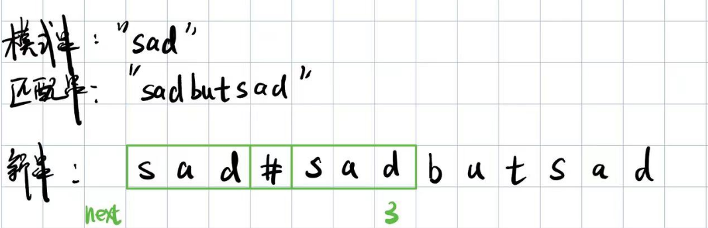


其复杂度从`m*n->m+n`

具体代码如下

```c++
class Solution {
public:
    int strStr(string haystack, string needle) {
        
        string ans = needle + "#" + haystack;
        

        // 最长相同前后缀的长度
        vector<int> next(ans.size());
        next[0] = 0;

        for(int i = 1; i < ans.size();i++){
            int front = next[i-1];
            while(front > 0 && ans[front] != ans[i]){
                front = next[front-1];
            }

            if(front == 0){
                if(ans[i] == ans[front]){
                    next[i] = 1;
                }else
                    next[i] = 0;
            }else{
                next[i] = front + 1;
            }
            if(next[i] == needle.size()){
                return i-2 * needle.size();
            }
        }
        return -1;

        

    }
};
```


### 459.重复的子字符串

#### KMP

首先，提到子串，就有KMP

就算是重复的子串，KMP也能为我们提供很多的线索。

看如下的一个例子

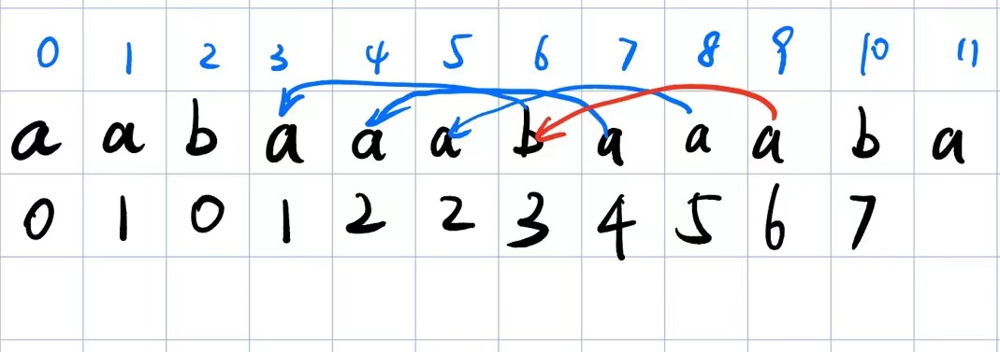

对于一个重复的`aaba`子串，可以发现在KMP的末期，如果这个子串存在，

那么对于 `next[i-1]`对应的字母和`i`对应的字母（也就是上图中`i = 10`,`next[9] = 6`的这个情况）

可以发现，这两个是一定相等的，而它的跨度(10-6)就代表了一个这个重复子串的长度

==毕竟，它可以看作稳定的跨越了一个子串长度后，匹配到了上一个字串的自己==

这个跨度可以表示为`i - next[i-1]`。

通常，我们对字符串最后一个字符做这个计算来获取子串长度（因为开头的next可能如图一样存在自己内部的前缀后缀，只有之后稳定了，它会抛弃子串内部的前缀，转而使用重复子串本身这个最大前缀）

也就是

```c++
int idx = s.size()-1;
assert(s[idx] == s[next[idx-1]]);
int substr_len = idx - next[idx-1];
```


现在又有一个问题，这个算出来其实是代表**整个字符串拥有substr_len的相同前缀后缀**

如果它能整除字符串长度，那么它一定是代表字符串的重复子串长度


对于这个定理，我们通过如下两个例子来说明

`stringabcdefstring`

此时`next[idx-1] == 5`,`idx = 17`

而对于

`stringstringstring`

`next[idx-1] == 11`,`idx = 17`

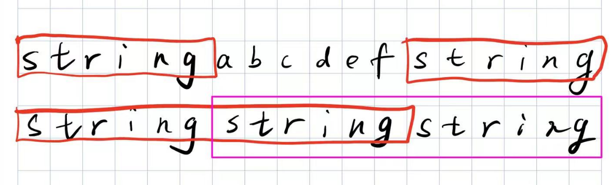

从这个图可以很明显的看出来，只有是重复子串，才能有这个效果

> 具体来说
>
> - 前缀是指不包含最后一个字符的所有以第一个字符开头的连续子串；
> - 后缀是指不包含第一个字符的所有以最后一个字符结尾的连续子串
>
> **在由重复子串组成的字符串中，最长相等前后缀不包含的子串就是最小重复子串**
>
> 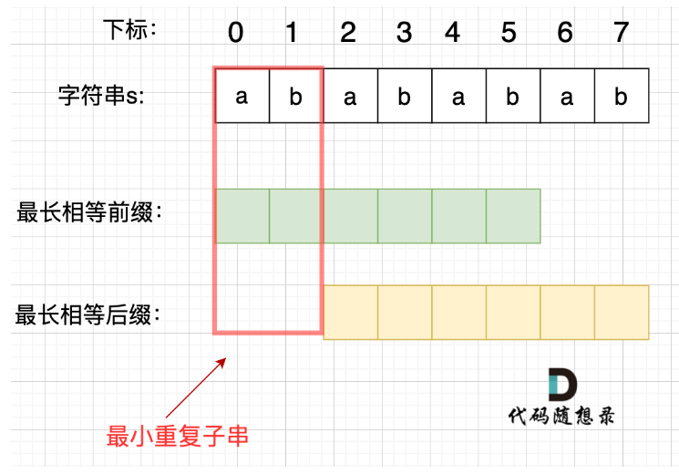


```c++
class Solution {
public:
    bool repeatedSubstringPattern(string s) {
        vector<int> next(s.size());

        next[0] = 0;

        for(int i = 1; i < s.size();i++){
            int front = next[i-1];
            while(front > 0 && s[front] != s[i]){
                front = next[front-1];
            }

            if(s[front] == s[i]){
                next[i] = front + 1;
            }else{
                next[i] = 0;
            }
        }

        int substr_len = s.size() - 1 - next[s.size()-1]+1;

        if(s.size() % substr_len == 0 && s.size() != substr_len){
            return true;
        }
        return false;
    }
};
```


#### 性质解法：移动匹配与使用find

如果一个字符串`s`完全由子字符串`sub`组成，那么将两个`s`首尾相连，删除头尾，其中间必定能构成`s`

而如果并非这样，其中间必定不能构成`s`

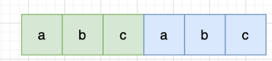

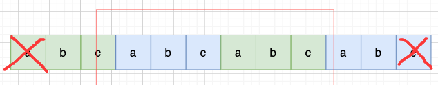

```c++
class Solution {
public:
    bool repeatedSubstringPattern(string s) {
        string ss = s + s;

        ss.erase(ss.begin());
        // rbegin返回反向迭代器，erase需要正向迭代器
        //ss.erase(ss.rbegin());
        ss.erase(ss.end()-1);

        return ss.find(s,0) != string::npos;
    }
};
```


## 9. 双指针

这里就基本上都是之前做过的题了，包括

[移除元素](###27.移除元素(简单))

[反转字符串](###206.反转链表)

双指针交换

[替换数字](###54.替换数字: 理清了一些基础，同时也可以算双指针)

替换数字为"number"，指针标记原字符串遍历到哪里

[翻转字符串里的单词](###151.翻转字符中的单词)

双指针标记字符串里单词的开始与结尾

[翻转链表](###206.反转链表)

双指针标记可能用到的节点

[删除链表倒数第N个节点](###19.删除链表倒数第N个节点: 快慢指针)

快慢指针，这两个指针相距N

[链表相交](###面试题02.07.链表相交：规律题)

双指针遍历，双指针相距链表长度的差值

[环形链表](###142.环形链表II:快慢指针判环，数学算入口(★))

快慢指针判环，数学算入口

[三数之和](###15.三数之和：什么时候抛弃map，使用双指针)

排序，指定一个值，双指针压缩

[四数之和](###18.四数之和:双指针)

同理，排序，指定两个值，双指针压缩


## 10. 栈与队列

总的来说，栈是用来做匹配任务的，而queue通常做单调队列或者优先队列来维护一个窗口内的属性。

### 233.用栈实现队列：双栈写O(1)读O(n)

使用两个栈实现，纯模拟题

读O(n)写O(n)

```c++
class MyQueue {
    stack<int> ps;
    stack<int> pp;
    int cur;
public:
    MyQueue() {
        cur = 0;
        ps = stack<int>();
        pp = stack<int>();
    }
    
    void push(int x) {
        // 处在push模式
        if(cur == 0){
            ps.push(x);
        }else{
            //处在pop模式
            cur = 0;
            while(!pp.empty()){
                ps.push(pp.top());
                pp.pop();
            }
            ps.push(x);

        }
    }
    
    int pop() {
        // 处在pop模式
        if(cur == 1){
            if(!pp.empty()){
                int temp = pp.top();
                pp.pop();
                return temp;
            }else{
                return -1;
            }
        }else{
            //处在push模式
            cur = 1;
            while(!ps.empty()){
                pp.push(ps.top());
                ps.pop();
            }

            int temp = pp.top();
            pp.pop();
            return temp;
        }
    }
    
    int peek() {
        // 处在pop模式
        if(cur == 1){
            if(!pp.empty()){
                int temp = pp.top();
                return temp;
            }else{
                return -1;
            }
        }else{
            //处在push模式
            cur = 1;
            while(!ps.empty()){
                pp.push(ps.top());
                ps.pop();
            }

            int temp = pp.top();
            return temp;
        }
    }
    
    bool empty() {
        if(cur == 1){
            return pp.empty();
        }else{
            return ps.empty();
        }
    }
};

/**
 * Your MyQueue object will be instantiated and called as such:
 * MyQueue* obj = new MyQueue();
 * obj->push(x);
 * int param_2 = obj->pop();
 * int param_3 = obj->peek();
 * bool param_4 = obj->empty();
 */
```


实际上，一个更简单的方法就是设置一个栈专门接受输入，一个栈专门接受pop

当接收到pop指令时，如果输出栈没有，那么将输入栈的所有缓存全部加载进输出栈

否则，直接pop即可。

```c++
class MyQueue {
public:
    stack<int> stIn;
    stack<int> stOut;
    /** Initialize your data structure here. */
    MyQueue() {

    }
    /** Push element x to the back of queue. */
    void push(int x) {
        stIn.push(x);
    }

    /** Removes the element from in front of queue and returns that element. */
    int pop() {
        // 只有当stOut为空的时候，再从stIn里导入数据（导入stIn全部数据）
        if (stOut.empty()) {
            // 从stIn导入数据直到stIn为空
            while(!stIn.empty()) {
                stOut.push(stIn.top());
                stIn.pop();
            }
        }
        int result = stOut.top();
        stOut.pop();
        return result;
    }

    /** Get the front element. */
    int peek() {
        int res = this->pop(); // 直接使用已有的pop函数
        stOut.push(res); // 因为pop函数弹出了元素res，所以再添加回去
        return res;
    }

    /** Returns whether the queue is empty. */
    bool empty() {
        return stIn.empty() && stOut.empty();
    }
};

```


### 225.用队列实现栈：单队列实现

使用一个queue来备份即可

```c++
class MyStack {
    vector<queue<int>> vq;
    int cur;
public:
    MyStack() {
        cur = 0;
        vq = vector<queue<int>>(2,queue<int>());
    }
    
    void push(int x) {
        vq[cur].push(x);
    }
    
    int pop() {
        while(vq[cur].size() > 1){
            vq[!cur].push(vq[cur].front());
            vq[cur].pop();
        }
        int temp = vq[cur].front();
        vq[cur].pop();
        cur = !cur;
        return temp;
    }
    
    int top() {
        while(vq[cur].size() > 1){
            vq[!cur].push(vq[cur].front());
            vq[cur].pop();
        }
        int temp = vq[cur].front();
        vq[!cur].push(vq[cur].front());
        vq[cur].pop();
        cur = !cur;
        return temp;
    }
    
    bool empty() {
        return vq[cur].empty();
    }
};

/**
 * Your MyStack object will be instantiated and called as such:
 * MyStack* obj = new MyStack();
 * obj->push(x);
 * int param_2 = obj->pop();
 * int param_3 = obj->top();
 * bool param_4 = obj->empty();
 */
```

一个优化为单队列的方法就是

**一个队列在模拟栈弹出元素的时候只要将队列头部的元素（除了最后一个元素外） 重新添加到队列尾部，此时再去弹出元素就是栈的顺序了。**


### 20.有效的括号：栈，模拟

模拟题，经典栈的模拟题

```c++
class Solution {
public:
    bool isValid(string s) {
        stack<char> stk;

        for(char c : s){
            switch(c){
                case '(' : 
                case '{' : 
                case '[' : {stk.push(c);break;}
                case ')' : {if(!stk.empty() && stk.top() == '('){
                    stk.pop();
                }else{
                    return false;
                };break;}
                case '}' : {if(!stk.empty() &&stk.top() == '{'){
                    stk.pop();
                }else{
                    return false;
                };break;}
                case ']' : {if(!stk.empty() &&stk.top() == '['){
                    stk.pop();
                }else{
                    return false;
                };break;}
                
                default:
            }
        }

        if(stk.empty())
            return true;
        else
            return false;
    }
};
```


### 1047.删除字符串中所有相邻重复项:栈，模拟

模拟题

```c++
class Solution {
public:
    string removeDuplicates(string s) {
        stack<char> stk;

        for(char c : s){
            if(stk.empty()){
                stk.push(c);
            }else{
                if(stk.top() == c){
                    stk.pop();
                }else{
                    stk.push(c);
                }
            }
        }
        string ans;
        ans.resize(stk.size());
        int cnt = stk.size()-1;
        while(cnt >= 0){
            ans[cnt--] = stk.top();
            stk.pop();
        }
        return ans;
    }   
};
```


### 239. 滑动窗口的最大值

#### priority queue

这是经典的优先队列（最大堆问题）

有几个priority queue的注意点

* 默认最大堆，使用`std::less`，也就是写的时候相反
* 需要记录下标，最大值超出时直接删除直到下标在区间内

```c++
class Solution {
public:
    vector<int> maxSlidingWindow(vector<int>& nums, int k) {
        
        priority_queue<pair<int,int>> pq;
        vector<int> ans(nums.size()-k+1);
        for(int i = 0; i < k - 1; i++){
            pq.push({nums[i],i});
        }

        for(int i = k-1;i < nums.size();i++){
            pq.push({nums[i],i});
            
            while(pq.top().second < i+1-k){
                pq.pop();
            }

            ans[i+1-k] = pq.top().first;
        }

        return ans;

    }
};
```


#### multi-set

与priority_queue类似，不过它的删除逻辑是直接删除上一个移出窗口的值

```c++
#include <iostream>
#include <vector>
#include <set>

std::vector<int> maxSlidingWindow_multiset(const std::vector<int>& nums, int k) {
    std::vector<int> result;
    std::multiset<int> window;

    for (int i = 0; i < nums.size(); ++i) {
        // 将当前元素加入窗口
        window.insert(nums[i]);

        // 窗口大小超过 k 时，移除最左边的元素
        if (i >= k) {
            window.erase(window.find(nums[i - k]));
        }

        // 当窗口大小为 k 时，取最大值
        if (i >= k - 1) {
            result.push_back(*window.rbegin());  // rbegin() 返回 multiset 中最大的元素
        }
    }

    return result;
}

int main() {
    std::vector<int> nums = {1, 3, -1, -3, 5, 3, 6, 7};
    int k = 3;

    std::vector<int> result = maxSlidingWindow_multiset(nums, k);
    for (int n : result) {
        std::cout << n << " ";
    }

    return 0;
}

```


#### 单调队列

**其实队列没有必要维护窗口里的所有元素，只需要维护有可能成为窗口里最大值的元素就可以了，同时保证队列里的元素数值是由大到小的。**

逻辑就是，队列里实际上并没有必要维护每一个值，只需要维护所有可能成为最大值的值即可

也就是，我们有一个淘汰目前队列元素的机制

* 首先，一个值被移出滑动窗口，自然是从front移出

* 一个值如果需要被移入滑动窗口，则代表这个值在接下来的k次移动都可能成为最大值，

  我们能做的就是，将目前队列内小于其的值全部移除

  这个操作保证了队列内一定是单调的（因为每次push都是push到第一个比他大的元素停下）。

因此必须使用双向队列

```c++
class Solution {
public:
    vector<int> maxSlidingWindow(vector<int>& nums, int k) {
        
        deque<int> q;
        vector<int> ans(nums.size()-k+1);
        for(int i = 0; i < nums.size(); i++){
            // 如果移出滑动窗口的元素为单调队列的front
            // 这里不需要下标标记，是因为我们下面的push规则保证
            if(i >= k){
                if(nums[i-k] == q.front()){
                    q.pop_front();
                }
            }
			
            if(q.empty()){
                q.push_back(nums[i]);
            }else{
                // 删除队尾所有比当前小的
                while(!q.empty() && q.back() < nums[i]){
                    q.pop_back();
                }
                q.push_back(nums[i]);
            }
            
            if(i >= k-1){
                ans[i+1-k] = q.front();
            }

        }
        return ans;
    }
};
```


### 347. 前K个高频元素:哈希加小根堆（乐，priority_queue也是queue)

```c++
class Solution {
public:
    vector<int> topKFrequent(vector<int>& nums, int k) {
        struct compare{
            bool operator()(pair<int,int>& a,pair<int,int>& b){
                return a.second > b.second;
            }
        };
        priority_queue<pair<int,int>,vector<pair<int,int>>,compare> pq;
        unordered_map<int,int> um;
        for(int i : nums){
            if(um.find(i) == um.end()){
                um[i] = 1;
            }else{
                um[i]++;
            }
        }
        for(const pair<int,int>& p : um){
            if(pq.size() < k){
                pq.push(p);
            }else{
                pq.push(p);
                if(pq.size() > k){
                    pq.pop();
                }
               
            }
        }

        vector<int> ans(k);
        int cnt = 0;
        while(!pq.empty()){
            ans[cnt++] = pq.top().first;
            pq.pop();
        }
        
        return ans;
    }
};
```


### 71.简化路径：先简化再栈匹配

栈模拟题，先将路径简化为`/xx/xx/xx/`的模式，再解决约束

* 路径保底有一个`/`
* 路径的`..`是累积，碰到Filename才会起作用，所以需要额外计数

```c++
class Solution {

    void print(const stack<string> &stk){
        stack<string> nw = stk;

        while(!nw.empty()){
            cout << nw.top() << endl;
            nw.pop();
        }
    }
public:
    string simplifyPath(string path) {
        stack<string> stk;
        // stk推入'/','.','..',和文件名
        for(int i = 0; i < path.size();i++){
            
            if(path[i] == '/') {
                stk.push("/");
                while(i + 1 < path.size() && path[i+1] == '/'){
                    i++;
                }
            }else{
                // 可能是当前目录本身，可能是切换到上一级，可能是路径
                int j = i;
                while(j < path.size() &&  path[j] != '/'){
                    j++;
                }
                stk.push(path.substr(i,j-i));
                i = j-1;
            }
        }


        
        //print(stk);


        string ans;
        //不能以'/'结尾
        if(stk.top() == "/"){
            stk.pop();
        }


        // 处理stk的逻辑
        enum state{
            cur = 0,
            returnToLast,
            FileName
        };
        //记录有几个返回目录
        int cnt = 0;
        while(!stk.empty()){
            state FLAG;
            if(stk.top() == "."){
                FLAG = state::cur;
            }else if(stk.top() == ".."){
                FLAG = state::returnToLast;
            }else{
                FLAG = state::FileName;
            }
            switch(FLAG){
                case state::cur:
                {
                    int n = 2;
                    while(!stk.empty() && n--){
                        stk.pop();
                    }
                    break;
                }

                case state::returnToLast:
                {
                    int n = 2;
                    while(!stk.empty() && n--){
                        stk.pop();
                    }
                    cnt++;
                    break;
                }

                default:{
                    int n = 2;
                    while(!stk.empty() && n--){
                        if(cnt == 0)
                            ans = stk.top()  + ans;
                        stk.pop();
                    }
                    if(cnt > 0){
                        cnt--;
                    }
                }
            }
        }
        if(ans.empty()){
            ans = "/";
        }
        return ans;


    }
};
```


## 11. 二叉树

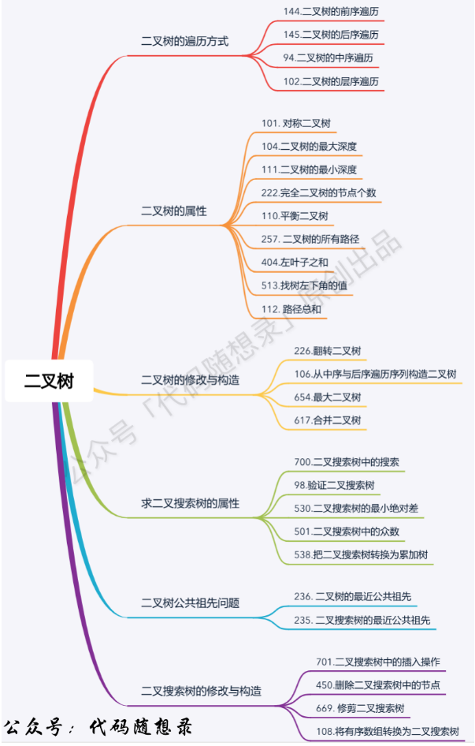


### 二叉树的前中后序遍历

#### 144.二叉树的前序遍历

给出了递归和迭代两个做法

迭代的做法主要是

* 将当前节点出栈
* 将当前节点的**右节点，左节点**依次入栈，这样就先遍历左节点了


```c++
/**
 * Definition for a binary tree node.
 * struct TreeNode {
 *     int val;
 *     TreeNode *left;
 *     TreeNode *right;
 *     TreeNode() : val(0), left(nullptr), right(nullptr) {}
 *     TreeNode(int x) : val(x), left(nullptr), right(nullptr) {}
 *     TreeNode(int x, TreeNode *left, TreeNode *right) : val(x), left(left), right(right) {}
 * };
 */
class Solution {
    void traversal_recursive(vector<int>& ans, TreeNode* cur){
        if(cur == nullptr){
            return;
        }
        // 中左右
        ans.push_back(cur->val);
        traversal_recursive(ans,cur->left);
        traversal_recursive(ans,cur->right);
        return;
    }
    void traversal_iteration(vector<int>& ans, TreeNode* root){
        stack<TreeNode*> stk;
        stk.push(root);
        while(!stk.empty()){
            // stk.top() 就是当前节点
            TreeNode* cur = stk.top();
            stk.pop();

            if(cur == nullptr) continue;
            ans.push_back(cur->val);
            stk.push(cur->right);
            stk.push(cur->left);
        }
    }
public:
    vector<int> preorderTraversal(TreeNode* root) {
        vector<int> ans;

        //traversal_recursive(ans,root);

        traversal_iteration(ans,root);
        return ans;
    }
};
```


#### 94.二叉树的中序遍历

从二叉树的中序遍历开始，迭代就变得有些麻烦了

不过还好，有一套模拟dfs的模板

在每个循环中做如下几件事

* 从father开始遍历左子树并入栈
* 找到第一个拥有右子树的节点，将第一个右子树节点入栈
* 操作过的节点出栈
* 以右子树节点为father，重新开始循环

```c++
/**
 * Definition for a binary tree node.
 * struct TreeNode {
 *     int val;
 *     TreeNode *left;
 *     TreeNode *right;
 *     TreeNode() : val(0), left(nullptr), right(nullptr) {}
 *     TreeNode(int x) : val(x), left(nullptr), right(nullptr) {}
 *     TreeNode(int x, TreeNode *left, TreeNode *right) : val(x), left(left), right(right) {}
 * };
 */
class Solution {
    void recursive(vector<int>& ans, TreeNode* cur){
        if(cur == nullptr) return;

        recursive(ans,cur->left);
        ans.push_back(cur->val);
        recursive(ans,cur->right);

        return;
    }

    void iteration(vector<int>& ans, TreeNode* root){
        stack<TreeNode*> stk;
        stk.push(root);
        while(!stk.empty()){
            //将所有左子树压栈
            while(stk.top()->left != nullptr){
                stk.push(stk.top()->left);
            }
            

            // 遍历右子树：找到第一个可以使用的右子树并推入，并根据这个节点遍历其左子树
            while(!stk.empty() && stk.top()->right == nullptr){
                ans.push_back(stk.top()->val);
                stk.pop();
            }

            if(stk.empty()) break;

            assert(stk.top()->right != nullptr);

            
            // 中序遍历，首先推入father,并将不为null
            TreeNode* cur = stk.top();
            stk.pop();            
            ans.push_back(cur->val);
            stk.push(cur->right);
        }
    }
public:
    vector<int> inorderTraversal(TreeNode* root) {
        if(root == nullptr) return {};
        vector<int> ans;

        iteration(ans,root);

        return ans;
    }
};
```


#### 145.二叉树的后序遍历（看一眼，迭代的写法）

理论上，后序遍历相比于之前不同之处在于，根节点最后判断，因此需要额外添加一个`lastVisited`指针，如果上一个访问的节点是当前节点右节点，则将该节点放入ans并pop。

这样做的原因其实是我们在dfs的时候，没有能够在第一次访问该节点时（前序）与第二次访问该节点时（中序）对其做出操作。它在被访问了两次之后直接又被放回了栈，这使得

* 在后序遍历时，栈中同时包含根节点和右节点，右节点回溯时需要一个额外的判断来标记栈中节点是否可以出栈。

  > 前序遍历在访问了根节点之后就可以出栈
  >
  > 中序遍历因为访问右子树之后不需要根节点，因此可以在第一次回溯时，直接出栈，同时将右子树推入栈。
  >
  > 可以发现前序遍历和中序遍历分别是占用了”出栈并推入左子树右子树“和”出栈并推入右子树“两个timing
  >
  > 但是后序遍历访问右子树之后还需要根节点，此时显然仅通过左右子树的推入timing并不足以区分。
  >
  > 除了visitedNode，我们还可以统一使用特殊符号来推入，详细见下一节


```c++
    void reverse_iteration(vector<int>& ans, TreeNode* root){
        if(!root) return;
        stack<TreeNode*> stk;
        TreeNode* lastVisited = nullptr;
        stk.push(root);

        while(!stk.empty()){
            // 遍历左子树：绿色标记
            while(stk.top()->left != nullptr){
                stk.push(stk.top()->left);
            }
            assert(stk.top()->left == nullptr);
            lastVisited = nullptr;
            
            // 回溯：红色标记
            while(!stk.empty() && 
            (stk.top()->right == lastVisited // 从右子树刚上来
            || stk.top()->right == nullptr))// 没有右子树
            {
                cout << stk.top()->val << endl;
                lastVisited = stk.top();
                ans.push_back(stk.top()->val);
                stk.pop();
            }
            if(stk.empty()) return; //这里一定需要判断
            
            // 蓝色表示这一个部分
            assert(stk.top()->right != nullptr);
            stk.push(stk.top()->right);
        }
    }
```

另一个简单的写法（后一章）的我直接放在这，使用箭头表示了遍历过程，并标记数字为push顺序

* 分别使用绿色箭头代表左子树循环，红色箭头代表右子树回溯，以及蓝色箭头代表push右子树
* 使用粉色数字代表这个箭头属于第几次总的while

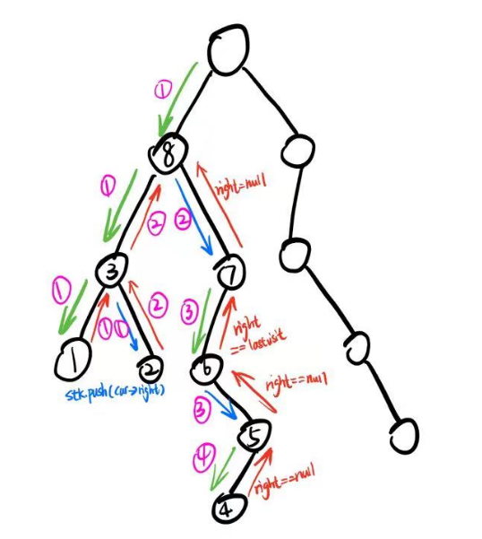

```c++
/**
 * Definition for a binary tree node.
 * struct TreeNode {
 *     int val;
 *     TreeNode *left;
 *     TreeNode *right;
 *     TreeNode() : val(0), left(nullptr), right(nullptr) {}
 *     TreeNode(int x) : val(x), left(nullptr), right(nullptr) {}
 *     TreeNode(int x, TreeNode *left, TreeNode *right) : val(x), left(left), right(right) {}
 * };
 */
class Solution {
    void recursive(vector<int>& ans, TreeNode* cur){
        if(cur == nullptr) return;

        recursive(ans,cur->left);
        recursive(ans,cur->right);
        ans.push_back(cur->val);
        return;
    }

    void iteration(vector<int>& ans, TreeNode* root){
        stack<TreeNode*> stk;
        stk.push(root);
        while(!stk.empty()){
            if(stk.top() != nullptr){
                TreeNode* temp = stk.top();
                stk.pop();

                stk.push(temp);
                stk.push(nullptr);
                if(temp->right) stk.push(temp->right);
                if(temp->left) stk.push(temp->left);
            }else{
                stk.pop();//弹出nullptr
                ans.push_back(stk.top()->val);
                stk.pop();
            }
        }
    }
public:
    vector<int> postorderTraversal(TreeNode* root) {
        if(root == nullptr) return{};
        vector<int> ans;
        iteration(ans,root);
        return ans;
    }
};
```


#### 一个简单的迭代遍历写法

为了模拟递归，我们可以用一个nullptr来标记

* 如果栈中出现了nullptr，那么代表它的下一个节点**已经访问过但是未处理**

这样我们就能很容易的模拟递归一样的写法而不需要使用dfs来遍历了


**这里就相当于对于每个节点，左中右的访问顺序做了一个重排布，然后在每个节点成为“中”的时候将它的值push**

因此要注意重排的顺序，左中右重排为`右中NULL左`

同时注意，只有子节点不为才能推入，因为我们推入的节点全是可能成为根节点的，nullptr只用来标记。


如下的这些方法虽然简单，但是耗时很高。


**前序**

```c++
vector<int> preorderTraversal(TreeNode* root) {
    vector<int> result;
    stack<TreeNode*> st;
    if (root != NULL) st.push(root);
    while (!st.empty()) {
        TreeNode* node = st.top();
        if (node != NULL) {
            st.pop();
            if (node->right) st.push(node->right);  // 右
            if (node->left) st.push(node->left);    // 左
            st.push(node);                          // 中
            st.push(NULL);
        } else {
            st.pop();
            node = st.top();
            st.pop();
            result.push_back(node->val);
        }
    }
    return result;
}
```

**中序**

```c++
void iteration2(vector<int>& ans, TreeNode* root){
    stack<TreeNode*> stk;

    stk.push(root);

    while(!stk.empty()){
        if(stk.top()){
            TreeNode* temp = stk.top();
            stk.pop();

            //中序：左中右
            if(temp->right) stk.push(temp->right);
            stk.push(temp);stk.push(nullptr);
            if(temp->left) stk.push(temp->left);
        }else{
            stk.pop();
            ans.push_back(stk.top()->val);
            stk.pop();
        }
    }
}
```

**后序**

```c++
void iteration(vector<int>& ans, TreeNode* root){
    stack<TreeNode*> stk;
    stk.push(root);
    while(!stk.empty()){
        if(stk.top() != nullptr){
            TreeNode* temp = stk.top();
            stk.pop();

            stk.push(temp);
            stk.push(nullptr);
            if(temp->right) stk.push(temp->right);
            if(temp->left) stk.push(temp->left);
        }else{
            stk.pop();//弹出nullptr
            ans.push_back(stk.top()->val);
            stk.pop();
        }
    }
}
```


### 二叉树的层序遍历：queue

这就很简单了，bfs

#### 102.二叉树的层序遍历

我使用了一个pair来标记到底在第几层

其实可以使用一层一层的压入queue然后统一的使用for读取queue中的元素，压入ans并构造新的queue

```c++
/**
 * Definition for a binary tree node.
 * struct TreeNode {
 *     int val;
 *     TreeNode *left;
 *     TreeNode *right;
 *     TreeNode() : val(0), left(nullptr), right(nullptr) {}
 *     TreeNode(int x) : val(x), left(nullptr), right(nullptr) {}
 *     TreeNode(int x, TreeNode *left, TreeNode *right) : val(x), left(left), right(right) {}
 * };
 */
class Solution {
public:
    vector<vector<int>> levelOrder(TreeNode* root) {
        if(root==nullptr) return {};
        // (层，值)
        queue<pair<int,TreeNode*>> q;
        q.push({0,root});
        vector<vector<int>> ans;
        while(!q.empty()){
            pair<int,TreeNode*> cur = q.front();
            q.pop();
            // 压入
            if(ans.size() <= cur.first){
                ans.push_back({cur.second->val});
            }else{
                ans[cur.first].push_back(cur.second->val);
            }
            if(cur.second->left)
                q.push({cur.first+1,cur.second->left});
            if(cur.second->right)
                q.push({cur.first+1,cur.second->right});
        }

        return ans;
    }
};
```


#### 107.二叉树的层序遍历

只需要反转上一节的答案即可

```c++
/**
 * Definition for a binary tree node.
 * struct TreeNode {
 *     int val;
 *     TreeNode *left;
 *     TreeNode *right;
 *     TreeNode() : val(0), left(nullptr), right(nullptr) {}
 *     TreeNode(int x) : val(x), left(nullptr), right(nullptr) {}
 *     TreeNode(int x, TreeNode *left, TreeNode *right) : val(x), left(left), right(right) {}
 * };
 */
class Solution {
public:
    vector<vector<int>> levelOrderBottom(TreeNode* root) {
        if(root == nullptr) return {};
        vector<vector<int>> ans;

        queue<TreeNode*> q;

        q.push(root);

        while(!q.empty()){
            int size = q.size();
            vector<int> temp;
            for(int i = 0; i < size;i++){
                temp.push_back(q.front()->val);
                if(q.front()->left)
                    q.push(q.front()->left);
                if(q.front()->right)
                    q.push(q.front()->right);
                q.pop();
            }
            ans.push_back(temp);
        }

        std::reverse(ans.begin(),ans.end());
        return ans;
    }
};
```


#### 199.二叉树的右视图

入队每一层，保留每一层最后一个

```c++
/**
 * Definition for a binary tree node.
 * struct TreeNode {
 *     int val;
 *     TreeNode *left;
 *     TreeNode *right;
 *     TreeNode() : val(0), left(nullptr), right(nullptr) {}
 *     TreeNode(int x) : val(x), left(nullptr), right(nullptr) {}
 *     TreeNode(int x, TreeNode *left, TreeNode *right) : val(x), left(left), right(right) {}
 * };
 */
class Solution {
public:
    vector<int> rightSideView(TreeNode* root) {
        if(root == nullptr) return {};
        vector<int> ans;

        queue<TreeNode*> q;

        q.push(root);

        while(!q.empty()){
            int size = q.size();
            for(int i = 0; i < size;i++){
                if(i == size-1){
                    ans.push_back(q.front()->val);
                }
                if(q.front()->left)
                    q.push(q.front()->left);
                if(q.front()->right)
                    q.push(q.front()->right);
                q.pop();
            }
        }

        return ans;


    }
};
```


#### 637.二叉树的层平均值

做层平均即可

```c++
/**
 * Definition for a binary tree node.
 * struct TreeNode {
 *     int val;
 *     TreeNode *left;
 *     TreeNode *right;
 *     TreeNode() : val(0), left(nullptr), right(nullptr) {}
 *     TreeNode(int x) : val(x), left(nullptr), right(nullptr) {}
 *     TreeNode(int x, TreeNode *left, TreeNode *right) : val(x), left(left), right(right) {}
 * };
 */
class Solution {
public:
    vector<double> averageOfLevels(TreeNode* root) {
        if(root == nullptr) return {};
        vector<double> ans;

        queue<TreeNode*> q;

        q.push(root);

        while(!q.empty()){
            int size = q.size();
            double sum = 0;
            for(int i = 0; i < size;i++){
                sum += q.front()->val;
                if(q.front()->left)
                    q.push(q.front()->left);
                if(q.front()->right)
                    q.push(q.front()->right);
                q.pop();
            }

            ans.push_back(sum/size);
        }

        return ans;
    }
};
```


#### 429.N叉树的层序遍历

left和right变成了数组


```c++
/*
// Definition for a Node.
class Node {
public:
    int val;
    vector<Node*> children;

    Node() {}

    Node(int _val) {
        val = _val;
    }

    Node(int _val, vector<Node*> _children) {
        val = _val;
        children = _children;
    }
};
*/

class Solution {
public:
    vector<vector<int>> levelOrder(Node* root) {
        if(!root) return {};
        vector<vector<int>> ans;


        queue<Node*> q;

        q.push(root);
        while(!q.empty()){
            int size = q.size();
            vector<int> temp(size);
            for(int i = 0; i < size;i++){
                temp[i] = q.front()->val;

                for(auto &a : q.front()->children){
                    q.push(a);
                }
                q.pop();
            }
            ans.push_back(temp);
        }

        return ans;
    }
};
```


#### 515.在每个树行中找最大值

给定一棵二叉树的根节点 `root` ，请找出该二叉树中每一层的最大值。

```c++
/**
 * Definition for a binary tree node.
 * struct TreeNode {
 *     int val;
 *     TreeNode *left;
 *     TreeNode *right;
 *     TreeNode() : val(0), left(nullptr), right(nullptr) {}
 *     TreeNode(int x) : val(x), left(nullptr), right(nullptr) {}
 *     TreeNode(int x, TreeNode *left, TreeNode *right) : val(x), left(left), right(right) {}
 * };
 */
class Solution {
public:
    vector<int> largestValues(TreeNode* root) {
        if(root == nullptr) return {};
        vector<int> ans;

        queue<TreeNode*> q;

        q.push(root);

        while(!q.empty()){
            int size = q.size();
            int mmax = INT_MIN;
            for(int i = 0; i < size;i++){
                mmax = mmax < q.front()->val ? q.front()->val : mmax;
                if(q.front()->left)
                    q.push(q.front()->left);
                if(q.front()->right)
                    q.push(q.front()->right);
                q.pop();
            }

            ans.push_back(mmax);
        }
        return ans;
    }
};
```


#### 116.填充每个节点的下一个右侧节点指针

这个题目利用了层序遍历的性质，因为是一层的统一改变。

```c++
/*
// Definition for a Node.
class Node {
public:
    int val;
    Node* left;
    Node* right;
    Node* next;

    Node() : val(0), left(NULL), right(NULL), next(NULL) {}

    Node(int _val) : val(_val), left(NULL), right(NULL), next(NULL) {}

    Node(int _val, Node* _left, Node* _right, Node* _next)
        : val(_val), left(_left), right(_right), next(_next) {}
};
*/

class Solution {
public:
    Node* connect(Node* root) {
        if(!root) return root;
        
        queue<Node*> q;
        q.push(root);

        while(!q.empty()){
            int size = q.size();

            for(int i = 0; i < size;i++){
                Node* cur = q.front();
                q.pop();
                if(i+1==size){
                    cur->next = nullptr;
                }else{
                   cur->next = q.front();
                }
                if(cur->left)
                    q.push(cur->left);
                if(cur->right)
                    q.push(cur->right);
            }
        }


        return root;
    }
};
```


#### 117.填充每个节点的下一个右侧节点指针II

不好意思，上一节我额外判定了一下左右孩子是否为空，上一节完美二叉树用不上，这一节用上了

```c++
/*
// Definition for a Node.
class Node {
public:
    int val;
    Node* left;
    Node* right;
    Node* next;

    Node() : val(0), left(NULL), right(NULL), next(NULL) {}

    Node(int _val) : val(_val), left(NULL), right(NULL), next(NULL) {}

    Node(int _val, Node* _left, Node* _right, Node* _next)
        : val(_val), left(_left), right(_right), next(_next) {}
};
*/

class Solution {
public:
    Node* connect(Node* root) {
        if(!root) return root;
        
        queue<Node*> q;
        q.push(root);

        while(!q.empty()){
            int size = q.size();

            for(int i = 0; i < size;i++){
                Node* cur = q.front();
                q.pop();
                if(i+1==size){
                    cur->next = nullptr;
                }else{
                   cur->next = q.front();
                }
                if(cur->left)
                    q.push(cur->left);
                if(cur->right)
                    q.push(cur->right);
            }
        }


        return root;
    }
};
```


#### 104.二叉树的最大深度

这一题dfs或者bfs都可

但是bfs迭代写起来更简单

dfs迭代注意需要维护层信息

```c++
/**
 * Definition for a binary tree node.
 * struct TreeNode {
 *     int val;
 *     TreeNode *left;
 *     TreeNode *right;
 *     TreeNode() : val(0), left(nullptr), right(nullptr) {}
 *     TreeNode(int x) : val(x), left(nullptr), right(nullptr) {}
 *     TreeNode(int x, TreeNode *left, TreeNode *right) : val(x), left(left), right(right) {}
 * };
 */
class Solution {
public:
    int maxDepth(TreeNode* root) {
        if (root == NULL) return 0;
        int depth = 0;
        queue<TreeNode*> que;
        que.push(root);
        while(!que.empty()) {
            int size = que.size();
            depth++; // 记录深度
            for (int i = 0; i < size; i++) {
                TreeNode* node = que.front();
                que.pop();
                if (node->left) que.push(node->left);
                if (node->right) que.push(node->right);
            }
        }
        return depth;
    }
};
```


#### 111. 二叉树的最小深度

bfs比dfs好做，体现在这一题bfs可以剪枝（第一次发现一个左右孩子都为null的就可以退出了）


```c++
/**
 * Definition for a binary tree node.
 * struct TreeNode {
 *     int val;
 *     TreeNode *left;
 *     TreeNode *right;
 *     TreeNode() : val(0), left(nullptr), right(nullptr) {}
 *     TreeNode(int x) : val(x), left(nullptr), right(nullptr) {}
 *     TreeNode(int x, TreeNode *left, TreeNode *right) : val(x), left(left), right(right) {}
 * };
 */
class Solution {
public:
    int minDepth(TreeNode* root) {
        if (root == NULL) return 0;
        int depth = 0;
        queue<TreeNode*> que;
        que.push(root);
        while(!que.empty()) {
            int size = que.size();
            depth++; // 记录深度
            for (int i = 0; i < size; i++) {
                TreeNode* node = que.front();
                que.pop();
                if(!node->left && !node->right) return depth;
                if (node->left) que.push(node->left);
                if (node->right) que.push(node->right);
            }
        }
        return depth;
    }
};
```


#### 559. N叉树的最大深度

```c++
/*
// Definition for a Node.
class Node {
public:
    int val;
    vector<Node*> children;

    Node() {}

    Node(int _val) {
        val = _val;
    }

    Node(int _val, vector<Node*> _children) {
        val = _val;
        children = _children;
    }
};
*/

class Solution {
public:
    int maxDepth(Node* root) {
        if(!root) return 0;
        queue<Node*> q;
        q.push(root);
        int depth = 0;
        while(!q.empty()){
            depth++;
            int size = q.size();

            for(int i = 0; i < size; i++){
                for(int j = 0; j < q.front()->children.size();j++){
                    if(q.front()->children[j]){
                        q.push(q.front()->children[j]);
                    }
                }
                q.pop();
            }

        }
        return depth;
    }
};
```


#### 222. 完全二叉树节点数


### 226. 翻转二叉树：遍历的综合

这一题就是之前的综合

既可以使用迭代

又可以使用后序遍历

还可以使用层序遍历


```c++
/**
 * Definition for a binary tree node.
 * struct TreeNode {
 *     int val;
 *     TreeNode *left;
 *     TreeNode *right;
 *     TreeNode() : val(0), left(nullptr), right(nullptr) {}
 *     TreeNode(int x) : val(x), left(nullptr), right(nullptr) {}
 *     TreeNode(int x, TreeNode *left, TreeNode *right) : val(x), left(left), right(right) {}
 * };
 */
class Solution {
    // 迭代
    void reverse_recursive(TreeNode* cur){
        if(!cur) return;
        swap(cur->left,cur->right);
        reverse_recursive(cur->left);
        reverse_recursive(cur->right);
    }

	// 后序遍历
    void reverse_iteration(TreeNode* root){
        if(!root) return;
        // bfs做起来很简单，使用dfs后序遍历试试

        stack<TreeNode*> stk;
        TreeNode* lastVisited = nullptr;
        stk.push(root);

        while(!stk.empty()){
            // 遍历左子树
            while(stk.top()->left != nullptr){
                stk.push(stk.top()->left);
            }
            assert(stk.top()->left == nullptr);
            lastVisited = nullptr;
            while(!stk.empty() && 
            (stk.top()->right == lastVisited
            ||
            stk.top()->right == nullptr)){
                lastVisited = stk.top();
                swap(stk.top()->right,stk.top()->left);
                stk.pop();
            }
            if(stk.empty()) return;
            assert(stk.top()->right != nullptr);

            stk.push(stk.top()->right);
        }
    }
public:
    TreeNode* invertTree(TreeNode* root) {
        reverse_iteration(root);
        return root;
    }
};
```


### 树结构之间的比较:queue

#### 101.对称二叉树：跳出遍历思维，配对节点

这一题首先不能使用层序遍历，因为你首先得算上nullptr，然后nullptr的左右也该设置为nullptr，这样就出现一个问题，终止条件很难搞

其实这里的一个方法就是直接**使用遍历存到一个vector里面**， 然后使用vector来判断是否对称。

但是具体来说，该使用哪个遍历呢？

以下图为例


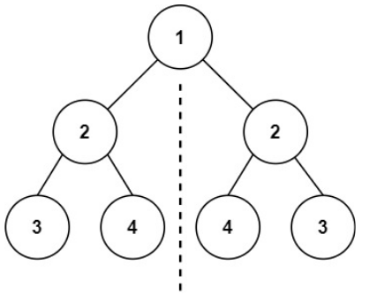

前序为:1234243，此时根节点的左右孩子分别在1和4的位置


后序遍历为:3424321，此时根节点的在最后，相当于前序反过来了

我们可以发现，这显然不是我们想要的，我们希望根节点在中间，左右孩子依次在左右排开

中序遍历:3241423


**这样想就错了，嘿嘿**，理由是一样的，对于非完美树，无法判断身为null的左右孩子应不应该添加。

这道题别想复杂了，它并没有说**每个子节点作为根节点，都对称**

因此，只要对根节点左右孩子分别遍历就好了

==这里的难点在于跳出各自遍历的思维，只需要配对对应的节点，单独判断，然后使得这些节点的孩子相互对应起来即可==

```c++
/**
 * Definition for a binary tree node.
 * struct TreeNode {
 *     int val;
 *     TreeNode *left;
 *     TreeNode *right;
 *     TreeNode() : val(0), left(nullptr), right(nullptr) {}
 *     TreeNode(int x) : val(x), left(nullptr), right(nullptr) {}
 *     TreeNode(int x, TreeNode *left, TreeNode *right) : val(x), left(left), right(right) {}
 * };
 */
class Solution {
    // 无论是迭代还是递归都是将两个应当有对应关系的节点放在一起比较

    // 直接对根节点的两个孩子做比较即可，通常使用队列来将具有对应关系的两个节点放在一起
    bool iteration(TreeNode* root){
        if(!root) return true;// 空节点一定对称

        queue<TreeNode*> q;
        q.push(root->left);
        q.push(root->right);

        // 每一次循环并不代表一层，而是一组节点的比较与push
        // 这样做通过更细粒度的机制避免了为nullptr添加nullptr的孩子，而是在发现节点为null时不记录
        while(!q.empty()){
            TreeNode* left = q.front();
            q.pop();
            TreeNode* right = q.front();
            q.pop();

            if(!left && !right){
                continue;
            }

            if((!left && right) or (!right && left)){
                return false;
            }

            assert(left && right);
            if(left->val != right->val) return false;
            q.push(left->right);
            q.push(right->left);

            q.push(left->left);
            q.push(right->right);
        }

        return true;

    }
    

    // 比较左子树的节点和右子树的节点是否相同
    bool recursive(TreeNode* left, TreeNode* right){
        if(!left && !right) return true;//都为空则都相同

        if((!left && right) || (left && !right)){
            return false;//一个是空，一定不相同
        }

        if(left->val != right->val) return false;//都存在但值不同

        //此时他们都存在且值相同，
        //注意left一定在根节点左子树，right一定在根节点右子树，我们需要给出他们孩子的比较

        return recursive(left->left,right->right) && recursive(left->right,right->left);
    }
public:
    bool isSymmetric(TreeNode* root) {
        if(!root) return true;
        return iteration(root);
    }
};
```


#### 100.相同的树：与101相似

```c++
/**
 * Definition for a binary tree node.
 * struct TreeNode {
 *     int val;
 *     TreeNode *left;
 *     TreeNode *right;
 *     TreeNode() : val(0), left(nullptr), right(nullptr) {}
 *     TreeNode(int x) : val(x), left(nullptr), right(nullptr) {}
 *     TreeNode(int x, TreeNode *left, TreeNode *right) : val(x), left(left), right(right) {}
 * };
 */
class Solution {
    bool recursive(TreeNode* left, TreeNode* right){
        if(!left && !right) return true;

        if((!left && right) || (!right && left)){
            return false;
        }

        assert(left && right);

        return left->val == right->val ? recursive(left->left,right->left) && recursive(left->right,right->right) : false;
    }


    bool iteration(TreeNode* a, TreeNode* b){
        queue<TreeNode*> q;
        q.push(a);
        q.push(b);
        while(!q.empty()){
            TreeNode* left = q.front();
            q.pop();
            TreeNode* right = q.front();
            q.pop();

            if(!left && !right) {
                continue;
            }

            if((!left && right) || (!right && left)) return false;

            assert(left && right);

            if(left->val != right->val){
                return false;
            }

            q.push(left->left);
            q.push(right->left);
            q.push(left->right);
            q.push(right->right);
        }

        return true;
    }
public:
    bool isSameTree(TreeNode* p, TreeNode* q) {
        return iteration(p,q);
    }
};
```


#### 572. 另一棵树的子树

我使用了两种方法：

* 方法一就是逐个匹配树
* 方法二是使用前序或者后序遍历来遍历树，并记录，使用KMP匹配

```c++
/**
 * Definition for a binary tree node.
 * struct TreeNode {
 *     int val;
 *     TreeNode *left;
 *     TreeNode *right;
 *     TreeNode() : val(0), left(nullptr), right(nullptr) {}
 *     TreeNode(int x) : val(x), left(nullptr), right(nullptr) {}
 *     TreeNode(int x, TreeNode *left, TreeNode *right) : val(x), left(left), right(right) {}
 * };
 */
class Solution {
    // 方法一：暴力：遍历主树每一个节点作为根节点，然后以这个根节点为树与subRoot比较
        // 比较以target为根节点的子树是否与subRoot一致
    bool cmp(TreeNode* target, TreeNode* subRoot){
        queue<TreeNode*> q;

        TreeNode* lastVisited = nullptr;

        q.push(target);
        q.push(subRoot);


        while(!q.empty()){
            TreeNode* curA = q.front();q.pop();
            TreeNode* curB = q.front();q.pop();
            
            if(!curA && !curB){
                continue;
            }
            if((!curA && curB) || (!curB && curA)){
                return false;
            }

            assert(curA && curB);
            if(curA->val != curB->val){
                return false;
            }
            q.push(curA->left);
            q.push(curB->left);
            q.push(curA->right);
            q.push(curB->right);
        }

        return true;
    }
        // 遍历主树的每个节点作为target
    bool dfs(TreeNode* root, TreeNode* subRoot){
        // 此处使用后序遍历
        stack<TreeNode*> stk;
        TreeNode* LastVisited;
        stk.push(root);

        while(!stk.empty()){
            // 遍历左子树
            while(stk.top()->left != nullptr){
                stk.push(stk.top()->left);
            }

            assert(stk.top()->left == nullptr);
            LastVisited = nullptr;
            while(!stk.empty() && (stk.top()->right == LastVisited||stk.top()->right == nullptr)){
                if(cmp(stk.top(),subRoot)){
                    return true;
                }
                LastVisited = stk.top();
                stk.pop();
            }
            if(stk.empty()) break;
            assert(stk.top()->right);

            stk.push(stk.top()->right);
        }
        
        return false;
    }


    // 方法二：使用中序遍历方法，用vector存储，然后使用KMP匹配
    // 为什么不能前序或者后序，因为根节点没有被包在左右子树中间，这就导致匹配的树可以只有被匹配的左子树或者右子树，而能匹配成功

    // 但是后来我发现，中序才是不能用的，我们可以使用lnull和rnull的标记来让前序和后序遍历变得可匹配，但是沟槽的数据给了一条142的例子使得中序遍历不可用
    enum SpecialMarker{
        lnull = INT_MIN,
        rnull = INT_MAX,
        FLAG = INT_MIN+1
    };
    //被弃用
    void constructTreeInMidOrder(TreeNode* target, vector<int>& ans){
        if(!target) return;
        stack<TreeNode*> stk;
        stk.push(target);
        
        while(!stk.empty()){
            // 遍历左子树
            while(stk.top()->left!=nullptr){
                stk.push(stk.top()->left);
            }

            assert(stk.top()->left==nullptr);
            ans.push_back(lnull);
            // 如果当前节点右子树为空，则将当前节点记录并抛出
            while(!stk.empty() && !stk.top()->right){
                assert(stk.top()->right == nullptr);
                ans.push_back(stk.top()->val);
                ans.push_back(rnull);
                stk.pop();
            }
            if(stk.empty()) return;
            // 抛出当前节点并将其右节点加入stack作为下一个开始遍历的对象
            assert(stk.top()->right);
            TreeNode* cur = stk.top();
            stk.pop();
            ans.push_back(cur->val);
            stk.push(cur->right);
        }

    }
    void constructTreeInFrontOrder(TreeNode* target, vector<int>& ans){
        if(!target) return;
        stack<TreeNode*> stk;
        stk.push(target);
        
        while(!stk.empty()){
            TreeNode* cur = stk.top();
            stk.pop();
            ans.push_back(cur->val);
            if(cur->right){
                stk.push(cur->right);
            }
            if(cur->left){
                stk.push(cur->left);
            }else{
                ans.push_back(lnull);
            }
            if(!cur->right){
                ans.push_back(rnull);
            }
        }

    }

    bool KMP(TreeNode* root, TreeNode* subRoot){
        vector<int> seq;
        // 构建序列
        constructTreeInFrontOrder(subRoot, seq);
        int subTreeSize = seq.size();
        seq.push_back(FLAG);
        constructTreeInFrontOrder(root, seq);
        /*
        for(int i = 0; i < seq.size();i++){
            if(seq[i] == lnull){
                cout << "lnull ";
            }else if(seq[i] == rnull){
                cout << "rnull ";
            }else if(seq[i] == FLAG){
                cout << "space ";
            }else
                cout << seq[i] << " ";
        }
        cout << endl;
        */
        // KMP匹配
        vector<int> nxt(seq.size());
        nxt[0] = 0;
        for(int i = 1; i < seq.size();i++){
            int k = nxt[i-1];

            while(k > 0 && seq[k] != seq[i]){
                k = nxt[k-1];
            }

            if(k == 0){
                if(seq[k] == seq[i]){
                    nxt[i] = 1;
                }else{
                    nxt[i] = 0;
                }
            }else{
                nxt[i] = k+1;
            }

            if(nxt[i] == subTreeSize){
                return true;
            }
        }

        return false;
    }
    
public:
    bool isSubtree(TreeNode* root, TreeNode* subRoot) {
        //return dfs(root,subRoot);
        return KMP(root, subRoot);
    }
};
```


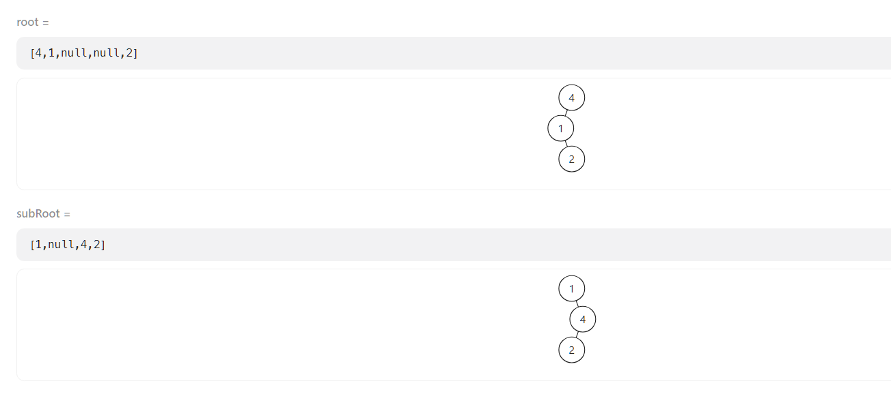

这就是那个中序遍历不可用的例子

这里的顺序都是

> `lnull,1,lnull,2,rnull,4,rnull`


