# 0 DP分类

动态规划的常见分类

1. **根据维度分类**
   - **一维 DP**：涉及一维决策序列，常见于单序列问题，如最大子数组和、最长递增子序列等。
   - **二维 DP**：涉及两个维度的决策，常见于两个序列的对比问题，如编辑距离、最长公共子序列等。
   - **多维 DP**：涉及多个维度的决策问题，常用于更复杂的情境，如状态压缩DP，涉及多个因素的决策。
2. **根据问题类型分类**
   - **背包DP**（0-1背包，完全背包，多重背包，混合背包，二位费用背包，分组背包，有依赖的背包，泛化物品的背包，背包问题变种：输出方案，求方案数，求最优方案总数，第k优解）
   - **区间DP**：它在分阶段地划分问题时，与阶段中元素出现的顺序和*由前一阶段的哪些元素合并而来*有很大的关系。
   - **DAG**上DP：有向无环图上的DP问题
   - **树形DP**：在树上进行的 DP。由于树固有的递归性质，树形 DP 一般都是递归进行的。
   - **状压DP**：通过将状态压缩为整数来达到优化转移的目的。
   - **数位DP**：数位是指把一个数字按照个、十、百、千等等一位一位地拆开，关注它每一位上的数字。如果拆的是十进制数，那么每一位数字都是 0~9，其他进制可类比十进制。
   - **连通性状压DP**：要求我们记录状态的连通性信息的状压DP问题
   - **计数DP**：其实是一种类似DP的记忆化搜索问题
   - **动态DP**：解决树上带有点权/边权修改操作的DP问题
   - **概率DP**：解决概率问题与期望问题
3. **根据方法和技巧分类**
   - **递归分解**：自顶向下的处理方式，解决重叠子问题，用递归实现。
   - **Tabulation (表格化)**：自底向上的处理方式，通常用迭代实现，并填充一个 DP 表。
4. **DP优化方法**
   * Memory 优化：通过压缩状态空间来减少内存使用。
   * 单调队列/单调栈优化：利用单调性进行优化，减少状态转移的复杂度。
   * 斜率优化：用于解决某些具有凸性或凹性状态转移方程的问题。
   * 四边形不等式优化：用于加速某些区间 DP 的计算。
   * 状态设计优化：通过合理设计状态来减少状态数和转移复杂度。


==Dynamic Programming has its roots and basis in recursion==

动态规划其实就是找到一种对解空间的搜索途径，保证探索少量的区域就能获得最优解。

能用动态规划解决的问题，需要满足三个条件：**最优子结构，无后效性和子问题重叠**

* **最优子结构**的不同体现在两个方面：
  1. 原问题的最优解中涉及多少个子问题；
  2. 确定最优解使用哪些子问题时，需要考察多少种选择。
* **无后效性**：已经求解的子问题，不会再受到后续决策的影响。
* **子问题重叠**：如果有大量的重叠子问题，我们可以用空间将这些子问题的解存储下来，避免重复求解相同的子问题，从而提升效率。


#### 递归分解: Top-Down Approach

所谓递归分解，就是以目标（通常是min-max优化目标）为树顶，建立一颗状态树，父节点是状态到达地，子节点是上一个可能的状态。


通过分解目标，通常能够获得一个状态转移方程以及一个递归范式。

状态转移方程决定了每个父节点状态如何选取子节点状态信息

递归范式构建了子节点状态到父节点状态的转移方法


#### 循环分解： Bottom-Up Approach

对于复杂问题，在分析完了Top-Down approach 之后，你可以将之转换为Top-Down Approach，以期望使用循环来解决，减少递归的函数开销。


# 1. 类Optimization问题：Min-Max问题

这类问题所求的通常是一个Min-Max的优化问题

暴力解法就是找到所有可能的组合

动态规划利用其局部最优就是全局最优的特性，简化了搜索过程。


在看到一个新问题的时候，永远的想着

* ==What is the main problem that we're trying to solve==
* ==Can we break this down into smaller but repeated sub problems==
  * Sub problem should also look like a reflection of the main problem

## 问题描述

考虑一个台阶，每个台阶有自己的cost，每次能走1-2个台阶，第一步可以走一个台阶也可以走两个台阶，求最少cost。


## 1 递归分解问题:Top Down Process

### 递归关系：Define Recurrence Relation


如图所示，

* `min Cost(i)`代表到第`i`步需要的最少cost


可以发现，因为题目的“每个台阶能走一或二步”，因此到达每个台阶的上一个台阶只有两种可能，这建立了其递归范式，我们搜索这一个状态时，只需要搜索与其相连的两个状态即可


同时，我们能知道，`min Cost(i) = min (min Cost(i-1), min Cost(i-2)) + cost(i)`

这个状态转换方程，描述了只选择子代最小的一个作为跳板。需要注意的是，这里当`i-1 < 0`或者`i-2 < 0`时，代表的当前状态其实可以是一个初始状态。


### 递归方案：Recursive Solution From Recurrence Relation

基于上面获得的递归关系，我们可以写出一个递归函数伪代码

设定初始状态
$$
\min Cost(0) = cost[0]
\\
\min Cost(1) = cost[1]
$$

```c++
int cost[];
const minCostClimbingStairs = function(cost);

// return min cost to step 
int function(int step){
    if(step == 0) return cost[0];
    if(step == 1) return cost[1];
    return std::min(function(step-1), function(step-2)) + cost[step]; 
}

```


这就是一个Recurrence Solution


### 状态数组：Utilize memorization

可以发现，我们在上面，需要某个step的状态时，我们会直接计算，实际上每个step的状态都是固定的，计算了一次之后就可以永久使用


* 解决重复计算

  


首先，通过状态树，我们先看看是什么东西被重复计算了（在这个问题中可能很简单，但是复杂问题需要这么分析）


通过这里我们可以发现，仅仅列了两层，`min Cost(i-2)`和`min Cost(i-3)`都被重复计算了一次，这代表以这两个状态为父节点的树都是重复计算。


因此，我们实际上需要建立的是`min Cost(i)`的状态数组

```c++
vector<int> minCost(N+1, -1);

int function(int step){
    // Initial state
    if(step == 0) {
        minCost[step] = cost[0];
        return minCost[step];
    }
    if(step == 1) {
        minCost[step] = cost[1];
        return minCost[step];
    }
    
    
    // State Transfer
    if(minCost[step-1] == -1){
        minCost[step-1] = function(step-1);
    }
    if(minCost[step-2] == -1){
        minCost[step-2] = function(step-2);
    }
    
    minCost[step] =  std::min(minCost[step-1],minCost[step-2]) + cost[step]
    return minCost[step]; 
}
```


## 2. 迭代分解问题： Bottom Up Approach

### 算法

为了消除递归调用堆栈的消耗，使用迭代来解决。


在递归中，我们根据目标以及能够到达目标状态的步来计算需要的状态，这就是Top Down的方法。


还有一种方法，因为递归也是递归到Bottom（初始状态），然后从Bottom开始计算，recall到Top的。

为了消除函数调用的开销，我们可以直接从Bottom开始计算，直接计算到Top，即直接从初始状态开始计算其可达的下一状态，直到计算到我们所需的状态。


注意，一般来说Top-Down的方法都会比较容易理解，因此Bottom-Up的方法通常是基于Top-Down方法演化而来


**将已经计算的状态记录起来，等待之后计算状态时需要就取用**，这就是迭代Bottom Up的本质。可以发现，这要求

* 计算状态的顺序需要特别规定，未计算的状态不能依赖于未计算的状态


```c++
vector<int> dp(N+1, -1);
vector<int> cost;
for(int i = 0; i < N; i++){
	// Initial state
    if(i < 2){
        dp[i] = cost[i];
    }
    else{
        dp[i] = min(dp[i-1],dp[i-2]) + cost[i];
    }
}
```


### 空间优化


可以发现，这里更新时只使用了前两个，因此实际上dp数组可以优化为两个变量。


## 3. DP的一般步骤


1. 使用Top-Down分析，写出状态转移方程与递归范式
2. 使用Bottom-Up，dp数组存储状态，改进Top Down的函数调用开销
3. 根据递归范式发掘未来状态所需已计算状态的范围，优化dp内存空间。


# 2. 更复杂的DP问题

接下来要讨论的是一个更复杂的动态规划问题。这个问题与以往讨论的优化问题不同。

这里的问题不是传统意义上的优化问题，不是寻找最小值或最大值。目标不是从所有可能的解中挑选一个最优解。

相反，**这个问题需要探索所有可能的选项，并将它们组合在一起。而不是在生成所有可行解之后选择一个正确的答案，我们需要生成所有可能的解决方案并将它们组合起来。**


## 问题描述


考虑一个N*N的棋盘，Knight在(r,c)的地方。国际象棋中Knight走L型格，因此它可以有八个位置。

将这个Knight移动 K 步，问仍然在棋盘内的概率为多少


## 解决思路

* ==What is the main problem that we're trying to solve==
  * 概率
* ==Can we break this down into smaller but repeated sub problems==
  * 不知道


当然，第二个问题需要通过建立递归关系来发现

### 递归相关变量

                                                                                                                                                                                                                                                                                                                                                                                                                                                                                                                                                                                                                                                                                                                                                                                                                                                                                                                                                                                                                                                                                                                                                                                                                                                                                                                                                                                                                                                                                                                                                                                                                                                                                                                                                                                                                                                                                                                                                                                                                                                                                                                                                                                                                                                                                                                                                                                                                                                                                                                                                                                                                                                                                                                                                                                                                                                                                                                                                                                                                                                                                                                                                                                                                                                                                                                                                                                                                                                                                                                                                                                                                                                                                                                                                                                                                                                                                                                                                                                                                                                                                                                                                                                                                                                                                                                                                                                                                                                                                                                                                                                                                                                                                                                                                                                                                                                                                                                                                                                                                                                                                                                                                                                                                                                                                                                                                                                                                                                                                                                                                                                                                                                                                                                                                                                                                                                                                                                                                                                                                                                                                                                                                                                                                                                                                                                                                                                                                                                                                 


现在题目给出了这么几个参数

* $r,c$: Knight的初始位置
* $K$: 总共走的步数
* $N$: 网格的大小


### 递归关系

如果推导过一遍概率的话，其实不难发现，

* 第K+1步的概率与第K步的概率有关
* 抛开条件概率，如果看每一步在每一个格子的概率的话，可以发现中间的格子在棋盘上的概率为1，周边的格子在棋盘上的概率更小

因此，实际上要计算总概率，K，r，c都是计算当前步需要的值


递归关系如下，我们使用`KnightProb(K,r,c)`来代表**第K步位于(r,c)上在棋盘上的概率**


我们可以发现，在这个递归中，我们可以复用的概率为**同一个K下，同一个格子的概率**


同时可以获得状态转移方程为
$$
KnightProb(K,r,c) = \sum^8_{i=1}\frac{1}{8}KnightProb(K-1,r+\Delta r_i,c+\Delta c_i)
$$
，其中八个方向

$(\Delta r_i,\Delta c_i) \in$`[[-2，-1],[-2，1],[-1，2],[1，2],[2，1],[2，-1],[1，-2],[-1，-2]]`


### 边界条件

对于每一个`KnightProb(K,r,c)`，我们需要考虑这么几种情况

* K = 0，那么一定返回1

* K > 0

  * $0 \leq r < N $ & $0 \leq c < N$: 

    返回

    $KnightProb(K,r,c) = \sum^8_{i=1}\frac{1}{8}KnightProb(K-1,r+\Delta r_i,c+\Delta c_i)$

  * 否则返回0


### 递归下的伪代码解答


```c++
vector<pair<int,int>> direction{{-2，-1},{-2，1},{-1，2},{1，2},{2，1},{2，-1},{1，-2},{-1，-2}};


float KnightProb(int K, int r, int c){
    if(K == 0){
        return 1;
    }
    float ProbThisStep = 0;
    if(0 <= r < N && 0 <= c < N){
        for(int i = 0; i < 8;i++){
            ProbThisStep += 1/8 * KnightProb(K-1,r+direction[i].first, c+direction[i].second);
        }
    }
    else
        return 0;
    
    return ProbThisStep;
}
                                
                                
                         
```

这样我们就完成了递归模拟。


### Bottom Up

可以发现，这个递归模拟的复杂度会很高，实际上，这个数量级是$8^K$


可以发现，$8^K$数量级的计算，明显远远大于$N^2$的格子数，

==**这意味着，在同一个K下，某一个(r,c)位置一定会被重复计算多次，无论这个位置是通过何种路径被到达的**==


如上图，我们初始位置给定（K=0的位置），当进行到K=3时，实际上已我们已经几乎需要到网格中所有位置的概率了。在这里一共就走3步，因此我们可以从K=3开始，在这里计算每个网格**下一步在网格内的概率**，然后依此计算出K=2。


不难反推出Bottom Up Approach，以及我们如何优化这个计算

DP数组为一个`(K+1)*N*N`的数组，我们需要的数据就在`DP[K][r][c]`

* 显然K=0时，都是DP[k]=1

```c++
float calculate_this_pos(int K,int r,int c){
    float res = 0;
    for(int i = 0; i < 8; i++){
        int new_r = r+direction[i].first;
        int new_c = c+direction[i].second;
        float son_res = 0;
        if(0 <= new_r < N && 0 <= new_c < N){
            son_res = DP[K-1][new_r][new_c];
        }else{
            son_res = 0;
        }
        
        res += 1/8 *  son_res;
    }
}


// K
for(int i = 1; i < K+1; i++){
    // 遍历格子
    for(int j = 0; j < N; j++){
        for(int p = 0;p < N;p++){
            DP[i][j][p] = calculate_this_pos(i,j,p);
        }
    }
}
```


这样，我们将$8+8^2+...+8^K$次计算变成了$K*N*N$次计算。

事实上，我们Bottom up的方法就是为第K+1步，计算好了其可能需要的所有第K步走到该格的概率，而K=0就是初始状态。


### Memory Optimization

实际上，我们并不需要`K*N*N`的DP表，因为我们在K的时候只会用到$K-1$的表，因此我们只需要一个$2*N*N$​的表即可（用以翻转更新）。


另外，我们在计算到$i==K$​的时候，实际上不需要计算其他的格子。

```c++
float calculate_this_pos(int r,int c){
    float res = 0;
    for(int i = 0; i < 8; i++){
        int new_r = r+direction[i].first;
        int new_c = c+direction[i].second;
        float son_res = 0;
        if(0 <= new_r < N && 0 <= new_c < N){
            son_res = DP[K-1][new_r][new_c];
        }else{
            son_res = 0;
        }
        
        res += 1/8 *  son_res;
    }
    return res;
}


bool current_dpPage = true;
vector<vector<vector<int>>> DP(2,vector<vector<int>>(N, vector<int>(N)));

// Initial State
for(int i = 0;i < N;i++){
    for(int j = 0; j < N;j++){
        DP[0][i][j] = 1;
    }
}

// K-1次
for(int i = 0; i < K-1; i++){
    current_dpPage = !current_dpPage;
    // 遍历格子
    for(int j = 0; j < N; j++){
        for(int p = 0;p < N;p++){
            DP[static_cast<int>(!current_dpPage)][j][p] = calculate_this_pos(j,p);
        }
    }
}
```


# 3. 背包问题

## 一维费用背包

### 3.1 0-1背包：仅能选择一次，反向遍历

> 有 $n$ 个物品和一个容量为 $W$ 的背包，每个物品有重量$w_i$和价值$v_i$​两种属性，要求选若干物品放入背包使得背包中物品的**总价值最大**且背包中物品的**总重量不超过背包的容量**


==由于每个物品只有两种可能的状态（取与不取），因此为01背包问题==

设定

DP状态$DP[i][j]$为前$i$个物品在容量$j$下的最大价值。
$$
DP[i][j] = max(DP[i-1][j],DP[i-1][j-w_i]+v_i)
$$

* $DP[i-1][j]$代表不取第$i$个物品的价值
* $DP[i-1][j-w_i]$代表取第$i$个物品的价值，它主要是通过前$i-1$个物品，最大容量为$j-w_i$的状态下转移而来。

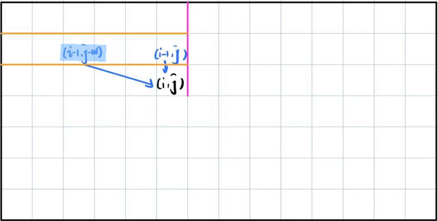


可以发现，对于$DP[i][j]$，影响它的只有$DP[i-1][j'],0\leq j'\leq j$这一行。

也就是说，只与**上一个物品更新得到的状态有关**


因此，这个二维表示可以简化为一个**遍历物品，每次更新value**的一维数组。

下图中，蓝线代表$i-1$的状态能够影响的$i$中的状态

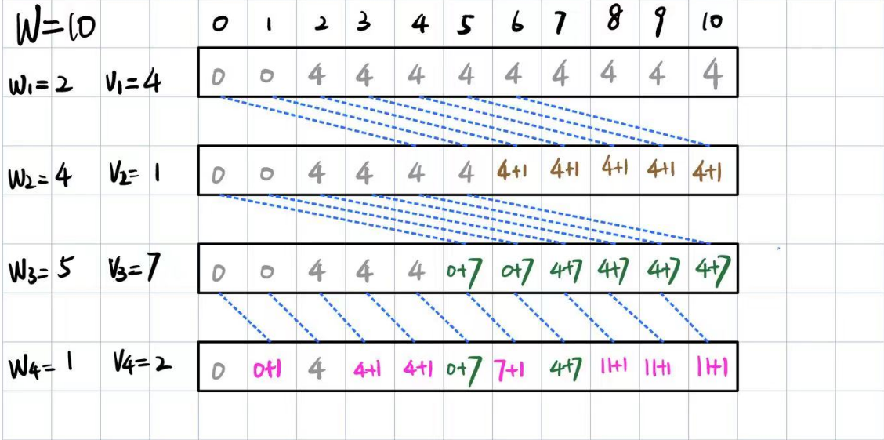

我们可以发现如下性质

* 一个物品只会影响到$w \geq w_i$位置的状态（显而易见）


因此，这个一维数组的访问/修改应该为

```c++
//初始化DP为0

//更新
for(int i = 1; i < N+1;i++){
    // 这个是错误枚举顺序，因为你现在更新的可能会影响未来使用的，所以你只能从W开始枚举
    //for(int j = w[i]; j < W+1;j++){
    for(int j = W; j >= w[i]; j--){
        DP[i][j] = max(DP[j],DP[j-w[i]] + v[i]) ;
    }
}
```


### 3.2 完全背包：无次数限制，正向遍历

> 完全背包模型每个物品可以选取无限次

这里唯一的区别就是

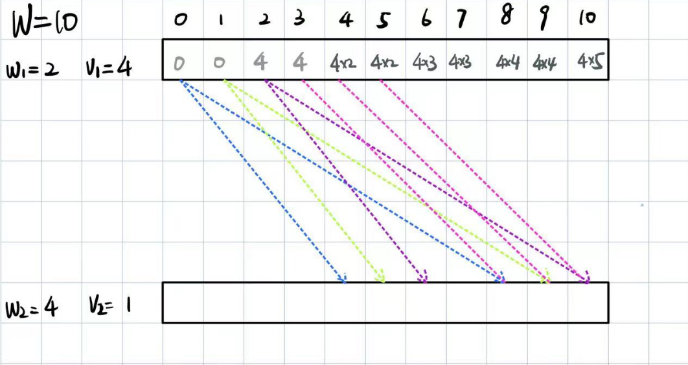

* 因为能够使用多次，因此$i-1$物品的状态数组**能够影响多个$i$状态数组的部分**


DP可以写为
$$
\begin{flalign}
DP[i][j] &= \max(DP[i-1][j],DP[i-1][j-w_i] + v[i],DP[i-1][j-2*w_i]+2*v_i,...)

\\

&= \max_{k=0}(DP[i][j-k\times w_i] + k\times v_i)

\end{flalign}
$$


```c++
for(int i = 1; i <= N; i++){
    for(int j = W; j >= w[i]; j--){
        for(int k = 0; k*w[i] <= j; k++){
            DP[j] = max(DP[j], DP[j-k*w[i]]+k*v[i]);
        }
    }
}
```

这个写法使用了三重循环，其实还可以更简化。

我们可以发现
$$
DP[j] = max(DP[j], DP[j-k*w[i]]+k*v[i]);
$$
实际上就是相当于对

$DP[j-w[i]],DP[j-2*w[i]],...$这些位置做类似01背包的状态转移

**如果我们提前更新了这些位置的最优状态，我们就不需要遍历了**

这就是我们新的写法

```c++
for(int i = 1; i < N+1;i++){
    //这是01背包的计算顺序，为了不让当前计算状态之前的状态先被计算从而影响当前状态，毕竟每个物品只能被使用一次
    //for(int j = W; j >= w[i]; j--){
    
    // 这是完全背包的写法，我们就期望对第i个物品彻底的更新整个状态数组，因为可以选取多次
    for(int j = w[i]; j < W+1;j++){
        DP[i][j] = max(DP[j],DP[j-w[i]] + v[i]) ;
    }
}
```


### 3.3 多重背包：规定次数数组

多重背包也是 0-1 背包的一个变式。与 0-1 背包的区别在于每种物品有 $k_i$ 个，而非一个。

实际上，我们立刻就可以获得两个解法

* 展开成01背包

* 使用完全背包的未优化版本即可：计算复杂度未$W * \sum^{N-1}_{i=0}  (W/w[i]*s_i)$（每个物品在每个状态上查询其所有可能的使用个数并选择最优）

  这里因为我们对于位置j的状态，**不能保证前面的状态最优（选择了一个这个工件）就代表当前状态最优**，因此只能对每个j都搜索一遍，并且为了防止前面的状态更新影响当前状态更新，因此从W开始遍历。

  ```c++
  for(int i = 1; i <= N; i++){
      for(int j = W; j >= w[i]; j--){
          for(int k = 0; k*w[i] <= j && k <= cnt[i]; k++){
              DP[j] = max(DP[j], DP[j-k*w[i]]+k*v[i]);
          }
      }
  }
  ```


上面两个其实复杂度是一致的


#### 完全展开为01背包优化：二进制分组优化

如果我们选择展开为01背包，那么我们会面对一个问题，例如物品$i$有4个$\{i_1,i_2,i_3,i_4\}$

完全展开后，可以得到如下几个组合

$\{i_1,i_2,i_3,i_4,\{i_1,i_2\},\{i_1,i_3\},\{i_2,i_2\},...\}$

可以发现，这里虽然$i_1 == i_2 == i_3 == i_4$，但是展开后是当作不同的物品来更新的，这使得无效计算变得很多。


使用二进制方法，我们能够将$cnt[i]$个物品$i$**分解成选取上具有不同意义的若干个物品**


例如

6 = 1 + 2 + 3

$1,2,3$的组合包括了6个物品中选1,2,3,1+3,2+3,1+2+3，即所有的可能选中个数，同时忽略了上面提到的重复。


#### 单调队列优化

https://www.acwing.com/problem/content/6/

> 接下来是简要的写一写，具体可以看https://www.bilibili.com/video/BV1354y1C7SF/?spm_id_from=333.337.search-card.all.click&vd_source=61f56e9689aceb8e8b1f51e6e06bddd9
>
> 这里的关键点不在于单调队列，而在于找到一个通用评判标准解耦之前所提到的**“不能保证前面的状态最优（选择了一个这个工件）就代表当前状态最优”**

在上文中，我们可以发现，以往我们是从后往前对每个state遍历$s_i$次，来寻找这个state的最大值，这使得我们需要$W * (W/w[i]*s_i)$的复杂度来处理每一个物品。


而这里随着$s_i$越大,可以发现我们也没有重复计算，因为每个相同位置上加上的value是不同的，具体可以由下图发现

* $DP[k]$的更新仅仅与$DP[k-a*weight[i]]$有关，其中a为一个整数

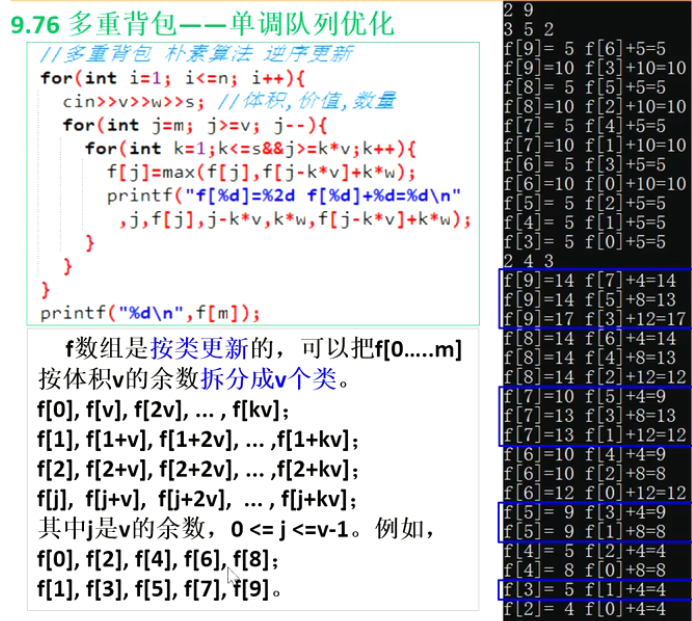


为了解决这个问题，我们需要处理以下几步

* **找到一种新的评判方法**，使得我们不需要计算出具体的值就能判断$s_i$​​个位置的优劣（贡献度）

  假设当前位置为$k,k\in [0,W]$，$W$为总共的Weight上限。

  我们将$\{k-a*w[i]\}$集合认为与当前位置在同一类，集合中至多有$s_i$个位置能够影响当前位置

  为了评判当前集合中任意两个位置$(a,b)$对当前位置$k$的贡献，我们首先考虑原始的比较
  $$
  DP[a] + (k-a)/w[i] * v[i] > DP[b] + (k-b)/w[i] * v[i]
  $$

  * DP[a]为$i-1$时的DP表
  * $(k-a)/w[i] * v[i]$为它能够增加的价值，这个值不大于$s_i$

  这意味着位置$a$位置比$b$位置对于$k$位置的**贡献更高**

​	稍加变换（移位），我们可以将$k$消除，让这个不等式变得更为通用（与k无关
$$
DP[a]  - DP[b] < (a-b)/w[i] * v[i]
$$
​	因此，我们可以使用这个关系来评判同一类中我们应该选出哪一个位置是最好的，而不用计算它。


* **使用$s_i$长度的滑动窗口与单调队列保证不重复计算**

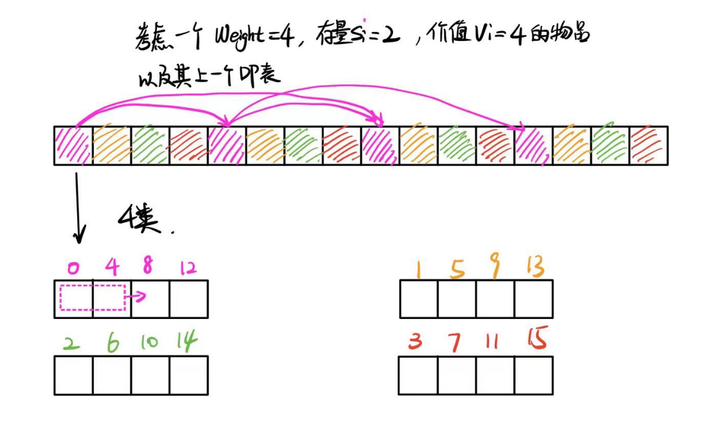


```c++
#include <iostream>
#include <vector>
#include <deque>
#include <algorithm>
using namespace std;

int main() {
    int N, W;
    cin >> N >> W;
    
    vector<int> Weight(N);
    vector<int> Value(N);
    vector<int> Amount(N);
    
    for (int i = 0; i < N; i++) {
        cin >> Weight[i] >> Value[i] >> Amount[i];
    }
    
    vector<int> DP(W + 1, 0);
    
    // For each object
    for (int i = 0; i < N; i++) {
        vector<int> LastDP = DP;
        // 分类
        for (int j = 0; j < Weight[i]; j++) {
            deque<int> MonotonicQueue;
            //在某一类中
            for (int k = j; k <= W; k += Weight[i]) {
                // 窗口外踢出单调栈
                while (!MonotonicQueue.empty() && MonotonicQueue.front() < k - Amount[i] * Weight[i]) {
                    MonotonicQueue.pop_front();
                }
                
                
                // 将当前位置的值加入单调队列，删除所有贡献比它小的值
                while (!MonotonicQueue.empty() 
                        && LastDP[k] - LastDP[MonotonicQueue.back()] >= (k - MonotonicQueue.back()) / Weight[i] * Value[i]) {
                    MonotonicQueue.pop_back();
                }
                MonotonicQueue.push_back(k);
                
                
                // 使用队头最大贡献位置更新当前位置
                if(!MonotonicQueue.empty())
                    DP[k] = LastDP[MonotonicQueue.front()] + (k - MonotonicQueue.front()) / Weight[i] * Value[i];
                
                
            }
        }
    }
    
    cout << DP[W] << endl;
    return 0;
}

```

sb卡时间，我都不知道卡在哪里，但是用了双指针替代deque就好了。

```c++
#include <iostream>
using namespace std;
const int N = 1010,M = 20010;
int n,m;
int f[N][M];
int q[M],hh,tt;
int main () {
    cin >> n >> m;
    for (int i = 1;i <= n;i++) {
        int w,v,s;
        cin >> w >> v >> s;
        for (int r = 0;r <= w - 1;r++) {
            hh = 0,tt = -1;
            for (int j = r;j <= m;j += w) {
                while (hh <= tt && q[hh] < j - w * s) hh++;
                while (hh <= tt && f[i - 1][q[tt]] + (j - q[tt]) / w * v <= f[i - 1][j]) tt--;
                q[++tt] = j;
                f[i][j] = f[i - 1][q[hh]] + (j - q[hh]) / w * v;
            }
        }
    }
    cout << f[n][m] << endl;
    return 0;
}

```


### 3.4 混合背包： 前三种混合

> 混合背包就是01背包，完全背包，多重背包的混合体，也就是有的物品只能取一次，有的物品能取多次，有的物品能取无限次


做法很简单,因为这三个问题都可以转换为在每个状态上选与不选这个物品，融合一下即可

```c++
for (int i = 1; i <= n; i++) {
  if (cnt[i] == 0) {  // 如果数量没有限制使用完全背包的核心代码
    for (int weight = w[i]; weight <= W; weight++) {
      dp[weight] = max(dp[weight], dp[weight - w[i]] + v[i]);
    }
  } else {  // 物品有限使用多重背包的核心代码，它也可以处理0-1背包问题
    for (int weight = W; weight >= w[i]; weight--) {
      for (int k = 1; k * w[i] <= weight && k <= cnt[i]; k++) {
        dp[weight] = max(dp[weight], dp[weight - k * w[i]] + k * v[i]);
      }
    }
  }
}
```

或者优化版

```c++
int DP[W+1];
int CNT[N];
for(int i = 0;i < N; i++){
	// 01背包
    if(CNT[i] == 1){
        for(int j = W; j >= w[i]; j--){
            DP[j] = max(DP[j], DP[j-w[i]]+v[i]);
        }
    }
    // 完全背包
    else if (CNT[i] == -1){
        for(int j = w[i]; j <= W; j++){
            DP[j] = max(DP[j], DP[j-w[i]]+v[i]);
        }
    }
    //多重背包
    else
    {
        int LastDP[W+1];
        memcpy(LastDP,DP,(W+1)*sizeof(int));
        
        //分类
        for(int j = 0; j < w[i];j++){
            //对于每一类
            
            // 双指针单调队列
            int q[W+1];
            int head = 0;
            int tail = -1;
            for(int k = j; k <= W; k+= w[i]){
                
                // 超出滑动窗口范围
                while(head<= tail && q[head] < k-w[i]*v[i]){
                    head++;
                }
                
                // 删除所有小于当前节点的内容并插入
                while(head <= tail && LastDP[k] - LastDP[q[tail]] < (k-q[tail])/w[i]*v[i]){
                    tail--;
                }
                q[tail++] = k;
                
                // 用最大值更新
                DP[k] = LastDP[q[head]] + (k-q[head])/w[i]*v[i];
            }
        }
    }
}
```


> https://www.luogu.com.cn/problem/P1833
>
> 可以试试，没账号懒得登陆了


## 二维费用背包

### 3.5 二维费用背包

> 其实就是约束+1考虑物品的总重量不超过W，总体积不超过V，求最高价值
>
> `DP[W][V]`即可，这里强制你不能使用`DP[N][W][V]`了，很容易爆


状态转移是
$$
DP[w][v] = max(DP[w][v], DP[w-w[i]][v-v[i]] + value[i]);
$$
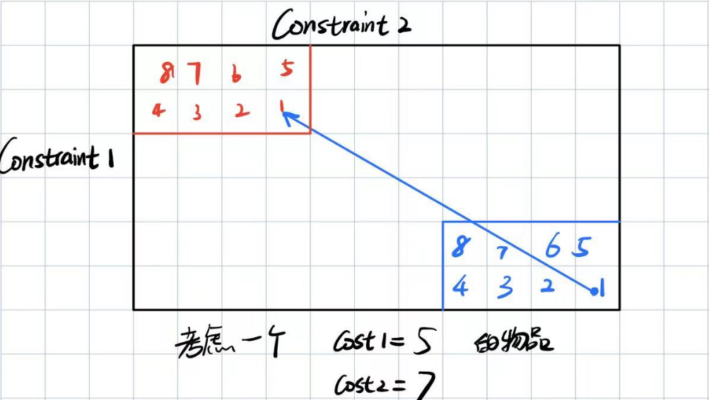

可以发现，红色部分为影响蓝色部分的DP表，二维费用需要遵循两个规律

* 01背包遵循从大到小更新

* 为了辨明两个constraint在从大到小更新时，他们的相对顺序是否有影响，我们以一个极端更新情况来举例

  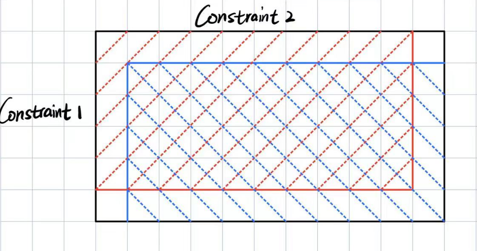

  **可以发现，Constraint之间遍历的顺序并不影响，因为这一整个被更新的边缘一定不会是已更新部分**

==因此，可以断言，二位费用背包与一维费用背包具有同样的更新性质==


> https://www.luogu.com.cn/problem/P1855

```c++
#include<iostream>
#include<vector>
#include<cmath>
using namespace std;

int main() {
    int N, M, T;
    cin >> N >> M >> T;

    vector<vector<int>> DP(M + 1, vector<int>(T + 1, 0));

    for (int i = 0; i < N; i++) {
        int mi, ti;
        cin >> mi >> ti;

        for (int j = M; j >= mi; j--) {
            for (int k = T; k >= ti; k--) {
                if (j <= M && k <= T && j - mi >= 0 && k - ti >= 0)
                    DP[j][k] = max(DP[j][k], DP[j - mi][k - ti] + 1);
            }
        }
    }
    cout << DP[M][T] << endl;
    return 0;


}
```


## 分组背包

### 3.6 分组背包

> 考虑有N组物品，第`k`组有`CNT[k]`的物品，我们用$t_{k,i}$表示物品在第k组第i个
>
> 每一组只能选择一件物品，每个物品有value和weight
>
> 求背包装载物品的最大value

其实很简单，

原本01背包中，我们在每一个状态DP[w]上**从后往前**搜索**当前状态是否选中该物品**，

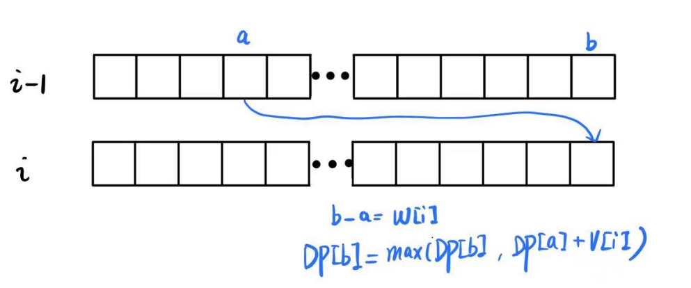

现在仍然可以看作一个01背包，不过是否选中的变为了是否选中当前组。

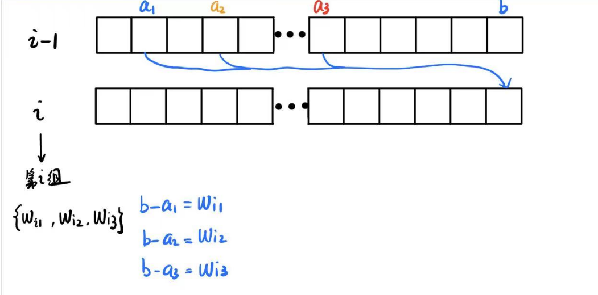

在每个状态上，考虑第 $i$ 组，这一组中能够根据$i-1$ 组的DP状态，有若干种不同的可能转移方式（之前都是只有一种转移方式），最大的区别仅在于此。


因此，遍历的顺序是需要注意的

```c++
for(int group_id = 0; group_id < N; group_id++)
{
    for(int w = W; w >= 0;w--)//这里也可以是w>= mingroup_weight，但是没必要
    {
        for(int obj = 0; obj < obj_count_in_group[group_id];obj++)
        {
         	if(w-weight[group_id][obj]]>= 0)
                DP[w] = max(DP[w],
                            DP[w-weight[group_id][obj]] + value[group_id][obj]);
        }
    }
}
```


### 3.7 有依赖的背包

> 金明一共有n元浅，想要买m个物品
>
> 第i个物品价格为$v_i$，重要度为$p_i$
>
> 有些物品是某个主物件的附件，要买这个物品必须购买他的主件
>
> 目标是让所有购买物品的$v_i\times p_i$​之和最大

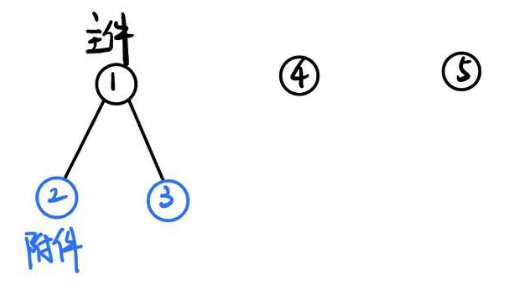


#### 简单的单依赖背包

> 单依赖背包指的是，只有主件和附件，附件不再拥有附件
>
> ==附件仅能对应一个主件==

这个问题可以使用类似独热编码的方式，变换为分组问题


具体来说，将所有物品分类，每一类是主件及其附件

以{主件，附件1，附件2}为例子，**我们可以将这一类转换为一组**

{	{主件},

​	{主件，附件1}，

​	{主件，附件2}，

​	{主件，附件1，附件2}，

}

这样，我们就能将其看作分组背包，每一组选择**一种可能的组合**，对应于原来每一组选择**一个物品**


#### 多依赖背包

##### (单主件要求）左转树形DP

> 附件也有附件

多依赖背包通常是一个**树形dp**问题

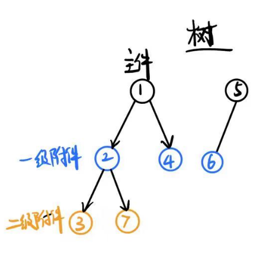


**动态规划数组**：使用 `dp[node][w]` 表示选择以 `node` 为根的子树，在容量为 `w` 时的最大价值。

**递归求解**：自底向上递归计算每个子树的最大价值。这样就符合了**父节点无条件选取，子节点有条件选取**的约束。


##### (多主件要求)右转DAG DP问题

> 一个附件可能需要多个主件才能选中

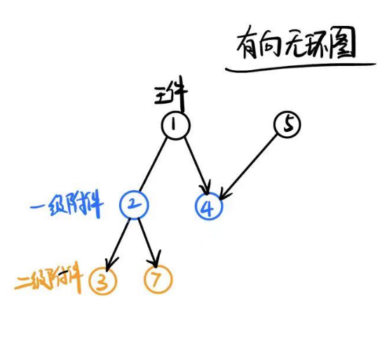


### 泛化物品的背包

在这种背包中，背包重量不能超过W

考虑一共有N个物品，每个物品的价值取决于其重量，$value[i] = h(w[i])$

问如何获得最大价值


这个题其实可以看作一个分组背包，一个物品就是一组，遍历其所有可能的重量更新当前state。


##  背包问题变种

### 输出方案

### 求方案数

### 求最优方案总数

### 第k优解


# 4. 区间DP

# 5. DAG上的DP

# 6. 树形DP

# 7. 状压DP

# 8. 数位DP

# 9. 插头DP

# 10 计数DP

# 11 动态DP

# 12 概率DP

# 13 DP优化总结


