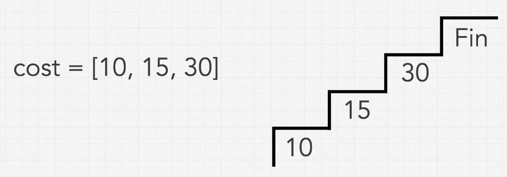
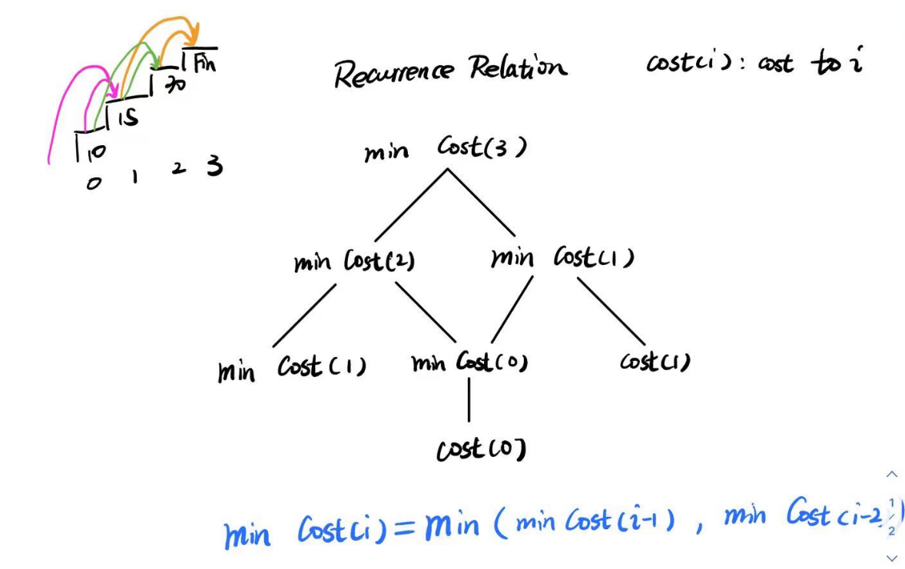
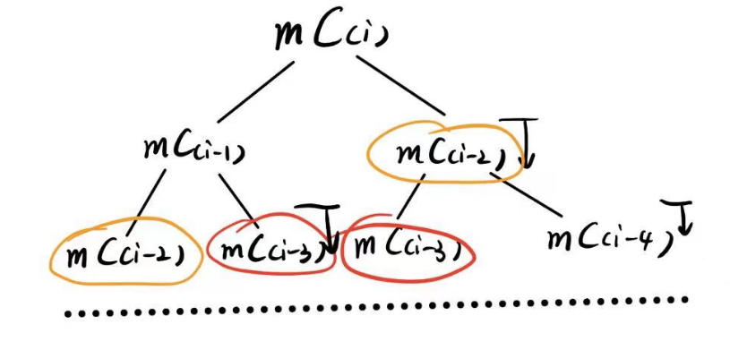
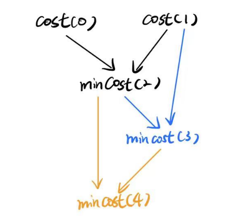
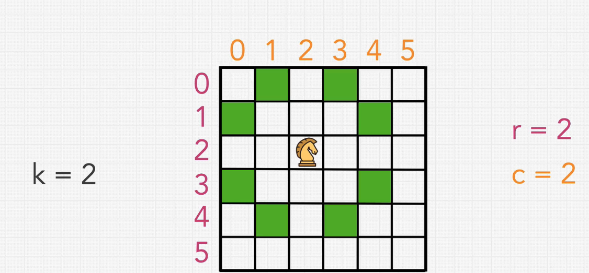
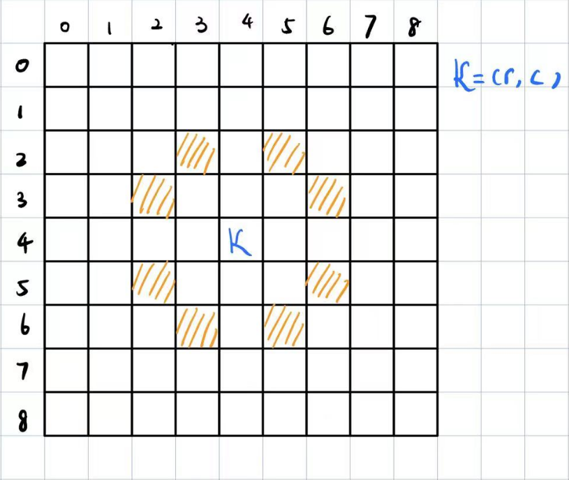
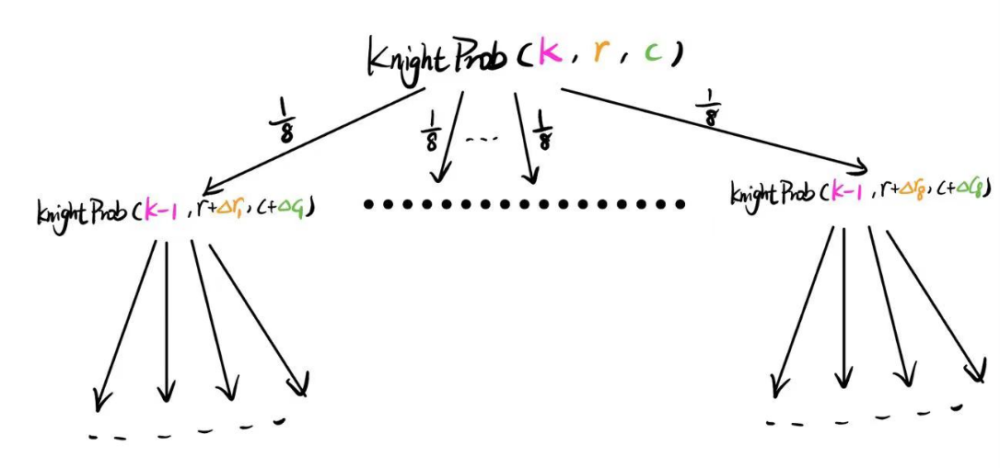
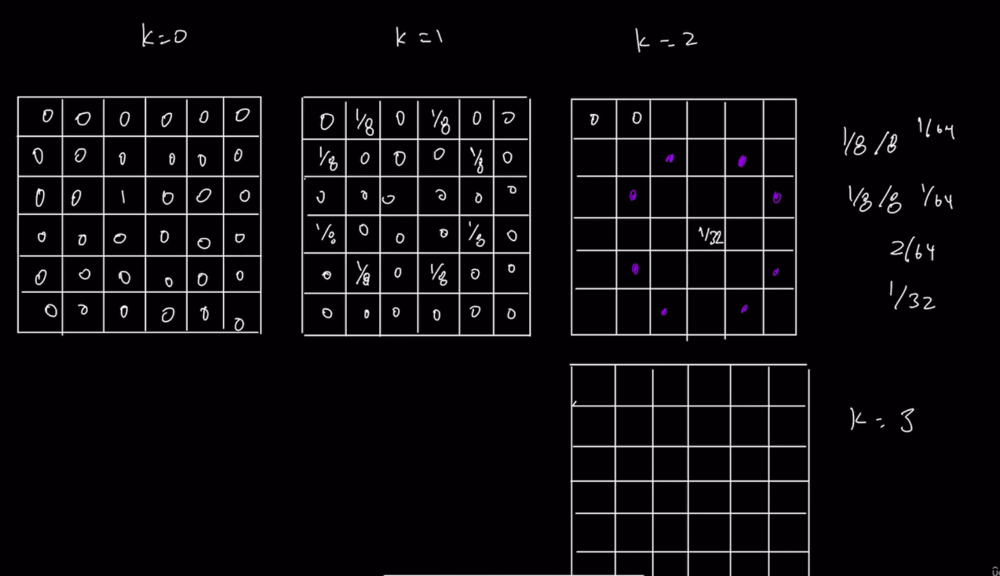

# 0 DP分类

动态规划的常见分类

1. **根据维度分类**
   - **一维 DP**：涉及一维决策序列，常见于单序列问题，如最大子数组和、最长递增子序列等。
   - **二维 DP**：涉及两个维度的决策，常见于两个序列的对比问题，如编辑距离、最长公共子序列等。
   - **多维 DP**：涉及多个维度的决策问题，常用于更复杂的情境，如状态压缩DP，涉及多个因素的决策。
2. **根据问题类型分类**
   - **数值型 DP**：主要关注数值计算，如计算最大利润、最小成本等。
   - **决策型 DP**：主要关注选择的最优化，如何选择才能达到最优解。
   - **计数型 DP**：计算满足某种条件的方案数。
   - **坐标型 DP**：通常在矩阵或棋盘上进行，涉及从一个点到另一个点的路径问题。
   - **区间型 DP**：涉及序列或字符串中的区间，通常需要考虑所有可能的子区间。
   - **背包问题**：包括 0-1 背包、完全背包、多重背包等，涉及资源分配和选择的组合优化。
   - **树形 DP**：在树结构上进行的动态规划，每个节点的状态依赖于其子节点的状态。
3. **根据方法和技巧分类**
   - **递归分解**：自顶向下的处理方式，解决重叠子问题，用递归实现。
   - **Tabulation (表格化)**：自底向上的处理方式，通常用迭代实现，并填充一个 DP 表。


==Dynamic Programming has its roots and basis in recursion==

动态规划其实就是找到一种对解空间的搜索途径，保证探索少量的区域就能获得最优解。


#### 递归分解: Top-Down Approach

所谓递归分解，就是以目标（通常是min-max优化目标）为树顶，建立一颗状态树，父节点是状态到达地，子节点是上一个可能的状态。


通过分解目标，通常能够获得一个状态转移方程以及一个递归范式。

状态转移方程决定了每个父节点状态如何选取子节点状态信息

递归范式构建了子节点状态到父节点状态的转移方法


#### 循环分解： Bottom-Up Approach

对于复杂问题，在分析完了Top-Down approach 之后，你可以将之转换为Top-Down Approach，以期望使用循环来解决，减少递归的函数开销。


# 类Optimization问题：Min-Max问题

这类问题所求的通常是一个Min-Max的优化问题

暴力解法就是找到所有可能的组合

动态规划利用其局部最优就是全局最优的特性，简化了搜索过程。


在看到一个新问题的时候，永远的想着

* ==What is the main problem that we're trying to solve==
* ==Can we break this down into smaller but repeated sub problems==
  * Sub problem should also look like a reflection of the main problem

## 问题描述

考虑一个台阶，每个台阶有自己的cost，每次能走1-2个台阶，第一步可以走一个台阶也可以走两个台阶，求最少cost。




## 1 递归分解问题:Top Down Process

### 递归关系：Define Recurrence Relation



如图所示，

* `min Cost(i)`代表到第`i`步需要的最少cost


可以发现，因为题目的“每个台阶能走一或二步”，因此到达每个台阶的上一个台阶只有两种可能，这建立了其递归范式，我们搜索这一个状态时，只需要搜索与其相连的两个状态即可


同时，我们能知道，`min Cost(i) = min (min Cost(i-1), min Cost(i-2)) + cost(i)`

这个状态转换方程，描述了只选择子代最小的一个作为跳板。需要注意的是，这里当`i-1 < 0`或者`i-2 < 0`时，代表的当前状态其实可以是一个初始状态。


### 递归方案：Recursive Solution From Recurrence Relation

基于上面获得的递归关系，我们可以写出一个递归函数伪代码

设定初始状态
$$
\min Cost(0) = cost[0]
\\
\min Cost(1) = cost[1]
$$

```c++
int cost[];
const minCostClimbingStairs = function(cost);

// return min cost to step 
int function(int step){
    if(step == 0) return cost[0];
    if(step == 1) return cost[1];
    return std::min(function(step-1), function(step-2)) + cost[step]; 
}

```


这就是一个Recurrence Solution


### 状态数组：Utilize memorization

可以发现，我们在上面，需要某个step的状态时，我们会直接计算，实际上每个step的状态都是固定的，计算了一次之后就可以永久使用


* 解决重复计算

  


首先，通过状态树，我们先看看是什么东西被重复计算了（在这个问题中可能很简单，但是复杂问题需要这么分析）



通过这里我们可以发现，仅仅列了两层，`min Cost(i-2)`和`min Cost(i-3)`都被重复计算了一次，这代表以这两个状态为父节点的树都是重复计算。


因此，我们实际上需要建立的是`min Cost(i)`的状态数组

```c++
vector<int> minCost(N+1, -1);

int function(int step){
    // Initial state
    if(step == 0) {
        minCost[step] = cost[0];
        return minCost[step];
    }
    if(step == 1) {
        minCost[step] = cost[1];
        return minCost[step];
    }
    
    
    // State Transfer
    if(minCost[step-1] == -1){
        minCost[step-1] = function(step-1);
    }
    if(minCost[step-2] == -1){
        minCost[step-2] = function(step-2);
    }
    
    minCost[step] =  std::min(minCost[step-1],minCost[step-2]) + cost[step]
    return minCost[step]; 
}
```


## 2. 迭代分解问题： Bottom Up Approach

### 算法

为了消除递归调用堆栈的消耗，使用迭代来解决。


在递归中，我们根据目标以及能够到达目标状态的步来计算需要的状态，这就是Top Down的方法。


还有一种方法，因为递归也是递归到Bottom（初始状态），然后从Bottom开始计算，recall到Top的。

为了消除函数调用的开销，我们可以直接从Bottom开始计算，直接计算到Top，即直接从初始状态开始计算其可达的下一状态，直到计算到我们所需的状态。


注意，一般来说Top-Down的方法都会比较容易理解，因此Bottom-Up的方法通常是基于Top-Down方法演化而来


**将已经计算的状态记录起来，等待之后计算状态时需要就取用**，这就是迭代Bottom Up的本质。可以发现，这要求

* 计算状态的顺序需要特别规定，未计算的状态不能依赖于未计算的状态




```c++
vector<int> dp(N+1, -1);
vector<int> cost;
for(int i = 0; i < N; i++){
	// Initial state
    if(i < 2){
        dp[i] = cost[i];
    }
    else{
        dp[i] = min(dp[i-1],dp[i-2]) + cost[i];
    }
}
```


### 空间优化


可以发现，这里更新时只使用了前两个，因此实际上dp数组可以优化为两个变量。


## 3. DP的一般步骤


1. 使用Top-Down分析，写出状态转移方程与递归范式
2. 使用Bottom-Up，dp数组存储状态，改进Top Down的函数调用开销
3. 根据递归范式发掘未来状态所需已计算状态的范围，优化dp内存空间。


# 更复杂的DP问题

接下来要讨论的是一个更复杂的动态规划问题。这个问题与以往讨论的优化问题不同。

这里的问题不是传统意义上的优化问题，不是寻找最小值或最大值。目标不是从所有可能的解中挑选一个最优解。

相反，**这个问题需要探索所有可能的选项，并将它们组合在一起。而不是在生成所有可行解之后选择一个正确的答案，我们需要生成所有可能的解决方案并将它们组合起来。**


## 问题描述



考虑一个N*N的棋盘，Knight在(r,c)的地方。国际象棋中Knight走L型格，因此它可以有八个位置。

将这个Knight移动 K 步，问仍然在棋盘内的概率为多少


## 解决思路

* ==What is the main problem that we're trying to solve==
  * 概率
* ==Can we break this down into smaller but repeated sub problems==
  * 不知道


当然，第二个问题需要通过建立递归关系来发现

### 递归相关变量

                                                                                                                                                                                                                                                                                                                                                                                                                                                                                                                                                                                                                                                                                                                                                                                                                                                                                                                                                                                                                                                                                                                                                                                                                                                                                                                                                                                                                                                                                                                                                                                                                                                                                                                                                                                                                                                                                                                                                                                                                                                                                                                                                                                                                                                                                                                                                                                                                                                                                                                                                                                                                                                                                                                                                                                                                                                                                                                                                                                                                                                                                                                                                                                                                                                                                                                                                                                                                                                                                                                                                                                                                                                                                                                                                                                                                                                                                                                                                                                                                                                                                                                                                                                                                                                                                                                                                                                                                                                                                                                                                                                                                                                                                                                                                                                                                                                                                                                                                                                                                                                                                                                                                                                                                                                                                                                                                                                                                                                                                                                                                                                                                                                                                                                                                                                                                                                                                                                                                                                                                                                                                                                                                                                                                                                                                                                                                                                                                                                                                 


现在题目给出了这么几个参数

* $r,c$: Knight的初始位置
* $K$: 总共走的步数
* $N$: 网格的大小


### 递归关系

如果推导过一遍概率的话，其实不难发现，

* 第K+1步的概率与第K步的概率有关
* 抛开条件概率，如果看每一步在每一个格子的概率的话，可以发现中间的格子在棋盘上的概率为1，周边的格子在棋盘上的概率更小

因此，实际上要计算总概率，K，r，c都是计算当前步需要的值


递归关系如下，我们使用`KnightProb(K,r,c)`来代表**第K步位于(r,c)上在棋盘上的概率**



我们可以发现，在这个递归中，我们可以复用的概率为**同一个K下，同一个格子的概率**


同时可以获得状态转移方程为
$$
KnightProb(K,r,c) = \sum^8_{i=1}\frac{1}{8}KnightProb(K-1,r+\Delta r_i,c+\Delta c_i)
$$
，其中八个方向

$(\Delta r_i,\Delta c_i) \in$`[[-2，-1],[-2，1],[-1，2],[1，2],[2，1],[2，-1],[1，-2],[-1，-2]]`


### 边界条件

对于每一个`KnightProb(K,r,c)`，我们需要考虑这么几种情况

* K = 0，那么一定返回1

* K > 0

  * $0 \leq r < N $ & $0 \leq c < N$: 

    返回

    $KnightProb(K,r,c) = \sum^8_{i=1}\frac{1}{8}KnightProb(K-1,r+\Delta r_i,c+\Delta c_i)$

  * 否则返回0


### 递归下的伪代码解答


```c++
vector<pair<int,int>> direction{{-2，-1},{-2，1},{-1，2},{1，2},{2，1},{2，-1},{1，-2},{-1，-2}};


float KnightProb(int K, int r, int c){
    if(K == 0){
        return 1;
    }
    float ProbThisStep = 0;
    if(0 <= r < N && 0 <= c < N){
        for(int i = 0; i < 8;i++){
            ProbThisStep += 1/8 * KnightProb(K-1,r+direction[i].first, c+direction[i].second);
        }
    }
    else
        return 0;
    
    return ProbThisStep;
}
                                
                                
                         
```

这样我们就完成了递归模拟。


### Bottom Up

可以发现，这个递归模拟的复杂度会很高，实际上，这个数量级是$8^K$


可以发现，$8^K$数量级的计算，明显远远大于$N^2$的格子数，

==**这意味着，在同一个K下，某一个(r,c)位置一定会被重复计算多次，无论这个位置是通过何种路径被到达的**==



如上图，我们初始位置给定（K=0的位置），当进行到K=3时，实际上已我们已经几乎需要到网格中所有位置的概率了。在这里一共就走3步，因此我们可以从K=3开始，在这里计算每个网格**下一步在网格内的概率**，然后依此计算出K=2。


不难反推出Bottom Up Approach，以及我们如何优化这个计算

DP数组为一个`(K+1)*N*N`的数组，我们需要的数据就在`DP[K][r][c]`

* 显然K=0时，都是DP[k]=1

```c++
float calculate_this_pos(int K,int r,int c){
    float res = 0;
    for(int i = 0; i < 8; i++){
        int new_r = r+direction[i].first;
        int new_c = c+direction[i].second;
        float son_res = 0;
        if(0 <= new_r < N && 0 <= new_c < N){
            son_res = DP[K-1][new_r][new_c];
        }else{
            son_res = 0;
        }
        
        res += 1/8 *  son_res;
    }
}


// K
for(int i = 1; i < K+1; i++){
    // 遍历格子
    for(int j = 0; j < N; j++){
        for(int p = 0;p < N;p++){
            DP[i][j][p] = calculate_this_pos(i,j,p);
        }
    }
}
```


这样，我们将$8+8^2+...+8^K$次计算变成了$K*N*N$次计算。

事实上，我们Bottom up的方法就是为第K+1步，计算好了其可能需要的所有第K步走到该格的概率，而K=0就是初始状态。


### Memory Optimization

实际上，我们并不需要`K*N*N`的DP表，因为我们在K的时候只会用到$K-1$的表，因此我们只需要一个$2*N*N$​的表即可（用以翻转更新）。


另外，我们在计算到$i==K$​的时候，实际上不需要计算其他的格子。

```c++
float calculate_this_pos(int r,int c){
    float res = 0;
    for(int i = 0; i < 8; i++){
        int new_r = r+direction[i].first;
        int new_c = c+direction[i].second;
        float son_res = 0;
        if(0 <= new_r < N && 0 <= new_c < N){
            son_res = DP[K-1][new_r][new_c];
        }else{
            son_res = 0;
        }
        
        res += 1/8 *  son_res;
    }
    return res;
}


bool current_dpPage = true;
vector<vector<vector<int>>> DP(2,vector<vector<int>>(N, vector<int>(N)));

// Initial State
for(int i = 0;i < N;i++){
    for(int j = 0; j < N;j++){
        DP[0][i][j] = 1;
    }
}

// K-1次
for(int i = 0; i < K-1; i++){
    current_dpPage = !current_dpPage;
    // 遍历格子
    for(int j = 0; j < N; j++){
        for(int p = 0;p < N;p++){
            DP[static_cast<int>(!current_dpPage)][j][p] = calculate_this_pos(j,p);
        }
    }
}
```


