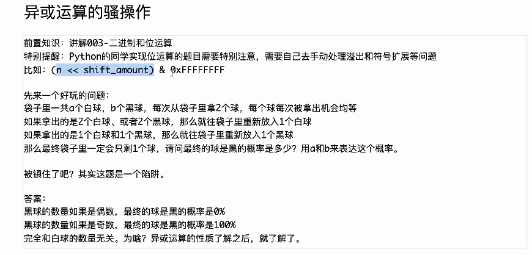
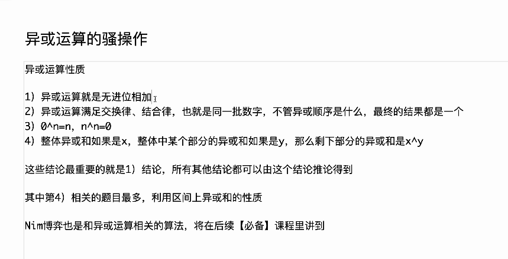
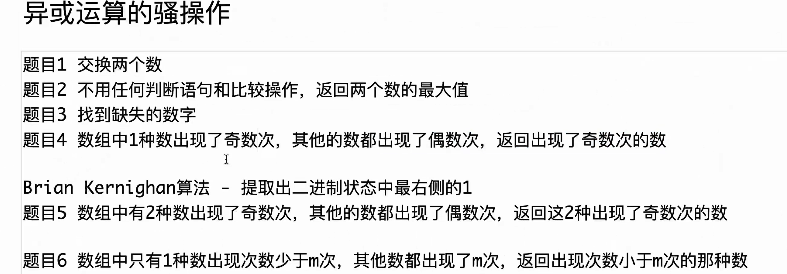

将白球看作0，黑球看作1，这就是一个异或运算

* 题目一：主要使用**交换律结合律**

  `a=a^b;b=a^b;a=a^b`

  分别是

  `a'=a^b`

  `b' =a^b^b=a`

  `a''=a'^b'=a^b^a=b`

* 题目二：关键在于判断两数之差是否为负数，此时就是右移31位获取符号位即可

  异或在这里的作用不是很明显

  > https://www.nowcoder.com/practice/d2707eaf98124f1e8f1d9c18ad487f76

* 题目三：这里主要应用了**交换律结合律**

  将所有的数字异或，再将现有数字异或，将两者异或即可获得缺失的数字（仅限一个）

  利用结合律的性质，将异或看作集合的一种表现

  > https://leetcode.cn/problems/missing-number/

* 题目四：利用了异或自身相消的性质

  > https://leetcode.cn/problems/single-number/

以下都会利用到Brian Kernighan算法，用于提取二进制状态中最右侧的1。例如010100，最右侧的1在第三个位置

> 也就是取反加一&自己
>
> 例如
>
> 01101000
>
> 取反
>
> 10010111
>
> 加一
>
> 10011000
>
> 与自己
>
> 10011000&01101000
>
> 我们可以发现，通过取反加一，我们消除了最后面的所有连续0，并标记了最后一个1的位置
>
> 同时不会影响到开头的部分（因为取反所以不会与到）
>
> 因此结果上保留了最右边的1
>
> **注意，这里获取的不是1本身，而是这个00001000的状态，在后面树状数组中会多次用到**

* 题目五：同题目四，最后获取到一个缺失值a^b的结果

  此时，我们需要**分离这个值为a和b**。事实上，**我们可以获取a^b最后一个1的状态**（例如第n个位置为最后一个1)，然后将所有的值分为两部分：第n个位置为1和第n个位置为0，**不难发现a，b一定分别在这两个类中（因为异或不同为1）**，而类中的其他元素一定为偶数

  具体来说，我们首先获得a，然后用a异或上之前获得的a^b即可

  > https://leetcode.cn/problems/single-number-iii/

* 题目六：

  这一题很巧妙

  它并没有使用异或，而是使用了异或的思想

  这里可以发现，对于每个数，如果其出现了m次，那么其为1的位一定出现了m次

  我们只需要统计所有的数中每一位上1的出现次数即可

  **只要该位上1的出现次数不能整除m，就代表出现次数小于m的数该位上一定为1**

  > 提取第i位的值使用
  >
  > `(num>>i)&1`

  测试链接 : https://leetcode.cn/problems/single-number-ii/
  注意 : 测试题目只是通用方法的一个特例，课上讲了更通用的情况

