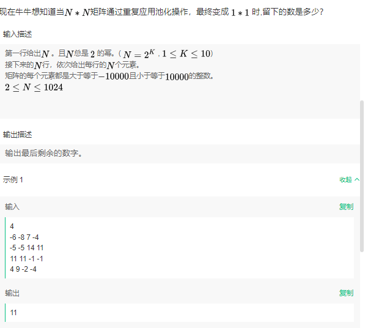

# 1. 携程

##  2024.4.16晚第三题: dp+素数筛

游游拿到了一个数组，每次操作可以将相邻的两个素数元素进行合并，合并后的新数为原来的两个数之和，并删除原来的两个数。游游喜旺最终数组的元素==尽可能少==。


>输入一个整数n，代表数组大小
>
>输入n个整数$a_i$，代表数组的元素
>
>$1\leq n \leq 1e5$
>
>$1\leq a_i \leq 1e6$
>
>输出合并结束后的元素数量

示例:

>5
>
>1 3 2 5 4
>
>3


>5
>
>1 5 3 2 4
>
>3


注意，要求尽可能少，因此不能使用贪心，因为考虑"5 3 2"这样的连续素数子串，它实际上是先合并3 2较优。


因此，大体思路如下：

* 找出连续素数子串
* 对每个子串dp求解

dp数组构造为如下
$$
dp[i][j] = max(dp[i][k], dp[k+1][j])
$$
$dp[i][j]$：代表[i,j]区间内的最大减去的数量

考虑到$dp[i][k] + dp[k+1][j]$合并时需要考虑边界是否能再次合并，因此$dp[i][j]$需要自定义结构

```c++
class prime_unit {
public:
	std::vector<int> range;
	int minus_count;

	prime_unit(std::vector<int> range_, int minus_count_)
		:range{range_}, minus_count{minus_count_} {}

	prime_unit operator+(const prime_unit& other) const {

		std::vector<int> merged_range = range;

		int merged_minus_count = this->minus_count + other.minus_count;

		// 合并区间
		merged_range.insert(merged_range.end(), other.range.begin(), other.range.end());

		
		//std::cout << "面对的两个vector为" << std::endl;
		//std::cout << " 左序列" << std::endl;
		//for (int i = 0; i < range.size(); i++) {
		//	std::cout << range[i] << " ";
		//}
		//std::cout << std::endl;
		//std::cout << " 右序列" << std::endl;
		//for (int i = 0; i < other.range.size(); i++) {
		//	std::cout << other.range[i] << " ";
		//}
		//std::cout << std::endl;
		//std::cout << "merged_range大小为" << merged_range.size() << std::endl;
		//std::cout << "需要访问的两个位置为" << this->range.size() - 1 << " " << this->range.size() << std::endl;

		// 若是合并后产生连续素数
		if (is_prime[merged_range[this->range.size() - 1]] && is_prime[merged_range[this->range.size()]]) {
			// remove these two
			int temp = merged_range[range.size() - 1] + merged_range[range.size()];
			merged_range.erase(merged_range.begin() + range.size() - 1, merged_range.begin() + range.size() - 1 + 2);

			merged_range.insert(merged_range.begin() + (range.size() - 1), temp);

			merged_minus_count++;
		}

		

		return prime_unit(merged_range, merged_minus_count);
	}


	bool operator<(const prime_unit& other) const {
		return this->minus_count < other.minus_count;
	}

};
```

使用如上结构，其包含一个[i,j]区间内的最优子序列，以及[i,j]区间内的最大消去元素个数。

* 自定义`+`，判断左区间的最右与右区间的最左是否能合并
* 自定义比较，使得std::max能够使用。

以下是全部代码，具体来说就是打个表，然后dp，注意子序列的生成方式。

注意dp的三层循环是:区间长度->区间开始->区间内隔断

最好使用中间变量增加可读性。

```c++
void print_vector(std::vector<int> vec) {
	for (int i = 0; i < vec.size(); i++) {
		std::cout << vec[i] << " ";
	}
	std::cout << std::endl;
}


std::vector<bool> is_prime;
std::vector<bool> Eratosthenes(int n) {
	std::vector<bool> prime_list(n + 1, true);

	prime_list[0] = false;
	prime_list[1] = false;

	for (int i = 2; i * i <= n; i++) {
		if (prime_list[i]) {
			for (int j = i * i; j <= n; j+= i) {
				prime_list[j] = false;
			}
		}
	}
	return prime_list;
	
}

class prime_unit {
public:
	std::vector<int> range;
	int minus_count;

	prime_unit(std::vector<int> range_, int minus_count_)
		:range{range_}, minus_count{minus_count_} {}

	prime_unit operator+(const prime_unit& other) const {

		std::vector<int> merged_range = range;

		int merged_minus_count = this->minus_count + other.minus_count;

		// 合并区间
		merged_range.insert(merged_range.end(), other.range.begin(), other.range.end());

		
		//std::cout << "面对的两个vector为" << std::endl;
		//std::cout << " 左序列" << std::endl;
		//for (int i = 0; i < range.size(); i++) {
		//	std::cout << range[i] << " ";
		//}
		//std::cout << std::endl;
		//std::cout << " 右序列" << std::endl;
		//for (int i = 0; i < other.range.size(); i++) {
		//	std::cout << other.range[i] << " ";
		//}
		//std::cout << std::endl;
		//std::cout << "merged_range大小为" << merged_range.size() << std::endl;
		//std::cout << "需要访问的两个位置为" << this->range.size() - 1 << " " << this->range.size() << std::endl;

		// 若是合并后产生连续素数
		if (is_prime[merged_range[this->range.size() - 1]] && is_prime[merged_range[this->range.size()]]) {
			// remove these two
			int temp = merged_range[range.size() - 1] + merged_range[range.size()];
			merged_range.erase(merged_range.begin() + range.size() - 1, merged_range.begin() + range.size() - 1 + 2);

			merged_range.insert(merged_range.begin() + (range.size() - 1), temp);

			merged_minus_count++;
		}

		

		return prime_unit(merged_range, merged_minus_count);
	}


	bool operator<(const prime_unit& other) const {
		return this->minus_count < other.minus_count;
	}

};

int dp_solve_range(std::vector<int> data) {
	//[i,j]区间内的最大minus_count
	if (data.size() == 2) {
		return 1;
	}
	int num = data.size();

	// 构造dp表
	std::vector<std::vector<prime_unit>> dp(data.size(),
											std::vector<prime_unit>(data.size(),
																	prime_unit({},0)));

	for (int i = 0; i < num; i++) {
		// 可优化，添加移动语义
		dp[i][i] = prime_unit({ data[i] }, 0);
	}

	// 区间长度-起始点-区间内分割点
	for (int len = 2; len <= data.size(); len++)
	{
		// 可访问的最后一个为begin + len - 1
		for (int begin = 0; begin + len - 1 < data.size(); begin++) 
		{
			int end = begin + len - 1;
			for (int k = begin; k < end; k++) 
			{
				
				//std::cout << "dp使用的区间为[" << begin << "," << begin+len-1 << "]" << std::endl;
				//std::cout << "其搜找的两个区间为[" << begin << "," <<k << "]" << std::endl;
				//std::cout << "与[" << k+1 << "," << begin + len - 1 << "]" << std::endl;


				dp[begin][end] = std::max(dp[begin][end], dp[begin][k] + dp[k + 1][end]);
			}
		}
	}
	
	return dp[0][num - 1].minus_count;
}


int num_able_to_merge(std::vector<int> data) {
	
	int count = data.size();
	for (int i = 0; i < data.size();) {
		// 非连续素数的话正常+1，连续素数的话i最后在最后一个素数后
		int temp = i;
		// 找到不是素数为止
		while (i < data.size() && is_prime[data[i]]) {
			i++;
		}
		if (temp == i) {
			i++;
			continue;
		}
		// 传入子序列
		std::vector<int>test(data.begin() + temp, data.begin() + i);
		// print_vector(test);
		int minus = dp_solve_range(test);
		count -= minus;
	}
	return count;
}

int main() {
	const int num_range = 1000000 + 5;
	int n;
	std::vector<int> data;
	std::cin >> n;
	for (int i = 0; i < n; i++) {
		int temp;
		std::cin >> temp;
		data.push_back(temp);
	}
	
	is_prime = Eratosthenes(num_range);

	std::cout << num_able_to_merge(data);


}

```


## 2024.4.16晚第四题: BFS（未写完，思路确定）

游游定义了一个树的直径为任意两个节点的距离的最大值，现在游游拿到了一颗树

她定义$f(i)$为：对$i$号节点上再连接一个新的叶子节点之后，树的直径长度。游游希望你求出$f(1)$到$f(n)$的值


> 输入一个整数n，代表树的节点数量
>
> 接下来n-1行，每行输入两个正整数u,v， 代表u号节点和v号节点有一条长度为1的边链接
>
> $1\leq n \leq 1e5$
>
> $1\leq u,v\leq n$​
>
> 输出n行，第i行代表f(i)的值

> 5
>
> 1 2
>
> 2 3
>
> 3 4
>
> 2 5
>
> 输出
>
> 4
>
> 3
>
> 3
>
> 4
>
> 4

首先，我们知道，树一定是无环全连通的，就是一次DFS就能遍历一遍。


**寻找直径**：

选择任意一个节点，寻找离其最远的节点A。

从节点A，寻找离其最远的节点B。

AB就是直径。

> 证明：
>
> 待写。


```c++
# include<iostream>
# include<string>
# include<unordered_map>
# include<vector>
# include<queue>
# include<cmath>

int BFS_find_farest(std::unordered_map<int, std::vector<int>> um, std::vector<int> &is_accessed, int u) {
	std::queue<int> this_layer_node;
	is_accessed[u] = true;
	for (int i = 0; i < um[u].size(); i++) {
		if (!is_accessed[um[u][i]]) {
			this_layer_node.push(um[u][i]);
		}
	}
	
}

int main() {
	// node->node_list
	std::unordered_map<int, std::vector<int>> um;
	int n;
	std::cin >> n;
	std::vector<int> is_accessed(n,false);


	for (int i = 0; i < n - 1; i++) {
		int u, v;
		std::cin >> u >> v;
		if (um.find(u) == um.end()) {
			um[u] = { v };
		}
		else {
			um[u].push_back(v);
		}

		if (um.find(v) == um.end()) {

			um[v] = { u };

		}
		else {
			um[v].push_back(u);
		}
	}


}
```


## 2024.4.17 晚第三题：Dijkstra + DP


Dijkstra获得目标点与其他点的最短距离

DP获得所需的点

注意，需要记录所需点

```c++
# include<iostream>
# include<string>
# include<unordered_map>
# include<vector>
# include<queue>
# include<cmath>
# include<climits>

std::vector<std::pair<int, int>> dijkstra(const std::vector<std::vector<int>>& latency, int start) {
    int n = latency.size();
    std::vector<std::pair<int, int>> dist(n);

    for (int i = 0; i < latency.size(); i++) {
        dist.emplace_back(INT_MAX, i);
    }
    std::vector<bool> visited(n, false);
    dist[start].first = 0;

    // distance-node pair, find the nearest node to be handled
    std::priority_queue<std::pair<int, int>, std::vector<std::pair<int, int>>, std::greater<std::pair<int, int>>> pq;
    pq.push({ 0, start });

    while (!pq.empty()) {
        int current = pq.top().second;
        pq.pop();


        if (visited[current]) continue;
        visited[current] = true;

        // relaxation
        for (int j = 0; j < n; ++j) {
            if (latency[current][j] != -1 && !visited[j]) {  
                // if node is connected and not visited
                // start node -> current_node + current_node->node j
                int path = dist[current].first + latency[current][j];
                if (path < dist[j].first) {
                    // update shortest path
                    dist[j].first = path;
                    pq.push({ dist[j].first, j });
                }
            }
        }
    }
    return dist;
}

int main() {
	int n;

	std::vector<std::vector<int>> latency;

	std::vector<int> remain_capacity;

	int faultyNode;

	int Damaged_work;

	std::cin >> n;

	for (int i = 0; i < n; i++) {
		std::vector<int> temp;
		for (int j = 0; j < n; j++) {
			int m;
			std::cin >> m;
			temp.push_back(m);
		}
		latency.push_back(temp);
	}


	for (int i = 0; i < n; i++) {
		int temp;
		std::cin >> temp;
		remain_capacity.push_back(temp);
	}

	std::cin >> faultyNode >> Damaged_work;

    
    std::vector<std::pair<int,int>> dist = dijkstra(latency, faultyNode);

    // dp[i][j]:use only i 个 来填满 j的容量 所需的节点个数
  


}


```


## 2024.4.17 晚第二题（未写）

将云服务器看作一颗树，每个云服务在发布前尚未解决的问题称为云服务的遗留问题（云服务的遗留问题包含以该云服务为根节点的树上所有节点的问题），DI值（遗留问题缺陷密度）可以作为评估云服务发布的指标，当云服务DI值小于等于阈值时才准许云服务发布，否则视为风险云服务，需要问题整改完成后重新进行发布评估。

现有一批云服务树，已给出云服务树各节点的问题数量，请通过计算输出风险云服务的个数。


计算公式：$DI值\leq 5\times 严重问题数 + 2 \times 一般问题数$，其中每个结点的不同级别问题数量需要将该节点以及该节点为根节点的所有子节点的相应级别问题数量求和


第一行输入M和N(M <= 100000, N <= 1000)，使用空格分隔，M代表云服务器阈值，N标识接下来有N行问题统计数据


接下来输入一个N*4的矩阵表，行内使用空格分隔，第一列$A_i$为服务节点，第二行$B_i$为$A_i$的父节点，如果$A_i$为云服务则无父节点，此时$B_i$用`*`号标识($A_i$和$B_i$取值为字符串， $1\leq 字符串长度\leq 5$，均由小写英文字母或者`*`组成)，第三列$C_i$为问题级别，($C_i$取值为{0,1}，0表示严重问题，1表示一般问题)，第四列$D_i$为该节点该级别的问题数量($D_i\leq$1000)

说明，输入保证只出现树关系，不会出现连同图情况


输出：风险云服务个数

```markdown
输入：
40 12
a * 0 2
a * 1 2
b a 0 3
b a 1 5
c a 1 3
d a 0 1
d a 1 3
e b 0 2
f * 0 8
f * 1 10
g f 1 2
h * 0 4

输出:
2
```


## 2024.4.26 晚第二题(DP)


第2题：
小苯是“小红书app”的忠实用户，他有n个账号，每个账号粉丝数为 ai。这天他又创建了一个新账号，他希望新账号的粉丝数饸好等于 x。为此他可以向自己已有账号的粉丝们推荐自己的新账号，这样以来新账号就得到了之前粉丝的关注。
他想知道，他最少需要在几个旧账号发“推荐新账号”的文章，可以使得他的新账号粉丝数恰好为 x，除此以外，他可以最多从中选择一个账号多次发“推荐新账号”的文章,
(我们假设所有旧账号的粉丝们没有重叠，并且如果在第i个旧账号的粉丝们推荐了新账号，则新账号会直接涨粉 ai/2 下取整个，而如果小苯选择在第 i个旧账号中多次推荐新账号，那么新账号就可以直接涨粉 ai。)
输入描述:
输入包含 2 行。
第一行两个正整数 n,x(1 ≤n,x≤100)，分别表示小苯的旧账号个数，和新账号想要的粉丝数。
第二行 n 个正整数 ai (1 ≤ai ≤ 100)，表示小苯每个旧账号的粉丝数。
输出描述
输出包含一行一个整数，表示小苯最少需要向多少个旧帐号推荐新账号，如果无法做到，输出 -1.
样例输入:
5 8
1 2 3 4 1 0
样例输出:
2
提示
说明
选择第3个和第5个旧账号，并在第3个账号多次发文


这道题意思就是你有一个双倍卡只能用一次，你选择用在哪个物品上的背包问题

关键点是这个问题可以分为两部分，第一部分就是正常dp

第二部分，我们考虑，dp[i]已经记录了对于粉丝数为i的情况，需要的最优账号数。

考虑到我们只能用一次双倍卡，我们可以直接基于dp[x]对每个物品判定是否使用了这个物品的double能使得dp[x]更小（这意味着我们需要记录一下dp[i]使用了哪些)


现在我们来考虑一下，如果dp[x - fans[i]]使用了i，也就是说我们准备放上去的双倍的物品，在状态转移时发现它的状态是已经使用了，这会不会引发一些问题。

实际上是不会的。因为dp[i]意味着粉丝数为i的最优解，

* 如果所有账号粉丝数都不一样

  * 考虑我们想使用第k个账户做双倍，但是第k个账户在dp[x-fans[k]]已经使用过了

  * 如果我们将k从里面抽掉换成其他组合，那么最好的情况就是dp[x-fans[k]] = dp[x-fans[k]] + 1

  * 此时，我们可以得到

    （抽掉账户k）最优情况为(origin)dp[x-fans[k]] + 1 + 1

==分析到这，账号粉丝数为2n和2n+1，的情况我也不想讨论了，可能有点问题。此题题解未经过AC==

```c++
int main() {
	int n, x;
	std::vector<int> fans;
	std::cin >> n >> x;
	for (int i = 0; i < n; i++) {
		int temp;
		std::cin >> temp;
		fans.push_back(temp);
	}

	const int inff = 10000000;

	// 粉丝数正好为i所需要的账号
	std::vector<int> dp(x+1,inff);
	dp[0] = 0;
	std::vector<std::vector<bool>> is_used(x + 1, std::vector<bool>(n, false));
	for (int j = 0; j < n; j++) {
		for (int i = x; i >= fans[j]/2; i--) {
			int a = dp[i - fans[j] / 2] + 1;
			if (a < dp[i]) {
				is_used[i][j] = true;
				dp[i] = a;
			}
		}
	}

	for (int i = 0; i < n; i++) {
		int idx = x - fans[i];
        // 如果使用第i个账号的双倍，要求其对应的dp[idx]不能使用过这个账号
		if (idx >= 0 && dp[idx] != inff && !is_used[idx][i]) {
				dp[x] = std::min(dp[idx] + 1, dp[x]);
		}
	}
	std::cout << dp[x];


}
```


# 2. 美团

## 2024.4.27 晚 第四题：dfs+数论


具体思路就是dfs找出所有的红块

对每个红块利用因子数量计算公式累积其因子即可，注意需要使用素数筛来简化搜索过程


注意每次累加的long long

```c++
#include <iostream>
#include <string>
#include <vector>
#include <cmath>
#include <unordered_map>
#include <unordered_set>

using namespace std;

struct Node {
    bool isRed;
    vector<int> neighbors;
};

vector<int> primes;

// Generate all primes up to a certain number using the Sieve of Eratosthenes
void generatePrimes(int maxNum) {
    vector<bool> isPrime(maxNum + 1, true);
    for (int i = 2; i * i <= maxNum; i++) {
        if (isPrime[i]) {
            for (int j = i * i; j <= maxNum; j += i) {
                isPrime[j] = false;
            }
        }
    }
    for (int i = 2; i <= maxNum; i++) {
        if (isPrime[i]) {
            primes.push_back(i);
        }
    }
}

void dfs(int node, vector<Node>& nodes, vector<bool>& visited, vector<int>& component) {
    visited[node] = true;
    component.push_back(node + 1); // Assuming node numbering starts at 1

    for (int neighbor : nodes[node].neighbors) {
        if (!visited[neighbor] && nodes[neighbor].isRed) {
            dfs(neighbor, nodes, visited, component);
        }
    }
}

void factorize(int n, unordered_map<int, int>& factors) {
    for (int prime : primes) {
        if (prime * prime > n) break;
        while (n % prime == 0) {
            factors[prime]++;
            n /= prime;
        }
    }
    if (n > 1) {
        factors[n]++;
    }
}

long long calculateProduct(const vector<int>& component) {
    unordered_map<int, int> factorPowers;

    for (int num : component) {
        factorize(num, factorPowers);
    }

    long long factorCount = 1;
    for (auto& p : factorPowers) {
        factorCount = (factorCount * (p.second + 1)) % (long long)(1e9 + 7);
    }

    return factorCount;
}

int main() {
    int n;
    cin >> n;

    generatePrimes(250); // Adjust this depending on the expected input range

    vector<Node> nodes(n);
    vector<bool> visited(n, false);
    vector<vector<int>> components;
    int u, v;
    char color;

    for (int i = 0; i < n; i++) {
        cin >> color;
        nodes[i].isRed = (color == 'R');
    }

    for (int i = 0; i < n - 1; i++) {
        cin >> u >> v;
        u--; v--; // Adjusting to 0-based indexing
        nodes[u].neighbors.push_back(v);
        nodes[v].neighbors.push_back(u);
    }

    for (int i = 0; i < n; i++) {
        if (!visited[i] && nodes[i].isRed) {
            vector<int> component;
            dfs(i, nodes, visited, component);
            components.push_back(component);
        }
    }

    long long totalSum = 0;
    for (const auto& component : components) {
        totalSum = (totalSum + calculateProduct(component)) % (long long)(1e9 + 7);
    }

    cout << totalSum << endl;

    return 0;
}
```


## 2024.4.27 晚 第五题：图论-树与异或的关系很微妙，好题


我的做法是每次查询就dijkstra搜索，记录最短路，超时了。

```c++
#include <iostream>
#include <vector>
#include <queue>
#include <algorithm>
#include <climits>


using namespace std;

struct Edge {
    int u, v, w;
    bool active;
};

// store neighbor node and edge idx
struct Node {
    vector<pair<int, int>> adj;  // Pair: (neighbor, index in edges list)
};

vector<Edge> edges;
vector<Node> graph;
vector<bool> deleted;

int n, q;

void removeEdge(int edgeIndex) {
    edges[edgeIndex].active = false;  // Mark this edge as inactive
}

pair<vector<long long>, vector<long long>> dijkstra(int src) {
    vector<bool> visited(n, false);
    vector<long long> dist(n, LLONG_MAX);
    vector<long long> prev_edge(n, -1);// each node's last edge
    // node to be choose, <distance,node_id>
    priority_queue<pair<long long, int>, vector<pair<long long, int>>, greater<pair<long long, int>>> pq;

    // first node
    pq.push({ 0, src });
    dist[src] = 0;

    while (!pq.empty()) {
        pair<long long,int> node = pq.top();
        pq.pop();

        if (visited[node.second]) continue;
        visited[node.second] = true;


        for (auto g : graph[node.second].adj) {
            if (visited[g.first] || !edges[g.second].active) continue;  // Skip deleted edges or visited node

            int weight = edges[g.second].w;
            int v = g.first;
            if (dist[node.second] + weight < dist[v]) {
                prev_edge[v] = g.second;
                dist[v] = dist[node.second] + weight;
                pq.push({ dist[v], v });
            }
        }
    }

    return { prev_edge,dist };
}

int main() {
    cin >> n >> q;// node,query
    graph.resize(n);
    deleted.resize(n - 1, false);

    int u, v, w;
    for (int i = 0; i < n - 1; i++) {
        cin >> u >> v >> w;
        u--; v--;  // Convert to 0-based index
        edges.push_back({ u, v, w, true });
        graph[u].adj.push_back({ v, i });
        graph[v].adj.push_back({ u, i });
    }

    for (int i = 0; i < q; i++) {
        int type;
        cin >> type;
        if (type == 1) {
            int edgeId;
            cin >> edgeId;
            edgeId--;  // Convert to 0-based index
            removeEdge(edgeId);
        }
        else if (type == 2) {
            int start, end;
            cin >> start >> end;
            start--; end--;  // Convert to 0-based index
            pair<vector<long long>, vector<long long>> res = dijkstra(start);
            if (res.second[end] == LLONG_MAX) cout << "-1" << endl;
            else {
                int res_xor = 0;
                for (int at = end; at != start; ) {
                    res_xor ^= edges[res.first[at]].w;
                    at = edges[res.first[at]].u == at ? edges[res.first[at]].v : edges[res.first[at]].u;
                }
                cout << res_xor << endl;
            }
            
        }
    }

    return 0;
}
```


实际上，一种思路是利用树的特性（每个节点仅连接1/2条边，两点之间距离唯一）


以任意点为根节点，往下每个节点存储根节点到该路径的边权异或和

应该一次dfs就能完成


如图所示，我们可以发现一个很好的性质，如果我们把每个节点记录为根节点到这个节点的路径异或和，同时这是一个树结构，所有节点间路径唯一，那么两节点之间的路径异或和就为节点值异或和。


此时，我们需要考虑删除时的更新：

* 删除一条边意味着树变成了两个子树
* 在删除了一条边后，例如d边，对于在一个树结构内的肯定是可以直接异或得到结果的，所以我们不需要更新节点值，我们只需要标记两个节点是否在一个树内即可
* 对每个节点新增一个标识tree，初始全为0，即为全在0号tree中，维护一个max_tree_num = 1;
  * 删除一个节点意味着多分出了一个tree，我们选择任意一个tree为tree1
  * dfs一次，更新所有节点的所在tree标识。
  * 以后每次删除一个节点，我们只需要选择所删除边的任意一边节点，以其为出发点（根）遍历所有tree标识相同的即可，将他们的tree标识统一更新为max_tree_num++；

```c++
#include <iostream>
#include <vector>
#include <queue>
#include <algorithm>
#include <climits>
using namespace std;

struct Node {
    // <neighbour node id, edge id>
    std::vector<pair<int, int>> neighbour;
    int xor_value;
    int belong_tree;
};
vector<Node> neighbor;

struct edge {
    int node1, node2, weight;
    bool activate;

    edge(int n1, int n2, int w, bool ac)
        :node1{ n1 }, node2{ n2 }, weight{ w }, activate{ ac } {}
};
vector<edge> graph;
int n, q;
int total_tree_num = 1;


void dfs_build(int start) {
    queue<int> node_to_access;
    vector<int> is_visited(n+1, false);// 虽然是树，但是因为建图是双向neighbor，需要visited数组

    node_to_access.push(start);
    neighbor[start].xor_value = 0;
    while (!node_to_access.empty()) {
        int this_node = node_to_access.front();
        node_to_access.pop();
        is_visited[this_node] = true;
        for (auto& nei : neighbor[this_node].neighbour) {
            if (!is_visited[nei.first]) {
                int edge_idx = nei.second;
                node_to_access.push(nei.first);
                neighbor[nei.first].xor_value = neighbor[this_node].xor_value ^ graph[edge_idx].weight;
            }
        }
    }
}

void dfs_new_tree(int idx) {
    queue<int> node_to_access;
    vector<int> is_visited(n+1, false);
    int current_sub_tree_id = neighbor[idx].belong_tree;
    node_to_access.push(idx);
    neighbor[idx].belong_tree = total_tree_num;

    while (!node_to_access.empty()) {
        int this_node = node_to_access.front();
        node_to_access.pop();
        is_visited[this_node] = true;

        for (auto& nei : neighbor[this_node].neighbour) {
            if (current_sub_tree_id == neighbor[nei.first].belong_tree 
                && !is_visited[nei.first]
                && graph[nei.second].activate) {
                // 对同一个子树内，未访问的，边可用的邻居更新其所在树
                neighbor[nei.first].belong_tree = total_tree_num;
                node_to_access.push(nei.first);
            }
        }
        
    }
}

void delete_edge(int edge_id) {
    //cout << "IN delete edge function" << endl;
    int new_tree_node_id = graph[edge_id].node1;
    //cout << "被选出来的节点为" << new_tree_node_id << endl;
    graph[edge_id].activate = false;
    dfs_new_tree(new_tree_node_id);
    total_tree_num++;
}


void CHECK_GRAPH() {
    vector<int> is_visited(n + 1, false);

    for (int i = 1; i < n + 1; i++) {
        if (is_visited[i]) {
            continue;
        }
        queue<int> node_to_access;
        node_to_access.push(i);
        cout << "Tree_id为" << neighbor[i].belong_tree << " 的节点有" << endl;
        cout << i << " ";
        while (!node_to_access.empty()) {
            int this_node = node_to_access.front();
            node_to_access.pop();
            is_visited[this_node] = true;

            for (auto& n : neighbor[this_node].neighbour) {
                if (neighbor[this_node].belong_tree == neighbor[n.first].belong_tree
                    && !is_visited[n.first]
                    && graph[n.second].activate) {
                    
                    cout << n.first << " ";
                    node_to_access.push(n.first);
                }
            }
        }

        cout << endl;
    }
}
int main() {

    cin >> n >> q;
    neighbor.resize(n+1);
    // build graph
    for (int i = 0; i < n - 1; i++) {
        int n1, n2, w;
        cin >> n1 >> n2 >> w;
        graph.push_back({ n1,n2,w,true });

        neighbor[n1].neighbour.push_back({ n2,i });
        neighbor[n2].neighbour.push_back({ n1,i });
    }

    // 为neighbor添加节点信息
    dfs_build(1);
    // 初始化所属树信息
    for (int i = 1; i <= n; i++) {
        neighbor[i].belong_tree = 0;
    }
    // query
    for (int i = 0; i < q; i++) {
        int op;
        cin >> op;
        if (op == 1) {
            int del_edge;
            cin >> del_edge;
            delete_edge(del_edge);
        }
        else if (op == 2) {
            int u, v;
            cin >> u >> v;
            //cout << neighbor[u].belong_tree << endl << neighbor[v].belong_tree << endl;
            if (neighbor[u].belong_tree == neighbor[v].belong_tree)
            {
                cout << (neighbor[u].xor_value ^ neighbor[v].xor_value) << endl;
            }
            else {
                cout << "-1" << endl;
            }
        }
    }

    // 打印当前树的每个子树的tree_id
    CHECK_GRAPH();
}
```


## 2024.4.27 晚 第三题 dp(未写)


小美拿到了一个数组，她每次操作可以将两个相邻元素a_i,合并为一个元素，合并后的元素为原来两个元素之和。小美希望最终数组的最小值不小于k。她想知道有多少种不同的合并结果?  这道题评论区给出了两种解法： 

第一种： 用 `s[i][j] `表示 a[i]~a[j]的区间和，一种合并可以表示为在s数组从第1行走到第n列的一种路径，必须满足路径上所有数字不小于k，不同的路径一定是不同的合并。dp[i][j] 表示到达 `s[i][j] `的路径数量，从 `dp[u][i-1] `转移，其中1<=u<=i-1。最后对 `dp[*][n] `求和得答案。 

第二种： 动态规划+前缀和就可以，dp[i]表示数字0-i的方案数，状态转移方程为dp[i]=∑dp[j]（j−k的和大于等于k，用前缀和求出）


# 3. Bilibili

## 2024.4.28晚上，一题模拟





递归每个sub_matrix模拟即可，没有卡

```c++
#include<iostream>
#include<vector>
#include<queue>
#include<functional>
using namespace std;


void print(auto& T) {
	for (int i = 0; i < T.size(); i++) {
		for (int j = 0; j < T[0].size(); j++) {
			cout << T[i][j] << " ";
		}
		cout << endl;
	}
}

// n for matrix size
int find_matrix(int n, vector<vector<int>>& arr) {
	if (arr.size() == 1) {
		return arr[0][0];
	}
	// 重填装
	int total_num = 0;
	const int new_marxi_size = n / 2;
	vector<vector<int>> new_arr(new_marxi_size, vector<int>(new_marxi_size, 0));
	using PairComparator = function<bool(std::pair<int, int>, std::pair<int, int>)>;
	for (int i = 0; i < n; i += 2) {
		for (int j = 0; j < n; j += 2) {
			// index, value
			std::priority_queue<
				std::pair<int, int>,
				std::vector<std::pair<int, int>>,
				PairComparator
			> pq(PairComparator(
				[](std::pair<int, int> a, std::pair<int, int> b) {
					if (a.second == b.second) {
						return a.first > b.first;
					}
					return a.second < b.second;
				}
			));

			pq.push({ 0,arr[i][j] });
			pq.push({ 1,arr[i][j + 1] });
			pq.push({ 2,arr[i + 1][j] });
			pq.push({ 3,arr[i + 1][j + 1] });

			/*
			cout << pq.top().first << " " << pq.top().second << endl;
			pq.pop();
			cout << pq.top().first << " " << pq.top().second << endl;
			pq.pop();
			cout << pq.top().first << " " << pq.top().second << endl;
			pq.pop();
			cout << pq.top().first << " " << pq.top().second << endl;
			pq.pop();
			*/
			pq.pop();

			new_arr[total_num / new_marxi_size][total_num % new_marxi_size] = pq.top().second;
			total_num++;
		}
		cout << endl;
	}
	//print(new_arr);
	return find_matrix(new_marxi_size, new_arr);

}
int main() {
	int n;
	vector<vector<int>> arr;
	cin >> n;
	for (int i = 0; i < n; i++) {
		vector<int> a;
		for (int j = 0; j < n; j++) {
			int temp;
			cin >> temp;
			a.push_back(temp);
			
		}
		arr.push_back(a);
	}

	cout << find_matrix(n, arr) << endl;
	
}
```


# 4. 杂牌

## 最近祖先LCA


二叉树的做法就是递归。让递归返回它所递归的子树的最近共同祖先。


子树有这么三种形态：

* 含有p,q其中的一个：返回当前子树的root，因为该子树不可能有共同祖先

* 没有p,q的任何一个：那么就是返回nullptr，代表该子树不予以考虑

* 同时含有p,q：直接返回root即可。

  * 注意，这里的写法其实是

    ```c++
    if (left != NULL && right != NULL) return root;
    ```

    此时更新的就是最近子祖先

  * 对于更远的子祖先

    ```c++
    return left ? left : right;
    ```

    会返回的就是不为null的那个子树。

很巧妙。

```c++
struct TreeNode {
    int val;
    TreeNode *left;
    TreeNode *right;
    TreeNode(int x) : val(x), left(NULL), right(NULL) {}
};

TreeNode* lowestCommonAncestor(TreeNode* root, TreeNode* p, TreeNode* q) {
    if (root == NULL || root == p || root == q) return root;

    TreeNode* left = lowestCommonAncestor(root->left, p, q);
    TreeNode* right = lowestCommonAncestor(root->right, p, q);

    // 如果左右子树的返回值都不为空，说明p和q分别位于root的两侧
    if (left != NULL && right != NULL) return root;

    // 如果左子树为空，说明p和q都不在左子树，返回右子树的结果
    // 如果右子树为空，说明p和q都不在右子树，返回左子树的结果
    return left ? left : right;
}
```


```c++
#include <iostream>
#include<vector>
using namespace std;


struct TreeNode {
	int val;
	TreeNode* left;
	TreeNode* right;

	TreeNode(int a) :val{a}{
		left = nullptr;
		right = nullptr;
	}
};


TreeNode* findLCA_selfconsidered(TreeNode* root, int p, int q) {
	if (root == nullptr || root->val == p || root->val == q) return root;

	//neither
	TreeNode* left = findLCA_selfconsidered(root->left, p, q);
	TreeNode* right = findLCA_selfconsidered(root->right, p, q);


	// both sub tree has target,this subtree's LCA is root node
	if (left && right) return root;

	// one of sub tree has neither,the return of one subtree is target
	return left ? left : right;
}

int main() {
	TreeNode* root = new TreeNode(1);

	root->right = new TreeNode(2);
	root->right->left = new TreeNode(3);
	root->right->left->right = new TreeNode(4);


	int p= 1;
	int q = 4;
	cout << findLCA_selfconsidered(root, p, q)->val;

}


```


## dp-喝酒


```c++
#include <iostream>
#include<vector>
using namespace std;
int res(vector<int>& wines, int n) {
    // 拆成两个子问题，这两个子问题一定独立
    // 因为若是两个子问题不独立，意味着首尾必定同时入选
    // 但是首尾必定不能同时入选，因此拆成0到n-2和1到n-1两个子问题一定能包含最优解。
    // 同时，设置状态转移方程dp[i] = max(dp[i - 1], dp[i - 2] + wines[i]);
    // 因为按照规则，你可以选择跳一步或者两步，跳三步是不可能的，因为零成本喝中间的酒。
    //[0,n-2]
    vector<int> dp(n, 0);// max_wine until i
    dp[0] = wines[0];
    dp[1] = max(wines[0], wines[1]);
    for (int i = 2; i < n-1; i++) {
        dp[i] = max(dp[i - 1], dp[i - 2] + wines[i]);
    }


    //[1,n-1]
    vector<int> dp2(n, 0);
    dp2[0] = wines[1];
    dp2[1] = wines[2];

    for (int i = 2; i < n-1; i++) {
        dp2[i] = max(dp2[i - 1], dp2[i - 2] + wines[i+1]);
    }
    return max(dp[n - 2], dp2[n - 2]);
}
int main() {
    int n;
    vector<int> wines;

    cin >> n;
    for (int i = 0; i < n; i++) {
        int temp;
        cin >> temp;
        wines.push_back(temp);
    }

    cout << res(wines, n);

}

```

