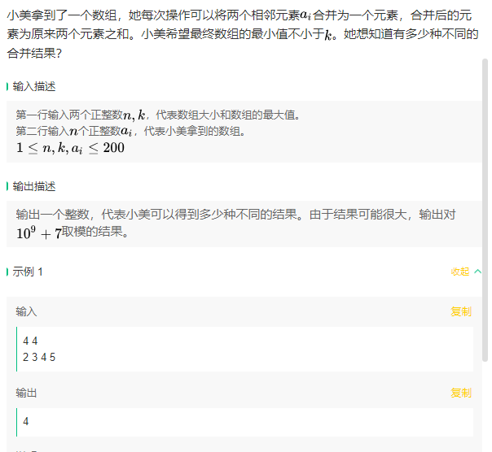
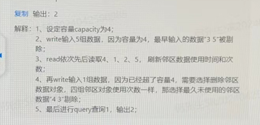
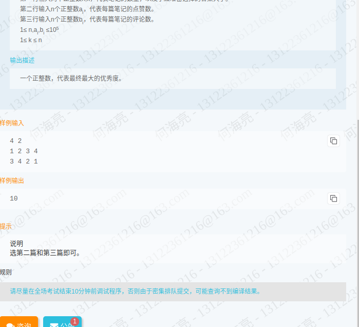

# 1. 携程

##  2024.4.16晚第三题: dp+素数筛

游游拿到了一个数组，每次操作可以将相邻的两个素数元素进行合并，合并后的新数为原来的两个数之和，并删除原来的两个数。游游喜旺最终数组的元素==尽可能少==。


>输入一个整数n，代表数组大小
>
>输入n个整数$a_i$，代表数组的元素
>
>$1\leq n \leq 1e5$
>
>$1\leq a_i \leq 1e6$
>
>输出合并结束后的元素数量

示例:

>5
>
>1 3 2 5 4
>
>3


>5
>
>1 5 3 2 4
>
>3


注意，要求尽可能少，因此不能使用贪心，因为考虑"5 3 2"这样的连续素数子串，它实际上是先合并3 2较优。


因此，大体思路如下：

* 找出连续素数子串
* 对每个子串dp求解

dp数组构造为如下
$$
dp[i][j] = max(dp[i][k], dp[k+1][j])
$$
$dp[i][j]$：代表[i,j]区间内的最大减去的数量

考虑到$dp[i][k] + dp[k+1][j]$合并时需要考虑边界是否能再次合并，因此$dp[i][j]$需要自定义结构

```c++
class prime_unit {
public:
	std::vector<int> range;
	int minus_count;

	prime_unit(std::vector<int> range_, int minus_count_)
		:range{range_}, minus_count{minus_count_} {}

	prime_unit operator+(const prime_unit& other) const {

		std::vector<int> merged_range = range;

		int merged_minus_count = this->minus_count + other.minus_count;

		// 合并区间
		merged_range.insert(merged_range.end(), other.range.begin(), other.range.end());

		
		//std::cout << "面对的两个vector为" << std::endl;
		//std::cout << " 左序列" << std::endl;
		//for (int i = 0; i < range.size(); i++) {
		//	std::cout << range[i] << " ";
		//}
		//std::cout << std::endl;
		//std::cout << " 右序列" << std::endl;
		//for (int i = 0; i < other.range.size(); i++) {
		//	std::cout << other.range[i] << " ";
		//}
		//std::cout << std::endl;
		//std::cout << "merged_range大小为" << merged_range.size() << std::endl;
		//std::cout << "需要访问的两个位置为" << this->range.size() - 1 << " " << this->range.size() << std::endl;

		// 若是合并后产生连续素数
		if (is_prime[merged_range[this->range.size() - 1]] && is_prime[merged_range[this->range.size()]]) {
			// remove these two
			int temp = merged_range[range.size() - 1] + merged_range[range.size()];
			merged_range.erase(merged_range.begin() + range.size() - 1, merged_range.begin() + range.size() - 1 + 2);

			merged_range.insert(merged_range.begin() + (range.size() - 1), temp);

			merged_minus_count++;
		}

		

		return prime_unit(merged_range, merged_minus_count);
	}


	bool operator<(const prime_unit& other) const {
		return this->minus_count < other.minus_count;
	}

};
```

使用如上结构，其包含一个[i,j]区间内的最优子序列，以及[i,j]区间内的最大消去元素个数。

* 自定义`+`，判断左区间的最右与右区间的最左是否能合并
* 自定义比较，使得std::max能够使用。

以下是全部代码，具体来说就是打个表，然后dp，注意子序列的生成方式。

注意dp的三层循环是:区间长度->区间开始->区间内隔断

最好使用中间变量增加可读性。

```c++
void print_vector(std::vector<int> vec) {
	for (int i = 0; i < vec.size(); i++) {
		std::cout << vec[i] << " ";
	}
	std::cout << std::endl;
}


std::vector<bool> is_prime;
std::vector<bool> Eratosthenes(int n) {
	std::vector<bool> prime_list(n + 1, true);

	prime_list[0] = false;
	prime_list[1] = false;

	for (int i = 2; i * i <= n; i++) {
		if (prime_list[i]) {
			for (int j = i * i; j <= n; j+= i) {
				prime_list[j] = false;
			}
		}
	}
	return prime_list;
	
}

class prime_unit {
public:
	std::vector<int> range;
	int minus_count;

	prime_unit(std::vector<int> range_, int minus_count_)
		:range{range_}, minus_count{minus_count_} {}

	prime_unit operator+(const prime_unit& other) const {

		std::vector<int> merged_range = range;

		int merged_minus_count = this->minus_count + other.minus_count;

		// 合并区间
		merged_range.insert(merged_range.end(), other.range.begin(), other.range.end());

		
		//std::cout << "面对的两个vector为" << std::endl;
		//std::cout << " 左序列" << std::endl;
		//for (int i = 0; i < range.size(); i++) {
		//	std::cout << range[i] << " ";
		//}
		//std::cout << std::endl;
		//std::cout << " 右序列" << std::endl;
		//for (int i = 0; i < other.range.size(); i++) {
		//	std::cout << other.range[i] << " ";
		//}
		//std::cout << std::endl;
		//std::cout << "merged_range大小为" << merged_range.size() << std::endl;
		//std::cout << "需要访问的两个位置为" << this->range.size() - 1 << " " << this->range.size() << std::endl;

		// 若是合并后产生连续素数
		if (is_prime[merged_range[this->range.size() - 1]] && is_prime[merged_range[this->range.size()]]) {
			// remove these two
			int temp = merged_range[range.size() - 1] + merged_range[range.size()];
			merged_range.erase(merged_range.begin() + range.size() - 1, merged_range.begin() + range.size() - 1 + 2);

			merged_range.insert(merged_range.begin() + (range.size() - 1), temp);

			merged_minus_count++;
		}

		

		return prime_unit(merged_range, merged_minus_count);
	}


	bool operator<(const prime_unit& other) const {
		return this->minus_count < other.minus_count;
	}

};

int dp_solve_range(std::vector<int> data) {
	//[i,j]区间内的最大minus_count
	if (data.size() == 2) {
		return 1;
	}
	int num = data.size();

	// 构造dp表
	std::vector<std::vector<prime_unit>> dp(data.size(),
											std::vector<prime_unit>(data.size(),
																	prime_unit({},0)));

	for (int i = 0; i < num; i++) {
		// 可优化，添加移动语义
		dp[i][i] = prime_unit({ data[i] }, 0);
	}

	// 区间长度-起始点-区间内分割点
	for (int len = 2; len <= data.size(); len++)
	{
		// 可访问的最后一个为begin + len - 1
		for (int begin = 0; begin + len - 1 < data.size(); begin++) 
		{
			int end = begin + len - 1;
			for (int k = begin; k < end; k++) 
			{
				
				//std::cout << "dp使用的区间为[" << begin << "," << begin+len-1 << "]" << std::endl;
				//std::cout << "其搜找的两个区间为[" << begin << "," <<k << "]" << std::endl;
				//std::cout << "与[" << k+1 << "," << begin + len - 1 << "]" << std::endl;


				dp[begin][end] = std::max(dp[begin][end], dp[begin][k] + dp[k + 1][end]);
			}
		}
	}
	
	return dp[0][num - 1].minus_count;
}


int num_able_to_merge(std::vector<int> data) {
	
	int count = data.size();
	for (int i = 0; i < data.size();) {
		// 非连续素数的话正常+1，连续素数的话i最后在最后一个素数后
		int temp = i;
		// 找到不是素数为止
		while (i < data.size() && is_prime[data[i]]) {
			i++;
		}
		if (temp == i) {
			i++;
			continue;
		}
		// 传入子序列
		std::vector<int>test(data.begin() + temp, data.begin() + i);
		// print_vector(test);
		int minus = dp_solve_range(test);
		count -= minus;
	}
	return count;
}

int main() {
	const int num_range = 1000000 + 5;
	int n;
	std::vector<int> data;
	std::cin >> n;
	for (int i = 0; i < n; i++) {
		int temp;
		std::cin >> temp;
		data.push_back(temp);
	}
	
	is_prime = Eratosthenes(num_range);

	std::cout << num_able_to_merge(data);


}

```


## 2024.4.16晚第四题: BFS（未写完，思路确定）

游游定义了一个树的直径为任意两个节点的距离的最大值，现在游游拿到了一颗树

她定义$f(i)$为：对$i$号节点上再连接一个新的叶子节点之后，树的直径长度。游游希望你求出$f(1)$到$f(n)$的值


> 输入一个整数n，代表树的节点数量
>
> 接下来n-1行，每行输入两个正整数u,v， 代表u号节点和v号节点有一条长度为1的边链接
>
> $1\leq n \leq 1e5$
>
> $1\leq u,v\leq n$​
>
> 输出n行，第i行代表f(i)的值

> 5
>
> 1 2
>
> 2 3
>
> 3 4
>
> 2 5
>
> 输出
>
> 4
>
> 3
>
> 3
>
> 4
>
> 4

首先，我们知道，树一定是无环全连通的，就是一次DFS就能遍历一遍。


**寻找直径**：

选择任意一个节点，寻找离其最远的节点A。

从节点A，寻找离其最远的节点B。

AB就是直径。

> 证明：
>
> 待写。


```c++
# include<iostream>
# include<string>
# include<unordered_map>
# include<vector>
# include<queue>
# include<cmath>

int BFS_find_farest(std::unordered_map<int, std::vector<int>> um, std::vector<int> &is_accessed, int u) {
	std::queue<int> this_layer_node;
	is_accessed[u] = true;
	for (int i = 0; i < um[u].size(); i++) {
		if (!is_accessed[um[u][i]]) {
			this_layer_node.push(um[u][i]);
		}
	}
	
}

int main() {
	// node->node_list
	std::unordered_map<int, std::vector<int>> um;
	int n;
	std::cin >> n;
	std::vector<int> is_accessed(n,false);


	for (int i = 0; i < n - 1; i++) {
		int u, v;
		std::cin >> u >> v;
		if (um.find(u) == um.end()) {
			um[u] = { v };
		}
		else {
			um[u].push_back(v);
		}

		if (um.find(v) == um.end()) {

			um[v] = { u };

		}
		else {
			um[v].push_back(u);
		}
	}


}
```


## 2024.4.17 晚第三题：Dijkstra + DP


Dijkstra获得目标点与其他点的最短距离

DP获得所需的点

注意，需要记录所需点

```c++
# include<iostream>
# include<string>
# include<unordered_map>
# include<vector>
# include<queue>
# include<cmath>
# include<climits>

std::vector<std::pair<int, int>> dijkstra(const std::vector<std::vector<int>>& latency, int start) {
    int n = latency.size();
    std::vector<std::pair<int, int>> dist(n);

    for (int i = 0; i < latency.size(); i++) {
        dist.emplace_back(INT_MAX, i);
    }
    std::vector<bool> visited(n, false);
    dist[start].first = 0;

    // distance-node pair, find the nearest node to be handled
    std::priority_queue<std::pair<int, int>, std::vector<std::pair<int, int>>, std::greater<std::pair<int, int>>> pq;
    pq.push({ 0, start });

    while (!pq.empty()) {
        int current = pq.top().second;
        pq.pop();


        if (visited[current]) continue;
        visited[current] = true;

        // relaxation
        for (int j = 0; j < n; ++j) {
            if (latency[current][j] != -1 && !visited[j]) {  
                // if node is connected and not visited
                // start node -> current_node + current_node->node j
                int path = dist[current].first + latency[current][j];
                if (path < dist[j].first) {
                    // update shortest path
                    dist[j].first = path;
                    pq.push({ dist[j].first, j });
                }
            }
        }
    }
    return dist;
}

int main() {
	int n;

	std::vector<std::vector<int>> latency;

	std::vector<int> remain_capacity;

	int faultyNode;

	int Damaged_work;

	std::cin >> n;

	for (int i = 0; i < n; i++) {
		std::vector<int> temp;
		for (int j = 0; j < n; j++) {
			int m;
			std::cin >> m;
			temp.push_back(m);
		}
		latency.push_back(temp);
	}


	for (int i = 0; i < n; i++) {
		int temp;
		std::cin >> temp;
		remain_capacity.push_back(temp);
	}

	std::cin >> faultyNode >> Damaged_work;

    
    std::vector<std::pair<int,int>> dist = dijkstra(latency, faultyNode);

    // dp[i][j]:use only i 个 来填满 j的容量 所需的节点个数
  


}


```


## 2024.4.17 晚第二题（未写）

将云服务器看作一颗树，每个云服务在发布前尚未解决的问题称为云服务的遗留问题（云服务的遗留问题包含以该云服务为根节点的树上所有节点的问题），DI值（遗留问题缺陷密度）可以作为评估云服务发布的指标，当云服务DI值小于等于阈值时才准许云服务发布，否则视为风险云服务，需要问题整改完成后重新进行发布评估。

现有一批云服务树，已给出云服务树各节点的问题数量，请通过计算输出风险云服务的个数。


计算公式：$DI值\leq 5\times 严重问题数 + 2 \times 一般问题数$，其中每个结点的不同级别问题数量需要将该节点以及该节点为根节点的所有子节点的相应级别问题数量求和


第一行输入M和N(M <= 100000, N <= 1000)，使用空格分隔，M代表云服务器阈值，N标识接下来有N行问题统计数据


接下来输入一个N*4的矩阵表，行内使用空格分隔，第一列$A_i$为服务节点，第二行$B_i$为$A_i$的父节点，如果$A_i$为云服务则无父节点，此时$B_i$用`*`号标识($A_i$和$B_i$取值为字符串， $1\leq 字符串长度\leq 5$，均由小写英文字母或者`*`组成)，第三列$C_i$为问题级别，($C_i$取值为{0,1}，0表示严重问题，1表示一般问题)，第四列$D_i$为该节点该级别的问题数量($D_i\leq$1000)

说明，输入保证只出现树关系，不会出现连同图情况


输出：风险云服务个数

```markdown
输入：
40 12
a * 0 2
a * 1 2
b a 0 3
b a 1 5
c a 1 3
d a 0 1
d a 1 3
e b 0 2
f * 0 8
f * 1 10
g f 1 2
h * 0 4

输出:
2
```


## 2024.4.26 晚第二题(DP)


第2题：
小苯是“小红书app”的忠实用户，他有n个账号，每个账号粉丝数为 ai。这天他又创建了一个新账号，他希望新账号的粉丝数饸好等于 x。为此他可以向自己已有账号的粉丝们推荐自己的新账号，这样以来新账号就得到了之前粉丝的关注。
他想知道，他最少需要在几个旧账号发“推荐新账号”的文章，可以使得他的新账号粉丝数恰好为 x，除此以外，他可以最多从中选择一个账号多次发“推荐新账号”的文章,
(我们假设所有旧账号的粉丝们没有重叠，并且如果在第i个旧账号的粉丝们推荐了新账号，则新账号会直接涨粉 ai/2 下取整个，而如果小苯选择在第 i个旧账号中多次推荐新账号，那么新账号就可以直接涨粉 ai。)
输入描述:
输入包含 2 行。
第一行两个正整数 n,x(1 ≤n,x≤100)，分别表示小苯的旧账号个数，和新账号想要的粉丝数。
第二行 n 个正整数 ai (1 ≤ai ≤ 100)，表示小苯每个旧账号的粉丝数。
输出描述
输出包含一行一个整数，表示小苯最少需要向多少个旧帐号推荐新账号，如果无法做到，输出 -1.
样例输入:
5 8
1 2 3 4 1 0
样例输出:
2
提示
说明
选择第3个和第5个旧账号，并在第3个账号多次发文


> 既然账号个数只有100，我认为第一时间应该尝试100次DP，每次DP选择一个账号作为多次推荐的账号，这样就是简单01背包。
>
> 如果超时了再说。
>
> 因为这里对每个账号涉及三个选择：选择使用且多次推荐，选择使用但不多次推荐，不使用
>
> 同时，选择之间并不互相独立，也就是多次推荐只能一次
>
> 因此，最好的方法就是先试试直接解耦。


这道题意思就是你有一个双倍卡只能用一次，你选择用在哪个物品上的背包问题

关键点是这个问题可以分为两部分，第一部分就是正常dp

第二部分，我们考虑，dp[i]已经记录了对于粉丝数为i的情况，需要的最优账号数。

考虑到我们只能用一次双倍卡，我们可以直接基于dp[x]对每个物品判定是否使用了这个物品的double能使得dp[x]更小（这意味着我们需要记录一下dp[i]使用了哪些)


现在我们来考虑一下，如果dp[x - fans[i]]使用了i，也就是说我们准备放上去的双倍的物品，在状态转移时发现它的状态是已经使用了，这会不会引发一些问题。

实际上是不会的。因为dp[i]意味着粉丝数为i的最优解，

* 如果所有账号粉丝数都不一样

  * 考虑我们想使用第k个账户做双倍，但是第k个账户在dp[x-fans[k]]已经使用过了

  * 如果我们将k从里面抽掉换成其他组合，那么最好的情况就是dp[x-fans[k]] = dp[x-fans[k]] + 1

  * 此时，我们可以得到

    （抽掉账户k）最优情况为(origin)dp[x-fans[k]] + 1 + 1

==分析到这，账号粉丝数为2n和2n+1，的情况我也不想讨论了，可能有点问题。此题题解未经过AC==

```c++
int main() {
	int n, x;
	std::vector<int> fans;
	std::cin >> n >> x;
	for (int i = 0; i < n; i++) {
		int temp;
		std::cin >> temp;
		fans.push_back(temp);
	}

	const int inff = 10000000;

	// 粉丝数正好为i所需要的账号
	std::vector<int> dp(x+1,inff);
	dp[0] = 0;
	std::vector<std::vector<bool>> is_used(x + 1, std::vector<bool>(n, false));
	for (int j = 0; j < n; j++) {
		for (int i = x; i >= fans[j]/2; i--) {
			int a = dp[i - fans[j] / 2] + 1;
			if (a < dp[i]) {
				is_used[i][j] = true;
				dp[i] = a;
			}
		}
	}

	for (int i = 0; i < n; i++) {
		int idx = x - fans[i];
        // 如果使用第i个账号的双倍，要求其对应的dp[idx]不能使用过这个账号
		if (idx >= 0 && dp[idx] != inff && !is_used[idx][i]) {
				dp[x] = std::min(dp[idx] + 1, dp[x]);
		}
	}
	std::cout << dp[x];


}
```


# 2. 美团

## 2024.4.27 晚 第四题：dfs+数论


具体思路就是dfs找出所有的红块

对每个红块利用因子数量计算公式累积其因子即可，注意需要使用素数筛来简化搜索过程


注意每次累加的long long

```c++
#include <iostream>
#include <string>
#include <vector>
#include <cmath>
#include <unordered_map>
#include <unordered_set>

using namespace std;

struct Node {
    bool isRed;
    vector<int> neighbors;
};

vector<int> primes;

// Generate all primes up to a certain number using the Sieve of Eratosthenes
void generatePrimes(int maxNum) {
    vector<bool> isPrime(maxNum + 1, true);
    for (int i = 2; i * i <= maxNum; i++) {
        if (isPrime[i]) {
            for (int j = i * i; j <= maxNum; j += i) {
                isPrime[j] = false;
            }
        }
    }
    for (int i = 2; i <= maxNum; i++) {
        if (isPrime[i]) {
            primes.push_back(i);
        }
    }
}

void dfs(int node, vector<Node>& nodes, vector<bool>& visited, vector<int>& component) {
    visited[node] = true;
    component.push_back(node + 1); // Assuming node numbering starts at 1

    for (int neighbor : nodes[node].neighbors) {
        if (!visited[neighbor] && nodes[neighbor].isRed) {
            dfs(neighbor, nodes, visited, component);
        }
    }
}

void factorize(int n, unordered_map<int, int>& factors) {
    for (int prime : primes) {
        if (prime * prime > n) break;
        while (n % prime == 0) {
            factors[prime]++;
            n /= prime;
        }
    }
    if (n > 1) {
        factors[n]++;
    }
}

long long calculateProduct(const vector<int>& component) {
    unordered_map<int, int> factorPowers;

    for (int num : component) {
        factorize(num, factorPowers);
    }

    long long factorCount = 1;
    for (auto& p : factorPowers) {
        factorCount = (factorCount * (p.second + 1)) % (long long)(1e9 + 7);
    }

    return factorCount;
}

int main() {
    int n;
    cin >> n;

    generatePrimes(250); // Adjust this depending on the expected input range

    vector<Node> nodes(n);
    vector<bool> visited(n, false);
    vector<vector<int>> components;
    int u, v;
    char color;

    for (int i = 0; i < n; i++) {
        cin >> color;
        nodes[i].isRed = (color == 'R');
    }

    for (int i = 0; i < n - 1; i++) {
        cin >> u >> v;
        u--; v--; // Adjusting to 0-based indexing
        nodes[u].neighbors.push_back(v);
        nodes[v].neighbors.push_back(u);
    }

    for (int i = 0; i < n; i++) {
        if (!visited[i] && nodes[i].isRed) {
            vector<int> component;
            dfs(i, nodes, visited, component);
            components.push_back(component);
        }
    }

    long long totalSum = 0;
    for (const auto& component : components) {
        totalSum = (totalSum + calculateProduct(component)) % (long long)(1e9 + 7);
    }

    cout << totalSum << endl;

    return 0;
}
```


## 2024.4.27 晚 第五题：图论-树与异或的关系很微妙，好题


我的做法是每次查询就dijkstra搜索，记录最短路，超时了。

```c++
#include <iostream>
#include <vector>
#include <queue>
#include <algorithm>
#include <climits>


using namespace std;

struct Edge {
    int u, v, w;
    bool active;
};

// store neighbor node and edge idx
struct Node {
    vector<pair<int, int>> adj;  // Pair: (neighbor, index in edges list)
};

vector<Edge> edges;
vector<Node> graph;
vector<bool> deleted;

int n, q;

void removeEdge(int edgeIndex) {
    edges[edgeIndex].active = false;  // Mark this edge as inactive
}

pair<vector<long long>, vector<long long>> dijkstra(int src) {
    vector<bool> visited(n, false);
    vector<long long> dist(n, LLONG_MAX);
    vector<long long> prev_edge(n, -1);// each node's last edge
    // node to be choose, <distance,node_id>
    priority_queue<pair<long long, int>, vector<pair<long long, int>>, greater<pair<long long, int>>> pq;

    // first node
    pq.push({ 0, src });
    dist[src] = 0;

    while (!pq.empty()) {
        pair<long long,int> node = pq.top();
        pq.pop();

        if (visited[node.second]) continue;
        visited[node.second] = true;


        for (auto g : graph[node.second].adj) {
            if (visited[g.first] || !edges[g.second].active) continue;  // Skip deleted edges or visited node

            int weight = edges[g.second].w;
            int v = g.first;
            if (dist[node.second] + weight < dist[v]) {
                prev_edge[v] = g.second;
                dist[v] = dist[node.second] + weight;
                pq.push({ dist[v], v });
            }
        }
    }

    return { prev_edge,dist };
}

int main() {
    cin >> n >> q;// node,query
    graph.resize(n);
    deleted.resize(n - 1, false);

    int u, v, w;
    for (int i = 0; i < n - 1; i++) {
        cin >> u >> v >> w;
        u--; v--;  // Convert to 0-based index
        edges.push_back({ u, v, w, true });
        graph[u].adj.push_back({ v, i });
        graph[v].adj.push_back({ u, i });
    }

    for (int i = 0; i < q; i++) {
        int type;
        cin >> type;
        if (type == 1) {
            int edgeId;
            cin >> edgeId;
            edgeId--;  // Convert to 0-based index
            removeEdge(edgeId);
        }
        else if (type == 2) {
            int start, end;
            cin >> start >> end;
            start--; end--;  // Convert to 0-based index
            pair<vector<long long>, vector<long long>> res = dijkstra(start);
            if (res.second[end] == LLONG_MAX) cout << "-1" << endl;
            else {
                int res_xor = 0;
                for (int at = end; at != start; ) {
                    res_xor ^= edges[res.first[at]].w;
                    at = edges[res.first[at]].u == at ? edges[res.first[at]].v : edges[res.first[at]].u;
                }
                cout << res_xor << endl;
            }
            
        }
    }

    return 0;
}
```


实际上，一种思路是利用树的特性（每个节点仅连接1/2条边，两点之间距离唯一）


以任意点为根节点，往下每个节点存储根节点到该路径的边权异或和

应该一次dfs就能完成


如图所示，我们可以发现一个很好的性质，如果我们把每个节点记录为根节点到这个节点的路径异或和，同时这是一个树结构，所有节点间路径唯一，那么两节点之间的路径异或和就为节点值异或和。


此时，我们需要考虑删除时的更新：

* 删除一条边意味着树变成了两个子树
* 在删除了一条边后，例如d边，对于在一个树结构内的肯定是可以直接异或得到结果的，所以我们不需要更新节点值，我们只需要标记两个节点是否在一个树内即可
* 对每个节点新增一个标识tree，初始全为0，即为全在0号tree中，维护一个max_tree_num = 1;
  * 删除一个节点意味着多分出了一个tree，我们选择任意一个tree为tree1
  * dfs一次，更新所有节点的所在tree标识。
  * 以后每次删除一个节点，我们只需要选择所删除边的任意一边节点，以其为出发点（根）遍历所有tree标识相同的即可，将他们的tree标识统一更新为max_tree_num++；

```c++
#include <iostream>
#include <vector>
#include <queue>
#include <algorithm>
#include <climits>
using namespace std;

struct Node {
    // <neighbour node id, edge id>
    std::vector<pair<int, int>> neighbour;
    int xor_value;
    int belong_tree;
};
vector<Node> neighbor;

struct edge {
    int node1, node2, weight;
    bool activate;

    edge(int n1, int n2, int w, bool ac)
        :node1{ n1 }, node2{ n2 }, weight{ w }, activate{ ac } {}
};
vector<edge> graph;
int n, q;
int total_tree_num = 1;


void dfs_build(int start) {
    queue<int> node_to_access;
    vector<int> is_visited(n+1, false);// 虽然是树，但是因为建图是双向neighbor，需要visited数组

    node_to_access.push(start);
    neighbor[start].xor_value = 0;
    while (!node_to_access.empty()) {
        int this_node = node_to_access.front();
        node_to_access.pop();
        is_visited[this_node] = true;
        for (auto& nei : neighbor[this_node].neighbour) {
            if (!is_visited[nei.first]) {
                int edge_idx = nei.second;
                node_to_access.push(nei.first);
                neighbor[nei.first].xor_value = neighbor[this_node].xor_value ^ graph[edge_idx].weight;
            }
        }
    }
}

void dfs_new_tree(int idx) {
    queue<int> node_to_access;
    vector<int> is_visited(n+1, false);
    int current_sub_tree_id = neighbor[idx].belong_tree;
    node_to_access.push(idx);
    neighbor[idx].belong_tree = total_tree_num;

    while (!node_to_access.empty()) {
        int this_node = node_to_access.front();
        node_to_access.pop();
        is_visited[this_node] = true;

        for (auto& nei : neighbor[this_node].neighbour) {
            if (current_sub_tree_id == neighbor[nei.first].belong_tree 
                && !is_visited[nei.first]
                && graph[nei.second].activate) {
                // 对同一个子树内，未访问的，边可用的邻居更新其所在树
                neighbor[nei.first].belong_tree = total_tree_num;
                node_to_access.push(nei.first);
            }
        }
        
    }
}

void delete_edge(int edge_id) {
    //cout << "IN delete edge function" << endl;
    int new_tree_node_id = graph[edge_id].node1;
    //cout << "被选出来的节点为" << new_tree_node_id << endl;
    graph[edge_id].activate = false;
    dfs_new_tree(new_tree_node_id);
    total_tree_num++;
}


void CHECK_GRAPH() {
    vector<int> is_visited(n + 1, false);

    for (int i = 1; i < n + 1; i++) {
        if (is_visited[i]) {
            continue;
        }
        queue<int> node_to_access;
        node_to_access.push(i);
        cout << "Tree_id为" << neighbor[i].belong_tree << " 的节点有" << endl;
        cout << i << " ";
        while (!node_to_access.empty()) {
            int this_node = node_to_access.front();
            node_to_access.pop();
            is_visited[this_node] = true;

            for (auto& n : neighbor[this_node].neighbour) {
                if (neighbor[this_node].belong_tree == neighbor[n.first].belong_tree
                    && !is_visited[n.first]
                    && graph[n.second].activate) {
                    
                    cout << n.first << " ";
                    node_to_access.push(n.first);
                }
            }
        }

        cout << endl;
    }
}
int main() {

    cin >> n >> q;
    neighbor.resize(n+1);
    // build graph
    for (int i = 0; i < n - 1; i++) {
        int n1, n2, w;
        cin >> n1 >> n2 >> w;
        graph.push_back({ n1,n2,w,true });

        neighbor[n1].neighbour.push_back({ n2,i });
        neighbor[n2].neighbour.push_back({ n1,i });
    }

    // 为neighbor添加节点信息
    dfs_build(1);
    // 初始化所属树信息
    for (int i = 1; i <= n; i++) {
        neighbor[i].belong_tree = 0;
    }
    // query
    for (int i = 0; i < q; i++) {
        int op;
        cin >> op;
        if (op == 1) {
            int del_edge;
            cin >> del_edge;
            delete_edge(del_edge);
        }
        else if (op == 2) {
            int u, v;
            cin >> u >> v;
            //cout << neighbor[u].belong_tree << endl << neighbor[v].belong_tree << endl;
            if (neighbor[u].belong_tree == neighbor[v].belong_tree)
            {
                cout << (neighbor[u].xor_value ^ neighbor[v].xor_value) << endl;
            }
            else {
                cout << "-1" << endl;
            }
        }
    }

    // 打印当前树的每个子树的tree_id
    CHECK_GRAPH();
}
```


## 2024.4.27 晚 第三题 dp(未写)





小美拿到了一个数组，她每次操作可以将两个相邻元素a_i,合并为一个元素，合并后的元素为原来两个元素之和。小美希望最终数组的最小值不小于k。她想知道有多少种不同的合并结果?  这道题评论区给出了两种解法： 

第一种： 用 `s[i][j] `表示 a[i]~a[j]的区间和，一种合并可以表示为在s数组从第1行走到第n列的一种路径，必须满足路径上所有数字不小于k，不同的路径一定是不同的合并。dp[i][j] 表示到达 `s[i][j] `的路径数量，从 `dp[u][i-1] `转移，其中1<=u<=i-1。最后对 `dp[*][n] `求和得答案。 

第二种： 动态规划+前缀和就可以，dp[i]表示数字0-i的方案数，状态转移方程为dp[i]=∑dp[j]（j−k的和大于等于k，用前缀和求出）


# 3. Bilibili

## 2024.4.28晚上，一题模拟


递归每个sub_matrix模拟即可，没有卡

```c++
#include<iostream>
#include<vector>
#include<queue>
#include<functional>
using namespace std;


void print(auto& T) {
	for (int i = 0; i < T.size(); i++) {
		for (int j = 0; j < T[0].size(); j++) {
			cout << T[i][j] << " ";
		}
		cout << endl;
	}
}

// n for matrix size
int find_matrix(int n, vector<vector<int>>& arr) {
	if (arr.size() == 1) {
		return arr[0][0];
	}
	// 重填装
	int total_num = 0;
	const int new_marxi_size = n / 2;
	vector<vector<int>> new_arr(new_marxi_size, vector<int>(new_marxi_size, 0));
	using PairComparator = function<bool(std::pair<int, int>, std::pair<int, int>)>;
	for (int i = 0; i < n; i += 2) {
		for (int j = 0; j < n; j += 2) {
			// index, value
			std::priority_queue<
				std::pair<int, int>,
				std::vector<std::pair<int, int>>,
				PairComparator
			> pq(PairComparator(
				[](std::pair<int, int> a, std::pair<int, int> b) {
					if (a.second == b.second) {
						return a.first > b.first;
					}
					return a.second < b.second;
				}
			));

			pq.push({ 0,arr[i][j] });
			pq.push({ 1,arr[i][j + 1] });
			pq.push({ 2,arr[i + 1][j] });
			pq.push({ 3,arr[i + 1][j + 1] });

			/*
			cout << pq.top().first << " " << pq.top().second << endl;
			pq.pop();
			cout << pq.top().first << " " << pq.top().second << endl;
			pq.pop();
			cout << pq.top().first << " " << pq.top().second << endl;
			pq.pop();
			cout << pq.top().first << " " << pq.top().second << endl;
			pq.pop();
			*/
			pq.pop();

			new_arr[total_num / new_marxi_size][total_num % new_marxi_size] = pq.top().second;
			total_num++;
		}
		cout << endl;
	}
	//print(new_arr);
	return find_matrix(new_marxi_size, new_arr);

}
int main() {
	int n;
	vector<vector<int>> arr;
	cin >> n;
	for (int i = 0; i < n; i++) {
		vector<int> a;
		for (int j = 0; j < n; j++) {
			int temp;
			cin >> temp;
			a.push_back(temp);
			
		}
		arr.push_back(a);
	}

	cout << find_matrix(n, arr) << endl;
	
}
```


# 4. 杂牌

## 最近祖先LCA


二叉树的做法就是递归。让递归返回它所递归的子树的最近共同祖先。


子树有这么三种形态：

* 含有p,q其中的一个：返回当前子树的root，因为该子树不可能有共同祖先

* 没有p,q的任何一个：那么就是返回nullptr，代表该子树不予以考虑

* 同时含有p,q：直接返回root即可。

  * 注意，这里的写法其实是

    ```c++
    if (left != NULL && right != NULL) return root;
    ```

    此时更新的就是最近子祖先

  * 对于更远的子祖先

    ```c++
    return left ? left : right;
    ```

    会返回的就是不为null的那个子树。

很巧妙。

```c++
struct TreeNode {
    int val;
    TreeNode *left;
    TreeNode *right;
    TreeNode(int x) : val(x), left(NULL), right(NULL) {}
};

TreeNode* lowestCommonAncestor(TreeNode* root, TreeNode* p, TreeNode* q) {
    if (root == NULL || root == p || root == q) return root;

    TreeNode* left = lowestCommonAncestor(root->left, p, q);
    TreeNode* right = lowestCommonAncestor(root->right, p, q);

    // 如果左右子树的返回值都不为空，说明p和q分别位于root的两侧
    if (left != NULL && right != NULL) return root;

    // 如果左子树为空，说明p和q都不在左子树，返回右子树的结果
    // 如果右子树为空，说明p和q都不在右子树，返回左子树的结果
    return left ? left : right;
}
```


```c++
#include <iostream>
#include<vector>
using namespace std;


struct TreeNode {
	int val;
	TreeNode* left;
	TreeNode* right;

	TreeNode(int a) :val{a}{
		left = nullptr;
		right = nullptr;
	}
};


TreeNode* findLCA_selfconsidered(TreeNode* root, int p, int q) {
	if (root == nullptr || root->val == p || root->val == q) return root;

	//neither
	TreeNode* left = findLCA_selfconsidered(root->left, p, q);
	TreeNode* right = findLCA_selfconsidered(root->right, p, q);


	// both sub tree has target,this subtree's LCA is root node
	if (left && right) return root;

	// one of sub tree has neither,the return of one subtree is target
	return left ? left : right;
}

int main() {
	TreeNode* root = new TreeNode(1);

	root->right = new TreeNode(2);
	root->right->left = new TreeNode(3);
	root->right->left->right = new TreeNode(4);


	int p= 1;
	int q = 4;
	cout << findLCA_selfconsidered(root, p, q)->val;

}


```


## dp-喝酒


```c++
#include <iostream>
#include<vector>
using namespace std;
int res(vector<int>& wines, int n) {
    // 拆成两个子问题，这两个子问题一定独立
    // 因为若是两个子问题不独立，意味着首尾必定同时入选
    // 但是首尾必定不能同时入选，因此拆成0到n-2和1到n-1两个子问题一定能包含最优解。
    // 同时，设置状态转移方程dp[i] = max(dp[i - 1], dp[i - 2] + wines[i]);
    // 因为按照规则，你可以选择跳一步或者两步，跳三步是不可能的，因为零成本喝中间的酒。
    //[0,n-2]
    vector<int> dp(n, 0);// max_wine until i
    dp[0] = wines[0];
    dp[1] = max(wines[0], wines[1]);
    for (int i = 2; i < n-1; i++) {
        dp[i] = max(dp[i - 1], dp[i - 2] + wines[i]);
    }


    //[1,n-1]
    vector<int> dp2(n, 0);
    dp2[0] = wines[1];
    dp2[1] = wines[2];

    for (int i = 2; i < n-1; i++) {
        dp2[i] = max(dp2[i - 1], dp2[i - 2] + wines[i+1]);
    }
    return max(dp[n - 2], dp2[n - 2]);
}
int main() {
    int n;
    vector<int> wines;

    cin >> n;
    for (int i = 0; i < n; i++) {
        int temp;
        cin >> temp;
        wines.push_back(temp);
    }

    cout << res(wines, n);

}

```


## 华为模拟题：





```c++

#include<iostream>

#include<vector>
#include<map>
#include<queue>
#include<stack>
using namespace std;
struct node {
    int use_count;
    int neighbor_id;
    int local_id;

    node(int local,int neighbor):local_id{local},neighbor_id{neighbor}{
        use_count = 0;
    }
};
struct Compareusage {
    bool operator()(const node& a, const node& b) const {
        return a.use_count < b.use_count;
    }
};
struct Cache_list {
    int capacity;
    // 已使用时间，使用次数，local-neighbor pair
    queue<node> cache;

    //local is exist,
    map<int, node,Compareusage> is_exist;

    Cache_list(int n) :capacity{ n } {
    }

    node erase(int local) {
        queue<node> temp;

        for (int i = 0; i < cache.size(); i++) {
            if (cache.front().local_id == local) {
                temp.push(cache.front());
                cache.pop();
                break;
            }
            temp.push(cache.front());
            cache.pop();
        }

        queue<node> new_queue;
        for (int i = 0; i < temp.size() - 1; i++) {
            new_queue.push(temp.front());
            temp.pop();
        }
        for (int i = 0; i < cache.size(); i++) {
            new_queue.push(cache.front());
            cache.pop();
        }
        cache = std::move(new_queue);

        return temp.front();
    }


    void read(int local) {
        node target = erase(local);
        target.use_count++;
        cache.push(target);
    }

    void write(int local, int neighbor) {
        if (is_exist.find(local) != is_exist.end()) {
            cache.push({ local,neighbor });
            is_exist[local] = node(local,neighbor);
        }
        else {
            node target = erase(local);
            target.neighbor_id = neighbor;
            target.use_count++;
        }

        if (cache.size() > capacity) {
			// 未写完，你需要找到是否有相同最少的使用次数，并找出他们在queue里面的先后

            vector<pair<int,node>> temp;
            int last_use = -1;
            for (auto& n : is_exist) {
                if (last_use == -1) {
                    last_use = n.second.use_count;
                    temp.push_back(n);
                    continue;
                }
                if (n.second.use_count != last_use) {
                    break;
                }
                temp.push_back(n);
            }
            if (temp.size() == 1) {
                erase(temp[0].first);
            }
            
            is_exist.erase(cache.front().local_id);
            cache.pop();
        }
    }
   
    int query(int local) {
        if (is_exist.find(local) != is_exist.end()) {
            return is_exist[local].neighbor_id;
        }
        
    }
};

```


## 多少个区间共有一个区间：贪心


```c++
#include<iostream>
#include<vector>
#include<algorithm>
using namespace std;

int main() {
	int n;
	cin >> n;
	vector<pair<int, int>> con;
	for (int i = 0; i < n; i++) {
		int a, b;
		cin >> a >> b;
		con.push_back(make_pair( a,b ));
	}
	//这个不对
	sort(con.begin(), con.end(), [](pair<int, int> a, pair<int, int> b) {
		if (a.first == b.first) return a.second > b.second;
		return a.first < b.first;
		});
	//这个对的
	sort(con.begin(), con.end(), [](const pair<int, int>& a, const pair<int, int>& b) {
		return a.second < b.second;
		});
	int count = 0;
	for (int i = 0; i < n;) {
		int edge = con[i].second;
		for (; i < n; i++) {
			if (con[i].first > edge) {
				break;
			}
		}
		count++;
	}

	cout << count;
}
```


## 图的每个节点的祖先：使用反转图


```c++
#include <iostream>
#include <vector>
#include <set>
#include <stack>
#include <algorithm>

using namespace std;

// 反转图的生成
vector<vector<int>> ReverseGraph(const vector<vector<int>>& graph) {
    int n = graph.size();
    vector<vector<int>> reverse_graph(n);
    for (int src = 0; src < n; ++src) {
        for (int dst : graph[src]) {
            reverse_graph[dst].push_back(src);
        }
    }
    return reverse_graph;
}

// 使用 DFS 找到所有祖先节点
void FindAncestors(const vector<vector<int>>& reverse_graph, int node, set<int>& ancestors) {
    stack<int> to_visit;
    vector<bool> visited(reverse_graph.size(), false);

    to_visit.push(node);

    while (!to_visit.empty()) {
        int current = to_visit.top();
        to_visit.pop();

        // 如果已经访问过，跳过
        if (visited[current]) {
            continue;
        }

        visited[current] = true;
        // 当前节点作为祖先加入目标节点的祖先集合
        ancestors.insert(current);

        // 扩展搜索
        for (int neighbor : reverse_graph[current]) {
            to_visit.push(neighbor);
        }
    }
}

int main() {
    int n, m;
    cin >> n >> m;
    vector<vector<int>> graph(n + 1);

    // 读取输入图
    for (int i = 0; i < m; ++i) {
        int a, b;
        cin >> a >> b;
        graph[a].push_back(b);
    }

    // 创建反转图
    vector<vector<int>> reverse_graph = ReverseGraph(graph);

    // 寻找每个节点的祖先
    for (int node = 1; node <= n; ++node) {
        set<int> ancestors;
        FindAncestors(reverse_graph, node, ancestors);
        ancestors.erase(node);  // 不包括自身
        cout << ancestors.size() << " ";
        // 输出按升序排列的祖先节点
        for (int ancestor : ancestors) {
            cout << ancestor << " ";
        }
        cout << endl;
    }

    return 0;
}

```


## 模拟：贪吃蛇


```c++
#include<iostream>
#include<vector>
#include<queue>
using namespace std;
struct SnakeGame {
    // -1 is snake, 0 is available,1 is food
    vector<vector<int>> map;
    //snake body
    vector<pair<int, int>> snake;
    int point;

    vector<pair<int, int>> food_list;
    SnakeGame(int width, int height, vector<pair<int,int>> food) {
        map = vector<vector<int>>(height+2, vector<int>(width+2, 0));
        if (food.size()) {
            map[food[0].first+1][food[0].second+1] = 1;
        }
        for (int i = 0; i < width + 2; i++) {
            map[0][i] = -1;
            map[height+1][i] = -1;
        }
        for (int i = 0; i < height + 2; i++) {
            map[i][0] = -1;
            map[i][width + 1] = -1;
        }
        point = 0;
        snake.push_back({ 1,1 });
        food_list = food;
    }

    int move(char direction) {
        // is_not_available
        bool flag = false;
        pair<int, int> mv;
        if (direction == 'U') {
            mv.first = -1;
            mv.second = 0;
        }
        else if (direction == 'D') {
            mv.first = 1;
            mv.second = 0;
        }
        else if (direction == 'L') {
            mv.first = 0;
            mv.second = -1;
        }
        else if (direction == 'R') {
            mv.first = 0;
            mv.second = 1;
        }
        //make move
        int last_head_a = snake[0].first;
        int last_head_b = snake[0].second;
        for (int i = 0; i < snake.size(); i++) {
            // tail move on,update tail state
            if (i == snake.size() - 1) {
                map[snake[i].first][snake[i].second] = 0;
            }
            if (i == 0)
            {
                snake[0].first+=mv.first;
                snake[0].second += mv.second;
                continue;
            }
            snake[i] = snake[i - 1];
        }

        // update head condition
        // meet food
        if (map[snake[0].first][snake[0].second] == 1) {
            point++;
            map[snake[0].first][snake[0].second] = -1;
            if (point < food_list.size()) {
                map[food_list[point].first+1][food_list[point].second+1] = 1;
                snake.push_back({ last_head_a,last_head_b });
                map[last_head_a][last_head_b] = -1;
            }
        }// meet bound
        else if (map[snake[0].first][snake[0].second] == -1) {
            flag = true;
        }

        if (flag) return -1;
        else return point;

    }
};

int main() {
    int width, height;
    int n;
    vector<pair<int,int>> food;

    cin >> width >> height;
    cin >> n;
    for (int i = 0; i < n; i++) {
        int a, b;
        cin >> a >> b;
        food.push_back({ a,b });
    }

    SnakeGame real(width, height, food);
    int m;
    cin >> m;
    for (int i = 0; i < m; i++) {
        char a;
        cin >> a;
        cout << real.move(a) << endl;
    }

}
```


## 小红书，最小堆贪心





简单来说，首先按comment排序，选前k个建最小堆，按点赞数排序

往后你每选中一个文章，其comment一定不会更大，如果其点赞数比目前方案的点赞数最少的文章还少，那么总满意度一定下降。


也就是说，你只需要考虑点赞数比目前方案中点赞数最少的文章更多的情况。


另外，考虑这么一个情况，就是选中不选中这个的satisfy一样，此时必须要替换方案中最少点赞数的文章，因为总的点赞数变多了，可能这一个替换看不出来，但是如果后面还有一个拥有很多点赞数，更少comment的文章能够替换上来，那么两种方案明显是替换后的satisfy更高，因为替换后的点赞数更高。

符号上来表达就是，假设现在我们判断第$j$个文章是否能纳入方案，需要满足

$note[j].good > 堆中的最少点赞数$

此时，如果$temp\_satisfy > old\_satisfy$

那么我们就采纳

如果$temp\_satisfy == old\_satisfy$，那么我们也要采纳，我们记录此时的如果采纳的点赞数为$G_1$，没有采纳的点赞数为$G_2$


为什么我们要采纳呢，因为如果后面有一个$note[j2].good=INTMAX, note[j2].comment = 一个小数字$

这使得他能够被纳入方案，

那么如果之前采纳了，就是$(G_1 + INTMAX) * note[j2].comment$​

如果之前没有采纳，就是$(G_2 + INTMAX) * note[j2].comment$

因为$G_1 > G_2$，所以显然采纳了更好。


```c++
# include<iostream>
# include<vector>
#include<algorithm>
#include<climits>
#include<queue>
using namespace std;
struct node {
	int pos, good, comment;

	node(int p,int g,int c)
		:pos{p},good{g},comment{c}{}
};

int main() {
	int n, k;
	cin >> n >> k;
	// good, comment
	vector<pair<int,int>> note(n);
	vector<int> comment(n);
	for (int i = 0; i < n; i++) {
		cin >> note[i].first;
	}
	for (int i = 0; i < n; i++) {
		cin >> note[i].second;
	}


	sort(note.begin(), note.end(), [](pair<int, int> a, pair<int, int> b) {
		return a.second > b.second;
		});

	struct ComparePair {
		bool operator()(const node& a, const node& b) {
			return a.good > b.good;
		}
	};
	priority_queue<node,vector<node>, ComparePair> pq;
	long long sumgood = 0;
	for (int i = 0; i < k; i++) {
		sumgood += note[i].first;
		node temp(i, note[i].first, note[i].second);
		pq.push(temp);
	}

	long long satisfy = sumgood * note[k-1].second;

	for (int i = k; i < n; i++) {
		//comment变小，判断good
		// 新的点赞数>旧的最小点赞数，可以试试
		if (note[i].first > pq.top().good) {
			long long temp_sum = sumgood - pq.top().good;
			temp_sum += note[i].first;
			long long temp_satisfy = temp_sum * note[i].second;

			if (temp_satisfy >= satisfy) {
				satisfy = temp_satisfy;
				sumgood = temp_sum;
				pq.pop();
				node t(i, note[i].first, note[i].second);
				pq.push(t);
			}
		}
		//新的点赞数<=旧的点赞数，完全不用试
	}
	cout << satisfy << endl;
	
}
```


## 小红书，逻辑


考虑用最小堆维护一个按赞数从小到大的堆，并维护一个当前所有最大值。


对于每一个笔记，其赞数编程所有笔记赞数最多的好方法就是一次其他，一次自己。


次数一定是（当前最大 - 此笔记）*2 + 1


然后就是需要讨论其他笔记是否可以放得下$need = (当前最大-此笔记)$这么多个了。

考虑一共有n个，那么我们能够用来放的就是(n-2)个。我们只要求出来对于每个笔记，抛开这个笔记和最多点赞的笔记，其他n-2个笔记点赞数容量就好了。

这个的方便写法就是，用最大的点赞数减去每个笔记的点赞数，获得一个差值表，然后求和，每次需要使用，只要减去自己的差值即可。


然后就是分类讨论了，

* 当前差值和>$need$，那么就是原本赞数之和加上（当前最大 - 此笔记）*2 + 1
* 当前差值和==$need$​，那么就是意味着你一个我一个之后，所有笔记的点赞数都一样，此时总赞数也是（当前最大 - 此笔记）*2 + 1
* 当前差值和<$need$，
  * 我们设当前差值和为`sum_space`，最大值为`max_good`，此笔记目前的点赞数为`this_good`
  * 考虑`sum_space` < `max_good - this_good`，我们记`q = max_good - this_good - sum_space`
  * 不难发现，此时代表，对这n个笔记，其余n-1个笔记的点赞数都为`max_good`,当前笔记点赞数为`max_good - q`
  * 因此，考虑其他所有n-1个笔记都增加1,当前笔记点赞数会变为`current_this_good = max_good - q + (n-1)`
  * 此时，我们可以更新`q_new = max_good + i - current_this_good `,`i`初始为1
    * 如果q_new < max_good + i，那么就继续迭代再来一次`q_new`,i++
    * 如果q_new == max_good + i，那么还需要一次即可
    * 如果q_new < max_good + i，那么就是总次数减去`(q_new - max_good - i - 1) * 2 + 1`个即可
    * 这个过程实际还可以推导出一个式子。

此时，额外考虑为n=2所导致的永远无法到达的情况即可。

当n>2时，另外两个每次增加1等于自己增加2，因此总是可能到达。


具体不写了，没意思。


# 5. 米哈游

## 5.1 原石


贪心，具体来说

* 对于每个三十天，买月卡一定是最值的（因为月卡返现就1元10原石）
* 因此，画出状态树即可知道怎么做


```c++
#include<stdio.h>
#include<iostream>
using namespace std;
int main() {
	int n, m;
	cin >> n >> m;
	// 直接买满月卡（例如有32天只买一个月卡），所能获得的原石，以及其基础花费
	int cur = m / 30 * 300 + m/30*30 * 90; 
	int cost = m / 30 * 30;
	// 月卡原石不够
	if (n > cur) {
        // 直接花钱补足原石
		int plana = (n - cur) / 10;
        
        // 额外购买一张月卡之后的原石缺口
		int _ = (n - cur - 300 - m % 30 * 90);
        // 购买一张月卡正好补足原石缺口
		if (_ <= 0) {
			if (plana > 30) {
				cost += 30;
			}
			else {
				cost += plana;
			}
		}
        // 购买一张月卡不足以补足原石缺口，此时贪心做法直接用钱补足（因为每日90原石已经没法用了）
		else {
			int planb = _ / 10 + 30;
			cost += plana > planb ? planb : plana;
		}
	}
    // 月卡原石够了，考虑不买月卡的情况（实际上根本不用比较）
	else {
		int plana = n / 10;
		cost = cost < plana ? cost : plana;
	}

	cout << cost << endl;
	
}
```


## 5.2 区间


这道题目的第一想法就是，记录一个road数组，这个数组表示每个位置的树可能被栽种多少次，多于一次的必然是可以削减的，我们只需要寻找那些只被栽种了一次的情况即可。也就是，找到这些种树的位置，然后寻找对应的工人（看谁是负责这棵树的）

如果使用暴力，那么最坏情况就是1e5*2e5，超时。超时的主要点在于工人存储的是一个区间，也就是我们可能需要遍历知道哪个工人负责这一颗树（并且每个点都要查一遍）

> 例如，有n-1个工人，他们负责第一棵树，最后一个工人负责其他所有树
>
> 那么，就算使用二分法，也是log(1e5) * 2e5,实际上也是2e9应该会超时
>
> 因此，我们需要一个新的方法，使用这个点，以及找到对应的工人

**换一个思路，我们能否查询每个工人管辖的区域内是否包含独苗(road=1)呢**

显然是可以的，因为是访问数组，因此是1e5次O(1)操作

**考虑到工人存储的是区间，能否有一个方法快速利用区间查询达到O(1)查询的效果呢**

显然也是有的，因为是连续区间，第一时间就能想到前缀和。

不过road数组需要改变一下：road[i] == 1代表第i个位置为独苗，否则road[i] == 0

那么，前缀和数组的意义就在于，工人给出[r,l]的范围，如果其road[l]-road[r]==0，这就代表在这段区间内一定没有独苗，也就是这个工人是可替代的。

> 笔者一开始想通过对工人的区间排序（起始位置从小到大，终止位置从大到小），然后贪心的做。具体来说，维护一个到当前工人位置，最远的树苗在哪，然后在这个树苗位置被更新前，所有终止位置小于等于该树苗的工人都是可以被替代的（因为起始位置从小到大保证了这一点，在每个判断时刻，我们都能人为这段区间是都种的上树苗的）
>
> 这个问题有一个很大的漏洞，也就是题目所给的`[1,2][3,4][1,4]`，这个方法没有认为`[1,4]`是可替代的
>
> 因此，我也想过动态规划，但是没想出来

```c++
#include<stdio.h>
#include<iostream>
#include<vector>
#include<algorithm>
#include<unordered_map>
using namespace std;
int main() {
	int n, m;
	cin >> n >> m;

	vector<pair<int, int>> range(m);
	vector<int> road(n+1, 0);
    // 读取输入，并维护road
	for (int i = 0; i < m; i++) {
		cin >> range[i].first >> range[i].second;

		for (int j = range[i].first; j <= range[i].second; j++) {
			road[j]++;
		}
	}


	// 更新road为前缀和
	for (int i = 0; i <= n; i++) {
		if (road[i] > 1) road[i] = 0; else road[i] = 1;

		if(i > 0)
			road[i] += road[i - 1];

		//cout << road[i] << "\t";
	}
    // 判断每个工人，哪些工人是可替代的。
	int cnt = 0;
	for (int i = 0; i < range.size(); i++) {
		if (road[range[i].second] - road[range[i].first] == 0) {
			cnt++;
			//cout << cnt << endl;
		}
	}
	cout << cnt << endl;


}
```


## 5.3


这一题笔者来不及做了

一看很简单，如果不考虑超时

我们首先判断所给区间内所有符合的值的下标并记录到index数组中

> 我使用的是暴力，也就是遍历区间，实际上这很容易超时
>
> 我们可以维护一个map，map[value] = vector
>
> 这里的value是数组中的值，vector记录了他们的下标，这样应该会好很多

通过这些下标我们应该可以得到子数组的规律，对于每个值x分别是

* 以x为head，非x为tail的数组（长度必须大于1）

* 以x为tail，非x为head的数组（长度必须大于1）

  > 以上两个都可以根据此处查询区间的l,r和当前计算到的x所对应下标，以及后面拥有的x个数来判断
  >
  > 

* 仅含有x自身的数组

* 同时以x为head和以x为tail的数组(其实就是首项加尾项乘项数除以2，`(index.size()-1+1)*(index.size()-1)/2`，比如你有四个值和x相同，下标分别是`[1,3,5,7]`，那么一共有`[1,3][1,5][1,7][3,5][3,7][5,7]`这么多种)

* 以非x为head，非x为tail但是包含x的数组

  

  我们需要在遍历到index中每个x时，按顺序这样将可用的nonx组合，以避免重复子数组和非法子数组（指子数组中没有x）

  这样做（x之前的每个和x之后的每个配对）保证了子数组一定含有x。

  并且显然，不会遗漏

> 代码并没有很多用例测试，可能含有bug

```c++
#include<stdio.h>
#include<iostream>
#include<vector>
#include<algorithm>
#include<unordered_map>
using namespace std;
int main() {
	int n;
	cin >> n;

	vector<int> nums(n);

	for (int i = 0; i < n; i++) {
		cin >> nums[i];
	}


	int q;
	cin >> q;

	for (int i = 0; i < q; i++) {
		int l, r, x;
		cin >> l >> r >> x;
		l--;
		r--;
		bool find = false;
		vector<int> index;
		for (int j = l; j <= r; j++) {
			if (nums[j] == x) {
				find = true;
				index.push_back(j);
			}
		}
		int cnt = 0;
		int nonxbegin = 0;
		for (int j = 0; j < index.size(); j++) {
			// x as head and > 2 and nonx as tail
			cnt += r - index[j] - (index.size() - 1 - j);
			// x as tail and > 2 and nonx as head
			cnt += index[j] - l - j;

			// nonx as head and nonx as tail
			if (nonxbegin < index[j]) {
				int front = index[j] - nonxbegin;
				int back = r - index[j] - (index.size() - 1 - j);

				cnt += front * back;
			}
			nonxbegin = index[j] + 1;

		}

		// x as tail and as head
		cnt += (index.size() - 1 + 1) * (index.size() - 1) / 2;
		// only x
		cnt += index.size();


		cout << cnt << endl;
	}
	
	


}

```

