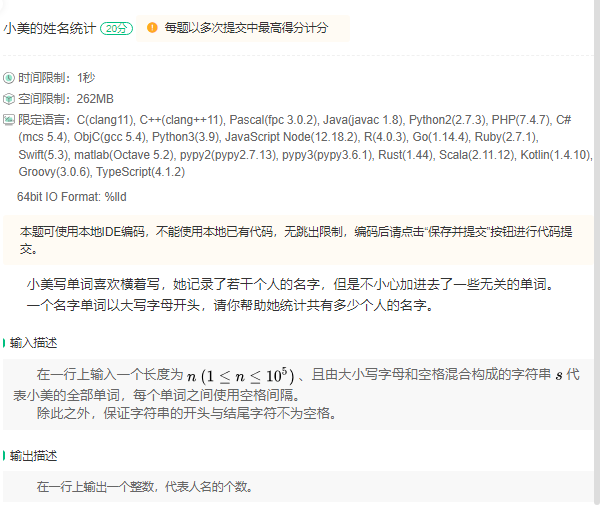
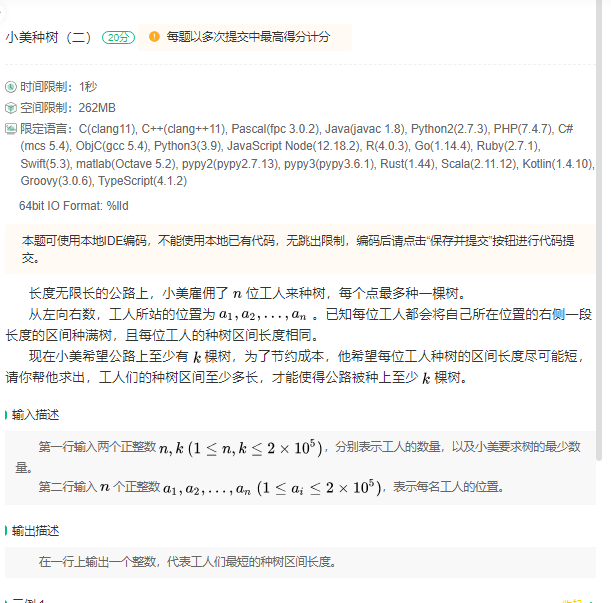
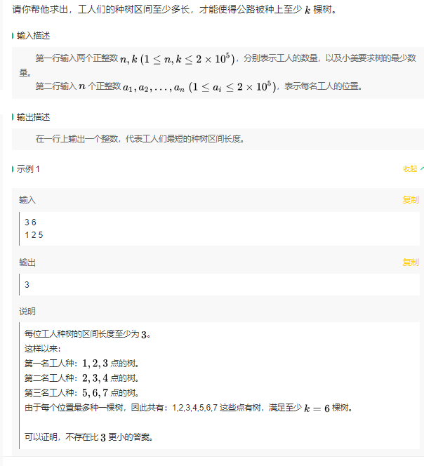
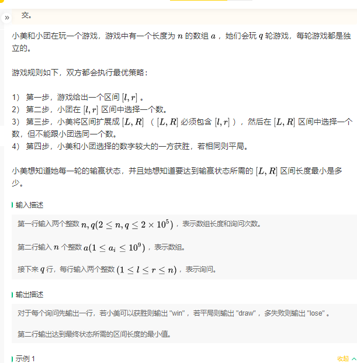
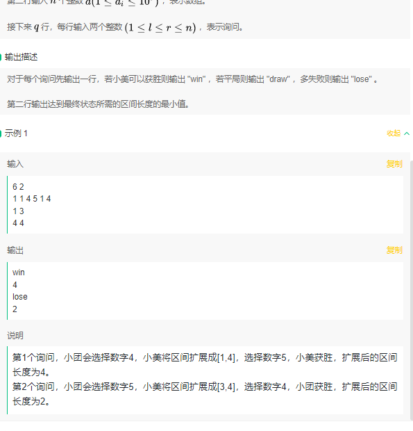

## 1.小美的姓名统计




这一题很简单，按空格分割然后判断首字母就可以了。


## 2. 小美种树






这一题如果手动模拟一下可以发现，暴力做法下

* 从1开始遍历区间长度
* 对于每次遍历，需要计算当前这个区间设置下总的有效树数量
  * 具体来说，使用前缀和数组`valid_tree[i]`来代表第i个工人的工作量纳入范围之后，前i个工人总的有效植树量

暴力代码如下

```c++
#include<iostream>
#include<algorithm>
#include<vector>

using namespace std;

int main() {
	int n, k;

	cin >> n >> k;

	vector<int> workers(n);
	for (int i = 0; i < n; i++) {
		cin >> workers[i];
	}

	sort(workers.begin(), workers.end());

	int len = 1;

	while (1) {
		int last_pos = 0;
		// valid[i]代表到i为止的有效树数量
		vector<int> valid_len(n, 0);
		for (int i = 0; i < n; i++) {
			if (i > 0) {
				valid_len[i] = valid_len[i - 1];
                // 更新lastpos为上一个工人所覆盖到的最远距离
				last_pos = workers[i - 1] + len-1;
			}
			// 如果当前工人的位置不被之前工人覆盖到，更新lastpos
			if (workers[i] > last_pos) {
				last_pos = workers[i] - 1;
			}

			valid_len[i] += workers[i] + len - 1 - last_pos;

			

			//cout << valid_len[i] << " ";
		}
		//cout << endl;
		if (valid_len[n - 1] >= k) {
			break;
		}
		len++;

	}
	cout << len << endl;

}
```


不知道为什么能过，可能没卡


理论上可以改进的地方是

* **区间确定上的调整：**先调参调出来一个区间最大长度len（总需求树数量/工人个数），然后对这个len做二分查找

* 当我们已知len的情况，想要获得len+1时候的valid_tree数组，是否可能呢？其实是可以的，

  * 我们可以额外使用一个数组记录每个工人之前差几个格子，然后直接更新

    具体来说，对于区间长度+1

    * 如果这个工人之前的空闲格子数为0，代表上一个工人已经覆盖到了自己的第一个位置，因此总个数不变
    * 同理，如果这个工人早就被覆盖了，那么区间+1对于其总个数也不变
    * 唯一会使得树的总个数改变的情况是这个工人在上一个工人的区间加一之后没被影响，同时也没有碰到下一个工人的区间，此时它的增长算有效增长

  但是显然可以发现，这也需要遍历一遍工人，因此没有改进


可能就是一道模拟题


## 3.小美小团玩游戏





我们可以分析一下这道题，暴力的时候我们需要找什么

* 当前区间的最大值
* 前面区间第一个大于这个最大值的值
* 后面区间第一个大于这个最大值的值

显然，避免遍历的方式就是打表

对于任意`[i,j]`区间最大值，打一个`2e5*2e5`的表就好了。但是明显爆内存了


我只能期待l，r比较小，也就是我不优化第一个的复杂度，而是只要不遍历前后两个区间就好了。这种方法对于那种，查你`2e5`次`[1,n]`区间的完全没办法，老老实实的遍历`2e5*2e5`次。

但是，如果对于l，r离得很近的话，就没事了，我们使用一个前向数组记录到i为止出现的最大值，以及最近出现最大值的为止。

使用一个后向数组记录相似的情况。

因此，我们就能快速查询`[l,r]`区间外边是否存在比他大的值。

```c++
#include<iostream>
#include<vector>
using namespace std;
#include <iostream>
#include <vector>
#include <algorithm> // std::max_element

std::pair<int, bool> findMaxAndCheckDuplicates(const std::vector<int>& vec, int start, int end) {
	// Ensure the start and end are within bounds
	if (start < 0 || end >= vec.size() || start > end) {
		throw std::out_of_range("Invalid start or end index");
	}

	// Find the maximum value in the specified range
	int maxVal = *std::max_element(vec.begin() + start, vec.begin() + end + 1);

	// Count how many times the maximum value appears in the range
	int count = std::count(vec.begin() + start, vec.begin() + end + 1, maxVal);

	// Return the maximum value and whether it appears more than once
	return { maxVal, count > 1 };
}


int main() {
	int n, q;
	cin >> n >> q;

	vector<int> nums(n);
	// ff[i]代表[0,i]的最大值与这个最大值最近出现的位置
	vector<pair<int,int>> ff(n);
    // bb[i]代表[i,size]的最大值与这个最大值最近出现的位置
	vector<pair<int,int>> bb(n);

	// 读取并维护前向后向数组
	for (int i = 0; i < n; i++) {
		cin >> nums[i];
	}
	ff[0].first = nums[0];
	ff[0].second = 0;
	bb[n - 1].first = nums[n - 1];
	bb[n - 1].second = n - 1;
	for (int i = 1; i < n; i++) {
		if (nums[i] >= ff[i - 1].first) {
			ff[i].first = nums[i];
			ff[i].second = i;
		}
		else {
			ff[i] = ff[i-1];
		}
	}

	for (int i = n-2; i >= 0; i--) {
		if (nums[i] >= bb[i+1].first) {
			bb[i].first = nums[i];
			bb[i].second = i;
		}
		else {
			bb[i] = bb[i+1];
		}
	}

	// 
	while (q--) {
		int l, r;
		cin >> l >> r;
		l--; r--;
		pair<int, bool> ans = findMaxAndCheckDuplicates(nums, l, r);
        
        // 如果l之前的区间，r之后的区间存在大于此区间的最大值，则选长度较小的区间
		if ((l-1>= 0 && ff[l - 1].first > ans.first) || (r+1 < n && bb[r + 1].first > ans.first)) {
			int len1 = (l - 1 >= 0 && ff[l - 1].first > ans.first) ? r - ff[l - 1].second + 1 : INT_MAX;
			int len2 = (r + 1 < n && bb[r + 1].first > ans.first) ? bb[r + 1].second - l + 1 : INT_MAX;
			cout << "win" << endl;
			cout <<min(len1,len2) << endl;
		}
		// 如果l之前的区间，r之后的区间存在等于此区间的最大值，则选长度较小的区间
		else if ((l-1>= 0 && ff[l - 1].first == ans.first) || (r+1 < n && bb[r + 1].first == ans.first)) {
			int len1 = (l - 1 >= 0 && ff[l - 1].first == ans.first) ? r - ff[l - 1].second + 1 : INT_MAX;
			int len2 = (r + 1 < n && bb[r + 1].first == ans.first) ? bb[r + 1].second - l + 1 : INT_MAX;
			int len3 = INT_MAX;

			
			if (ans.second) {
				len3 = l - r + 1;
			}

			cout << "draw" << endl << min(len1, min(len2, len3)) << endl;
		}
        // 这个值就是最大了，只要只要输出该区间长度就好了，需要考虑区间长度为1的情况，因为不能选这个所以只能随机向左向右选一个
		else {
			cout << "lose" << endl;
			cout << ((r - l) ? (r - l + 1) : 2) << endl;
		}


	}
}


```

