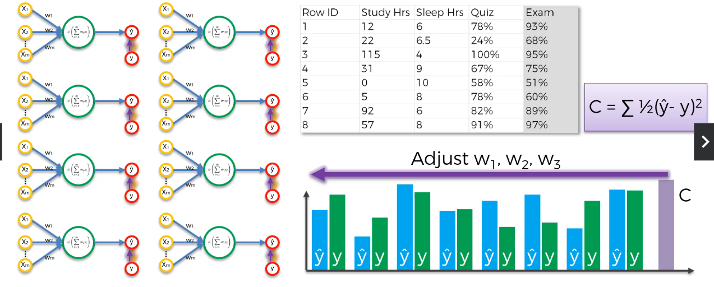
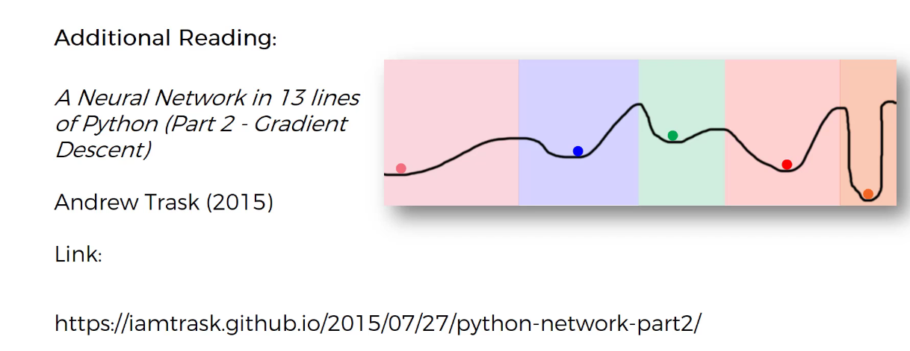

# 1. ANN

## 1.1 神经元

Recreate a Neuron

## 1.2 激活函数

### 阈值函数

yes or no function

### Sigmoid function

threshold function which is more smooth

probability that y equals to 1

常用于分类的output value

### Rectifier(ReLu)

整流函数,常用于Hiddenlayer

### 双曲正切函数

为什么双曲正切函数被广泛应用

## 1.3 神经网络工作原理

简单的输入输出线性映射

引入隐藏层对输入进行分类，也就是对输入进行特征搜索，每个隐藏层对应的神经元总结了一部分特征，成为了新的特征/属性。

如果没有激活层，那么终究只是线性的联系，效率还不如传统的统计学习。因此，引入了激活层，使得其能发掘非线性内在。

多数据costfunction训练，下图中是八个完全一样的感知机，他们的推理参数是一样的，当我们完成一个epoch的cost计算后，我们使用总体的cost来反向传播

不同的cost function补充阅读

## 1.4 梯度下降

## 1.5 随机梯度下降

梯度下降要求函数是凸的，否则将陷入局部最优解

==数据表明，随机梯度下降不要求代价函数是凸的==

在**普通梯度下降（Batch Gradient Decent）**中，我们取所有行，将他们用神将网络推理，然后获得一个这个批次数据的cost作为反向传播

然而，在**随机梯度下降**中，我们每次推理一条/批数据，都将执行一次反向传播。换句话说，在上面的例子中将执行八次反向传播/权重调整。

随机梯度下降避免了局部极值，因为其有更高的波动（伪随机探索），同时随机梯度下降速度更快。

同时，Batch gradient decent更像一个确定算法，而随机梯度下降更像一个随机方法（随机选择训练的行能获得随机的结果）

为了提高训练的稳定性，可以将二者结合起来，得到minibatch stochastic gradient decent

即为对小批进行随机梯度下降。

light read

hard read

## 1.6 反向传播(Back propagation)

反向传播的优势在于，由于算法的结构，可以同时调整所有权重，因此基本上可以知道神经网络哪个权重的哪个部分产生了误差。

