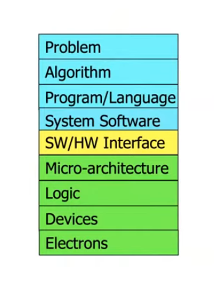
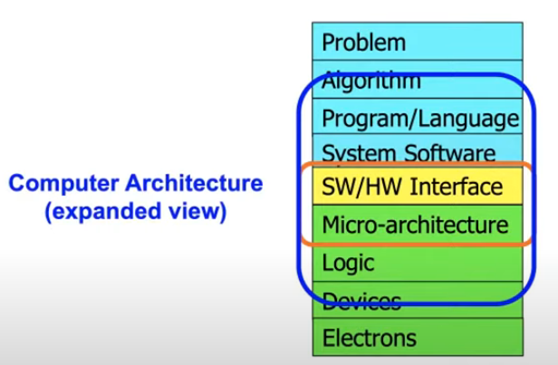
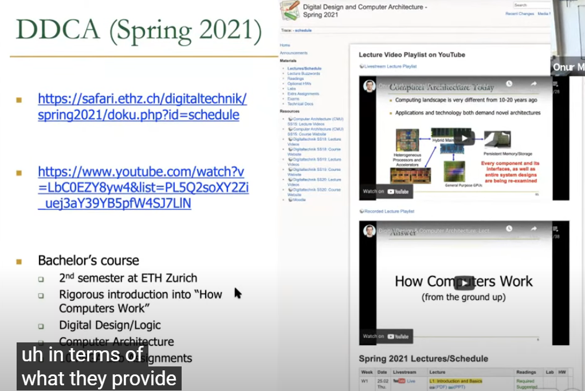
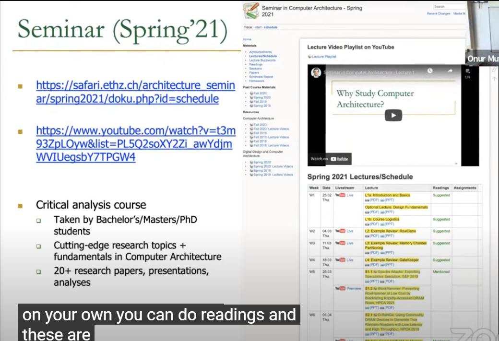
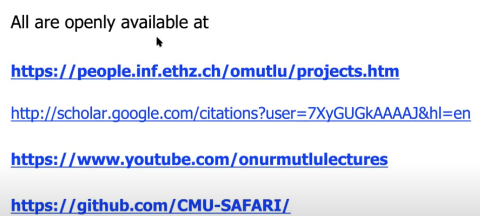
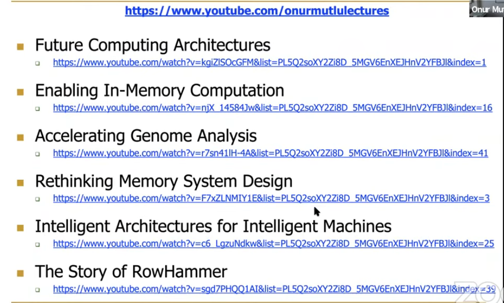
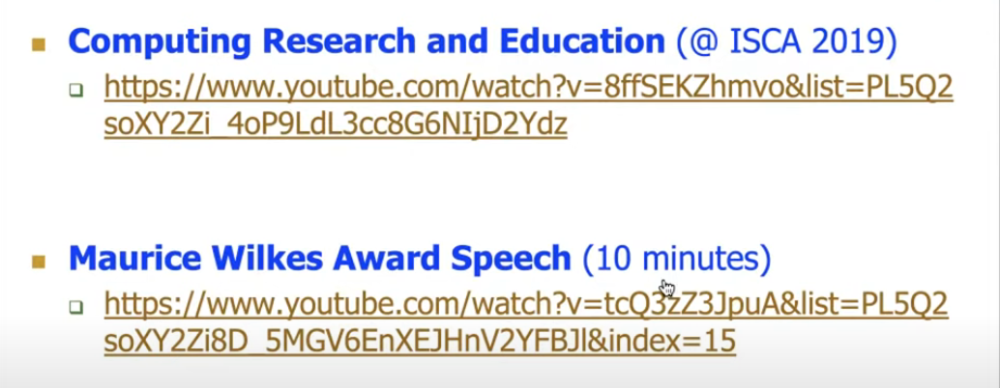
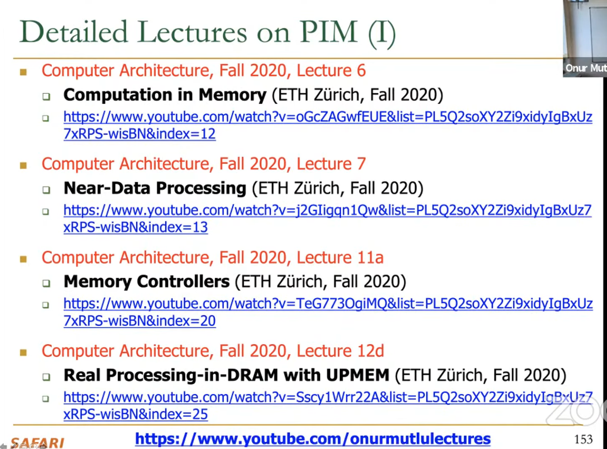
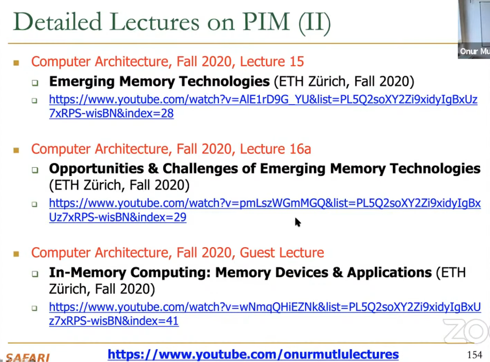

# Four Key Current Directions

* Fundamentally ==Secure/Reliable/Safe== Architectures
* Fundamentally ==Energy-Efficient== Architectures
  * ==Memory-centric==(Data-centric) Architectures(try not to move the data)
* Fundamentally ==Low-Latency and Predictable== Architecture
* Architecture for ==ML,Genomics,Medicine,Health==

# Transformation Hierarchy(转换层次结构)

To achieve the highest energy efficient and performance, we better co-design across the hierarchy: Algorithms to devices.(仅仅做两个层级的优化也可以，但是不如这样跨七个层级)

# 补漏学习与进阶学习

First Computer Architecture & Digital Design Course

Advanced Computer Architecture Course

https://www.youtube.com/@OnurMutluLectures

许多paper被提及

==其他资料，课程库==https://safari.ethz.ch/projects_and_seminars/doku.php

Open-Source Artifacts https://github.com/CMU-SAFARI

# why study computer architecture

improve communication between software and hardware

