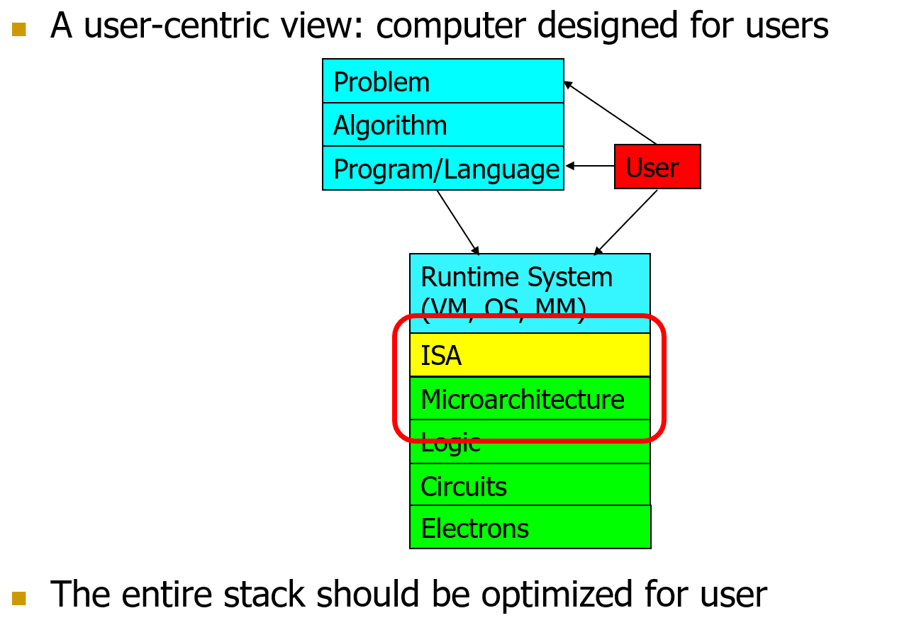
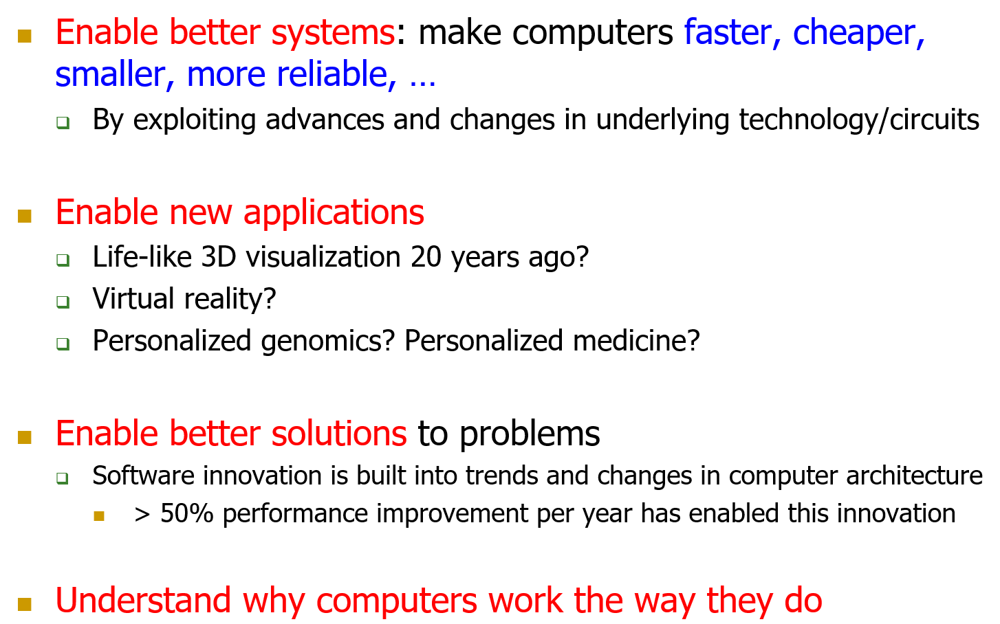
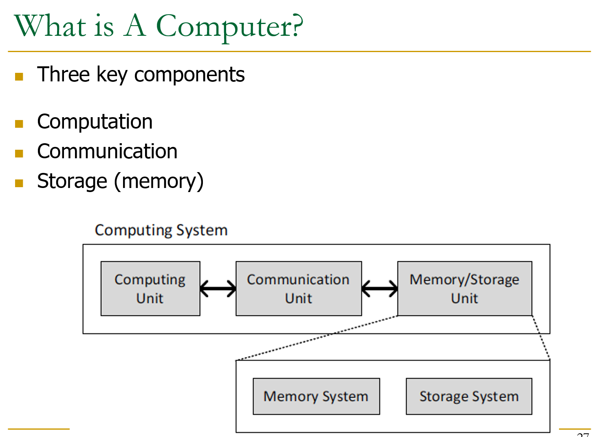
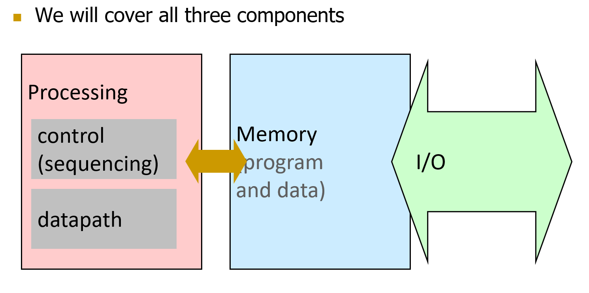
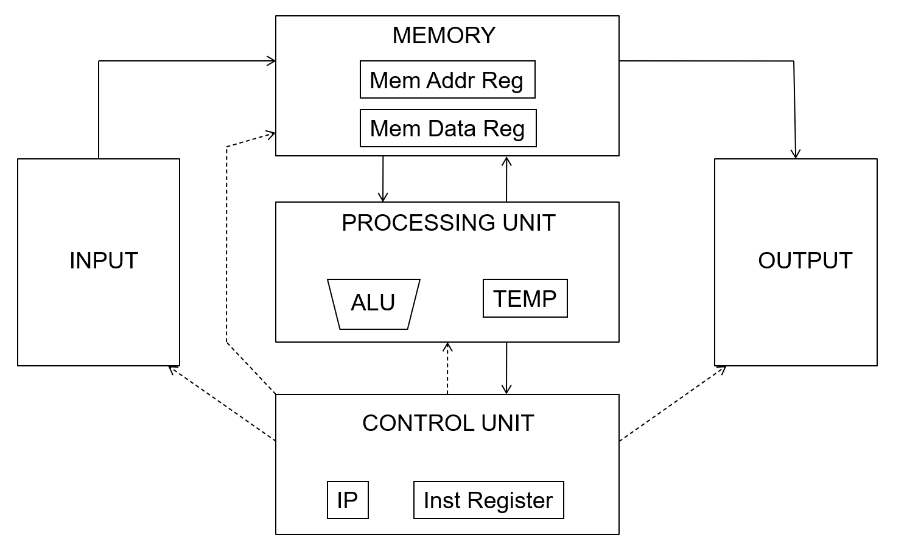
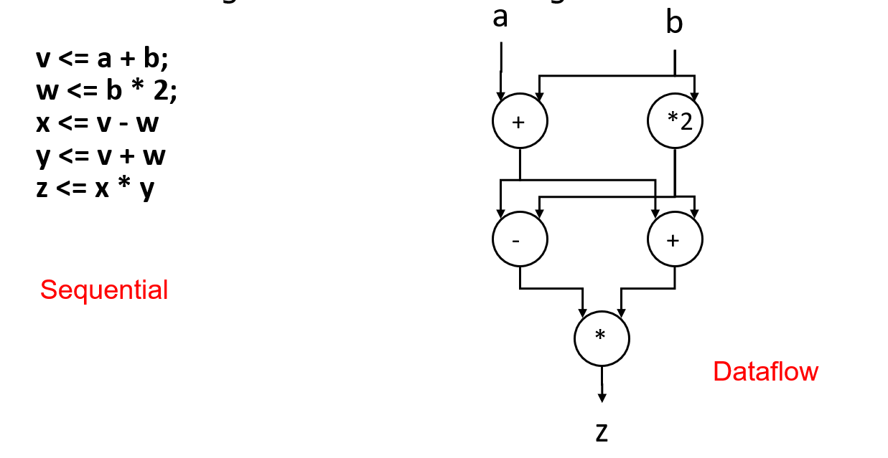
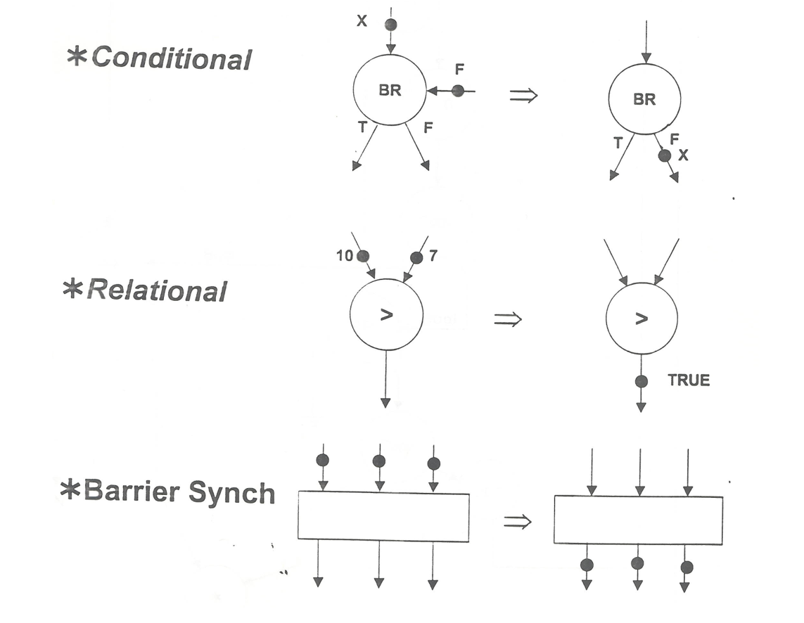
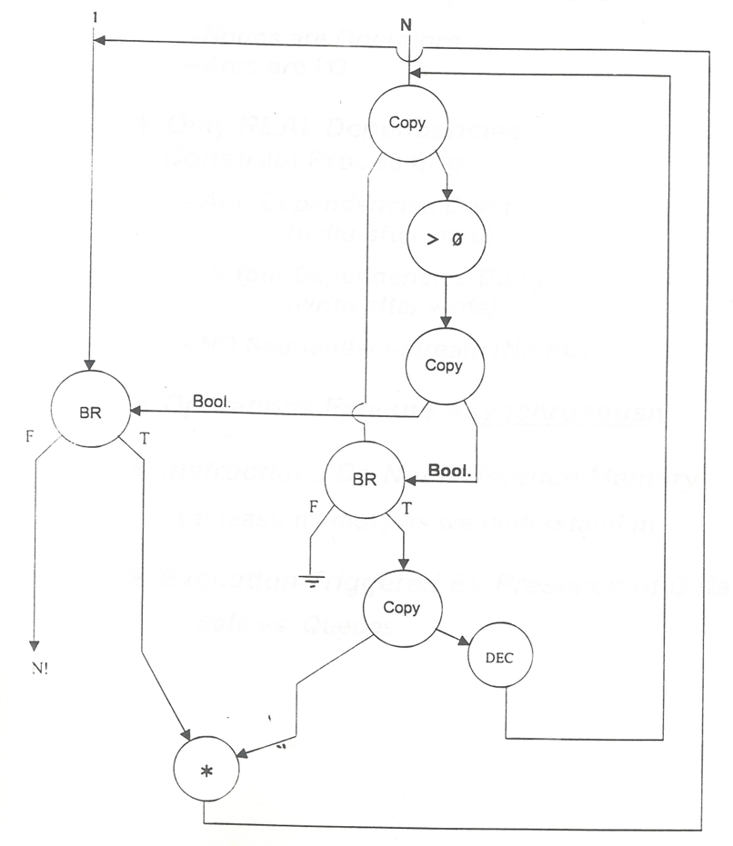
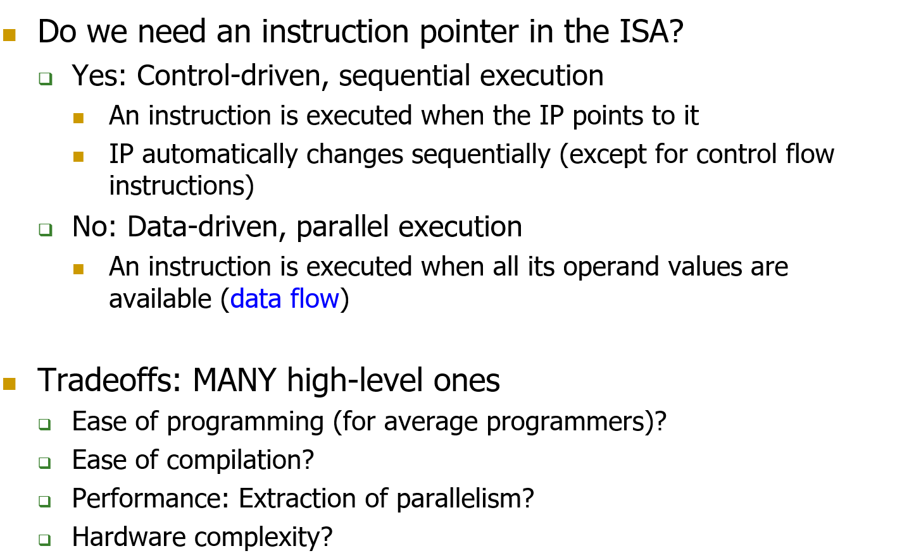
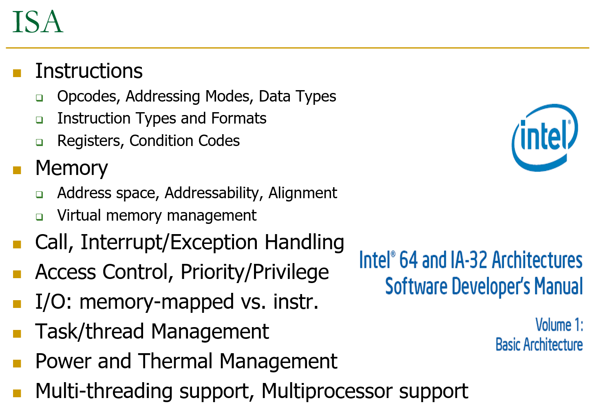

# What is algorithm

# Computer designed for users

# Why study architecture

# 1. Fundamental(what will remain unchanged)

### 1.1 What is a computer

==接下来会分为三大类，即为Processing，Memory和IO来讲述体系结构==

### 1.2 无敌的冯诺伊曼结构以及DataFlow结构

#### 1.2.1 冯诺依曼结构

冯诺依曼架构，也被称为指令存储型计算机**(stored program computer)**,其指令被存在内存中。其主要有以下两个特性：

* Stored Program
  * 指令被储存在一个线性的存储数组中(linear memory array)
  * 内存统一(Memory is unified)， 也就是说指令和数据共享同一块内存，没有专门的存储空间来分别存储他们。这种设计简化了硬件，但是也意味着指令和数据可能会互相干扰。
  * 存储值的解释取决于控制信号(The interpretation of a stored value depends on the control signals),这意味着同一块内存中的值可以被解释为指令或者数据，取决于当前的操作和信号。
* Sequential instruction processing
  * 使用一个单一、连续的存储块来存储指令（程序）和数据。同一时刻仅一个指令执行（不同于现代的并行结构）。指令经历了fetched, executed, and completed三个阶段。
  * **程序计数器 (Program counter)**: 也称为指令指针，它指向当前正在执行的指令。每当一个指令完成后，程序计数器就会递增，指向下一个指令。
  * **程序计数器的顺序增加 (Program counter is advanced sequentially)**: 除非遇到控制转移指令（如跳转或分支），否则程序计数器会顺序地增加。控制转移指令可以更改程序计数器的值，使其跳转到内存中的另一个位置，从而改变执行流程。

#### 1.2.2 DATAFLOW 结构

冯诺依曼结构是控制流(control flow order)的单个指令处理，也就是指令指针式(instruction pointer)的处理。指令顺序执行除非(explicit control flow instruction)。

DATAFLOW model中一个指令被取出并在==数据流(data flow order)==中执行。这种方法不需要instruction pointer，因为instruction是固定的几个，只是数据流穿过这些指令硬件。

1. **数据流顺序 (Dataflow order)**: 在数据流模型中，==指令的获取和执行是基于数据流的顺序==，而不是预先设定的程序顺序。这意味着==指令只有在其操作数准备好时才会被执行==。
2. **无需指令指针 (No instruction pointer)**: 由于指令是基于其操作数的可用性来执行的，因此不需要指令指针来顺序地获取指令。相反，指令在其操作数准备好时自然地“浮现”。
3. **指令排序由数据流依赖性指定 (Instruction ordering specified by data flow dependence)**: 这意味着指令的执行顺序是由其操作数的可用性决定的，而不是由预先设定的程序顺序决定的。
4. **每个指令指定“谁”应该接收结果 (Each instruction specifies “who” should receive the result)**: 这意味着==每个指令都明确指定了其输出应该发送到哪里==，从而确保数据流的正确性。
5. **指令可以在所有操作数接收到时“触发” (An instruction can “fire” whenever all operands are received)**: ==这意味着只要一个指令的所有输入都可用==，它就可以开始执行。
6. **潜在地，许多指令可以同时执行 (Potentially many instructions can execute at the same time)**: ==由于数据流模型的并行性，许多不同的指令可以在同一时间执行，只要它们的操作数都已经准备好==。
7. **固有地更加并行 (Inherently more parallel)**: 数据流模型的设计使其固有地支持更高的并行度，因为它不受传统的顺序执行模型的限制。

DATAFLOW 有如下几种节点：

* **Conditional Node**:
  - **功能**: 根据某个条件决定数据流的方向。
  - **描述**: 这种节点通常有两个或更多的输出端口，但只有一个输入端口。当输入数据满足某个条件时，数据会被发送到一个特定的输出端口；否则，它会被发送到另一个端口。这允许数据流图在运行时根据数据值动态地改变执行路径。
* **Relational Node**:
  - **功能**: 比较两个或多个输入值，并根据比较结果产生一个布尔输出。
  - **描述**: 这些节点用于执行关系操作，如等于、不等于、大于、小于等。当所有输入都准备好时，节点会评估这些关系，并产生一个布尔结果，该结果随后发送到输出端口。
* **Barrier Synchronize Node**:
  - **功能**: 确保所有输入数据都准备好后再继续执行。
  - **描述**: 这种节点的主要目的是同步。它会等待所有输入数据都准备好后才将数据发送到输出端口。这确保了在某些关键点上所有的数据流路径都已经完成，从而使得后续的计算可以继续进行。

==以下是一个DATAFLOW下阶乘实现的例子==，

* **BR (Branch)**:
  - **功能**: 根据条件决定数据流的方向。
  - **描述**: 分支节点（Branch Node）通常用于实现条件分支。它根据输入的条件值来决定数据应该流向哪个输出端口。例如，如果条件为真，数据可能会流向一个方向；如果条件为假，数据则流向另一个方向。
* **Copy**:
  - **功能**: 复制输入数据到多个输出端口。
  - **描述**: 复制节点（Copy Node）接收一个输入值，并将其复制到多个输出端口。这允许同一数据值被发送到数据流图中的多个不同位置。
* **DEC (Decrement)**:
  - **功能**: 减少输入值。
  - **描述**: 递减节点（Decrement Node）接收一个数值输入，并将其减少一个单位（例如，减1），然后将结果发送到输出端口。
* ***** (Multiplication):
  - **功能**: 乘法操作。
  - **描述**: 乘法节点接收两个输入值，并计算它们的乘积。然后，它将乘法结果发送到输出端口。

下面这张图实现了N!。将数据复制为两份，左边那份作为累计乘的值，右边那份作为从N开始递减的乘数。

利用两个BR来引导当N减到0时，左边输出结果N!，右边停止数据流。

#### 1.2.3 ISA-level Tradeoff: Instruction Pointer

指令指针（IP）在指令集架构（ISA）中是否需要取决于正在使用的执行模型。让我们分解提到的两个模型：

1. **控制驱动，顺序执行（带IP）：**
   - **工作原理：**按照IP指定的顺序执行指令。IP通常顺序递增，指向要执行的下一条指令，除非控制流指令（如跳转或分支）更改它。
   - 优点：
     - **可预测性：**执行顺序明确定义。
     - **简单性：**无论是在硬件实现还是编程模型方面。
   - 缺点：
     - **有限的并行性：**一次只关注一条指令，使得更难利用许多应用中固有的并行性。
     - **性能瓶颈：**由于指令之间的依赖性或等待某些资源。
2. **数据驱动，并行执行（无IP）：**
   - **工作原理：**一旦操作数（数据）准备好，就执行指令。这是数据流模型的本质。
   - 优点：
     - **固有的并行性：**如果操作数准备好，可以同时执行多个指令，从而可能获得更高的吞吐量。
     - **灵活性：**执行不受严格顺序的约束，允许更动态和自适应的处理。
   - 缺点：
     - **复杂性：**硬件和编译器需要处理动态调度和依赖性跟踪。
     - **可预测性：**执行顺序可能不太直观，这可能使调试和推理程序行为更具挑战性。

**权衡：**

- **编程的便利性：**带有IP的控制驱动模型对于程序员来说通常更容易理解和使用，因为它们具有可预测的、顺序的特性。由于其固有的并行性和缺乏严格的执行顺序，数据驱动模型可能更具挑战性。
- **编译的便利性：**控制驱动模型的编译器可能更简单，但它们可能需要采用各种优化技术来提高性能。数据驱动模型的编译器需要处理依赖性解析和调度，这可能很复杂。
- **性能：**由于其能够利用并行性，数据驱动模型可能实现更高的性能。但实际的性能提升取决于应用程序以及硬件和编译器如何管理并行性。
- **硬件复杂性：**带有IP的控制驱动模型具有更直接的硬件实现。相反，数据驱动模型需要更复杂的硬件机制来跟踪数据依赖性、动态调度指令和管理并行执行。

总之，选择在ISA中使用或不使用IP取决于计算系统的具体目标和约束，包括目标应用、硬件能力和所需的权衡。

#### 1.2.4 ISA vs. Microarchitecture Level Tradeoff：指令集与微处理器层面调度之间的权衡

1. **ISA定义了程序员的视角**：当程序员编写或编译程序时，他们遵循ISA定义的规则和指令。从程序员的角度看，指令应该按照他们在代码中出现的顺序执行。
2. **微架构的自由度**：尽管ISA定义了指令应该如何被看到和执行，但微架构（即硬件的实际实现）有自由度来决定如何物理执行这些指令。例如，为了提高性能，现代处理器可能会使用乱序执行，这意味着指令可能不是按照它们在代码中的顺序执行的。
3. **遵循ISA的语义**：尽管微架构可能会乱序执行指令，但当这些指令的结果对软件可见时（例如，写入到内存或寄存器），它们必须“看起来”像是按照ISA指定的顺序执行的。这确保了程序的正确性，即使在物理上指令是乱序执行的。
4. **程序员的视角**：尽管在微架构级别可能发生了许多优化和调整，但从程序员的角度看，他们应该看到的是按照ISA指定的顺序执行的指令。这意味着，无论微架构如何执行指令，程序的输出和行为都应该与程序员期望的一致。

简而言之，这句话强调了微架构在执行指令时的自由度，同时也强调了它必须遵循ISA的语义，确保程序的正确性和预测性。

### 1.2.5 what is ISA?

这段文字概括了计算机系统中与指令集架构（ISA）和系统管理相关的关键概念和组成部分。以下是对每个主题的简要总结：

1. Instructions（指令）:
   - 包括操作码（Opcodes）、寻址模式（Addressing Modes）、数据类型（Data Types）等。
   - 描述了计算机中执行的操作和指令的编码方式。
2. Instruction Types and Formats（指令类型和格式）:
   - 涵盖了各种不同类型的指令，以及它们的格式和结构。
3. Registers（寄存器）:
   - 用于存储数据和执行操作的内部存储设备。
   - 还可能包括条件码寄存器（Condition Codes）。
4. Memory（内存）:
   - 包括地址空间、可寻址性、对齐等概念。
   - 涉及到计算机内存的组织和管理。
5. Virtual Memory Management（虚拟内存管理）:
   - 讨论了虚拟内存系统，包括内存分页和交换等概念。
6. Call, Interrupt/Exception Handling（调用、中断/异常处理）:
   - 包括函数调用、中断请求和异常处理的机制。
7. Access Control, Priority/Privilege（访问控制、优先级/特权）:
   - 涉及对资源的访问控制、权限和优先级管理。
8. I/O: memory-mapped vs. instr.（输入/输出：内存映射 vs. 指令）:
   - 讨论了输入和输出设备的访问方式，包括内存映射和指令方式。
9. Task/thread Management（任务/线程管理）:
   - 描述了任务和线程的创建、调度和管理。
10. Power and Thermal Management（功耗和热管理）:
    - 涉及系统的功耗和温度管理，以提高效率和稳定性。
11. Multi-threading support, Multiprocessor support（多线程支持、多处理器支持）:
    - 讨论了多线程和多处理器系统的支持和协同工作。