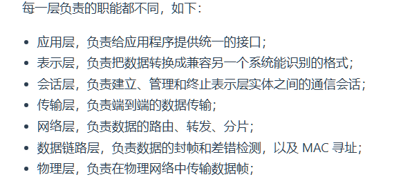
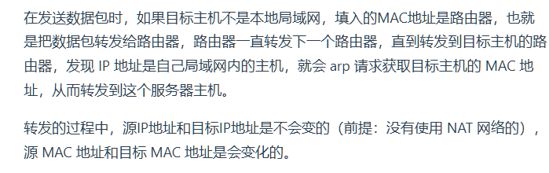

## 1.模型

### 1.1 OSI模型

> 主要包括
>
> * OSI模型有哪七层
> * 每一层基本的功能和职责
> * 某些层的常见协议




### 1.2 TCP/IP四层模型

> - 理解 TCP/IP 模型通常被描述为 4 层，**能够清晰地描述网络模型的层次结构。**
> - **能够解释每一层的作用**，知道 TCP/IP 模型的层次是如何与 OSI 模型相对应的。
> - **能够举例说明每层使用的协议**，**对某些层次的深入理解**，比如 TCP 的三次握手、四次挥手，IP 数据报的路由选择。
> - **理解不同层次间的交互**：了解数据是如何在这些层次之间流动的，以及每一层如何为数据的传输添加或移除其所需的头部信息。


#### **应用层（报文）**：

* 仅用于提供应用功能，例如HTTP、FTP、Telnet、DNS、SMTP等。
* 应用层仅产生任务，而不关心任务如何被解决。
* **应用层是四层之中唯一一个工作在用户态的**
* 应用层打包一个==Message==，包含了
  * 主要的数据内容
  * **应用协议的头部**
* 

#### **传输层（数据段）**：

* 应用层的Message交给传输层。传输层负责处理发送端**进程**与接收端**进程**的对接问题，信息分段与重组问题（TCP）以及纠错问题（TCP）。
* 传输层拥有两个**传输协议**：UDP和TCP
  * TCP（Transmission Control Protocol）保证可靠传输，拥有流量控制，超时重传，拥塞控制等容错机制
  * UDP只负责发送数据包，不保证数据包的抵达。实时性高，传输效率高。
* **建立连接：**如果使用TCP协议，那么传输层负责三次握手和四次挥手来建立，关闭连接
* **分段与重组**：对于TCP协议，如果传参数层的数据包大小超过MSS(Maximum Segment Size)，那么数据包将被分块，并在接收端重新组装。
* **纠错**：TCP通过校验来检测传输过程中可能发生的错误，如果有错误会请求重新发送。


> TCP协议里面由两个端口，
>
> * 一个是浏览器监听的端口（通常是随机生成）
>
>   * 当你在浏览器中发出HTTP或HTTPS请求时，浏览器会为每个连接分配一个**临时端口**（通常由操作系统随机生成）。这个端口号是客户端用于接收服务器响应的。
>
>   * **客户端（浏览器）的端口号**是随机分配的，范围通常在`1024`到`65535`之间。这些端口被称为**动态端口**或**临时端口**，用于短期的客户端-服务器连接。
>
> * 一个是Web服务器监听的端口（HTTP默认端口号是80，HTTPS默认端口号是443）
>
>   **Web服务器**（例如运行HTTP或HTTPS的服务器）监听特定的端口号，等待客户端（如浏览器）发起连接。
>
>   - 对于**HTTP**，服务器默认监听的端口是**80**。
>   - 对于**HTTPS**（安全的HTTP），服务器默认监听的端口是**443**。
>
>   这些端口被称为**服务端端口**，它们是预先定义的，并且服务器会始终在这些端口上等待客户端连接。


##### TCP的HEAD

传输层添加了TCP头部，成为一个==TCP报文段==（TCP Segment），包含

* **源端口号，目的端口号**：用于标识发出进程与接收的进
* **序列号**：确保数据包按顺序到达，给每个数据包确定一个序列号
* **确认号**（Acknowledgement Nubmer）：目的是确认发出去对方是否有收到。如果没有收到就应该重新发送，直到送达，这个是为了解决丢包的问题。
* **数据偏移**：标明TCP head长度
* 标志位：说明该包的功能，包括
  * SYN：建立连接的初始同步请求
  * ACK：确认接收到的数据
  * FIN：关闭连接
  * RST：重置连接
* **窗口大小**：双方各声明一个窗口（缓存）大小，标识自己当前能够的处理能力，别发送的太快，撑死我，也别发的太慢，饿死我。

> 其余的就是用于错误检测的Checksum以及其他TCP功能字段


##### 连接：TCP的三次握手


==三次握手目的是**保证双方都有发送和接收的能力**。==

* 一开始，客户端和服务端都处于 `CLOSED` 状态。先是服务端主动监听某个端口，处于 `LISTEN` 状态。

* 然后客户端主动发起连接（同步请求） `SYN`，之后处于 `SYN-SENT` 状态。

  > synchronize, synchronize sent表示同步中的sent阶段

* 服务端收到发起的连接，返回 `SYN`，并且 `ACK` 客户端的 `SYN`，之后处于 `SYN-RCVD` 状态。

* 客户端收到服务端发送的 `SYN` 和 `ACK` 之后，发送对 `SYN` 确认的 `ACK`，之后处于 `ESTABLISHED` 状态，因为它一发一收成功了。

* 服务端收到 `ACK` 的 `ACK` 之后，处于 `ESTABLISHED` 状态，因为它也一发一收了。

> 如果没有客户端的`ACK`，那么服务端就不知道自己该不该接收连接
>
> * 如果直接设置处于ESTABLISHED，那么有可能客户端没有接收到答复不敢发数据包，因此导致这个连接就一直存在不会消失
> * 如果直接关闭连接，那就烂了，永远无法连接


##### 断开连接：四次挥手

四次挥手主要是保证客户端与服务端都停止接收和发送数据。（因为==TCP是双全工通信==）。


1. **客户端发送`FIN`**：请求终止连接。$\color{red}客户端不再发送数据$

2. **服务端发送`ACK`**：确认接受。此时客户端已经不会向服务端发送数据。$\color{red}表示知晓客户端不再发送数据，表示自己不会再接收你的数据$

3. **服务端发送`FIN`**：如果服务器也准备关闭连接（不再向客户端发送数据），它会发送自己的**FIN报文段**，表明它也不再发送数据，并请求关闭服务器到客户端的方向连接。$\color{red}服务端不会再发送数据$

4. **客户端发送`ACK`**：客户端收到服务器的FIN报文后，发送最后的**ACK报文段**，确认服务器的FIN请求。这一步表示客户端已经同意关闭连接。$\color{red}表示知晓服务端不再发送数据，客户端不会再接收服务端信息$


可以发现，

* 如果没有2，那么客户端不能保证服务端关闭接收
* 如果没有3，客户端不能保证服务端不再发送（无法关闭自己的接收）
* 如果没有4，服务端不能保证客户端不再接收数据（即为客户端可能仍然需要监听服务端）


#### MTU与MSS


#### **网络层（数据包）**

* 网络层主要是负责通信途中的事件处理
* 网络使用IP协议（Internet Protocol）

网络层通常存在于发送端，接收端与路由器中


当网络层接收到从传输层传下来的Segment之后

* **添加IP头部，成为数据包(Packet)**：这个头部会帮助数据包在网络中寻路与跳转，并在接收端标明其数据属于TCP还是UDP

  * **源IP，目的IP地址**：**IP头中的目的IP地址**指的是**最终接收设备的IP地址**

    > 这里主要是目的IP地址可能有一些疑问
    >
    > 目的IP地址通常来自于这么几个方面：
    >
    > 1. 应用层的域名解析：例如输入网址->向DNS服务器发起域名解析->获得该域名IP地址->客户端将其作为目的IP地址
    > 2. 静态配置：从一开始就知道要发给谁，手搓了一个IP地址
    >
    > 如果设备处于局域网内需要通过网关与互联网交互，那么第一跳的目的IP地址默认为网关地址，然后由网关进一步转发。

  * **协议字段**：标明里面的segment是来自TCP还是UDP，TCP通常为`0x06`

  * TTL：网络中传输的最大路由个数(Time to Live)

* **分片**：如果IP报文大小超过MTU，那么IP协议会将其**再次分片,**

  > IP协议需要分片的原因主要与不同网络链路的**最大传输单元（MTU, Maximum Transmission Unit）**限制有关。网络中的每个链路（如以太网、Wi-Fi、光纤等）都有一个限制，即它能够传输的数据包（或帧）的最大字节数。由于不同网络设备或链路的MTU大小可能不同，为了确保数据包能够跨越不同的网络传输，**IP协议引入了分片机制**，保证即使数据包超过某段网络的MTU限制，也能被拆分成更小的片段进行传输。

  * 当网络层（IP层）检测到生成的IP包（包括传输层的头部和数据部分）超过链路层的MTU时，就会对这个IP包进行**分片**。

  * 分片时，网络层不会特别处理传输层的头部，而是将整个传输层报文段（包括头部和数据）看作**数据载荷**，直接根据MTU限制进行切割。

  * 接收端的IP层会重新接收到的所有分片，**基于IP头中的片偏移字段和标识字段**，将这些分片按照正确的顺序组装起来。

    重新组装后，接收端会得到完整的IP数据包


##### 路由表

此时其实就会有一个疑问，IP头只知道目的IP地址，那么该如何通过路由器跳转呢？事实上，每个路由器在接收到数据包之后，直接根据该目标IP地址决定下一个跳转。

具体来说，**每个路由器都会有这么一个路由表**

| 目标网络     | 子网掩码        | 下一跳      | 接口  | 度量值 | 标记 |
| ------------ | --------------- | ----------- | ----- | ------ | ---- |
| 192.168.1.0  | 255.255.255.0   | 192.168.1.1 | eth0  | 1      | U    |
| 10.0.0.0     | 255.0.0.0       | 10.0.0.1    | wlan0 | 2      | U    |
| 0.0.0.0      | 0.0.0.0         | 192.168.1.1 | eth0  | 1      | UG   |
| 192.168.1.10 | 255.255.255.255 | 0.0.0.0     | lo    | 0      | UH   |

目标网络地址通常会表示为`192.168.1.0/24`表示数据包发往`192.168.1.x`这个子网的所有主机。

当路由器或主机收到一个数据包时，它首先检查该数据包的**目的IP地址**。然后通过查阅**路由表**，根据目的IP地址找到匹配的路由条目。通常，路由器会根据目的IP地址和路由表中的子网掩码进行匹配，选择与目的IP地址匹配位数最多的路由条目。这称为**“最长前缀匹配”或“最长匹配优先”。**一旦找到匹配的路由条目，路由器会检查该条目中的“**下一跳地址**”字段，决定将数据包发送到哪个设备。这可能是：

- 直接连接的目标设备（如果数据包发往的网络是直接连接的局域网）。
- 另一个路由器的IP地址，作为中间路由器来转发数据包。


有些路由器中可能不仅仅使用路由表，而是使用**动态路由协议**。动态路由协议允许互联的路由器共享路由表，并在其内部建立一张子图，可以计算最短路确定最优跳转路径。


##### 局域网到互联网的地址转换

在通过网关转发时，也就是使用**NAT（网络地址转换）**时，特别是使用**源NAT**或**目的NAT**的环境中，路由器需要对IP地址进行转换。在这种情况下，下一跳的确定不仅仅依赖路由表，还涉及到地址转换规则。

- **源NAT**：内网设备发送数据包到外网时，NAT设备会将源IP地址替换为公共IP地址。下一跳可以是NAT设备外部接口连接的下一个路由器。
- **目的NAT**：当外部设备访问内部设备时，NAT设备会将目的IP地址替换为私有网络的内部IP地址，下一跳会根据替换后的目的地址来确定。


#### 网络接口层/数据链路层（数据帧）

数据链路层工作在网卡，硬件这一层，它直接管电信号发到哪里去。

更具体的说，它负责在**同一个网络（或同一个链路）**上通过物理地址（即**MAC地址**）进行数据传输。当网络层生成IP数据包并将其交给数据链路层时，数据链路层需要将数据包封装成**数据帧**，并为该帧指定目标设备的**MAC地址**，这样数据才能在局域网内传输。

==在硬件中有一个ARP缓存，存储了IP地址到MAC地址的映射。不同于网络层的最长匹配，IP地址到MAC地址的映射必须完全一致。==

如果目标设备的MAC地址未知（或者说不在ARP缓存内，也就是cache miss），数据链路层使用**ARP（地址解析协议，Address Resolution Protocol）**来获取目标设备的MAC地址。

当ARP缓存中没有目标IP地址对应的MAC地址时，设备会发起一个**ARP请求**。ARP请求是通过数据链路层**广播到局域网中的所有设备的。**


现在，设备已经知道了目标设备的MAC地址，数据链路层可以将数据包封装成数据帧，并填入目标MAC地址和源MAC地址。

- **封装帧**：数据链路层将IP数据包封装到以太网帧中，帧头中包含以下信息：
  - **目标MAC地址**：从ARP协议获取的MAC地址。
  - **源MAC地址**：发送设备的MAC地址。
  - **数据部分**：IP层传递下来的IP数据包。
- **发送帧**：设备通过网络接口将封装好的帧发送到目标设备所在的链路，目标设备在接收到该帧后，会将其解封装，并根据IP头中的目的IP地址进行进一步的处理。




### 从输入URL到页面展示发生了什么

简单来说，整体的路径是HTTP->DNS->TCP/IP

TCP/IP协议栈具体又可以标识为 TCP->IP->MAC->路由器->客户端


具体来说

* URL输入
* DNS解析
* 建立TCP链接
* 发送HTTP请求
* 服务端响应请求
* 解析渲染页面：
  * 处理HTML标记构建DOM树
  * 处理CSS标记构建CSSOM树
  * 合并为渲染树
  * 根据渲染树计算位置信息
* 断开TCP链接

#### URL的解析


对于默认的访问，例如`www.baidu.com`，它请求的就是默认文件`/default.html`

接下来就可以通过Web服务器和文件名生成请求消息


 (a) **请求报文**

HTTP请求报文由**请求行**、**请求头部**和**消息主体**三部分组成：

1. **请求行**：
   - **方法**：指定请求类型（如`GET`、`POST`等）。`GET`请求用于从服务器获取资源，而`POST`请求用于向服务器提交数据。
   - **URL**：指定要请求的资源路径，通常是相对路径，基于服务器的根路径。
   - **版本**：表示HTTP协议的版本，通常是`HTTP/1.1`或`HTTP/2`等。
2. **消息头部**：
   - 由多个**头字段**组成，每个头字段包含一个**字段名**和**字段值**，它们用冒号（`:`）分隔。例如`Accept: */*`，表示客户端可以接收任何类型的响应数据。
   - 头部字段用于为服务器提供额外的信息，例如客户端的能力、会话信息等。
3. **消息主体**（在`POST`等请求中有）：
   - 请求报文的主体部分，包含客户端向服务器发送的数据内容。例如，在`POST`请求中，主体可以包含表单数据或JSON格式的数据。

(b) **响应报文**

HTTP响应报文同样由**状态行**、**响应头部**和**消息主体**三部分组成：

1. **状态行**：
   - **版本**：表示HTTP协议的版本。
   - **状态码**：表示请求的处理结果，例如`200 OK`表示成功，`404 Not Found`表示请求的资源未找到。
   - **短语**：对状态码的简短说明，例如`OK`或`Not Found`。
2. **响应头部**：
   - 头部字段类似请求头部，包括`Content-Type`、`Content-Length`等，用于向客户端传达响应的额外信息。
   - 例如`Content-Type: text/html`表示服务器返回的内容类型是HTML。
3. **消息主体**：
   - 服务器响应的实际数据内容，例如HTML页面、JSON数据等。


**各部分的作用：**

- **请求行/状态行**：用于客户端和服务器之间的基本通信，告诉对方请求类型、状态等关键信息。
- **头部字段**：携带额外的元数据或控制信息，帮助传输数据的处理过程更加明确和有效。
- **消息主体**：在POST请求或响应中，承载实际传输的数据内容。


#### DNS查询

通过浏览器解析 URL 并生成 HTTP 消息后，需要委托操作系统将消息发送给 `Web` 服务器。

但在发送之前，还有一项工作需要完成，那就是**查询服务器域名对应的 IP 地址**，因为委托操作系统发送消息时，必须提供通信对象的 IP 地址。


这里的域名从后往前层级变小。

* `.`：最高域，根域
* `.com`：顶级域DNS服务器
* `server.com`：权威DNS服务器


#### 进入协议栈发送


通过 DNS 获取到 IP 后，就可以把 HTTP 的传输工作交给操作系统中的**协议栈**。

具体来说，应用程序通过调用socket库，来委托协议栈工作。

底层来看，包括

* TCP三次握手
* 构建HTTP请求->发送
* 服务器接收请求->解包到应用层
* HTTP响应
* TCP四次挥手关闭连接
* 浏览器渲染页面
* 页面显示


#### 交换机

除了路由器，还有一个东西叫交换机。交换机不会核查MAC，因为交换机并没有MAC，它只负责将帧转发给对应MAC的路由器。

路由器遇到不是自己MAC的包会直接丢弃.


### 1.3 Linux网络模型

#### Linux如何接收数据包

1. **网卡接收数据包**

   当网卡接收到一个数据包时，网卡自动使用DMA将这个数据包直接写入内存中的Ring buffer，这是一块循环使用的缓冲区，避免了CPU屈尊频繁参与内存拷贝。

2. **网卡通知操作系统**

   网卡在将数据包写入Ring Buffer后，需要通知操作系统有新的数据包到达。这个过程中，有两种方式可以通知操作系统：

   - **中断驱动模式**：每当网卡接收到一个数据包时，网卡会触发**硬/软中断**，告诉CPU有新的数据包需要处理。操作系统随后会调用中断处理函数来处理这个数据包。

     > 硬中断是由**硬件设备**触发的中断信号，用于向CPU通知发生了需要立即处理的事件。硬中断发生时，CPU会暂时中止正在执行的任务，优先去处理这个中断事件。
     >
     > 软中断是由**软件**或内核手动触发的中断，用于处理某些可以延迟执行的任务，或者需要处理复杂的操作而不能在硬中断中完成的任务。软中断不会立即打断CPU正在执行的任务，而是放入一个待处理队列中，由系统在合适的时间处理。

   - **NAPI（New API）机制**：为了应对高网络负载下频繁的中断，Linux 2.6引入了NAPI机制，它结合了**中断驱动**和**轮询**两种方式。在数据包到达后，NAPI机制最初通过中断通知系统，但在处理大量数据包时，会转换为轮询方式(定期查看缓存)，减少中断的频率，提高效率。

   ==在这一步，网络协议栈并不会被调用，因为那是内核态的活==

3. **软中断处理**：**网络协议栈**

   若是采用软中断，这些事务会被标记为待处理，在内核有空时处理。软中断处理是在特殊的内核上下文中执行的，不允许睡眠或阻塞。软中断可以在系统的任意时间执行，**通常在内核返回用户空间之前或在定时器触发时处理。**

   如果软中断也频繁发生，内核会使用`ksoftirqd`线程来处理软中断，具体来说，`ksoftirqd`拥有更低的优先级。

   ==在软中断阶段，数据包会被从Ring buffer中取出，并将其交给网络协议栈处理。==

   ==在解析完毕获得完整数据包之后，会被放入应用程序的**Socket接收缓冲区**，等待应用程序通过recv()或者read()读取数据==

   软中断处理完成后，系统清除中断标记，返回用户态继续处理其他任务。


下图展示了整个过程，蓝色为内核态处理，绿色为应用层的request，工作在用户态，但是因为socket调用是内核态，因此它也需要进入内核态完成数据传递。


#### Linux发送网络包的流程

1. 应用程序会调用Socket发送数据包的接口（系统调用）

   具体来说，内核会申请一个内核态的`sk_buff`内存，将其加入发送缓冲区。

2. 网络协议栈从Socket发送缓冲区取出sk_buff，并按照TCP/IP协议栈从上到下逐层处理

   > 这里发送的sk_buff是一份拷贝，这是为了丢失重传时能够重传
   >
   > 如果接收端ACK了数据包，那么就可以真正删除
   >
   > sk_buff使用一整块空间以及一个数据指针来避免层之间添加/删除HEAD频繁的复制
   >
   > 

3. 在处理完成后，触发软中断告诉网卡驱动发送网络包。网卡驱动从发送队列读取sk_buff，挂到Ring Buffer中，接着驱动将sk_buff映射到网卡可访问网卡的内存区域，触发真实发送。


## 附录


## 2. 协议

### 2.1 HTTP协议

#### HTTP是什么

**HTTP是一个专门在两点之间传输超文本（文字，图片，视频的混合体）的约定和规范。**


在HTTP协议中，转发时中间人需要遵从HTTP协议，只要不打扰基本的数据传输，就可以添加任意额外的东西。


#### HTTP报文结构


#### HTTP的状态码


在服务端响应时，会添加一份状态码来标识发送请求的处理情况


* `2xx`类状态码表示**服务器成功处理了客户端的请求**
  * `200 OK`：是最常见的成功状态码表示一切正常。如果你发送的不是`HEAD`请求就会**有body数据**（`HEAD`类似于`GET`请求，但是只返回响应头部，不返回响应主体，即只获取资源元数据而不下载实际内容）
  * `204 No Content`：响应头默认**没有body数据**
  * `206 Partial Content`：表示响应返回的 body 数据并不是资源的全部，而是其中的一部分，也是服务器处理成功的状态。通常应用于HTTP分块下载或者断点续传。
* `3xx`类状态码表示**客户端请求的资源是否发生了变动**，需要客户端用新的URL重新发送请求的资源（重定向）
  * **返回字段Location中含有新的URL用来跳转**
    * `301 Moved permanently`：请求资源不存在了，用心的URL访问
    * `302 Found`：临时重定向，说明请求的资源还在，需要用另一个URL访问
  * **不含新URL来跳转**
    * `304 Not Modifie：`表示**客户端请求的资源自上次请求以来没有修改**。
    * 通常来说，浏览器在第一次加载资源后，可能会缓存资源。当用户再次访问同一个页面时，浏览器会发送一个条件请求询问资源是否更新，如果服务器返回304，则浏览器直接使用缓存数据。因此304返回的**不包含body**
* `4xx`类表示**因为客户端问题，请求被拒绝**
  * `400 Bad Request`：客户端请求报文有误
  * `403 Forbidden`：服务器禁止访问资源
  * `404 Not found`:请求的资源在服务器上不存在或未找到
* `5xx`类表示**因为服务端问题，请求被拒绝**
  * `500 Internal Server Error`：服务器发生错误（不知道具体错误）
  * `501 Not Implemented`：服务器没有此功能
  * `502 Bad Gate Way`：这代表，访问的服务器是一个网关，该服务器自身正常，但是其访问后端服务器时发生了错误
  * `503 Service Unavailable`：表示服务器当前繁忙，无法响应客户端


#### HTTP的字段

字段通常由首部字段名+字段值组成。常见字段包括

* `Host:www.xxx.com`，用于指定服务器域名

* `Content-Length:1000`：**返回时的字段**，用于表明此次回应的数据长度

  这里需要澄清一下，Content-Length是用于解决粘包的一个长度字段

  因此，Content-Length:1000代表此次回应的长度为1000，其余的不是此次回应，可能是下次回应

  > 在发送一个大数据包的时候，TCP会将其拆成若干个包，这被称为拆包
  >
  > 但是在频繁发送小数据包的时候，不可能为每一个小数据包都用TCP包装起来，因此TCP会将其合并到同一个Segment内加上TCP头。此时，Body内对这些数据的边界是不清晰的，这也就是粘包。
  >
  > 由于TCP本身是基于字节流的协议，解决粘包问题的关键在于**明确数据包的边界**。通常有几种常见的解决方案：
  >
  > * **使用定长协议**：定义每个数据包的长度是固定的，这样接收方每次按照固定的长度读取数据。比如，规定每个数据包为1024字节，不足时使用填充。
  > * **使用分隔符**
  > * **在每个数据包前面添加一个长度字段**，用于表示数据包的总长度。接收方首先读取长度字段，之后按照长度字段的值读取剩余的数据。
  >
  > **HTTP协议通过回车符、换行符标记HTTP HEAD的边界，使用Content Length字段作为HTTP Body的边界**

* `Connection:Keep-Alive`：通常用于要求服务器使用HTTP长连接机制，以复用链接

  > HTTP短链接：TCP链接建立->客户端请求->服务端响应->四次握手结束
  >
  > HTTP长连接：TCP链接建立后会保持

  HTTP/1.1默认是长连接，为了兼容老版本HTTP，需要设置Connection值为Keep-Alive

  > 这个HTTP keep alive与TCP KeepAlive不同，TCP KeepAlive指的是固定时间内没有接收到对应连接的数据包就发起问询，若是问询无结果就关闭连接。这是防止客户端挂了而使得此连接一直占用资源。

* `Content-Type: text/html; Charset=utf-8`: 用于解码body数据。

#### Request Method：GET与POST


HTTP的请求报文由三个部分组成

* 请求行
* 消息头
* 消息体（body）

其中**请求行**也由三个部分组成

* Method：包括GET、POST、PUT、DELETE
* 请求的目标资源路径(Request URL)
* HTTP版本

以下就是一个典型的请求行

```c++
GET /index.html HTTP/1.1 
```

加上一个消息头(首部字段名：字段值)

```c++
Host:www.baidu.com
```


常用的GET和POST分别代表请求资源，和请求对指定的资源作出处理

换句话说，GET请求一些资源，服务器**在响应报文中的body部分给你这些资源。**

POST发送一些资源，**写在请求报文的body部分**，服务器收到之后响应是否收到


因为GET方法是只读，因此它是**安全**且**幂等**的（无论操作多少次，结果都一致且未修改源数据）

同理，POST方法是不安全且非幂等的

这意味着GET方法可以使用缓存而POST方法不可以


#### HTTP缓存

对于一些幂等的请求，可以将这些相应的数据缓存在本地，下次需要时直接读取本地数据。

HTTP协议的头部有很多针对缓存的字段，其中有两大类缓存，**强制缓存和协商缓存**

##### 强制缓存

只要**浏览器判断**缓存没有过期，就直接使用浏览器本地缓存。


强制缓存使用以下两个头部字段实现**`Cache-Control`&`Expires`**

* `Cache-Control`是一个相对时间
  * 当浏览器第一次请求访问服务器资源时，服务器会返回资源同时返回一个**该资源的过期倒计时**
  * 当浏览器再次请求访问该资源时，首先会判断此时是否已经过期，若没有直接使用缓存
  * 服务器每次获得一个新的请求，都会更新这个倒计时
  * **Cache-Control**拥有高优先级，若是与其他字段出现则优先满足Cache-control的约束
  * **Cache-Control: max-age=3600**：告诉浏览器该资源可以缓存 3600 秒。
* `Expires`是一个绝对时间


##### 协商缓存

协商缓存也会向服务器发起请求，不过服务器返回的并不是资源，而是告诉浏览器是否可以使用本地缓存的资源。

==协商缓存必须通过配合强制缓存中的Cache-control字段使用，只有Cache Control提示你过期的时候，你才能主动的发起协商缓存，换句话说，**协商缓存是强制缓存的补充，使得能够在过期后也有方式不让服务器再发一次资源**==

* 如果资源没有变化，服务器会返回 **304 Not Modified**，并告知浏览器继续使用本地缓存的数据。

* 如果资源有变化，服务器返回 **200 OK**，并提供最新的资源数据。


**通过服务端告知客户端是否可以使用缓存，被称为协商缓存**

协商缓存也有两种

* **基于时间的比较**

  * `If-Modified-Since`：存在于**请求头部**
    * If-Modified-Since传过去一个上次获取资源时的时间（或者说上次响应头发回来的Last-Modified）
    * 服务器比较自己这个资源的LastModified，如果更新则返回最新资源(HTTP 200)，否则告诉他使用缓存(HTTP 304)

  * `Last-Modified`：存在于**响应头部**
    * 标注响应资源的最后修改时间

* **基于唯一标识**

  * **ETag（Entity Tag）**：
    - 这是响应头中的一个字段，它是服务器生成的资源的唯一标识符（一般是哈希值或指纹）。**每次资源（如文件、网页）的内容改变时，`ETag` 也会发生变化**。服务器通过这个值来识别资源是否已被修改。

  * **If-None-Match**：
    - 这是请求头中的字段。它在缓存有效期过期后，或者客户端（如浏览器）需要验证资源是否被更新时使用。当浏览器或客户端再次请求同一个资源时，会在请求中带上之前服务器返回的 `ETag` 值，放在 `If-None-Match` 头里。服务器收到请求后，会比较这个 `ETag` 值与当前资源的 `ETag` 值。


基于唯一标识的方法拥有更高的优先级，这通常是因为又是没有修改文件内容，仅仅打开这个文件，其Last-Modified时间也会改变


#### HTTP的特性

##### HTTP/1.1优点


##### HTTP/1.1：缺点


##### HTTP\1.1：性能

HTTP协议主要基于TCP/IP，使用了请求-应答的通信模式，这使得其能够做出一些性能上的进步

* **可以使用长连接。**

  不同于HTTP\1.0的每次请求都要建立连接，HTTP1.1能够建立长连接，不需要重复的建立连接，只要**任意一端**没有明确提出断开连接，那么则保持TCP连接状态。

  > 同时，如果长连接一段时间没有数据交互，服务端会主动断开连接

* **可以使用管道传输**

  长连接使得客户端可以连续发起请求，而不必像HTTP1.0一样等待回应后才能发出其他请求。

  > 举例来说，客户端需要请求两个资源。以前的做法是，在同一个 TCP 连接里面，先发送 A 请求，然后等待服务器做出回应，收到后再发出 B 请求。那么，管道机制则是允许浏览器同时发出 A 请求和 B 请求

  但是服务器必须按照接受请求的顺序（管道中的顺序）发送这些请求的响应，换句话说，如果一个请求处理较为耗时，那么其余的响应就会卡住

  ==现在浏览器很少支持管道传输，所以仅仅是有这个特性==


#### HTTP与HTTPS

HTTPS就是HTTP完成后，加入了SSL/TLS安全协议（SSL/TLS握手），使得报文能够加密传输

HTTP默认端口号80，HTTPS默认443

简单来说，SSL/TSL

* **防止抓包：**加密了信息
* **防止恶意修改文件：**使用文件指纹防止数据被修改
* **防止冒名顶替服务器：**服务器公钥存入数字证书防止冒充服务器获得包


#### HTTP的演变

**HTTP1.1**

* 引入长连接，避免每次request都需要连接

* 支持管道传输，不需要等待响应就能继续请求

  > **管道化的基本概念**：在 HTTP/1.1 中，客户端可以在接收到第一个请求的响应之前，连续发送多个请求到服务器。这意味着可以在同一个 TCP 连接上一次性发送多个请求，而不需要等待每个请求的响应。这是为了提升性能的一种尝试，理论上可以减少等待时间。
  >
  > **问题：队头阻塞**： 虽然请求可以连续发送，但是响应必须按照请求发送的顺序返回。也就是说，**如果请求1的响应由于服务器延迟而没有及时返回，后续的请求2和请求3即使服务器已经准备好响应，它们也必须等待请求1的响应返回后才能传输。**这仍然导致了 **队头阻塞**（Head-of-line Blocking） 的问题。
  >
  > 因此，管道化并没有被广泛应用

> 但是还有问题：
>
> * 首部信息没有压缩，可能首部信息过大，或者首部比body还大
> * 尽管拥有管道传输，服务器仍然需要按顺序处理响应，可能卡在处理时间较长的响应
> * 没有请求优先级的控制
> * 服务器只能被动响应

**HTTP/2**


* 头部压缩：如果同时发出多个请求，他们的头是相似的，协议会消除重复部分并合并。并且在客户端同时维护一张头信息表（HPack），里面存储所有的字段与索引号，大大减少了头的大小

* 二进制格式：不传输明文而是传输二进制，称为帧（Frame），计算机只需要直接解析二进制报文，增加了传输效率。

  

* **并发传输**

  * **引入 Stream（流）**：HTTP/2 通过引入 **Stream** 概念，允许多个请求和响应在同一条 TCP 连接中并发地进行处理。每个 Stream 可以包含一个或多个 HTTP 消息（即请求和响应）。
  * **Frame（帧）分割**：HTTP/2 中，将每个请求和响应进一步分割成多个较小的数据帧（Frame），并通过流 ID 来标识属于哪个请求/响应。这使得不同的请求和响应可以乱序发送，但客户端和服务器可以通过流 ID 重组这些帧。
  * **多路复用（Multiplexing）**：通过这种机制，HTTP/2 能够在同一条 TCP 连接上并行处理多个请求和响应，避免了队头阻塞的问题。

* **服务器推送**

  服务器预测你还可能需要哪些东西，直接创建一个流给你送过去

  

  具体来说，客户端的流统一为奇数号，服务器主动推送使用偶数号，同时通过`PUSH_PROMISE`帧传输HTTP头部，通过`Promised Stream ID`字段告知客户端接下来在哪个偶数号Stream发送包体

  如下图，Stream1通知客户端a.css即将到来，Stream2中发送CSS资源

  

  

  

  

  [3.1 HTTP 常见面试题 | 小林coding (xiaolincoding.com)](https://xiaolincoding.com/network/2_http/http_interview.html#http-2-做了什么优化)


