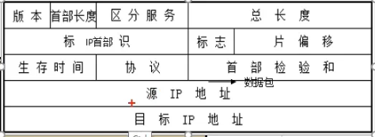
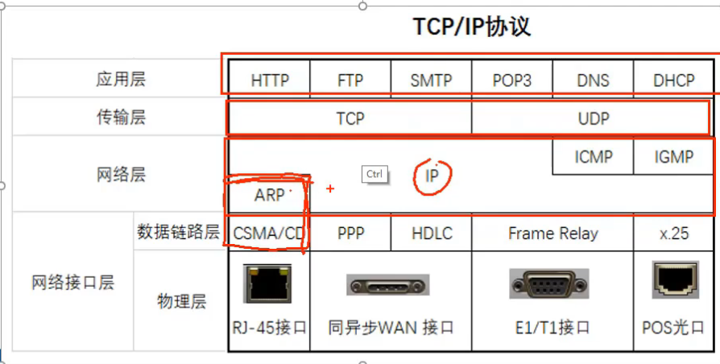
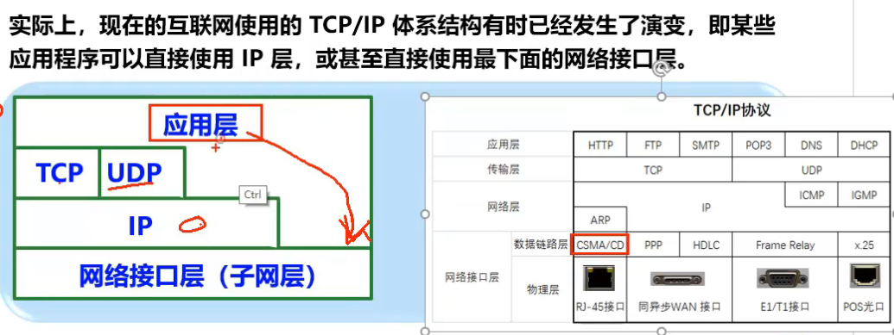

> 本笔记来自于
>
> https://www.bilibili.com/video/BV1gV411h7r7/?p=1&vd_source=61f56e9689aceb8e8b1f51e6e06bddd9

## 1. 计算机网络的定义与特点

### 1.0 网络的历史因素

网络包括电信网，有线电视网与Internet

电信网通常用于手机，在一个区域内拥有一个运营商以及多个基站，它使用基站覆盖一片区域接受手机信号，发送给运营商，运营商使其能够接入Internet。

有线电视网同理，它主要在中国早期在小区中布置光纤，使得电视能够接受信号。同时，电视也可以通过有线电视网络与Internet的接口上网（十分少见）

> 拨号上网就是通过电信网与Internet接口来上网的

### 1.1 计算机网络

### 定义

由通用可编程硬件互联而成，这些可编程硬件能够用来传送多种不同类型的数据

#### 特点

* 连通性(Connectivity)

  * 使得上网用户之间可以交换信息（数据，音频，视频）

* 共享(Sharing)

  * 资源共享：包括信息共享（云存储），软件共享（云服务）与硬件共享（局域网的打印机）

  

### 网络

一个由若干个机器喝一个集线器的组合称为网络

而所有网络与路由器，网络之间的链接形成了互联网

> **集线器**的目的是将内部网络上所有[网络设备](https://zhida.zhihu.com/search?q=网络设备)连接在一起。它具有多个端口，可以接受来自网络设备的[以太网](https://zhida.zhihu.com/search?q=以太网)连接。集线器不过滤任何数据、也不知道该将数据发到什么地方。集线器唯一知道的是设备何时连接到其端口之一。因此，**当数据包到达端口之一时，它将被复制到所有其他端口**。因此，集线器上所有设备都可以看到数据包。数据包进入一个端口，然后集线器通过连接的设备将数据重新广播到每个端口。因此，即使计算机A只想和计算机B通信。其他计算机仍将[接收数据](https://zhida.zhihu.com/search?q=接收数据)。这不仅会引起**安全问题**，还会造成不必要的网络流量从而浪费带宽。
>
> **交换机**与集线器很类似，不过更“聪明”一点。它可以识别已连接设备的[物理地址](https://zhida.zhihu.com/search?q=物理地址)，并将这些地址（称为Mac地址）存储在[路由表](https://zhida.zhihu.com/search?q=路由表)中。因此，当数据包发送到交换机时，它们仅路由到预期的目标端口。这是交换机与集线器的主要区别。交换机更有优势、因为它们减少了网络上任何不必要的流量。
>
> 集线器和交换机用于在本地网络内交换数据，比如在家庭网络或工作[专用网络](https://zhida.zhihu.com/search?q=专用网络)中。它们不用于在自己的网络之外（Internet）共享数据。为了在网络之外共享数据，设备需要能够读取IP地址、这也是路由器大显身手之处。
>
> **路由器**根据设备IP地址，从一个网络到另一个网络路由/重定向数据。当接收到一个数据包时，路由器会检查数据的IP地址，并确定该数据是用于自己网络还是其他网络。
>
> 如果路由器确定该数据包用于其自己网络，它将接收该数据包；如果不是，它将将数据包发送给其他网络。所以路由器是一个网络网关。

### 互联网

互联网特指Internet，是由数量极大的各种计算机网络互联起来形成的互连网络。使用TCP/IP协议族作为通信规则。

互联网代表网络的网络，也就是每个小集群网络通过路由器互联的大网络。

> 通常来说，遵循TCP/IP，利用路由器将硬件连接的成为Internet
>
> 而如果不指定使用TCP/IP则称为internet

### 互联网的三个阶段

#### 第一阶段

#### 第二阶段

政府主导

主干网均匀分布节点，地区网选择就近的主干网连接。

#### 第三阶段

企业运营：国内ISP有移动电信联通

ISP与上面相同，构建大的主干网然后层层建立节点，细分到一个市/区

更进一步的，为了让不同地区的信息交换不频繁的通过主干ISP，通常会架设一些IXP用于子级的快速交换，类似DMA

>  ISP的盈利通常来源于其下级
>
> 例如，对于一个二级节点，其搭设与维护成本需要1000
>
> 此时，有四个三级节点接入二级节点，每一个节点需要缴费300才能接入。
>
> 对于每个节点，300<1000更划算
>
> 对于二级节点，利润就来源于这1200

> 对于网速百兆带宽，通常意味着与本地ISP的连接是百兆，而非与所有ISP节点都是百兆。其真实带宽最大为路径上最低带宽（因为多用户共享）

### 互联网的组成

互联网包括边缘部分和核心部分

* 边缘部分通常是数据包的终点和请求的起点
  * 边缘部分的设备通常称为**端系统**
  * 端系统之间差别很大，可能是PC，可能是能够上网的手机，也可能是一个网络摄像头，还有可能是一个大型计算机集群
  * 端系统的拥有者可以是个人或者单位，也可以是ISP
* 核心部分包括大量的网络（也就是若干机器和一个集线器的集合）以及路由器，这部分为边缘部分提供连通性和交换

### 互联网边缘部分通信：端系统的通信

端系统的通信，或者说两个主机之间的通信，更准确的说就是两个主机的某个程序之间的通信，本质上是两个进程之间的通信。

端系统之间的通信方式有两种

* **客户-服务器方式(Client/Service)**，简称C/S**（大多数）**

  * 服务器通常代表一个服务供应商，服务供应商统一处理所有客户请求。

    服务器拥有一种专门用来提供某种服务(web,DNS,ftp,SMTP,pop3)的程序，可同时处理多个客户请求

    系统启动后自动调用服务程序，不断运行被动等待并接受来自各地客户的请求。作为request的请求端，需要强大的硬件和操作系统（调度）支持。

  

  * 客户通常是**服务的请求方**

    客户通过客户端软件（浏览器或是QQ客户端）向服务器发出请求，客户软件被用户调用后运行，在打算通信时主动向服务器发起通信（请求服务）。**客户程序必须知道服务器程序地址（IP地址）**（对于网页，通常将网址解析为IP地址之后才能访问）

  > 服务请求方和服务提供方都要使用网络核心部分所提供的服务

  注意，客户和服务器不是指的**主机属性**，**而是指的进程/应用属性**。一个主机可以同时承担客户与服务器的职责。

  

* **对等方式P2P(Peer to Peer)**

  

  考虑这么一个情况，F从E下载了70%

  C从E和F下载了40%

  D从ECF下载

  在这个下载的流程中，F既是客户（从E下载）也是服务提供者（给C下载其已有部分），这就是P2P

  因为其下载路径多了，下载的请求分散了，因此能够获得更快的平均速度。这也就是人越多下载越快（避免了源带宽过于拥挤）

  P2P的每一个节点地位对等，**本质上仍然是使用C/S的方式，只不过并没有区分客户软件和服务软件**。

### 互联网核心部分通信

==**网络核心部分最重要的功能是通过路由器实现分组交换(packet switching)，其任务是转发收到的分组**==

网络的核心部分要向网络边缘中大量主机提供连通性，使得边缘部分的任何一个主机都能够向其他主机通信。

#### 网络基础结构

> 一个网络指的是，多台主机通过接线机进行信息交换的一个集合。网线与网卡接口相连，并在集线器汇聚。网络的主机之间因为**物理距离较近**所以可以直接使用网线连接。
>
> 对于距离较远，不能直接使用网线连接的网络（中的主机），通常使用路由器。
>
> 路由器是连接网络的设备，接受不同网络的接入，并调度数据包
>
> 
>
> 
>
> 现代不使用集线器，而使用交换机来构成网络，但是路由器的功能不变
>
> 
>
> 交换机，集线器与路由器的具体定义在[网络](###网络)中有提到

#### 通讯：信息交换方式

信息交换方式主要包括

##### **电路交换**

电路交换通过实体线直接连接通信。严格的来说，是指的**通讯前需要建立电路连接**的方式。从通信资源分配角度俩看，就是按某种方式动态的分配传输线路资源。因此交换机也是电路交换。

==建立连接后，发送的数据包不需要写地址，发出的数据包直接进入目标==

如果完全使用电路交换构建Internet，那么在BA的连接建立之后，其他主机想与A通信，则必须断开AB的连接。换句话说，如果你想同时用qq和上网，你只能选一个。甚至网页都不能多开同时搜索。

##### **分组交换**

假设对于一个很大的电影

* 在发送端，先将较长的报文分割成短的固定长度数据段，称为分组。

* **为分组添加首部，包含目的地址和源地址等控制信息**

* 分组交换网中节点路由器根据收到的数据段的地址信息转发到下一个节点交换机

* **每个分组在互联网中独立选择传输路径**

* 使用**存储转发**，分组到达目的地

  所谓存储转发是指的路由器处理分组的一个做法

  1. 把收到的分组放入缓存
  2. 查找转发表，找到转发目标端口

* 分组根据源信息重新拼接

优点：分组交换动态分配传输带宽，**逐段占用通信链路**，使得看起来能够形成多个进程同时接网而非独占的状态。同时，分组交换的路径不固定，**每一个分组都有多条路径选择**。以分组为传送段位可以**不建立连接就发送分组**。

缺点：在路由器处分组转发需要排队，增加时延。同时，增加了首部信息，传输了更多数据（增加了开销）

##### 报文交换

就是不分组的分组交换

##### 总结

电路交换请求建立连接然后直接专线传输

报文交换直接整体数据传输给下一个节点

分组交换切割文本并传输

报文交换到分组交换更像流水线优化，隐藏了传输延迟。

电路交换适用于传送时间远大于建立连接时间（也就是打电话）

互联网核心部分采用了**分组交换技术**

### 网络的分类

#### 按性质

**广域网：**直接从运营商接入

**局域网**：从广域网接入

**个人区域网：**从广域网或者局域网接入

#### 按网络使用者

**公用网**：按规定缴纳费用的人都可以使用

**专用网**：特殊业务工作需要而建造的网络

#### 接入网

接入网(AN,Access Network)，又称为本地接入网或者居民接入网

AN专门将用户接入互联网，既不属于互联网核心部分也不属于边缘部分

通常来说，接入网是**从某个用户端系统到互联网的第一个路由器（边缘路由器）之间的一种网络**

## 2. 计算机网络的性能指标

### 2.1 速率

速率为`bit/s`，另外还有`kbit/s,Mbit/s,Gbit/s`

速率通常是发送端和接收端每秒平均发送bit的数据量，并不严格代表线路中的数据量，因为数据按包发送，包与包之间可能有空隙

### 2.2 带宽

与通常信号带宽（信号的最高频率与最低频率之差）不同，计算机的带宽代表每秒钟能够传递多少bit

其实很相似，因为频率越高，高低电平跳变越快，数据就越多

### 2.3 吞吐量

单位时间内通过某个接口的数据量（同时算上行下行）

一般认为，网卡带宽100M指的是发送接收数据的带宽都为100M，此时最大吞吐为200M

### 2.4 时延

时延指的是数据（报文，分组，比特）从网络一端到另一端的时间

网络时延包括如下几个部分

* **发送时延：**数据从发送端完整的发送出来的时间（数据从发送端出来的时间）

  也就是从发送数据帧的第一个bit算起，到最后一个bit发送完毕所需时间
  $$
  发送时延=\frac{数据帧长度(bit)}{发送速率(bit/s，也就是带宽)}
  $$
  带宽越高，发送时间越少

* **传播时延（无法改变）**

  数据帧在信道上的传输时间，物理定律限制
  $$
  传播时延=\frac{信道长度（米）}{信号的传播速度（米/秒）}
  $$
  即为某一个数据帧从出发到到达的时间

  

* **处理时延与排队时延**

  代表在路由器中数据包转发时排队与计算的时延

对于高速网络链路，提高的仅仅是发送速率而非传播速率

### 2.5 时延带宽积

时延带宽积的作用通常是看线路上充分利用时，其充满了多少比特

带宽可以看作bit密度，而时延可以看作线路长度的一个体现

### 2.6 利用率

信道利用率和网络利用率

信道利用率指的是在某一个信道中，单位时间中传输数据的时间

网络利用率针对网卡，它代表单位时间所有信道传输时间之和与信道数量的比值

## 3. 计算机网络体系结构

计算机网络的功能包括分发，共享，解码，寻址等等，每个公司在初期实现了不同结构不同分层的计算机网络数据处理结构，但是具有不同结构的计算机网络不能方便的相互通信。

因此，OSI被提出了，但是因为没有商业驱动力，太过复杂，运行效率低，层次划分不合理以及功能重复很快被淘汰了。

TCP/IP协议取代了OSI。

### 3.1 协议与四层划分

#### 什么是协议

#### 四层的协议分层

##### 应用层

**应用层传输的是文件**

应用层是数据流量最大的一个层

其主要的作用就是将要发送的数据包存入缓存

##### 传输层

**传输层传输的是段，字段**

传输层主要负责发送和接收来自网络的数据包，并且处理乱序，丢包等问题

丢包主要来源于，路由器的缓存压力过大，可能会直接删除（不处理）某些包

这部分拥有**可靠传输协议**

#####  网络层

**网络层传输的是数据包**，网络层为传输层提供服务

数据包就是传输层的“段”加上**网络层的地址**

##### 数据链路层

**数据链路层用于寻找数据链路（中转的路由器）**

一个数据包包括`数据，源IP地址，目标IP地址`

此时，为了在中转路由器之间发送，还需要添加数据链路的信息，也就是**目标MAC和源MAC**

这个包每到达一个设备，首先判断是否是自己的目标MAC，然后删除数据链路信息获得

`数据，源IP，目标IP`的纯数据包进入缓存

路由器根据目标IP地址选择链路（也就是下一个路由器）

在发送时，重新添加源MAC（自己）和目标MAC（其他路由器）

##### 协议作用范围

**应用层协议**：发送端和接收端的应用程序

**传输层协议**：发送端的计算机和接收端的计算机上

**网络层协议**：发送端，接收端以及网络中的路由器。发送端接收端以及路由器都会处理目标IP地址。

**数据链路层协议**：主要作用范围在路由器之间，主要处理源MAC地址与目标MAC地址。

##### 各层的主要功能

主要功能包括

1. **传输层：**建立连接和释放连接。毕竟指明了目标IP地址。

2. **非顶层/除了应用层的其他层**：端口复用，具体来说，

   **在发送端**。应用层的多个协议(http,ftp)可能都需要tcp协议，他们将会使用不同的端口标记，使用同一个tcp协议传输。

   这被称为发送端的几个高层会话复用一条低层连接。

   **在接收端**再进行分用。

   同理，对于更低的网络层协议，通过IP号来区分不同的传输层协议

   数据链层，通过协议字段区分上面是IPv4协议还是IPv6协议

3. **传输层**：分段和重装

   指的是发送端将数据块分包，然后再接收端还原

4. **传输层**：流量控制，发送端的发送速率必须使得接收端来得及接受，如果太快会造成丢包。

5. **差错控制**：相应层次对等方通信更加可靠，通常使用TCP协议实现差错控制。

   具体来说

   * 所有的传输涉及层，包括数据链路层，传输层，网络层有差错检查。
     * **数据链路层**和**网络层**发现差错则丢弃
     * **传输层**发现差错则重传

   

### 协议分类

包括OSI的体系结构，TCP/IP的四层协议以及折中的五层协议

其中，TCP/IP的应用层打包了OSI的应用层，表示层，会话层

### 3.2 TCP/IP协议

TCP/IP协议代表了一组协议，他们可以自由组合

 **应用层：**

1. **HTTP (HyperText Transfer Protocol)**
   - **甲方**：客户端浏览器或应用程序
   - **乙方**：Web服务器
   - **作用**：用于从Web服务器传输超文本数据到客户端，通常用于浏览网页。
2. **FTP (File Transfer Protocol)**
   - **甲方**：FTP客户端
   - **乙方**：FTP服务器
   - **作用**：用于在客户端和服务器之间传输文件。
3. **SMTP (Simple Mail Transfer Protocol)**
   - **甲方**：邮件客户端或发送邮件的邮件服务器
   - **乙方**：接收邮件的邮件服务器
   - **作用**：用于在邮件服务器之间传输邮件，或从邮件客户端发送邮件到服务器。
4. **DNS (Domain Name System)**
   - **甲方**：DNS客户端（通常是解析器）
   - **乙方**：DNS服务器
   - **作用**：将域名解析为IP地址，以便客户端能够访问服务器。
5. **POP3 (Post Office Protocol 3)**
   - **甲方**：邮件客户端
   - **乙方**：邮件服务器
   - **作用**：用于从邮件服务器下载邮件到本地客户端。

 **传输层：**

1. **TCP (Transmission Control Protocol)**
   - **甲方**：传输数据的应用程序
   - **乙方**：接收数据的应用程序
   - **作用**：提供**可靠**的、有序的数据传输服务，确保数据完整无误地传输。
2. **UDP (User Datagram Protocol)**
   - **甲方**：传输数据的应用程序
   - **乙方**：接收数据的应用程序
   - **作用**：提供不可靠的、无连接的数据传输服务，适用于要求快速传输但不要求高可靠性的应用。

**网络层：**

1. **ARP (Address Resolution Protocol)**
   - **甲方**：发送ARP请求的主机
   - **乙方**：回应ARP请求的主机
   - **作用**：将IP地址解析为MAC地址，用于局域网内通信。
2. **IP (Internet Protocol)**
   - **甲方**：源主机
   - **乙方**：目的主机
   - **作用**：负责在网络中路由和传输数据包。
3. **ICMP (Internet Control Message Protocol)**
   - **甲方**：发送ICMP请求的设备
   - **乙方**：回应ICMP请求的设备
   - **作用**：用于发送错误消息和操作信息，例如“ping”命令。
4. **IGMP (Internet Group Management Protocol)**
   - **甲方**：主机
   - **乙方**：路由器
   - **作用**：用于在网络中管理和控制多播组成员。

**数据链路层：**

1. **CSMA/CD (Carrier Sense Multiple Access with Collision Detection)**
   - **甲方**：网络节点
   - **乙方**：其他网络节点
   - **作用**：用于检测网络中是否有其他节点在发送数据，以避免数据碰撞。
2. **PPP (Point-to-Point Protocol)**
   - **甲方**：连接到互联网的用户
   - **乙方**：ISP（互联网服务提供商）
   - **作用**：用于通过电话线或其他点对点连接传输数据。
3. **X.25**
   - **甲方**：用户终端设备
   - **乙方**：X.25网络
   - **作用**：用于在广域网上可靠地传输数据。
4. **HDLC (High-Level Data Link Control)**
   - **甲方**：网络节点
   - **乙方**：网络节点
   - **作用**：一种同步数据链路层协议，用于可靠的数据传输。
5. **帧中继 (Frame Relay)**
   - **甲方**：连接到帧中继网络的设备
   - **乙方**：帧中继网络
   - **作用**：用于快速而高效地传输数据帧，主要用于广域网。

### 3.3 协议的封装过程：以TCP/IP为例

举一个例子，**在应用层**，HTTP协议封装了一个==报文==，其中包括它所需要的数据与抬头

发送到**传输层**之后，为了达成可靠传输，需要封装一层TCP协议，也就是为报文增加TCP首部，**形成段**

> TCP首部

将段发送给**网络层**之后，使用IP协议添加**IP首部**，封装为==数据包==

数据包发送给数据链路层，每个路由器计算目标MAC地址和源MAC地址即可，添加的部分称为以太网首部

总体来说

对于一个五层结构，在数据链路层之下还有一个物理层，因此也可以说在数据链路层完成封装之后，数据变成电信号光信号把bit流传送到物理媒体

### 3.4 OSI参考模型

#### OSI七层模型

简单来说：

* **应用层**协议规定了

  * 应用程序之间（服务端-客户端）通讯的规范
    * 包括命令的范围
    * 命令的顺序
    * 出错时状态代码的定义
    * 报文格式

* **表示层**规定了信息与二进制的转换

  * 包括，将该文字代表的国家语言编码为二进制
  * 压缩，加密等

* **会话层**主要用于建立服务器和客户端连接

  简单来说，以同一个局域网内的共享为例，在第一次请求连接到某主机时，一般会要求输入密钥，在完成输入密钥之后认为连接已经共享，此时可以通过`net use`发现该会话在关闭窗口后任然存在。此时在第二次请求连接时就能直接连接上，不需要密钥。这就是会话层的作用，它完成了两个端的连接。

  > 会话层管理是只要用户不注销，就会一直保持
  >
  > **不是所有软件都有会话层**

* **传输层**：负责可靠传输

  * 发送端：分段，添加[TCP首部](###3.3 协议的封装过程：以TCP/IP为例)，发送

  * 接收端：将段在缓存中排序，处理丢包，并发送给应用层

  > 接收端的传输层还有流量控制的作用，具体来说，当发送端发送速度过快时，接收端会发送指令通知发送端慢点发，等其处理完成。由此防止缓存满了频繁丢弃。

  

* **网络层**：负责规划网络地址，规定网络路由设备，使得数据包发到目标地址

* **数据链路层**：负责数据包在路由器之间的传输

  数据链路层只检查数据是否有错误（例如强烈电磁场导致波形紊乱），不实现可靠传输。如果有错误就会丢弃。

  > 大多数数据链路层不负责可靠传输，不过协议就是约定，仍然存在部分特殊的数据链路层协议，例如x.25，它在发现数据错误后后要求包重新发送，是可靠传输协议

* **物理层**：规定了网络接口标准，例如网线的八绞线

#### 基于七层模型的网络排错

从底层到高层

* 检查网线是否接好（物理层）

* 数据链路层

  * MAC地址冲突：出场后MAC地址被修改导致出问题
  * 划到不同的VLAN
  * ADSL拨号的账号密码错误
  * 接口速率不一致：千兆网口配百兆网线

* 网络层：IP地址，子网掩码，网关是否正确（网络层首部信息问题）

  

  > 包括
  >
  > ping 默认网关测试是否能连接网关
  >
  > ping 一个网址测试DNS服务器是否能正常解析域名
  >
  > telnet 一个网址判断是否被允许访问端口80（web服务）

* 应用层：应用程序配置错误的IE代理

#### OSI模型与网络安全

* 物理层安全：服务器接口侵入

* 数据链路层安全：

  WIFI密码，ADSL密码，交换机接口配置MAC地址绑定，划分VLAN

* 网络层安全：

  windows防火墙设置了入栈规则，仅有符合条件的数据包才能发送/接收

* 传输层安全：TCP连接攻击，SYN攻击，LAND攻击

* 应用层安全：代码SQL注入漏洞

#### 实体，协议，服务访问点

实体(entity)标识任何可发送或者接收信息的硬件或者软件进程

协议代表两个对等实体（发送端的A层和接收端的A层）的通信规则集合

在协议的控制下，两个对等实体间的通信使得本层能够向上一层提供服务

同时，本层协议还需要使用下层提供的服务

服务访问点指的就是需要处理协议的地方（拥有协议的层）

### 3.5 TCP/IP体系结构

在每一个路由器，网络接口层

* 将电信号转换为二进制
* 去除数据链路层首部
* 发送包给网络层

网络层根据目标IP选择下一个路由器，通知网络接口层

网络接口层封装目标MAC

至于IO口复用，传输层通过端口号来区分应用层层协议，而网络层通过协议号来区分传输层协议

